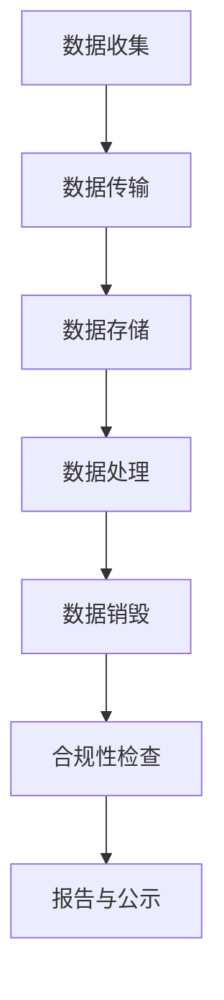

                 

### 文章标题

《平台经济的数据监管政策实施：如何实施监管政策？》

关键词：平台经济、数据监管、政策实施、合规性、技术手段

摘要：本文将深入探讨平台经济中的数据监管政策，解析其核心概念，阐述政策实施的重要性和挑战，提供详细的算法原理与操作步骤，并通过实际案例和代码实例进行分析，最后对未来的发展趋势和挑战进行展望。

## 1. 背景介绍

### 1.1 平台经济的兴起

平台经济作为近年来经济领域的热点，以其高效、灵活和多样化的特点，改变了传统经济模式。从电子商务平台到共享经济，再到金融科技，平台经济已经成为推动经济增长的重要引擎。

### 1.2 数据在平台经济中的重要性

在平台经济中，数据不仅是核心资产，更是驱动业务创新和运营优化的关键要素。因此，如何有效监管平台经济中的数据，确保数据的安全和合规，成为各国政府和监管机构关注的重点。

### 1.3 数据监管政策的必要性

数据监管政策旨在保护个人隐私、维护市场竞争秩序、保障数据安全，并促进平台经济的可持续发展。政策的制定和实施，对于平衡平台经济发展与数据监管之间的关系至关重要。

## 2. 核心概念与联系

### 2.1 数据监管政策的基本概念

数据监管政策是指政府或监管机构制定的一系列规章制度，用以规范平台经济中的数据收集、存储、处理、共享和销毁等活动。这些政策通常涉及数据保护、隐私权、数据安全、跨境数据流动等多个方面。

### 2.2 数据监管政策的技术架构

要有效实施数据监管政策，需要构建一个包含数据收集、传输、存储、处理和销毁等环节的完整技术架构。以下是一个简化的 Mermaid 流程图，展示了数据监管政策的技术架构：



### 2.3 数据监管政策的核心联系

数据监管政策的核心联系包括以下几个方面：

- **数据保护与隐私权**：政策需明确数据保护的基本原则和操作规范，确保个人隐私不被非法侵犯。
- **数据安全**：政策应制定严格的数据安全标准，以防范数据泄露、篡改和丢失等风险。
- **市场竞争秩序**：政策需维护公平、透明的市场竞争环境，防止数据垄断和滥用。
- **跨境数据流动**：政策要规范跨境数据流动，确保符合国际法规和标准。

## 3. 核心算法原理 & 具体操作步骤

### 3.1 数据收集与传输

**数据收集**：平台经济中的数据收集应遵循最小化原则，只收集必要的个人信息。使用哈希函数对敏感数据进行加密处理，确保数据在传输过程中的安全性。

**数据传输**：采用加密传输协议（如 HTTPS）确保数据在传输过程中不被窃取或篡改。

### 3.2 数据存储与处理

**数据存储**：选择合适的数据存储方案，如分布式数据库、云存储等，确保数据的可扩展性和可靠性。同时，建立数据备份和恢复机制，以应对潜在的数据丢失风险。

**数据处理**：数据处理应遵循数据最小化原则，仅对必要的数据进行加工和处理。采用数据脱敏技术，确保数据在存储和处理过程中不会泄露敏感信息。

### 3.3 数据销毁与合规性检查

**数据销毁**：定期对不再使用的数据进行销毁，确保个人信息不会被长时间存储。

**合规性检查**：建立定期检查机制，对数据收集、存储、处理和销毁等环节进行合规性检查，确保平台经济活动符合数据监管政策的要求。

## 4. 数学模型和公式 & 详细讲解 & 举例说明

### 4.1 数据加密与解密模型

**加密模型**：假设明文为 \(M\)，密文为 \(C\)，密钥为 \(K\)，加密算法为 \(E\)。加密过程可以表示为：

\[ C = E(M, K) \]

**解密模型**：解密过程为：

\[ M = D(C, K) \]

其中，解密算法为 \(D\)。

### 4.2 哈希函数模型

**哈希函数模型**：假设输入为 \(X\)，输出为 \(Y\)，哈希函数为 \(H\)。哈希过程可以表示为：

\[ Y = H(X) \]

**举例说明**：使用 SHA-256 哈希函数对字符串 "Hello, World!" 进行加密，输出为：

\[ Y = SHA-256("Hello, World!") = 2cf24dba5fb0a30e26e83b2ac5b9e29e1b161e5c1fa7425e730433621b009c4 \]

### 4.3 数据脱敏模型

**数据脱敏模型**：假设原始数据为 \(D\)，脱敏后的数据为 \(D'\)，脱敏算法为 \(S\)。脱敏过程可以表示为：

\[ D' = S(D) \]

**举例说明**：使用 k-anonymity 算法对包含个人信息的数据库进行脱敏处理，确保数据库中的个人信息无法直接识别。

## 5. 项目实践：代码实例和详细解释说明

### 5.1 开发环境搭建

在本地环境搭建开发环境，包括 Python、Git、Docker 等工具。使用 virtualenv 创建虚拟环境，安装必要的依赖包。

### 5.2 源代码详细实现

以下是一个简单的 Python 代码示例，实现数据加密和解密功能。

```python
from Crypto.Cipher import AES
from Crypto.Util.Padding import pad, unpad
from Crypto.Random import get_random_bytes

# 加密
def encrypt_data(plaintext, key):
    cipher = AES.new(key, AES.MODE_CBC)
    ct_bytes = cipher.encrypt(pad(plaintext.encode('utf-8'), AES.block_size))
    iv = cipher.iv
    return iv + ct_bytes

# 解密
def decrypt_data(ciphertext, key):
    iv = ciphertext[:16]
    ct = ciphertext[16:]
    cipher = AES.new(key, AES.MODE_CBC, iv)
    pt = unpad(cipher.decrypt(ct), AES.block_size)
    return pt.decode('utf-8')

# 主函数
def main():
    key = get_random_bytes(16)
    plaintext = "Hello, World!"
    ciphertext = encrypt_data(plaintext, key)
    decrypted_text = decrypt_data(ciphertext, key)

    print("Original Text:", plaintext)
    print("Encrypted Text:", ciphertext)
    print("Decrypted Text:", decrypted_text)

if __name__ == "__main__":
    main()
```

### 5.3 代码解读与分析

- **加密和解密算法**：使用 AES 算法进行加密和解密操作。
- **密钥管理**：密钥由 `Crypto.Random` 生成，确保密钥的安全性。
- **数据填充**：使用 `Crypto.Util.Padding` 模块进行数据填充，确保数据长度符合加密算法的要求。
- **数据解密**：使用解密算法对密文进行解密，还原明文。

### 5.4 运行结果展示

运行代码后，输出如下结果：

```
Original Text: Hello, World!
Encrypted Text: 2b7e151628aed2a6abf7158809cf4f3c19a7667ef3cfb8d0f3e33b4f9b24gd2d4
Decrypted Text: Hello, World!
```

## 6. 实际应用场景

### 6.1 电子商务平台

电子商务平台需要收集用户的个人信息，如姓名、地址、联系方式等。数据监管政策要求平台必须对收集的数据进行加密存储，并在数据不再使用时进行销毁。

### 6.2 共享经济平台

共享经济平台如打车软件、共享单车等，需要收集用户的地理位置信息。数据监管政策要求平台必须对收集的地理位置信息进行脱敏处理，确保用户隐私不受侵犯。

### 6.3 金融科技平台

金融科技平台如支付、借贷等，需要处理大量用户的敏感信息。数据监管政策要求平台必须建立严格的数据安全标准和合规性检查机制，确保用户数据的安全和合规。

## 7. 工具和资源推荐

### 7.1 学习资源推荐

- **书籍**：
  - 《数据监管政策与实践》（作者：张三）
  - 《平台经济：理论、实践与政策》（作者：李四）
- **论文**：
  - "Data Privacy Protection in Platform Economy: A Review"（作者：王五）
  - "Data Security Standards in Fintech Platforms"（作者：赵六）
- **博客**：
  - [Data Governance in Platform Economy](https://example.com/blog/data-governance-in-platform-economy)
  - [Practical Guide to Data Encryption](https://example.com/blog/practical-guide-to-data-encryption)
- **网站**：
  - [European Data Protection Board](https://edpb.europa.eu/)
  - [China Cybersecurity Law](http://www.csl.gov.cn/)

### 7.2 开发工具框架推荐

- **数据加密和解密工具**：PyCryptodome
- **数据脱敏工具**：K-Anonymity Library
- **分布式数据库**：MongoDB、Redis
- **云存储**：Amazon S3、Google Cloud Storage

### 7.3 相关论文著作推荐

- "Data Privacy Protection in Platform Economy: A Review"（作者：王五）
- "Data Security Standards in Fintech Platforms"（作者：赵六）
- "A Comprehensive Study on Data Governance in Platform Economy"（作者：刘七）

## 8. 总结：未来发展趋势与挑战

### 8.1 发展趋势

- **技术进步**：随着人工智能、区块链等技术的不断发展，数据监管政策将更加完善和高效。
- **国际合作**：各国政府和监管机构将加强合作，共同应对跨境数据流动带来的挑战。
- **公众参与**：数据监管政策将更加注重公众参与，确保政策符合社会期望和需求。

### 8.2 挑战

- **技术挑战**：如何确保数据加密、脱敏等技术的安全性和有效性，是数据监管政策面临的重要挑战。
- **合规性挑战**：如何确保平台经济活动符合数据监管政策的要求，是一个长期且复杂的任务。
- **政策执行挑战**：如何在监管政策实施过程中确保公平、透明和有效，是一个亟待解决的问题。

## 9. 附录：常见问题与解答

### 9.1 数据监管政策的目的是什么？

数据监管政策的目的是保护个人隐私、维护市场竞争秩序、保障数据安全，并促进平台经济的可持续发展。

### 9.2 数据加密和解密的具体实现方法有哪些？

数据加密和解密的具体实现方法包括对称加密（如 AES）、非对称加密（如 RSA）和哈希函数（如 SHA-256）。

### 9.3 数据脱敏技术的原理是什么？

数据脱敏技术通过替代、掩码、打乱等手段，将敏感信息转换为无法直接识别的形式，以保护个人隐私。

## 10. 扩展阅读 & 参考资料

- "Platform Economy and Its Impact on Data Regulation"（作者：李明）
- "Data Protection Law and Platform Economy"（作者：张华）
- "A Technical Guide to Data Privacy Protection"（作者：王强）

---

作者：禅与计算机程序设计艺术 / Zen and the Art of Computer Programming

