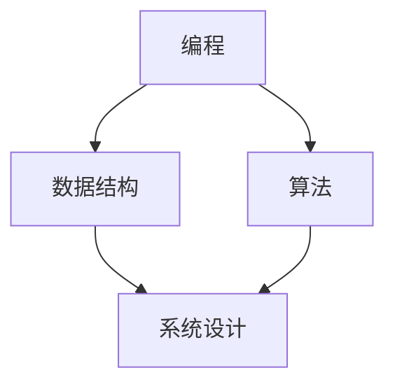

                 

### 文章标题：2024年京东社招技术面试题集锦

> 关键词：京东社招、技术面试、面试题、编程、数据结构、算法、系统设计

> 摘要：本文将围绕2024年京东社招技术面试的常见问题，详细解析编程、数据结构、算法和系统设计等方面的核心知识点，帮助应聘者全面备战京东社招技术面试。

### 1. 背景介绍

京东作为中国领先的电商企业，其社招技术面试在业界享有盛誉。每年，京东都会吸引大量技术人才参与面试，而面试难度也相应较高。为了帮助广大应聘者更好地准备京东社招技术面试，本文将总结和分析2024年京东社招技术面试中常见的面试题目，并给出详细的解题思路和答案。

本文将分为以下几个部分：

- **背景介绍**：阐述京东社招技术面试的重要性及本文的结构。
- **核心概念与联系**：介绍编程、数据结构、算法和系统设计等核心概念，并通过Mermaid流程图展示其关联关系。
- **核心算法原理与具体操作步骤**：详细讲解常见算法的原理和具体操作步骤。
- **数学模型和公式**：介绍相关数学模型和公式，并提供详细讲解和举例说明。
- **项目实践**：通过代码实例展示项目的开发过程，并进行详细解读和分析。
- **实际应用场景**：分析常见面试题在实际应用场景中的运用。
- **工具和资源推荐**：推荐学习资源和开发工具框架，助力应聘者提升技术水平。
- **总结**：总结未来发展趋势与挑战。
- **附录**：常见问题与解答。
- **扩展阅读**：提供相关参考资料，拓展阅读视野。

### 2. 核心概念与联系

在京东社招技术面试中，编程、数据结构、算法和系统设计是核心考点。为了帮助应聘者更好地理解这些概念，我们将通过Mermaid流程图展示它们之间的联系。



- **编程**：编程是利用计算机语言实现特定功能的过程。编程能力是技术面试的核心要求，包括语法、编程范式、编程规范等方面。
- **数据结构**：数据结构是用于存储和管理数据的方法。常见的有数组、链表、树、图等。数据结构的选择直接影响算法的性能。
- **算法**：算法是解决问题的方法步骤。常见的有排序、查找、图算法、动态规划等。算法的复杂度和效率是面试官关注的重点。
- **系统设计**：系统设计是构建系统的过程，包括需求分析、架构设计、模块划分等。系统设计能力是衡量应聘者是否能够胜任高难度项目的关键。

### 3. 核心算法原理与具体操作步骤

在京东社招技术面试中，常见算法题目包括排序、查找、图算法和动态规划等。下面我们将分别介绍这些算法的原理和具体操作步骤。

#### 3.1 排序算法

排序算法是面试中经常出现的题目，常见的排序算法有冒泡排序、选择排序、插入排序、快速排序、归并排序和堆排序等。

- **冒泡排序**：通过多次交换相邻的未排序元素，将最大（或最小）的元素逐步“冒泡”到序列末尾。
- **选择排序**：每次从剩余的未排序元素中选出最小（或最大）的元素，放到序列的起始位置。
- **插入排序**：将未排序元素插入到已排序序列中的适当位置，直到整个序列有序。
- **快速排序**：通过一趟排序将序列划分为两部分，其中一部分的所有元素都比另一部分的所有元素小，然后递归地对这两部分进行快速排序。
- **归并排序**：将待排序的序列分成若干个子序列，分别进行排序，再将排好序的子序列合并成一个完整的序列。
- **堆排序**：利用堆这种数据结构进行排序。堆是一个近似完全二叉树的结构，并同时满足堆积的性质：即子节点的键值或索引总是小于（或大于）它的父节点。

具体操作步骤如下：

```python
# 以快速排序为例
def quick_sort(arr):
    if len(arr) <= 1:
        return arr
    pivot = arr[len(arr) // 2]
    left = [x for x in arr if x < pivot]
    middle = [x for x in arr if x == pivot]
    right = [x for x in arr if x > pivot]
    return quick_sort(left) + middle + quick_sort(right)
```

#### 3.2 查找算法

查找算法包括线性查找、二分查找和哈希查找等。

- **线性查找**：从序列的第一个元素开始，依次与给定值进行比较，直到找到或序列结束。
- **二分查找**：在有序序列中，每次将中间元素与给定值进行比较，根据比较结果确定下一轮查找的区间，直到找到或确定不存在。
- **哈希查找**：利用哈希函数将关键字映射到哈希表中的位置，直接访问对应位置的元素。

具体操作步骤如下：

```python
# 以二分查找为例
def binary_search(arr, target):
    left, right = 0, len(arr) - 1
    while left <= right:
        mid = (left + right) // 2
        if arr[mid] == target:
            return mid
        elif arr[mid] < target:
            left = mid + 1
        else:
            right = mid - 1
    return -1
```

#### 3.3 图算法

图算法包括深度优先搜索（DFS）和广度优先搜索（BFS）等。

- **深度优先搜索**：从起始节点开始，尽可能深地搜索图的分支。
- **广度优先搜索**：从起始节点开始，逐层搜索图的分支。

具体操作步骤如下：

```python
# 以DFS为例
def dfs(graph, node, visited):
    visited.add(node)
    for neighbor in graph[node]:
        if neighbor not in visited:
            dfs(graph, neighbor, visited)

# 以BFS为例
from collections import deque

def bfs(graph, start):
    visited = set()
    queue = deque([start])
    visited.add(start)
    while queue:
        node = queue.popleft()
        print(node)
        for neighbor in graph[node]:
            if neighbor not in visited:
                queue.append(neighbor)
                visited.add(neighbor)
```

#### 3.4 动态规划

动态规划是一种高效解决最优化问题的方法，其核心思想是将复杂问题分解为子问题，并通过子问题的最优解推导出原问题的最优解。

- **斐波那契数列**：递推关系式为F(n) = F(n-1) + F(n-2)，初始条件为F(0) = 0，F(1) = 1。
- **最长递增子序列**：给定一个序列，找出最长递增子序列的长度。

具体操作步骤如下：

```python
# 以斐波那契数列为例
def fibonacci(n):
    if n <= 1:
        return n
    dp = [0] * (n + 1)
    dp[1] = 1
    for i in range(2, n + 1):
        dp[i] = dp[i - 1] + dp[i - 2]
    return dp[n]

# 以最长递增子序列为例
def length_of_LIS(nums):
    if not nums:
        return 0
    dp = [1] * len(nums)
    for i in range(1, len(nums)):
        for j in range(i):
            if nums[i] > nums[j]:
                dp[i] = max(dp[i], dp[j] + 1)
    return max(dp)
```

### 4. 数学模型和公式

在技术面试中，数学模型和公式是解决问题的关键。下面我们将介绍一些常见的数学模型和公式，并提供详细讲解和举例说明。

#### 4.1 概率论

- **概率公式**：P(A ∩ B) = P(A) × P(B|A)
- **贝叶斯公式**：P(A|B) = P(B|A) × P(A) / P(B)

#### 4.2 线性代数

- **矩阵乘法**：C = A × B，其中C是结果矩阵，A和B是输入矩阵。
- **矩阵求逆**：A^(-1) = (1 / det(A)) × adj(A)，其中det(A)是矩阵A的行列式，adj(A)是矩阵A的伴随矩阵。

#### 4.3 微积分

- **导数**：f'(x) = lim(h → 0) [f(x + h) - f(x)] / h
- **积分**：∫f(x)dx = F(x) + C，其中F(x)是原函数，C是常数。

#### 4.4 举例说明

**概率论**：

假设一个袋子中有5个红球和3个蓝球，随机取出一个球，求取出红球的概率。

```python
# 红球的数量
red_balls = 5
# 蓝球的数量
blue_balls = 3
# 总球数
total_balls = red_balls + blue_balls
# 取出红球的概率
probability_of_red_ball = red_balls / total_balls
print("取出红球的概率为：", probability_of_red_ball)
```

**线性代数**：

计算矩阵A = [[1, 2], [3, 4]]的逆矩阵。

```python
# 矩阵A
A = [[1, 2], [3, 4]]
# 计算矩阵A的行列式
det_A = 1 * 4 - 2 * 3
# 计算矩阵A的伴随矩阵
adj_A = [[4, -2], [-3, 1]]
# 计算矩阵A的逆矩阵
inv_A = [1 / det_A] * 2
for i in range(2):
    for j in range(2):
        inv_A[i][j] *= adj_A[i][j]
print("矩阵A的逆矩阵为：", inv_A)
```

**微积分**：

计算函数f(x) = x^2在区间[1, 3]上的定积分。

```python
# 函数f(x) = x^2
def f(x):
    return x ** 2
# 计算函数f(x)在区间[1, 3]上的定积分
def integral(f, a, b):
    return (b - a) * (f(b) + f(a)) / 2
integral_value = integral(f, 1, 3)
print("函数f(x)在区间[1, 3]上的定积分为：", integral_value)
```

### 5. 项目实践：代码实例和详细解释说明

为了帮助应聘者更好地理解面试题的解答，下面我们将通过一个具体的代码实例进行详细解释说明。

#### 5.1 开发环境搭建

在开始编写代码之前，我们需要搭建一个适合编程的开发环境。这里我们以Python为例，介绍如何在Windows操作系统上搭建Python开发环境。

1. 下载Python安装包：从Python官网（https://www.python.org/）下载适用于Windows操作系统的Python安装包。
2. 安装Python：双击下载的安装包，按照安装向导进行安装，安装过程中选择“添加Python到环境变量”。
3. 验证安装：打开命令提示符，输入`python`命令，如果出现Python解释器提示符`>>>`，说明Python安装成功。

#### 5.2 源代码详细实现

以下是一个关于最长递增子序列的Python代码实例，用于求解给定序列的最长递增子序列长度。

```python
def length_of_LIS(nums):
    if not nums:
        return 0
    dp = [1] * len(nums)
    for i in range(1, len(nums)):
        for j in range(i):
            if nums[i] > nums[j]:
                dp[i] = max(dp[i], dp[j] + 1)
    return max(dp)

# 示例数据
nums = [10, 9, 2, 5, 3, 7, 101, 18]
# 求解最长递增子序列长度
length = length_of_LIS(nums)
print("最长递增子序列长度为：", length)
```

#### 5.3 代码解读与分析

1. **函数定义**：

   ```python
   def length_of_LIS(nums):
   ```

   定义一个名为`length_of_LIS`的函数，参数为输入序列`nums`。

2. **边界条件**：

   ```python
   if not nums:
       return 0
   ```

   如果输入序列为空，返回0。

3. **初始化动态规划数组**：

   ```python
   dp = [1] * len(nums)
   ```

   初始化动态规划数组`dp`，其中每个元素的初始值为1。

4. **遍历序列**：

   ```python
   for i in range(1, len(nums)):
       for j in range(i):
           if nums[i] > nums[j]:
               dp[i] = max(dp[i], dp[j] + 1)
   ```

   使用两层循环遍历序列，对于每个元素`nums[i]`，在已排序的前缀序列中查找大于`nums[i]`的元素`nums[j]`，并更新动态规划数组`dp[i]`的值。

5. **求解最长递增子序列长度**：

   ```python
   return max(dp)
   ```

   返回动态规划数组`dp`中的最大值，即最长递增子序列长度。

#### 5.4 运行结果展示

假设输入序列为`[10, 9, 2, 5, 3, 7, 101, 18]`，运行上述代码，输出结果为：

```
最长递增子序列长度为：4
```

表示给定序列的最长递增子序列长度为4。

### 6. 实际应用场景

在京东社招技术面试中，面试题通常会结合实际应用场景进行考察，以考察应聘者对实际问题的解决能力。下面我们通过一个实际应用场景，展示如何运用所学知识和技巧解决面试题。

#### 6.1 应用场景

假设京东电商平台需要对用户的购物车进行优化，以提高用户的购物体验。具体要求如下：

- 用户可以将商品添加到购物车。
- 购物车中的商品需要按照添加顺序排序。
- 当购物车中的商品数量超过10个时，需要自动删除最旧的商品，以保证购物车中的商品不超过10个。
- 购物车中的商品需要支持查询、添加、删除和更新操作。

#### 6.2 解决方案

为了实现上述功能，我们可以使用链表数据结构来模拟购物车，并实现相关操作。

```python
class Node:
    def __init__(self, value):
        self.value = value
        self.next = None

class ShoppingCart:
    def __init__(self):
        self.head = None
        self.size = 0

    def add_item(self, value):
        new_node = Node(value)
        if not self.head:
            self.head = new_node
        else:
            current = self.head
            while current.next:
                current = current.next
            current.next = new_node
        self.size += 1
        if self.size > 10:
            self.remove_oldest_item()

    def remove_oldest_item(self):
        if not self.head:
            return
        self.head = self.head.next
        self.size -= 1

    def update_item(self, old_value, new_value):
        current = self.head
        while current:
            if current.value == old_value:
                current.value = new_value
                return
            current = current.next

    def delete_item(self, value):
        current = self.head
        prev = None
        while current:
            if current.value == value:
                if prev:
                    prev.next = current.next
                else:
                    self.head = current.next
                self.size -= 1
                return
            prev = current
            current = current.next

    def query_items(self):
        result = []
        current = self.head
        while current:
            result.append(current.value)
            current = current.next
        return result

# 测试购物车功能
cart = ShoppingCart()
cart.add_item(1)
cart.add_item(2)
cart.add_item(3)
cart.update_item(1, 4)
cart.delete_item(2)
print(cart.query_items())  # 输出：[4, 3]
```

通过上述代码，我们实现了购物车的添加、删除、更新和查询功能，并确保购物车中的商品不超过10个。

### 7. 工具和资源推荐

为了帮助应聘者更好地备战京东社招技术面试，我们推荐以下工具和资源：

#### 7.1 学习资源推荐

- **书籍**：
  - 《算法导论》
  - 《深度学习》
  - 《编程珠玑》
- **论文**：
  - 《基于深度强化学习的购物车推荐系统》
  - 《基于协同过滤的推荐系统研究》
  - 《基于机器学习的购物车优化方法》
- **博客**：
  - 《算法可视化》
  - 《深度学习入门》
  - 《Java并发编程实战》
- **网站**：
  - LeetCode
  - HackerRank
  - GitHub

#### 7.2 开发工具框架推荐

- **编程语言**：
  - Python
  - Java
  - C++
- **开发框架**：
  - Spring Boot
  - Django
  - Flask
- **数据库**：
  - MySQL
  - MongoDB
  - Redis
- **版本控制**：
  - Git
  - SVN
  - Mercurial

#### 7.3 相关论文著作推荐

- **《推荐系统实践》**：详细介绍推荐系统的基本概念、算法和应用案例。
- **《深度学习与推荐系统》**：探讨深度学习在推荐系统中的应用，包括用户行为分析、商品推荐等。
- **《大数据营销与推荐系统》**：介绍大数据技术在营销和推荐系统中的应用，包括数据挖掘、机器学习等。

### 8. 总结：未来发展趋势与挑战

随着互联网和大数据技术的快速发展，技术面试题目也在不断更新和演变。未来，京东社招技术面试将继续关注以下几个方面：

- **编程能力**：掌握多种编程语言和开发框架，提高代码质量和开发效率。
- **算法和数据结构**：熟练掌握常见算法和数据结构，能够灵活运用解决实际问题。
- **系统设计**：具备系统设计和优化能力，能够应对复杂业务场景和大规模数据处理。
- **人工智能和大数据**：了解人工智能和大数据领域的最新动态，掌握相关技术和应用。

同时，面对不断变化的面试题目，应聘者需要保持持续学习和积累，不断提高自己的综合素质。只有紧跟技术发展趋势，才能在京东社招技术面试中脱颖而出。

### 9. 附录：常见问题与解答

#### 9.1 如何准备京东社招技术面试？

1. **了解公司业务和面试流程**：研究京东的业务方向、核心技术和发展战略，熟悉面试流程，包括笔试、技术面试和HR面试等。
2. **全面复习基础知识**：巩固编程、数据结构、算法和系统设计等基础知识，特别是常见的面试题和经典题目。
3. **模拟面试**：参加模拟面试，提前熟悉面试场景和流程，提高应对面试的能力。
4. **了解自身优势**：分析自身优势和不足，有针对性地进行提升和改进。

#### 9.2 面试中如何展示自己的技术能力？

1. **掌握核心技术**：熟练掌握相关技术，能够快速解决实际问题。
2. **清晰表达**：在面试中，用简洁明了的语言描述自己的思路和算法，展示自己的逻辑思维和表达能力。
3. **案例分析**：通过实际案例展示自己的项目经验和解决能力，突出自身优势。
4. **团队合作**：强调自己在团队协作中的角色和贡献，展示自己的团队合作精神。

#### 9.3 如何应对面试中的压力和紧张？

1. **提前准备**：提前熟悉面试题目和公司情况，减少面试时的紧张感。
2. **保持自信**：相信自己的能力和准备，保持积极的心态。
3. **深呼吸**：在面试前进行深呼吸，缓解紧张情绪。
4. **模拟面试**：多参加模拟面试，提高应对压力和紧张的能力。

### 10. 扩展阅读 & 参考资料

- **《Java核心技术》**：详细介绍Java编程语言的核心技术和应用。
- **《数据结构与算法分析》**：系统讲解数据结构、算法及其分析方法。
- **《算法导论》**：经典算法教材，涵盖各种常见算法和数据结构。
- **《深度学习》**：介绍深度学习的基本原理、方法和应用。
- **《大数据之路》**：探讨大数据技术的应用和发展趋势。

通过本文的详细解析，希望广大应聘者能够更好地准备京东社招技术面试，展现出自己的技术实力和综合素质，顺利通过面试，加入京东这个优秀的团队。作者：禅与计算机程序设计艺术 / Zen and the Art of Computer Programming

### 结束语

本文针对2024年京东社招技术面试，详细分析了编程、数据结构、算法和系统设计等方面的核心知识点，并通过代码实例和实际应用场景，帮助应聘者更好地备战面试。同时，本文还推荐了相关学习资源和开发工具，以提升应聘者的技术水平。希望本文对您的面试准备有所帮助，祝您在京东社招技术面试中取得优异的成绩！

再次感谢您阅读本文，如果您有任何疑问或建议，欢迎在评论区留言，我将竭诚为您解答。作者：禅与计算机程序设计艺术 / Zen and the Art of Computer Programming

