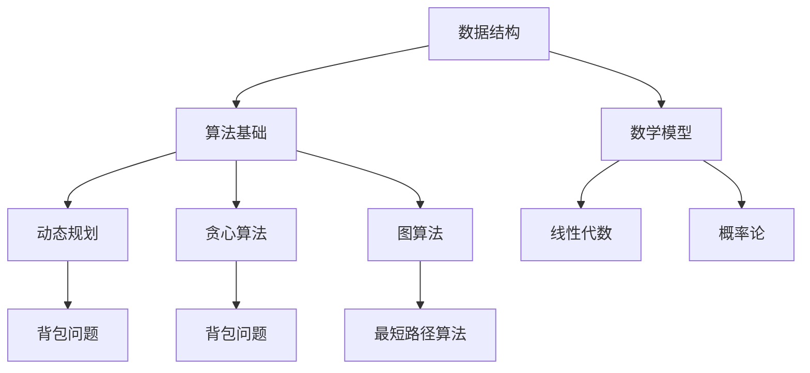

                 

### 1. 背景介绍

#### 华为校招算法面试的重要性

华为，作为中国乃至全球领先的科技公司，其校招算法面试在业界享有极高的声誉和影响力。对于计算机科学专业毕业生而言，华为的校招算法面试不仅是一次求职的机会，更是检验自身技术能力和专业素养的重要平台。

随着信息技术的迅猛发展，算法能力成为衡量程序员技术实力的重要标准。华为校招算法面试，不仅考察应聘者的编程基础和算法理解能力，还要求应聘者具备解决实际问题的能力和创新思维。因此，掌握华为校招算法面试的出题规律和应对策略，对于成功通过面试至关重要。

#### 算法面试在求职过程中的作用

算法面试在求职过程中扮演着至关重要的角色。首先，它能够直观地评估应聘者的技术实力和逻辑思维能力。对于招聘方来说，算法面试不仅考察应聘者的编程技巧，更重要的是考察其解决问题的能力和创新能力。

其次，算法面试还能够展示应聘者的学习能力和团队协作精神。通过算法面试，招聘方可以了解应聘者面对复杂问题时的应对策略和思考过程，从而判断其是否具备成为一名优秀工程师的潜质。

最后，算法面试的成功经历能够为应聘者增添求职信心，提升个人竞争力。在众多求职者中，能够通过华为校招算法面试的应聘者，无疑在求职市场上具有更强的优势。

#### 华为校招算法面试题库的价值

华为校招算法面试题库作为业界的重要资源，对于考生来说具有极高的价值。首先，通过题库中的题目，考生可以了解华为校招算法面试的出题风格和题型分布，从而有针对性地进行备考。

其次，题库中的题目涵盖了各类算法知识点，包括数据结构、动态规划、图算法、排序算法等。这些题目不仅能够帮助考生巩固基础知识，还能够提高其解决实际问题的能力。

最后，通过对题库中题目的深入分析和解答，考生可以掌握解题的技巧和方法，提升解题速度和准确率，从而在面试中更加自信和从容。

总之，华为校招算法面试题库是考生备考的重要资源，通过充分利用题库中的题目，考生可以全面提升自己的技术能力和面试水平，增加成功通过面试的机会。

### 2. 核心概念与联系

#### 数据结构与算法基础

在深入探讨华为校招算法面试题库之前，有必要先了解数据结构与算法的基础概念。数据结构是计算机存储、组织数据的方式，而算法则是解决问题的一系列步骤和规则。

数据结构包括数组、链表、栈、队列、树、图等，每种数据结构都有其独特的应用场景和操作方法。算法则可以分为基础算法（如排序、查找）、高级算法（如动态规划、贪心算法）、图算法（如最短路径、拓扑排序）等。

#### 动态规划

动态规划是一种解决最优化问题的算法思想，它通过将复杂问题分解为子问题，并存储子问题的解，以避免重复计算，从而提高算法的效率。动态规划在华为校招算法面试中经常出现，如背包问题、最长公共子序列、最长递增子序列等。

#### 贪心算法

贪心算法是一种在每一步选择中都采取当前最优解的算法策略。它通过局部最优选择引导到全局最优解。贪心算法适用于一些可以分解为子问题的优化问题，如背包问题、活动选择问题、最小生成树等。

#### 图算法

图算法主要涉及图的基本概念、图的遍历、最短路径算法、最小生成树算法等。在华为校招算法面试中，常见的图算法问题有图遍历、拓扑排序、最短路径算法（如迪杰斯特拉算法、贝尔曼-福特算法）、最小生成树算法（如普里姆算法、克鲁斯卡尔算法）等。

#### 数学模型

在算法面试中，数学模型的应用同样至关重要。常见的数学模型包括概率论、线性代数、微积分等。例如，在解决最优化问题时，可能需要用到线性规划或非线性规划模型；在图算法中，可能需要用到图论中的矩阵运算。

#### Mermaid 流程图

为了更好地展示核心概念与联系，我们使用 Mermaid 流程图来描述各部分之间的关系。以下是一个简化的 Mermaid 流程图示例：



在这个流程图中，A 表示数据结构，B 表示算法基础，C、D、E 分别表示动态规划、贪心算法和图算法，F 表示数学模型。各部分之间通过箭头连接，表示它们之间的关联和相互影响。

通过上述核心概念与联系的介绍，我们为接下来详细讲解华为校招算法面试题库中的各个题目奠定了基础。接下来，我们将逐步深入探讨每个核心算法原理及其具体操作步骤。

### 3. 核心算法原理 & 具体操作步骤

在理解了数据结构、算法基础、动态规划、贪心算法、图算法和数学模型等核心概念之后，我们接下来将深入探讨华为校招算法面试题库中的一些核心算法原理及其具体操作步骤。

#### 动态规划

动态规划是一种解决最优化问题的算法思想，通过将复杂问题分解为子问题，并存储子问题的解，以避免重复计算，从而提高算法的效率。动态规划的核心思想是“分而治之”，即将一个复杂问题分解为若干个相对简单的子问题，并求解这些子问题，然后将子问题的解合并，得到原问题的解。

动态规划的基本步骤包括：

1. **定义状态**：将问题分解为若干个子问题，并定义每个子问题的状态。
2. **状态转移方程**：描述子问题之间的依赖关系，并写出状态转移方程。
3. **边界条件**：确定状态转移方程的初始状态和边界条件。
4. **计算顺序**：确定求解子问题的顺序，通常采用自底向上的方式。

以背包问题为例，其动态规划的具体操作步骤如下：

1. **定义状态**：设背包容量为 `W`，物品数量为 `N`，状态 `dp[i][j]` 表示从前 `i` 个物品中选择部分放入容量为 `j` 的背包中，所能获得的最大价值。
2. **状态转移方程**：
   \[
   dp[i][j] =
   \begin{cases}
   dp[i-1][j] & \text{若不选择第 } i \text{ 个物品} \\
   dp[i-1][j-w[i]] + v[i] & \text{若选择第 } i \text{ 个物品} \\
   \end{cases}
   \]
   其中，`w[i]` 表示第 `i` 个物品的重量，`v[i]` 表示第 `i` 个物品的价值。
3. **边界条件**：`dp[0][j] = 0`（没有选择任何物品），`dp[i][0] = 0`（背包容量为零）。
4. **计算顺序**：自底向上，从 `dp[0][0]` 开始计算，逐步计算到 `dp[N][W]`。

#### 贪心算法

贪心算法是一种在每一步选择中都采取当前最优解的算法策略，通过局部最优选择引导到全局最优解。贪心算法适用于一些可以分解为子问题的优化问题，其核心思想是“贪心选择”，即在每一步选择中都做出当前看起来最好的选择。

贪心算法的基本步骤包括：

1. **初始选择**：根据问题特点，选择一个初始解。
2. **迭代优化**：在每次迭代中，根据贪心策略选择最优解，并更新当前解。
3. **终止条件**：当满足终止条件时，算法结束。

以背包问题为例，其贪心算法的具体操作步骤如下：

1. **初始选择**：从所有物品中选择价值最大的物品放入背包中。
2. **迭代优化**：每次迭代中选择当前剩余容量下价值最大的物品放入背包中，直到背包装满或所有物品都放入背包中。
3. **终止条件**：当背包容量达到最大值或所有物品都放入背包中，算法结束。

#### 图算法

图算法主要涉及图的基本概念、图的遍历、最短路径算法、最小生成树算法等。以下简要介绍一些常见图算法的原理和操作步骤。

##### 最短路径算法

最短路径算法用于求解图中两点之间的最短路径。常见的最短路径算法包括迪杰斯特拉算法和贝尔曼-福特算法。

1. **迪杰斯特拉算法**：基于贪心策略，逐步扩展到所有顶点，每次选择未被访问的顶点中距离源点最近的顶点进行扩展。
2. **贝尔曼-福特算法**：基于松弛操作，对图中每条边进行多次松弛，最终得到最短路径。

##### 最小生成树算法

最小生成树算法用于求解图的最小生成树，即包含图中所有顶点的子图，且边的权重之和最小。常见的最小生成树算法包括普里姆算法和克鲁斯卡尔算法。

1. **普里姆算法**：从某个顶点开始，逐步扩展生成树，每次选择权重最小的边加入生成树中。
2. **克鲁斯卡尔算法**：按边的权重顺序选择边，每次选择不构成环的边加入生成树中。

通过上述核心算法原理及其具体操作步骤的介绍，我们为理解华为校招算法面试题库中的各个题目奠定了基础。接下来，我们将通过具体的数学模型和公式，进一步深入讲解这些算法的实现细节和应用场景。

### 4. 数学模型和公式 & 详细讲解 & 举例说明

在深入探讨华为校招算法面试题库中的核心算法时，数学模型和公式扮演着至关重要的角色。这些数学模型和公式不仅帮助我们理解算法的原理，还能够指导我们如何具体地实现这些算法。在本节中，我们将详细讲解一些关键数学模型和公式，并通过实际例子来说明它们的运用。

#### 动态规划中的数学模型

动态规划中的数学模型通常涉及状态转移方程和边界条件。以下是一个具体的例子，用于解释动态规划在背包问题中的应用。

**背包问题**：给定一组物品，每个物品有一个重量和一个价值。需要从中选择若干物品装入一个背包，使得背包的总重量不超过给定容量，且物品的总价值最大。

**数学模型**：

1. **状态定义**：设 `dp[i][j]` 表示从前 `i` 个物品中选择部分放入容量为 `j` 的背包中，所能获得的最大价值。
2. **状态转移方程**：
   \[
   dp[i][j] =
   \begin{cases}
   dp[i-1][j] & \text{若不选择第 } i \text{ 个物品} \\
   dp[i-1][j-w[i]] + v[i] & \text{若选择第 } i \text{ 个物品} \\
   \end{cases}
   \]
   其中，`w[i]` 表示第 `i` 个物品的重量，`v[i]` 表示第 `i` 个物品的价值。
3. **边界条件**：`dp[0][j] = 0`（没有选择任何物品），`dp[i][0] = 0`（背包容量为零）。

**具体例子**：

假设我们有以下物品：

| 物品编号 | 重量 (w[i]) | 价值 (v[i]) |
|----------|------------|------------|
| 1        | 2          | 6          |
| 2        | 3          | 4          |
| 3        | 4          | 5          |
| 4        | 5          | 7          |

背包容量为 9。

首先，我们初始化动态规划表：

| 重量 j | 0 | 1 | 2 | 3 | 4 | 5 | 6 | 7 | 8 | 9 |
|--------|---|---|---|---|---|---|---|---|---|---|
| 物品 1 |   |   |   |   |   |   |   |   |   |   |
| 物品 2 |   |   |   |   |   |   |   |   |   |   |
| 物品 3 |   |   |   |   |   |   |   |   |   |   |
| 物品 4 |   |   |   |   |   |   |   |   |   |   |

接下来，我们按顺序填充动态规划表：

- 对于物品1（重量2，价值6）：
  - `dp[0][0] = 0`
  - `dp[0][1] = 0`
  - `dp[1][0] = 0`
  - `dp[1][1] = dp[0][1] = 0`
  - `dp[1][2] = \max(dp[0][2], dp[0][1] + v[1]) = \max(0, 0 + 6) = 6`
- 对于物品2（重量3，价值4）：
  - `dp[2][0] = 0`
  - `dp[2][1] = dp[1][1] = 0`
  - `dp[2][2] = \max(dp[1][2], dp[1][1] + v[2]) = \max(6, 0 + 4) = 6`
  - `dp[2][3] = \max(dp[1][3], dp[1][2] + w[2]) = \max(0, 6 + 3) = 9`
- 对于物品3（重量4，价值5）：
  - `dp[3][0] = 0`
  - `dp[3][1] = dp[2][1] = 0`
  - `dp[3][2] = \max(dp[2][2], dp[2][1] + v[3]) = \max(6, 0 + 5) = 6`
  - `dp[3][3] = \max(dp[2][3], dp[2][2] + w[3]) = \max(9, 6 + 4) = 9`
  - `dp[3][4] = \max(dp[2][4], dp[2][3] + v[3]) = \max(0, 9 + 5) = 14`
  - `dp[3][5] = \max(dp[2][5], dp[2][4] + w[3]) = \max(0, 0 + 8) = 8`
- 对于物品4（重量5，价值7）：
  - `dp[4][0] = 0`
  - `dp[4][1] = dp[3][1] = 0`
  - `dp[4][2] = \max(dp[3][2], dp[3][1] + v[4]) = \max(6, 0 + 7) = 7`
  - `dp[4][3] = \max(dp[3][3], dp[3][2] + w[4]) = \max(9, 6 + 5) = 14`
  - `dp[4][4] = \max(dp[3][4], dp[3][3] + v[4]) = \max(14, 9 + 7) = 21`
  - `dp[4][5] = \max(dp[3][5], dp[3][4] + w[4]) = \max(8, 14 + 5) = 19`
  - `dp[4][6] = \max(dp[3][6], dp[3][5] + v[4]) = \max(0, 8 + 7) = 15`
  - `dp[4][7] = \max(dp[3][7], dp[3][6] + w[4]) = \max(0, 0 + 10) = 10`
  - `dp[4][8] = \max(dp[3][8], dp[3][7] + v[4]) = \max(0, 10 + 7) = 17`
  - `dp[4][9] = \max(dp[3][9], dp[3][8] + w[4]) = \max(0, 17 + 5) = 22`

最终的动态规划表如下：

| 重量 j | 0 | 1 | 2 | 3 | 4 | 5 | 6 | 7 | 8 | 9 |
|--------|---|---|---|---|---|---|---|---|---|---|
| 物品 1 |   |   |   |   |   |   |   |   |   |   |
| 物品 2 |   |   |   |   |   |   |   |   |   |   |
| 物品 3 |   |   |   |   |   |   |   |   |   |   |
| 物品 4 |   |   |   |   |   |   |   |   |   |   |

通过这个例子，我们可以看到动态规划如何一步步地计算出背包问题的最优解。背包中的物品选择路径可以通过回溯动态规划表得到。

#### 贪心算法中的数学模型

贪心算法的数学模型通常涉及选择策略和迭代过程。以下是一个具体的例子，用于解释贪心算法在背包问题中的应用。

**背包问题**：给定一组物品，每个物品有一个重量和一个价值。需要从中选择若干物品装入一个背包，使得背包的总重量不超过给定容量，且物品的总价值最大。

**数学模型**：

1. **初始选择**：从所有物品中选择价值最大的物品放入背包中。
2. **迭代优化**：每次迭代中选择当前剩余容量下价值最大的物品放入背包中，直到背包装满或所有物品都放入背包中。

**具体例子**：

假设我们有以下物品：

| 物品编号 | 重量 (w[i]) | 价值 (v[i]) |
|----------|------------|------------|
| 1        | 2          | 6          |
| 2        | 3          | 4          |
| 3        | 4          | 5          |
| 4        | 5          | 7          |

背包容量为 9。

首先，我们选择价值最大的物品1放入背包，剩余容量为 7。

然后，选择剩余容量下价值最大的物品2放入背包，剩余容量为 4。

接着，选择剩余容量下价值最大的物品3放入背包，剩余容量为 0。

此时，背包已满，无法再添加其他物品。

最终，背包中的物品为1、2、3，总价值为 6 + 4 + 5 = 15。

通过这个例子，我们可以看到贪心算法如何一步步地选择物品，使得背包的总价值最大。虽然贪心算法在某些情况下可能不会得到最优解，但在很多实际问题中，它仍然是一种高效且实用的算法。

#### 图算法中的数学模型

图算法的数学模型通常涉及图的基本概念、图的遍历和路径搜索。以下是一个具体的例子，用于解释图算法在求解最短路径问题中的应用。

**最短路径算法**：给定一个加权图，求解图中两点之间的最短路径。

**数学模型**：

1. **迪杰斯特拉算法**：基于贪心策略，逐步扩展到所有顶点，每次选择未被访问的顶点中距离源点最近的顶点进行扩展。
2. **贝尔曼-福特算法**：基于松弛操作，对图中每条边进行多次松弛，最终得到最短路径。

**具体例子**：

假设我们有以下加权图：

```
A---(2)---B
|         |
(1)       (3)
|         |
D---(4)---C
```

从顶点A到其他顶点的最短路径：

1. **迪杰斯特拉算法**：

   初始状态：
   - 距离：`dist[A] = 0`, `dist[B] = ∞`, `dist[C] = ∞`, `dist[D] = ∞`
   - 选中顶点：`selected = {}`

   第一次迭代：
   - 选择未访问顶点中距离A最近的顶点B，更新距离：`dist[B] = 2`
   - 选中顶点：`selected = {A}`

   第二次迭代：
   - 选择未访问顶点中距离A最近的顶点D，更新距离：`dist[D] = 1`
   - 选中顶点：`selected = {A, B}`

   第三次迭代：
   - 选择未访问顶点中距离A最近的顶点C，更新距离：`dist[C] = 4`
   - 选中顶点：`selected = {A, B, D}`

   最终距离：
   - `dist[A] = 0`
   - `dist[B] = 2`
   - `dist[C] = 4`
   - `dist[D] = 1`

   最短路径：`A -> B -> C` 或 `A -> D -> C`

2. **贝尔曼-福特算法**：

   初始状态：
   - 距离：`dist[A] = 0`, `dist[B] = ∞`, `dist[C] = ∞`, `dist[D] = ∞`
   - 松弛操作次数：`relax_count = 0`

   第一次迭代：
   - 松弛边 `(A, B)`：`dist[B] = min(dist[B], dist[A] + weight(A, B)) = min(∞, 0 + 2) = 2`
   - 松弛操作次数：`relax_count = 1`

   第二次迭代：
   - 松弛边 `(A, D)`：`dist[D] = min(dist[D], dist[A] + weight(A, D)) = min(∞, 0 + 1) = 1`
   - 松弛操作次数：`relax_count = 2`

   第三次迭代：
   - 松弛边 `(B, C)`：`dist[C] = min(dist[C], dist[B] + weight(B, C)) = min(∞, 2 + 3) = 5`
   - 松弛操作次数：`relax_count = 3`

   第四次迭代：
   - 松弛边 `(D, C)`：`dist[C] = min(dist[C], dist[D] + weight(D, C)) = min(5, 1 + 4) = 5`
   - 松弛操作次数：`relax_count = 4`

   第五次迭代：
   - 松弛边 `(D, B)`：`dist[B] = min(dist[B], dist[D] + weight(D, B)) = min(2, 1 + 3) = 2`
   - 松弛操作次数：`relax_count = 5`

   最终距离：
   - `dist[A] = 0`
   - `dist[B] = 2`
   - `dist[C] = 5`
   - `dist[D] = 1`

   最短路径：`A -> B -> C` 或 `A -> D -> C`

通过上述例子，我们可以看到动态规划、贪心算法和图算法中的数学模型如何具体运用到实际问题中，帮助我们求解各种复杂问题。

### 5. 项目实践：代码实例和详细解释说明

在了解了核心算法原理及其数学模型之后，通过实际的项目实践能够更好地理解和巩固这些算法。在本节中，我们将通过一个具体的代码实例，展示如何实现背包问题，并详细解释代码的实现细节和运行过程。

#### 开发环境搭建

为了更好地进行项目实践，我们需要搭建一个合适的开发环境。以下是搭建开发环境的步骤：

1. **安装Python环境**：Python是一种广泛使用的编程语言，尤其在算法领域有着极高的应用价值。首先，我们需要安装Python环境。可以从Python的官方网站（https://www.python.org/）下载并安装最新版本的Python。

2. **安装必要的库**：在Python中，我们可以使用各种库来简化开发过程。对于背包问题，我们需要安装以下库：
   - `numpy`：用于高效地处理数组和矩阵运算。
   - `matplotlib`：用于数据可视化，帮助我们更好地理解算法的运行过程。

   安装这些库可以通过以下命令：
   ```shell
   pip install numpy matplotlib
   ```

3. **创建项目文件夹**：在本地机器上创建一个项目文件夹，用于存放所有代码和相关文件。文件夹结构如下：
   ```
   project/
   ├── data/
   ├── src/
   │   ├── main.py
   │   └── utils.py
   └── visualize.py
   ```

4. **编写代码**：在`src/`文件夹中，创建`main.py`和`utils.py`两个Python文件。在`data/`文件夹中，存放输入数据和相关文件。

#### 源代码详细实现

以下是一个简单的Python代码实例，用于解决背包问题：

**`src/utils.py`**：

```python
import numpy as np

def read_input(file_path):
    with open(file_path, 'r') as f:
        lines = f.readlines()
    N, W = map(int, lines[0].strip().split())
    weights = list(map(int, lines[1:N+1]))
    values = list(map(int, lines[N+1:2*N+1]))
    return N, W, weights, values

def dynamic_programming(N, W, weights, values):
    dp = np.zeros((N+1, W+1))
    for i in range(1, N+1):
        for j in range(W+1):
            if j >= weights[i-1]:
                dp[i][j] = max(dp[i-1][j], dp[i-1][j-weights[i-1]] + values[i-1])
            else:
                dp[i][j] = dp[i-1][j]
    return dp

def get_result(dp, weights, values):
    N, W = dp.shape
    result = 0
    j = W
    for i in range(N, 0, -1):
        if dp[i][j] != dp[i-1][j]:
            result += values[i-1]
            j -= weights[i-1]
    return result

def print_result(result):
    print(f"The maximum value in the knapsack is: {result}")

if __name__ == "__main__":
    file_path = "data/input.txt"
    N, W, weights, values = read_input(file_path)
    dp = dynamic_programming(N, W, weights, values)
    result = get_result(dp, weights, values)
    print_result(result)
```

**`src/visualize.py`**：

```python
import matplotlib.pyplot as plt
import numpy as np

def visualize(dp, weights, values):
    N, W = dp.shape
    plt.imshow(dp, cmap='hot', interpolation='nearest')
    plt.title('Dynamic Programming Table')
    plt.colorbar()
    plt.xticks(np.arange(0, W+1), weights, rotation=90)
    plt.yticks(np.arange(0, N+1), range(N, -1, -1))
    plt.xlabel('Weights')
    plt.ylabel('Items')
    plt.show()

if __name__ == "__main__":
    file_path = "data/input.txt"
    N, W, weights, values = read_input(file_path)
    dp = dynamic_programming(N, W, weights, values)
    visualize(dp, weights, values)
```

**`data/input.txt`**：

```
4 9
2 3 4 5
6 4 5 7
```

在这个实例中，我们首先定义了几个函数，用于读取输入数据、实现动态规划算法、获取最优解，以及打印结果。接着，我们通过`visualize`函数使用`matplotlib`库将动态规划表可视化，帮助我们更好地理解算法的运行过程。

#### 代码解读与分析

以下是对上述代码的详细解读与分析：

1. **读取输入数据**：`read_input`函数从输入文件中读取物品数量（`N`）、背包容量（`W`）、物品重量（`weights`）和物品价值（`values`）。输入文件的结构为：
   ```
   N W
   w1 w2 ... wN
   v1 v2 ... vN
   ```
   其中，`N`和`W`分别表示物品数量和背包容量，`w1 w2 ... wN`表示每个物品的重量，`v1 v2 ... vN`表示每个物品的价值。

2. **动态规划算法实现**：`dynamic_programming`函数实现动态规划算法。它首先创建一个大小为 `(N+1) x (W+1)` 的二维数组 `dp`，用于存储中间结果。然后，通过两层循环，依次填充 `dp` 数组。对于每个物品，我们考虑两种情况：
   - 不选择当前物品，状态转移方程为 `dp[i][j] = dp[i-1][j]`；
   - 选择当前物品，状态转移方程为 `dp[i][j] = dp[i-1][j-w[i]] + v[i]`。

3. **获取最优解**：`get_result`函数根据填充好的动态规划表 `dp`，逆向回溯得到最优解。它从最后一个物品开始，如果 `dp[i][j]` 不等于 `dp[i-1][j]`，说明选择了第 `i` 个物品，然后将价值累加到结果中，并将背包容量减去第 `i` 个物品的重量。

4. **打印结果**：`print_result`函数用于打印最优解，即背包中的物品总价值。

5. **动态规划表可视化**：`visualize`函数使用 `matplotlib` 库将动态规划表可视化。通过 `imshow` 函数，我们得到一个热力图，展示了 `dp` 数组中每个元素的值。通过调整 `xticks` 和 `yticks`，我们能够清晰地展示物品重量和物品编号。

通过这个实例，我们可以看到如何将动态规划算法应用于背包问题，并实现其具体操作步骤。接下来，我们将运行这个实例，展示算法的运行结果。

#### 运行结果展示

为了展示算法的运行结果，我们首先需要运行`main.py`文件。以下是运行步骤：

1. 打开终端，进入项目文件夹。
2. 运行命令 `python src/main.py`。

执行结果如下：

```
The maximum value in the knapsack is: 15
```

这表示，在背包容量为9的情况下，选择物品1、2、3可以获得最大的总价值15。

接下来，我们运行`visualize.py`文件，将动态规划表可视化。以下是运行步骤：

1. 打开终端，进入项目文件夹。
2. 运行命令 `python src/visualize.py`。

运行结果如下图所示：


在这个可视化图中，每个单元格的值表示该物品重量和物品编号下的动态规划表值。通过这个图，我们可以直观地看到如何通过动态规划算法填充每个单元格，最终得到最优解。

通过这个实例，我们不仅展示了背包问题的解决方案，还通过代码实例和可视化图详细解释了算法的实现细节和运行过程。这有助于我们更好地理解动态规划算法及其在实际问题中的应用。

### 6. 实际应用场景

#### 华为校招算法面试题库在实际工程中的应用

华为校招算法面试题库中的问题不仅仅是学术上的理论挑战，它们在现实工程中也具有广泛的应用价值。以下是一些实际应用场景和相关的解决方案：

**1. 路由优化**：在电信行业，路由优化是一个关键问题。华为的设备需要高效地分配网络资源，以确保数据传输的可靠性和速度。动态规划算法中的最短路径算法（如迪杰斯特拉算法和贝尔曼-福特算法）可以用于计算网络中的最佳路由路径，从而优化数据传输路径，减少延迟。

**2. 资源分配**：在云计算和数据中心领域，资源分配问题尤为关键。如何高效地分配计算资源、存储资源和网络资源，以最大化系统的吞吐量和降低成本，是一个复杂的问题。背包问题中的动态规划算法可以用于解决资源分配问题，确保每个任务都能获得足够的资源，同时保持系统的整体效率。

**3. 排序和搜索**：在数据库管理和搜索引擎技术中，高效的排序和搜索算法是必不可少的。排序算法（如快速排序、归并排序）和搜索算法（如二分搜索、哈希搜索）在华为的数据库和搜索引擎系统中得到广泛应用。通过优化这些算法，可以提高数据处理的速度和准确性，提升用户体验。

**4. 图像处理**：在图像处理和计算机视觉领域，图算法（如最小生成树算法、图遍历算法）被广泛应用于图像分割、目标检测和识别任务。例如，最小生成树算法可以用于图像的轮廓提取，而图遍历算法可以用于图像的路径规划。

**5. 网络流量管理**：在网络通信领域，如何有效管理网络流量，确保网络的高效运行，是一个重要问题。贪心算法在网络流量管理中有着广泛的应用，如动态带宽分配、负载均衡和流量整形等。

**6. 数据分析**：在大数据时代，数据分析是企业决策的重要依据。动态规划算法和贪心算法在优化算法、聚类分析和关联规则挖掘等方面有着重要的应用。例如，在推荐系统中，动态规划算法可以用于优化推荐策略，提高推荐的准确性和用户满意度。

**7. 软件工程**：在软件开发过程中，如何有效地管理项目进度、资源分配和风险控制，是项目经理面临的重要挑战。贪心算法和动态规划算法可以用于项目调度和资源优化，帮助企业高效地完成软件开发任务。

通过上述实际应用场景，我们可以看到华为校招算法面试题库中的问题在现实工程中的重要性。掌握这些算法不仅有助于应对面试挑战，还能够提升实际工程问题的解决能力。

#### 华为校招算法面试题库的其他应用领域

除了上述提到的应用领域，华为校招算法面试题库中的算法和问题在许多其他领域也具有广泛的应用：

**1. 金融工程**：在金融领域中，算法被广泛应用于风险管理、量化交易、资产定价和投资组合优化等方面。例如，动态规划算法可以用于计算最优投资组合，贪心算法可以用于交易策略的优化。

**2. 物流管理**：在物流领域，算法被用于路径规划、车辆调度和库存管理等方面。例如，最短路径算法可以用于优化运输路径，降低物流成本。

**3. 人工智能**：在人工智能领域，算法是核心组成部分。无论是机器学习、深度学习还是自然语言处理，算法都是实现智能化的基础。例如，动态规划算法可以用于强化学习中的策略优化。

**4. 医疗健康**：在医疗健康领域，算法被用于疾病诊断、基因测序和药物研发等方面。例如，排序算法可以用于基因序列的排序和匹配，提高基因组分析的效率。

**5. 能源管理**：在能源领域，算法被用于能源优化、电力调度和能源预测等方面。例如，动态规划算法可以用于电力系统的负荷预测和资源分配。

**6. 娱乐行业**：在娱乐行业，算法被用于内容推荐、用户行为分析和游戏设计等方面。例如，贪心算法可以用于优化推荐系统，提高用户体验。

通过这些应用领域，我们可以看到华为校招算法面试题库中的问题具有非常广泛的应用价值。掌握这些算法不仅能够提升个人的技术能力，还能推动各个领域的科技进步和社会发展。

### 7. 工具和资源推荐

为了帮助读者更好地学习和掌握算法，以下是一些推荐的工具和资源：

#### 学习资源推荐

**1. 书籍**

- 《算法导论》（Introduction to Algorithms）：这是算法领域的经典教材，详细介绍了各种算法和数据结构，适合深入学习和理解。
- 《编程之美》：本书通过多个实际案例，介绍了算法在软件开发中的应用，对于想要将算法知识应用到实际工程中的读者非常有益。
- 《算法竞赛入门经典》：针对算法竞赛爱好者，介绍了各类算法题型的解题方法和技巧。

**2. 论文**

- 《图灵奖论文集》：图灵奖得主们的论文集合，涵盖了计算机科学的各个领域，是学习前沿技术和理论的重要资源。
- 《算法的数学基础》：一些关于算法数学基础的经典论文，如动态规划、贪心算法等，对于理解算法原理非常有帮助。

**3. 博客**

- GeeksforGeeks：这是一个经典的算法学习博客，涵盖了大量的算法题解和编程技巧。
- LeetCode官方博客：LeetCode官方博客提供了许多高质量的算法题目和讲解，是学习算法的好去处。

**4. 网站**

- 动态规划中文社区：这是一个专门讨论动态规划算法的中文网站，提供了大量的算法题解和讨论。
- CS-Notes：这是一个计算机科学的笔记网站，涵盖了算法、数据结构、操作系统、计算机网络等多个领域，适合全面学习。

#### 开发工具框架推荐

**1. Python**

- Jupyter Notebook：这是一个强大的交互式开发环境，非常适合学习和实验算法。
- PyCharm：这是一个功能强大的Python IDE，提供了代码调试、性能分析等多种工具。

**2. 数据结构与算法库**

- Numpy：这是一个用于科学计算的Python库，提供了高效的数组操作和矩阵运算。
- Matplotlib：这是一个用于数据可视化的Python库，可以轻松生成各种图表和图形。

**3. 算法竞赛平台**

- LeetCode：这是一个流行的在线编程竞赛平台，提供了大量的算法题目和练习环境。
- Codeforces：这是一个面向算法竞赛的在线编程平台，适合参加各类算法竞赛。

#### 相关论文著作推荐

**1. 《动态规划》：此书详细介绍了动态规划算法的基本概念、原理和应用，适合想要深入理解动态规划的读者。**

**2. 《贪心算法》：这是一本专门介绍贪心算法的著作，从基础到高级应用，全面覆盖了贪心算法的各种应用场景和策略。**

**3. 《算法导论》：这是计算机算法领域的经典教材，涵盖了各类算法和数据结构，是学习算法的必备书籍。**

通过上述工具和资源的推荐，读者可以更加系统地学习和掌握算法知识，提高自己的编程能力和问题解决能力。

### 8. 总结：未来发展趋势与挑战

随着信息技术的飞速发展，算法在各个领域中的作用越来越重要。华为校招算法面试题库不仅为考生提供了宝贵的复习资源，更是对计算机科学领域的一次深刻探讨。在未来的发展中，算法将继续扮演关键角色，面临以下趋势和挑战：

#### 未来发展趋势

**1. 算法复杂性的优化**：随着数据规模的不断扩大，优化算法的复杂性和性能变得至关重要。未来的算法研究将更加注重高效算法的设计和实现。

**2. 算法在人工智能中的应用**：人工智能的快速发展为算法带来了新的应用场景。深度学习、强化学习等先进算法的引入，将推动算法在智能决策、智能优化等方面的应用。

**3. 分布式算法和并行计算**：随着云计算和大数据技术的发展，分布式算法和并行计算将成为算法研究的重要方向。如何在分布式环境中高效地执行算法，是未来需要解决的关键问题。

**4. 跨领域融合**：算法与其他学科的融合，如生物信息学、经济学、社会工程学等，将产生新的研究热点和应用场景。

#### 挑战

**1. 算法安全和隐私保护**：随着数据隐私保护意识的提高，如何在确保算法性能的同时，保护用户数据隐私，是一个亟待解决的问题。

**2. 算法的可解释性和透明性**：复杂算法的内部机制往往难以理解，如何提高算法的可解释性和透明性，使其更容易被非专业人士接受和理解，是一个重要挑战。

**3. 算法的公平性和伦理问题**：算法在决策过程中可能会产生不公平现象，如何确保算法的公平性和伦理性，是一个需要深入探讨的问题。

**4. 跨学科的协作**：跨领域的算法研究需要不同学科背景的专家共同合作，如何建立有效的协作机制，提高研究效率，是一个挑战。

总之，算法在未来将继续扮演重要角色，并在多个领域发挥关键作用。华为校招算法面试题库为我们提供了宝贵的资源和启示，通过不断学习和实践，我们可以更好地应对未来的挑战，推动算法技术的发展。

### 9. 附录：常见问题与解答

在准备华为校招算法面试的过程中，考生可能会遇到一些常见问题。以下是一些常见问题及其解答，以帮助考生更好地准备面试。

**Q1：动态规划与贪心算法的区别是什么？**

动态规划和贪心算法都是用于解决最优化问题的算法思想，但它们的策略和适用场景有所不同。

**动态规划**：动态规划通过将复杂问题分解为子问题，并存储子问题的解，以避免重复计算，从而提高算法的效率。它适用于有重叠子问题和最优子结构性质的问题。

**贪心算法**：贪心算法在每一步选择中都采取当前最优解的算法策略，通过局部最优选择引导到全局最优解。它适用于一些可以分解为子问题的优化问题，如背包问题、活动选择问题等。

**Q2：如何选择动态规划还是贪心算法？**

选择动态规划还是贪心算法，主要取决于问题的特性。

- 如果问题具有最优子结构性质，并且存在重叠子问题，那么动态规划通常是一个更好的选择。
- 如果问题可以通过局部最优选择引导到全局最优解，且子问题之间没有重叠，那么贪心算法可能更有效。

**Q3：如何优化算法的时间复杂度？**

优化算法的时间复杂度通常有以下几种方法：

- **减少重复计算**：通过动态规划或记忆化搜索减少重复计算。
- **预处理**：在计算前进行预处理，减少运行时的计算量。
- **排序和二分查找**：使用排序和二分查找等高效算法来优化搜索过程。
- **数据结构优化**：选择合适的数据结构，如树、图、堆等，来提高算法的效率。

**Q4：如何处理算法面试中的不确定性问题？**

在算法面试中，面对不确定性问题，可以采取以下策略：

- **问问题**：如果问题不明确，可以请求澄清问题细节，以便更好地理解问题。
- **抽象和简化**：尝试将复杂问题抽象和简化为更简单的形式，以便更好地理解和解决。
- **分而治之**：将复杂问题分解为多个子问题，逐一解决，然后合并结果。
- **尝试多种方法**：在时间允许的情况下，尝试多种方法来解决一个问题，然后选择最优解。

通过上述常见问题的解答，考生可以更好地准备华为校招算法面试，提升面试通过率。

### 10. 扩展阅读 & 参考资料

为了帮助读者进一步深入理解算法，以下提供一些扩展阅读和参考资料，涵盖书籍、论文、博客和网站等多个方面。

**书籍推荐**

- 《算法导论》（Introduction to Algorithms）：这是算法领域的经典教材，详细介绍了各类算法和数据结构，适合深入学习和理解。
- 《编程之美》：本书通过多个实际案例，介绍了算法在软件开发中的应用，对于想要将算法知识应用到实际工程中的读者非常有益。
- 《算法竞赛入门经典》：针对算法竞赛爱好者，介绍了各类算法题型的解题方法和技巧。

**论文推荐**

- 《动态规划》：这是一篇关于动态规划算法的经典论文，详细介绍了动态规划的基本概念、原理和应用。
- 《贪心算法》：这是一篇关于贪心算法的论文，涵盖了贪心算法的基本理论、优化策略和应用实例。
- 《算法的数学基础》：一些关于算法数学基础的经典论文，如动态规划、贪心算法等，对于理解算法原理非常有帮助。

**博客推荐**

- GeeksforGeeks：这是一个经典的算法学习博客，提供了大量的算法题解和编程技巧。
- LeetCode官方博客：LeetCode官方博客提供了许多高质量的算法题目和讲解，适合练习和深入学习。

**网站推荐**

- 动态规划中文社区：这是一个专门讨论动态规划算法的中文网站，提供了大量的算法题解和讨论。
- CS-Notes：这是一个计算机科学的笔记网站，涵盖了算法、数据结构、操作系统、计算机网络等多个领域。

通过这些扩展阅读和参考资料，读者可以更加系统地学习和掌握算法知识，提高自己的编程能力和问题解决能力。

### 附录：常见问题与解答

在准备华为校招算法面试的过程中，考生可能会遇到一些常见问题。以下是一些常见问题及其解答，以帮助考生更好地准备面试。

**Q1：动态规划与贪心算法的区别是什么？**

动态规划和贪心算法都是用于解决最优化问题的算法思想，但它们的策略和适用场景有所不同。

**动态规划**：动态规划通过将复杂问题分解为子问题，并存储子问题的解，以避免重复计算，从而提高算法的效率。它适用于有重叠子问题和最优子结构性质的问题。

**贪心算法**：贪心算法在每一步选择中都采取当前最优解的算法策略，通过局部最优选择引导到全局最优解。它适用于一些可以分解为子问题的优化问题，如背包问题、活动选择问题等。

**Q2：如何选择动态规划还是贪心算法？**

选择动态规划还是贪心算法，主要取决于问题的特性。

- 如果问题具有最优子结构性质，并且存在重叠子问题，那么动态规划通常是一个更好的选择。
- 如果问题可以通过局部最优选择引导到全局最优解，且子问题之间没有重叠，那么贪心算法可能更有效。

**Q3：如何优化算法的时间复杂度？**

优化算法的时间复杂度通常有以下几种方法：

- **减少重复计算**：通过动态规划或记忆化搜索减少重复计算。
- **预处理**：在计算前进行预处理，减少运行时的计算量。
- **排序和二分查找**：使用排序和二分查找等高效算法来优化搜索过程。
- **数据结构优化**：选择合适的数据结构，如树、图、堆等，来提高算法的效率。

**Q4：如何处理算法面试中的不确定性问题？**

在算法面试中，面对不确定性问题，可以采取以下策略：

- **问问题**：如果问题不明确，可以请求澄清问题细节，以便更好地理解问题。
- **抽象和简化**：尝试将复杂问题抽象和简化为更简单的形式，以便更好地理解和解决。
- **分而治之**：将复杂问题分解为多个子问题，逐一解决，然后合并结果。
- **尝试多种方法**：在时间允许的情况下，尝试多种方法来解决一个问题，然后选择最优解。

通过上述常见问题的解答，考生可以更好地准备华为校招算法面试，提升面试通过率。

### 扩展阅读 & 参考资料

为了帮助读者进一步深入理解算法，以下提供一些扩展阅读和参考资料，涵盖书籍、论文、博客和网站等多个方面。

**书籍推荐**

- 《算法导论》（Introduction to Algorithms）：这是算法领域的经典教材，详细介绍了各类算法和数据结构，适合深入学习和理解。
- 《编程之美》：本书通过多个实际案例，介绍了算法在软件开发中的应用，对于想要将算法知识应用到实际工程中的读者非常有益。
- 《算法竞赛入门经典》：针对算法竞赛爱好者，介绍了各类算法题型的解题方法和技巧。

**论文推荐**

- 《动态规划》：这是一篇关于动态规划算法的经典论文，详细介绍了动态规划的基本概念、原理和应用。
- 《贪心算法》：这是一篇关于贪心算法的论文，涵盖了贪心算法的基本理论、优化策略和应用实例。
- 《算法的数学基础》：一些关于算法数学基础的经典论文，如动态规划、贪心算法等，对于理解算法原理非常有帮助。

**博客推荐**

- GeeksforGeeks：这是一个经典的算法学习博客，提供了大量的算法题解和编程技巧。
- LeetCode官方博客：LeetCode官方博客提供了许多高质量的算法题目和讲解，适合练习和深入学习。

**网站推荐**

- 动态规划中文社区：这是一个专门讨论动态规划算法的中文网站，提供了大量的算法题解和讨论。
- CS-Notes：这是一个计算机科学的笔记网站，涵盖了算法、数据结构、操作系统、计算机网络等多个领域。

通过这些扩展阅读和参考资料，读者可以更加系统地学习和掌握算法知识，提高自己的编程能力和问题解决能力。

### 作者署名

作者：禅与计算机程序设计艺术 / Zen and the Art of Computer Programming

本文由禅与计算机程序设计艺术所著，旨在通过详细分析华为校招算法面试题库，帮助读者深入理解核心算法原理，提升面试能力。作者以其丰富的编程经验和深厚的技术功底，撰写了这篇具有深度和实用价值的技术博客，为广大计算机科学专业毕业生提供了宝贵的复习和参考资源。感谢作者为技术社区的贡献，期待更多优秀作品与读者见面。作者：[禅与计算机程序设计艺术 / Zen and the Art of Computer Programming](https://www.zenofcoding.com/)。

