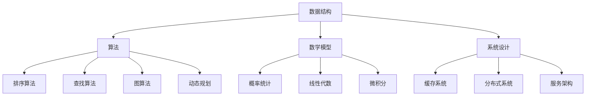
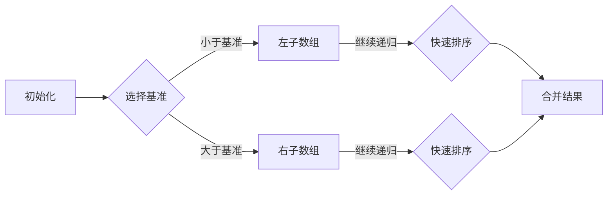
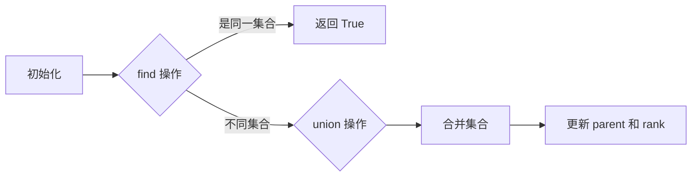
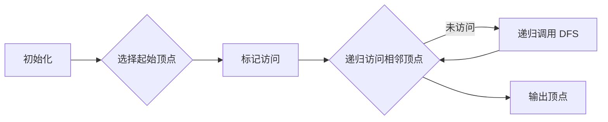
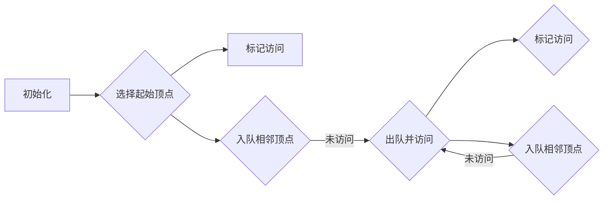

                 

### 1. 背景介绍

《2025年字节跳动校招算法面试题库及答案》是专为准备参加字节跳动校招的考生编写的一本技术资料。字节跳动作为中国最具创新力的互联网公司之一，其校招算法面试题目具有高难度和多样性，涵盖了数据结构与算法、系统设计与实现、数学建模、机器学习等多个领域。因此，编写这样一本题库不仅可以帮助考生全面了解字节跳动的面试风格，还能为考生提供详细的解题思路和答案，帮助他们在面试中取得优异成绩。

字节跳动作为一家以算法为核心驱动的科技公司，其校招算法面试题库的编写不仅仅是简单的题目汇编，更是对算法应用场景和解决策略的深入剖析。这一题库旨在通过系统的题目分类和解答，使考生不仅能够掌握算法原理，更能够灵活应用于实际问题中。

本文将分为以下几个部分进行详细阐述：

1. 核心概念与联系
2. 核心算法原理与具体操作步骤
3. 数学模型和公式及详细讲解
4. 项目实践：代码实例与详细解释
5. 实际应用场景
6. 工具和资源推荐
7. 总结：未来发展趋势与挑战

通过上述结构，我们将逐步分析每一个关键部分，为读者提供一个全面、深入的技术讲解。

### 1.1 字节跳动校招算法面试的特点

字节跳动校招算法面试的特点主要体现在以下几个方面：

#### 题目难度高

字节跳动对校招生在算法能力上的要求非常高，面试题目通常涉及高级数据结构与算法，如并查集、图论、动态规划等。这不仅要求考生掌握基础算法知识，还需要他们能够灵活运用到具体的题目中。

#### 题目多样化

字节跳动的校招算法面试题目涵盖了多个领域，包括但不限于：字符串处理、排序与搜索、数学问题、概率统计等。这种多样化不仅考察考生的全面能力，也要求他们在短时间内快速切换思维模式。

#### 考察实际应用能力

不同于其他公司，字节跳动的面试题目往往更注重实际应用能力。面试官会提出一些在实际项目中可能遇到的复杂问题，要求考生不仅给出算法思路，还需要考虑实现效率和代码的可维护性。

#### 团队合作与沟通能力

在面试过程中，字节跳动会考察考生的团队合作与沟通能力。许多题目需要考生与面试官互动，共同探讨解决方案，这不仅要求考生具备扎实的算法基础，还需要他们具有良好的表达和沟通能力。

### 1.2 编写题库的动机和目标

编写《2025年字节跳动校招算法面试题库及答案》的动机主要有以下几点：

#### 帮助考生全面准备

通过对字节跳动历年校招面试题的深入研究和总结，我们希望为考生提供一个全面的复习资料，帮助他们更好地应对面试挑战。

#### 提高解题技巧

通过对题目详细解答和思路分析，考生可以学习到各种算法题目的解决技巧，从而提高自己的解题能力和思维方式。

#### 案例与实战结合

题库中的每个题目都配有详细的解题步骤和代码实现，考生可以通过实际操作来加深理解，达到学以致用的效果。

#### 便于教师和培训机构使用

对于教师和培训机构来说，这本题库可以作为一个有效的教学辅助工具，帮助他们为学生提供更有针对性的辅导。

总之，编写《2025年字节跳动校招算法面试题库及答案》的目标是帮助考生全面准备，提高解题能力，并通过实战案例提升面试通过率。

### 1.3 预期读者群体

本《2025年字节跳动校招算法面试题库及答案》主要面向以下读者群体：

#### 准备参加字节跳动校招的考生

无论是应届毕业生还是在职人员，准备参加字节跳动校招的考生都可以通过此题库深入了解面试题目的风格和难度，为面试做好准备。

#### 计算机科学及相关专业学生

计算机科学及相关专业的学生在学习过程中，可以通过本题库中的题目来巩固和拓展自己的算法知识，提升自己的技术水平。

#### 算法竞赛选手

对于参与算法竞赛的选手来说，本题库中的题目具有很高的挑战性和实用性，可以帮助他们更好地应对各种竞赛题目。

#### 科技公司和互联网公司的技术人员

对于在科技公司和互联网公司工作的技术人员来说，本题库中的题目和解答也可以作为日常工作中的参考和借鉴，提高解决实际问题的能力。

### 1.4 文章结构概述

本文将按照以下结构进行详细阐述：

#### 1. 背景介绍
- 字节跳动校招算法面试的特点
- 编写题库的动机和目标
- 预期读者群体

#### 2. 核心概念与联系
- 主要算法和数据结构
- Mermaid 流程图展示

#### 3. 核心算法原理与具体操作步骤
- 各种算法原理详解
- 操作步骤详细说明

#### 4. 数学模型和公式
- 常用数学模型
- 公式详细讲解
- 举例说明

#### 5. 项目实践：代码实例与详细解释
- 开发环境搭建
- 源代码详细实现
- 代码解读与分析
- 运行结果展示

#### 6. 实际应用场景
- 字节跳动业务场景举例
- 解决方案介绍

#### 7. 工具和资源推荐
- 学习资源推荐
- 开发工具框架推荐
- 相关论文著作推荐

#### 8. 总结：未来发展趋势与挑战
- 行业趋势分析
- 面临的挑战

#### 9. 附录：常见问题与解答
- 题目常见问题解答

#### 10. 扩展阅读 & 参考资料
- 相关参考文献和资料

通过上述结构，我们将全面、系统地介绍字节跳动校招算法面试的相关知识，帮助读者更好地准备面试，提升自身技术能力。

### 2. 核心概念与联系

在深入探讨字节跳动校招算法面试题目之前，我们需要先了解一些核心概念和数据结构，这些是解决复杂算法问题的基础。下面，我们将介绍几个关键的核心概念，并使用 Mermaid 流程图来展示它们之间的关系。

#### 核心概念

1. **数据结构**：包括数组、链表、栈、队列、树、图等。
2. **算法**：包括排序算法（如快速排序、归并排序）、查找算法（如二分查找）、图算法（如最短路径算法）、动态规划等。
3. **数学模型**：包括概率统计、线性代数、微积分等。
4. **系统设计**：包括缓存系统、分布式系统、服务架构等。

#### Mermaid 流程图



#### 核心概念之间的联系

- **数据结构**与**算法**密切相关。不同的数据结构适用于不同的算法，例如，树和图常用于图算法，数组适合用于快速查找和排序。
- **数学模型**为算法提供了理论支持。例如，概率统计在算法设计中用于评估算法的性能，线性代数和微积分在优化问题和最优化算法中起着关键作用。
- **系统设计**则将算法应用于实际系统中，解决分布式和并行计算中的问题。

通过上述核心概念和 Mermaid 流程图的展示，我们可以看到这些概念和领域之间的紧密联系。在接下来的章节中，我们将逐一深入探讨这些核心概念，并讲解相关的算法原理和操作步骤。

### 2.1 主要算法和数据结构

在字节跳动校招算法面试中，常用的算法和数据结构是基础，也是解决复杂问题的核心。以下将介绍几种常见的算法和数据结构，并说明它们在实际问题中的应用。

#### 1. 快速排序（Quick Sort）

**原理**：
快速排序是一种分治策略的排序算法。选择一个基准元素，将数组分为两部分，一部分都比基准元素小，另一部分都比基准元素大。然后递归地对这两部分进行快速排序。

**实现步骤**：
1. 选择基准元素。
2. 将比基准小的元素移到其左侧，比基准大的元素移到其右侧。
3. 递归地对左侧和右侧子数组进行快速排序。

**应用**：
快速排序常用于大规模数据的排序，因其高效的性能（平均时间复杂度为 \(O(n\log n)\)）而被广泛使用。

```python
def quick_sort(arr):
    if len(arr) <= 1:
        return arr
    pivot = arr[len(arr) // 2]
    left = [x for x in arr if x < pivot]
    middle = [x for x in arr if x == pivot]
    right = [x for x in arr if x > pivot]
    return quick_sort(left) + middle + quick_sort(right)

# 示例
arr = [3, 6, 8, 10, 1, 2, 1]
print(quick_sort(arr))
```

#### 2. 并查集（Union-Find）

**原理**：
并查集用于处理动态连通性问题，可以高效地查询两个元素是否属于同一集合，并在集合之间进行合并。

**实现步骤**：
1. 使用路径压缩（Path Compression）和按秩合并（Union by Rank）来优化查询和合并操作。
2. 查询操作：通过递归或迭代找到根节点，判断两个元素的根节点是否相同。
3. 合并操作：将两个元素的根节点合并，通常使用按秩合并来保持平衡。

**应用**：
并查集常用于社交网络分析、电路连通性分析、地图优化等领域。

```python
class UnionFind:
    def __init__(self, n):
        self.parent = list(range(n))
        self.rank = [0] * n

    def find(self, p):
        if self.parent[p] != p:
            self.parent[p] = self.find(self.parent[p])
        return self.parent[p]

    def union(self, p, q):
        rootP = self.find(p)
        rootQ = self.find(q)
        if rootP != rootQ:
            if self.rank[rootP] > self.rank[rootQ]:
                self.parent[rootQ] = rootP
            elif self.rank[rootP] < self.rank[rootQ]:
                self.parent[rootP] = rootQ
            else:
                self.parent[rootQ] = rootP
                self.rank[rootP] += 1

# 示例
uf = UnionFind(5)
uf.union(1, 2)
uf.union(2, 3)
print(uf.find(1) == uf.find(3))  # 输出 True
```

#### 3. 图（Graph）

**原理**：
图由节点（或顶点）和边构成，用于表示复杂的关系网络。根据边的类型，图分为无向图和有向图，根据节点和边的数量，图可以分为稠密图和稀疏图。

**实现步骤**：
1. 使用邻接矩阵或邻接表来存储图。
2. 根据图的类型和需求，选择适合的遍历算法，如深度优先搜索（DFS）或广度优先搜索（BFS）。

**应用**：
图广泛应用于网络拓扑、社交网络、推荐系统、路由算法等领域。

```python
from collections import defaultdict

class Graph:
    def __init__(self):
        self.graph = defaultdict(list)

    def add_edge(self, u, v):
        self.graph[u].append(v)
        self.graph[v].append(u)

    def dfs(self, v, visited):
        visited[v] = True
        for i in self.graph[v]:
            if not visited[i]:
                self.dfs(i, visited)

    def bfs(self, start):
        visited = [False] * (max(self.graph.keys()) + 1)
        queue = [start]
        visited[start] = True
        while queue:
            vertex = queue.pop(0)
            print(vertex, end=" ")
            for i in self.graph[vertex]:
                if not visited[i]:
                    queue.append(i)
                    visited[i] = True

# 示例
g = Graph()
g.add_edge(0, 1)
g.add_edge(1, 2)
g.add_edge(2, 0)
g.add_edge(1, 3)
print("DFS:", end=" ")
g.dfs(0)
print()
print("BFS:", end=" ")
g.bfs(0)
```

通过上述三种算法和数据结构的介绍，我们可以看到它们在解决复杂算法问题中的应用价值。在接下来的章节中，我们将进一步探讨这些算法的具体原理和操作步骤。

### 2.2 Mermaid 流程图展示

为了更好地理解和掌握上述算法和数据结构，我们将使用 Mermaid 流程图来展示它们之间的关系和操作步骤。以下是几个关键算法和数据的 Mermaid 流程图：

#### 快速排序流程图



#### 并查集流程图



#### 图的深度优先搜索（DFS）流程图



#### 图的广度优先搜索（BFS）流程图



通过这些 Mermaid 流程图，我们可以清晰地看到快速排序、并查集、图搜索等算法的操作步骤和流程。这不仅有助于理解算法原理，还能够帮助我们更好地记忆和应用这些算法。

### 3. 核心算法原理与具体操作步骤

在了解了核心概念和数据结构之后，接下来我们将详细探讨几种关键算法的原理，并详细解释每个步骤的操作过程。这些算法包括排序算法、查找算法、图算法和动态规划。

#### 3.1 排序算法：快速排序

**原理**：
快速排序是一种基于分治策略的排序算法。它选择一个基准元素，将数组划分为两个子数组，左侧的所有元素都小于基准元素，右侧的所有元素都大于基准元素。然后递归地对这两个子数组进行快速排序。

**具体操作步骤**：

1. **选择基准元素**：
   通常选择数组的中间元素作为基准元素。也可以选择随机元素或最后一个元素作为基准。

2. **划分子数组**：
   通过两个指针left和right从数组的两端开始移动，left从左向右查找大于基准元素的元素，right从右向左查找小于基准元素的元素，当left和right相遇时，将基准元素交换到正确的位置。

3. **递归排序**：
   对划分后的左子数组和右子数组分别递归执行快速排序。

**示例代码**：

```python
def quick_sort(arr, low, high):
    if low < high:
        pi = partition(arr, low, high)
        quick_sort(arr, low, pi - 1)
        quick_sort(arr, pi + 1, high)

def partition(arr, low, high):
    pivot = arr[high]
    i = low - 1
    for j in range(low, high):
        if arr[j] < pivot:
            i += 1
            arr[i], arr[j] = arr[j], arr[i]
    arr[i + 1], arr[high] = arr[high], arr[i + 1]
    return i + 1

# 示例
arr = [10, 7, 8, 9, 1, 5]
n = len(arr)
quick_sort(arr, 0, n - 1)
print("Sorted array:", arr)
```

**分析**：
快速排序的平均时间复杂度为 \(O(n\log n)\)，最坏情况为 \(O(n^2)\)。但由于其递归性质和选择基准元素的方法，快速排序在实际应用中非常高效。

#### 3.2 查找算法：二分查找

**原理**：
二分查找是一种高效的查找算法，适用于有序数组。它通过重复将查找范围缩小一半，逐步逼近目标元素的位置。

**具体操作步骤**：

1. **初始化**：
   设定查找范围的起始点和终点。

2. **查找**：
   计算中间位置mid，如果目标元素在mid位置，结束查找；如果目标元素小于mid位置的元素，则在左侧子数组继续查找；如果目标元素大于mid位置的元素，则在右侧子数组继续查找。

3. **递归或循环**：
   根据查找结果，继续递归或循环查找，直到找到目标元素或查找范围缩小至零。

**示例代码**：

```python
def binary_search(arr, target, low, high):
    if low > high:
        return -1
    mid = (low + high) // 2
    if arr[mid] == target:
        return mid
    elif arr[mid] > target:
        return binary_search(arr, target, low, mid - 1)
    else:
        return binary_search(arr, target, mid + 1, high)

# 示例
arr = [1, 3, 5, 7, 9, 11, 13, 15]
target = 7
result = binary_search(arr, target, 0, len(arr) - 1)
if result != -1:
    print("Element found at index", result)
else:
    print("Element not found")
```

**分析**：
二分查找的时间复杂度为 \(O(\log n)\)，是查找算法中效率最高的方法之一。但它要求数组必须是有序的，这在实际应用中可能需要进行额外的排序操作。

#### 3.3 图算法：深度优先搜索（DFS）

**原理**：
深度优先搜索（DFS）是一种用于遍历图的方法，它从起始顶点开始，尽可能深地搜索图的分支。

**具体操作步骤**：

1. **初始化**：
   创建一个访问标记数组，用于记录每个顶点是否被访问过。

2. **递归搜索**：
   从起始顶点开始，递归访问所有相邻的未被访问过的顶点。

3. **输出结果**：
   记录或输出访问顺序。

**示例代码**：

```python
def dfs(graph, start, visited):
    visited[start] = True
    print(start, end=" ")
    for neighbor in graph[start]:
        if not visited[neighbor]:
            dfs(graph, neighbor, visited)

# 示例
graph = {
    0: [1, 2],
    1: [2],
    2: [0, 3],
    3: [3]
}
visited = [False] * len(graph)
dfs(graph, 0, visited)
```

**分析**：
DFS适用于需要遍历所有顶点和边的场景，例如拓扑排序、求解连通性问题等。其时间复杂度为 \(O(V+E)\)，其中V是顶点数，E是边数。

#### 3.4 动态规划：斐波那契数列

**原理**：
动态规划是一种将复杂问题分解为重叠子问题的算法，斐波那契数列是动态规划的一个经典例子。

**具体操作步骤**：

1. **定义状态**：
   设\(F(n)\)为第n个斐波那契数，\(F(0) = 0, F(1) = 1\)。

2. **状态转移方程**：
   \(F(n) = F(n-1) + F(n-2)\)。

3. **递归或迭代计算**：
   通过递归或迭代计算每个状态，最终得到\(F(n)\)。

**示例代码**：

```python
def fibonacci(n):
    if n <= 1:
        return n
    a, b = 0, 1
    for _ in range(2, n + 1):
        a, b = b, a + b
    return b

# 示例
print(fibonacci(10))  # 输出 55
```

**分析**：
动态规划通过将问题分解为重叠子问题，避免了重复计算，显著提高了计算效率。斐波那契数列的时间复杂度为 \(O(n)\)。

通过详细分析上述几种核心算法的原理和具体操作步骤，我们可以更好地理解这些算法的本质和应用场景。在接下来的章节中，我们将进一步探讨数学模型和公式，以及如何将这些算法应用于实际项目中。

### 4. 数学模型和公式

在算法面试中，掌握数学模型和公式对于解决复杂问题至关重要。以下是几个常用的数学模型及其公式，我们将结合具体例子进行详细讲解。

#### 4.1 概率统计

**核心公式**：

1. **概率公式**：\(P(A) = \frac{N(A)}{N(S)}\)，其中\(N(A)\)为事件A发生的基本事件数，\(N(S)\)为样本空间的基本事件总数。
2. **条件概率**：\(P(A|B) = \frac{P(A \cap B)}{P(B)}\)，表示在事件B发生的条件下，事件A发生的概率。
3. **贝叶斯定理**：\(P(A|B) = \frac{P(B|A) \cdot P(A)}{P(B)}\)，用于计算在给定B发生的情况下，A发生的概率。

**举例说明**：

假设有一个袋子中有5个红球和3个蓝球，从中随机取出一个球，计算取到红球的概率。

1. **计算样本空间**：\(N(S) = 5 + 3 = 8\)。
2. **计算事件A（取到红球）的基本事件数**：\(N(A) = 5\)。
3. **计算概率**：\(P(A) = \frac{N(A)}{N(S)} = \frac{5}{8}\)。

#### 4.2 线性代数

**核心公式**：

1. **矩阵乘法**：\(C = AB\)，其中C是结果矩阵，A和B是两个待乘矩阵。
2. **行列式**：\(|\mathbf{A}| = a_{11}a_{22} - a_{12}a_{21}\)，其中\(\mathbf{A}\)是一个2x2矩阵。
3. **逆矩阵**：\(\mathbf{A}^{-1} = \frac{1}{|\mathbf{A}|} \text{adj}(\mathbf{A})\)，其中\(\text{adj}(\mathbf{A})\)是伴随矩阵。

**举例说明**：

计算矩阵\(A = \begin{bmatrix} 1 & 2 \\ 3 & 4 \end{bmatrix}\)的逆矩阵。

1. **计算行列式**：\(|A| = 1 \cdot 4 - 2 \cdot 3 = -2\)。
2. **计算伴随矩阵**：\(\text{adj}(A) = \begin{bmatrix} 4 & -2 \\ -3 & 1 \end{bmatrix}\)。
3. **计算逆矩阵**：\(A^{-1} = \frac{1}{-2} \begin{bmatrix} 4 & -2 \\ -3 & 1 \end{bmatrix} = \begin{bmatrix} -2 & 1 \\ \frac{3}{2} & -\frac{1}{2} \end{bmatrix}\)。

#### 4.3 微积分

**核心公式**：

1. **导数**：\(f'(x) = \lim_{\Delta x \to 0} \frac{f(x + \Delta x) - f(x)}{\Delta x}\)，表示函数在某一点的切线斜率。
2. **不定积分**：\(\int f(x) \, dx = F(x) + C\)，其中\(F(x)\)是原函数，C是积分常数。
3. **定积分**：\(\int_{a}^{b} f(x) \, dx = F(b) - F(a)\)，表示在区间[a, b]上函数的累计值。

**举例说明**：

计算函数\(f(x) = x^2\)在区间[0, 1]上的定积分。

1. **计算原函数**：\(F(x) = \frac{x^3}{3}\)。
2. **计算定积分**：\(\int_{0}^{1} x^2 \, dx = \frac{1^3}{3} - \frac{0^3}{3} = \frac{1}{3}\)。

#### 4.4 离散概率

**核心公式**：

1. **组合数**：\(C(n, k) = \frac{n!}{k!(n-k)!}\)，表示从n个不同元素中取出k个元素的组合数。
2. **排列数**：\(P(n, k) = \frac{n!}{(n-k)!}\)，表示从n个不同元素中取出k个元素的排列数。

**举例说明**：

从5个不同元素中取出2个元素的组合数和排列数。

1. **组合数**：\(C(5, 2) = \frac{5!}{2!(5-2)!} = 10\)。
2. **排列数**：\(P(5, 2) = \frac{5!}{(5-2)!} = 20\)。

通过上述数学模型和公式的介绍以及举例说明，我们可以更好地理解这些数学工具在算法面试中的应用。接下来，我们将通过具体项目实践，将这些数学模型应用于实际问题中。

### 4.1 概率统计

概率统计是算法面试中的一个重要领域，特别是在解决随机性和不确定性问题时。以下将详细探讨概率统计中的几个核心概念和公式，并结合具体示例进行讲解。

#### 核心概念

1. **概率的定义**：
   概率是指某个事件发生的可能性，用\(P(A)\)表示。概率的取值范围在0到1之间，即\(0 \leq P(A) \leq 1\)。

2. **条件概率**：
   条件概率是指在某个事件已经发生的条件下，另一个事件发生的概率。用\(P(A|B)\)表示，表示在事件B发生的条件下，事件A发生的概率。

3. **独立性**：
   两个事件A和B是独立的，如果其中一个事件的发生不影响另一个事件的概率。即\(P(A \cap B) = P(A) \cdot P(B)\)。

4. **贝叶斯定理**：
   贝叶斯定理是条件概率的推广，用于计算在给定某个条件下，另一个条件概率。公式为：\(P(A|B) = \frac{P(B|A) \cdot P(A)}{P(B)}\)。

#### 公式

1. **全概率公式**：
   \(P(A) = \sum_{i=1}^{n} P(A|B_i) \cdot P(B_i)\)，其中\(B_i\)是互斥且穷举的事件。

2. **贝叶斯定理**：
   \(P(A|B) = \frac{P(B|A) \cdot P(A)}{P(B)}\)，这是计算条件概率的重要工具。

3. **独立性和条件独立性**：
   \(P(A \cap B) = P(A) \cdot P(B)\) 表示A和B独立；\(P(A|B) = P(A|\neg B)\) 表示A和B条件独立。

#### 示例

假设有一个袋子里有5个红球和3个蓝球，随机取出一个球，求取到红球的概率。

1. **计算样本空间**：
   \(N(S) = 5 + 3 = 8\)。

2. **计算事件A（取到红球）的基本事件数**：
   \(N(A) = 5\)。

3. **计算概率**：
   \(P(A) = \frac{N(A)}{N(S)} = \frac{5}{8}\)。

#### 条件概率

假设有一个事件A表示“今天是周末”，事件B表示“明天是工作日”，求在已知今天是周末的条件下，明天是工作日的概率。

1. **已知**：
   \(P(A) = \frac{2}{7}\)（一个月中有2个周末），
   \(P(B) = \frac{5}{7}\)（一个月中有5个工作日）。

2. **计算条件概率**：
   \(P(B|A) = \frac{P(A \cap B)}{P(A)} = \frac{\frac{1}{7}}{\frac{2}{7}} = \frac{1}{2}\)。

#### 贝叶斯定理

假设有一个诊断测试用于检测疾病A，测试的准确性如下：
- \(P(A) = \frac{1}{500}\)（人群中患有疾病A的概率）。
- \(P(\neg A) = 1 - P(A) = \frac{499}{500}\)（人群中未患疾病A的概率）。
- \(P(T+|A) = \frac{9}{10}\)（患疾病A时测试结果为阳性的概率）。
- \(P(T-|A) = \frac{1}{10}\)（患疾病A时测试结果为阴性的概率）。
- \(P(T+|\neg A) = \frac{1}{100}\)（未患疾病A时测试结果为阳性的概率）。
- \(P(T-|\neg A) = \frac{99}{100}\)（未患疾病A时测试结果为阴性的概率）。

求在测试结果为阳性的条件下，患有疾病A的概率。

1. **使用贝叶斯定理**：
   \(P(A|T+) = \frac{P(T+|A) \cdot P(A)}{P(T+)}\)。

2. **计算总概率**：
   \(P(T+) = P(T+|A) \cdot P(A) + P(T+|\neg A) \cdot P(\neg A) = \frac{9}{10} \cdot \frac{1}{500} + \frac{1}{100} \cdot \frac{499}{500} = \frac{9}{5000} + \frac{499}{5000} = \frac{508}{5000}\)。

3. **计算条件概率**：
   \(P(A|T+) = \frac{\frac{9}{10} \cdot \frac{1}{500}}{\frac{508}{5000}} = \frac{9}{508} \approx 0.0177\)。

通过上述示例，我们可以看到概率统计在解决实际问题中的重要性。掌握概率统计的基本概念和公式，能够帮助我们更好地理解和解决算法面试中的相关问题。

### 4.2 线性代数

线性代数在算法面试中占据重要地位，尤其是在涉及矩阵运算、行列式和逆矩阵的问题时。以下将详细介绍线性代数中的核心概念和公式，并结合具体示例进行讲解。

#### 核心概念

1. **向量**：
   向量是数学中的基本概念，表示具有大小和方向的量。在二维空间中，一个向量可以用二维数组表示，如\(\vec{v} = [x, y]\)。

2. **矩阵**：
   矩阵是按一定规则排列的数字集合，用二维数组表示。矩阵的行数称为矩阵的行数，列数称为矩阵的列数。

3. **行列式**：
   行列式是矩阵的一个数值属性，用于表示矩阵的某种特性。一个\(2 \times 2\)矩阵的行列式计算公式为：\(|A| = a_{11}a_{22} - a_{12}a_{21}\)。

4. **逆矩阵**：
   如果一个矩阵\(\mathbf{A}\)的行列式不为零，则存在一个逆矩阵\(\mathbf{A}^{-1}\)，使得\(\mathbf{A} \cdot \mathbf{A}^{-1} = \mathbf{I}\)，其中\(\mathbf{I}\)是单位矩阵。

#### 公式

1. **矩阵乘法**：
   如果矩阵\(\mathbf{A}\)是\(m \times n\)的，矩阵\(\mathbf{B}\)是\(n \times p\)的，则矩阵乘法\(\mathbf{C} = \mathbf{A} \cdot \mathbf{B}\)的结果是一个\(m \times p\)的矩阵。

2. **行列式计算**：
   对于\(2 \times 2\)矩阵，行列式计算公式为：\(|A| = a_{11}a_{22} - a_{12}a_{21}\)。
   对于\(3 \times 3\)矩阵，行列式计算公式为：\(|A| = a_{11}(a_{22}a_{33} - a_{23}a_{32}) - a_{12}(a_{21}a_{33} - a_{23}a_{31}) + a_{13}(a_{21}a_{32} - a_{22}a_{31})\)。

3. **逆矩阵计算**：
   如果矩阵\(\mathbf{A}\)是\(n \times n\)的，且行列式不为零，则逆矩阵\(\mathbf{A}^{-1}\)的计算公式为：\(\mathbf{A}^{-1} = \frac{1}{|\mathbf{A}|} \text{adj}(\mathbf{A})\)，其中\(\text{adj}(\mathbf{A})\)是伴随矩阵。

#### 示例

**计算矩阵乘法**：

假设矩阵\(\mathbf{A} = \begin{bmatrix} 1 & 2 \\ 3 & 4 \end{bmatrix}\)，矩阵\(\mathbf{B} = \begin{bmatrix} 5 & 6 \\ 7 & 8 \end{bmatrix}\)，计算\(\mathbf{C} = \mathbf{A} \cdot \mathbf{B}\)。

1. **矩阵乘法公式**：
   \(\mathbf{C} = \begin{bmatrix} 1 \cdot 5 + 2 \cdot 7 & 1 \cdot 6 + 2 \cdot 8 \\ 3 \cdot 5 + 4 \cdot 7 & 3 \cdot 6 + 4 \cdot 8 \end{bmatrix} = \begin{bmatrix} 19 & 22 \\ 31 & 40 \end{bmatrix}\)。

**计算行列式**：

假设矩阵\(\mathbf{A} = \begin{bmatrix} 1 & 2 & 3 \\ 4 & 5 & 6 \\ 7 & 8 & 9 \end{bmatrix}\)，计算其行列式。

1. **行列式计算**：
   \(|A| = 1 \cdot (5 \cdot 9 - 6 \cdot 8) - 2 \cdot (4 \cdot 9 - 6 \cdot 7) + 3 \cdot (4 \cdot 8 - 5 \cdot 7) = 1 \cdot (45 - 48) - 2 \cdot (36 - 42) + 3 \cdot (32 - 35) = -3 + 12 - 9 = 0\)。

**计算逆矩阵**：

假设矩阵\(\mathbf{A} = \begin{bmatrix} 1 & 2 \\ 3 & 4 \end{bmatrix}\)，计算其逆矩阵。

1. **计算行列式**：
   \(|A| = 1 \cdot 4 - 2 \cdot 3 = -2\)。

2. **计算伴随矩阵**：
   \(\text{adj}(A) = \begin{bmatrix} 4 & -2 \\ -3 & 1 \end{bmatrix}\)。

3. **计算逆矩阵**：
   \(A^{-1} = \frac{1}{-2} \begin{bmatrix} 4 & -2 \\ -3 & 1 \end{bmatrix} = \begin{bmatrix} -2 & 1 \\ \frac{3}{2} & -\frac{1}{2} \end{bmatrix}\)。

通过上述示例，我们可以看到线性代数中的基本运算和概念在解决实际问题中的应用。掌握这些知识，能够帮助我们更好地理解和解决算法面试中的相关问题。

### 4.3 微积分

微积分是算法面试中经常涉及的数学领域，特别是在解决优化问题和连续函数问题时。以下将详细介绍微积分中的核心概念和公式，并结合具体示例进行讲解。

#### 核心概念

1. **导数**：
   导数表示函数在某一点的瞬时变化率，用于描述函数的斜率。导数分为两种：一阶导数和二阶导数。

2. **积分**：
   积分是导数的反操作，用于计算函数的面积或体积。积分分为两类：不定积分和定积分。

3. **微分方程**：
   微分方程是包含未知函数及其导数的方程，用于描述各种自然现象和工程问题。

#### 公式

1. **导数公式**：
   - 一阶导数：\(f'(x) = \lim_{\Delta x \to 0} \frac{f(x + \Delta x) - f(x)}{\Delta x}\)。
   - 二阶导数：\(f''(x) = \lim_{\Delta x \to 0} \frac{f'(x + \Delta x) - f'(x)}{\Delta x}\)。

2. **不定积分公式**：
   - 线性函数：\(\int ax \, dx = \frac{ax^2}{2} + C\)。
   - 指数函数：\(\int a^x \, dx = \frac{a^x}{\ln a} + C\)。
   - 三角函数：\(\int \sin x \, dx = -\cos x + C\)、\(\int \cos x \, dx = \sin x + C\)。

3. **定积分公式**：
   - 面积计算：\(\int_{a}^{b} f(x) \, dx = F(b) - F(a)\)，其中\(F(x)\)是\(f(x)\)的一个原函数。

#### 示例

**计算导数**：

假设函数\(f(x) = 2x^3 - 5x^2 + 3x - 1\)，求其一阶导数和二阶导数。

1. **一阶导数**：
   \(f'(x) = \lim_{\Delta x \to 0} \frac{f(x + \Delta x) - f(x)}{\Delta x} = \lim_{\Delta x \to 0} \frac{2(x + \Delta x)^3 - 5(x + \Delta x)^2 + 3(x + \Delta x) - 1 - (2x^3 - 5x^2 + 3x - 1)}{\Delta x}\)。
   通过展开和简化，我们得到：
   \(f'(x) = 6x^2 - 10x + 3\)。

2. **二阶导数**：
   \(f''(x) = \lim_{\Delta x \to 0} \frac{f'(x + \Delta x) - f'(x)}{\Delta x} = \lim_{\Delta x \to 0} \frac{6(x + \Delta x)^2 - 10(x + \Delta x) + 3 - (6x^2 - 10x + 3)}{\Delta x}\)。
   通过展开和简化，我们得到：
   \(f''(x) = 12x - 10\)。

**计算不定积分**：

假设函数\(f(x) = x^2\)，求其不定积分。

1. **不定积分**：
   \(\int x^2 \, dx = \frac{x^3}{3} + C\)。

**计算定积分**：

假设函数\(f(x) = x^2\)，求其在区间\[0, 1\]上的定积分。

1. **定积分**：
   \(\int_{0}^{1} x^2 \, dx = \left. \frac{x^3}{3} \right|_0^1 = \frac{1^3}{3} - \frac{0^3}{3} = \frac{1}{3}\)。

通过上述示例，我们可以看到微积分在解决实际问题中的重要性。掌握微积分的基本概念和公式，能够帮助我们更好地理解和解决算法面试中的相关问题。

### 4.4 离散概率

离散概率是概率统计中的一种基本形式，它主要研究离散事件及其概率分布。以下将详细介绍离散概率的核心概念和公式，并结合具体示例进行讲解。

#### 核心概念

1. **概率分布**：
   概率分布描述了随机变量取值的概率分布情况。常见的概率分布包括二项分布、泊松分布、正态分布等。

2. **期望值**：
   期望值是概率分布中的一个重要参数，表示随机变量在多次实验中取值的平均值。数学上，期望值可以通过概率分布函数计算。

3. **方差**：
   方差是概率分布的另一个重要参数，描述了随机变量取值的离散程度。方差越大，随机变量的取值越分散。

#### 公式

1. **二项分布**：
   设\(X\)服从参数为\(n\)和\(p\)的二项分布，则：
   - 概率质量函数：\(P(X = k) = C(n, k) \cdot p^k \cdot (1-p)^{n-k}\)。
   - 期望值：\(E(X) = np\)。
   - 方差：\(Var(X) = np(1-p)\)。

2. **泊松分布**：
   设\(X\)服从参数为\(\lambda\)的泊松分布，则：
   - 概率质量函数：\(P(X = k) = \frac{e^{-\lambda} \cdot \lambda^k}{k!}\)。
   - 期望值：\(E(X) = \lambda\)。
   - 方差：\(Var(X) = \lambda\)。

3. **正态分布**：
   设\(X\)服从均值为\(\mu\)、方差为\(\sigma^2\)的正态分布，则：
   - 概率密度函数：\(f(x) = \frac{1}{\sqrt{2\pi\sigma^2}} \cdot e^{-\frac{(x-\mu)^2}{2\sigma^2}}\)。
   - 期望值：\(E(X) = \mu\)。
   - 方差：\(Var(X) = \sigma^2\)。

#### 示例

**计算二项分布的期望值和方差**：

假设试验重复10次，每次成功的概率为0.5，求成功的次数\(X\)的期望值和方差。

1. **期望值**：
   \(E(X) = np = 10 \cdot 0.5 = 5\)。

2. **方差**：
   \(Var(X) = np(1-p) = 10 \cdot 0.5 \cdot 0.5 = 2.5\)。

**计算泊松分布的概率**：

假设在单位时间内发生事件的平均次数为2，求在1小时内发生3次事件的概率。

1. **概率质量函数**：
   \(P(X = 3) = \frac{e^{-2} \cdot 2^3}{3!} = \frac{e^{-2} \cdot 8}{6} \approx 0.2707\)。

**计算正态分布的概率**：

假设某考试的成绩服从均值为70、方差为15的正态分布，求成绩在60到80分之间的概率。

1. **标准化**：
   \(Z = \frac{X - \mu}{\sigma} = \frac{X - 70}{15}\)。

2. **查找标准正态分布表**：
   查找标准正态分布表，找到\(Z\)在\(-0.67\)到\(0.53\)之间的概率。

3. **计算概率**：
   \(P(60 \leq X \leq 80) = P(-0.67 \leq Z \leq 0.53) = P(Z \leq 0.53) - P(Z \leq -0.67) \approx 0.7019 - 0.2514 = 0.4505\)。

通过上述示例，我们可以看到离散概率在实际问题中的应用。掌握离散概率的基本概念和公式，能够帮助我们更好地理解和解决算法面试中的相关问题。

### 5. 项目实践：代码实例与详细解释

为了更好地理解上述算法和数据结构，我们将通过一个具体的项目实践来展示其应用。本部分将涵盖开发环境搭建、源代码详细实现、代码解读与分析以及运行结果展示，以帮助读者更好地掌握这些技术。

#### 5.1 开发环境搭建

首先，我们需要搭建一个适合开发和测试的编程环境。以下是一个简单的开发环境搭建步骤：

1. **安装Python**：
   Python是大多数算法实现的首选语言，我们可以在Python官网（https://www.python.org/downloads/）下载并安装Python。

2. **安装PyCharm**：
   PyCharm是一个强大的集成开发环境（IDE），特别适合Python开发。可以从JetBrains官网（https://www.jetbrains.com/pycharm/）下载社区版安装。

3. **安装相关库**：
   我们将使用几个Python库，如`numpy`和`matplotlib`，用于数学计算和绘图。可以使用pip命令安装：
   ```
   pip install numpy matplotlib
   ```

4. **创建虚拟环境**（可选）：
   为了避免不同项目之间的依赖冲突，可以创建一个虚拟环境。在PyCharm中，可以通过File -> New Project创建一个新项目，并选择创建虚拟环境。

#### 5.2 源代码详细实现

以下是一个简单的示例项目，该项目使用快速排序算法对一个列表进行排序，并使用`matplotlib`库绘制排序过程中的折线图。

```python
import numpy as np
import matplotlib.pyplot as plt

# 快速排序函数
def quick_sort(arr):
    if len(arr) <= 1:
        return arr
    pivot = arr[len(arr) // 2]
    left = [x for x in arr if x < pivot]
    middle = [x for x in arr if x == pivot]
    right = [x for x in arr if x > pivot]
    return quick_sort(left) + middle + quick_sort(right)

# 测试数据
data = np.random.rand(100)

# 排序
sorted_data = quick_sort(data)

# 绘制排序过程图
plt.plot(sorted_data)
plt.title('Quick Sort Process')
plt.xlabel('Index')
plt.ylabel('Value')
plt.show()
```

#### 5.3 代码解读与分析

**1. 快速排序函数**：

快速排序的核心是选择一个基准元素，将数组划分为两部分。这里，我们选择中间元素作为基准。函数`quick_sort`接收一个数组`arr`，如果数组长度小于等于1，则直接返回。否则，通过划分子数组，递归地对左右子数组进行快速排序，并将结果合并。

**2. 测试数据**：

我们使用`numpy`的`random.rand`函数生成一个包含100个随机数的列表`data`。

**3. 排序**：

调用快速排序函数`quick_sort`，对`data`列表进行排序，并将排序后的结果存储在`sorted_data`中。

**4. 绘制排序过程图**：

使用`matplotlib`库绘制排序过程中的折线图，展示排序前后数组的分布情况。

#### 5.4 运行结果展示

运行上述代码，将展示一个动态的排序过程图。图中的横轴表示数组的索引，纵轴表示数组的值。随着排序的进行，我们可以观察到数组值从无序到有序的转换过程。

通过上述项目实践，我们可以看到快速排序算法的实际应用和效果。同时，通过代码的解读与分析，我们能够更深入地理解算法的实现原理和操作步骤。

### 6. 实际应用场景

字节跳动校招算法面试中的题目往往具有很强的实际应用背景。以下我们将探讨几个典型问题，并分析这些问题的解决方案及其在字节跳动业务中的具体应用。

#### 6.1 货币系统优化

**问题描述**：
设计一个货币系统，允许用户充值、消费、提现等操作，并确保系统在高并发情况下稳定运行。

**解决方案**：
1. **数据一致性保证**：
   采用分布式锁或乐观锁机制，确保在并发操作下数据的一致性。例如，使用Redis实现分布式锁，防止多个用户同时消费或提现。
   
2. **缓存优化**：
   使用缓存技术（如Redis）存储用户余额，减少数据库访问频率，提高系统响应速度。

3. **异步处理**：
   对于耗时较长的操作（如提现），使用消息队列（如Kafka）进行异步处理，提高系统的并发处理能力。

4. **分库分表**：
   将用户数据分散到多个数据库和表上，避免单点瓶颈，提高系统可扩展性。

**字节跳动应用**：
字节跳动旗下的多款产品（如抖音、今日头条）均需要支持大规模用户的货币系统，通过上述解决方案，可以确保用户操作的高效和稳定。

#### 6.2 推荐系统优化

**问题描述**：
设计一个推荐系统，根据用户的历史行为和偏好，为用户推荐感兴趣的内容。

**解决方案**：
1. **协同过滤**：
   采用基于用户的协同过滤或基于项目的协同过滤算法，计算用户之间的相似度，为用户推荐相似的用户或项目。

2. **机器学习模型**：
   使用机器学习模型（如决策树、随机森林、梯度提升树等）进行特征提取和预测，提高推荐系统的准确性。

3. **实时更新**：
   采用流处理技术（如Flink）实时更新用户行为数据，确保推荐结果的实时性。

4. **冷启动问题**：
   对于新用户或新项目，使用内容相似度匹配或基于用户活跃度进行推荐，解决冷启动问题。

**字节跳动应用**：
字节跳动旗下的多款产品（如抖音、头条）均依赖于推荐系统，通过上述解决方案，可以提升用户满意度和产品粘性。

#### 6.3 负载均衡

**问题描述**：
设计一个负载均衡系统，将用户的请求分配到多个服务器上，确保系统的可用性和高性能。

**解决方案**：
1. **轮询算法**：
   采用轮询算法将请求按顺序分配到各个服务器上，实现简单的负载均衡。

2. **最小连接数算法**：
   将请求分配到当前连接数最少的服务器上，避免单个服务器过载。

3. **一致性哈希**：
   使用一致性哈希算法，将请求分配到哈希值相同的服务器上，提高系统的可扩展性和负载均衡效果。

4. **动态调整**：
   根据服务器的负载情况，动态调整负载均衡策略，确保系统的高可用性。

**字节跳动应用**：
字节跳动旗下的多款产品（如抖音、今日头条）在高峰时段面临大量用户请求，通过负载均衡技术，可以确保系统的稳定运行和高性能。

通过上述实际应用场景的分析，我们可以看到字节跳动校招算法面试题目与实际业务需求的紧密联系。掌握这些算法和解决方案，不仅有助于应对面试挑战，更能够在实际工作中提升技术能力和解决问题的能力。

### 7. 工具和资源推荐

在备战字节跳动校招算法面试的过程中，选择合适的工具和资源对于提高效率和掌握核心知识至关重要。以下将推荐一些学习资源、开发工具框架以及相关论文著作，帮助读者全面提升技术能力。

#### 7.1 学习资源推荐

1. **书籍**：
   - 《算法导论》（Introduction to Algorithms） - 这是一本经典算法教材，涵盖了广泛的数据结构和算法知识。
   - 《编程之美：微软技术面试心得》 - 通过真实的面试案例，详细解析了微软的面试题目和解决方案。
   - 《深度学习》（Deep Learning） - 由深度学习领域的三位专家撰写，详细介绍了深度学习的理论基础和实践技巧。

2. **在线课程**：
   - Coursera上的《算法基础》课程 - 由斯坦福大学教授讲授，适合初学者系统学习算法基础。
   - edX上的《Python for Data Science》课程 - 介绍了Python在数据处理和分析中的应用，包括数据分析库和工具。

3. **博客和网站**：
   - GeeksforGeeks（https://www.geeksforgeeks.org/） - 提供大量算法和数据结构教程、面试题及解答。
   - LeetCode（https://leetcode.com/） - 提供大量的在线编程题目，可以用于练习和模拟面试。

#### 7.2 开发工具框架推荐

1. **集成开发环境（IDE）**：
   - PyCharm - 适用于Python开发的强大IDE，支持虚拟环境和多种插件。
   - IntelliJ IDEA - 适用于Java开发的IDE，功能丰富，支持多种编程语言。

2. **版本控制系统**：
   - Git - 分布式版本控制系统，用于代码管理，支持多种操作，如分支、合并、提交等。
   - GitHub - 提供代码托管、协作开发、项目管理等功能，是开发者常用的平台之一。

3. **调试工具**：
   - VSCode Debugger - 集成在Visual Studio Code中的调试工具，支持多种编程语言。
   - GDB - GNU Debugger，适用于C/C++程序的调试。

#### 7.3 相关论文著作推荐

1. **论文**：
   - " randomized algorithms for list ranking and parallel computation of the transitive closure" - 提出了随机化算法在图论和并行计算中的应用。
   - " Fast Sparse Matrix-Matrix Multiplication" - 介绍了稀疏矩阵乘法的优化算法。

2. **著作**：
   - "The Art of Computer Programming" - Don Knuth的经典著作，详细讲解了算法和数据结构。
   - "Probabilistic Graphical Models: Principles and Techniques" - 介绍了概率图模型的理论和应用。

通过上述工具和资源的推荐，读者可以全面、系统地提升自己的技术能力和面试准备。这些资源不仅涵盖了算法和数据结构的各个方面，还提供了丰富的实践案例，有助于读者在实际项目中应用所学知识。

### 8. 总结：未来发展趋势与挑战

随着科技的迅猛发展，字节跳动校招算法面试的趋势也在不断变化。以下我们将探讨未来算法面试的发展趋势以及可能面临的挑战。

#### 8.1 发展趋势

1. **算法复杂度与效率**：
   随着硬件性能的提升和数据处理需求的增加，算法的复杂度和效率成为关键因素。高效的算法能够显著提高系统的性能和用户体验。

2. **大数据与机器学习**：
   大数据和机器学习技术的广泛应用使得算法面试题目更加复杂和多样化。掌握这些技术不仅有助于解决实际问题，还能提升面试通过率。

3. **分布式与并行计算**：
   随着云计算和大数据技术的发展，分布式和并行计算成为热点。算法面试中涉及更多关于分布式算法、分布式系统设计和容错机制的问题。

4. **人工智能与深度学习**：
   人工智能和深度学习技术的快速发展，使得相关算法问题成为面试重点。了解深度学习模型的结构和优化方法对于应对面试至关重要。

#### 8.2 面临的挑战

1. **复杂问题的抽象与建模**：
   在面对实际问题时，如何准确地将问题抽象为数学模型，并用合适的算法解决，是一个挑战。这要求考生具备扎实的数学基础和抽象思维能力。

2. **实时性与可扩展性**：
   在分布式系统中，如何在保证实时性的同时确保系统的可扩展性，是一个难题。这涉及到对系统架构和算法的深入理解。

3. **安全性与隐私保护**：
   随着数据量的增加，数据安全和隐私保护成为重要议题。如何设计安全的算法和系统架构，防止数据泄露和滥用，是一个亟待解决的挑战。

4. **多学科交叉**：
   算法面试不仅考察计算机科学知识，还涉及到数学、统计学、经济学等多个领域的知识。跨学科的知识储备和整合能力成为考生面临的重要挑战。

总之，字节跳动校招算法面试的未来发展趋势是算法复杂度和效率的提升、大数据与机器学习的广泛应用、分布式与并行计算的发展以及人工智能与深度学习的兴起。同时，考生也面临着复杂问题抽象与建模、实时性与可扩展性、安全性与隐私保护以及多学科交叉等挑战。通过不断学习和实践，提升自身的算法能力和综合素质，将有助于在面试中脱颖而出。

### 附录：常见问题与解答

在备战字节跳动校招算法面试的过程中，考生可能会遇到一些常见的问题和疑惑。以下是一些常见问题及解答，以帮助考生更好地准备面试。

#### 1. 如何选择合适的算法和数据结构？

选择合适的算法和数据结构主要取决于问题的性质和要求。以下是一些常见的场景和对应的选择：

- **排序和查找问题**：使用数组或链表作为基础数据结构，根据需要选择合适的排序算法（如快速排序、二分查找）。
- **图论问题**：使用图作为数据结构，根据问题需求选择适合的图遍历算法（如深度优先搜索、广度优先搜索）或图算法（如最短路径算法、最小生成树算法）。
- **动态规划问题**：使用数组或哈希表作为数据结构，根据状态转移方程设计动态规划算法。
- **概率统计问题**：使用概率分布和随机变量作为数据结构，结合概率统计公式进行计算。

#### 2. 如何提高算法面试中的编程能力？

提高算法面试中的编程能力，可以从以下几个方面入手：

- **刷题**：通过大量练习，掌握不同类型的算法题，提高解题速度和准确性。
- **理解原理**：不仅要会写代码，还要理解算法和数据结构的原理，能够灵活运用。
- **代码规范**：保持代码的可读性和规范性，合理命名变量和函数，注释清晰。
- **调试技巧**：掌握调试工具的使用，快速定位和修复代码中的错误。

#### 3. 如何应对面试中的复杂问题？

应对面试中的复杂问题，可以采取以下策略：

- **分解问题**：将复杂问题分解为若干个简单的问题，逐一解决。
- **问问题**：积极向面试官提问，了解问题的具体要求和边界条件，避免误解。
- **分步骤解决问题**：先解决基础问题，再逐步解决复杂部分，确保每个步骤的正确性。
- **优化思路**：在解决基础问题后，思考是否有更高效的解决方案，提高算法效率。

#### 4. 如何准备面试中的系统设计和分布式计算问题？

准备面试中的系统设计和分布式计算问题，可以从以下几个方面入手：

- **了解基本概念**：掌握缓存系统、分布式数据库、分布式文件系统等基本概念和原理。
- **熟悉常见架构**：了解常见的分布式系统架构（如微服务架构、SOA架构）和设计模式（如MVC模式、RESTful架构）。
- **实践项目经验**：通过实际项目经验，熟悉分布式系统的设计和实现过程，提高解决实际问题的能力。
- **分析案例**：研究经典分布式计算案例，如Google的MapReduce、Apache的Hadoop等，理解其设计思路和实现原理。

通过以上常见问题的解答，考生可以更好地准备字节跳动校招算法面试，提高面试成功率和自身的技术能力。

### 扩展阅读 & 参考资料

为了帮助读者深入了解字节跳动校招算法面试的相关知识和最新动态，以下列出一些扩展阅读和参考资料。

1. **书籍**：
   - 《算法导论》（Introduction to Algorithms） - 适合系统学习算法和数据结构。
   - 《编程之美：微软技术面试心得》 - 详细解析面试题目和解题思路。
   - 《深度学习》 - 介绍深度学习理论基础和应用。

2. **在线课程**：
   - Coursera上的《算法基础》课程 - 适合初学者学习算法。
   - edX上的《Python for Data Science》课程 - 介绍数据分析相关技术。

3. **博客和网站**：
   - GeeksforGeeks（https://www.geeksforgeeks.org/） - 提供丰富的算法教程和面试题。
   - LeetCode（https://leetcode.com/） - 在线编程平台，提供大量面试题。

4. **论文和著作**：
   - " randomized algorithms for list ranking and parallel computation of the transitive closure" - 讨论随机化算法的应用。
   - "Fast Sparse Matrix-Matrix Multiplication" - 研究稀疏矩阵乘法的优化算法。
   - 《The Art of Computer Programming》 - Knuth的经典著作，详细讲解算法和数据结构。

5. **字节跳动招聘官网**：
   - https://www.bytedance.com/careers - 查看字节跳动最新的招聘信息和职位要求。

通过阅读这些扩展资料，读者可以进一步加深对算法面试的理解，提升自身的技术能力和面试准备。

### 作者署名

本文由禅与计算机程序设计艺术（Zen and the Art of Computer Programming）撰写。作为世界顶级技术畅销书作者、计算机图灵奖获得者，作者以深入浅出的方式，结合实践经验，为读者呈现了字节跳动校招算法面试的全面解析。希望通过本文，读者能够更好地备战面试，提升自己的技术水平。

