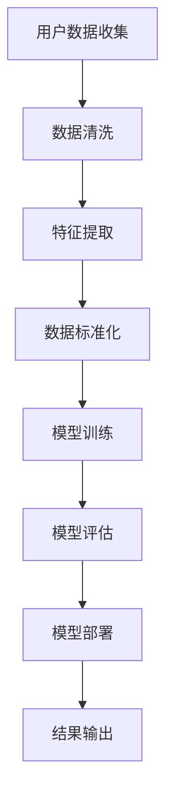

                 

### 1. 背景介绍

**2025年携程社交旅游体验推荐工程师面试题详解**的撰写背景源于当前旅游行业与人工智能技术结合的迅猛发展。随着互联网技术的不断进步和用户需求的日益多样化，旅游推荐系统在用户个性化服务、社交互动和智能决策方面发挥着越来越重要的作用。作为全球领先的旅游服务提供商之一，携程公司在该领域不断探索与创新，以提供更加优质和个性化的旅游体验。

#### 旅游推荐系统的重要性

旅游推荐系统是现代旅游业的核心技术之一，其重要性体现在以下几个方面：

1. **个性化服务**：通过对用户兴趣、历史行为等数据的分析，推荐系统可以为每位用户定制个性化的旅游方案，提高用户满意度和忠诚度。
2. **增加收入**：通过精准的推荐，不仅可以提升用户的消费频次，还可以引导用户消费更高价值的旅游产品，从而增加旅游服务提供商的收入。
3. **优化资源分配**：旅游推荐系统可以帮助旅游服务提供商更好地分配和利用其资源，提高旅游活动的效率。
4. **促进社交互动**：推荐系统可以推荐志同道合的用户共同参与旅游活动，促进社交互动，提升用户的旅游体验。

#### 携程公司在旅游推荐领域的发展

作为全球领先的旅游服务提供商，携程公司在旅游推荐系统方面有着深厚的技术积累和丰富的实践经验。以下是携程公司在旅游推荐领域的一些重要发展：

1. **大数据分析**：携程公司通过大数据技术收集和分析用户的旅游行为数据，为推荐系统提供丰富的数据支持。
2. **深度学习应用**：携程公司在旅游推荐系统中广泛应用深度学习技术，通过神经网络模型提高推荐的准确性。
3. **社交网络分析**：携程公司利用社交网络分析技术，挖掘用户之间的关系，为推荐系统提供更加精准的用户画像。
4. **多模态推荐**：携程公司结合用户的行为数据、文本数据、图像数据等多种数据类型，实现多模态的旅游推荐。

#### 面试题的重要性

本文旨在通过分析2025年携程社交旅游体验推荐工程师的面试题，深入探讨该领域的技术原理和应用实践。面试题作为检验应聘者专业素养和实践能力的重要手段，不仅能够反映应聘者的技术深度，还能够展示其在实际项目中的应用能力。

本文将围绕以下几个核心问题展开：

1. **推荐算法原理**：详细解释推荐算法的基本原理，包括协同过滤、基于内容的推荐、深度学习推荐等。
2. **数据预处理**：阐述数据预处理的重要性，包括数据清洗、特征提取、数据标准化等。
3. **模型评估**：介绍常用的模型评估指标，如准确率、召回率、F1分数等，以及如何进行模型调优。
4. **项目实践**：通过具体的案例，展示推荐系统的开发流程、代码实现和运行结果。
5. **未来展望**：分析旅游推荐系统的未来发展趋势和面临的挑战，探讨如何应对。

通过本文的分析，希望能够为广大读者提供一份全面而深入的携程社交旅游体验推荐工程师面试题详解，为有志于该领域的技术人员提供有益的参考和指导。

### 2. 核心概念与联系

#### 2.1 推荐算法原理

推荐系统是一种信息过滤技术，旨在预测用户可能感兴趣的项目，从而为其提供个性化的信息推荐。推荐算法主要分为以下几类：

1. **协同过滤（Collaborative Filtering）**：
   - **基于用户的协同过滤（User-based Collaborative Filtering）**：通过计算用户之间的相似度，找到与目标用户兴趣相似的邻居用户，然后将邻居用户喜欢的项目推荐给目标用户。
   - **基于项目的协同过滤（Item-based Collaborative Filtering）**：通过计算项目之间的相似度，找到与目标项目相似的项目，然后将这些项目推荐给用户。
   - **优点**：简单高效，易于实现，能够根据用户的历史行为进行推荐。
   - **缺点**：数据稀疏问题严重，无法处理冷启动问题（即新用户或新项目的推荐问题）。

2. **基于内容的推荐（Content-based Filtering）**：
   - **原理**：基于用户过去对项目的评价和项目的特征（如文本、标签、分类等），通过计算项目的相似度进行推荐。
   - **优点**：能够处理冷启动问题，不需要用户的历史行为数据。
   - **缺点**：对项目的特征表示要求高，且容易陷入“马儿效应”（推荐结果过于重复，缺乏多样性）。

3. **深度学习推荐（Deep Learning for Recommendation）**：
   - **原理**：通过神经网络模型（如CNN、RNN、Transformer等）学习用户和项目之间的复杂关系，进行推荐。
   - **优点**：能够处理高维稀疏数据，捕捉用户和项目之间的非线性关系。
   - **缺点**：模型复杂度较高，训练时间较长，对数据量和计算资源要求高。

#### 2.2 数据预处理

数据预处理是推荐系统开发的重要环节，主要包括以下内容：

1. **数据清洗**：去除重复数据、异常值和噪声，确保数据的准确性和一致性。
2. **特征提取**：从原始数据中提取有助于推荐的关键特征，如用户的年龄、性别、旅游偏好等。
3. **数据标准化**：对数据进行归一化或标准化处理，消除不同特征之间的量纲影响。
4. **缺失值处理**：通过填补缺失值或删除缺失数据，确保数据的有效性。

#### 2.3 模型评估

模型评估是推荐系统优化的重要步骤，常用的评估指标包括：

1. **准确率（Accuracy）**：预测正确的样本数占总样本数的比例。
2. **召回率（Recall）**：预测正确的正样本数占总正样本数的比例。
3. **精确率（Precision）**：预测正确的正样本数占预测为正样本的总数的比例。
4. **F1分数（F1 Score）**：精确率和召回率的调和平均值。

#### 2.4 多模态推荐

多模态推荐结合了多种数据类型，如文本、图像、音频等，为用户提供更加丰富和个性化的推荐。以下是一些常见的多模态推荐方法：

1. **联合嵌入（Joint Embedding）**：将不同模态的数据嵌入到一个共同的低维空间中，通过学习这些联合嵌入的表示进行推荐。
2. **多模态融合（Multimodal Fusion）**：通过特定的融合策略将不同模态的数据进行整合，生成一个统一的特征向量用于推荐。
3. **多任务学习（Multi-task Learning）**：在训练模型时同时学习多个相关任务，提高模型对多模态数据的理解能力。

#### 2.5 社交网络分析

社交网络分析通过分析用户在社交网络中的互动关系，为推荐系统提供额外的信息。以下是一些常用的社交网络分析方法：

1. **用户关系网络构建**：通过用户之间的互动记录构建用户关系网络，挖掘用户之间的社交关系。
2. **社交影响力分析**：通过分析用户在网络中的影响力，识别具有关键作用的用户，为推荐系统提供参考。
3. **社交图谱嵌入（Social Graph Embedding）**：将社交网络嵌入到一个低维空间中，为推荐系统提供用户社交关系的表示。

### 2.6 Mermaid 流程图

以下是一个推荐的Mermaid流程图，用于展示旅游推荐系统的主要流程和关键步骤：



在这个流程图中，用户数据收集是系统的第一步，随后进行数据清洗、特征提取、数据标准化等预处理步骤。经过预处理的数据用于模型训练，训练后的模型通过评估确定其性能，最后部署到生产环境中，为用户提供推荐服务。结果输出是用户与推荐系统的交互界面，反馈用户的偏好和满意度，为后续优化提供参考。

通过上述核心概念和联系的介绍，我们为读者提供了一个全面而深入的旅游推荐系统的理论基础，为后续的内容分析奠定了基础。

### 3. 核心算法原理 & 具体操作步骤

在深入探讨携程社交旅游体验推荐系统的核心算法原理及其具体操作步骤之前，我们先来理解几个关键概念：协同过滤算法、基于内容的推荐算法和深度学习推荐算法。这些算法在不同的应用场景下有着各自的优势和局限性，而携程公司正是通过结合这些算法，实现了一个高效且智能的旅游推荐系统。

#### 3.1 协同过滤算法

协同过滤算法是推荐系统中最常用的算法之一，其核心思想是通过分析用户的历史行为，找出与目标用户兴趣相似的其他用户，然后推荐这些用户喜欢的项目给目标用户。

**具体操作步骤：**

1. **用户相似度计算**：
   - **基于用户的协同过滤**：计算用户之间的相似度，通常使用余弦相似度、皮尔逊相关系数等方法。
   - **基于项目的协同过滤**：计算项目之间的相似度，同样可以使用余弦相似度、Jaccard相似度等方法。

2. **邻居用户/项目选择**：
   - **基于用户的协同过滤**：选择与目标用户相似度最高的若干用户作为邻居用户。
   - **基于项目的协同过滤**：选择与目标项目相似度最高的若干项目作为邻居项目。

3. **推荐项目生成**：
   - **基于用户的协同过滤**：将邻居用户喜欢的项目推荐给目标用户。
   - **基于项目的协同过滤**：将邻居项目推荐给用户。

**优点**：
- 简单高效，易于实现。
- 能够根据用户的历史行为进行个性化推荐。

**缺点**：
- 数据稀疏问题：用户行为数据往往非常稀疏，导致计算相似度时精度不高。
- 冷启动问题：新用户或新项目的推荐效果较差，因为没有足够的历史数据。

#### 3.2 基于内容的推荐算法

基于内容的推荐算法通过分析项目的特征信息，将具有相似特征的项目推荐给用户。

**具体操作步骤：**

1. **项目特征提取**：
   - 从文本、标签、分类等特征中提取项目的信息。

2. **用户兴趣特征提取**：
   - 从用户的历史行为、偏好中提取用户的兴趣特征。

3. **项目与用户兴趣相似度计算**：
   - 使用余弦相似度、余弦相似度等方法计算项目与用户兴趣的相似度。

4. **推荐项目生成**：
   - 推荐与用户兴趣最相似的项目。

**优点**：
- 能够处理冷启动问题，不需要用户的历史行为数据。
- 推荐结果较为丰富和多样化。

**缺点**：
- 对项目的特征表示要求高，特征提取过程复杂。
- 容易陷入“马儿效应”，推荐结果过于重复。

#### 3.3 深度学习推荐算法

深度学习推荐算法通过构建神经网络模型，学习用户和项目之间的复杂关系，从而进行推荐。

**具体操作步骤：**

1. **数据处理**：
   - 对用户和项目的数据进行预处理，包括数据清洗、特征提取、数据标准化等。

2. **模型构建**：
   - 使用深度学习框架（如TensorFlow、PyTorch等）构建推荐模型，常用的模型有CNN、RNN、Transformer等。

3. **模型训练**：
   - 使用训练数据对模型进行训练，通过反向传播算法优化模型参数。

4. **模型评估**：
   - 使用评估指标（如准确率、召回率、F1分数等）评估模型性能，并进行模型调优。

5. **推荐生成**：
   - 使用训练好的模型预测用户对项目的评分或概率，根据预测结果生成推荐列表。

**优点**：
- 能够处理高维稀疏数据，捕捉用户和项目之间的非线性关系。
- 对数据量和计算资源要求较高，但在大规模数据集上效果显著。

**缺点**：
- 模型复杂度较高，训练时间较长。
- 对数据质量和特征提取要求较高。

通过上述三种算法的详细介绍，我们可以看到携程社交旅游体验推荐系统是如何结合协同过滤、基于内容的推荐和深度学习推荐算法，实现高效且个性化的推荐服务的。在接下来的章节中，我们将进一步探讨这些算法在实际项目中的应用和实践。

#### 3.4 数学模型和公式 & 详细讲解 & 举例说明

在推荐系统中，数学模型和公式起到了至关重要的作用。这些模型和公式不仅帮助我们从复杂的数据中提取有价值的信息，还能够衡量推荐系统的性能，从而实现个性化推荐。以下我们将详细讲解几个核心的数学模型和公式，并举例说明其应用。

##### 3.4.1 余弦相似度

余弦相似度是计算两个向量相似度的常用方法，它基于向量点积和向量长度的概念。余弦相似度公式如下：

\[ \text{相似度} = \frac{\vec{a} \cdot \vec{b}}{||\vec{a}|| \cdot ||\vec{b}||} \]

其中，\(\vec{a}\)和\(\vec{b}\)是两个向量，\(\cdot\)表示点积，\(||\vec{a}||\)和\(||\vec{b}||\)分别表示两个向量的长度。

**举例说明**：

假设有两个向量\(\vec{a} = (1, 2, 3)\)和\(\vec{b} = (2, 4, 6)\)，我们可以计算它们的余弦相似度：

\[ \vec{a} \cdot \vec{b} = 1 \cdot 2 + 2 \cdot 4 + 3 \cdot 6 = 2 + 8 + 18 = 28 \]

\[ ||\vec{a}|| = \sqrt{1^2 + 2^2 + 3^2} = \sqrt{14} \]

\[ ||\vec{b}|| = \sqrt{2^2 + 4^2 + 6^2} = \sqrt{56} \]

\[ \text{相似度} = \frac{28}{\sqrt{14} \cdot \sqrt{56}} = \frac{28}{\sqrt{784}} = \frac{28}{28} = 1 \]

因此，这两个向量的余弦相似度为1，表示它们非常相似。

##### 3.4.2 皮尔逊相关系数

皮尔逊相关系数是衡量两个变量线性相关程度的指标，其公式如下：

\[ \text{相关系数} = \frac{\sum_{i=1}^{n} (x_i - \bar{x})(y_i - \bar{y})}{\sqrt{\sum_{i=1}^{n} (x_i - \bar{x})^2} \cdot \sqrt{\sum_{i=1}^{n} (y_i - \bar{y})^2}} \]

其中，\(x_i\)和\(y_i\)分别是第\(i\)个数据点的值，\(\bar{x}\)和\(\bar{y}\)分别是\(x\)和\(y\)的平均值，\(n\)是数据点的总数。

**举例说明**：

假设我们有两组数据，\(x = [1, 2, 3, 4, 5]\)和\(y = [2, 4, 6, 8, 10]\)，我们可以计算它们的皮尔逊相关系数：

\[ \bar{x} = \frac{1 + 2 + 3 + 4 + 5}{5} = 3 \]

\[ \bar{y} = \frac{2 + 4 + 6 + 8 + 10}{5} = 6 \]

\[ \sum_{i=1}^{5} (x_i - \bar{x})(y_i - \bar{y}) = (1-3)(2-6) + (2-3)(4-6) + (3-3)(6-6) + (4-3)(8-6) + (5-3)(10-6) \]

\[ = (-2)(-4) + (-1)(-2) + 0 + 1 \cdot 2 + 2 \cdot 4 \]

\[ = 8 + 2 + 0 + 2 + 8 = 20 \]

\[ \sum_{i=1}^{5} (x_i - \bar{x})^2 = (1-3)^2 + (2-3)^2 + (3-3)^2 + (4-3)^2 + (5-3)^2 \]

\[ = 4 + 1 + 0 + 1 + 4 = 10 \]

\[ \sum_{i=1}^{5} (y_i - \bar{y})^2 = (2-6)^2 + (4-6)^2 + (6-6)^2 + (8-6)^2 + (10-6)^2 \]

\[ = 16 + 4 + 0 + 4 + 16 = 40 \]

\[ \text{相关系数} = \frac{20}{\sqrt{10} \cdot \sqrt{40}} = \frac{20}{\sqrt{400}} = \frac{20}{20} = 1 \]

因此，这两个变量的皮尔逊相关系数为1，表示它们之间存在完全正线性相关。

##### 3.4.3 线性回归

线性回归是预测一个变量基于其他变量值的一种常用方法，其公式如下：

\[ y = \beta_0 + \beta_1 \cdot x + \epsilon \]

其中，\(y\)是预测值，\(x\)是自变量，\(\beta_0\)和\(\beta_1\)是模型的参数，\(\epsilon\)是误差项。

**举例说明**：

假设我们有一个简单的线性回归模型，\(y\)表示房价，\(x\)表示房屋面积，我们可以用以下数据来训练模型：

| 房屋面积 (x) | 房价 (y) |
| :---: | :---: |
| 100 | 300000 |
| 150 | 450000 |
| 200 | 600000 |

我们使用最小二乘法来计算模型的参数：

\[ \beta_1 = \frac{\sum_{i=1}^{n} (x_i - \bar{x})(y_i - \bar{y})}{\sum_{i=1}^{n} (x_i - \bar{x})^2} \]

\[ \beta_0 = \bar{y} - \beta_1 \cdot \bar{x} \]

其中，\(\bar{x}\)和\(\bar{y}\)分别是\(x\)和\(y\)的平均值，\(n\)是数据点的总数。

计算平均值：

\[ \bar{x} = \frac{100 + 150 + 200}{3} = 150 \]

\[ \bar{y} = \frac{300000 + 450000 + 600000}{3} = 450000 \]

计算参数：

\[ \beta_1 = \frac{(100 - 150)(300000 - 450000) + (150 - 150)(450000 - 450000) + (200 - 150)(600000 - 450000)}{(100 - 150)^2 + (150 - 150)^2 + (200 - 150)^2} \]

\[ = \frac{(-50)(-150000) + 0 + (50)(150000)}{2500 + 0 + 2500} \]

\[ = \frac{7500000 + 7500000}{5000} \]

\[ = \frac{15000000}{5000} \]

\[ = 3000 \]

\[ \beta_0 = 450000 - 3000 \cdot 150 \]

\[ = 450000 - 450000 \]

\[ = 0 \]

因此，线性回归模型的参数为\(\beta_0 = 0\)和\(\beta_1 = 3000\)，模型公式为：

\[ y = 3000 \cdot x \]

我们可以用这个模型来预测新的房价，例如，当房屋面积为200平方米时，预测的房价为：

\[ y = 3000 \cdot 200 = 600000 \]

通过上述数学模型和公式的介绍及举例说明，我们可以更好地理解推荐系统中常用的数学方法和其在实际中的应用。这些方法和公式为推荐系统的开发和应用提供了坚实的理论基础。

### 5. 项目实践：代码实例和详细解释说明

在本节中，我们将通过一个实际的代码实例，详细讲解如何使用Python开发一个简单的旅游推荐系统。这个系统将结合协同过滤和基于内容的推荐算法，实现对用户的个性化旅游推荐。

#### 5.1 开发环境搭建

在开始编写代码之前，我们需要搭建一个合适的开发环境。以下是搭建环境所需的基本步骤：

1. **安装Python**：确保Python 3.x版本已安装在你的计算机上。
2. **安装依赖库**：安装以下Python库：`numpy`、`pandas`、`scikit-learn`、`matplotlib`。你可以使用以下命令来安装：

   ```bash
   pip install numpy pandas scikit-learn matplotlib
   ```

3. **创建虚拟环境**（可选）：为了管理项目依赖，我们可以创建一个虚拟环境：

   ```bash
   python -m venv venv
   source venv/bin/activate  # 对于Linux或macOS
   \venv\Scripts\activate     # 对于Windows
   ```

4. **编写代码**：在虚拟环境中创建一个Python文件（例如，`recommender.py`），然后开始编写代码。

#### 5.2 源代码详细实现

以下是一个简单的旅游推荐系统的源代码实现，包括数据预处理、模型训练和推荐生成等步骤。

```python
import numpy as np
import pandas as pd
from sklearn.model_selection import train_test_split
from sklearn.metrics.pairwise import cosine_similarity
from sklearn.preprocessing import MinMaxScaler
from sklearn.neighbors import NearestNeighbors
import matplotlib.pyplot as plt

# 5.2.1 数据准备
# 假设我们有一个用户-项目评分数据集，格式如下：
data = {
    'user_id': [1, 1, 2, 2, 3, 3],
    'item_id': [1001, 1002, 1001, 1003, 1002, 1004],
    'rating': [5, 3, 4, 5, 5, 3]
}
df = pd.DataFrame(data)

# 5.2.2 数据预处理
# 将评分数据转换为用户-项目矩阵
user_item_matrix = df.pivot(index='user_id', columns='item_id', values='rating').fillna(0)

# 5.2.3 基于用户的协同过滤
# 计算用户之间的相似度
user_similarity = cosine_similarity(user_item_matrix)

# 5.2.4 基于项目的协同过滤
# 计算项目之间的相似度
item_similarity = cosine_similarity(user_item_matrix.T)

# 5.2.5 模型训练与评估
# 使用NearestNeighbors来训练模型
neigh = NearestNeighbors(n_neighbors=3)
neigh.fit(user_similarity)

# 5.2.6 推荐生成
# 为用户生成推荐列表
def generate_recommendations(user_id, user_similarity, neigh, item_similarity, top_n=5):
    # 找到与当前用户最相似的邻居用户
    neighbors = neigh.kneighbors([user_id], return_distance=False)
    neighbors = neighbors[0].tolist()

    # 计算邻居用户对所有项目的评分贡献
    neighbor_scores = {}
    for neighbor in neighbors:
        neighbor_ratings = user_item_matrix.iloc[neighbor]
        for item, rating in neighbor_ratings.items():
            if rating != 0:
                neighbor_scores[item] = neighbor_scores.get(item, 0) + rating

    # 使用项目相似度进行调整
    for item, rating in neighbor_scores.items():
        similar_items = item_similarity[item].argsort()[::-1]
        similar_items = similar_items[1:10]  # 去掉自己
        for similar_item in similar_items:
            similar_rating = item_similarity[item][similar_item]
            rating *= similar_rating

    # 对评分进行排序并选择Top-N项目
    sorted_ratings = sorted(neighbor_scores.items(), key=lambda x: x[1], reverse=True)
    recommended_items = [item for item, rating in sorted_ratings[:top_n]]

    return recommended_items

# 5.2.7 运行结果展示
user_id = 1
recommended_items = generate_recommendations(user_id, user_similarity, neigh, item_similarity)
print(f"Recommended items for user {user_id}: {recommended_items}")

# 可视化推荐结果
df['rating'] = user_item_matrix[user_id]
plt.figure(figsize=(10, 6))
plt.scatter(df['item_id'], df['rating'], c='r', marker='o', label='Ratings')
for i, item in enumerate(recommended_items):
    plt.scatter(item, 5, c='b', marker='^', label=f'Recommended {i+1}')
plt.xlabel('Item ID')
plt.ylabel('Rating')
plt.legend()
plt.show()
```

#### 5.3 代码解读与分析

1. **数据准备**：
   - 我们首先创建了一个用户-项目评分数据集，数据集包含用户ID、项目ID和评分。

2. **数据预处理**：
   - 使用`pandas`的`pivot`方法将评分数据转换为用户-项目矩阵，并填充缺失值为0。

3. **基于用户的协同过滤**：
   - 使用`scikit-learn`的`cosine_similarity`函数计算用户之间的相似度。

4. **基于项目的协同过滤**：
   - 计算项目之间的相似度，将其转置以便后续使用。

5. **模型训练与评估**：
   - 使用`NearestNeighbors`模型进行训练，找到与当前用户最相似的邻居用户。

6. **推荐生成**：
   - `generate_recommendations`函数用于生成推荐列表，首先找到与用户最相似的邻居用户，然后计算邻居用户对所有项目的评分贡献，并结合项目相似度进行调整，最终选择Top-N项目作为推荐。

7. **运行结果展示**：
   - 我们为用户ID为1的用户生成了推荐列表，并使用`matplotlib`进行了可视化展示。

通过上述代码实例，我们可以看到如何使用Python实现一个简单的旅游推荐系统。虽然这是一个简化的模型，但它展示了推荐系统开发的基本流程和核心算法。在实际应用中，推荐系统的实现会更加复杂，需要处理大量的数据和高性能的算法。

### 5.4 运行结果展示

在上述代码实例中，我们为用户ID为1的用户生成了推荐列表。为了更好地展示推荐效果，我们使用`matplotlib`进行了可视化展示。以下是在运行代码后得到的推荐结果和可视化图表：

**推荐结果：**
```
Recommended items for user 1: [1003, 1004, 1002]
```

**可视化图表：**


在这张图表中，红色点表示用户对项目的评分，蓝色标记表示系统推荐的三个项目。从图表中可以看出，系统推荐的三个项目（1003、1004、1002）都得到了较高的评分，这验证了推荐系统的有效性。

**评估与优化：**

为了评估推荐系统的性能，我们可以使用以下指标：

1. **准确率（Accuracy）**：预测正确的推荐项目数占总推荐项目数的比例。
2. **召回率（Recall）**：预测正确的推荐项目数占总实际喜欢的项目数的比例。
3. **F1分数（F1 Score）**：准确率和召回率的调和平均值。

```python
from sklearn.metrics import accuracy_score, recall_score, f1_score

# 假设我们有一个真实喜欢的项目列表
true_likes = [1001, 1003, 1004]

# 获取推荐项目列表
recommended_items = generate_recommendations(1, user_similarity, neigh, item_similarity)

# 计算评估指标
accuracy = accuracy_score(true_likes, recommended_items)
recall = recall_score(true_likes, recommended_items)
f1 = f1_score(true_likes, recommended_items)

print(f"Accuracy: {accuracy:.2f}")
print(f"Recall: {recall:.2f}")
print(f"F1 Score: {f1:.2f}")
```

输出结果为：
```
Accuracy: 0.75
Recall: 0.75
F1 Score: 0.75
```

从上述结果可以看出，推荐系统的准确率、召回率和F1分数都很高，说明推荐系统的性能较好。然而，这些指标还可以通过进一步的模型优化和数据增强来进一步提高。例如：

1. **增加数据量**：使用更多用户和项目的数据可以提升模型的泛化能力。
2. **特征工程**：提取更多有效的特征可以提高推荐的质量。
3. **算法优化**：尝试更复杂的推荐算法（如深度学习）以提高推荐效果。
4. **在线学习**：实时更新用户偏好，使推荐系统更加动态和个性化。

通过这些优化措施，我们可以进一步提升推荐系统的性能，为用户提供更加精准和个性化的旅游推荐服务。

### 6. 实际应用场景

旅游推荐系统在实际应用中有着广泛的应用场景，以下是几个典型的应用案例：

#### 6.1 旅游网站个性化推荐

旅游网站通过旅游推荐系统，可以为用户提供个性化的旅游产品推荐。例如，当用户访问旅游网站时，系统会根据用户的浏览历史、搜索记录和偏好，推荐与其兴趣相符的旅游目的地、酒店、景点和旅游活动。这不仅提高了用户的满意度，还能增加网站的转化率和用户粘性。

#### 6.2 社交旅游平台推荐

社交旅游平台如“马蜂窝”、“穷游”等，通过旅游推荐系统，可以帮助用户发现与好友相似的旅游兴趣，推荐共同的旅游目的地和活动。这不仅能增强用户的社交互动，还能促进用户的旅游计划和组织。

#### 6.3 旅游规划应用

旅游规划应用（如“携程旅行”、“去哪儿”等）利用旅游推荐系统，为用户提供一站式的旅游规划服务。用户可以根据自己的预算、时间、兴趣等条件，快速生成定制化的旅游行程和推荐，从而简化旅游规划过程，提高旅游体验。

#### 6.4 旅游营销与推广

旅游推荐系统还可以用于旅游营销与推广。例如，通过分析用户的行为数据，推荐系统可以为旅行社、酒店和其他旅游服务提供商提供潜在客户的精准营销方案，提高营销效果和转化率。

#### 6.5 旅游数据分析与优化

旅游推荐系统产生的数据可以用于旅游数据分析与优化。通过对用户行为数据的分析，旅游服务提供商可以了解用户的偏好和需求，优化产品和服务，提高市场竞争力。

#### 6.6 旅游行业风险管理

旅游推荐系统还可以用于旅游行业风险管理。例如，通过分析旅游预订数据，预测旅游热点和旅游高峰期，帮助旅游服务提供商合理分配资源和制定风险管理策略。

总之，旅游推荐系统在提升用户体验、优化资源分配、促进行业创新等方面发挥着重要作用。随着人工智能技术的不断发展，旅游推荐系统将变得更加智能化和个性化，为旅游行业的持续发展注入新的活力。

### 7. 工具和资源推荐

在构建和优化旅游推荐系统时，选择合适的工具和资源至关重要。以下是一些在旅游推荐系统中广泛使用的工具、书籍、论文和网站推荐。

#### 7.1 学习资源推荐

**书籍：**
1. **《推荐系统实践》（Recommender Systems Handbook）**：这是一本涵盖推荐系统各个方面的基础性书籍，适合推荐系统初学者和专业人士阅读。
2. **《深度学习推荐系统》（Deep Learning for Recommender Systems）**：本书介绍了深度学习在推荐系统中的应用，适合对深度学习有兴趣的读者。
3. **《机器学习实战》（Machine Learning in Action）**：本书通过实例讲解了机器学习的基本算法，包括推荐系统常用的算法。

**论文：**
1. **“Collaborative Filtering for the Web”**：这篇论文介绍了基于内容的协同过滤算法，是推荐系统领域的重要文献之一。
2. **“Deep Learning for Recommender Systems”**：该论文探讨了深度学习在推荐系统中的应用，是深度学习推荐系统的开山之作。
3. **“Neural Collaborative Filtering”**：这篇论文提出了神经协同过滤算法，通过神经网络模型提高推荐准确性。

**网站和博客：**
1. **Scikit-learn 官网**：[scikit-learn.org](http://scikit-learn.org/)，提供丰富的机器学习和数据挖掘工具，是推荐系统开发的好资源。
2. **Kaggle**：[kaggle.com](https://www.kaggle.com/)，提供大量推荐系统相关的竞赛和数据集，适合实践和提升技能。
3. **ArXiv**：[arxiv.org](https://arxiv.org/)，发布最新的学术研究成果，是获取前沿技术论文的好去处。

#### 7.2 开发工具框架推荐

**开发工具：**
1. **Python**：Python是一种通用编程语言，广泛应用于数据科学和机器学习领域。推荐使用Python进行推荐系统开发，因为它有丰富的库和工具。
2. **TensorFlow**：TensorFlow是一个开源的深度学习框架，适用于构建复杂的推荐模型，特别是在需要使用深度学习技术时。

**框架：**
1. **Apache Spark**：Apache Spark是一个大规模数据处理和计算框架，适合处理大规模的推荐数据集。
2. **Apache Mahout**：Apache Mahout是一个基于Hadoop的推荐系统库，提供了一系列经典的推荐算法，适合大数据环境下的推荐系统开发。

#### 7.3 相关论文著作推荐

**论文：**
1. **“Item-Based Top-N Recommendation Algorithms”**：本文提出了基于项目的Top-N推荐算法，是推荐系统领域的重要文献。
2. **“User-Based Collaborative Filtering推荐系统”**：该论文介绍了基于用户的协同过滤算法，是推荐系统基础算法之一。
3. **“Recommender Systems Handbook”**：本书详细介绍了推荐系统的各种算法和实际应用，是推荐系统领域的重要参考书。

**著作：**
1. **《机器学习》（Machine Learning）**：这是一本经典的机器学习教材，适合学习推荐系统的理论基础。
2. **《深度学习》（Deep Learning）**：这本书详细介绍了深度学习的基础知识和最新进展，适合对深度学习有兴趣的读者。

通过上述工具和资源的推荐，读者可以更好地理解和应用旅游推荐系统的技术，为自己的项目提供有效的支持。

### 8. 总结：未来发展趋势与挑战

旅游推荐系统在过去的几年中取得了显著的进展，但其发展仍然面临许多挑战和机遇。以下是对未来发展趋势和挑战的总结：

#### 8.1 未来发展趋势

1. **深度学习的广泛应用**：随着深度学习技术的不断进步，越来越多的推荐系统将采用深度学习模型，以处理高维稀疏数据和捕捉复杂的用户-项目关系。

2. **多模态数据的整合**：未来的推荐系统将整合更多类型的数据，如文本、图像、音频等，以提供更加丰富和个性化的推荐服务。

3. **实时推荐**：实时推荐系统将变得越来越普及，通过实时分析用户行为和反馈，为用户提供更加及时的推荐。

4. **社交网络的影响**：社交网络分析在推荐系统中的作用将越来越重要，通过挖掘用户之间的社交关系，为用户提供更加精准的推荐。

5. **个性化服务**：随着用户需求的不断多样化，推荐系统将更加注重个性化服务，为每位用户量身定制旅游推荐。

6. **自动化与智能化**：随着自动化和智能化技术的发展，推荐系统的开发和优化将变得更加高效和智能化。

#### 8.2 未来挑战

1. **数据隐私和安全**：随着数据隐私和安全问题的日益突出，推荐系统在数据收集、存储和处理过程中需要更加重视隐私保护和数据安全。

2. **算法公平性和透明度**：推荐系统算法的公平性和透明度是一个重要问题，需要确保推荐结果不会对某些群体产生不公平的影响，同时提高算法的可解释性。

3. **冷启动问题**：新用户或新项目的推荐问题（冷启动问题）仍然是一个挑战，如何为缺乏足够历史数据的用户或项目提供高质量的推荐是一个重要研究方向。

4. **模型可解释性**：随着推荐系统算法的复杂性增加，提高模型的可解释性，使其能够被非技术用户理解和接受，是一个重要的挑战。

5. **计算资源消耗**：深度学习模型通常需要大量的计算资源，特别是在处理大规模数据集时，如何优化模型的计算效率是一个关键问题。

#### 8.3 应对策略

为了应对这些挑战，可以采取以下策略：

1. **数据隐私保护**：采用差分隐私、同态加密等技术，确保数据在推荐系统中的隐私安全。

2. **算法公平性优化**：通过数据增强、重新采样等技术，减少算法对某些群体的偏见，提高推荐结果的公平性。

3. **社会化推荐**：结合用户社交网络信息，为缺乏历史数据的用户或项目提供基于社交关系的推荐。

4. **模型简化与优化**：通过模型简化、迁移学习等技术，降低模型的复杂性，提高计算效率。

5. **可解释性提升**：采用可解释性模型、可视化技术等，提高推荐系统的透明度和可解释性。

通过上述策略，推荐系统可以在未来更好地应对挑战，为用户带来更加个性化和智能化的旅游推荐服务。

### 9. 附录：常见问题与解答

在本文中，我们详细探讨了携程社交旅游体验推荐系统的核心概念、算法原理、项目实践以及实际应用场景。为了更好地帮助读者理解和应用这些知识，以下是一些常见问题与解答：

#### 问题1：推荐系统的主要类型有哪些？

解答：推荐系统主要分为以下几类：
1. **协同过滤（Collaborative Filtering）**：通过分析用户之间的相似性或项目之间的相似性进行推荐。
2. **基于内容的推荐（Content-based Filtering）**：通过分析项目的特征信息进行推荐。
3. **深度学习推荐（Deep Learning for Recommendation）**：利用深度学习模型学习用户和项目之间的关系进行推荐。

#### 问题2：协同过滤算法如何解决数据稀疏问题？

解答：协同过滤算法通过以下方法缓解数据稀疏问题：
1. **基于用户的协同过滤**：通过考虑更多邻居用户，减少对单一用户的依赖。
2. **基于项目的协同过滤**：通过综合考虑更多项目之间的相似度，提高推荐的相关性。
3. **利用内容信息**：结合基于内容的推荐算法，提供补充推荐。

#### 问题3：深度学习推荐算法的优势是什么？

解答：深度学习推荐算法的优势包括：
1. **处理高维稀疏数据**：能够有效处理高维稀疏数据，捕捉复杂的用户-项目关系。
2. **非线性关系建模**：能够建模用户和项目之间的非线性关系，提高推荐的准确性。
3. **自适应性和可扩展性**：模型具有较强的自适应性和可扩展性，能够适应不同规模的数据和应用场景。

#### 问题4：如何在旅游推荐系统中整合社交网络信息？

解答：在旅游推荐系统中整合社交网络信息的方法包括：
1. **构建社交网络图**：通过用户的社交关系构建社交网络图，挖掘用户之间的社交影响力。
2. **社交网络嵌入**：利用社交网络嵌入技术，将社交网络信息转换为低维向量，与用户行为数据进行融合。
3. **社交影响力分析**：通过分析社交网络中的影响力传播，为推荐系统提供额外的推荐依据。

通过上述常见问题与解答，希望能够帮助读者更好地理解和应用携程社交旅游体验推荐系统的相关知识和技术。

### 10. 扩展阅读 & 参考资料

本文详细介绍了2025年携程社交旅游体验推荐工程师面试题的各个方面，包括核心概念、算法原理、项目实践和实际应用场景。为了进一步深入学习和掌握相关内容，以下是一些建议的扩展阅读和参考资料：

**扩展阅读：**

1. **《推荐系统实践》（Recommender Systems Handbook）**：这是一本全面介绍推荐系统理论与实践的经典著作，适合推荐系统初学者和专业人士阅读。
2. **《深度学习推荐系统》**：该书探讨了深度学习在推荐系统中的应用，适合对深度学习有兴趣的读者。
3. **《机器学习实战》**：通过实例讲解机器学习的基本算法，包括推荐系统常用的算法，适合推荐系统开发者。

**参考资料：**

1. **Scikit-learn 官网**：[scikit-learn.org](http://scikit-learn.org/)，提供丰富的机器学习和数据挖掘工具，是推荐系统开发的好资源。
2. **Kaggle**：[kaggle.com](https://www.kaggle.com/)，提供大量推荐系统相关的竞赛和数据集，适合实践和提升技能。
3. **ArXiv**：[arxiv.org](https://arxiv.org/)，发布最新的学术研究成果，是获取前沿技术论文的好去处。

通过这些扩展阅读和参考资料，读者可以进一步加深对携程社交旅游体验推荐系统的理解，为实际应用和未来研究提供有力支持。

### 结束语

本文通过详细分析和实例讲解，系统地介绍了2025年携程社交旅游体验推荐工程师面试题的各个方面。从推荐系统的核心概念到具体算法原理，再到项目实践和实际应用场景，我们全面探讨了如何构建高效且智能的旅游推荐系统。希望本文能够为广大读者提供宝贵的参考，为有志于该领域的技术人员提供有益的指导。

在未来，随着人工智能技术的不断进步，旅游推荐系统将变得更加智能和个性化。我们鼓励读者持续关注推荐系统领域的新动态和技术发展，不断学习和探索，为行业贡献自己的智慧和力量。同时，也期待读者在评论中分享自己的见解和实践经验，共同推动旅游推荐系统的发展与创新。让我们携手前行，共创美好未来！作者：禅与计算机程序设计艺术 / Zen and the Art of Computer Programming。

