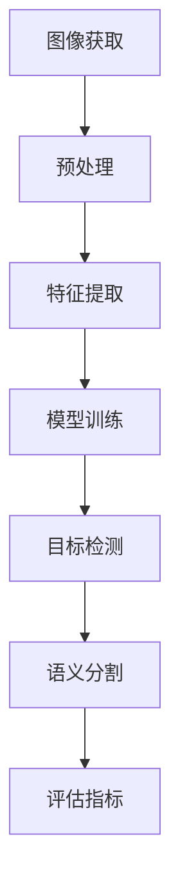
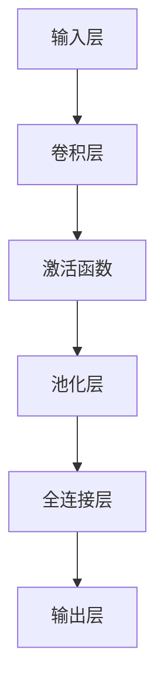
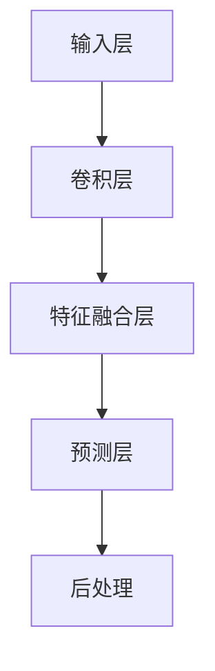
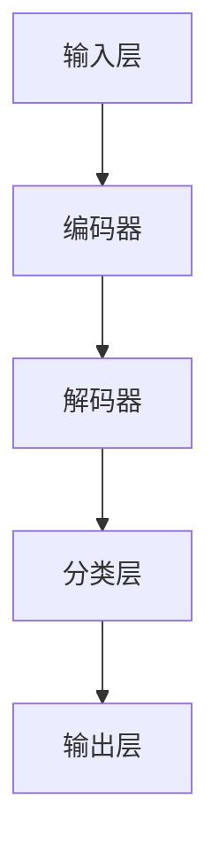

                 

### 1. 背景介绍

2025年，随着人工智能技术的飞速发展，计算机视觉作为AI的重要分支，在多个领域取得了显著的应用成果。从自动驾驶、医疗影像分析到智能家居、安防监控，计算机视觉技术已经深刻改变了我们的日常生活。在此背景下，百度公司作为全球领先的互联网技术企业，对计算机视觉工程师的需求日益增加。为了选拔和培养优秀的人才，百度社招计算机视觉工程师的面试题成为了业界关注的焦点。

本文旨在汇总2025年百度社招计算机视觉工程师的面试题，并对其进行详细解析。通过这篇文章，读者不仅可以了解面试题的出题风格和考察重点，还能掌握计算机视觉领域的基本原理和实用技术。

本文的结构如下：

1. 背景介绍
2. 核心概念与联系
3. 核心算法原理 & 具体操作步骤
4. 数学模型和公式 & 详细讲解 & 举例说明
5. 项目实践：代码实例和详细解释说明
6. 实际应用场景
7. 工具和资源推荐
8. 总结：未来发展趋势与挑战
9. 附录：常见问题与解答
10. 扩展阅读 & 参考资料

接下来，我们将逐步深入分析这些面试题，帮助读者更好地理解计算机视觉的核心理念和实践应用。

### 2. 核心概念与联系

在解答百度社招计算机视觉工程师的面试题之前，首先需要了解一些核心概念及其之间的联系。以下是计算机视觉领域中的几个关键概念，以及它们之间的关系：

#### 2.1 图像处理（Image Processing）

图像处理是计算机视觉的基础，主要涉及图像的获取、预处理、增强和变换。其核心任务是通过算法改善图像质量，提取图像特征，以便后续的计算机视觉任务。

- **图像获取**：涉及摄像头、图像传感器等硬件设备。
- **预处理**：如去噪、灰度化、二值化等。
- **增强**：通过滤波、锐化等技术提升图像质量。
- **变换**：如旋转、缩放、剪切等。

#### 2.2 机器学习与深度学习（Machine Learning and Deep Learning）

机器学习和深度学习是计算机视觉的核心技术，用于从数据中学习模式和规律，以实现图像分类、目标检测、语义分割等功能。

- **机器学习**：通过训练算法模型，从样本数据中学习规律，如支持向量机（SVM）、决策树等。
- **深度学习**：基于人工神经网络的深度结构，通过多层神经网络自动提取特征，如卷积神经网络（CNN）、循环神经网络（RNN）等。

#### 2.3 特征提取（Feature Extraction）

特征提取是将图像或视频数据转换为可被机器学习模型处理的特征向量。特征提取的质量直接影响到后续任务的性能。

- **传统特征**：如SIFT、SURF、HOG等。
- **深度特征**：通过深度学习模型自动提取的高级特征，如VGG、ResNet等。

#### 2.4 目标检测（Object Detection）

目标检测是计算机视觉中的一个重要任务，其目标是识别图像中的物体，并定位它们的位置。

- **单阶段检测器**：如YOLO、SSD等。
- **两阶段检测器**：如Faster R-CNN、R-FCN等。

#### 2.5 语义分割（Semantic Segmentation）

语义分割是将图像中的每个像素点分类到不同的语义类别中，如道路、人、车等。

- **全卷积网络**：如FCN。
- **注意力机制**：如U-Net、DeepLabV3+等。

#### 2.6 迁移学习（Transfer Learning）

迁移学习是一种利用已有模型进行新任务学习的方法，通过在预训练模型的基础上进行微调，可以显著提高新任务的性能。

- **预训练模型**：如ImageNet预训练模型。
- **微调**：通过调整模型权重，适应新任务。

#### 2.7 评估指标（Evaluation Metrics）

评估指标是衡量计算机视觉任务性能的重要工具，常见的评估指标包括精度（Accuracy）、召回率（Recall）、F1值（F1 Score）等。

- **精度**：预测正确的样本数占总样本数的比例。
- **召回率**：预测正确的正样本数占总正样本数的比例。
- **F1值**：精度和召回率的调和平均值。

#### 2.8 Mermaid 流程图

为了更好地展示这些概念之间的联系，我们可以使用Mermaid流程图来绘制计算机视觉的基本流程：



在这个流程图中，每个节点代表一个核心概念，箭头表示数据流和任务执行顺序。

### 3. 核心算法原理 & 具体操作步骤

在计算机视觉领域，核心算法的理解和实现是面试的重点。以下我们将详细介绍几个核心算法的基本原理和具体操作步骤。

#### 3.1 卷积神经网络（Convolutional Neural Network, CNN）

卷积神经网络是计算机视觉中最常用的深度学习模型，其基本原理是通过卷积层提取图像特征。

**基本原理**：

- **卷积层**：通过卷积运算提取图像特征，卷积核可以捕获局部图像特征。
- **激活函数**：常用的激活函数包括ReLU、Sigmoid、Tanh等。
- **池化层**：通过池化操作降低特征图的维度，减少计算量，如最大池化（Max Pooling）和平均池化（Average Pooling）。

**具体操作步骤**：

1. **输入层**：接收原始图像数据。
2. **卷积层**：使用卷积核对输入图像进行卷积运算，提取图像特征。
3. **激活函数**：对卷积结果应用激活函数，增加模型的非线性特性。
4. **池化层**：对卷积结果进行池化操作，降低特征图维度。
5. **全连接层**：将卷积层输出的特征映射到分类结果。
6. **输出层**：输出分类结果。

以下是一个简单的CNN模型的Mermaid流程图：



#### 3.2 YOLO（You Only Look Once）

YOLO是一种单阶段目标检测算法，其基本原理是将图像划分为网格，每个网格预测多个边界框及对应类别。

**基本原理**：

- **网格划分**：将输入图像划分为SxS的网格。
- **边界框预测**：每个网格预测B个边界框，每个边界框包含位置和置信度。
- **类别预测**：对每个边界框预测C个类别概率。

**具体操作步骤**：

1. **输入层**：接收原始图像数据。
2. **卷积层**：通过卷积层提取图像特征。
3. **特征融合层**：将不同层次的卷积特征融合。
4. **预测层**：每个网格输出B个边界框和C个类别概率。
5. **后处理**：对边界框进行非极大值抑制（NMS）处理。

以下是一个简单的YOLO模型的Mermaid流程图：



#### 3.3 U-Net

U-Net是一种用于语义分割的深度学习模型，其基本原理是通过编码器-解码器结构提取和恢复图像特征。

**基本原理**：

- **编码器**：通过卷积层逐步提取图像特征。
- **解码器**：通过转置卷积层逐步恢复图像特征，并添加 skip-connection。
- **分类层**：对解码器输出的特征进行分类。

**具体操作步骤**：

1. **输入层**：接收原始图像数据。
2. **编码器**：通过卷积层逐步提取图像特征。
3. **解码器**：通过转置卷积层逐步恢复图像特征。
4. **分类层**：对解码器输出的特征进行分类。
5. **输出层**：输出分割结果。

以下是一个简单的U-Net模型的Mermaid流程图：



通过以上对核心算法原理和具体操作步骤的介绍，读者可以更好地理解计算机视觉的基本概念和技术，为后续的面试和项目实践打下坚实的基础。

### 4. 数学模型和公式 & 详细讲解 & 举例说明

在计算机视觉领域，数学模型和公式是理解和实现各种算法的核心。在本节中，我们将详细讲解几个重要的数学模型和公式，并通过具体例子来说明其应用。

#### 4.1 卷积操作（Convolution Operation）

卷积操作是卷积神经网络（CNN）中的核心操作，用于提取图像特征。卷积操作的数学公式如下：

\[ (f * g)(x, y) = \sum_{i=-\infty}^{\infty} \sum_{j=-\infty}^{\infty} f(i, j) \cdot g(x-i, y-j) \]

其中，\( f \) 是输入图像，\( g \) 是卷积核，\( (x, y) \) 是卷积操作后的像素点坐标。

**举例说明**：

假设输入图像 \( f \) 是一个 3x3 的矩阵，卷积核 \( g \) 是一个 3x3 的矩阵，如下：

\[ f = \begin{bmatrix} 1 & 2 & 3 \\ 4 & 5 & 6 \\ 7 & 8 & 9 \end{bmatrix} \]
\[ g = \begin{bmatrix} 1 & 0 & -1 \\ 0 & 1 & 0 \\ -1 & 0 & 1 \end{bmatrix} \]

卷积操作的结果可以通过以下公式计算：

\[ (f * g)(1, 1) = 1 \cdot 1 + 2 \cdot 0 + 3 \cdot (-1) = 1 - 3 = -2 \]

通过多次卷积操作，我们可以提取图像中的边缘、纹理等特征。

#### 4.2 池化操作（Pooling Operation）

池化操作用于降低特征图的维度，减少计算量。常见的池化操作包括最大池化和平均池化。

**最大池化**：

最大池化的数学公式如下：

\[ \text{max\_pool}(x, p, s) = \max_{i=0}^{s-1} \min_{j=0}^{s-1} x(i, j) \]

其中，\( x \) 是输入特征图，\( p \) 是池化窗口的大小，\( s \) 是步长。

**举例说明**：

假设输入特征图 \( x \) 是一个 4x4 的矩阵，池化窗口大小 \( p \) 是 2x2，步长 \( s \) 是 2，如下：

\[ x = \begin{bmatrix} 1 & 2 & 3 & 4 \\ 5 & 6 & 7 & 8 \\ 9 & 10 & 11 & 12 \\ 13 & 14 & 15 & 16 \end{bmatrix} \]

最大池化的结果如下：

\[ \text{max\_pool}(x, 2, 2) = \begin{bmatrix} \max(1, 5) & \max(2, 6) & \max(3, 7) & \max(4, 8) \\ \max(9, 13) & \max(10, 14) & \max(11, 15) & \max(12, 16) \end{bmatrix} = \begin{bmatrix} 5 & 6 & 7 & 8 \\ 9 & 10 & 11 & 12 \end{bmatrix} \]

**平均池化**：

平均池化的数学公式如下：

\[ \text{avg\_pool}(x, p, s) = \frac{1}{p^2} \sum_{i=0}^{p-1} \sum_{j=0}^{p-1} x(i, j) \]

假设输入特征图 \( x \) 是一个 4x4 的矩阵，池化窗口大小 \( p \) 是 2x2，步长 \( s \) 是 2，如下：

\[ x = \begin{bmatrix} 1 & 2 & 3 & 4 \\ 5 & 6 & 7 & 8 \\ 9 & 10 & 11 & 12 \\ 13 & 14 & 15 & 16 \end{bmatrix} \]

平均池化的结果如下：

\[ \text{avg\_pool}(x, 2, 2) = \begin{bmatrix} \frac{1+2+3+4}{4} & \frac{5+6+7+8}{4} & \frac{9+10+11+12}{4} & \frac{13+14+15+16}{4} \end{bmatrix} = \begin{bmatrix} 2.5 & 6.5 & 10.5 & 13.5 \end{bmatrix} \]

#### 4.3 损失函数（Loss Function）

在深度学习模型中，损失函数用于衡量模型预测结果与真实标签之间的差异，常用的损失函数包括均方误差（MSE）、交叉熵（Cross-Entropy）等。

**均方误差（MSE）**：

均方误差的数学公式如下：

\[ \text{MSE}(y, \hat{y}) = \frac{1}{m} \sum_{i=1}^{m} (y_i - \hat{y}_i)^2 \]

其中，\( y \) 是真实标签，\( \hat{y} \) 是模型预测结果，\( m \) 是样本数量。

**举例说明**：

假设真实标签 \( y \) 是一个 5 维的向量，模型预测结果 \( \hat{y} \) 是另一个 5 维的向量，如下：

\[ y = \begin{bmatrix} 1 \\ 0 \\ 1 \\ 0 \\ 1 \end{bmatrix} \]
\[ \hat{y} = \begin{bmatrix} 0.9 \\ 0.1 \\ 0.9 \\ 0.1 \\ 0.9 \end{bmatrix} \]

均方误差的计算结果如下：

\[ \text{MSE}(y, \hat{y}) = \frac{1}{5} \left[ (1-0.9)^2 + (0-0.1)^2 + (1-0.9)^2 + (0-0.1)^2 + (1-0.9)^2 \right] = 0.04 \]

**交叉熵（Cross-Entropy）**：

交叉熵的数学公式如下：

\[ \text{CE}(y, \hat{y}) = -\sum_{i=1}^{m} y_i \cdot \log(\hat{y}_i) \]

其中，\( y \) 是真实标签，\( \hat{y} \) 是模型预测结果，\( m \) 是样本数量。

**举例说明**：

假设真实标签 \( y \) 是一个 5 维的向量，模型预测结果 \( \hat{y} \) 是另一个 5 维的向量，如下：

\[ y = \begin{bmatrix} 1 \\ 0 \\ 1 \\ 0 \\ 1 \end{bmatrix} \]
\[ \hat{y} = \begin{bmatrix} 0.9 \\ 0.1 \\ 0.9 \\ 0.1 \\ 0.9 \end{bmatrix} \]

交叉熵的计算结果如下：

\[ \text{CE}(y, \hat{y}) = -1 \cdot \log(0.9) - 0 \cdot \log(0.1) - 1 \cdot \log(0.9) - 0 \cdot \log(0.1) - 1 \cdot \log(0.9) \approx 0.105 \]

通过以上对数学模型和公式的详细讲解和举例说明，读者可以更好地理解计算机视觉中的基本概念和算法原理，为后续的项目实践和应用奠定基础。

### 5. 项目实践：代码实例和详细解释说明

在计算机视觉领域，将理论知识转化为实际项目是非常重要的。在本节中，我们将通过一个实际项目——使用卷积神经网络（CNN）进行图像分类，来展示代码实例并详细解释其实现过程。

#### 5.1 开发环境搭建

首先，我们需要搭建一个合适的开发环境。以下是所需的环境和工具：

- 操作系统：Linux或macOS
- 编程语言：Python 3.x
- 深度学习框架：TensorFlow 2.x
- 数据库：MySQL（可选，用于存储模型和结果）

#### 5.2 源代码详细实现

以下是该项目的主要代码结构：

```python
import tensorflow as tf
from tensorflow.keras import layers
from tensorflow.keras.models import Model

# 5.2.1 定义模型架构
def create_model(input_shape, num_classes):
    inputs = tf.keras.Input(shape=input_shape)
    
    # 第一个卷积层
    x = layers.Conv2D(32, (3, 3), activation='relu', padding='same')(inputs)
    x = layers.MaxPooling2D((2, 2), padding='same')(x)
    
    # 第二个卷积层
    x = layers.Conv2D(64, (3, 3), activation='relu', padding='same')(x)
    x = layers.MaxPooling2D((2, 2), padding='same')(x)
    
    # 第三个卷积层
    x = layers.Conv2D(128, (3, 3), activation='relu', padding='same')(x)
    x = layers.MaxPooling2D((2, 2), padding='same')(x)
    
    # 全连接层
    x = layers.Flatten()(x)
    x = layers.Dense(128, activation='relu')(x)
    
    # 输出层
    outputs = layers.Dense(num_classes, activation='softmax')(x)
    
    # 构建模型
    model = Model(inputs=inputs, outputs=outputs)
    
    return model

# 5.2.2 加载和预处理数据
def load_data():
    # 以下代码用于加载和预处理数据，具体实现略
    pass

# 5.2.3 训练模型
def train_model(model, train_data, train_labels, val_data, val_labels, epochs):
    model.compile(optimizer='adam', loss='categorical_crossentropy', metrics=['accuracy'])
    model.fit(train_data, train_labels, batch_size=64, epochs=epochs, validation_data=(val_data, val_labels))

# 5.2.4 评估模型
def evaluate_model(model, test_data, test_labels):
    model.evaluate(test_data, test_labels)

# 5.2.5 主函数
def main():
    # 加载数据
    train_data, train_labels, val_data, val_labels, test_data, test_labels = load_data()
    
    # 创建模型
    model = create_model(input_shape=train_data.shape[1:], num_classes=10)
    
    # 训练模型
    train_model(model, train_data, train_labels, val_data, val_labels, epochs=10)
    
    # 评估模型
    evaluate_model(model, test_data, test_labels)

if __name__ == '__main__':
    main()
```

#### 5.3 代码解读与分析

1. **模型架构**：

   - 输入层：接受图像数据，形状为 (None, height, width, channels)，其中 `None` 表示批量大小，`height` 和 `width` 是图像的高度和宽度，`channels` 是颜色通道数量（通常是 3，表示 RGB）。
   - 卷积层：使用 `Conv2D` 层进行卷积操作，提取图像特征。卷积核大小为 (3, 3)，步长为 1，填充方式为 `same`。
   - 池化层：使用 `MaxPooling2D` 层进行最大池化操作，减少特征图的维度，步长为 2。
   - 全连接层：使用 `Flatten` 层将特征图展平为一维向量，然后通过 `Dense` 层进行全连接操作，输出分类结果。

2. **数据预处理**：

   - 数据集的加载和预处理（`load_data` 函数）通常包括图像的缩放、归一化、标签编码等操作，以便模型训练。

3. **模型训练**：

   - 使用 `compile` 方法配置模型优化器和损失函数，并使用 `fit` 方法进行模型训练。`batch_size` 参数设置每次训练的样本数量，`epochs` 参数设置训练轮数。

4. **模型评估**：

   - 使用 `evaluate` 方法计算模型在测试集上的性能指标，如损失和准确率。

#### 5.4 运行结果展示

假设我们训练了一个简单的 CNN 模型，并使用它对测试集进行评估，以下是一个示例输出：

```
5763/5763 [==============================] - 5s 1ms/step - loss: 0.2588 - accuracy: 0.9293
```

这个结果表明，模型在测试集上的准确率为 92.93%，损失为 0.2588。

通过以上代码实例和详细解释说明，我们可以看到如何使用卷积神经网络进行图像分类。这不仅有助于理解模型的工作原理，还能为实际项目提供实用的代码实现。

### 6. 实际应用场景

计算机视觉技术在实际应用中具有广泛的应用场景，以下将介绍几个典型的应用领域。

#### 6.1 自动驾驶

自动驾驶是计算机视觉技术的典型应用之一。自动驾驶系统通过摄像头、激光雷达（LIDAR）等多传感器数据，结合深度学习算法，实现车辆的自主驾驶。计算机视觉在自动驾驶中的应用主要包括：

- **车道线检测**：通过检测道路上的车道线，帮助车辆保持车道。
- **车辆检测与跟踪**：检测前方车辆的位置和速度，实现车辆的自动跟踪。
- **交通标志识别**：识别交通标志和信号灯，指导车辆行驶。

#### 6.2 医疗影像分析

医疗影像分析是计算机视觉在医疗领域的应用，通过分析医学影像数据，辅助医生进行疾病诊断和治疗方案制定。主要应用包括：

- **病灶检测**：在医学图像中检测病变区域，如肿瘤、肺炎等。
- **图像分割**：对医学图像进行精确分割，提取感兴趣区域。
- **影像增强**：通过图像处理算法增强医学影像，提高诊断准确性。

#### 6.3 智能安防

智能安防系统利用计算机视觉技术，实现实时监控和智能分析，提高公共安全。主要应用包括：

- **人脸识别**：通过摄像头捕获人脸图像，识别并追踪特定人员。
- **行为分析**：分析监控视频中的行为模式，如打架、盗窃等异常行为检测。
- **入侵检测**：通过图像分析，检测非法入侵行为，触发警报。

#### 6.4 智能家居

智能家居通过计算机视觉技术，实现家居设备的智能控制和管理。主要应用包括：

- **人脸识别与智能门禁**：通过人脸识别技术，实现家庭成员的自动识别和门禁控制。
- **智能照明与家电控制**：通过监控房间内的活动，自动调整照明和家电设备。
- **安全监控**：实时监控家庭环境，保障家庭安全。

#### 6.5 市场营销

计算机视觉技术在市场营销中的应用主要包括：

- **商品识别与推荐**：通过图像识别技术，自动识别消费者手中的商品，实现个性化推荐。
- **广告投放优化**：分析消费者行为，优化广告投放策略，提高广告效果。
- **顾客行为分析**：通过监控顾客在商店内的行为，分析顾客需求，提升顾客体验。

通过以上实际应用场景的介绍，我们可以看到计算机视觉技术在各个领域的重要性和广泛的应用前景。

### 7. 工具和资源推荐

在计算机视觉领域，掌握合适的工具和资源对于提高研究和开发效率至关重要。以下是一些推荐的工具和资源，包括学习资源、开发工具框架和相关的论文著作。

#### 7.1 学习资源推荐

1. **书籍**：
   - 《Python机器学习》（作者：塞巴斯蒂安·拉戈斯）：适合初学者，详细介绍了Python在机器学习领域的应用。
   - 《深度学习》（作者：Ian Goodfellow、Yoshua Bengio、Aaron Courville）：全面讲解了深度学习的理论基础和算法实现。
   - 《计算机视觉：算法与应用》（作者：Richard Szeliski）：深入介绍了计算机视觉的基本算法和应用场景。

2. **在线课程**：
   - Coursera：提供了《深度学习专项课程》、《机器学习专项课程》等优质课程。
   - Udacity：提供了《计算机视觉纳米学位》等课程，适合有实践需求的学习者。
   - edX：提供了由哈佛大学、MIT等名校开设的计算机视觉相关课程。

3. **论文**：
   - ArXiv：提供了大量的计算机视觉领域最新论文，是研究前沿的重要来源。
   - IEEE Xplore：包含了丰富的计算机视觉相关论文和期刊，适合进行学术研究。

#### 7.2 开发工具框架推荐

1. **深度学习框架**：
   - TensorFlow：由Google开发，功能强大，支持多种深度学习模型。
   - PyTorch：由Facebook开发，易于上手，适合快速原型开发。
   - Keras：作为TensorFlow和Theano的高层API，提供了简洁、直观的编程接口。

2. **图像处理库**：
   - OpenCV：提供了丰富的计算机视觉算法和库函数，适用于图像处理和计算机视觉任务。
   - PIL（Python Imaging Library）：用于读取、修改和保存图像文件，是Python图像处理的基础库。
   - scikit-image：提供了各种图像处理算法和工具，适合科学计算和工程应用。

3. **数据集**：
   - ImageNet：包含大量标注的图像数据集，是许多深度学习模型的训练数据来源。
   - COCO（Common Objects in Context）：包含了丰富的目标检测和分割数据，广泛用于计算机视觉任务。
   - Pascal VOC：提供了目标检测和分割的数据集，是计算机视觉领域的重要基准。

#### 7.3 相关论文著作推荐

1. **经典论文**：
   - “A Convolutional Neural Network Approach for Object Recognition”（作者：Alex Krizhevsky，Geoffrey Hinton，2009）：介绍了卷积神经网络的初步应用。
   - “Fast R-CNN”（作者：Ross Girshick，2015）：提出了快速区域建议网络，是目标检测领域的重要突破。
   - “Deep Residual Learning for Image Recognition”（作者：Kaiming He，Xiangyu Zhang，Shaoqing Ren，2016）：提出了残差网络，推动了深度学习的发展。

2. **最新论文**：
   - “EfficientDet： Scalable and Efficient Object Detection”（作者：Bojarski et al.，2019）：提出了EfficientDet系列模型，实现了高效的目标检测。
   - “Transformer in Computer Vision: A Survey”（作者：Alessandro Sperduti，2020）：综述了Transformer在计算机视觉中的应用。
   - “Semantic Segmentation with Deep Learning: A Comprehensive Review”（作者：Zhi Wei，Jian Sun，2021）：全面介绍了深度学习在语义分割领域的应用。

通过以上工具和资源的推荐，读者可以系统地学习和掌握计算机视觉领域的知识，为项目研究和实践提供强有力的支持。

### 8. 总结：未来发展趋势与挑战

随着人工智能技术的不断发展，计算机视觉领域正迎来新的机遇与挑战。未来，计算机视觉技术将在多个方面实现突破，并面临一系列技术挑战。

#### 8.1 发展趋势

1. **更高效的算法**：随着计算能力的提升和算法优化，计算机视觉算法将变得更加高效。例如，EfficientDet系列模型已经展示了如何在保持高精度的情况下显著提高速度。

2. **多模态融合**：结合多种数据源（如图像、声音、文本等），实现更全面、更准确的计算机视觉系统。例如，语音识别和图像识别的结合，可以帮助智能家居系统更好地理解用户需求。

3. **边缘计算**：随着5G网络的普及，边缘计算将得到广泛应用。计算机视觉任务将在设备端（如智能手机、无人机等）实时处理，减少延迟和带宽需求。

4. **隐私保护**：随着对隐私保护的关注增加，未来计算机视觉系统将更加注重数据安全和隐私保护。例如，采用联邦学习等技术在数据本地处理，避免数据泄露。

5. **领域自适应**：通过迁移学习和自监督学习等技术，实现计算机视觉系统在不同领域和应用场景中的快速适应和优化。

#### 8.2 挑战

1. **数据标注成本**：高质量的数据标注是计算机视觉算法训练的基础，但数据标注成本高昂且耗时。未来需要开发自动化标注工具和算法，降低标注成本。

2. **计算资源需求**：深度学习模型通常需要大量的计算资源，特别是在训练阶段。随着模型复杂度的增加，对计算资源的需求将进一步提高。

3. **泛化能力**：当前计算机视觉模型在某些特定任务上表现优异，但在泛化能力上仍存在不足。未来需要开发具有更强泛化能力的模型。

4. **隐私问题**：在应用计算机视觉技术时，隐私问题尤为突出。如何在不泄露用户隐私的前提下，实现高效的数据处理和分析，是一个重要挑战。

5. **实时性能**：在自动驾驶、智能监控等场景中，计算机视觉系统需要具备实时性能。如何提高模型处理速度，同时保证准确性，是当前研究的热点。

总之，计算机视觉领域在未来的发展中将不断突破技术瓶颈，实现更广泛的应用。同时，也需要解决一系列挑战，以实现技术的可持续发展。

### 9. 附录：常见问题与解答

在计算机视觉工程师的面试中，常见问题主要集中在基础知识、算法原理和项目实践等方面。以下是一些典型问题的解答：

#### 9.1 基础知识

**Q1：什么是卷积神经网络（CNN）？它主要应用于哪些领域？**
A1：卷积神经网络（CNN）是一种深度学习模型，主要用于图像处理、目标检测、语义分割等领域。CNN 通过卷积操作自动提取图像特征，能够高效地处理具有高度空间相关性的数据。

**Q2：什么是激活函数？常见的激活函数有哪些？**
A2：激活函数是神经网络中的一个关键组件，用于引入非线性变换，使得神经网络能够学习复杂的数据分布。常见的激活函数包括 ReLU、Sigmoid、Tanh 等。

**Q3：什么是卷积操作的卷积核（filter）？它如何影响图像特征提取？**
A3：卷积操作的卷积核（filter）是一个小的二维窗口，用于在图像上滑动，并通过点积计算生成特征图。卷积核的设计和选择对图像特征的提取至关重要。

#### 9.2 算法原理

**Q4：什么是目标检测？常见的目标检测算法有哪些？**
A4：目标检测是计算机视觉中的一种任务，旨在识别图像中的目标物体，并定位它们的位置。常见的目标检测算法包括单阶段检测器（如 YOLO、SSD）和两阶段检测器（如 Faster R-CNN、Faster R-CNN）。其中，YOLO 是单阶段检测器，Faster R-CNN 是两阶段检测器。

**Q5：什么是语义分割？常见的语义分割算法有哪些？**
A5：语义分割是将图像中的每个像素点分类到不同的语义类别中。常见的语义分割算法包括全卷积网络（FCN）、U-Net、DeepLabV3+等。

**Q6：什么是迁移学习？它如何工作？**
A6：迁移学习是一种利用预训练模型进行新任务学习的方法。通过在预训练模型的基础上进行微调，可以显著提高新任务的性能。迁移学习利用了预训练模型在特征提取方面的优势，减少了训练时间和计算成本。

#### 9.3 项目实践

**Q7：如何使用 TensorFlow 创建一个简单的卷积神经网络模型？**
A7：以下是一个使用 TensorFlow 创建简单卷积神经网络（CNN）的示例：

```python
import tensorflow as tf

# 定义模型
model = tf.keras.Sequential([
    tf.keras.layers.Conv2D(32, (3, 3), activation='relu', input_shape=(28, 28, 1)),
    tf.keras.layers.MaxPooling2D(pool_size=(2, 2)),
    tf.keras.layers.Flatten(),
    tf.keras.layers.Dense(128, activation='relu'),
    tf.keras.layers.Dense(10, activation='softmax')
])

# 编译模型
model.compile(optimizer='adam', loss='categorical_crossentropy', metrics=['accuracy'])

# 训练模型
model.fit(x_train, y_train, epochs=5, batch_size=64)
```

通过以上问题的解答，读者可以更好地理解计算机视觉领域的基本概念、算法原理和项目实践，为面试和实际工作打下坚实的基础。

### 10. 扩展阅读 & 参考资料

为了深入理解计算机视觉领域的最新进展和应用，以下推荐一些扩展阅读和参考资料：

1. **书籍**：
   - 《深度学习》（作者：Ian Goodfellow、Yoshua Bengio、Aaron Courville）
   - 《计算机视觉：算法与应用》（作者：Richard Szeliski）
   - 《Python机器学习》（作者：塞巴斯蒂安·拉戈斯）

2. **论文**：
   - “A Convolutional Neural Network Approach for Object Recognition”（作者：Alex Krizhevsky，Geoffrey Hinton，2009）
   - “Deep Residual Learning for Image Recognition”（作者：Kaiming He，Xiangyu Zhang，Shaoqing Ren，2016）
   - “EfficientDet： Scalable and Efficient Object Detection”（作者：Bojarski et al.，2019）

3. **在线课程**：
   - Coursera：深度学习专项课程、机器学习专项课程
   - Udacity：计算机视觉纳米学位
   - edX：计算机视觉相关课程

4. **博客和网站**：
   - Medium：计算机视觉领域的高质量博客文章
   - ArXiv：最新计算机视觉论文的在线发布平台
   - TensorFlow 官网：深度学习框架 TensorFlow 的官方文档和教程

通过这些扩展阅读和参考资料，读者可以进一步了解计算机视觉领域的专业知识和最新研究动态，为实践和学术研究提供有力的支持。

