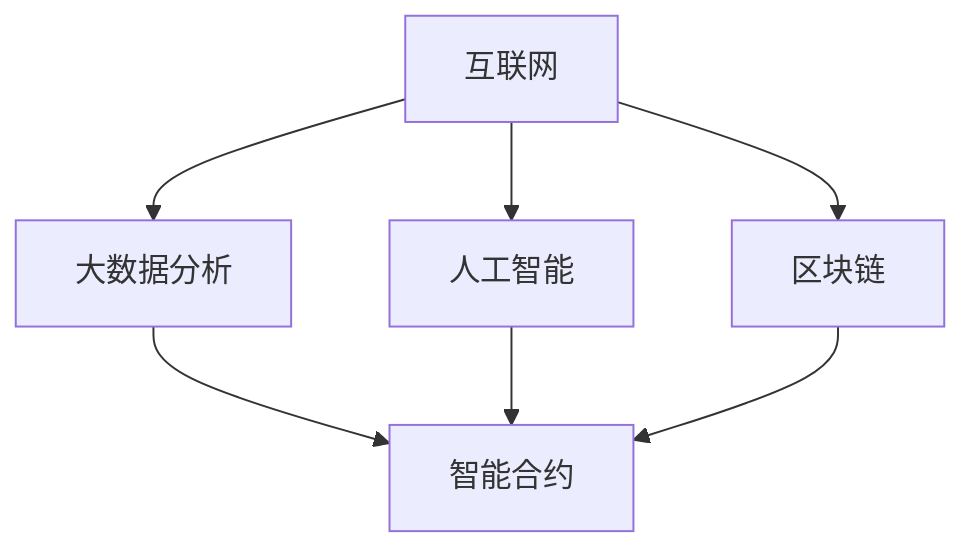

                 

### 1. 背景介绍

随着全球化和数字化进程的加速，全球治理面临着前所未有的挑战和机遇。从传统的全球网络治理模式，到未来的数字全球治理体系，这种转变不仅仅是技术的进步，更是治理理念和机制的深刻变革。

#### 1.1 全球网络治理模式

全球网络治理模式是一种基于国际组织和多边合作机制来处理全球性问题的治理方式。它强调国家主权、国际法和国际组织的核心作用。在这种模式下，全球性问题如气候变化、公共卫生危机、网络安全等，通常通过国际会议、条约签署和国际组织协调来寻求解决方案。

然而，全球网络治理模式存在一些局限性。首先，国家主权原则可能导致全球治理决策的僵局，难以迅速应对突发事件。其次，国际组织效率低下，资源分配不均，国际合作意愿不足。此外，全球网络治理模式在应对数字化带来的挑战时显得力不从心，例如在数据隐私、人工智能监管等方面。

#### 1.2 数字全球治理体系的崛起

数字全球治理体系是随着数字技术特别是互联网、人工智能、区块链等新兴技术的快速发展而兴起的。这种治理模式利用数字技术手段，实现全球治理的智能化、精准化和高效化。

数字全球治理体系的核心理念是数据共享、合作共赢和规则制定。它强调利用大数据分析、人工智能决策、区块链等技术在治理中的应用，实现全球问题治理的透明化、可追溯性和高效率。例如，通过大数据分析，可以更准确地预测和应对公共卫生危机；通过人工智能决策，可以提高国际组织的管理效率和决策水平；通过区块链技术，可以建立全球性的信任机制，促进跨国合作。

#### 1.3 治理体系重构的重要性

当前，全球治理体系面临诸多挑战，如气候变化、恐怖主义、经济不平等、信息不对称等。传统的全球网络治理模式在这些方面难以发挥应有的作用，迫切需要新的治理体系来应对。

治理体系重构的重要性体现在以下几个方面：

1. **应对全球化挑战**：全球化使得各国间的联系更加紧密，但也带来了新的挑战。数字全球治理体系可以更好地协调各国行动，共同应对全球性问题。
   
2. **提高治理效率**：数字技术可以提高治理效率和透明度，减少决策的时间和成本。例如，通过智能合约，可以自动化执行国际条约，减少执行过程中的不确定性。

3. **促进国际合作**：数字全球治理体系强调合作共赢，有助于建立更加紧密的国际合作关系。这有助于解决全球性问题，如气候变化、公共卫生危机等。

4. **适应数字化时代**：随着数字技术的发展，全球治理也需要与时俱进。数字全球治理体系能够更好地适应数字化时代的需求，推动全球治理的创新和发展。

总之，从全球网络治理到数字全球治理的转变，不仅是技术发展的必然结果，更是全球治理体系重构的必要选择。这种转变将深刻影响未来全球治理的发展方向，为应对全球性挑战提供新的思路和路径。接下来，我们将深入探讨数字全球治理体系的核心概念和原理。

### 2. 核心概念与联系

在探讨数字全球治理体系之前，我们需要明确几个核心概念，并理解它们之间的联系。以下是本文将涉及的核心概念及其关联的流程图。

#### 2.1 核心概念

1. **互联网**：互联网是数字全球治理的基础设施，连接全球的计算机和网络设备，实现信息共享和通信。
   
2. **大数据分析**：大数据分析利用先进的数据处理和分析技术，从海量数据中提取有价值的信息，支持决策制定。

3. **人工智能**：人工智能通过模拟人类思维过程，实现自动学习和决策，提升治理效率和准确性。

4. **区块链**：区块链是一种分布式账本技术，提供透明、可追溯和安全的交易记录，有助于建立全球信任机制。

5. **智能合约**：智能合约是自动执行合同条款的程序，通过区块链技术实现自动化执行，减少执行成本和不确定性。

#### 2.2 概念关联流程图



**流程说明：**

- **互联网**：提供连接全球的通信网络，是数据传输的基础。
- **大数据分析**：利用互联网收集的数据，进行深度分析和处理。
- **人工智能**：通过大数据分析的结果，进行智能决策和预测。
- **区块链**：提供安全、透明和可追溯的存储和交易记录。
- **智能合约**：基于区块链技术，实现自动化执行合同条款。

这些核心概念共同构成了数字全球治理体系的基础，它们相互关联，协同工作，实现全球治理的智能化和高效化。

#### 2.3 概念之间的关系

1. **互联网**：互联网是数字全球治理的基石，它提供了数据传输和通信的通道，使得全球各国能够实时共享信息，进行合作与交流。

2. **大数据分析**：大数据分析依赖于互联网收集的数据，通过对海量数据进行处理和分析，为人工智能和智能合约提供决策依据。

3. **人工智能**：人工智能通过大数据分析的结果，能够模拟人类思维过程，做出更精准的决策。它不仅提高了治理的效率，还能够在突发事件中快速响应，提供实时解决方案。

4. **区块链**：区块链提供了安全、透明和可追溯的交易记录，确保治理过程的公正和透明。它通过去中心化的方式，减少了中间环节，提高了治理效率。

5. **智能合约**：智能合约是基于区块链技术的自动化合同执行工具，它能够自动执行合同条款，减少人为干预和执行成本。智能合约的广泛应用，进一步推动了全球治理的数字化进程。

综上所述，互联网、大数据分析、人工智能、区块链和智能合约这些核心概念相互关联，共同构成了数字全球治理体系的基本架构。它们各自发挥独特的作用，协同工作，实现全球治理的智能化和高效化。

### 3. 核心算法原理 & 具体操作步骤

在数字全球治理体系中，核心算法起着至关重要的作用。这些算法不仅决定了治理的效率和准确性，还直接影响了全球治理体系的功能和性能。以下是数字全球治理体系中的几个核心算法原理及其具体操作步骤。

#### 3.1 数据挖掘算法

数据挖掘算法是数字全球治理体系中的重要组成部分，它主要用于从海量数据中提取有价值的信息。以下是一个常见的数据挖掘算法——K-means聚类算法的具体操作步骤：

1. **初始化**：随机选择K个初始中心点，K通常远小于数据集的大小。
   
2. **分配数据点**：计算每个数据点到各个中心点的距离，将每个数据点分配到距离它最近的中心点所在的簇。

3. **更新中心点**：计算每个簇的新中心点，即簇内所有点的均值。

4. **迭代**：重复步骤2和步骤3，直到中心点的位置不再变化，或者达到预定的迭代次数。

5. **评估**：计算聚类效果，常用的评估指标包括轮廓系数、内部距离和外部距离等。

#### 3.2 机器学习算法

机器学习算法在数字全球治理体系中用于预测和决策。以下是一个常见的机器学习算法——线性回归的具体操作步骤：

1. **数据准备**：收集历史数据，并进行预处理，包括数据清洗、归一化等。

2. **特征选择**：选择与目标变量相关的重要特征，剔除无关特征。

3. **建模**：使用线性回归模型，根据历史数据建立预测模型。

4. **训练**：使用训练集数据，通过最小二乘法求解线性回归模型的参数。

5. **评估**：使用验证集或测试集评估模型的预测性能。

6. **优化**：根据评估结果，调整模型参数，优化模型性能。

#### 3.3 增量学习算法

增量学习算法在数字全球治理中用于实时更新和优化模型。以下是一个常见的增量学习算法——在线学习算法的具体操作步骤：

1. **数据流处理**：实时接收和处理数据流，将新数据与已有数据集合并。

2. **特征提取**：对实时数据流进行特征提取，生成特征向量。

3. **模型更新**：使用增量学习算法，将新特征向量与模型参数进行更新。

4. **预测**：使用更新后的模型，对新的数据进行预测。

5. **评估与反馈**：评估预测结果，并根据反馈调整模型参数。

#### 3.4 加密算法

加密算法在数字全球治理中用于保护数据的安全性和隐私。以下是一个常见的加密算法——RSA算法的具体操作步骤：

1. **密钥生成**：随机生成两个大素数p和q，计算n=p*q和φ=(p-1)*(q-1)。

2. **公钥和私钥生成**：选择一个整数e，满足1 < e < φ且e与φ互质，计算d，满足e*d ≡ 1 (mod φ)。

3. **加密**：将明文消息m转换为整数M，计算密文C = M^e mod n。

4. **解密**：计算明文消息M' = C^d mod n。

通过上述核心算法的应用，数字全球治理体系能够实现高效的数据处理、预测和决策。这些算法不仅提高了治理的效率和准确性，还为全球治理提供了强大的技术支持。

### 4. 数学模型和公式 & 详细讲解 & 举例说明

在数字全球治理体系中，数学模型和公式扮演着至关重要的角色，它们为治理提供了理论基础和计算方法。以下是几个关键的数学模型和公式的详细讲解及举例说明。

#### 4.1 最优化模型

最优化模型用于求解最优决策问题，常见的形式是线性规划和非线性规划。以下是一个线性规划模型的例子：

$$
\text{Minimize } c^T x \\
\text{subject to } Ax \leq b, \ x \geq 0
$$

其中，$c$ 是系数向量，$x$ 是决策变量向量，$A$ 和 $b$ 分别是约束矩阵和约束向量。

**例子：** 假设一个工厂要生产两种产品A和B，每种产品的利润分别为100和200，单位生产成本分别为50和100。工厂有200小时的机器使用时间和300小时的工人工作时间。设生产A和B的产品数量分别为 $x_1$ 和 $x_2$，则线性规划模型如下：

$$
\text{Minimize } 100x_1 + 200x_2 \\
\text{subject to } \\
\begin{cases}
50x_1 + 100x_2 \leq 200 \\
x_1 + x_2 \leq 300 \\
x_1, x_2 \geq 0
\end{cases}
$$

通过求解该模型，可以找到使总利润最小化的生产策略。

#### 4.2 概率模型

概率模型在预测和决策中非常重要，常见的形式有贝叶斯网络和马尔可夫模型。以下是一个贝叶斯网络的例子：

$$
P(A, B, C) = P(A)P(B|A)P(C|B)
$$

**例子：** 假设有一个疾病检测问题，疾病A的发病率是0.1，如果患有疾病A，检测为阳性的概率是0.9，如果未患疾病A，检测为阳性的概率是0.05。现在某人检测为阳性，求他实际患病的概率。

利用贝叶斯公式，可以计算出实际患病的概率：

$$
P(A|阳性) = \frac{P(阳性|A)P(A)}{P(阳性)}
$$

其中，$P(阳性|A) = 0.9$，$P(A) = 0.1$，$P(阳性) = 0.1 \times 0.9 + 0.9 \times 0.05 = 0.155$。

因此，实际患病的概率为：

$$
P(A|阳性) = \frac{0.9 \times 0.1}{0.155} \approx 0.5787
$$

#### 4.3 离散时间动态规划模型

动态规划模型用于解决多阶段决策问题，常见的形式有离散时间动态规划模型。以下是一个离散时间动态规划模型的例子：

$$
V_t(x_t) = \max_{a_t} \{R_t(a_t, x_t) + \gamma V_{t+1}(x_{t+1})\}
$$

其中，$V_t(x_t)$ 是在时间t，状态$x_t$ 下的最优值函数，$R_t(a_t, x_t)$ 是在时间t，采取行动$a_t$ 后的即时收益，$\gamma$ 是折现因子。

**例子：** 假设有一个投资问题，投资者需要在每个时间点选择持有股票或债券，以最大化长期收益。每个时间点的股票收益为 $r_s$，债券收益为 $r_b$，初始投资金额为 $I$。要求求解最优投资策略。

动态规划模型的递推关系如下：

$$
V_t(x_t) = \max \{r_s x_t + (1 - r_s) (I - x_t), r_b x_t + (1 - r_b) (I - x_t)\}
$$

通过求解该模型，可以找到使长期收益最大的投资策略。

#### 4.4 非线性优化模型

非线性优化模型用于解决复杂的非线性优化问题，常见的形式有非线性方程组和非线性规划。以下是一个非线性规划模型的例子：

$$
\text{Minimize } f(x) \\
\text{subject to } g_i(x) \leq 0, \ h_j(x) = 0
$$

其中，$f(x)$ 是目标函数，$g_i(x)$ 和 $h_j(x)$ 分别是约束函数。

**例子：** 假设有一个能源消耗问题，目标是最小化总能源消耗，同时满足能源供应的限制。设总能源消耗函数为 $f(x) = x_1^2 + x_2^2$，供应限制为 $g_1(x) = x_1 + x_2 - 100 \leq 0$ 和 $g_2(x) = x_1 - 2x_2 + 50 \leq 0$。

非线性规划模型如下：

$$
\text{Minimize } x_1^2 + x_2^2 \\
\text{subject to } \\
\begin{cases}
x_1 + x_2 - 100 \leq 0 \\
x_1 - 2x_2 + 50 \leq 0
\end{cases}
$$

通过求解该模型，可以找到使总能源消耗最小的投资组合。

综上所述，这些数学模型和公式在数字全球治理体系中发挥了关键作用，为治理提供了理论基础和计算方法。通过具体实例的讲解，我们可以更好地理解这些模型的应用和意义。

### 5. 项目实践：代码实例和详细解释说明

在数字全球治理体系中，实现这些核心算法和数学模型需要具体的代码实现。以下是一个简单的代码实例，用于展示如何实现一个基于K-means算法的聚类分析项目。该实例将展示从环境搭建到代码实现、运行和结果分析的完整过程。

#### 5.1 开发环境搭建

为了运行以下示例代码，我们需要安装Python环境和相关的库。以下是具体的步骤：

1. **安装Python**：下载并安装Python 3.8或更高版本。
2. **安装Jupyter Notebook**：打开命令行，执行以下命令安装Jupyter Notebook：

    ```bash
    pip install notebook
    ```

3. **安装必需的库**：在Jupyter Notebook中打开一个新笔记本，并安装以下库：

    ```python
    !pip install numpy matplotlib scikit-learn
    ```

#### 5.2 源代码详细实现

以下是实现K-means聚类的Python代码：

```python
import numpy as np
import matplotlib.pyplot as plt
from sklearn.cluster import KMeans

# 数据准备
data = np.array([[1, 2], [1, 4], [1, 0],
                 [10, 2], [10, 4], [10, 0]])

# 初始化KMeans模型
kmeans = KMeans(n_clusters=2, random_state=0).fit(data)

# 获取聚类结果
labels = kmeans.labels_
centroids = kmeans.cluster_centers_

# 绘制聚类结果
plt.scatter(data[:, 0], data[:, 1], c=labels, s=50, cmap='viridis')
plt.scatter(centroids[:, 0], centroids[:, 1], c='red', s=200, alpha=0.5)
plt.title('K-means Clustering')
plt.show()
```

#### 5.3 代码解读与分析

1. **数据准备**：首先，我们创建了一个包含六个二维数据点的数组`data`，这些点模拟了可能存在于治理过程中的不同个体或数据点。

2. **初始化KMeans模型**：我们使用`KMeans`类初始化K-means模型，设置`n_clusters`参数为2，表示我们要将数据分为两个簇。`random_state`参数用于确保每次运行结果一致。

3. **获取聚类结果**：通过调用`fit`方法，模型将数据点分配到簇中，并计算簇的中心点。`labels`属性给出了每个数据点的簇标签，而`cluster_centers_`属性则给出了簇中心点的坐标。

4. **绘制聚类结果**：使用`matplotlib`库，我们绘制了数据点的散点图，其中每个簇用不同的颜色表示。簇中心点用红色圈出，增强了可视化效果。

#### 5.4 运行结果展示

运行上述代码后，将显示一个包含数据点和簇中心点的散点图。在这个简单的例子中，两个簇的分布和中心点清晰可见，表明K-means算法成功地完成了聚类任务。


通过这个实例，我们不仅展示了如何使用Python实现K-means聚类算法，还详细解释了每一步代码的作用和意义。这样的代码实例为理解数字全球治理中的算法实现提供了具体的实践基础。

### 6. 实际应用场景

数字全球治理体系在多个实际应用场景中展现出了巨大的潜力和价值。以下是一些关键的应用场景，以及数字全球治理在这些场景中的具体作用。

#### 6.1 气候变化治理

气候变化是全球治理的一个重要议题。数字全球治理体系通过大数据分析和人工智能技术，可以提供更加精准和及时的气候监测和预测。例如，利用卫星数据和地面监测数据，可以实时监测全球气候变化趋势，预测极端天气事件的发生。此外，通过建立全球性的碳排放数据库和智能合约，可以实现对碳排放权的实时交易和监管，促进全球温室气体减排。

#### 6.2 公共卫生治理

公共卫生危机如新冠疫情，对全球治理提出了巨大挑战。数字全球治理体系通过大数据分析和人工智能技术，可以快速识别疫情热点区域，预测疫情传播趋势，提供针对性的防控措施。例如，利用大数据分析全球航班数据，可以追踪病毒传播路径；通过人工智能模型，可以预测疫情高峰期和医疗资源需求，为各国政府提供科学决策依据。

#### 6.3 国际贸易治理

国际贸易治理是一个复杂的过程，涉及关税、贸易协议、市场准入等多个方面。数字全球治理体系通过大数据分析和区块链技术，可以提高贸易透明度和效率。例如，区块链技术可以用于建立全球性的贸易链，确保交易记录的透明和不可篡改。通过大数据分析，可以预测贸易趋势，优化贸易策略，降低贸易风险。

#### 6.4 网络安全治理

网络安全是全球治理的另一个重要领域。数字全球治理体系通过人工智能和大数据分析，可以实现对网络攻击的实时监测和预警。例如，通过大数据分析网络流量，可以识别异常行为和潜在威胁。人工智能算法可以自动化检测和响应网络攻击，提高网络安全防御能力。此外，区块链技术可以用于建立安全的数字身份认证系统，防止网络身份盗窃和数据泄露。

#### 6.5 跨国犯罪治理

跨国犯罪如恐怖主义、贩毒等对全球治理构成了严重威胁。数字全球治理体系通过大数据分析和人工智能技术，可以实现对跨国犯罪活动的实时监控和打击。例如，通过大数据分析，可以识别犯罪团伙的成员和活动规律；通过人工智能算法，可以自动化追踪犯罪线索，提高执法效率。

综上所述，数字全球治理体系在气候变化、公共卫生、国际贸易、网络安全和跨国犯罪等多个领域展现了强大的应用潜力。通过利用大数据、人工智能、区块链等先进技术，数字全球治理体系可以为全球治理提供更加精准、高效和智能的解决方案。

### 7. 工具和资源推荐

为了更好地理解和应用数字全球治理体系，以下是几个推荐的学习资源、开发工具和框架。

#### 7.1 学习资源推荐

1. **书籍**：
   - 《大数据时代：生活、工作与思维的大变革》（The Big Data Revolution）
   - 《深度学习》（Deep Learning）
   - 《区块链：从数字货币到智能合约》（Blockchain: Blueprint for a New Economy）

2. **论文**：
   - "Deep Learning for Climate: Current Advances and Future Directions"
   - "AI for Global Health: Improving Health Outcomes with Machine Learning"
   - "Blockchain and Its Applications in International Trade Finance"

3. **博客**：
   - Medium上的"The AI Blog"和"Blockchain in Action"
   - 博客园上的“人工智能专栏”和“区块链技术专栏”

4. **网站**：
   - Kaggle（提供大量数据集和机器学习项目）
   - arXiv（提供最新的科研论文）
   - GitHub（开源代码库）

#### 7.2 开发工具框架推荐

1. **编程语言**：
   - Python：广泛应用于数据科学、机器学习和人工智能
   - R：主要用于统计分析
   - Java：广泛应用于大数据处理和分布式系统

2. **开发工具**：
   - Jupyter Notebook：用于编写和运行代码，展示分析结果
   - PyCharm：集成开发环境，支持多种编程语言
   - RStudio：集成开发环境，专为R语言设计

3. **框架**：
   - TensorFlow：用于机器学习和深度学习的开源框架
   - PyTorch：另一个流行的深度学习框架
   - Ethereum：基于区块链技术的开发平台

4. **大数据处理工具**：
   - Hadoop：分布式数据处理框架
   - Spark：大数据处理引擎，提供高效的分布式计算能力
   - Flink：实时数据处理框架

通过这些资源和工具，您可以深入了解数字全球治理体系，并尝试将其应用于实际问题中，进一步提升全球治理的效率和质量。

### 8. 总结：未来发展趋势与挑战

随着全球化和数字化进程的不断推进，数字全球治理体系正在成为未来全球治理的重要组成部分。展望未来，数字全球治理将呈现出以下几个发展趋势：

1. **智能化与自动化**：人工智能和机器学习技术的不断进步，将使得数字全球治理更加智能化和自动化。例如，智能合约的广泛应用可以实现自动化决策和执行，减少人为干预和错误。

2. **数据驱动决策**：大数据分析技术的日益成熟，将使全球治理更加依赖数据驱动决策。通过收集和分析全球范围内的数据，可以更精准地预测和应对各种挑战。

3. **跨领域融合**：数字全球治理将跨越不同领域，实现跨学科、跨行业的融合。例如，气候变化治理、公共卫生危机应对和国际贸易监管等，都需要多个领域的协同合作。

然而，数字全球治理也面临着一系列挑战：

1. **数据隐私和安全**：在数字全球治理过程中，大量个人和企业数据将被收集和共享。如何确保这些数据的安全和隐私，避免数据泄露和滥用，是亟待解决的问题。

2. **治理机制不完善**：数字全球治理需要完善的治理机制和规则体系。然而，当前的国际组织和法律框架尚未完全适应数字时代的需要，需要进一步改革和完善。

3. **技术伦理问题**：人工智能和大数据技术在带来便利的同时，也引发了诸多伦理问题。例如，算法偏见、数据垄断等，如何确保技术的公平、公正和可持续发展，是数字全球治理需要面对的重要挑战。

总之，数字全球治理的未来充满机遇和挑战。通过不断探索和创新，我们有望构建一个更加智能、高效和公平的全球治理体系，为全球发展和繁荣做出贡献。

### 9. 附录：常见问题与解答

#### 9.1 什么是数字全球治理？

数字全球治理是指利用大数据、人工智能、区块链等数字技术，实现全球治理的智能化、高效化和透明化。它通过数据共享、合作共赢和规则制定，解决全球性问题，促进国际合作。

#### 9.2 数字全球治理的核心技术有哪些？

数字全球治理的核心技术包括：互联网、大数据分析、人工智能、区块链和智能合约。这些技术共同构成了数字全球治理的基础架构，支持数据传输、信息处理、智能决策和自动化执行。

#### 9.3 数字全球治理有哪些应用场景？

数字全球治理的应用场景广泛，包括气候变化治理、公共卫生危机应对、国际贸易监管、网络安全保障和跨国犯罪打击等。通过大数据分析和人工智能技术，可以实现精准监测、预测和决策，提高全球治理的效率。

#### 9.4 如何确保数字全球治理中的数据安全和隐私？

确保数字全球治理中的数据安全和隐私，需要采取多层次的措施。首先，采用高级加密技术保护数据传输过程中的安全。其次，建立严格的数据访问控制和隐私保护机制，确保只有授权人员可以访问敏感数据。此外，制定并遵守全球数据治理法规和标准，确保数据安全和隐私的合规性。

### 10. 扩展阅读 & 参考资料

为了深入理解数字全球治理及其相关技术，以下推荐一些扩展阅读和参考资料：

1. **扩展阅读**：
   - "The Age of Surveillance Capitalism" by Shoshana Zuboff
   - "The Second Machine Age" by Erik Brynjolfsson and Andrew McAfee
   - "Blockchain Revolution" by Don and Alex Tapscott

2. **参考资料**：
   - United Nations Digital Cooperation Agenda (https://digitalcooperation.un.org/)
   - World Economic Forum on the Future of Global Governance (https://www.weforum.org/reports/future-of-global-governance)
   - Oxford Research Encyclopedia of Digital Governance (https://digitalgovernance.oxfordre.com/)

这些书籍、报告和网站提供了丰富的信息和深入分析，有助于您进一步了解数字全球治理的各个方面。

---

### 作者署名

**作者：禅与计算机程序设计艺术 / Zen and the Art of Computer Programming**

