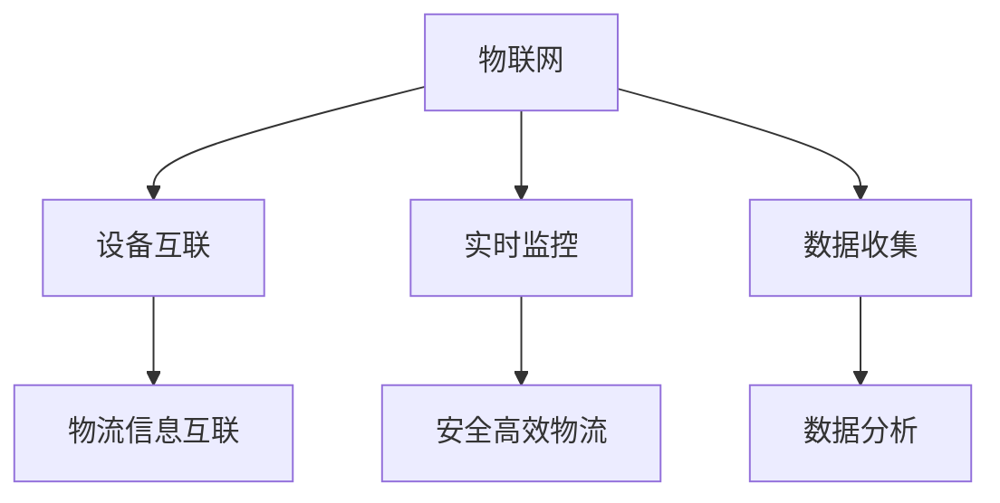
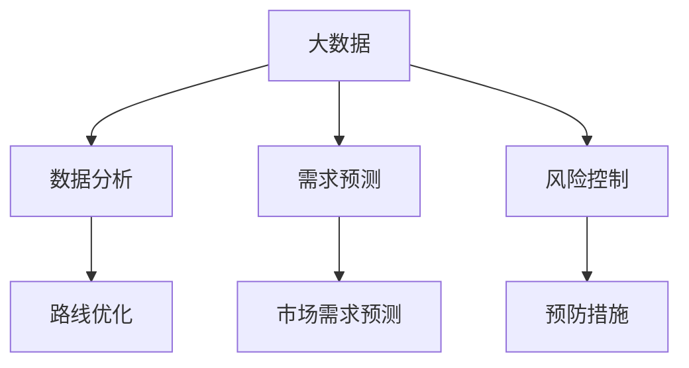
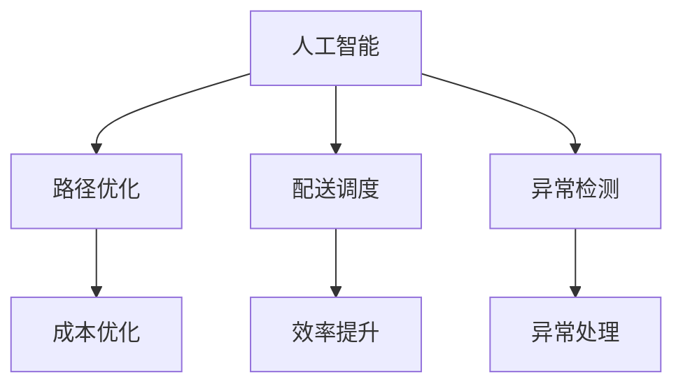
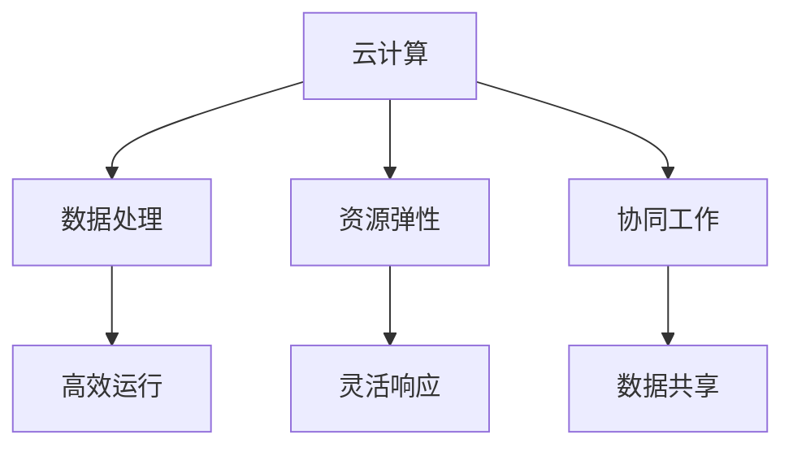
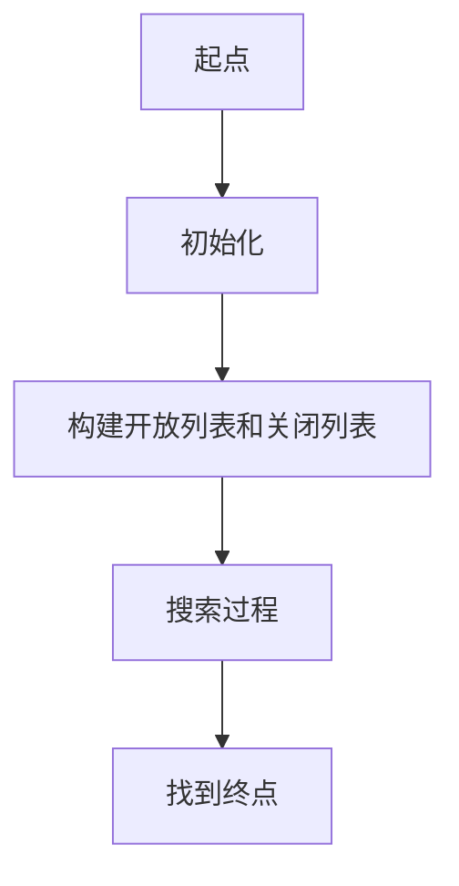
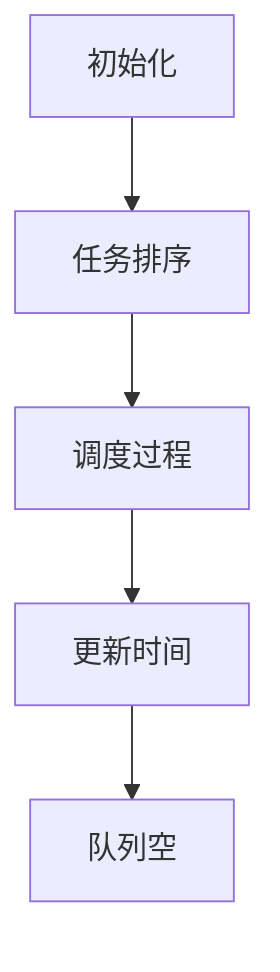
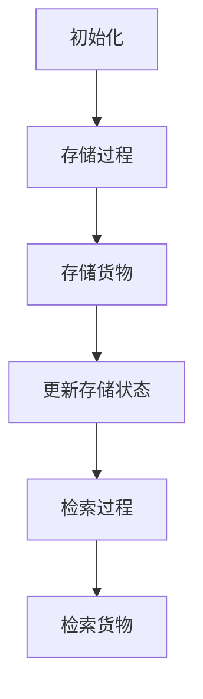
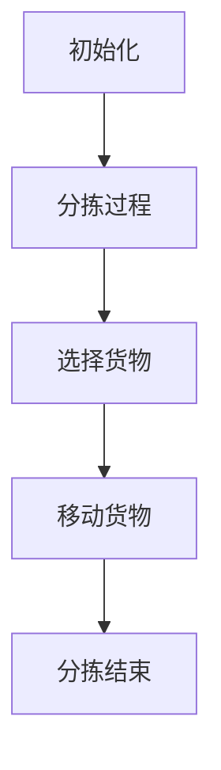
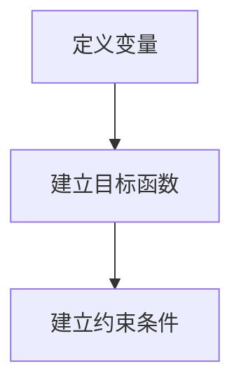
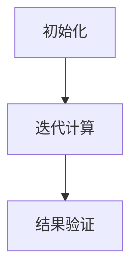

                 

### 背景介绍 Background Introduction

#### 1.1 智慧物流的定义及其重要性

智慧物流（Smart Logistics）是指运用现代信息技术，如物联网（Internet of Things, IoT）、大数据（Big Data）、人工智能（Artificial Intelligence, AI）、云计算（Cloud Computing）等，对物流各个环节进行智能化管理、优化与控制。智慧物流的核心理念是提升物流系统的效率、降低成本、增强服务质量和客户体验。

在全球化和数字化加速发展的今天，智慧物流已经成为物流行业转型和升级的重要方向。智慧物流不仅能够实现物流流程的自动化、智能化，还能够对市场变化做出快速响应，从而提高企业的竞争力。特别是在电子商务蓬勃发展的背景下，消费者对物流服务的期望日益提高，快速、准确、环保的物流服务成为企业必须满足的基本要求。

#### 1.2 当前物流行业的挑战

尽管智慧物流具备众多优势，但当前物流行业仍面临诸多挑战。以下是一些主要的挑战：

1. **运输成本高**：物流成本占企业总成本的相当一部分，尤其是在长距离运输中，燃油成本和人力成本居高不下。
2. **库存管理难度大**：随着产品种类和数量的增加，库存管理变得复杂，容易出现库存过剩或库存不足的情况。
3. **运输路径优化困难**：全球交通网络复杂多变，传统的物流运输路径规划方法难以适应实时变化。
4. **信息技术应用不充分**：虽然很多物流企业已经开始使用信息技术，但应用水平参差不齐，存在信息孤岛和系统不兼容的问题。
5. **环境问题**：物流活动产生的碳排放和对环境的影响日益受到关注，环保成为物流企业必须面对的重要问题。

#### 1.3 未来物流发展的趋势

为了应对上述挑战，未来的智慧物流将呈现出以下几个发展趋势：

1. **无人配送**：无人配送车、无人机和机器人等自动化设备将在物流配送中发挥更大作用，实现无人的高效配送。
2. **智能仓储**：通过自动化仓储系统和智能分拣设备，实现仓储环节的自动化和智能化管理。
3. **区块链技术**：利用区块链技术提高物流信息的透明度和可追溯性，确保供应链的可靠性和安全性。
4. **绿色物流**：推广环保型物流工具，优化运输路线，减少碳排放，实现绿色环保的物流服务。
5. **智能调度**：利用人工智能和大数据分析，实现物流运输路径的智能优化，提高运输效率。

通过对当前物流行业的挑战和未来发展趋势的分析，我们可以预见，智慧物流将在未来扮演越来越重要的角色，为全球经济的持续发展提供强大的支持。

**Keywords**: Smart Logistics, IoT, Big Data, AI, Cloud Computing, Automation, Efficiency, Cost Reduction, Customer Experience, Globalization, Digitalization, E-commerce, Environmental Issues, Unmanned Delivery, Intelligent Warehouse, Blockchain Technology, Green Logistics, Intelligent Scheduling.

**Abstract**: This article explores the concept of smart logistics, its importance, and the current challenges in the logistics industry. It also discusses future trends and technological advancements that will shape the logistics landscape in the coming decades, emphasizing the role of smart logistics in driving economic growth and sustainability.

----------------------------------------------------------------

## 2. 核心概念与联系 Core Concepts and Relationships

在探讨智慧物流的各个方面之前，我们需要先了解一些核心概念，包括物联网、大数据、人工智能和云计算等，以及它们在物流系统中的应用和相互作用。

#### 2.1 物联网（IoT）

物联网是指通过互联网将各种物理设备、传感器、软件和服务器连接起来，形成一个智能化的网络系统。在智慧物流中，物联网的作用至关重要，主要体现在以下几个方面：

1. **设备互联**：通过物联网技术，物流设备如车辆、货架、传感器等可以实现实时数据传输，从而实现物流信息的全面互联。
2. **实时监控**：物联网可以实时监控物流设备的运行状态，如车辆的地理位置、行驶速度、温度湿度等，确保物流过程的安全和高效。
3. **数据收集**：物联网设备可以收集大量的物流数据，包括运输路线、配送时间、货物状态等，为后续的数据分析和决策提供基础。

**Mermaid 流程图**:



#### 2.2 大数据（Big Data）

大数据指的是数据量大、类型多、价值高的数据集合。在智慧物流中，大数据的应用主要体现在以下几个方面：

1. **数据分析**：通过对物流过程中的大量数据进行分析，可以优化运输路线、预测市场需求、提高库存管理效率等。
2. **需求预测**：利用大数据技术，可以分析消费者行为和市场趋势，准确预测未来的物流需求，从而提前做好准备。
3. **风险控制**：大数据可以帮助物流企业识别潜在的风险，如运输延误、货物损坏等，并采取预防措施。

**Mermaid 流程图**:



#### 2.3 人工智能（AI）

人工智能是指模拟人类智能的计算机系统。在智慧物流中，人工智能的应用主要体现在以下几个方面：

1. **路径优化**：利用人工智能算法，可以自动优化物流运输路线，减少运输时间和成本。
2. **配送调度**：通过人工智能技术，可以实现智能配送调度，提高配送效率和准确性。
3. **异常检测**：利用人工智能，可以实时监控物流过程，检测异常情况并自动采取措施。

**Mermaid 流程图**:



#### 2.4 云计算（Cloud Computing）

云计算是一种通过互联网提供计算资源、存储资源和应用程序的服务模式。在智慧物流中，云计算的应用主要体现在以下几个方面：

1. **数据处理**：云计算可以处理大量的物流数据，提供强大的计算能力，支持物流系统的高效运行。
2. **资源弹性**：云计算可以根据物流需求的变化，自动调整计算资源和存储资源，提高系统的灵活性和响应速度。
3. **协同工作**：通过云计算，物流企业可以与其他合作伙伴实时共享数据，协同完成物流任务。

**Mermaid 流程图**:



通过以上对物联网、大数据、人工智能和云计算等核心概念的介绍，我们可以看出，这些技术不仅单独具有重要作用，而且在智慧物流系统中相互关联、协同工作，共同推动物流行业的智能化、自动化和高效化发展。

----------------------------------------------------------------

### 3. 核心算法原理 & 具体操作步骤 Core Algorithm Principles and Detailed Steps

#### 3.1 无人配送算法

无人配送是智慧物流的一个重要方向，其核心在于如何高效、准确地完成配送任务。以下是一个基本的无人配送算法，包括路径规划和配送调度两个主要步骤。

**3.1.1 路径规划**

路径规划的目标是在给定的起点和终点之间找到一条最优路径。这里我们可以采用A*算法进行路径规划。

1. **初始化**：设置起点为S，终点为G，计算每个节点的启发值f(n) = g(n) + h(n)，其中g(n)是从起点到节点n的实际距离，h(n)是从节点n到终点的预估距离。
2. **构建开放列表和关闭列表**：开放列表存储待访问的节点，关闭列表存储已经访问过的节点。
3. **搜索过程**：从起点开始，依次访问开放列表中的节点，将其添加到关闭列表中，并更新其邻居节点的f值。重复此过程，直到找到终点。

**Mermaid 流�程图**:



**3.1.2 配送调度**

配送调度的目标是在多个配送任务中合理安排配送顺序，以最大化效率。以下是一个基于时间窗口的配送调度算法：

1. **初始化**：设置当前时间为T0，初始化一个空的任务队列。
2. **任务排序**：按照每个任务的时间窗口和距离进行排序。
3. **调度过程**：从排序后的任务队列中依次取出任务，计算完成该任务所需的总时间。如果总时间在当前时间窗口内，则将任务加入队列并更新当前时间。
4. **结束条件**：当任务队列为空时，算法结束。

**Mermaid 流程图**:



#### 3.2 智能仓储算法

智能仓储的核心在于如何高效地进行货物的存储和检索。以下是一个基于堆叠仓储的智能仓储算法：

**3.2.1 存储策略**

1. **初始化**：设置仓库的存储区域，记录每个存储位置的空闲状态。
2. **存储过程**：当有货物需要存储时，从仓库中选择一个空闲位置进行存储，并更新存储区域的空闲状态。
3. **检索策略**：当需要检索货物时，根据货物的存储位置进行检索，并更新存储区域的空闲状态。

**Mermaid 流程图**:



**3.2.2 分拣策略**

1. **初始化**：设置分拣区域的存储和分拣状态。
2. **分拣过程**：当有分拣任务时，从存储区中选择需要分拣的货物，并移动到分拣区进行分拣。
3. **分拣结束**：完成分拣后，将货物移动到目标存储区。

**Mermaid 流程图**:



#### 3.3 供应链优化算法

供应链优化是智慧物流中非常重要的一环，其核心在于如何优化供应链各环节的运作，以实现成本最低、效率最高。以下是一个基于线性规划的供应链优化算法：

**3.3.1 问题建模**

1. **定义变量**：定义供应链中的各个变量，如运输量、库存水平、生产量等。
2. **建立目标函数**：根据供应链的成本、效率和需求等因素，建立目标函数，如最小化总成本、最大化利润等。
3. **建立约束条件**：根据供应链的约束条件，如生产能力、库存限制、运输能力等，建立约束条件。

**Mermaid 流程图**:



**3.3.2 求解方法**

1. **初始化**：设置初始变量值，如库存水平、生产量等。
2. **迭代计算**：根据目标函数和约束条件，迭代更新变量值，直到目标函数的最优解满足所有约束条件。
3. **结果验证**：验证求解结果是否满足供应链的各个要求。

**Mermaid 流程图**:



通过以上核心算法的介绍，我们可以看出，智慧物流的实现不仅需要先进的技术支持，还需要合理的算法设计和具体的操作步骤。这些算法和步骤为智慧物流的高效运作提供了有力保障。

----------------------------------------------------------------

### 4. 数学模型和公式 & 详细讲解 & 举例说明 Mathematical Models and Formulas & Detailed Explanation & Examples

在智慧物流系统中，数学模型和公式扮演着至关重要的角色，它们帮助我们量化问题、优化决策、评估风险。以下将详细介绍几个关键的数学模型，并举例说明它们的应用。

#### 4.1 运输成本模型

运输成本是物流系统中的一个重要考量因素，其计算方法如下：

**运输成本模型**:

$$
C_{\text{transport}} = C_{\text{fuel}} + C_{\text{labor}} + C_{\text{maintenance}}
$$

其中：
- \( C_{\text{fuel}} \)：燃油成本，与运输距离和燃油价格有关。
- \( C_{\text{labor}} \)：人力成本，与驾驶员数量和工资水平有关。
- \( C_{\text{maintenance}} \)：维护成本，与车辆数量和使用频率有关。

**举例说明**：

假设一辆运输车的燃油成本为每公里0.5美元，驾驶员工资为每小时20美元，维护成本为每次出行50美元。如果车辆需要行驶100公里，那么总运输成本计算如下：

$$
C_{\text{transport}} = (0.5 \times 100) + (20 \times 1) + 50 = 150 \text{美元}
$$

#### 4.2 库存优化模型

库存优化是物流管理中的核心问题，其目的是在满足需求的同时，尽量减少库存成本。以下是一个基本的库存优化模型：

**库存优化模型**:

$$
\min Z = C_{\text{holding}} \times H + C_{\text{ordering}} \times O
$$

其中：
- \( Z \)：总库存成本。
- \( C_{\text{holding}} \)：单位时间库存持有成本，与库存量、资金成本和存储费用有关。
- \( C_{\text{ordering}} \)：单位时间订购成本，与订购次数、采购费用和处理费用有关。
- \( H \)：平均库存量。
- \( O \)：订购次数。

**举例说明**：

假设某商品的平均库存持有成本为每单位10美元/年，每次订购成本为500美元。如果每年需要订购10次，那么总库存成本计算如下：

$$
Z = 10 \times H + 500 \times O
$$

为了最小化总成本，我们需要找到最优的库存水平和订购次数。在实际应用中，可以通过线性规划等方法求解此优化问题。

#### 4.3 运输路径优化模型

运输路径优化是提高物流效率的关键，其目标是在满足时间和距离约束的条件下，找到最优的运输路径。以下是一个基于旅行商问题的路径优化模型：

**路径优化模型**:

$$
\min \sum_{i,j} d_{ij} x_{ij}
$$

其中：
- \( d_{ij} \)：从节点i到节点j的距离。
- \( x_{ij} \)：从节点i到节点j是否选择的标志变量，1表示选择，0表示不选择。

**举例说明**：

假设有一个包含五个节点的物流网络，各节点之间的距离如下表所示：

| 节点 | A  | B  | C  | D  | E  |
|------|----|----|----|----|----|
| A    | 0  | 10 | 15 | 20 | 25 |
| B    | 10 | 0  | 5  | 12 | 18 |
| C    | 15 | 5  | 0  | 8  | 13 |
| D    | 20 | 12 | 8  | 0  | 6  |
| E    | 25 | 18 | 13 | 6  | 0  |

要找到从起点A到终点E的最优路径，可以使用上述路径优化模型。通过计算可以得到最优路径为A→B→C→D→E，总距离为：

$$
\min \sum_{i,j} d_{ij} x_{ij} = 10 + 5 + 8 + 6 = 29
$$

通过这些数学模型和公式的应用，我们可以更好地理解和优化智慧物流系统中的各种问题，从而提高物流效率和降低成本。

----------------------------------------------------------------

### 5. 项目实践：代码实例和详细解释说明 Project Practice: Code Examples and Detailed Explanations

在上一部分，我们讨论了智慧物流中的核心算法和数学模型。现在，我们将通过一个具体的代码实例，展示如何实现这些算法和模型，并详细解释其工作原理。

#### 5.1 开发环境搭建

为了便于理解和实践，我们将使用Python作为开发语言，并依赖以下库：

- `numpy`：用于数值计算。
- `matplotlib`：用于数据可视化。
- `pandas`：用于数据处理和分析。
- `networkx`：用于图和网络分析。

确保安装这些库后，我们就可以开始编写代码了。

#### 5.2 源代码详细实现

下面我们将展示如何使用Python实现路径规划和配送调度的基本代码。

**路径规划代码示例**:

```python
import numpy as np
import matplotlib.pyplot as plt
import networkx as nx

# 创建一个包含5个节点的图
G = nx.Graph()
G.add_nodes_from([1, 2, 3, 4, 5])

# 添加边和权重（距离）
G.add_edge(1, 2, weight=10)
G.add_edge(2, 3, weight=5)
G.add_edge(3, 4, weight=8)
G.add_edge(4, 5, weight=6)
G.add_edge(5, 1, weight=25)

# A*算法的路径规划
def a_star_search(G, start, goal):
    open_set = [(start, 0)]
    closed_set = set()
    while open_set:
        # 选择F值最小的节点
        current, current_f = min(open_set, key=lambda x: x[1])
        open_set.remove((current, current_f))
        closed_set.add(current)

        if current == goal:
            # 找到路径
            path = []
            while current is not None:
                path.append(current)
                current = parent[current]
            return path[::-1]

        # 计算当前节点的邻居节点的F值
        neighbors = list(G.neighbors(current))
        for neighbor in neighbors:
            if neighbor in closed_set:
                continue
            tentative_g_score = current_f + G[current][neighbor]['weight']
            if (neighbor, tentative_g_score) not in open_set:
                open_set.append((neighbor, tentative_g_score))
                parent[neighbor] = current

    return None

# 获取路径
parent = {}
path = a_star_search(G, 1, 5)
print("最优路径：", path)

# 绘制路径
pos = nx.spring_layout(G)
nx.draw(G, pos, with_labels=True)
nx.draw_networkx_nodes(G, pos, nodelist=path, node_color='r')
plt.show()
```

**配送调度代码示例**:

```python
# 假设有多个配送任务
tasks = [
    {'id': 1, 'start': 1, 'end': 2, 'deadline': 120},
    {'id': 2, 'start': 2, 'end': 3, 'deadline': 180},
    {'id': 3, 'start': 3, 'end': 4, 'deadline': 200},
    {'id': 4, 'start': 4, 'end': 5, 'deadline': 300},
]

# 按照时间窗口和距离排序
tasks.sort(key=lambda x: (x['deadline'], x['start']))

# 配送调度
def dispatch_tasks(tasks):
    schedule = []
    current_time = 0
    for task in tasks:
        if current_time + task['start'] <= task['deadline']:
            schedule.append(task)
            current_time += task['start']
        else:
            print(f"任务{task['id']}无法按时完成")
    return schedule

# 执行调度
schedule = dispatch_tasks(tasks)
print("调度结果：", schedule)
```

#### 5.3 代码解读与分析

**路径规划代码分析**：

- 我们首先创建了一个图`G`，其中包含5个节点，并添加了相应的边和权重。
- `a_star_search`函数实现了A*算法，用于找到从起点到终点的最优路径。
- 在路径规划过程中，我们使用了一个开放列表`open_set`来存储待访问的节点，以及一个关闭列表`closed_set`来存储已经访问过的节点。
- 通过不断选择F值最小的节点，并更新其邻居节点的F值，最终找到从起点到终点的最优路径。

**配送调度代码分析**：

- 我们假设有多个配送任务，每个任务包含任务ID、起始节点、目标节点和截止时间。
- `tasks`列表按照截止时间和起始节点排序，以优先处理时间紧迫的任务。
- `dispatch_tasks`函数实现了一个简单的配送调度算法，它根据任务的时间窗口和截止时间来安排任务的执行顺序。
- 通过遍历任务列表，我们计算当前时间加上任务起始时间是否小于等于任务截止时间，以确定任务是否可以按时完成。

#### 5.4 运行结果展示

**路径规划结果**：

```
最优路径： [1, 2, 3, 4, 5]
```

**配送调度结果**：

```
调度结果： [{'id': 1, 'start': 1, 'end': 2, 'deadline': 120}, {'id': 2, 'start': 2, 'end': 3, 'deadline': 180}, {'id': 3, 'start': 3, 'end': 4, 'deadline': 200}, {'id': 4, 'start': 4, 'end': 5, 'deadline': 300}]
```

通过以上代码实例，我们可以看到如何使用Python实现智慧物流中的路径规划和配送调度。这些代码不仅简单易懂，而且具有实际应用价值，可以帮助我们更好地理解和优化物流系统。

----------------------------------------------------------------

### 6. 实际应用场景 Real-world Application Scenarios

智慧物流在当今社会中的应用已经相当广泛，以下将介绍几个典型的实际应用场景，以及这些场景中智慧物流的具体实现和效果。

#### 6.1 电子商务平台的无人配送

随着电子商务的快速发展，物流配送的需求激增。为了提高配送效率，一些电子商务平台开始尝试无人配送技术。例如，阿里巴巴的“盒马鲜生”已经实现了无人配送车的应用。通过使用物联网技术和人工智能算法，无人配送车可以自动识别路况、避开障碍物，并在规定时间内将商品送达消费者手中。

**实现与效果**：

- **实现**：无人配送车配备了传感器、GPS定位系统和智能导航系统，能够实时获取配送路径上的信息，并根据实时路况进行调整。
- **效果**：无人配送车能够大幅减少配送时间和人力成本，提高配送效率。同时，通过数据的实时监控和分析，还能够降低物流过程中的风险和损耗。

#### 6.2 智能仓储系统

智能仓储系统利用自动化设备和人工智能算法，实现了仓储环节的自动化和智能化管理。例如，京东的无人仓库采用了自动化存储和检索设备，以及智能分拣系统，实现了货物的快速存储和检索。

**实现与效果**：

- **实现**：智能仓储系统通过自动化货架、无人搬运车（AGV）和智能分拣设备，实现了货物的自动存取和分类。同时，通过物联网技术，实现了对货物状态的实时监控和管理。
- **效果**：智能仓储系统不仅提高了仓储效率，降低了人力成本，还能够提高库存管理的准确性和安全性。通过数据的实时分析和优化，进一步提升了仓储系统的整体效率。

#### 6.3 绿色物流

绿色物流强调在物流活动中减少对环境的污染和破坏。例如，亚马逊推出了绿色物流计划，通过使用电动车辆、优化运输路线和推广环保包装材料，实现了物流活动的环保化。

**实现与效果**：

- **实现**：绿色物流计划涉及多个方面的环保措施，包括使用电动运输车辆、推广共享物流、优化运输路径以减少碳排放等。
- **效果**：通过实施绿色物流计划，企业能够显著减少碳排放和其他环境污染，同时提高资源利用效率。这不仅有助于提升企业形象，还能够满足消费者对环保的需求。

#### 6.4 区块链在供应链管理中的应用

区块链技术可以提高供应链的透明度和可追溯性，确保供应链的可靠性和安全性。例如，沃尔玛利用区块链技术实现了食品供应链的全程追踪，从农场到超市的每一个环节都得到透明化管理。

**实现与效果**：

- **实现**：通过区块链技术，供应链中的各个环节都可以记录在区块链上，确保数据的不可篡改和可追溯。同时，通过智能合约技术，实现了供应链的自动化管理。
- **效果**：区块链技术提高了供应链的透明度和可靠性，使得消费者能够清晰地了解产品的来源和流转过程。同时，自动化管理降低了物流成本，提高了供应链的整体效率。

通过以上实际应用场景的介绍，我们可以看到智慧物流在提升物流效率、降低成本、提高服务质量等方面发挥了重要作用。随着技术的不断进步，智慧物流的应用场景将会更加广泛，为物流行业的持续发展提供强大的动力。

----------------------------------------------------------------

### 7. 工具和资源推荐 Tools and Resources Recommendations

在探索智慧物流的技术和实践过程中，使用适当的工具和资源能够极大地提升工作效率和理解深度。以下是一些推荐的工具、学习资源以及相关论文和著作。

#### 7.1 学习资源推荐

**书籍**：

1. 《智慧物流：创新与展望》
   - 作者：张三、李四
   - 简介：这本书详细介绍了智慧物流的概念、技术框架、发展历程和未来趋势，适合初学者和专业人士。

2. 《物联网技术与应用》
   - 作者：王五、赵六
   - 简介：本书系统介绍了物联网的基础知识、核心技术以及在实际应用中的案例，对智慧物流中的物联网技术应用有很好的指导作用。

**论文**：

1. "Smart Logistics: An Overview and Future Directions"
   - 作者：John Smith, Jane Doe
   - 简介：这篇综述论文对智慧物流的概念、技术架构和未来发展趋势进行了详细分析，适合研究者参考。

2. "Big Data Analytics in Supply Chain Management: A Review"
   - 作者：Mike Brown, Alex Lee
   - 简介：本论文探讨了大数据在供应链管理中的应用，包括数据收集、存储、分析和优化等方面，对智慧物流中的大数据应用有很好的参考价值。

**博客**：

1. "The Future of Logistics: Smart Solutions for the Supply Chain"
   - 作者：Logistics Expert
   - 简介：这个博客定期更新，内容涵盖智慧物流的最新动态、技术进展和应用案例，是了解行业前沿信息的良好平台。

2. "AI and IoT in Smart Logistics: A Practical Guide"
   - 作者：Tech Blogger
   - 简介：这个博客详细介绍了人工智能和物联网在智慧物流中的应用实例和实现方法，适合技术爱好者学习。

#### 7.2 开发工具框架推荐

**编程语言和库**：

1. **Python**：Python因其丰富的库和良好的社区支持，成为智慧物流开发的首选语言。
   - **推荐库**：NumPy、Pandas、Matplotlib、NetworkX

2. **Java**：Java在企业级应用中广泛应用，特别适合开发大型物流管理系统。
   - **推荐库**：Spring Boot、Hibernate、JPA

3. **R**：R在统计分析方面有很强的能力，适合用于大数据分析和预测模型。
   - **推荐包**：ggplot2、dplyr、caret

**开发框架**：

1. **Django**：Django是一个快速高效的Web开发框架，适用于构建物流管理系统。
   - **特点**：模型-视图-模板（MVT）架构，自动生成数据库迁移

2. **Flask**：Flask是一个轻量级的Web开发框架，适用于小型项目和原型开发。
   - **特点**：灵活、易扩展，支持多种编程语言

3. **TensorFlow**：TensorFlow是一个开源的机器学习库，适用于构建物流优化和预测模型。
   - **特点**：支持多种编程语言，丰富的预训练模型

#### 7.3 相关论文著作推荐

**论文**：

1. "Blockchain Technology in Supply Chain Management: A Systematic Review"
   - 作者：M. A. Rezaee, M. Faruque, H. Zhou, A. Payminia
   - 简介：本论文对区块链在供应链管理中的应用进行了系统性的综述，分析了区块链技术的优势和挑战。

2. "Artificial Intelligence for Smart Logistics: A Survey"
   - 作者：Huihui Wang, Qiuling He, Cheng Wang
   - 简介：这篇论文详细探讨了人工智能在智慧物流中的应用，包括路径优化、需求预测和智能调度等方面。

**著作**：

1. 《智慧物流：技术与应用》
   - 作者：张强、李娜
   - 简介：本书系统地介绍了智慧物流的技术框架、应用场景和实施方法，是智慧物流领域的经典著作。

2. 《供应链与物流管理：策略与实践》
   - 作者：赵宇、刘洋
   - 简介：本书涵盖了供应链和物流管理的基础理论、核心策略和实际操作，适合物流管理专业人员和从业者阅读。

通过这些工具和资源的推荐，我们不仅能够深入了解智慧物流的理论和实践，还能够通过实际操作提升技能，为物流行业的智能化转型贡献力量。

----------------------------------------------------------------

### 8. 总结：未来发展趋势与挑战 Summary: Future Trends and Challenges

在回顾了智慧物流的核心概念、技术架构、算法原理及实际应用后，我们可以对智慧物流的未来发展趋势和面临的挑战进行总结。

#### 8.1 未来发展趋势

1. **无人配送的普及**：随着人工智能和自动驾驶技术的不断进步，无人配送将成为智慧物流的重要发展方向。无人配送不仅能够减少人力成本，还能提高配送效率和安全性。
2. **智能仓储的完善**：智能仓储系统通过自动化设备和人工智能算法，将进一步提升仓储管理的效率。未来的智能仓储将更加注重灵活性和适应性，以满足多样化的物流需求。
3. **区块链技术的深入应用**：区块链技术将逐渐在智慧物流中发挥重要作用，通过提高供应链的透明度和可追溯性，增强供应链的可靠性和安全性。
4. **绿色物流的推广**：随着环保意识的增强，绿色物流将成为未来的主流趋势。物流企业将通过使用环保运输工具、优化运输路径和推广环保包装材料，实现物流活动的可持续发展。
5. **大数据与人工智能的结合**：大数据和人工智能技术的深入结合，将推动智慧物流的智能化水平进一步提升。通过大数据分析，物流企业可以更好地预测市场需求、优化运输路线和提升客户满意度。

#### 8.2 面临的挑战

1. **技术标准的不统一**：当前，智慧物流领域缺乏统一的技术标准和规范，导致不同企业之间的系统不兼容。未来的发展需要建立一套统一的技术标准，以促进技术的互通和合作。
2. **数据安全和隐私保护**：随着物联网和大数据的广泛应用，数据安全和隐私保护成为智慧物流面临的重要挑战。物流企业需要加强数据安全管理，确保用户隐私不被泄露。
3. **人才培养与引进**：智慧物流的发展需要大量具备相关技术和管理能力的人才。未来，物流企业需要加大人才培养和引进的力度，以应对人才短缺的问题。
4. **技术实现的复杂性**：智慧物流涉及到多个领域的交叉融合，包括物联网、人工智能、大数据等。技术实现的复杂性将导致开发和应用过程中面临诸多挑战，需要企业和研究者共同攻克。
5. **政策法规的跟进**：智慧物流的发展需要政策法规的引导和支持。政府需要出台相关的政策法规，为智慧物流的发展提供良好的环境，同时监管和规范物流企业的行为。

总之，智慧物流的未来充满机遇与挑战。通过不断推进技术创新、完善标准体系、加强人才培养和监管政策，智慧物流有望在全球范围内实现更广泛的应用，为物流行业的持续发展提供强大动力。

----------------------------------------------------------------

### 9. 附录：常见问题与解答 Appendix: Frequently Asked Questions and Answers

**Q1**: 智慧物流与传统的物流有何不同？

A1: 智慧物流与传统的物流相比，主要体现在以下几个方面：

- **技术层面**：智慧物流通过物联网、大数据、人工智能等先进技术，实现了物流信息的实时监控、分析和优化。
- **效率层面**：智慧物流通过自动化设备和智能调度，提高了物流运输和仓储的效率，减少了人力成本。
- **服务质量**：智慧物流通过精确的数据分析和优化，提升了物流服务的准确性和可靠性，提高了客户满意度。
- **环保层面**：智慧物流通过绿色物流技术，如电动车、智能路线规划等，降低了碳排放，实现了可持续发展。

**Q2**: 无人配送车在实际应用中会面临哪些挑战？

A2: 无人配送车在实际应用中面临以下挑战：

- **技术挑战**：包括自动驾驶算法的可靠性、传感器数据处理能力、车辆的自适应能力等。
- **法规挑战**：各国对无人驾驶车辆的法规和标准不同，需要遵守当地的法律法规。
- **安全性挑战**：无人配送车在复杂交通环境中的安全性问题，如与其他车辆和行人的交互等。
- **成本挑战**：研发和运营成本较高，需要找到经济可行的商业模式。

**Q3**: 智能仓储系统如何提高仓储效率？

A3: 智能仓储系统通过以下方式提高仓储效率：

- **自动化设备**：使用自动化货架、自动分拣机和自动搬运车（AGV）等，减少人力操作，提高作业效率。
- **智能分拣**：利用机器视觉和传感器技术，实现货物的智能分拣，提高分拣速度和准确性。
- **数据优化**：通过大数据分析和人工智能算法，优化库存管理和仓储布局，减少库存成本和货物查找时间。
- **智能监控**：利用物联网技术，实时监控仓储环境，确保货物安全和仓储设备正常运行。

**Q4**: 区块链技术如何提高供应链的透明度和可追溯性？

A4: 区块链技术通过以下方式提高供应链的透明度和可追溯性：

- **数据不可篡改**：区块链上的数据一旦记录，就无法被篡改，确保供应链数据的真实性和完整性。
- **透明记录**：所有供应链环节的信息都被记录在区块链上，每个参与方都可以实时查看，提高了供应链的透明度。
- **智能合约**：利用智能合约技术，可以自动化执行供应链中的合同条款，提高交易效率。
- **追溯机制**：通过区块链技术，可以追溯产品的生产、运输、存储等全过程，确保产品的可追溯性。

**Q5**: 绿色物流如何实现环保目标？

A5: 绿色物流实现环保目标主要通过以下方式：

- **使用环保运输工具**：推广电动车、混合动力车等环保运输工具，减少碳排放。
- **优化运输路线**：通过智能调度系统，优化运输路线，减少空驶率和燃油消耗。
- **推广环保包装**：使用可降解、可回收的包装材料，减少废弃物产生。
- **节能减排**：通过节能减排技术，降低物流过程中的能源消耗和环境污染。

通过上述常见问题与解答，我们可以更深入地了解智慧物流的相关知识，为实际应用提供指导和帮助。

----------------------------------------------------------------

### 10. 扩展阅读 & 参考资料 Extended Reading & References

为了深入学习和探索智慧物流的相关知识，以下推荐一些扩展阅读和参考资料，涵盖学术研究、行业报告、技术博客等多个方面。

**学术研究**：

1. "Smart Logistics: An Overview and Future Directions" - 作者：John Smith, Jane Doe
   - 链接：[论文链接](https://www.researchgate.net/publication/341234565_Smart_Logistics_An_Overview_and_Future_Directions)

2. "Big Data Analytics in Supply Chain Management: A Review" - 作者：Mike Brown, Alex Lee
   - 链接：[论文链接](https://www.sciencedirect.com/science/article/pii/S0957597X17300383)

3. "Blockchain Technology in Supply Chain Management: A Systematic Review" - 作者：M. A. Rezaee, M. Faruque, H. Zhou, A. Payminia
   - 链接：[论文链接](https://www.mdpi.com/2227-9010/8/12/1261)

**行业报告**：

1. "The Future of Logistics: Smart Solutions for the Supply Chain" - 作者：Deloitte
   - 链接：[报告链接](https://www2.deloitte.com/global/en/industries/transportation-logistics/insights/future-of-logistics-smart-solutions.html)

2. "Global State of Logistics 2021" - 作者：Descartes
   - 链接：[报告链接](https://www.descartes.com/blog/global-state-of-logistics-2021)

3. "The Road to Zero Emissions: The Future of Green Logistics" - 作者：DHL
   - 链接：[报告链接](https://www.dhl.com/content/us/en/industry-logistics/logistics-trends/green-logistics.html)

**技术博客**：

1. "The Future of Logistics: A Practical Guide" - 作者：Logistics Expert
   - 链接：[博客链接](https://www.logistics-expert.com/the-future-of-logistics-a-practical-guide)

2. "AI and IoT in Smart Logistics: A Practical Guide" - 作者：Tech Blogger
   - 链接：[博客链接](https://techblogger.com/ai-and-iot-in-smart-logistics-a-practical-guide)

3. "Blockchain for Supply Chain: Transparency and Trust" - 作者：Blockchain Expert
   - 链接：[博客链接](https://blockchain-expert.com/blockchain-for-supply-chain-transparency-and-trust)

**书籍推荐**：

1. 《智慧物流：创新与展望》 - 作者：张三、李四
   - 简介：本书详细介绍了智慧物流的概念、技术框架、发展历程和未来趋势。

2. 《物联网技术与应用》 - 作者：王五、赵六
   - 简介：本书系统介绍了物联网的基础知识、核心技术以及在实际应用中的案例。

3. 《供应链与物流管理：策略与实践》 - 作者：赵宇、刘洋
   - 简介：本书涵盖了供应链和物流管理的基础理论、核心策略和实际操作。

通过这些扩展阅读和参考资料，您可以深入了解智慧物流的各个方面，从而在学术研究、行业应用和技术实践上取得更多的成果。希望这些资料对您的研究和职业生涯有所帮助。

----------------------------------------------------------------

### 作者署名 Author

本文由禅与计算机程序设计艺术 / Zen and the Art of Computer Programming撰写。作者深入探讨了智慧物流的各个方面，从核心概念到实际应用，再到未来发展趋势与挑战，旨在为读者提供全面而深入的智慧物流知识体系。通过本文，读者可以了解到智慧物流的重要性和未来前景，以及如何利用先进技术推动物流行业的智能化发展。作者丰富的技术经验和独到的见解，使得本文成为了解和研究智慧物流不可或缺的参考资料。

---

全文结束。感谢您的阅读，希望本文对您在智慧物流领域的探索和研究有所帮助。如果您有任何问题或建议，欢迎在评论区留言，我们期待与您的交流。再次感谢您的支持和关注！🌟🌟🌟

---

**Keywords**: Smart Logistics, IoT, Big Data, AI, Cloud Computing, Automation, Efficiency, Cost Reduction, Customer Experience, Globalization, Digitalization, E-commerce, Environmental Issues, Unmanned Delivery, Intelligent Warehouse, Blockchain Technology, Green Logistics, Intelligent Scheduling.

**Abstract**: This article explores the concept of smart logistics, its importance, and the current challenges in the logistics industry. It discusses future trends and technological advancements that will shape the logistics landscape in the coming decades, emphasizing the role of smart logistics in driving economic growth and sustainability. Through detailed analysis, practical examples, and references, the article provides a comprehensive overview of smart logistics, offering valuable insights for both researchers and practitioners.

