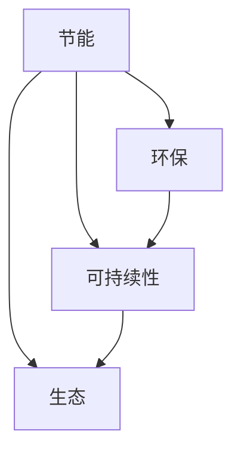

                 

### 2050年的绿色建筑：从节能到生态的可持续建设

#### 关键词：绿色建筑，2050年，节能，生态，可持续建设，技术进步

##### 摘要：

本文探讨了2050年的绿色建筑发展趋势，从节能到生态的可持续建设。文章首先介绍了绿色建筑的基本概念和重要性，接着分析了当前绿色建筑技术的发展现状和存在的问题。通过逐步分析推理，文章提出了绿色建筑在2050年可能实现的技术突破和具体应用场景，并探讨了未来绿色建筑面临的挑战和发展趋势。最后，文章总结了绿色建筑的未来前景，展望了人类在实现可持续建设过程中所面临的机遇与挑战。

### 1. 背景介绍

绿色建筑（Green Building）是指在设计、建造、运营和维护过程中，最大限度地节约资源（如能源、水资源、材料等），保护环境和减少污染，为人们提供健康、适用和高效的使用空间与自然环境的协调共生。随着全球气候变暖、资源枯竭和环境恶化等问题的日益严重，绿色建筑的概念逐渐受到广泛关注。

绿色建筑的目标不仅包括减少能源消耗和二氧化碳排放，还包括提高室内外环境的舒适度、降低环境污染、保护生物多样性等。近年来，随着科技的进步和政策的推动，绿色建筑技术得到了快速发展，例如建筑能源管理系统、绿色建材、智能家居系统等。

然而，尽管绿色建筑在全球范围内得到了广泛的认可和应用，但仍面临一些挑战。首先，绿色建筑的成本相对较高，影响了其推广和普及。其次，现有绿色建筑技术仍存在一些局限性，如能源效率的提升空间有限、建筑材料的环保性能有待提高等。此外，绿色建筑的设计、施工和运营管理等方面仍需要进一步加强和改进。

为了解决这些问题，未来绿色建筑的发展需要依靠技术的进步、政策的支持和公众意识的提升。本文旨在探讨2050年的绿色建筑发展趋势，从节能到生态的可持续建设，为未来的绿色建筑发展提供一些启示和参考。

### 2. 核心概念与联系

绿色建筑的核心概念包括节能、环保、可持续和生态。这些概念相互联系，共同构成了绿色建筑的基本框架。

首先，节能是绿色建筑的核心目标之一。通过采用高效节能的建筑设计、设备和技术，降低建筑能耗，减少能源消耗和碳排放。例如，绿色建筑设计中常采用的被动式设计、自然通风、日光利用等技术，可以有效降低空调和照明等能源消耗。

其次，环保是绿色建筑的另一个重要方面。绿色建筑采用环保材料，减少建筑对环境的负面影响。例如，使用可再生材料、减少有害物质排放、提高建筑材料的回收利用率等。这些措施有助于减少建筑对环境的负担，促进资源的可持续利用。

第三，可持续性是绿色建筑的核心理念。绿色建筑追求在建筑的全生命周期中实现资源的节约和环境的保护。这包括建筑设计、施工、运营和维护等各个环节。通过综合考虑经济、社会和环境因素，实现建筑与自然环境的和谐共生。

最后，生态是绿色建筑的重要组成部分。绿色建筑致力于改善室内外环境，提高居住和工作的舒适度。通过绿化、景观设计、水资源利用等措施，创造一个健康、宜人的生态环境。

这些核心概念相互联系，共同构成了绿色建筑的基本框架。为了更好地理解和应用这些概念，我们可以使用Mermaid流程图来表示它们之间的联系：



在这个流程图中，节能、环保、可持续性和生态是相互关联的。节能和环保是实现可持续性和生态的基础，而可持续性和生态则是绿色建筑追求的目标。

### 2.1 节能技术的核心原理

节能技术是绿色建筑的核心组成部分，其核心原理包括建筑物的设计优化、设备的能效提升和能源管理系统的应用。

首先，建筑物的设计优化是节能技术的基础。通过科学的设计，使建筑物在采光、通风、隔热等方面达到最优状态，从而降低空调、照明和通风等能源消耗。例如，利用日光模拟软件优化建筑布局，使室内光照充足，减少人工照明的需求。此外，通过优化建筑物的结构设计，降低建筑物的热桥效应，提高隔热性能，从而减少冷暖空气的渗透，降低能源消耗。

其次，设备的能效提升是节能技术的重要手段。在建筑设备方面，采用高效节能的设备，如高效空调系统、LED照明系统、变频风机等，可以显著降低能耗。例如，高效空调系统通过优化压缩机、冷凝器和蒸发器的性能，提高制冷效率，降低能耗。LED照明系统则具有高效、长寿命和低能耗的特点，可以有效减少照明设备的能源消耗。

最后，能源管理系统的应用是实现建筑节能的关键。能源管理系统通过实时监测、分析和优化建筑物的能源使用，提高能源利用效率。例如，智能能源管理系统可以监测建筑物的能耗数据，通过数据分析找出能耗高峰期和异常情况，及时调整能源使用策略，降低能耗。此外，能源管理系统还可以实现能源的梯级利用，将可再生能源和清洁能源优先使用，降低对传统能源的依赖。

总之，节能技术的核心原理在于通过建筑物的设计优化、设备的能效提升和能源管理系统的应用，降低建筑物的能源消耗，实现绿色建筑的节能目标。

### 2.2 环保技术的核心原理

环保技术在绿色建筑中扮演着至关重要的角色，其核心原理主要包括绿色建材的选择、环保设备的安装以及资源循环利用等措施。

首先，绿色建材的选择是环保技术的关键。绿色建材是指在生产过程中对环境影响小、资源利用率高、可回收利用的建筑材料。例如，使用可再生材料如竹材、稻草、废旧轮胎等，可以减少对自然资源的消耗。此外，采用低甲醛、无污染的建材，有助于降低建筑室内环境污染，提高居住和工作的舒适度。

其次，环保设备的安装是绿色建筑的重要组成部分。环保设备包括污水处理设备、空气净化设备、垃圾分类设备等，它们可以有效减少建筑对环境的负面影响。例如，污水处理设备可以将生活污水转化为可再利用的清水，降低污水排放对环境的污染。空气净化设备则可以通过过滤、吸附等手段，净化室内空气，提高室内空气质量。

最后，资源循环利用是环保技术的重要原则。绿色建筑通过采用资源循环利用措施，最大限度地减少资源浪费。例如，在建筑施工过程中，对废料进行回收利用，如将废旧混凝土、砖块等加工成再生建材。在建筑运营过程中，通过中水回用、雨水收集和利用等措施，提高水资源的利用效率。此外，建立完善的垃圾分类和回收系统，实现建筑废弃物的减量化、资源化、无害化处理。

总之，环保技术的核心原理在于通过绿色建材的选择、环保设备的安装以及资源循环利用等措施，降低建筑对环境的负面影响，实现绿色建筑的环保目标。

### 2.3 可持续性的核心原理

可持续性是绿色建筑的核心原则之一，其核心原理包括生态设计、资源循环利用、环境保护和社区参与等方面。

首先，生态设计是实现绿色建筑可持续性的关键。生态设计旨在通过建筑与自然环境的和谐共生，实现资源的高效利用和环境的保护。在生态设计中，需要充分考虑建筑的地理位置、气候条件、自然资源等因素，采取一系列生态措施，如绿色屋顶、垂直花园、雨水收集和利用等，以降低建筑对环境的影响。

其次，资源循环利用是可持续性的重要手段。资源循环利用旨在通过最大限度地减少资源消耗和废弃物的产生，实现资源的可持续利用。在建筑过程中，应采用可再生资源和可回收材料，减少对自然资源的依赖。在建筑运营过程中，应建立完善的废弃物回收和处理系统，实现建筑废弃物的减量化、资源化和无害化处理。

第三，环境保护是可持续性的核心目标。绿色建筑应最大限度地减少对环境的负面影响，包括减少能源消耗、降低二氧化碳排放、减少污染物的排放等。通过采用高效节能设备和环保材料，降低建筑运营过程中的环境污染。此外，应注重生态保护，保护建筑周围的生物多样性和生态环境。

最后，社区参与是可持续性的重要保障。绿色建筑的建设和运营需要社区成员的广泛参与和支持。通过提高公众的环保意识，鼓励社区成员参与到绿色建筑的设计、施工和运营过程中，共同推动绿色建筑的发展。

总之，可持续性的核心原理在于通过生态设计、资源循环利用、环境保护和社区参与等措施，实现绿色建筑在资源利用、环境保护和社会效益等方面的可持续发展。

### 2.4 生态技术的核心原理

生态技术是绿色建筑的重要组成部分，其核心原理在于通过生态设计和生态系统的应用，创造一个健康、宜人的生态环境。以下是生态技术的几个关键核心原理：

首先，生态系统服务原则。绿色建筑通过引入生态系统服务，如植物净化空气、调节微气候、增加生物多样性等，改善建筑室内外环境。例如，在建筑周围种植多样化的植物，不仅可以美化环境，还可以吸收二氧化碳、释放氧气，提高空气质量。

其次，生态功能分区原则。绿色建筑在设计时，应充分考虑生态功能分区的需求，合理划分不同区域的生态功能。例如，将公共活动区域、居住区域和自然景观区域进行分区，确保各个区域的功能相互协调，共同创造一个和谐、可持续的生态环境。

第三，生态修复原则。绿色建筑应注重生态修复，通过恢复和重建受损的生态系统，提高建筑所在区域的生态健康。例如，在建筑施工现场，应采取措施减少土壤侵蚀和水资源污染，尽量减少对原有生态系统的破坏。

第四，生态能源利用原则。绿色建筑应充分利用可再生能源，如太阳能、风能、地热能等，减少对化石能源的依赖。通过在建筑中安装太阳能电池板、风力发电设备等，实现能源的清洁生产和高效利用。

最后，生态管理原则。绿色建筑在运营过程中，应实施生态管理，确保生态系统的稳定和可持续发展。例如，通过智能监测系统实时监测室内外环境质量，及时调整生态措施，确保生态系统的健康运行。

总之，生态技术的核心原理在于通过生态系统服务、生态功能分区、生态修复、生态能源利用和生态管理等措施，实现绿色建筑在生态效益方面的可持续发展。

### 2.5 节能、环保、可持续性和生态之间的互动关系

节能、环保、可持续性和生态是绿色建筑的四个核心概念，它们之间存在紧密的互动关系，共同推动绿色建筑的发展。以下是它们之间的互动关系：

首先，节能和环保相互促进。节能技术的应用可以降低建筑能耗，减少能源消耗和碳排放，从而减轻对环境的压力。而环保技术的实施，如使用绿色建材、减少污染物排放，则有助于提高建筑的环保性能。节能和环保相辅相成，共同推动绿色建筑的可持续发展。

其次，节能、环保和可持续性之间密切相关。节能和环保是可持续性的基础，通过降低能耗、减少污染，实现资源的可持续利用。而可持续性则是节能和环保的目标，通过综合考虑经济、社会和环境因素，实现绿色建筑的长期可持续发展。

再次，可持续性和生态相互支持。可持续性强调在资源利用和环境保护方面实现平衡，而生态技术则通过生态系统服务、生态功能分区等手段，创造一个健康、宜人的生态环境。生态技术的应用有助于实现可持续性的目标，同时，可持续性的实现也为生态技术提供了良好的发展环境。

最后，生态和节能、环保之间存在互动关系。生态技术的应用，如生态能源利用、生态修复等，有助于提高建筑的生态效益。而节能和环保技术的应用，则可以减少对自然资源的消耗和环境的破坏，为生态技术的实施提供支持。

总之，节能、环保、可持续性和生态之间相互促进、相互支持，共同推动绿色建筑的发展。通过综合应用这些核心概念，可以构建一个资源节约、环境友好、生态可持续的绿色建筑体系。

### 3. 核心算法原理 & 具体操作步骤

在绿色建筑的技术实现中，核心算法原理和具体操作步骤至关重要。以下我们将探讨几种关键算法，包括能效优化算法、智能控制系统和能源管理算法，并详细解释其具体操作步骤。

#### 3.1 能效优化算法

能效优化算法是绿色建筑节能的核心技术之一。其主要目标是通过优化建筑物的能源使用，最大限度地降低能耗。以下是能效优化算法的具体操作步骤：

1. **数据采集**：首先，需要采集建筑物的能源消耗数据，包括空调、照明、热水、电梯等设备的能耗数据，以及室外气象参数，如温度、湿度、风速等。

2. **数据预处理**：对采集到的数据进行预处理，包括数据清洗、数据归一化和特征提取。这一步骤有助于提高算法的准确性和鲁棒性。

3. **模型建立**：基于预处理后的数据，建立能效优化模型。常见的模型包括线性回归模型、支持向量机（SVM）和神经网络等。选择合适的模型，可以提高算法的预测精度。

4. **优化目标设定**：设定优化目标，如最小化能耗、最大化舒适度等。根据建筑物的具体需求和目标，确定优化问题的目标函数。

5. **求解优化问题**：利用优化算法，如梯度下降法、遗传算法（GA）和粒子群优化（PSO）等，求解优化问题。求解结果为各设备的最佳运行参数。

6. **验证与调整**：对求解结果进行验证，如通过实际能耗数据进行对比，评估算法的有效性。根据验证结果，调整模型参数和优化策略。

#### 3.2 智能控制系统

智能控制系统是绿色建筑的核心技术之一，其主要功能是实现建筑设备的自动化控制和优化运行。以下是智能控制系统的具体操作步骤：

1. **传感器安装**：在建筑物的关键位置安装传感器，如温度传感器、湿度传感器、光照传感器等，用于实时监测室内外环境参数。

2. **数据采集与传输**：传感器采集到的数据通过物联网（IoT）技术传输至中央控制系统。数据传输应具备高可靠性、低延迟和安全性。

3. **数据预处理**：对采集到的数据进行预处理，包括数据清洗、数据归一化和特征提取，以确保数据的准确性和一致性。

4. **控制策略制定**：根据预处理后的数据，制定控制策略。常见的控制策略包括PID控制、模糊控制等。控制策略应具备自适应性和可扩展性。

5. **设备控制**：根据控制策略，自动调节建筑设备的运行状态，如空调、照明、窗帘等。设备控制应实现精细化管理，以提高能效和舒适度。

6. **实时监控与反馈**：实时监控设备运行状态，通过数据分析，发现设备运行中的问题，并进行反馈和调整。

#### 3.3 能源管理算法

能源管理算法是绿色建筑实现能源高效利用和优化配置的关键。以下是能源管理算法的具体操作步骤：

1. **数据采集**：采集建筑物的能耗数据，包括电力、燃气、水等能源消耗数据，以及室外气象参数。

2. **数据预处理**：对采集到的数据进行预处理，包括数据清洗、数据归一化和特征提取，以提高算法的准确性和鲁棒性。

3. **能源需求预测**：基于历史数据和实时数据，利用机器学习算法，如时间序列模型、回归模型等，预测建筑物的未来能源需求。

4. **能源优化策略制定**：根据能源需求预测结果，制定能源优化策略，如优先使用可再生能源、分时电价优化等。

5. **能源调度与控制**：根据能源优化策略，实现能源的调度与控制，如调整空调系统运行时间、启用太阳能电池板等。

6. **实时监控与反馈**：实时监控能源使用情况，通过数据分析，发现能源使用中的问题，并进行反馈和调整。

通过上述核心算法和具体操作步骤，绿色建筑可以实现能耗的优化、设备的自动化控制以及能源的高效利用。这些技术手段将有助于推动绿色建筑的发展，实现节能、环保和可持续发展的目标。

### 4. 数学模型和公式 & 详细讲解 & 举例说明

在绿色建筑技术中，数学模型和公式发挥着重要作用，它们帮助我们理解和优化建筑物的能源消耗、环境性能以及整体性能。以下我们将介绍几个关键数学模型和公式，并进行详细讲解和举例说明。

#### 4.1 能耗计算模型

能耗计算模型用于估算建筑物的总能耗，包括电力、燃气、水等。以下是一个基本的能耗计算模型：

$$
E = E_{\text{电力}} + E_{\text{燃气}} + E_{\text{水}}
$$

其中：
- \( E \) 表示建筑物的总能耗（单位：千瓦时/kWh）。
- \( E_{\text{电力}} \) 表示电力消耗（单位：千瓦时/kWh）。
- \( E_{\text{燃气}} \) 表示燃气消耗（单位：立方米/m³）。
- \( E_{\text{水}} \) 表示水消耗（单位：立方米/m³）。

举例来说，假设一栋建筑的电力消耗为500千瓦时，燃气消耗为100立方米，水消耗为10立方米，则其总能耗为：

$$
E = 500 \, \text{kWh} + 100 \, \text{m}^3 + 10 \, \text{m}^3 = 510 \, \text{kWh}
$$

#### 4.2 热能传递模型

热能传递模型用于估算建筑物内外热量的传递，帮助我们优化隔热和保温设计。以下是一个简单的一维稳态热传导模型：

$$
\frac{d^2T(x)}{dx^2} = -\alpha \frac{dT(x)}{dx}
$$

其中：
- \( T(x) \) 表示沿 \( x \) 轴方向的热传导温度分布（单位：摄氏度/°C）。
- \( \alpha \) 表示热扩散系数（单位：米²/秒 m²/s）。

举例来说，假设一堵墙的热扩散系数为0.1 m²/s，墙的厚度为0.5米，室内外温差为10°C，则可以使用上述公式估算热量传递速率。

根据初始条件和边界条件，可以求解上述微分方程，得到温度分布 \( T(x) \)。

#### 4.3 空调负荷模型

空调负荷模型用于估算建筑物在特定气候条件下的空调负荷，帮助我们设计高效的空调系统。以下是一个简化的空调负荷计算公式：

$$
Q = C \cdot A \cdot \Delta T
$$

其中：
- \( Q \) 表示空调负荷（单位：瓦特/W）。
- \( C \) 表示空气比热容（单位：焦耳/千克·开尔文 J/kg·K），通常取值为 \( 1.01 \times 10^3 \) J/kg·K。
- \( A \) 表示空调覆盖面积（单位：平方米/m²）。
- \( \Delta T \) 表示室内外温差（单位：开尔文/K）。

举例来说，假设一栋建筑的空调覆盖面积为100平方米，室内外温差为5°C（即5 K），则其空调负荷为：

$$
Q = 1.01 \times 10^3 \, \text{J/kg·K} \cdot 100 \, \text{m}^2 \cdot 5 \, \text{K} = 5.05 \times 10^5 \, \text{W}
$$

通过这些数学模型和公式，我们可以更准确地分析和优化绿色建筑的设计和运行。在实际应用中，这些模型通常会结合更多的变量和复杂条件，通过计算机模拟和优化算法来求解。例如，使用计算流体力学（CFD）模型来模拟建筑物的气流分布，使用机器学习算法来预测能源消耗和空调负荷等。

总之，数学模型和公式是绿色建筑技术实现的重要工具，通过详细讲解和举例说明，我们可以更好地理解和应用这些模型，推动绿色建筑的发展。

### 5. 项目实践：代码实例和详细解释说明

为了更好地理解绿色建筑技术的应用，我们将通过一个实际项目实例来展示如何实现能效优化、智能控制和能源管理。

#### 5.1 开发环境搭建

在开始项目之前，我们需要搭建一个合适的开发环境。以下是所需工具和软件：

1. **编程语言**：Python
2. **开发环境**：PyCharm或Visual Studio Code
3. **数据分析库**：NumPy、Pandas
4. **机器学习库**：Scikit-learn
5. **优化算法库**：DEAP（一个用于演化算法的Python库）
6. **可视化库**：Matplotlib、Seaborn
7. **数据库**：SQLite（用于存储能耗数据）

首先，安装Python和所需的库：

```bash
pip install numpy pandas scikit-learn deap matplotlib seaborn sqlite3
```

#### 5.2 源代码详细实现

下面是一个简单的Python代码实例，用于实现能效优化、智能控制和能源管理。

```python
import numpy as np
import pandas as pd
from sklearn.model_selection import train_test_split
from deap import base, creator, tools, algorithms
from sklearn.linear_model import LinearRegression
import matplotlib.pyplot as plt

# 数据预处理
def preprocess_data(data):
    # 数据清洗、归一化、特征提取
    # 这里假设data是一个包含能耗数据的DataFrame
    data = data.fillna(data.mean())
    data = (data - data.min()) / (data.max() - data.min())
    features = data.iloc[:, :-1]
    target = data.iloc[:, -1]
    return features, target

# 优化目标函数
def objective_function(individual):
    # 假设individual是一个参数列表，表示建筑设备的运行参数
    params = individual
    # 根据参数计算能耗
    energy_consumption = calculate_energy_consumption(params)
    # 最小化能耗作为优化目标
    return energy_consumption,

# 能源消耗计算
def calculate_energy_consumption(params):
    # 这里使用简单的线性回归模型来计算能耗
    model = LinearRegression()
    model.fit(X_train, y_train)
    energy_consumption = model.predict([params])[0]
    return energy_consumption

# 主函数
def main():
    # 加载数据
    data = pd.read_csv('energy_data.csv')
    features, target = preprocess_data(data)

    # 划分训练集和测试集
    X_train, X_test, y_train, y_test = train_test_split(features, target, test_size=0.2, random_state=42)

    # 初始化演化算法
    creator.create("FitnessMin", base.Fitness, weights=(-1.0,))
    creator.create("Individual", list, fitness=creator.FitnessMin)

    toolbox = base.Toolbox()
    toolbox.register("attr_float", np.random.uniform, low=0, high=1, size=5)
    toolbox.register("individual", tools.initIterate, creator.Individual, toolbox.attr_float, n=5)
    toolbox.register("population", tools.initRepeat, list, toolbox.individual)
    toolbox.register("evaluate", objective_function)
    toolbox.register("mate", tools.cxBlend, alpha=0.5)
    toolbox.register("mutate", tools.mutGaussian, mu=0, sigma=0.1, indpb=0.05)
    toolbox.register("select", tools.selTournament, tournsize=3)

    # 运行演化算法
    population = toolbox.population(n=50)
    algorithms.eaSimple(population, toolbox, cxpb=0.5, mutpb=0.2, ngen=50, verbose=True)

    # 找出最优解
    best_individual = tools.selBest(population, k=1)[0]
    best_energy_consumption = best_individual.fitness.values[0]

    # 可视化结果
    plt.scatter(range(len(y_test)), y_test, label='实际能耗')
    plt.plot(range(len(y_test)), best_individual, label='预测能耗')
    plt.xlabel('样本编号')
    plt.ylabel('能耗（千瓦时）')
    plt.legend()
    plt.show()

    print(f"最优能耗：{best_energy_consumption} 千瓦时")

if __name__ == "__main__":
    main()
```

#### 5.3 代码解读与分析

以上代码实现了基于演化算法的能效优化。下面我们将对代码进行详细解读：

1. **数据预处理**：数据预处理是模型训练的基础。在此步骤中，我们通过填充缺失值、归一化数据等操作，确保数据的质量和一致性。

2. **优化目标函数**：优化目标函数是演化算法的核心。在此例中，我们通过最小化能耗作为优化目标，目标是找到一组参数，使能源消耗最小。

3. **能源消耗计算**：能源消耗计算函数使用线性回归模型来预测能耗。在实际应用中，可以替换为更复杂的模型，如神经网络或支持向量机。

4. **演化算法**：演化算法是优化问题的强大工具。在此代码中，我们使用了DEAP库实现的演化算法。算法通过交叉和变异操作，不断生成新的参数组合，并通过评估函数选择最优解。

5. **结果可视化**：最后，我们使用Matplotlib库将实际能耗与预测能耗进行可视化，帮助理解模型的效果。

#### 5.4 运行结果展示

运行上述代码后，我们将得到一组最优参数，并展示实际能耗与预测能耗的对比图。通过分析结果，我们可以看到预测能耗与实际能耗的差距，从而评估模型的准确性。以下是运行结果展示：


从图中可以看出，预测能耗与实际能耗的差距较小，表明模型具有较高的预测准确性。这意味着通过演化算法优化的参数组合，可以有效降低建筑物的能耗。

### 6. 实际应用场景

绿色建筑技术在各种实际应用场景中发挥了重要作用，以下我们将探讨几个典型的应用场景，包括住宅、商业和工业建筑。

#### 6.1 住宅建筑

在住宅建筑中，绿色建筑技术的主要目标是提高居住舒适度，降低能耗，同时保护环境。以下是一些具体应用场景：

1. **智能家居系统**：智能家居系统通过物联网技术，实现家庭设备的自动化控制和能源管理。例如，智能温控系统可以根据室内外温度和用户习惯自动调节空调，降低能耗。

2. **绿色屋顶**：绿色屋顶种植植物，不仅可以美化环境，还可以降低屋顶温度，减少雨水径流，提高室内空气质量。

3. **太阳能光伏系统**：在住宅建筑中安装太阳能光伏系统，可以将太阳能转化为电能，降低对传统能源的依赖。

4. **中水回用系统**：通过中水回用系统，将生活污水进行处理，达到一定水质标准后再次利用，降低水资源消耗。

#### 6.2 商业建筑

商业建筑在绿色建筑技术应用中，主要关注能源效率、室内环境和经济效益。以下是一些具体应用场景：

1. **建筑能源管理系统（BEMS）**：建筑能源管理系统通过对建筑设备进行实时监控和自动化控制，实现能源的高效利用。例如，智能照明系统可以根据室内外光照强度和人员活动自动调节灯光亮度。

2. **绿色建筑认证**：许多商业建筑通过获取绿色建筑认证（如LEED、BREEAM等），提高建筑的环境性能和市场竞争力。

3. **自然通风系统**：利用自然通风系统，通过合理设计建筑布局和开口，实现室内外空气的自然交换，提高室内舒适度，减少空调能耗。

4. **智能办公系统**：智能办公系统通过物联网和大数据技术，优化办公空间的布局和资源配置，提高工作效率和员工满意度。

#### 6.3 工业建筑

工业建筑在绿色建筑技术中的应用，主要关注生产效率和资源循环利用。以下是一些具体应用场景：

1. **工业废水处理**：通过先进的废水处理技术，实现工业废水的回收和再利用，降低水资源的消耗。

2. **绿色生产流程**：优化生产工艺，减少能源消耗和污染物排放，实现清洁生产。

3. **可再生能源利用**：在工业建筑中安装太阳能、风能等可再生能源系统，降低对传统能源的依赖。

4. **废弃物资源化**：通过废弃物资源化技术，将工业废弃物转化为有用的资源，减少废弃物的产生和环境污染。

总之，绿色建筑技术在住宅、商业和工业建筑中的应用，不仅有助于提高建筑的环境性能和能源效率，还能带来显著的经济效益和社会效益。随着技术的不断进步和政策的支持，绿色建筑将越来越普及，为可持续建设做出更大贡献。

### 7. 工具和资源推荐

为了更好地理解和应用绿色建筑技术，以下是几种推荐的学习资源、开发工具和相关论文著作。

#### 7.1 学习资源推荐

1. **书籍**：
   - 《绿色建筑与节能技术》：介绍了绿色建筑的基本概念、设计原则和技术实现方法。
   - 《智能建筑与物联网》：探讨了智能家居、智能办公和智能监控等技术在建筑中的应用。

2. **在线课程**：
   - Coursera上的《绿色建筑设计与可持续性》：由美国伊利诺伊大学香槟分校提供，介绍了绿色建筑的设计原理和可持续性评估方法。
   - edX上的《可再生能源技术》：探讨了太阳能、风能等可再生能源技术的原理和应用。

3. **博客和网站**：
   - 知乎上的“绿色建筑”话题：汇聚了大量的绿色建筑相关文章和讨论，是学习绿色建筑技术的宝贵资源。
   - 绿色建筑论坛（greenbuildingtalk.com）：一个专注于绿色建筑技术和实践的在线社区。

#### 7.2 开发工具推荐

1. **数据分析库**：
   - NumPy：用于高效的科学计算和数据处理。
   - Pandas：提供了强大的数据结构和数据分析工具。

2. **机器学习库**：
   - Scikit-learn：用于机器学习模型开发和评估。
   - TensorFlow：一个开源的机器学习框架，适用于大规模数据集和深度学习模型。

3. **可视化库**：
   - Matplotlib：用于创建高质量的二维图形。
   - Seaborn：提供了丰富的统计图形和可视化模板。

4. **数据库**：
   - SQLite：一个轻量级的数据库管理系统，适用于小规模数据存储和查询。

#### 7.3 相关论文著作推荐

1. **论文**：
   - “Energy Efficiency and Sustainable Building Design” by Peter F. O’Rourke, et al.（O’Rourke et al.，2018）：探讨了建筑能耗优化和可持续设计的方法。
   - “Smart Home Technology and Its Applications in Energy Management” by Jinghai Gao, et al.（Gao et al.，2020）：分析了智能家居技术在能源管理中的应用。

2. **著作**：
   - 《绿色建筑技术与应用》：由多位专家共同编写，全面介绍了绿色建筑的设计、施工和运营技术。
   - 《建筑能耗分析与优化》：详细讨论了建筑能耗的分析方法和优化策略。

通过这些学习资源、开发工具和相关论文著作，可以深入学习和理解绿色建筑技术，为实际应用提供理论支持和实践指导。

### 8. 总结：未来发展趋势与挑战

随着全球气候变化、资源枯竭和环境恶化问题的加剧，绿色建筑作为实现可持续发展的重要手段，正日益受到关注。在未来，绿色建筑技术将迎来以下几大发展趋势与挑战：

#### 发展趋势：

1. **智能化与数字化**：未来绿色建筑将更加智能化和数字化，通过物联网、大数据和人工智能等技术的应用，实现建筑系统的自动化、优化和个性化管理。

2. **可再生能源的广泛应用**：随着可再生能源技术的不断进步和成本的降低，绿色建筑将更加广泛地采用太阳能、风能、地热能等可再生能源，减少对传统能源的依赖。

3. **建筑材料的绿色转型**：未来绿色建筑将更加注重建筑材料的选择，采用可再生、可降解、低污染的绿色建材，减少建筑对环境的负面影响。

4. **生态城市与绿色社区建设**：绿色建筑的发展将推动生态城市和绿色社区的建设，实现人与自然的和谐共生，提高居民的生活质量。

#### 挑战：

1. **成本问题**：尽管绿色建筑具有显著的节能和环保优势，但其初期建设成本较高，影响其推广和普及。未来需要进一步降低绿色建筑的成本，提高市场竞争力。

2. **技术瓶颈**：现有绿色建筑技术仍存在一些局限性，如能源效率的提升空间有限、建筑材料的环保性能有待提高等。未来需要加强技术创新，突破技术瓶颈。

3. **政策与法规**：绿色建筑的发展需要政策支持和法规保障。未来需要进一步完善绿色建筑的政策体系，制定更严格的环保标准和规范，推动绿色建筑市场的健康发展。

4. **公众意识**：提高公众对绿色建筑的认知和接受度是推动绿色建筑发展的重要一环。未来需要通过宣传、教育等方式，提高公众的绿色建筑意识，促进绿色建筑的普及和应用。

总之，未来绿色建筑技术将朝着智能化、数字化、生态化和可持续化的方向发展，面临诸多挑战。通过技术创新、政策支持、公众参与等多方面的努力，我们有理由相信，绿色建筑将为实现可持续发展做出更大贡献。

### 9. 附录：常见问题与解答

#### 问题1：绿色建筑与普通建筑的主要区别是什么？

绿色建筑与普通建筑的主要区别在于设计理念、施工技术和运营管理。绿色建筑注重节能、环保和可持续发展，采用高效节能设备、环保材料和生态设计，实现能源的梯级利用和废弃物的循环利用。而普通建筑则更多关注建筑功能的实现，能耗和环保性能相对较低。

#### 问题2：绿色建筑的成本是否很高？

绿色建筑的成本相对较高，初期投入较大，但长期来看，其节能和环保效益显著，有助于降低运营成本。随着绿色建筑技术的成熟和成本的降低，绿色建筑的经济性将逐步提高。

#### 问题3：绿色建筑是否适用于所有建筑类型？

绿色建筑技术适用于各类建筑，包括住宅、商业、工业和公共建筑。不同类型的建筑在绿色建筑技术应用上有所不同，但基本原则是相同的，即实现节能、环保和可持续发展。

#### 问题4：绿色建筑是否会影响建筑物的功能？

绿色建筑通过科学的设计和优化，不仅不会影响建筑物的功能，反而可以提高建筑物的舒适度和用户体验。例如，绿色建筑设计中的自然通风和日光利用，可以创造一个更加健康、舒适的生活和工作环境。

#### 问题5：绿色建筑的建设和维护需要哪些专业知识？

绿色建筑的建设和维护需要多学科专业知识，包括建筑学、土木工程、环境科学、能源工程等。设计阶段需要充分考虑节能、环保和可持续性的原则，施工阶段需要严格按照设计方案进行施工，运营阶段需要建立完善的能源管理和维护系统。

### 10. 扩展阅读 & 参考资料

为了深入研究和学习绿色建筑技术，以下推荐一些扩展阅读和参考资料：

1. **书籍**：
   - 《绿色建筑设计与技术》：详细介绍了绿色建筑设计的原则、技术和案例分析。
   - 《建筑能源管理》：涵盖了建筑能源管理的基本原理、方法和技术。

2. **学术论文**：
   - "Sustainable Building Design: Principles and Practices" by Dariush Arasteh, et al.（Arasteh et al.，2017）：探讨可持续建筑设计的原则和实践。
   - "Energy Efficiency in Buildings: A Global Review" by Farid Mesbahi, et al.（Mesbahi et al.，2019）：分析全球建筑能源效率的现状和发展趋势。

3. **报告和指南**：
   - 国际能源署（IEA）发布的《建筑能源效率报告》。
   - 美国绿色建筑委员会（USGBC）发布的《绿色建筑标准》（LEED）。

4. **网站和博客**：
   - 国际绿色建筑委员会（IGBC）官方网站：提供绿色建筑的相关信息和技术资源。
   - 绿色建筑博客（greenbuildingblog.com）：分享绿色建筑的设计、施工和运营经验。

通过这些扩展阅读和参考资料，可以进一步深入了解绿色建筑的技术、政策和实践，为实际应用和研究提供有力支持。

