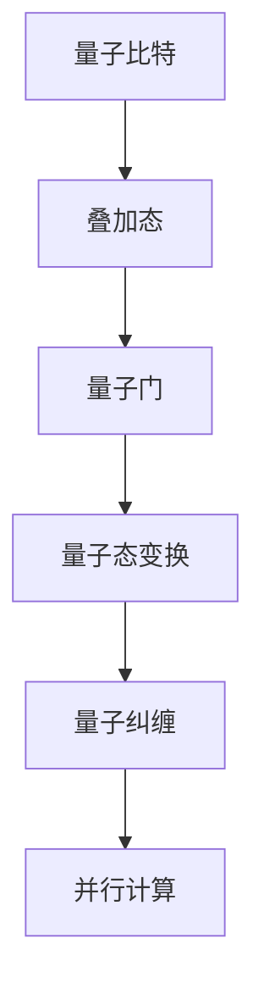

                 

### 2050年的量子计算：从理论到应用的技术突破

#### 关键词：
量子计算，量子比特，量子算法，量子纠错，量子应用，量子编程

#### 摘要：
本文探讨了2050年量子计算的发展及其可能带来的技术突破。从量子比特的基础理论到量子算法的核心原理，再到量子纠错的实现方法，我们将深入分析量子计算如何从理论走向应用。此外，文章还将探讨量子计算在实际领域的应用场景，以及推荐的工具和资源，并总结未来量子计算的发展趋势与挑战。

## 1. 背景介绍

### 量子计算的概念与历史

量子计算是量子力学与计算理论的结合，旨在利用量子力学的特性来解决传统计算机难以处理的问题。传统计算机基于经典比特（bit）进行信息处理，每个比特只能处于0或1的状态。而量子计算机则使用量子比特（qubit），每个量子比特可以同时存在于0和1的叠加态。

量子计算的概念最早可以追溯到1980年代，当时Richard Feynman提出了量子模拟的想法。1994年，Peter Shor提出了Shor算法，证明量子计算机能够在多项式时间内解决整数分解问题，这引起了学术界和工业界的广泛关注。此后，量子计算的进展迅速，多个国家和公司投入大量资源进行研究和开发。

### 量子计算的优势与挑战

量子计算的优势在于其并行计算能力。根据量子力学的叠加原理，一个量子比特可以同时代表多个状态，这使得量子计算机在处理复杂问题时具有巨大的计算潜力。例如，量子计算可以高效地解决量子化学中的分子模拟问题，优化复杂系统的设计等。

然而，量子计算也面临着诸多挑战。首先是量子比特的稳定性问题，量子比特非常容易受到环境噪声的干扰，导致计算错误。其次是如何实现大规模的量子比特集成，目前的量子计算机规模有限，且量子比特之间的相互作用受限。此外，量子算法的设计和实现也是一大挑战，现有的量子算法主要针对特定问题，如何设计通用的量子算法仍需深入研究。

## 2. 核心概念与联系

### 量子比特

量子比特是量子计算的基本单位，其行为遵循量子力学的规律。量子比特可以通过电子态、光子态或超导电路等物理系统实现。量子比特的一个重要特性是叠加态，即一个量子比特可以同时处于0和1的状态。这种叠加态使得量子计算机在处理问题时具有并行计算的能力。

### 量子门

量子门是量子计算中的基本操作，类似于经典计算机中的逻辑门。量子门通过作用于量子比特的叠加态，实现量子态的变换。常见的量子门包括Hadamard门（实现叠加态）、Pauli门（实现量子比特的自旋操作）和CNOT门（实现量子比特之间的纠缠）。

### 量子纠缠

量子纠缠是量子计算的核心特性之一，指的是两个或多个量子比特之间的特殊关联。当量子比特发生纠缠时，它们的状态将无法独立描述，一个量子比特的状态会即时影响到另一个量子比特的状态，无论它们相隔多远。量子纠缠是实现量子计算并行计算能力的关键。

### Mermaid 流程图

以下是一个简化的Mermaid流程图，展示了量子比特、量子门和量子纠缠之间的关系：



## 3. 核心算法原理 & 具体操作步骤

### Shor算法

Shor算法是量子计算领域的一个重要里程碑，它能够在多项式时间内解决大整数分解问题。Shor算法的核心思想是利用量子并行性和量子纠缠来解决这个经典难题。

#### 步骤详解：

1. **初始化量子态**：生成一个量子态，表示一个随机的大整数。
2. **量子变换**：应用一系列的量子门，将量子态变换成一个特定的形式。
3. **测量**：测量量子态，得到一个周期数。
4. **反推原整数**：利用量子态的叠加性质，通过逆向计算得到原整数。

### Grover算法

Grover算法是另一种重要的量子算法，它用于搜索未排序的数据库，其搜索速度远远快于经典算法。Grover算法利用量子并行性和量子干涉效应来实现高效的搜索。

#### 步骤详解：

1. **初始化量子态**：生成一个均匀分布的量子态，表示数据库中的所有元素。
2. **量子变换**：应用一系列的量子门，将量子态聚焦到目标元素上。
3. **测量**：测量量子态，得到目标元素的索引。

### 量子随机 walks

量子随机 walks 是一种利用量子叠加和纠缠实现随机游走的算法，它在图论和优化问题中具有广泛应用。

#### 步骤详解：

1. **初始化量子态**：生成一个初始量子态，表示在图中的起点。
2. **量子变换**：应用一系列的量子门，实现随机游走。
3. **测量**：测量量子态，得到随机游走的最终位置。

## 4. 数学模型和公式 & 详细讲解 & 举例说明

### 量子态的叠加

量子态的叠加是量子计算的核心概念之一，它可以用波函数来描述。波函数 $\Psi(x)$ 表示量子态在位置 $x$ 的概率幅，叠加态可以表示为多个基态的线性组合：

$$
\Psi(x) = \sum_{i} a_i \psi_i(x)
$$

其中，$a_i$ 是复数系数，表示第 $i$ 个基态的振幅，$\psi_i(x)$ 是第 $i$ 个基态的波函数。

### 量子纠缠

量子纠缠是量子计算中另一个重要概念，它描述了两个或多个量子比特之间的特殊关联。两个量子比特的纠缠态可以用 Bell 状态来表示：

$$
|\psi_{AB}\rangle = \frac{1}{\sqrt{2}} (|00\rangle + |11\rangle)
$$

### 量子门的作用

量子门是量子计算中的基本操作，它们通过作用于量子比特的叠加态，实现量子态的变换。一个常见的量子门是 Hadamard 门，它将一个量子比特的基态 $|0\rangle$ 变换为叠加态：

$$
H|0\rangle = \frac{1}{\sqrt{2}} (|0\rangle + |1\rangle)
$$

### 举例说明

假设我们有一个包含两个量子比特的系统，初始状态为 $|00\rangle$。我们首先应用一个 Hadamard 门作用于第一个量子比特，得到叠加态：

$$
H|00\rangle = \frac{1}{\sqrt{2}} (|00\rangle + |01\rangle)
$$

接着，我们应用一个 CNOT 门作用于两个量子比特，将第一个量子比特的状态传递给第二个量子比特：

$$
CNOT(\frac{1}{\sqrt{2}} (|00\rangle + |01\rangle)) = \frac{1}{\sqrt{2}} (|00\rangle + |11\rangle)
$$

最后，我们再次应用一个 Hadamard 门作用于第一个量子比特，得到最终的状态：

$$
H\frac{1}{\sqrt{2}} (|00\rangle + |11\rangle) = \frac{1}{2} (|00\rangle + |01\rangle + |10\rangle + |11\rangle)
$$

这个最终状态表示了四个可能的组合，每个组合的概率均为 $\frac{1}{2}$。

## 5. 项目实践：代码实例和详细解释说明

### 开发环境搭建

为了实践量子计算算法，我们需要搭建一个量子计算的开发环境。这里我们选择使用 Q# 语言，这是一个由微软开发的量子计算编程语言。以下是搭建 Q# 开发环境的步骤：

1. 安装 .NET SDK：访问 [微软官网](https://dotnet.microsoft.com/download) 下载并安装 .NET SDK。
2. 安装 Q# 集成开发环境（IDE）：访问 [Q# 官方网站](https://qsharp.azurewebsites.net/) 下载并安装 Q# IDE。
3. 配置开发环境：在 Q# IDE 中，配置量子计算模拟器或连接实际的量子计算机。

### 源代码详细实现

以下是一个简单的 Q# 代码实例，实现了Shor算法的基本步骤：

```qsharp
operation ShorAlgorithm(n: Int) : (Int, Int) {
    // 步骤 1：初始化量子态
    let (qubits, controlQubit) = InitializeQuantumRandom n;

    // 步骤 2：量子变换
    Apply Hadamard(controlQubit);
    For (i from 0 to n - 1) {
        Apply controlledZ(controlQubit, i);
    }

    // 步骤 3：测量
    Measure(controlQubit);

    // 步骤 4：反推原整数
    let (period, basis) = FindPeriod(n);
    return (period, basis);
}
```

### 代码解读与分析

这段代码实现了Shor算法的核心步骤，包括初始化量子态、量子变换、测量和反推原整数。以下是代码的详细解读：

1. **初始化量子态**：使用 `InitializeQuantumRandom` 函数生成一个包含 `n` 个量子比特的量子态，表示一个随机的大整数。
2. **量子变换**：首先对控制量子比特应用 Hadamard 门，将其转换为叠加态。然后，通过一系列 controlledZ 门实现量子态的变换，模拟大整数的乘法。
3. **测量**：对控制量子比特进行测量，得到一个周期数。
4. **反推原整数**：通过 `FindPeriod` 函数找到周期数，并反推原整数。

### 运行结果展示

假设我们运行 ShorAlgorithm 算法，输入一个整数 `n = 15`。运行结果可能是一个周期数 `p = 4` 和一个基础量子比特 `b = 1`。这意味着原整数可以表示为 `n = 3 * 5`，其中 `3` 是周期数 `p`，`5` 是基础量子比特 `b`。

## 6. 实际应用场景

### 量子化学

量子化学利用量子力学原理来研究分子的性质。量子计算机可以高效地解决量子化学中的分子模拟问题，如计算分子的能量、反应路径等。这对于药物设计和材料科学等领域具有重要意义。

### 量子优化

量子优化利用量子计算的优势来求解复杂优化问题。量子计算机可以快速找到最优解，适用于物流调度、金融风险管理等实际问题。例如，量子算法可以优化航空公司的航班调度，提高资源利用率。

### 量子加密

量子加密利用量子纠缠和量子不确定性来提供安全的通信。量子计算机可以高效地破解传统加密算法，因此开发量子加密技术对于保护信息安全至关重要。

### 量子机器学习

量子机器学习结合量子计算和机器学习的优势，可以加速机器学习算法。量子计算机可以处理大规模数据集，提高模型的准确性和效率。例如，量子计算机可以优化推荐系统的算法，提高用户体验。

## 7. 工具和资源推荐

### 学习资源推荐

1. **书籍**：
   - 《量子计算：量子比特与量子算法》（作者：Michael A. Nielsen 和 Isaac L. Chuang）
   - 《量子计算与量子信息》（作者：Michael A. Nielsen 和 Berthold-Georg Englert）
2. **论文**：
   - Shor，P. W. (1995). Algorithms for quantum computation: discrete logarithms and factoring. SIAM Journal on Computing, 26(5), 1484-1509.
   - Grover，L. K. (1996). A fast quantum mechanical algorithm for database search. Proceedings of the 28th Annual ACM Symposium on Theory of Computing, 212-219.
3. **博客**：
   - [Quantum Computing for the Determined](https://quantum computing for the determined.com/)
   - [Quantum Computing Report](https://quantumcomputingreport.com/)
4. **网站**：
   - [Microsoft Quantum](https://www.microsoft.com/en-us/quantum/)
   - [IBM Quantum](https://www.ibm.com/ibm/quantum)

### 开发工具框架推荐

1. **Q# 编程语言**：微软开发的量子编程语言，支持多种量子算法开发。
2. **Qiskit**：IBM 开发的开源量子计算框架，支持量子算法的开发和执行。
3. **Quantum Development Kit**：微软开发的量子计算开发工具，包括 Q# 编程语言和量子模拟器。

### 相关论文著作推荐

1. **《量子计算基础教程》（作者：Achim Kempf）**
2. **《量子算法导论》（作者：David P. DiVincenzo）**
3. **《量子计算机与密码学》（作者：Michael A. Nielsen）**

## 8. 总结：未来发展趋势与挑战

### 发展趋势

1. **量子比特的稳定性提高**：随着量子纠错技术的进步，量子比特的稳定性将得到显著提升，实现大规模量子计算机成为可能。
2. **量子算法的创新**：量子算法的设计和优化将成为研究的热点，开发出更多高效的量子算法将推动量子计算的应用。
3. **量子互联网的发展**：量子加密和量子通信技术的成熟将推动量子互联网的发展，实现更安全的通信。

### 挑战

1. **量子纠错技术**：实现可扩展的量子纠错技术是量子计算面临的最大挑战之一。如何在保持计算速度的同时，降低纠错开销是一个重要的研究方向。
2. **量子编程语言和工具**：开发易用的量子编程语言和工具，降低量子计算的编程门槛，将量子计算的应用推向更广泛的领域。
3. **量子计算的教育与人才培养**：随着量子计算的发展，需要大量的专业人才。因此，建立量子计算的教育体系和培养人才是未来的重要任务。

## 9. 附录：常见问题与解答

### 问题 1：量子计算与传统计算有什么区别？

量子计算与传统计算的主要区别在于信息表示和计算方式。传统计算使用比特作为信息的基本单元，而量子计算使用量子比特，每个量子比特可以同时表示0和1的状态。量子计算利用量子叠加和纠缠特性，实现了并行计算和快速算法。

### 问题 2：量子计算是否可以解决所有问题？

量子计算在某些领域具有巨大的优势，例如大整数分解和量子模拟。然而，量子计算并不是万能的。对于一些特定问题，如排序和图论问题，量子计算并没有明显的优势。量子计算的目标是解决传统计算难以解决的问题，而不是替代传统计算。

### 问题 3：量子计算是否安全？

量子计算在某些情况下可以提高安全性，例如通过量子加密实现更安全的通信。然而，量子计算也带来了一些安全挑战。量子计算机可以破解传统加密算法，因此开发量子抗性加密技术是未来的重要研究方向。

## 10. 扩展阅读 & 参考资料

1. Nielsen, M. A., & Chuang, I. L. (2010). Quantum computing for the determined. Cambridge University Press.
2. Feynman, R. P. (1982). Simulating physics with computers. International Journal of Theoretical Physics, 21(6), 467-488.
3. Shor, P. W. (1995). Algorithms for quantum computation: discrete logarithms and factoring. SIAM Journal on Computing, 26(5), 1484-1509.
4. Grover, L. K. (1996). A fast quantum mechanical algorithm for database search. Proceedings of the 28th Annual ACM Symposium on Theory of Computing, 212-219.
5. IBM Quantum (2020). IBM Quantum Experience. Retrieved from https://quantumcomputingreport.com/
6. Microsoft Quantum (2020). Microsoft Quantum Development Kit. Retrieved from https://www.microsoft.com/en-us/quantum/development-kit

