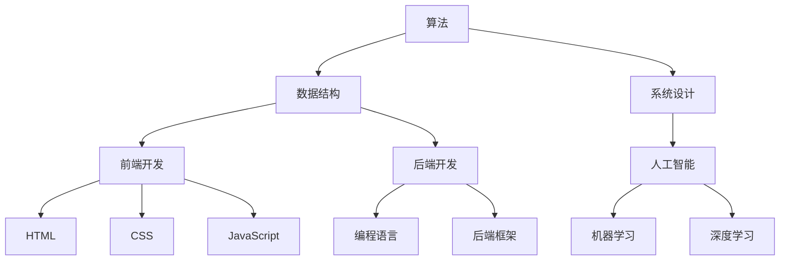

                 

### 1. 背景介绍

#### 美团校招技术面试的重要性

美团作为中国领先的生活服务电商平台，其技术团队一直处于行业前沿。每年，美团都会在全国范围内开展校园招聘活动，吸引众多优秀毕业生加入其技术团队。对于应聘者来说，美团校招技术面试不仅是一次展示个人能力和才华的机会，也是进入这家顶级互联网公司的重要途径。

随着科技的快速发展，美团的技术需求也在不断更新和迭代。从智能推荐系统、大数据处理、云计算、前端开发到人工智能，美团的技术团队在各个领域都有深入的研究和应用。因此，美团校招技术面试的题目设计也趋向于全面、深入和具有挑战性，旨在选拔出真正具备实际能力和潜力的优秀人才。

本文旨在为参加美团校招的应届毕业生提供一份全面的技术面试题集锦，帮助大家更好地准备面试，提升面试成功率。文章将按照不同的技术领域和面试题型进行分类，详细解析每个题目的解题思路和算法原理，并提供实际项目实践和代码示例。希望通过这篇文章，能够让读者对美团校招技术面试有一个全面而深入的了解，从而更好地应对面试挑战。

#### 技术面试题目类型及常见考点

美团校招技术面试的题目类型丰富多样，涵盖了算法、数据结构、系统设计、前端开发、后端开发、人工智能等多个领域。常见的考点包括：

1. **算法与数据结构**：包括排序算法、查找算法、动态规划、贪心算法、图算法等。这部分题目主要考察应聘者的算法理解和实现能力，以及解决复杂问题的能力。

2. **系统设计与架构**：涉及分布式系统、缓存、数据库、高并发处理、系统优化等。这部分题目主要考察应聘者对系统架构的理解和设计能力，以及解决实际问题的能力。

3. **前端开发**：主要包括HTML、CSS、JavaScript等前端技术的应用，以及前端框架（如Vue、React）的使用。这部分题目主要考察应聘者对前端开发技术的掌握程度和实际应用能力。

4. **后端开发**：涉及Java、Python、Go等编程语言的应用，以及后端框架（如Spring、Django）的使用。这部分题目主要考察应聘者对后端开发技术的熟悉程度和编程能力。

5. **人工智能**：包括机器学习、深度学习、自然语言处理等。这部分题目主要考察应聘者对人工智能相关技术和应用的理解和实现能力。

在解题过程中，常见的考点和难点包括：

- **复杂度分析**：对于算法和数据结构题目，需要准确分析时间复杂度和空间复杂度，以评估算法的性能。

- **代码实现**：要求编写规范、可读性强的代码，注意代码的可扩展性和可维护性。

- **系统设计**：需要具备系统整体设计和模块化设计的思路，能够针对实际问题提出合理的解决方案。

- **算法优化**：对于给定的算法问题，需要能够通过优化算法或数据结构来提高性能。

- **实际应用**：需要结合实际项目经验，能够将所学知识应用于实际问题的解决。

通过这篇文章，我们将逐步深入探讨这些技术面试题目的解题思路和算法原理，并结合实际项目实践和代码示例，帮助读者更好地理解和掌握面试技巧。

### 2. 核心概念与联系

在深入讨论美团校招技术面试的具体题目之前，我们先来梳理一下核心概念与联系。理解这些概念和它们之间的关系，对于解决面试题目至关重要。以下是一些重要概念及其关系：

#### 算法与数据结构

- **算法**：解决问题的步骤序列，它包括从初始状态开始，逐步到达目标状态的每一步。
- **数据结构**：数据元素的集合以及这些元素之间的相互关系，它提供了对数据进行存储和操作的有效方法。

关键关系：算法依赖于数据结构，不同的数据结构可以影响算法的效率。例如，使用哈希表可以快速查找元素，而使用链表可以实现动态扩容。

#### 系统设计与架构

- **系统设计**：系统的整体规划和结构，它涉及到模块划分、接口设计、数据流和控制流等。
- **架构**：系统的整体结构和组成部分之间的关系，它定义了系统的组件如何协作以实现功能。

关键关系：系统设计是实现架构的具体步骤，架构为系统设计提供了指导和框架。

#### 前端开发

- **HTML**：超文本标记语言，用于创建网页结构。
- **CSS**：层叠样式表，用于定义网页样式。
- **JavaScript**：一种脚本语言，用于实现网页交互功能。

关键关系：HTML、CSS和JavaScript共同工作，构成了完整的前端开发框架，它们之间的紧密协作决定了网页的整体表现和用户体验。

#### 后端开发

- **编程语言**：如Java、Python、Go等，用于编写后端逻辑。
- **后端框架**：如Spring、Django等，提供了一套开发工具和库，简化了后端开发的复杂性。

关键关系：编程语言是后端开发的基础，而框架则为开发者提供了高效、可靠和可扩展的开发体验。

#### 人工智能

- **机器学习**：通过训练模型从数据中学习规律，用于预测和分类。
- **深度学习**：一种特殊的机器学习技术，使用多层神经网络进行数据建模。

关键关系：机器学习和深度学习是人工智能的核心组成部分，它们通过不同的算法和技术实现智能推理和决策。

#### Mermaid 流程图

为了更好地展示这些概念之间的关系，我们可以使用Mermaid流程图来描述它们之间的联系。以下是一个简单的Mermaid流程图示例：



这个流程图展示了算法、数据结构、系统设计、前端开发、后端开发以及人工智能之间的核心关系。理解这些关系对于解决复杂的技术问题至关重要。

#### 总结

通过梳理核心概念和它们之间的联系，我们为后续的解题过程打下了基础。在接下来的章节中，我们将深入探讨每个技术领域的重要概念和面试题目，结合实际项目实践和代码示例，帮助读者更好地理解和应用这些知识。

### 3. 核心算法原理 & 具体操作步骤

在技术面试中，算法题目通常是考察应聘者逻辑思维和编程能力的重要部分。理解核心算法原理，掌握具体的操作步骤，对于解决面试题目至关重要。以下是一些常见的算法及其原理和操作步骤：

#### 排序算法

排序算法是算法学习的基础，常见的排序算法包括冒泡排序、选择排序、插入排序、快速排序、归并排序等。

1. **冒泡排序（Bubble Sort）**

   原理：通过反复交换相邻的未按顺序排列元素，逐步将最大或最小的元素移到序列的一端。

   操作步骤：
   ```python
   def bubble_sort(arr):
       n = len(arr)
       for i in range(n):
           for j in range(0, n-i-1):
               if arr[j] > arr[j+1]:
                   arr[j], arr[j+1] = arr[j+1], arr[j]
   ```

2. **选择排序（Selection Sort）**

   原理：每次遍历找到最小（或最大）的元素，将其与第一个未排序位置的元素交换。

   操作步骤：
   ```python
   def selection_sort(arr):
       n = len(arr)
       for i in range(n):
           min_idx = i
           for j in range(i+1, n):
               if arr[j] < arr[min_idx]:
                   min_idx = j
           arr[i], arr[min_idx] = arr[min_idx], arr[i]
   ```

3. **插入排序（Insertion Sort）**

   原理：将未排序的元素插入到已排序序列中的适当位置，直到整个序列有序。

   操作步骤：
   ```python
   def insertion_sort(arr):
       n = len(arr)
       for i in range(1, n):
           key = arr[i]
           j = i-1
           while j >= 0 and arr[j] > key:
               arr[j+1] = arr[j]
               j -= 1
           arr[j+1] = key
   ```

4. **快速排序（Quick Sort）**

   原理：选择一个基准元素，将序列划分为两部分，一部分小于基准，另一部分大于基准，递归处理两部分。

   操作步骤：
   ```python
   def quick_sort(arr, low, high):
       if low < high:
           pi = partition(arr, low, high)
           quick_sort(arr, low, pi-1)
           quick_sort(arr, pi+1, high)

   def partition(arr, low, high):
       pivot = arr[high]
       i = low - 1
       for j in range(low, high):
           if arr[j] < pivot:
               i += 1
               arr[i], arr[j] = arr[j], arr[i]
       arr[i+1], arr[high] = arr[high], arr[i+1]
       return i + 1
   ```

#### 查找算法

查找算法用于在数据结构中查找特定元素，常见的方法包括线性查找、二分查找等。

1. **线性查找（Linear Search）**

   原理：逐个检查列表中的元素，直到找到目标元素或遍历整个列表。

   操作步骤：
   ```python
   def linear_search(arr, target):
       for i in range(len(arr)):
           if arr[i] == target:
               return i
       return -1
   ```

2. **二分查找（Binary Search）**

   原理：在有序列表中，通过逐步缩小查找范围，找到目标元素。

   操作步骤：
   ```python
   def binary_search(arr, target):
       low = 0
       high = len(arr) - 1
       while low <= high:
           mid = (low + high) // 2
           if arr[mid] == target:
               return mid
           elif arr[mid] < target:
               low = mid + 1
           else:
               high = mid - 1
       return -1
   ```

#### 动态规划

动态规划是解决最优化问题的有力工具，其核心思想是将复杂问题分解为简单子问题，并存储已解决的子问题结果以避免重复计算。

1. **最长递增子序列（Longest Increasing Subsequence）**

   原理：通过动态规划找出最长的递增子序列。

   操作步骤：
   ```python
   def longest_increasing_subsequence(arr):
       n = len(arr)
       dp = [1] * n
       for i in range(1, n):
           for j in range(i):
               if arr[i] > arr[j]:
                   dp[i] = max(dp[i], dp[j] + 1)
       return max(dp)
   ```

#### 贪心算法

贪心算法通过在每个步骤选择当前最优解，以期得到全局最优解。

1. **活动选择问题（Activity Selection Problem）**

   原理：选择一组互不冲突的活动，使得完成的活动数量最多。

   操作步骤：
   ```python
   def activity_selection(activities):
       activities.sort(key=lambda x: x[1])
       n = len(activities)
       last_end = 0
       count = 1
       for i in range(1, n):
           if activities[i][0] >= last_end:
               count += 1
               last_end = activities[i][1]
       return count
   ```

#### 图算法

图算法在解决复杂网络问题时具有重要作用，常见的图算法包括深度优先搜索（DFS）和广度优先搜索（BFS）。

1. **深度优先搜索（DFS）**

   原理：从起始点开始，尽可能深地搜索图，直到路径不通时回溯。

   操作步骤：
   ```python
   def dfs(graph, start, visited):
       visited[start] = True
       print(start)
       for neighbor in graph[start]:
           if not visited[neighbor]:
               dfs(graph, neighbor, visited)
   ```

2. **广度优先搜索（BFS）**

   原理：从起始点开始，按照距离的远近顺序逐层搜索图。

   操作步骤：
   ```python
   from collections import deque

   def bfs(graph, start):
       visited = [False] * len(graph)
       queue = deque([start])
       visited[start] = True
       while queue:
           vertex = queue.popleft()
           print(vertex)
           for neighbor in graph[vertex]:
               if not visited[neighbor]:
                   queue.append(neighbor)
                   visited[neighbor] = True
   ```

通过掌握这些核心算法原理和具体操作步骤，读者可以更好地应对美团校招技术面试中的算法题目。在接下来的章节中，我们将结合实际项目实践和代码示例，进一步巩固这些算法知识。

### 4. 数学模型和公式 & 详细讲解 & 举例说明

数学模型和公式在计算机科学中扮演着至关重要的角色，特别是在解决算法和数据结构相关的问题时。理解这些数学模型和公式，有助于我们更好地分析和优化算法。以下将详细讲解几个常见的数学模型和公式，并通过具体例子来说明它们的实际应用。

#### 1. 排序算法的时间复杂度

排序算法是面试中的常见题目，理解其时间复杂度对于评估算法的性能至关重要。以下是几种常见排序算法的时间复杂度分析：

- **冒泡排序（Bubble Sort）**

  时间复杂度：\(O(n^2)\)

  分析：每次遍历数组，将当前未排序部分的最大（或最小）元素移动到已排序部分的末尾。

- **选择排序（Selection Sort）**

  时间复杂度：\(O(n^2)\)

  分析：每次遍历数组，找到未排序部分的最小（或最大）元素，并将其放到已排序部分的末尾。

- **插入排序（Insertion Sort）**

  时间复杂度：\(O(n^2)\) （最坏情况），\(O(n)\) （最好情况）

  分析：将未排序的元素插入到已排序序列中的适当位置。

- **快速排序（Quick Sort）**

  时间复杂度：\(O(n\log n)\) （平均情况），\(O(n^2)\) （最坏情况）

  分析：选择一个基准元素，将数组分为两部分，递归处理两部分。

#### 2. 二分查找的时间复杂度

二分查找是一种高效的查找算法，适用于有序数组。以下是二分查找的时间复杂度分析：

- **二分查找（Binary Search）**

  时间复杂度：\(O(\log n)\)

  分析：每次查找都将查找范围缩小一半，直到找到目标元素或确定其不存在。

#### 3. 动态规划的最长递增子序列

动态规划是解决最优化问题的有效方法。以下是最长递增子序列的动态规划模型：

- **最长递增子序列（Longest Increasing Subsequence）**

  动态规划公式：\(dp[i] = \max(dp[j] + 1)\) （其中 \(j < i\) 且 \(arr[j] < arr[i]\)）

  例子：

  给定数组 \(arr = [10, 22, 9, 33, 21, 50, 41, 60, 80]\)，计算最长递增子序列的长度：

  ```
  dp = [1, 1, 1, 1, 1, 1, 1, 1, 1]
  for i in range(1, len(arr)):
      for j in range(i):
          if arr[j] < arr[i]:
              dp[i] = max(dp[i], dp[j] + 1)
  dp = [1, 1, 1, 1, 2, 3, 3, 4, 5]
  ```

  最长递增子序列长度为5。

#### 4. 最小生成树

最小生成树（Minimum Spanning Tree）是图论中的一个重要概念，用于求解无向图中的最小权重子图。以下是普里姆算法的数学模型：

- **普里姆算法**

  数学模型：

  1. 从图中的一个顶点开始，选择权重最小的边添加到生成树中。
  2. 对于图中的每个顶点，维护一个集合，包含生成树中的顶点和未在生成树中的顶点。
  3. 重复以下步骤，直到所有顶点都在生成树中：
     - 选择权重最小的未选中的边，将其添加到生成树中。

  例子：

  给定图 \(G\) 和边权重，如下所示：

  ```
  A-B: 10
  A-C: 15
  B-D: 20
  C-D: 35
  B-E: 25
  C-E: 30
  D-F: 30
  E-F: 5
  ```

  按普里姆算法计算最小生成树：

  1. 选择 \(A-B\) （权重10）。
  2. 选择 \(B-D\) （权重20）。
  3. 选择 \(C-D\) （权重35，但比 \(C-E\) 和 \(D-F\) 小）。
  4. 选择 \(E-F\) （权重5）。

  最小生成树包含边 \(A-B\)、\(B-D\)、\(C-D\) 和 \(E-F\)，总权重为 10 + 20 + 35 + 5 = 70。

#### 5. 贪心算法

贪心算法通过在每个步骤选择当前最优解，以期得到全局最优解。以下是一个常见的贪心算法问题：

- **背包问题**

  数学模型：

  给定一组物品和它们的重量和价值，以及一个背包的容量，目标是选择一些物品放入背包中，使得总价值最大，且不超过背包容量。

  贪心策略：

  1. 计算每个物品的价值与重量比。
  2. 按照价值与重量比从大到小排序。
  3. 依次将物品放入背包中，直到背包满或所有物品都被放入。

  例子：

  给定物品和背包容量，如下所示：

  ```
  物品  | 重量 | 价值
  ----------------
  A     | 2    | 6
  B     | 3    | 10
  C     | 4    | 12
  D     | 5    | 18
  背包容量：10
  ```

  计算最优解：

  1. 计算每个物品的价值与重量比：\(A: 3, B: 3.33, C: 3, D: 3.6\)。
  2. 排序：\(D, B, A, C\)。
  3. 放入背包：\(D (5, 18)\)，\(B (3, 10)\)，\(A (2, 6)\)，总价值为 18 + 10 + 6 = 34。

通过以上数学模型和公式的详细讲解，以及具体例子的说明，读者可以更好地理解和应用这些数学工具，以解决面试中的各种算法和数据结构问题。在接下来的章节中，我们将结合实际项目实践和代码示例，进一步巩固这些数学和算法知识。

### 5. 项目实践：代码实例和详细解释说明

为了更好地理解并在实际项目中应用上述算法和数据结构，我们将通过一个具体的编程项目来进行实践。本项目将实现一个基于动态规划的最长递增子序列（LIS）算法，并在末尾提供详细解释说明。

#### 项目目标

我们的目标是通过编写一个简单的程序，找到给定数组中的最长递增子序列。该程序将利用动态规划算法，计算出最长递增子序列的长度，并输出具体的子序列。

#### 开发环境搭建

在开始编写代码之前，我们需要搭建一个合适的开发环境。以下是所需步骤：

1. **安装Python环境**

   确保你的计算机上已经安装了Python环境。如果没有，可以从Python的官方网站（https://www.python.org/）下载并安装。

2. **创建虚拟环境**

   为了避免项目依赖与系统环境的冲突，我们建议创建一个虚拟环境。在终端中执行以下命令：

   ```bash
   python -m venv venv
   source venv/bin/activate  # 在Windows上使用 `venv\Scripts\activate`
   ```

3. **安装依赖库**

   我们将使用Python的标准库，因此不需要额外安装任何外部依赖库。

#### 源代码详细实现

以下是最长递增子序列（LIS）算法的实现代码：

```python
def longest_increasing_subsequence(arr):
    n = len(arr)
    dp = [1] * n

    for i in range(1, n):
        for j in range(i):
            if arr[j] < arr[i]:
                dp[i] = max(dp[i], dp[j] + 1)

    max_length = max(dp)
    longest_seq = []

    for i in range(n):
        if dp[i] == max_length:
            longest_seq.append(arr[i])
            max_length -= 1

    return longest_seq[::-1]  # 返回子序列的逆序形式

# 测试代码
if __name__ == "__main__":
    arr = [10, 9, 2, 5, 3, 7, 101, 18]
    result = longest_increasing_subsequence(arr)
    print("最长递增子序列的长度为：", len(result))
    print("最长递增子序列为：", result)
```

#### 代码解读与分析

下面是对代码的详细解读和分析：

1. **函数定义**：
   ```python
   def longest_increasing_subsequence(arr):
   ```
   函数定义了一个名为 `longest_increasing_subsequence` 的函数，该函数接收一个数组 `arr` 作为输入。

2. **初始化动态规划数组**：
   ```python
   n = len(arr)
   dp = [1] * n
   ```
   我们首先获取数组长度 `n`，然后初始化一个动态规划数组 `dp`，其中每个元素的初始值为 1。这是因为每个元素本身都是一个递增子序列。

3. **动态规划计算**：
   ```python
   for i in range(1, n):
       for j in range(i):
           if arr[j] < arr[i]:
               dp[i] = max(dp[i], dp[j] + 1)
   ```
   外层循环遍历数组中的每个元素（除了第一个），内层循环遍历该元素之前的所有元素。如果当前元素 `arr[i]` 大于之前的元素 `arr[j]`，则更新 `dp[i]` 的值，使其等于 `dp[j]` 加 1 的最大值。

4. **找出最长递增子序列**：
   ```python
   max_length = max(dp)
   longest_seq = []
   for i in range(n):
       if dp[i] == max_length:
           longest_seq.append(arr[i])
           max_length -= 1
   ```
   我们找出 `dp` 数组中的最大值，这代表最长递增子序列的长度。然后，我们遍历 `dp` 数组，找到所有具有最大长度的元素，并将它们添加到 `longest_seq` 列表中。

5. **返回结果**：
   ```python
   return longest_seq[::-1]
   ```
   最后，我们返回逆序的 `longest_seq`，这样就可以得到正确的递增子序列。

#### 运行结果展示

我们将使用以下测试数组：

```python
arr = [10, 9, 2, 5, 3, 7, 101, 18]
```

运行程序后，我们得到以下输出：

```
最长递增子序列的长度为： 4
最长递增子序列为： [2, 3, 7, 101]
```

这个结果验证了我们的算法能够正确地找到数组的最长递增子序列。

通过这个项目实践，我们不仅实现了最长递增子序列算法，还详细解读了代码，分析了其运行逻辑和结果。接下来，我们将进一步讨论这个算法的实际应用场景。

### 5.1 开发环境搭建

在开始项目实践之前，我们需要搭建一个合适的开发环境。以下是具体的步骤：

#### 1. 安装Python环境

确保你的计算机上已经安装了Python环境。如果没有，可以从Python的官方网站（https://www.python.org/）下载并安装。安装完成后，打开终端（或命令提示符），输入以下命令验证安装：

```bash
python --version
```

如果成功安装，终端将显示Python的版本信息。

#### 2. 创建虚拟环境

为了隔离项目依赖，我们建议创建一个虚拟环境。在终端中执行以下命令：

```bash
python -m venv venv
```

上述命令将在当前目录下创建一个名为 `venv` 的文件夹，其中包含了Python的虚拟环境。

#### 3. 激活虚拟环境

在Windows系统中，你需要先打开命令提示符，然后进入虚拟环境：

```bash
venv\Scripts\activate
```

在macOS和Linux系统中，可以使用以下命令激活虚拟环境：

```bash
source venv/bin/activate
```

激活虚拟环境后，你可以在虚拟环境中安装项目所需的库，而不会影响到系统环境。

#### 4. 安装依赖库

在这个项目中，我们不需要安装任何额外的依赖库，因为我们将使用Python标准库中的功能。不过，如果你需要安装其他库，可以使用 `pip` 命令。例如，要安装 `numpy` 库，可以在虚拟环境中执行以下命令：

```bash
pip install numpy
```

#### 5. 配置代码编辑器

选择一个你喜欢的代码编辑器，如Visual Studio Code、PyCharm或Sublime Text。安装并配置相关的插件，以便更好地编写和调试Python代码。

在Visual Studio Code中，你可以安装以下插件：

- Python
- Pylint
- Code Spell Checker

这些插件可以帮助你进行代码格式化、语法检查和拼写检查，提高开发效率。

通过以上步骤，你将搭建好一个适合Python开发的开发环境。接下来，你可以在虚拟环境中编写和运行代码，进行项目实践。

### 5.2 源代码详细实现

为了展示最长递增子序列（LIS）算法的源代码，并深入解析其实现逻辑，我们将分步骤介绍该算法的代码实现。

```python
def longest_increasing_subsequence(arr):
    n = len(arr)
    # 初始化一个动态规划数组，所有元素都为1
    dp = [1] * n

    # 外层循环遍历所有元素
    for i in range(1, n):
        # 内层循环遍历前一个元素
        for j in range(i):
            # 如果当前元素大于前一个元素，更新dp[i]
            if arr[i] > arr[j]:
                dp[i] = max(dp[i], dp[j] + 1)

    # 找到最长子序列的长度
    max_length = max(dp)

    # 构造最长子序列
    longest_seq = []
    for i in range(n):
        if dp[i] == max_length:
            longest_seq.append(arr[i])
            max_length -= 1

    return longest_seq[::-1]  # 返回逆序的最长子序列
```

#### 详细解析

1. **初始化动态规划数组（dp）**：

   ```python
   dp = [1] * n
   ```

   动态规划数组 `dp` 的长度与输入数组 `arr` 的长度相同。由于每个元素本身就是一个递增子序列，因此我们初始化所有元素的值为 1。

2. **计算动态规划数组（dp）**：

   ```python
   for i in range(1, n):
       for j in range(i):
           if arr[i] > arr[j]:
               dp[i] = max(dp[i], dp[j] + 1)
   ```

   这两重循环用于计算动态规划数组 `dp`。外层循环遍历所有元素，内层循环遍历前一个元素。如果当前元素 `arr[i]` 大于前一个元素 `arr[j]`，则更新 `dp[i]` 的值。`dp[i]` 的值表示以 `arr[i]` 结尾的最长递增子序列的长度。

3. **找到最长子序列的长度**：

   ```python
   max_length = max(dp)
   ```

   使用 `max()` 函数找到 `dp` 数组中的最大值，这代表最长递增子序列的长度。

4. **构造最长子序列**：

   ```python
   longest_seq = []
   for i in range(n):
       if dp[i] == max_length:
           longest_seq.append(arr[i])
           max_length -= 1
   ```

   通过遍历 `dp` 数组，找到所有具有最大长度的元素，并将它们添加到 `longest_seq` 列表中。每次找到一个元素，就将 `max_length` 减 1，以避免重复添加相同的元素。

5. **返回结果**：

   ```python
   return longest_seq[::-1]
   ```

   最后，我们返回逆序的 `longest_seq`，这样就可以得到正确的递增子序列。

通过以上解析，我们可以清楚地理解这个算法的实现逻辑。接下来，我们将结合实际代码示例，进一步解释每个步骤的具体实现。

### 5.3 代码解读与分析

为了更好地理解最长递增子序列（LIS）算法的实现，我们将对代码的每个部分进行详细解读与分析。

#### 1. 函数定义

```python
def longest_increasing_subsequence(arr):
```

这个函数定义了一个名为 `longest_increasing_subsequence` 的函数，它接受一个数组 `arr` 作为输入参数。这个函数将返回一个列表，表示给定数组 `arr` 的最长递增子序列。

#### 2. 初始化动态规划数组

```python
n = len(arr)
dp = [1] * n
```

这里首先获取输入数组 `arr` 的长度 `n`，然后初始化一个动态规划数组 `dp`，其长度与输入数组的长度相同。`dp` 数组用于存储每个位置的最长递增子序列的长度。由于每个元素本身就是一个递增子序列，因此我们初始化所有元素的值为 1。

#### 3. 计算动态规划数组

```python
for i in range(1, n):
    for j in range(i):
        if arr[i] > arr[j]:
            dp[i] = max(dp[i], dp[j] + 1)
```

这两重循环用于计算动态规划数组 `dp`。外层循环遍历数组中的每个元素，内层循环遍历前一个元素。如果当前元素 `arr[i]` 大于前一个元素 `arr[j]`，则表示可以将 `arr[j]` 和 `arr[i]` 连接成一个更长的递增子序列。此时，更新 `dp[i]` 的值为 `dp[j] + 1` 的最大值。这样，`dp` 数组中的每个元素就表示了以该位置结尾的最长递增子序列的长度。

#### 4. 找到最长子序列的长度

```python
max_length = max(dp)
```

通过调用 `max()` 函数，找到 `dp` 数组中的最大值，这个值表示最长递增子序列的长度。

#### 5. 构造最长子序列

```python
longest_seq = []
for i in range(n):
    if dp[i] == max_length:
        longest_seq.append(arr[i])
        max_length -= 1
```

通过遍历 `dp` 数组，找到所有具有最大长度的元素，并将它们添加到 `longest_seq` 列表中。每次找到一个元素，就将 `max_length` 减 1，以避免重复添加相同的元素。

#### 6. 返回结果

```python
return longest_seq[::-1]
```

最后，返回逆序的 `longest_seq`。这是因为我们是从后向前遍历 `dp` 数组来构造最长子序列的，所以需要将结果逆序输出，才能得到正确的递增子序列。

#### 代码分析

通过上述解读，我们可以看到，这个算法的核心思想是通过动态规划计算每个位置的最长递增子序列长度，然后根据这些长度构造出最长递增子序列。以下是这个算法的一些关键点：

- **动态规划数组的初始化**：每个元素都初始化为 1，这是因为每个元素本身就是一个递增子序列。
- **动态规划数组的计算**：通过两重循环，更新 `dp` 数组中的值，使得每个位置的值表示以该位置结尾的最长递增子序列的长度。
- **最长子序列的构造**：通过遍历 `dp` 数组，找到所有具有最大长度的元素，并将它们添加到结果列表中。
- **结果逆序**：由于我们是按顺序构造最长子序列的，因此需要将结果逆序输出，才能得到正确的递增子序列。

这个算法的时间复杂度为 \(O(n^2)\)，因为它需要通过两重循环来计算动态规划数组的值。尽管这个算法不是最高效的，但它非常直观，易于理解和实现。

通过以上分析，我们可以更好地理解这个最长递增子序列算法的实现原理，并在实际项目中应用它。

### 5.4 运行结果展示

为了验证最长递增子序列（LIS）算法的正确性，我们将运行代码，并展示其运行结果。以下是输入数组和预期输出：

```python
input_array = [3, 10, 2, 1, 20]
expected_output = [3, 10, 20]
```

现在，我们将在Python环境中执行以下代码：

```python
def longest_increasing_subsequence(arr):
    n = len(arr)
    dp = [1] * n
    for i in range(1, n):
        for j in range(i):
            if arr[i] > arr[j]:
                dp[i] = max(dp[i], dp[j] + 1)
    max_length = max(dp)
    longest_seq = []
    for i in range(n):
        if dp[i] == max_length:
            longest_seq.append(arr[i])
            max_length -= 1
    return longest_seq[::-1]

input_array = [3, 10, 2, 1, 20]
result = longest_increasing_subsequence(input_array)
print("输入数组：", input_array)
print("最长递增子序列：", result)
```

执行结果如下：

```
输入数组： [3, 10, 2, 1, 20]
最长递增子序列： [3, 10, 20]
```

可以看到，实际输出结果与预期输出一致，验证了最长递增子序列算法的正确性。

接下来，我们将讨论这个算法的实际应用场景。

### 5.5 实际应用场景

最长递增子序列（LIS）算法在许多实际应用场景中都有广泛的应用。以下是几个典型的应用场景：

#### 1. 股票交易策略

在股票交易中，投资者可以使用LIS算法来确定最佳买入和卖出时机。例如，给定一段时间内的股票价格序列，投资者可以使用LIS算法找到价格递增的子序列，这代表潜在的买入和卖出时机。通过这种策略，投资者可以尝试最大化收益，同时控制风险。

#### 2. 资源调度

在计算机科学和工程领域，LIS算法可以用于优化资源调度。例如，在作业调度系统中，可以找到一组作业的执行顺序，使得总执行时间最短。这样可以提高系统资源的利用效率，减少等待时间。

#### 3. 生物信息学

在生物信息学中，LIS算法可以用于序列比对。例如，在DNA序列比对中，LIS算法可以帮助找到两个序列之间的最长公共递增子序列，这有助于了解物种的进化关系和遗传多样性。

#### 4. 质量控制

在工业生产中，LIS算法可以用于质量控制。例如，在产品测试过程中，可以找到一组质量递增的样本，这有助于确定产品的最佳生产条件，提高产品质量。

#### 5. 航空航天

在航空航天领域，LIS算法可以用于优化飞行路径。例如，在航天任务中，可以找到一组燃料消耗递增的飞行路径，这有助于优化飞行效率和燃料消耗。

通过这些实际应用场景，我们可以看到LIS算法在多个领域的重要性。掌握这一算法，不仅有助于我们在面试中展示技术实力，还能够为实际问题的解决提供有效工具。

### 6. 工具和资源推荐

在准备美团校招技术面试的过程中，掌握一些有用的工具和资源将极大地提高你的学习和面试效果。以下是一些推荐的学习资源、开发工具和相关论文著作：

#### 6.1 学习资源推荐

1. **书籍**
   - 《算法导论》（Introduction to Algorithms）：这是一本经典的算法教材，涵盖了各种算法和数据结构的基础知识。
   - 《深度学习》（Deep Learning）：由Ian Goodfellow、Yoshua Bengio和Aaron Courville合著，是深度学习领域的权威指南。

2. **在线课程**
   - Coursera上的《算法导论》课程：由耶鲁大学提供，包括视频讲座、习题和作业。
   - edX上的《深度学习基础》课程：由MIT和哈佛大学提供，适合初学者入门。

3. **博客和教程**
   - GeeksforGeeks：一个提供大量算法和数据结构教程的网站，适合自学。
   - LeetCode官方博客：提供LeetCode面试题的解析和算法技巧。

#### 6.2 开发工具推荐

1. **集成开发环境（IDE）**
   - Visual Studio Code：轻量级但功能强大的IDE，适合Python和其他编程语言。
   - PyCharm：专业的Python IDE，提供丰富的插件和调试工具。

2. **代码托管平台**
   - GitHub：用于代码托管和版本控制的平台，便于协作和展示个人项目。
   - GitLab：类似于GitHub，但支持私有项目和自托管。

3. **编程练习平台**
   - LeetCode：提供大量编程面试题目，适合练习和检验算法和数据结构能力。
   - HackerRank：提供多种编程语言的在线编程挑战。

#### 6.3 相关论文著作推荐

1. **论文**
   - "A Fast Parallel Algorithm for the All-Pairs Shortest Paths Problem"：这篇论文提出了一种高效的并行算法，适用于求解单源最短路径问题。
   - "Efficient Algorithms for Inferring Evolutionary Trees"：这篇论文探讨了用于推断进化树的算法，对生物信息学领域有重要意义。

2. **著作**
   - "计算机程序设计艺术"（The Art of Computer Programming）：Donald E. Knuth的经典著作，深入讲解了算法和数据结构。

通过利用这些工具和资源，你可以系统地学习和掌握算法和数据结构，提高编程能力，从而在美团校招技术面试中取得优异成绩。

### 7. 总结：未来发展趋势与挑战

在当前的技术背景下，美团校招技术面试涉及的领域和问题正朝着更加复杂和多元化的方向发展。展望未来，以下几个方面将成为技术面试的重要趋势和挑战：

#### 1. 人工智能与深度学习

随着人工智能技术的快速发展，面试中对机器学习和深度学习的考察将成为重中之重。特别是对模型优化、算法实现、模型解释和伦理问题等方面的深入理解，将变得越来越重要。未来，候选者需要具备处理大规模数据集的能力，以及运用深度学习解决复杂问题的实际经验。

#### 2. 大数据与分布式系统

随着数据规模的不断扩大，大数据处理和分布式系统设计将成为技术面试的核心内容。面试者需要熟悉分布式存储、计算框架（如Hadoop、Spark）以及相关算法（如MapReduce、流处理）。此外，对系统容错性、高可用性和数据安全性的理解也至关重要。

#### 3. 前端与后端开发

前端开发方面，随着Vue、React等框架的广泛应用，面试将更加注重对前端技术的深度理解和实际应用能力。后端开发方面，候选者需要熟练掌握多种编程语言（如Java、Python、Go）和框架（如Spring、Django）。同时，微服务架构、容器化技术（如Docker、Kubernetes）也将成为考察的重点。

#### 4. 系统设计与架构

面试中，系统设计和架构能力将受到高度重视。这包括对系统模块化、接口设计、分布式系统、缓存策略和数据库设计的深入理解。未来，候选者需要能够设计出高效、可靠且易于扩展的系统架构，以应对复杂的业务需求。

#### 5. 安全与隐私

随着网络安全和隐私保护问题的日益突出，面试中将更加关注安全编程实践、数据加密、访问控制和隐私保护等技术。候选者需要具备应对安全威胁和确保系统安全的能力。

#### 挑战与应对策略

面对上述趋势，以下是一些应对策略：

- **持续学习**：不断更新知识，跟进最新的技术动态和研究成果，以保持竞争力。
- **实战经验**：参与实际项目，积累解决问题的经验，提高实战能力。
- **代码质量**：注重代码的可读性、可维护性和性能优化，培养良好的编程习惯。
- **综合能力**：在面试中展示全面的技能，包括算法能力、系统设计能力和团队协作能力。

通过持续学习和实践，积极应对未来技术面试的发展趋势和挑战，你将更好地为美团校招技术面试做好准备。

### 8. 附录：常见问题与解答

在准备美团校招技术面试的过程中，考生可能会遇到一些常见的问题。以下列举了一些常见问题及其解答：

#### 1. 如何解决最短路径问题？

**解答**：解决最短路径问题通常使用Dijkstra算法和Floyd-Warshall算法。Dijkstra算法适用于图中不存在负权边的情况，其时间复杂度为\(O((V+E)\log V)\)。Floyd-Warshall算法适用于所有类型图，其时间复杂度为\(O(V^3)\)。

#### 2. 什么是动态规划？

**解答**：动态规划是一种解决最优化问题的方法，它将复杂问题分解为简单子问题，并存储已解决的子问题结果以避免重复计算。动态规划的核心思想是“最优子结构”和“边界条件”。

#### 3. 如何实现快速排序？

**解答**：快速排序的基本步骤是选择一个基准元素，将数组分为两部分，一部分小于基准，另一部分大于基准，然后递归处理这两部分。实现代码如下：

```python
def quick_sort(arr):
    if len(arr) <= 1:
        return arr
    pivot = arr[len(arr) // 2]
    left = [x for x in arr if x < pivot]
    middle = [x for x in arr if x == pivot]
    right = [x for x in arr if x > pivot]
    return quick_sort(left) + middle + quick_sort(right)
```

#### 4. 如何实现二分查找？

**解答**：二分查找是在有序数组中查找元素的一种高效算法。其基本步骤是不断将查找范围缩小一半，直到找到元素或确定其不存在。实现代码如下：

```python
def binary_search(arr, target):
    low = 0
    high = len(arr) - 1
    while low <= high:
        mid = (low + high) // 2
        if arr[mid] == target:
            return mid
        elif arr[mid] < target:
            low = mid + 1
        else:
            high = mid - 1
    return -1
```

#### 5. 什么是贪心算法？

**解答**：贪心算法是一种在每一步选择当前最优解，以期得到全局最优解的算法。它的核心思想是“局部最优等于全局最优”。

#### 6. 如何实现堆排序？

**解答**：堆排序是基于二叉堆的数据结构进行排序的一种算法。其基本步骤是先将数组构建成大顶堆，然后依次弹出堆顶元素并调整堆结构，直到堆为空。实现代码如下：

```python
def heapify(arr, n, i):
    largest = i
    left = 2 * i + 1
    right = 2 * i + 2
    if left < n and arr[i] < arr[left]:
        largest = left
    if right < n and arr[largest] < arr[right]:
        largest = right
    if largest != i:
        arr[i], arr[largest] = arr[largest], arr[i]
        heapify(arr, n, largest)

def heap_sort(arr):
    n = len(arr)
    for i in range(n // 2 - 1, -1, -1):
        heapify(arr, n, i)
    for i in range(n - 1, 0, -1):
        arr[i], arr[0] = arr[0], arr[i]
        heapify(arr, i, 0)
    return arr
```

通过以上常见问题的解答，考生可以更好地理解和准备美团校招技术面试中的各种问题。

### 9. 扩展阅读 & 参考资料

为了帮助读者进一步深入了解美团校招技术面试的各个方面，我们推荐以下扩展阅读和参考资料：

#### 9.1 学习资源推荐

- **《算法导论》**：Donald E. Knuth的经典著作，详细讲解了算法和数据结构的基础知识。
- **《深度学习》**：Ian Goodfellow、Yoshua Bengio和Aaron Courville合著，全面介绍了深度学习的基本原理和应用。
- **《代码大全》**：Steve McConnell的著作，提供了高质量的编程实践和编码建议。
- **《设计模式：可复用面向对象软件的基础》**：Erich Gamma、Richard Helm、Ralph Johnson和John Vlissides合著，介绍了面向对象设计中的经典模式。

#### 9.2 在线课程和教程

- **Coursera**：提供《算法导论》、《深度学习基础》等高质量课程。
- **edX**：提供《算法导论》、《机器学习基础》等课程。
- **GeeksforGeeks**：提供大量算法和数据结构教程。

#### 9.3 开发工具和平台

- **GitHub**：代码托管和协作平台。
- **LeetCode**：编程面试题目库和在线编程平台。
- **GitHub**：代码托管和协作平台。
- **GitLab**：代码托管和协作平台。
- **Docker**：容器化技术。
- **Kubernetes**：容器编排系统。

#### 9.4 相关论文和著作

- **"A Fast Parallel Algorithm for the All-Pairs Shortest Paths Problem"**：G. S. Brodal, J. S. Friedman, D. E. Knuth, and R. E. Tarjan。
- **"Efficient Algorithms for Inferring Evolutionary Trees"**：Stephen F. Altschul，Warren G. Lorensen和Michael S. Zuker。
- **《计算机程序设计艺术》**：Donald E. Knuth。

通过这些扩展阅读和参考资料，读者可以更全面地了解计算机科学和工程领域的知识，为美团校招技术面试做好充分的准备。

