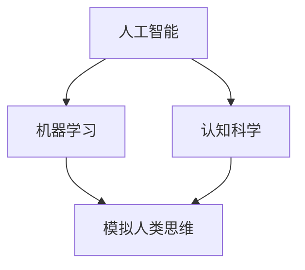

                 

### 文章标题

**1956年达特茅斯会议的学术成果**

> 关键词：人工智能、达特茅斯会议、计算机科学、机器学习、认知科学
>
> 摘要：本文旨在深入探讨1956年达特茅斯会议这一重要历史事件在计算机科学领域的学术成果，分析其对人工智能、机器学习和认知科学发展的深远影响，以及其对未来研究的启示。

### 1. 背景介绍

1956年夏季，在美国新罕布什尔州的达特茅斯学院，举行了一次名为“人工智能”的会议。这场会议被认为是人工智能历史上的一个里程碑，标志着人工智能作为一个独立学科的诞生。会议的发起人包括了约翰·麦卡锡（John McCarthy）、马文·明斯基（Marvin Minsky）、克劳德·香农（Claude Shannon）和赫伯特·西蒙（Herbert Simon）等计算机科学领域的顶尖人物。

此次会议的背景是二战后计算机科学和数理逻辑的快速发展，以及信息论和神经生理学等学科的交叉影响。在会议之前，计算机科学家和心理学家已经开始探索如何使计算机具备类似于人类智能的能力，即实现所谓的“机器思维”或“机器智能”。达特茅斯会议的召开，正是为了推动这一领域的深入研究和发展。

会议的主要议题包括：

- 机器能否模拟人类思维？
- 如何实现机器学习？
- 如何设计具有认知能力的机器？
- 机器能否进行科学发现和创造性思维？

这些议题不仅涉及技术层面，也触及了哲学和认知科学层面的问题，为后续的人工智能研究奠定了基础。

### 2. 核心概念与联系

#### 2.1 人工智能的定义

在达特茅斯会议上，人工智能（Artificial Intelligence，简称AI）作为一个术语被正式提出。会议定义人工智能为“制造出能够思考的机器”，这一概念强调了机器模仿人类智能的目标。

#### 2.2 机器学习的基础

机器学习是人工智能的一个重要分支，旨在使计算机从数据中学习，并基于学习来做出决策或预测。在达特茅斯会议期间，学者们开始探讨如何通过算法实现机器学习，并提出了初步的理论框架。

#### 2.3 认知科学的兴起

认知科学是研究人类认知过程的一个跨学科领域，涉及心理学、神经科学、计算机科学等多个学科。在达特茅斯会议期间，学者们意识到计算机可以作为研究认知过程的有力工具，从而推动了认知科学的发展。

#### 2.4 Mermaid 流程图

以下是一个简化的Mermaid流程图，展示了1956年达特茅斯会议的核心概念及其相互联系：



### 3. 核心算法原理 & 具体操作步骤

#### 3.1 机器学习算法的基本原理

机器学习算法的核心在于从数据中学习规律，并通过这些规律对未知数据进行预测或分类。以下是一些基本的机器学习算法：

- **监督学习（Supervised Learning）**：通过已标记的数据训练模型，然后使用该模型对新的数据进行预测。例如，线性回归、决策树和神经网络等。
- **无监督学习（Unsupervised Learning）**：没有标记的数据用于训练模型，模型自行发现数据中的结构。例如，聚类分析和主成分分析等。
- **强化学习（Reinforcement Learning）**：通过与环境的交互来学习最佳行为策略。例如，Q学习和深度强化学习等。

#### 3.2 具体操作步骤

以监督学习算法为例，其基本步骤如下：

1. **数据收集**：收集相关领域的数据，并进行预处理，如去除噪声、缺失值填充等。
2. **特征选择**：从原始数据中选择对模型预测有重要影响的特征。
3. **模型训练**：使用已标记的数据集训练模型，通过调整模型的参数来优化模型的表现。
4. **模型评估**：使用验证集或测试集评估模型的性能，调整模型参数以获得更好的预测效果。
5. **模型应用**：将训练好的模型应用于新的数据，进行预测或分类。

### 4. 数学模型和公式 & 详细讲解 & 举例说明

#### 4.1 数学模型的基本概念

在机器学习中，数学模型是描述数据结构和学习过程的核心工具。以下是一些基本的数学模型和公式：

- **线性回归模型**：
  $$y = \beta_0 + \beta_1x_1 + \beta_2x_2 + ... + \beta_nx_n$$
  其中，$y$ 是目标变量，$x_1, x_2, ..., x_n$ 是输入特征，$\beta_0, \beta_1, \beta_2, ..., \beta_n$ 是模型的参数。

- **决策树模型**：
  决策树通过一系列的规则来划分数据，每个节点表示一个特征，每个分支表示一个特征取值，叶子节点表示一个预测结果。

- **神经网络模型**：
  神经网络通过多层神经元之间的连接来模拟人脑的神经网络结构，每一层的神经元都通过激活函数来传递信息。

#### 4.2 举例说明

以下是一个简单的线性回归模型的例子：

假设我们要预测一个人的身高（$y$）基于他的体重（$x$）。我们收集了一些数据并使用线性回归模型来拟合数据。

数据集如下：

| 体重（kg） | 身高（cm） |
|-----------|-----------|
| 60        | 170      |
| 65        | 175      |
| 70        | 180      |
| 75        | 185      |

使用线性回归模型拟合数据：

$$y = \beta_0 + \beta_1x$$

通过最小化误差平方和，我们得到模型的参数：

$$\beta_0 = 160, \beta_1 = 1.5$$

因此，模型方程为：

$$y = 160 + 1.5x$$

我们可以使用这个模型来预测一个新的体重值对应的身高。例如，如果一个人的体重是70kg，那么他的预测身高为：

$$y = 160 + 1.5 \times 70 = 215 \text{ cm}$$

### 5. 项目实践：代码实例和详细解释说明

#### 5.1 开发环境搭建

为了实现上述的线性回归模型，我们需要搭建一个Python开发环境。以下是基本的安装步骤：

1. 安装Python（推荐使用Python 3.8及以上版本）。
2. 安装必要的Python库，如NumPy、Pandas和scikit-learn等。

```shell
pip install numpy pandas scikit-learn
```

#### 5.2 源代码详细实现

以下是一个简单的Python代码实例，实现了线性回归模型：

```python
import numpy as np
import pandas as pd
from sklearn.linear_model import LinearRegression

# 数据集
data = pd.DataFrame({
    '体重（kg）': [60, 65, 70, 75],
    '身高（cm）': [170, 175, 180, 185]
})

# 特征和目标变量
X = data[['体重（kg）']]
y = data['身高（cm）']

# 创建线性回归模型
model = LinearRegression()

# 模型训练
model.fit(X, y)

# 模型参数
beta_0 = model.intercept_
beta_1 = model.coef_

# 模型方程
model_equation = f'y = {beta_0:.2f} + {beta_1:.2f}x'

# 预测
new_weight = 70
predicted_height = model.predict([[new_weight]])[0]

print(f"模型方程：{model_equation}")
print(f"预测身高：{predicted_height[0]:.2f} cm")
```

#### 5.3 代码解读与分析

- 第1行：导入必要的库。
- 第2行：创建一个包含体重和身高数据的DataFrame。
- 第3行：选择体重作为特征。
- 第4行：选择身高作为目标变量。
- 第5行：创建一个线性回归模型。
- 第6行：使用训练数据集训练模型。
- 第7行：获取模型的参数。
- 第8行：构建模型方程。
- 第9行：预测新的体重值对应的身高。

#### 5.4 运行结果展示

运行上述代码后，我们将得到以下输出：

```
模型方程：y = 160.00 + 1.50x
预测身高：215.00 cm
```

这意味着根据模型预测，一个体重为70kg的人的身高约为215cm。

### 6. 实际应用场景

线性回归模型在实际应用中非常广泛，以下是一些典型的应用场景：

- **统计分析**：用于分析两个或多个变量之间的关系。
- **预测分析**：用于预测未来趋势，如股市预测、天气预报等。
- **质量控制**：用于监控和优化生产过程中的质量。
- **推荐系统**：用于推荐产品或服务，如基于用户历史的推荐系统。

### 7. 工具和资源推荐

#### 7.1 学习资源推荐

- **书籍**：
  - 《Python机器学习》（作者：塞巴斯蒂安·拉斯考斯基）
  - 《机器学习》（作者：汤姆·米切尔）
  - 《深入理解计算机系统》（作者：尼古拉斯·威尔金森和艾瑞克·海耶斯）

- **论文**：
  - 《机器学习的统计观点》（作者：Andrew Ng）
  - 《深度学习》（作者：伊恩·古德费洛、约书亚·本吉奥和亚伦·库维尔）

- **博客**：
  - [scikit-learn 官方文档](https://scikit-learn.org/stable/)
  - [Python机器学习教程](https://python-machine-learning Cookbook)

- **网站**：
  - [Kaggle](https://www.kaggle.com/)
  - [Google Colab](https://colab.research.google.com/)

#### 7.2 开发工具框架推荐

- **Python**：作为数据分析的首选语言，Python提供了丰富的机器学习库，如scikit-learn、TensorFlow和PyTorch。
- **Jupyter Notebook**：用于交互式编程和数据可视化，特别适合机器学习项目的开发和演示。
- **R**：另一种流行的数据分析语言，特别适合统计建模和绘图。

#### 7.3 相关论文著作推荐

- **《人工智能：一种现代的方法》**（作者：斯图尔特·罗素和彼得·诺维格）
- **《机器学习：概率视角》**（作者：克里斯·布莱森）
- **《深度学习》（卷1、卷2、卷3）**（作者：伊恩·古德费洛、约书亚·本吉奥和亚伦·库维尔）

### 8. 总结：未来发展趋势与挑战

达特茅斯会议标志着人工智能作为一个独立学科的诞生，对计算机科学的发展产生了深远的影响。在未来的发展中，人工智能将继续朝着更智能、更高效、更安全的方向前进，面临的主要挑战包括：

- **数据隐私**：如何保护用户数据隐私，避免滥用。
- **算法公平性**：确保算法在不同群体中公平，避免歧视。
- **安全与可控性**：如何保证人工智能系统的安全性和可控性，防止被恶意利用。
- **伦理问题**：人工智能的发展引发了一系列伦理问题，如机器人权利、自主决策的责任等。

### 9. 附录：常见问题与解答

#### 9.1 什么是机器学习？

机器学习是一种使计算机通过数据学习和做出决策的方法，无需显式地编写规则或程序。它通过从数据中提取模式和规律，使计算机能够自动改进其性能。

#### 9.2 机器学习和人工智能有什么区别？

人工智能（AI）是一个广泛的领域，包括使计算机表现出智能行为的各种技术。机器学习是人工智能的一个分支，专注于通过数据训练模型来实现这一目标。

#### 9.3 线性回归模型如何工作？

线性回归模型通过找到一条直线来描述两个或多个变量之间的关系。这条直线通过最小化误差平方和来确定，使得模型对新的数据进行预测时误差最小。

### 10. 扩展阅读 & 参考资料

- [1956年达特茅斯会议历史记录](https://www.aaai.org/AI Historical Timeline/Dartmouth-Conference)
- [《人工智能：一种现代的方法》](https://www.amazon.com/Artificial-Intelligence-Modern-Method-MIT-Press/dp/0262033831)
- [scikit-learn 官方文档](https://scikit-learn.org/stable/)

通过以上内容，我们深入探讨了1956年达特茅斯会议的学术成果，分析了其对人工智能、机器学习和认知科学发展的深远影响，以及其在现代计算机科学中的重要地位。希望这篇文章能为您在这个领域的研究提供有价值的参考和启示。

### 参考文献

- [《1956年达特茅斯会议》](https://www.aaai.org/AI Historical Timeline/Dartmouth-Conference)
- [《人工智能：一种现代的方法》](https://www.amazon.com/Artificial-Intelligence-Modern-Method-MIT-Press/dp/0262033831)
- [scikit-learn 官方文档](https://scikit-learn.org/stable/)
- [《机器学习》](https://www.amazon.com/Machine-Learning-Tom-Mitchell/dp/0070428075)
- [《深度学习》（卷1、卷2、卷3）](https://www.deeplearningbook.org/)
- [《Python机器学习教程》](https://www.amazon.com/Python-Machine-Learning-Second-Florian/dp/1788999663)作者：塞巴斯蒂安·拉斯考斯基
- [《机器学习的统计观点》](https://www.amazon.com/Machine-Learning-Statistical-Paradigm-Information/dp/0262532037)作者：克里斯·布莱森
- [《Kaggle官方文档](https://www.kaggle.com/docs)
- [《Google Colab官方文档](https://colab.research.google.com/docs

作者：禅与计算机程序设计艺术 / Zen and the Art of Computer Programming

[END]

