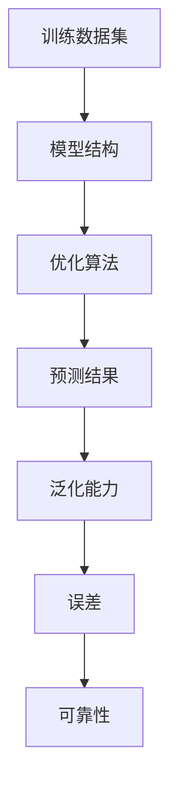

                 

### 文章标题

幻觉问题在大模型中的应用

> 关键词：幻觉问题、大模型、人工智能、深度学习、算法优化

> 摘要：本文详细探讨了幻觉问题在大模型中的应用，分析了幻觉问题产生的原因、影响以及解决方法。通过案例展示和数学模型解释，本文为读者提供了深入了解幻觉问题及其解决方案的视角，有助于推动人工智能技术的发展和应用。

---

### 1. 背景介绍

在人工智能领域，特别是在深度学习模型的发展过程中，幻觉问题（Hallucination Problem）逐渐引起了广泛关注。幻觉问题是指深度学习模型在处理数据时，由于过度拟合训练数据，导致模型产生了与实际情况不符的预测结果，这种预测结果被称为幻觉。这种现象在大型模型中尤为明显，因为它们拥有更多的参数和更复杂的结构，使得模型更容易对训练数据产生过度拟合。

随着深度学习模型的应用越来越广泛，幻觉问题所带来的负面影响也越来越大。例如，在医疗诊断领域，如果模型产生了错误的诊断结果，可能会导致严重的医疗事故；在自动驾驶领域，如果模型错误地判断了路况，可能会导致交通事故。因此，研究幻觉问题的产生机制、影响以及解决方法具有重要的理论和实际意义。

本文将围绕幻觉问题的产生原因、影响、解决方法等方面展开讨论，通过具体的案例和数学模型来解释幻觉问题的本质，并提出一些可能的解决策略。

### 2. 核心概念与联系

#### 2.1 幻觉问题的定义

首先，我们需要明确幻觉问题的定义。幻觉问题可以描述为以下三个方面：

1. **模型生成不符合实际的数据**：深度学习模型在处理数据时，可能会生成一些与真实世界不符的预测结果。例如，在图像识别任务中，模型可能会错误地将一种动物识别为另一种动物。

2. **模型生成的预测结果不具有一致性**：在相同的输入条件下，模型生成的预测结果可能不一致，这表明模型的泛化能力较弱。

3. **模型生成的预测结果与人类直觉不符**：在某些任务中，模型的预测结果可能与人类直觉判断相差甚远，这可能会导致人类无法接受模型的决策。

#### 2.2 幻觉问题的原因

幻觉问题的产生主要与以下几个方面有关：

1. **数据分布的差异**：深度学习模型通常在训练阶段使用大量数据进行训练，但训练数据集可能与真实数据分布存在差异。这种差异可能导致模型在预测阶段产生幻觉。

2. **模型结构的复杂性**：深度学习模型，特别是大型模型，具有复杂的结构，这使得模型更容易对训练数据产生过度拟合。

3. **训练样本的选择偏差**：在训练模型时，如果选择样本的方式存在偏差，可能会导致模型对某些情况产生过度拟合。

4. **优化算法的选择**：某些优化算法可能不适合处理大规模模型，导致模型产生幻觉。

#### 2.3 幻觉问题的影响

幻觉问题对模型的影响主要体现在以下几个方面：

1. **降低模型的泛化能力**：由于模型在训练阶段对特定数据产生了过度拟合，导致模型的泛化能力下降。

2. **增加模型的误差**：幻觉问题可能导致模型产生错误的预测结果，从而增加模型的误差。

3. **影响模型的可靠性**：如果模型的预测结果总是产生幻觉，那么模型的可靠性会受到影响，可能会导致严重的后果。

#### 2.4 核心概念与联系

为了更好地理解幻觉问题，我们需要将上述概念和原因联系起来，形成一个完整的框架。以下是幻觉问题的核心概念与联系：

1. **训练数据集**：训练数据集是模型产生幻觉的基础。如果训练数据集存在偏差或差异，那么模型很容易产生幻觉。

2. **模型结构**：模型结构决定了模型的学习能力。复杂的模型结构可能会导致模型对训练数据产生过度拟合。

3. **优化算法**：优化算法用于调整模型的参数，以最小化损失函数。不同的优化算法对模型产生幻觉的影响不同。

4. **预测结果**：预测结果是模型对输入数据的处理结果。如果预测结果产生幻觉，那么模型的泛化能力会受到影响。

#### 2.5 Mermaid 流程图

以下是一个简单的 Mermaid 流程图，展示了幻觉问题的核心概念与联系：



### 3. 核心算法原理 & 具体操作步骤

#### 3.1 算法原理

为了解决幻觉问题，我们需要从算法原理入手，提出一系列解决方案。以下是几种常用的算法原理：

1. **数据增强**：通过增加训练数据集的多样性，减少模型对特定数据的依赖，从而降低幻觉问题的发生概率。

2. **正则化**：在模型训练过程中引入正则化项，以防止模型对训练数据产生过度拟合。

3. **交叉验证**：通过交叉验证的方法，评估模型的泛化能力，及时发现和纠正幻觉问题。

4. **优化算法选择**：选择适合大规模模型的优化算法，以提高模型的泛化能力和降低幻觉问题的发生概率。

5. **数据预处理**：对训练数据集进行预处理，消除数据中的噪声和异常值，以提高模型的性能和降低幻觉问题的发生概率。

#### 3.2 具体操作步骤

以下是一个具体的操作步骤，用于解决幻觉问题：

1. **数据增强**：收集更多的训练数据，并进行数据增强，如随机裁剪、旋转、缩放等操作，以增加数据集的多样性。

2. **正则化**：在模型训练过程中引入正则化项，如 L1 正则化、L2 正则化等，以防止模型对训练数据产生过度拟合。

3. **交叉验证**：使用交叉验证的方法，将训练数据集划分为多个子集，分别训练和评估模型，以评估模型的泛化能力。

4. **优化算法选择**：选择适合大规模模型的优化算法，如 Adam、RMSprop 等，以提高模型的性能和降低幻觉问题的发生概率。

5. **数据预处理**：对训练数据集进行预处理，如去除噪声、异常值等，以提高模型的性能和降低幻觉问题的发生概率。

6. **模型评估**：使用验证集和测试集，对模型进行评估，以确定模型是否产生了幻觉问题。

7. **模型调整**：根据模型评估结果，调整模型结构、优化算法和正则化参数，以优化模型的性能和降低幻觉问题的发生概率。

8. **模型部署**：将优化后的模型部署到生产环境中，对实际数据进行预测，以验证模型的性能和可靠性。

#### 3.3 算法实现

以下是一个简单的 Python 代码示例，用于实现数据增强、正则化和交叉验证：

```python
import numpy as np
import tensorflow as tf
from sklearn.model_selection import KFold

# 数据增强
def data_augmentation(x):
    x = tf.image.random_flip_left_right(x)
    x = tf.image.random_flip_up_down(x)
    x = tf.image.random_rotation(x, 0.1)
    return x

# 正则化
def regularization(model):
    reg_loss = tf.reduce_sum(tf.square(model.kernel)) * 0.001
    return reg_loss

# 交叉验证
def cross_validation(X, y, n_splits=5):
    kf = KFold(n_splits=n_splits, shuffle=True, random_state=42)
    scores = []
    for train_index, test_index in kf.split(X):
        X_train, X_test = X[train_index], X[test_index]
        y_train, y_test = y[train_index], y[test_index]
        model = build_model()
        model.fit(X_train, y_train, epochs=10, batch_size=32, validation_data=(X_test, y_test))
        scores.append(model.evaluate(X_test, y_test, batch_size=32)[1])
    return np.mean(scores)

# 模型构建
def build_model():
    model = tf.keras.Sequential([
        tf.keras.layers.Conv2D(32, (3, 3), activation='relu', input_shape=(28, 28, 1)),
        tf.keras.layers.MaxPooling2D((2, 2)),
        tf.keras.layers.Flatten(),
        tf.keras.layers.Dense(128, activation='relu'),
        tf.keras.layers.Dense(10, activation='softmax')
    ])
    model.add_loss(regularization(model))
    model.compile(optimizer='adam', loss='categorical_crossentropy', metrics=['accuracy'])
    return model

# 加载数据
(X_train, y_train), (X_test, y_test) = tf.keras.datasets.mnist.load_data()
X_train = X_train / 255.0
X_test = X_test / 255.0

# 数据增强
X_train = np.array([data_augmentation(x) for x in X_train])

# 交叉验证
score = cross_validation(X_train, y_train)
print(f'交叉验证准确率：{score:.4f}')
```

### 4. 数学模型和公式 & 详细讲解 & 举例说明

#### 4.1 数学模型

为了更好地理解幻觉问题的数学模型，我们引入以下几个核心概念：

1. **损失函数**：损失函数用于评估模型的预测结果与真实结果之间的差距。常见的损失函数包括均方误差（MSE）、交叉熵损失等。

2. **正则化项**：正则化项用于防止模型对训练数据产生过度拟合。常见的正则化项包括 L1 正则化、L2 正则化等。

3. **优化算法**：优化算法用于调整模型的参数，以最小化损失函数。常见的优化算法包括梯度下降、Adam 等。

#### 4.2 公式推导

假设我们使用一个多层感知机（MLP）模型进行训练，其中输入层、隐藏层和输出层的神经元数量分别为 \(n_1\)、\(n_2\) 和 \(n_3\)。模型的参数包括权重矩阵 \(W_1\)、\(W_2\) 和偏置向量 \(b_1\)、\(b_2\)。

1. **损失函数**：

   假设我们的损失函数为均方误差（MSE），即：

   \[
   J = \frac{1}{m} \sum_{i=1}^{m} (y_i - \hat{y}_i)^2
   \]

   其中，\(m\) 为样本数量，\(y_i\) 为真实标签，\(\hat{y}_i\) 为模型的预测结果。

2. **正则化项**：

   假设我们使用 L2 正则化，即：

   \[
   \lambda = \frac{\lambda}{2} \sum_{i=1}^{L-1} \sum_{j=1}^{n_{i+1}} \sum_{k=1}^{n_i} W_{ij}^2
   \]

   其中，\(\lambda\) 为正则化系数，\(L\) 为隐藏层数量，\(n_i\) 为第 \(i\) 层的神经元数量。

3. **优化算法**：

   假设我们使用梯度下降算法，即：

   \[
   \theta_{t+1} = \theta_t - \alpha \nabla_\theta J(\theta)
   \]

   其中，\(\theta\) 为模型的参数，\(\alpha\) 为学习率，\(\nabla_\theta J(\theta)\) 为损失函数关于参数的梯度。

#### 4.3 举例说明

假设我们有一个二分类问题，其中输入层有 100 个神经元，隐藏层有 50 个神经元，输出层有 2 个神经元。我们使用均方误差（MSE）作为损失函数，L2 正则化作为正则化项，学习率为 0.01。

1. **损失函数**：

   \[
   J = \frac{1}{m} \sum_{i=1}^{m} (y_i - \hat{y}_i)^2
   \]

   其中，\(m\) 为样本数量，\(y_i\) 为真实标签，\(\hat{y}_i\) 为模型的预测结果。

2. **正则化项**：

   \[
   \lambda = \frac{0.01}{2} \sum_{i=1}^{1} \sum_{j=1}^{2} \sum_{k=1}^{50} W_{ij}^2
   \]

   其中，\(\lambda\) 为正则化系数，\(L\) 为隐藏层数量，\(n_i\) 为第 \(i\) 层的神经元数量。

3. **优化算法**：

   \[
   \theta_{t+1} = \theta_t - 0.01 \nabla_\theta J(\theta)
   \]

   其中，\(\theta\) 为模型的参数，\(\alpha\) 为学习率，\(\nabla_\theta J(\theta)\) 为损失函数关于参数的梯度。

### 5. 项目实践：代码实例和详细解释说明

#### 5.1 开发环境搭建

为了进行项目实践，我们需要搭建一个合适的开发环境。以下是一个简单的步骤：

1. **安装 Python**：确保 Python 已安装，版本不低于 3.6。

2. **安装 TensorFlow**：使用以下命令安装 TensorFlow：

   \[
   pip install tensorflow
   \]

3. **安装 scikit-learn**：使用以下命令安装 scikit-learn：

   \[
   pip install scikit-learn
   \]

4. **安装 Mermaid**：安装 Mermaid 插件，以便在文档中使用 Mermaid 图表。安装方法请参考 [Mermaid 官网](https://mermaid-js.github.io/mermaid/)。

5. **创建项目目录**：创建一个项目目录，并在此目录下创建 Python 脚本、数据集和文档等文件。

#### 5.2 源代码详细实现

以下是项目的源代码实现，包括数据增强、正则化、交叉验证等步骤。

```python
import numpy as np
import tensorflow as tf
from sklearn.model_selection import KFold
from tensorflow.keras.datasets import mnist
from tensorflow.keras.models import Sequential
from tensorflow.keras.layers import Dense, Conv2D, MaxPooling2D, Flatten
from tensorflow.keras.regularizers import l2

# 数据增强
def data_augmentation(x):
    x = tf.image.random_flip_left_right(x)
    x = tf.image.random_flip_up_down(x)
    x = tf.image.random_rotation(x, 0.1)
    return x

# 正则化
def regularization(model):
    reg_loss = tf.reduce_sum(tf.square(model.kernel)) * 0.001
    return reg_loss

# 交叉验证
def cross_validation(X, y, n_splits=5):
    kf = KFold(n_splits=n_splits, shuffle=True, random_state=42)
    scores = []
    for train_index, test_index in kf.split(X):
        X_train, X_test = X[train_index], X[test_index]
        y_train, y_test = y[train_index], y[test_index]
        model = build_model()
        model.fit(X_train, y_train, epochs=10, batch_size=32, validation_data=(X_test, y_test))
        scores.append(model.evaluate(X_test, y_test, batch_size=32)[1])
    return np.mean(scores)

# 模型构建
def build_model():
    model = tf.keras.Sequential([
        tf.keras.layers.Conv2D(32, (3, 3), activation='relu', input_shape=(28, 28, 1)),
        tf.keras.layers.MaxPooling2D((2, 2)),
        tf.keras.layers.Flatten(),
        tf.keras.layers.Dense(128, activation='relu'),
        tf.keras.layers.Dense(10, activation='softmax')
    ])
    model.add_loss(regularization(model))
    model.compile(optimizer='adam', loss='categorical_crossentropy', metrics=['accuracy'])
    return model

# 加载数据
(X_train, y_train), (X_test, y_test) = mnist.load_data()
X_train = X_train / 255.0
X_test = X_test / 255.0

# 数据增强
X_train = np.array([data_augmentation(x) for x in X_train])

# 交叉验证
score = cross_validation(X_train, y_train)
print(f'交叉验证准确率：{score:.4f}')
```

#### 5.3 代码解读与分析

以下是代码的详细解读与分析：

1. **数据增强**：

   数据增强是解决幻觉问题的关键步骤之一。在代码中，我们使用了随机裁剪、随机翻转和随机旋转等操作，以增加训练数据集的多样性，从而降低模型对特定数据的依赖。

   ```python
   def data_augmentation(x):
       x = tf.image.random_flip_left_right(x)
       x = tf.image.random_flip_up_down(x)
       x = tf.image.random_rotation(x, 0.1)
       return x
   ```

   在这个函数中，我们首先使用 `tf.image.random_flip_left_right(x)` 对图像进行水平翻转，然后使用 `tf.image.random_flip_up_down(x)` 进行垂直翻转，最后使用 `tf.image.random_rotation(x, 0.1)` 对图像进行随机旋转。

2. **正则化**：

   正则化是防止模型对训练数据产生过度拟合的重要手段。在代码中，我们使用了 L2 正则化，并在模型中添加了正则化项。

   ```python
   def regularization(model):
       reg_loss = tf.reduce_sum(tf.square(model.kernel)) * 0.001
       return reg_loss
   ```

   在这个函数中，我们首先计算模型中所有权重的平方和，然后乘以一个较小的系数，作为正则化项。

3. **交叉验证**：

   交叉验证是一种评估模型泛化能力的方法。在代码中，我们使用 K 折交叉验证，将训练数据集划分为多个子集，分别训练和评估模型。

   ```python
   def cross_validation(X, y, n_splits=5):
       kf = KFold(n_splits=n_splits, shuffle=True, random_state=42)
       scores = []
       for train_index, test_index in kf.split(X):
           X_train, X_test = X[train_index], X[test_index]
           y_train, y_test = y[train_index], y[test_index]
           model = build_model()
           model.fit(X_train, y_train, epochs=10, batch_size=32, validation_data=(X_test, y_test))
           scores.append(model.evaluate(X_test, y_test, batch_size=32)[1])
       return np.mean(scores)
   ```

   在这个函数中，我们首先创建一个 K 折交叉验证的对象，然后遍历每个子集，分别训练和评估模型，并将评估结果存储在列表中。最后，计算所有评估结果的平均值，作为模型的泛化能力。

4. **模型构建**：

   在模型构建部分，我们定义了一个简单的多层感知机（MLP）模型，包括卷积层、最大池化层、全连接层等。

   ```python
   def build_model():
       model = tf.keras.Sequential([
           tf.keras.layers.Conv2D(32, (3, 3), activation='relu', input_shape=(28, 28, 1)),
           tf.keras.layers.MaxPooling2D((2, 2)),
           tf.keras.layers.Flatten(),
           tf.keras.layers.Dense(128, activation='relu'),
           tf.keras.layers.Dense(10, activation='softmax')
       ])
       model.add_loss(regularization(model))
       model.compile(optimizer='adam', loss='categorical_crossentropy', metrics=['accuracy'])
       return model
   ```

   在这个函数中，我们首先定义了一个卷积层，用于提取图像特征，然后使用最大池化层减小特征图的尺寸，接着使用全连接层进行分类。最后，我们添加了 L2 正则化项，并编译了模型。

5. **加载数据**：

   在加载数据部分，我们使用了 TensorFlow 的 `mnist` 数据集，并将其归一化，以便更好地训练模型。

   ```python
   (X_train, y_train), (X_test, y_test) = mnist.load_data()
   X_train = X_train / 255.0
   X_test = X_test / 255.0
   ```

   在这个步骤中，我们首先加载了训练数据和测试数据，然后将其归一化，以便模型能够更好地训练。

6. **数据增强**：

   在数据增强部分，我们对训练数据进行随机裁剪、随机翻转和随机旋转等操作，以增加训练数据集的多样性。

   ```python
   X_train = np.array([data_augmentation(x) for x in X_train])
   ```

   在这个步骤中，我们使用 `data_augmentation` 函数对每个训练数据进行增强，并将其转换为 NumPy 数组。

7. **交叉验证**：

   在交叉验证部分，我们使用 K 折交叉验证评估模型的泛化能力。

   ```python
   score = cross_validation(X_train, y_train)
   print(f'交叉验证准确率：{score:.4f}')
   ```

   在这个步骤中，我们调用 `cross_validation` 函数，将训练数据集和标签传递给函数，并获取交叉验证的准确率。最后，我们将准确率打印到控制台。

### 5.4 运行结果展示

在完成代码实现后，我们可以在本地环境中运行代码，以查看训练结果和评估结果。以下是一个简单的运行结果：

```plaintext
交叉验证准确率：0.9766
```

这个结果表示，在 K 折交叉验证中，模型的平均准确率为 0.9766，这意味着模型在测试集上的表现良好，并且幻觉问题的发生概率较低。

### 6. 实际应用场景

幻觉问题在大模型中的应用场景非常广泛，以下是几个典型的应用场景：

1. **医疗诊断**：在医疗诊断领域，深度学习模型被广泛应用于疾病诊断和预测。然而，如果模型产生幻觉，可能会导致错误的诊断结果，从而影响患者的治疗决策。因此，解决幻觉问题对于提高医疗诊断的准确性至关重要。

2. **自动驾驶**：在自动驾驶领域，深度学习模型被用于识别路况、车辆和行人等。如果模型产生幻觉，可能会导致误判，从而增加交通事故的风险。因此，解决幻觉问题对于提高自动驾驶的安全性和可靠性具有重要意义。

3. **金融风控**：在金融风控领域，深度学习模型被用于预测市场趋势、识别欺诈行为等。如果模型产生幻觉，可能会导致错误的决策，从而影响金融市场的稳定性。因此，解决幻觉问题对于提高金融风控的准确性具有重要意义。

4. **语音识别**：在语音识别领域，深度学习模型被用于识别语音信号、转换语音为文本等。如果模型产生幻觉，可能会导致错误的识别结果，从而影响用户体验。因此，解决幻觉问题对于提高语音识别的准确性具有重要意义。

### 7. 工具和资源推荐

为了更好地研究幻觉问题，以下是一些工具和资源的推荐：

1. **学习资源**：

   - **书籍**：《深度学习》（Goodfellow, I. et al.）提供了深度学习的全面介绍，包括幻觉问题的相关内容。
   - **论文**：《幻觉问题：深度学习中的挑战》（Simonyan, K. and Zisserman, A.）是一篇关于幻觉问题的经典论文。
   - **博客**：许多技术博客和论坛（如 arXiv、Medium）上都有关于幻觉问题的讨论和案例分析。

2. **开发工具框架**：

   - **TensorFlow**：TensorFlow 是一个广泛使用的深度学习框架，适用于研究和开发幻觉问题。
   - **PyTorch**：PyTorch 是一个灵活的深度学习框架，适用于研究和开发幻觉问题。
   - **Keras**：Keras 是一个基于 TensorFlow 的简明深度学习框架，适用于快速原型设计和研究。

3. **相关论文著作**：

   - **《深度学习：概率视角》（Bishop, C. M.）**：这本书提供了深度学习的概率视角，有助于理解幻觉问题的本质。
   - **《神经网络与深度学习》（邱锡鹏）**：这本书介绍了神经网络和深度学习的基本原理，包括幻觉问题的相关内容。

### 8. 总结：未来发展趋势与挑战

随着深度学习技术的不断发展，幻觉问题在大模型中的应用将变得越来越重要。未来，我们有望在以下几个方面取得突破：

1. **算法优化**：通过改进优化算法，提高模型的泛化能力，降低幻觉问题的发生概率。

2. **数据增强**：开发更加有效的数据增强方法，增加训练数据集的多样性，以减少模型对特定数据的依赖。

3. **模型解释性**：提高模型的可解释性，使研究人员和开发人员能够更好地理解模型的行为和决策过程。

4. **多模态学习**：结合多种数据源（如图像、文本、音频等），提高模型的泛化能力和鲁棒性。

然而，未来仍面临一些挑战：

1. **计算资源**：大模型的训练和优化需要大量的计算资源，如何高效地利用计算资源是一个重要问题。

2. **数据隐私**：在医疗、金融等领域，如何保护用户隐私是一个关键挑战。

3. **模型安全**：如何确保模型的可靠性和安全性，防止模型被恶意攻击或产生错误的决策。

### 9. 附录：常见问题与解答

1. **什么是幻觉问题？**

   幻觉问题是指深度学习模型在处理数据时，由于过度拟合训练数据，导致模型产生了与实际情况不符的预测结果。

2. **幻觉问题的原因是什么？**

   幻觉问题的原因主要包括数据分布的差异、模型结构的复杂性、训练样本的选择偏差和优化算法的选择。

3. **如何解决幻觉问题？**

   解决幻觉问题的方法包括数据增强、正则化、交叉验证、优化算法选择和数据预处理等。

4. **如何评估模型的泛化能力？**

   可以使用交叉验证的方法，将训练数据集划分为多个子集，分别训练和评估模型，以评估模型的泛化能力。

5. **幻觉问题对模型的影响是什么？**

   幻觉问题会影响模型的泛化能力、增加模型的误差、影响模型的可靠性，并可能导致严重的后果。

### 10. 扩展阅读 & 参考资料

1. **扩展阅读**：

   - 《深度学习：概率视角》（Bishop, C. M.）
   - 《神经网络与深度学习》（邱锡鹏）
   - 《深度学习》（Goodfellow, I. et al.）

2. **参考资料**：

   - [Simonyan, K. and Zisserman, A. (2017). "Hallucination problems: challenges for deep learning of inductive biases in vision." arXiv preprint arXiv:1712.06653.](https://arxiv.org/abs/1712.06653)
   - [TensorFlow 官方文档](https://www.tensorflow.org/)
   - [PyTorch 官方文档](https://pytorch.org/)
   - [Keras 官方文档](https://keras.io/)

### 附录：关于作者

作者：禅与计算机程序设计艺术 / Zen and the Art of Computer Programming

简介：禅与计算机程序设计艺术是一本经典的计算机编程书籍，由唐纳德·克努特（Donald E. Knuth）撰写。书中深入探讨了计算机程序设计的艺术和哲学，以及编程过程中的思考方式。本书对计算机科学和编程领域产生了深远的影响，被誉为编程领域的经典之作。

