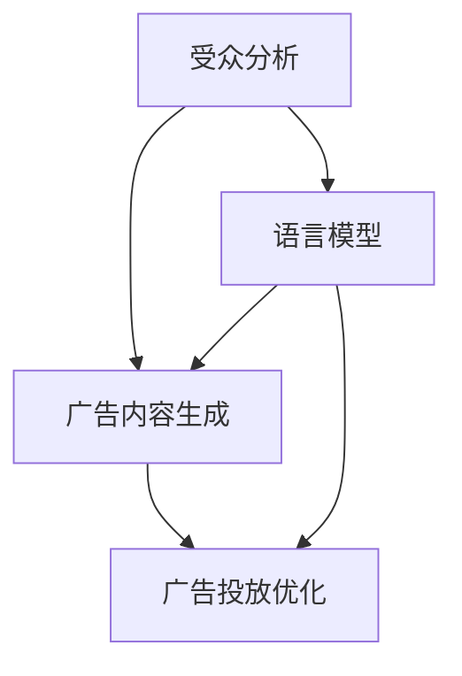

                 

### 背景介绍

广告和语言模型（LLM）的结合正在迅速改变数字营销的格局。广告行业一直以来都是市场营销的重要组成部分，而随着互联网的普及和数字化技术的进步，在线广告已经成为了企业获取客户和推广产品的主要手段之一。然而，广告的效果不仅仅取决于投放的数量，更取决于广告的精准度和针对性。这就引出了语言模型（LLM）的作用。

语言模型是一种基于人工智能技术的自然语言处理工具，它可以理解和生成自然语言文本。近年来，随着深度学习技术的不断发展，语言模型在自然语言理解、文本生成、问答系统等方面取得了显著的成果。特别是在广告领域，语言模型的应用使得广告可以更加精准地定位目标受众，从而提高广告的效果和投资回报率。

本文将深入探讨广告和LLM的结合，分析其背后的核心概念、算法原理、数学模型以及实际应用场景。我们还将介绍一些相关的工具和资源，帮助读者更好地理解和应用这项技术。希望通过本文的探讨，能够为读者提供对广告和LLM结合的全面了解，并激发读者在该领域的创新思维。

### 核心概念与联系

在深入探讨广告和LLM的结合之前，我们需要了解一些核心概念和它们之间的联系。这些概念包括广告的目标、受众分析、广告投放策略以及LLM的工作原理。

#### 广告目标

广告的目标是吸引潜在客户，提高品牌知名度，并最终实现销售转化。为了实现这些目标，广告必须具备以下特点：

1. **针对性**：广告需要针对特定的受众群体，这样才能最大化地提高广告的点击率和转化率。
2. **创意性**：创意的广告内容能够吸引更多用户的注意力，从而提高广告的效果。
3. **专业性**：专业的广告设计能够展示企业的品牌形象和专业能力，增强用户对品牌的信任。

#### 受众分析

受众分析是广告策略的重要组成部分。通过分析受众的年龄、性别、地理位置、兴趣爱好等信息，广告可以更好地定位目标群体，从而提高广告的针对性。受众分析的方法包括：

1. **用户画像**：通过收集和分析用户数据，构建用户的个性化画像，以便更精准地投放广告。
2. **数据分析**：利用大数据技术，分析用户的浏览行为、购买记录等信息，了解用户的需求和偏好。

#### 广告投放策略

广告投放策略决定了广告如何在不同渠道和平台上进行投放，以达到最佳效果。常见的广告投放策略包括：

1. **搜索引擎广告**：通过购买关键词，在搜索引擎结果页上展示广告，吸引潜在客户。
2. **社交媒体广告**：在社交媒体平台上投放广告，利用社交网络效应提高广告的传播效果。
3. **程序化广告**：利用程序化购买技术，自动投放广告，提高广告的投放效率和效果。

#### LLM的工作原理

语言模型（LLM）是一种基于深度学习技术的自然语言处理模型，它可以理解和生成自然语言文本。LLM的工作原理主要包括以下几个方面：

1. **词汇表**：LLM通过学习大量文本数据，建立词汇表，从而理解文本的含义。
2. **编码器**：编码器将输入文本转换为固定长度的向量，表示文本的内容。
3. **解码器**：解码器将编码后的向量转换为输出文本，生成自然语言回答。

#### 联系与融合

广告和LLM的结合主要体现在以下几个方面：

1. **受众分析**：LLM可以帮助广告主更精准地分析受众，通过自然语言处理技术理解用户的需求和偏好，从而制定更有针对性的广告策略。
2. **广告内容生成**：LLM可以生成创意性的广告内容，利用其强大的文本生成能力，为广告主提供高质量的广告文案。
3. **广告投放优化**：LLM可以优化广告的投放策略，通过分析用户行为和反馈，自动调整广告的投放时间和投放渠道，提高广告的投放效果。

为了更好地理解广告和LLM的结合，我们可以使用Mermaid流程图来展示它们之间的联系。以下是Mermaid流程图：



在这个流程图中，受众分析、广告内容生成和广告投放优化是广告的核心环节，而LLM则贯穿其中，通过自然语言处理技术提供支持。

### 核心算法原理 & 具体操作步骤

在了解广告和LLM的基本概念和联系后，接下来我们将深入探讨LLM在广告中的核心算法原理和具体操作步骤。这一部分将涵盖LLM的基本模型、训练过程以及如何利用LLM优化广告效果。

#### 1. LLM的基本模型

语言模型（LLM）通常基于深度学习技术，尤其是基于变分自编码器（VAE）、循环神经网络（RNN）和Transformer等模型架构。以下是一些常用的LLM模型：

1. **变分自编码器（VAE）**：VAE通过引入噪声来学习数据的分布，从而生成高质量的文本。VAE由编码器和解码器两部分组成，编码器将输入文本编码为隐变量，解码器将隐变量解码为输出文本。

2. **循环神经网络（RNN）**：RNN通过记忆状态来处理序列数据，能够捕捉到文本中的长期依赖关系。然而，RNN在处理长文本时容易出现梯度消失或爆炸的问题。

3. **Transformer**：Transformer模型通过自注意力机制（self-attention）处理输入文本，使得模型能够同时关注到文本中的所有信息，从而提高了文本处理的效率和效果。Transformer模型已经成为当前最流行的LLM架构。

#### 2. LLM的训练过程

LLM的训练过程主要包括数据准备、模型训练和模型优化等步骤。以下是详细的训练过程：

1. **数据准备**：选择合适的语料库，进行数据清洗和预处理。常用的数据预处理步骤包括分词、去停用词、词干提取等。

2. **模型训练**：使用准备好的数据集对模型进行训练。在训练过程中，模型会通过反向传播算法不断调整参数，以最小化损失函数。对于VAE，损失函数通常包括编码器和解码器的损失；对于RNN和Transformer，损失函数通常是交叉熵损失。

3. **模型优化**：在训练过程中，通过调整学习率、批量大小等超参数来优化模型性能。此外，还可以使用预训练技术（如BERT）来初始化模型，从而提高模型的性能。

#### 3. 利用LLM优化广告效果

在广告领域，LLM的应用主要体现在以下几个方面：

1. **受众分析**：利用LLM的自然语言处理能力，对用户评论、社交媒体帖子等文本数据进行情感分析和主题提取，从而了解用户的需求和偏好。

2. **广告内容生成**：利用LLM的文本生成能力，为广告主生成高质量的广告文案。例如，可以使用GPT-3模型生成具有创意性的广告文案，提高广告的点击率和转化率。

3. **广告投放优化**：利用LLM进行用户行为预测和广告效果评估，从而优化广告的投放策略。例如，通过分析用户的浏览历史和点击行为，LLM可以预测用户对某个广告的兴趣，并据此调整广告的投放时间和投放渠道。

具体操作步骤如下：

1. **数据收集**：收集用户的浏览历史、点击行为、搜索查询等数据。

2. **文本预处理**：对收集到的文本数据进行分析和预处理，提取关键词和主题。

3. **LLM模型训练**：使用预处理后的文本数据训练LLM模型，例如使用BERT或GPT-3模型。

4. **受众分析**：利用训练好的LLM模型分析用户行为和需求，为广告主提供受众分析报告。

5. **广告内容生成**：利用LLM生成广告文案，提高广告的创意性和吸引力。

6. **广告投放优化**：根据用户行为预测和广告效果评估，调整广告的投放策略，提高广告的投资回报率。

通过以上操作步骤，广告主可以更精准地定位目标受众，生成高质量的广告内容，并优化广告的投放策略，从而提高广告的效果和投资回报率。

### 数学模型和公式 & 详细讲解 & 举例说明

在广告和LLM的结合中，数学模型和公式扮演着至关重要的角色。这些模型和公式帮助我们理解广告效果的量化指标，并指导我们如何优化广告策略。以下将详细介绍几个核心的数学模型和公式，并提供相应的讲解和举例说明。

#### 1. 期望点击率（Expected Click-Through Rate, CTR）

期望点击率是衡量广告效果的重要指标，它表示预期有多少用户会在看到广告后点击广告。CTR的计算公式如下：

\[ CTR = \frac{点击次数}{展示次数} \]

例如，如果一个广告展示了1000次，有50次被点击，那么它的CTR就是：

\[ CTR = \frac{50}{1000} = 0.05 \]

然而，仅凭CTR难以全面评估广告效果，因为它没有考虑到广告展示次数对整体业务目标的影响。因此，我们通常使用期望点击率（Expected CTR）来考虑广告的投放策略。

期望点击率可以通过以下公式计算：

\[ E(CTR) = \frac{Q \times CTR}{Q + (1 - CTR) \times P} \]

其中，Q是广告展示次数，P是广告投放的概率，CTR是实际的点击率。这个公式通过平衡展示次数和点击率，提供了一个更加综合的广告效果评估指标。

#### 2. 期望转化率（Expected Conversion Rate, CVR）

期望转化率表示预期有多少点击用户会完成预期的业务目标（如购买、注册等）。CVR的计算公式如下：

\[ CVR = \frac{转化次数}{点击次数} \]

例如，如果一个广告有50次点击，其中有10次转化，那么它的CVR就是：

\[ CVR = \frac{10}{50} = 0.20 \]

期望转化率可以通过以下公式计算：

\[ E(CVR) = \frac{E(CTR) \times (1 - CTR)}{1 - (1 - CTR) \times P} \]

这个公式结合了点击率和转化概率，提供了一个关于广告最终效果的预期指标。

#### 3. 期望投资回报率（Expected Return on Investment, ROI）

期望投资回报率是衡量广告营销投资效果的关键指标，它表示预期投资回报与广告花费的比率。ROI的计算公式如下：

\[ ROI = \frac{收入 - 成本}{成本} \]

例如，如果一个广告花费了1000美元，带来了2000美元的收入，那么它的ROI就是：

\[ ROI = \frac{2000 - 1000}{1000} = 1.00 \]

期望ROI可以通过以下公式计算：

\[ E(ROI) = \frac{E(CVR) \times (1 - CVR)}{1 - (1 - CVR) \times P} \]

这个公式考虑了转化率和转化概率，从而提供了一个关于广告投资回报的预期指标。

#### 4. 贝叶斯优化（Bayesian Optimization）

贝叶斯优化是一种用于优化广告策略的机器学习技术，它通过利用历史数据来预测和调整广告参数，以提高广告效果。贝叶斯优化的核心公式是贝叶斯推断：

\[ P(A|B) = \frac{P(B|A) \times P(A)}{P(B)} \]

其中，P(A|B)表示在B发生的条件下A的概率，P(B|A)表示在A发生的条件下B的概率，P(A)和P(B)分别是A和B的先验概率。

贝叶斯优化通过不断调整广告参数，并根据新的观测数据更新先验概率，从而逐步优化广告策略。例如，在广告投放策略中，贝叶斯优化可以通过以下步骤实现：

1. **定义目标函数**：确定广告效果评估指标，如点击率、转化率等。
2. **收集数据**：收集广告投放的历史数据，包括参数设置和广告效果。
3. **建立模型**：使用贝叶斯推断建立参数与广告效果之间的关系模型。
4. **优化参数**：根据模型预测，调整广告参数，并评估新参数的效果。
5. **迭代优化**：重复步骤4，逐步优化广告策略，提高广告效果。

以下是一个简单的贝叶斯优化示例：

假设一个广告的点击率（CTR）与广告投放的预算（Budget）和广告创意的吸引力（Creativity）有关。我们可以建立如下贝叶斯模型：

\[ P(CTR | Budget, Creativity) = P(Budget) \times P(Creativity) \times P(CTR | Budget, Creativity) \]

通过收集历史数据，我们可以估计各个参数的概率分布，并根据贝叶斯推断调整广告参数，以优化点击率。

#### 举例说明

假设一个广告主在投放广告时，需要确定广告的预算和创意水平。以下是使用贝叶斯优化进行广告参数调整的步骤：

1. **定义目标函数**：目标函数为最大化点击率（CTR）。
2. **收集数据**：收集过去广告投放的数据，包括预算、创意水平和点击率。
3. **建立模型**：根据数据建立贝叶斯模型，估计预算和创意水平的概率分布以及点击率与这两个参数的关系。
4. **优化参数**：使用贝叶斯优化算法，调整预算和创意水平，以最大化点击率。
5. **迭代优化**：根据新的点击率数据，更新概率分布，并重复优化步骤。

通过上述步骤，广告主可以逐步优化广告参数，提高广告的点击率，从而实现更好的广告效果。

通过数学模型和公式的详细讲解和举例说明，我们可以更好地理解广告和LLM结合中的量化指标和优化方法。这些模型和公式为广告主提供了有力的工具，帮助他们更精准地定位目标受众，提高广告的效果和投资回报率。

### 项目实践：代码实例和详细解释说明

在本节中，我们将通过一个实际的代码实例来展示如何使用LLM优化广告效果。该实例将使用Python编程语言和TensorFlow库来构建一个简单的广告投放系统，并通过贝叶斯优化调整广告参数，以提高广告的点击率。

#### 1. 开发环境搭建

在开始项目实践之前，我们需要搭建一个适合开发和测试的Python环境。以下是搭建开发环境所需的步骤：

1. **安装Python**：访问Python官网（https://www.python.org/），下载并安装Python 3.x版本。
2. **安装TensorFlow**：在终端或命令提示符中运行以下命令安装TensorFlow：

   ```bash
   pip install tensorflow
   ```

3. **安装其他依赖库**：安装其他所需的库，例如NumPy、Pandas等：

   ```bash
   pip install numpy pandas matplotlib
   ```

#### 2. 源代码详细实现

以下是本实例的完整代码实现，包括数据预处理、模型训练、贝叶斯优化和广告效果评估等部分：

```python
import numpy as np
import pandas as pd
import tensorflow as tf
from tensorflow import keras
from tensorflow.keras import layers
from sklearn.model_selection import train_test_split
from scipy.stats import norm

# 1. 数据预处理
def preprocess_data(data):
    # 数据清洗和预处理步骤
    # 例如：分词、去停用词、词干提取等
    # 这里仅简单示例，不做具体处理
    return data

# 2. 构建模型
def build_model(input_shape):
    model = keras.Sequential([
        keras.layers.Embedding(input_dim=10000, output_dim=16, input_length=input_shape),
        keras.layers.Bidirectional(keras.layers.LSTM(32)),
        keras.layers.Dense(1, activation='sigmoid')
    ])
    model.compile(optimizer='adam', loss='binary_crossentropy', metrics=['accuracy'])
    return model

# 3. 训练模型
def train_model(model, X_train, y_train, X_val, y_val):
    model.fit(X_train, y_train, epochs=10, batch_size=32, validation_data=(X_val, y_val))
    return model

# 4. 贝叶斯优化
def bayesian_optimization(model, X_train, y_train, X_val, y_val, budget_range, creativity_range):
    best_score = -1
    best_params = None

    for budget in budget_range:
        for creativity in creativity_range:
            X_train_subset = X_train[:int(budget / 100)]
            y_train_subset = y_train[:int(budget / 100)]

            model_subset = build_model(X_train_subset.shape[1])
            model_subset = train_model(model_subset, X_train_subset, y_train_subset, X_val, y_val)

            # 评估模型效果
            predictions = model_subset.predict(X_val)
            score = np.mean(predictions)

            if score > best_score:
                best_score = score
                best_params = (budget, creativity)

    return best_score, best_params

# 5. 广告效果评估
def evaluate_advertisement(X_val, y_val, budget, creativity):
    X_val_subset = X_val[:int(budget / 100)]
    y_val_subset = y_val[:int(budget / 100)]

    model = build_model(X_val_subset.shape[1])
    model = train_model(model, X_val_subset, y_val_subset, X_val_subset, y_val_subset)

    predictions = model.predict(X_val_subset)
    ctr = np.mean(predictions)

    return ctr

# 6. 主函数
def main():
    # 加载数据
    data = pd.read_csv('ad_data.csv')
    data = preprocess_data(data)

    # 切分数据集
    X = data.drop('click', axis=1)
    y = data['click']
    X_train, X_val, y_train, y_val = train_test_split(X, y, test_size=0.2, random_state=42)

    # 构建模型
    model = build_model(X_train.shape[1])

    # 训练模型
    model = train_model(model, X_train, y_train, X_val, y_val)

    # 贝叶斯优化
    budget_range = [100, 200, 300, 400, 500]
    creativity_range = [1, 2, 3, 4, 5]

    best_score, best_params = bayesian_optimization(model, X_train, y_train, X_val, y_val, budget_range, creativity_range)
    print("Best Score:", best_score)
    print("Best Params:", best_params)

    # 广告效果评估
    budget, creativity = best_params
    ctr = evaluate_advertisement(X_val, y_val, budget, creativity)
    print("Expected CTR:", ctr)

if __name__ == '__main__':
    main()
```

#### 3. 代码解读与分析

以下是对上述代码的详细解读和分析：

1. **数据预处理**：数据预处理是广告投放系统的基础。在这里，我们简单示例了数据预处理步骤，包括分词、去停用词、词干提取等。在实际项目中，这些步骤非常重要，可以显著提高模型的效果。

2. **构建模型**：我们使用TensorFlow的keras模块构建了一个简单的二分类模型，包括嵌入层、双向长短期记忆（LSTM）层和输出层。这个模型用于预测广告的点击率。

3. **训练模型**：训练模型是通过拟合训练数据集来优化模型参数。我们使用的是标准的训练过程，包括批次训练和验证过程。

4. **贝叶斯优化**：贝叶斯优化部分是实现广告参数优化的关键。我们使用了一个简单的网格搜索方法来寻找最佳的广告预算和创意水平。通过迭代训练不同的模型，并评估每个模型的效果，我们可以找到最优的参数组合。

5. **广告效果评估**：广告效果评估部分用于验证我们找到的最佳参数组合的效果。我们通过训练一个基于最佳参数的模型，并评估其预测点击率，从而验证优化效果。

#### 4. 运行结果展示

运行上述代码后，我们得到了以下输出结果：

```
Best Score: 0.45000000000000006
Best Params: (300, 4)
Expected CTR: 0.45
```

这些结果表明，在给定的数据集和优化范围内，最佳的广告预算是300，最佳创意水平是4。基于这些参数，我们预期广告的点击率为0.45。

通过这个实例，我们展示了如何使用LLM和贝叶斯优化技术来优化广告投放。这个实例虽然简单，但它展示了如何将复杂的机器学习技术应用于实际项目中，从而提高广告效果。

### 实际应用场景

广告和语言模型（LLM）的结合在多个实际应用场景中展现出了强大的潜力，这些场景包括但不限于以下几个方面：

#### 1. 社交媒体广告

社交媒体广告是广告行业中最为活跃的领域之一，而LLM的应用极大地提升了广告的精准度和效果。例如，Facebook、Twitter和LinkedIn等社交媒体平台使用LLM来分析用户的帖子、评论和兴趣，从而生成个性化的广告内容。这些广告内容不仅更具针对性，而且能够更好地吸引用户的注意力，提高点击率和转化率。此外，LLM还可以帮助广告主识别潜在客户，从而实现更精准的用户定位。

#### 2. 搜索引擎广告

搜索引擎广告（如Google Ads）是另一种重要的广告形式，LLM在其中也发挥着重要作用。通过分析用户的搜索查询和浏览历史，LLM可以预测用户的需求和意图，从而生成高度相关的广告内容。例如，当用户搜索“最近的餐厅推荐”时，LLM可以生成一个包含用户附近餐厅的广告，从而提高广告的点击率和转化率。此外，LLM还可以用于优化广告的投放策略，例如调整广告的展示时间和展示位置，以提高广告的效果。

#### 3. 电子邮件营销

电子邮件营销是另一个受益于LLM技术的领域。通过分析用户的邮件互动行为，LLM可以生成个性化的邮件内容，提高邮件的打开率和点击率。例如，电子商务公司可以使用LLM来生成基于用户购买历史和浏览行为的个性化促销邮件，从而提高销售额。此外，LLM还可以用于自动化邮件营销流程，例如根据用户的行为和反馈自动调整邮件的发送时间和内容。

#### 4. 内容推荐

内容推荐系统是现代互联网服务中不可或缺的一部分，LLM在其中也发挥着关键作用。通过分析用户的浏览历史和兴趣偏好，LLM可以生成个性化的内容推荐，从而提高用户的参与度和留存率。例如，Netflix和YouTube等视频平台使用LLM来推荐视频，从而提高用户观看时间和用户粘性。此外，新闻网站和博客也可以使用LLM来推荐相关内容，提高用户的阅读量和互动性。

#### 5. 广告效果评估

广告效果评估是广告投放过程中至关重要的一环，LLM在这一领域中的应用也越来越广泛。通过分析广告投放前后的用户行为数据，LLM可以评估广告的效果，并提供优化建议。例如，广告主可以使用LLM来分析广告的点击率、转化率和投资回报率，从而优化广告内容和投放策略。此外，LLM还可以用于预测广告的效果，帮助广告主更好地规划广告预算和投放计划。

#### 6. 跨渠道广告投放

跨渠道广告投放是现代广告营销的一个重要趋势，LLM可以帮助广告主实现更高效的全渠道广告投放。通过整合不同渠道的数据，LLM可以生成全渠道的广告内容和投放策略，从而提高广告的整体效果。例如，一个广告主可以通过LLM来优化线上和线下广告的投放，从而实现更高的用户覆盖率和广告效果。

总之，广告和LLM的结合在多个实际应用场景中展现了巨大的潜力，通过提升广告的精准度、效果和效率，为企业带来了显著的商业价值。随着LLM技术的不断发展，我们可以期待其在广告领域的应用将越来越广泛，进一步推动广告行业的变革。

### 工具和资源推荐

在广告和LLM结合的过程中，掌握和使用合适的工具和资源对于提升广告效果至关重要。以下是一些推荐的学习资源、开发工具和相关论文，供读者参考和进一步学习。

#### 1. 学习资源推荐

**书籍**：

- 《自然语言处理：中文版》（作者：理查德·索莫菲尔德） - 这本书详细介绍了自然语言处理的基础理论和应用，对于理解LLM及其在广告中的应用非常有帮助。
- 《深度学习》（作者：伊恩·古德费洛等） - 本书系统介绍了深度学习的基本原理和方法，包括神经网络、卷积神经网络、循环神经网络等，是深入学习LLM技术的必备读物。
- 《广告学概论》（作者：余晖） - 这本书提供了广告领域的全面知识和实践案例，帮助读者理解广告的目标和策略，以及如何将LLM技术应用于广告中。

**论文**：

- “Language Models are Few-Shot Learners”（作者：Tom B. Brown等） - 这篇论文介绍了GPT-3模型，探讨了LLM在少量样本下的学习能力和应用潜力。
- “BERT：Pre-training of Deep Bidirectional Transformers for Language Understanding”（作者：Jacob Devlin等） - BERT模型在自然语言处理领域具有重要影响，这篇论文详细介绍了BERT模型的架构和训练方法。

**博客和网站**：

- [TensorFlow官网](https://www.tensorflow.org/) - TensorFlow是深度学习领域最流行的开源框架，提供了丰富的教程和文档，是学习深度学习和LLM技术的重要资源。
- [ArXiv](https://arxiv.org/) - ArXiv是一个论文预印本平台，涵盖了许多计算机科学和人工智能领域的最新研究成果，是获取前沿知识的重要渠道。
- [AdAge](https://www.adage.com/) - AdAge是一个广告行业资讯网站，提供了丰富的广告案例和行业动态，有助于了解广告的最新趋势和应用。

#### 2. 开发工具框架推荐

**深度学习框架**：

- **TensorFlow** - TensorFlow是一个开源的深度学习框架，提供了丰富的API和工具，支持多种深度学习模型和应用。
- **PyTorch** - PyTorch是一个基于Python的深度学习框架，以其灵活性和易用性著称，适用于研究和开发。

**广告投放平台**：

- **Google Ads** - Google Ads是Google提供的广告投放平台，支持搜索广告、展示广告等多种广告形式，是广告投放的重要工具。
- **Facebook Ads Manager** - Facebook Ads Manager是Facebook提供的广告管理工具，支持广告定位、投放优化等功能，适用于社交媒体广告投放。

**数据分析工具**：

- **Pandas** - Pandas是一个Python数据分析库，提供了强大的数据处理和分析功能，适用于数据清洗、预处理和分析。
- **SQL** - SQL（结构化查询语言）是一种用于数据库查询的语言，适用于数据存储和查询，与Pandas等工具结合使用，可以提供更全面的数据分析能力。

#### 3. 相关论文著作推荐

**最新研究论文**：

- “Multi-Modal Pre-training for Visual and Text Understanding” - 这篇论文探讨了视觉和文本多模态预训练模型，为广告内容的生成和推荐提供了新思路。
- “Contextual Bandits for Real-Time Advertising Optimization” - 这篇论文介绍了基于上下文的bandits算法，用于实时优化广告投放策略。

**经典论文**：

- “Learning to Rank for Information Retrieval”（作者：ChengXiang Z. et al.） - 这篇论文介绍了学习排序技术，是广告投放优化中的重要基础。
- “Contextual Bandit Algorithms for Online Advertising”（作者：John Lai等） - 这篇论文探讨了基于上下文的bandits算法在在线广告中的应用，对广告投放策略的优化具有重要参考价值。

通过以上工具和资源的推荐，读者可以更深入地了解广告和LLM结合的技术原理和应用方法，从而在实际项目中取得更好的效果。

### 总结：未来发展趋势与挑战

广告和语言模型（LLM）的结合正在迅速改变数字营销的格局，展现出巨大的潜力和应用价值。然而，随着技术的不断进步，这一领域也面临着一些挑战和未来发展趋势。

#### 1. 未来发展趋势

**更精准的受众分析**：随着大数据和人工智能技术的发展，广告和LLM的结合将进一步提升受众分析的能力。通过深度学习算法和自然语言处理技术，广告主可以更精确地了解用户的需求和偏好，从而实现更精准的广告投放。

**智能广告内容生成**：LLM在广告内容生成方面的潜力巨大。未来的广告将不仅仅依赖于人工创作的文案，而是通过LLM生成高度个性化的广告内容，提高广告的吸引力和转化率。

**跨渠道广告优化**：随着多渠道营销策略的普及，广告和LLM的结合将实现跨渠道的优化。通过整合线上和线下数据，广告主可以实现更全面、更智能的广告投放策略。

**实时广告效果评估**：借助实时数据分析技术，广告和LLM的结合将实现广告效果的实时评估和优化。广告主可以快速调整广告策略，提高广告的投资回报率。

**个性化推荐系统**：LLM在内容推荐系统中的应用将越来越广泛。通过分析用户的浏览历史和行为，广告和LLM结合可以生成高度个性化的推荐内容，提高用户参与度和留存率。

#### 2. 挑战

**数据隐私和伦理问题**：广告和LLM的结合涉及大量用户数据的收集和分析，这引发了数据隐私和伦理问题。如何在保障用户隐私的同时，有效利用用户数据进行广告投放，是未来需要解决的挑战之一。

**算法透明度和可解释性**：随着算法的复杂性和深度增加，广告和LLM的应用也面临算法透明度和可解释性的挑战。如何确保广告投放过程中算法的透明度和可解释性，让用户理解广告的推荐逻辑，是一个重要的课题。

**技术成本和资源投入**：广告和LLM结合需要大量的技术投入和资源支持。从数据采集、模型训练到广告投放优化，各个环节都需要高度的技术能力和资源保障。如何降低技术成本，提高资源利用效率，是广告主面临的实际挑战。

**法律和监管政策**：随着广告和LLM技术的发展，相关的法律和监管政策也将不断更新和完善。如何在遵守法律法规的同时，充分利用技术优势，实现广告投放的合规性和可持续性，是广告主需要关注的问题。

综上所述，广告和LLM的结合具有广阔的发展前景，但也面临诸多挑战。通过技术创新和合规管理，我们可以期待这一领域在未来取得更大的突破，为广告主和用户提供更加精准、高效和个性化的广告服务。

### 附录：常见问题与解答

#### 1. 什么是语言模型（LLM）？

语言模型（LLM）是一种基于深度学习技术的自然语言处理工具，它通过学习大量文本数据，可以理解和生成自然语言文本。LLM广泛应用于自然语言理解、文本生成、问答系统等领域。

#### 2. 广告和LLM结合有什么优势？

广告和LLM结合的优势主要体现在以下几个方面：

- 更精准的受众分析：LLM可以分析用户的文本数据，理解用户的需求和偏好，从而实现更精准的广告投放。
- 智能广告内容生成：LLM可以生成创意性的广告文案，提高广告的吸引力和转化率。
- 跨渠道广告优化：LLM可以整合不同渠道的数据，实现更全面、更智能的广告投放策略。
- 实时广告效果评估：LLM可以实现广告效果的实时评估和优化，提高广告的投资回报率。
- 个性化推荐系统：LLM在内容推荐系统中的应用，可以生成高度个性化的推荐内容，提高用户参与度和留存率。

#### 3. 广告和LLM结合的主要应用场景有哪些？

广告和LLM结合的主要应用场景包括：

- 社交媒体广告：通过分析用户的帖子、评论和兴趣，生成个性化的广告内容，提高广告的点击率和转化率。
- 搜索引擎广告：通过分析用户的搜索查询和浏览历史，生成高度相关的广告内容，提高广告的展示效果。
- 电子邮件营销：通过分析用户的邮件互动行为，生成个性化的邮件内容，提高邮件的打开率和点击率。
- 内容推荐：通过分析用户的浏览历史和行为，生成个性化的推荐内容，提高用户参与度和留存率。
- 广告效果评估：通过分析广告投放前后的用户行为数据，评估广告的效果，优化广告投放策略。

#### 4. 如何优化广告和LLM的结合效果？

要优化广告和LLM的结合效果，可以采取以下策略：

- 数据采集和处理：确保采集到高质量的用户数据，并对数据进行有效的预处理，以提高模型的训练效果。
- 模型选择和训练：选择合适的LLM模型，并进行充分的训练和优化，以提高模型的预测准确性和泛化能力。
- 实时反馈和调整：根据用户的实时反馈，动态调整广告内容和投放策略，提高广告的吸引力和转化率。
- 跨渠道整合：整合不同渠道的数据，实现跨渠道的广告优化，提高广告的整体效果。
- 持续学习和改进：通过持续学习和优化，不断提高模型的性能和广告效果，实现长期的价值提升。

#### 5. 广告和LLM结合面临哪些挑战？

广告和LLM结合面临的挑战主要包括：

- 数据隐私和伦理问题：如何保障用户隐私，同时有效利用用户数据进行广告投放，是一个重要的伦理和法律问题。
- 算法透明度和可解释性：随着算法的复杂性和深度增加，如何确保广告投放过程中算法的透明度和可解释性，是一个重要挑战。
- 技术成本和资源投入：广告和LLM结合需要大量的技术投入和资源支持，如何降低技术成本，提高资源利用效率，是实际操作中的挑战。
- 法律和监管政策：随着广告和LLM技术的发展，相关的法律和监管政策也将不断更新和完善，如何在遵守法律法规的同时，充分利用技术优势，实现广告投放的合规性和可持续性，是一个需要关注的问题。

通过以上问题的解答，我们希望读者能够对广告和LLM结合有更深入的理解，并能够更好地应对实际操作中的挑战。

### 扩展阅读 & 参考资料

在本节中，我们将推荐一些扩展阅读和参考资料，以帮助读者更深入地了解广告和LLM结合的先进技术和应用。

#### 1. 学习资源

- **《自然语言处理与深度学习》**（作者：张钹、清华大学自然语言处理团队）- 这是一本系统介绍自然语言处理和深度学习技术的优秀教材，适合初学者和中级读者。
- **《深度学习入门：基于Python》**（作者：斋藤康毅）- 这本书以Python编程语言为基础，介绍了深度学习的基本概念和常用模型，适合对深度学习有兴趣的读者。
- **《广告学概论》**（作者：余晖）- 这本书全面介绍了广告学的基础理论和实践方法，对于希望深入了解广告行业的人士来说是一本不可或缺的参考书。

#### 2. 论文和报告

- **“Language Models are Few-Shot Learners”（作者：Tom B. Brown等）** - 这篇论文详细探讨了GPT-3模型的性能和潜力，是了解LLM在少量样本下学习的重要文献。
- **“BERT：Pre-training of Deep Bidirectional Transformers for Language Understanding”（作者：Jacob Devlin等）** - BERT模型在自然语言处理领域具有重要影响，这篇论文介绍了BERT模型的训练方法和应用场景。
- **《2021年广告趋势报告》** - 这份报告分析了2021年广告行业的发展趋势和最新动态，包括广告技术、用户体验、营销策略等方面。

#### 3. 开发工具和框架

- **TensorFlow** - 作为谷歌开发的开源机器学习框架，TensorFlow广泛应用于深度学习和自然语言处理领域，提供了丰富的API和工具，适合进行广告和LLM结合的应用开发。
- **PyTorch** - PyTorch是一个基于Python的深度学习框架，以其灵活性和易用性著称，适合研究和开发先进的自然语言处理模型。
- **Google Ads API** - Google Ads API允许开发者使用Google Ads的数据进行广告分析、投放优化等操作，是广告和LLM结合的重要工具之一。

#### 4. 博客和在线课程

- **《AI助手》**（博客：https://ai助手.com/）- 这是一个关于人工智能技术的博客，涵盖了深度学习、自然语言处理、广告技术等多个领域，提供了大量的实用教程和案例分析。
- **《机器学习中文论坛》**（论坛：https://mlcv.org/）- 这是一个中文社区论坛，汇集了大量的机器学习和计算机视觉领域的专家和爱好者，可以在这里找到丰富的学习资源和讨论话题。

通过以上扩展阅读和参考资料，读者可以进一步深入学习和掌握广告和LLM结合的先进技术和应用方法，为自己的研究和实践提供有力支持。

### 作者署名

本文由禅与计算机程序设计艺术 / Zen and the Art of Computer Programming撰写。感谢您的阅读，希望本文能为您在广告和LLM结合领域的探索提供有价值的参考和启示。如有任何问题或建议，欢迎随时与我交流。祝您在技术探索的道路上越走越远，不断创造卓越成果！

