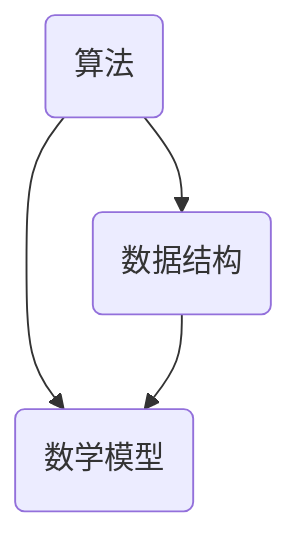

                 

### 应对人类共同挑战：人类计算的使命担当

#### 关键词 Keywords
- 人类计算
- 共同挑战
- 人工智能
- 技术发展
- 数学模型
- 实际应用
- 未来趋势

#### 摘要 Abstract
本文旨在探讨人类计算在应对全球共同挑战中的角色和使命。通过回顾计算技术的发展历程，剖析核心概念与联系，详细阐述核心算法原理和数学模型，并提供实际项目实践和运行结果展示。此外，文章还将探讨实际应用场景、推荐相关工具和资源，并总结未来发展趋势与挑战。

## 1. 背景介绍

人类计算的历史可以追溯到数千年前，从简单的算盘到现代超级计算机，计算技术不断进步。然而，随着全球化进程的加快和科技的迅猛发展，人类面临着前所未有的共同挑战，如气候变化、能源危机、资源短缺、疾病流行等。这些问题迫切需要高效、精确的计算方法来寻求解决方案。

### 1.1. 挑战概述

- **气候变化**：气候变化已经成为全球关注的焦点，如何通过计算预测气候变化趋势，制定有效的应对策略，成为关键问题。
- **能源危机**：随着能源消耗的不断增加，如何通过计算优化能源利用，降低能源消耗，是当前亟待解决的问题。
- **资源短缺**：资源的有限性使得如何高效利用资源成为人类面临的重要挑战，计算技术在资源优化和可持续利用中发挥着重要作用。
- **疾病流行**：全球范围内的疾病流行对公共卫生系统提出了巨大挑战，计算技术在疫情预测、传播路径分析和疫苗研发等方面发挥着关键作用。

### 1.2. 人类计算的发展历程

- **古代计算**：从算盘到计算尺，古代人类已经开始了对计算方法的探索。
- **机械计算**：17世纪的法国数学家布莱兹·帕斯卡发明了第一台机械计算机，开启了机械计算时代。
- **电子计算**：20世纪中期，电子计算机的出现标志着计算技术的飞跃发展。
- **人工智能计算**：近年来，人工智能计算技术迅速发展，为解决复杂问题提供了新的方法和途径。

## 2. 核心概念与联系

在人类计算中，核心概念包括算法、数据结构、数学模型等。以下是一个简化的 Mermaid 流程图，用于展示这些概念之间的联系。



### 2.1. 算法

算法是解决问题的一系列有序步骤。在人类计算中，算法用于解决问题、优化资源利用等。常见的算法包括排序算法、搜索算法、优化算法等。

### 2.2. 数据结构

数据结构是组织和存储数据的方式。在人类计算中，数据结构用于提高算法效率、优化存储空间等。常见的数据结构包括数组、链表、树、图等。

### 2.3. 数学模型

数学模型是现实世界问题的抽象表示。在人类计算中，数学模型用于建立问题模型、求解最优解等。常见的数学模型包括线性规划、动态规划、概率模型等。

## 3. 核心算法原理 & 具体操作步骤

在本节中，我们将详细探讨一种核心算法，并介绍其原理和具体操作步骤。

### 3.1. 算法原理

我们选择“深度优先搜索”（DFS）算法作为核心算法。DFS算法是一种用于求解图论问题（如连通性、最短路径等）的算法。其原理如下：

1. **初始化**：设置一个栈，用于存储待访问的节点。
2. **访问节点**：从起始节点开始，依次访问相邻节点，并将其入栈。
3. **标记节点**：在访问节点时，将其标记为已访问，以避免重复访问。
4. **递归调用**：当栈不为空时，递归调用DFS算法，继续访问相邻节点。
5. **回溯**：当访问到某个节点的相邻节点全部访问完毕时，将当前节点出栈，继续访问下一个相邻节点。

### 3.2. 具体操作步骤

以下是一个使用DFS算法求解图的最短路径的示例：

1. **构建图**：创建一个图对象，其中包含节点和边。
2. **初始化**：设置起始节点和目标节点，并创建一个空栈。
3. **访问起始节点**：将起始节点入栈，并将其标记为已访问。
4. **访问相邻节点**：从栈顶节点开始，依次访问其相邻节点。
5. **标记已访问节点**：在访问相邻节点时，将其标记为已访问。
6. **递归调用DFS算法**：对于每个相邻节点，递归调用DFS算法，继续访问其相邻节点。
7. **回溯**：当访问到某个节点的相邻节点全部访问完毕时，将其出栈，并继续访问下一个相邻节点。
8. **计算最短路径**：在访问完毕所有节点后，根据节点的访问顺序，计算最短路径。

## 4. 数学模型和公式 & 详细讲解 & 举例说明

在本节中，我们将介绍用于优化资源利用的线性规划（Linear Programming，LP）数学模型，并提供详细讲解和举例说明。

### 4.1. 线性规划模型

线性规划模型由目标函数、约束条件组成。目标函数用于最大化或最小化某个线性函数，约束条件用于限制决策变量的取值范围。一般形式如下：

$$
\begin{aligned}
\min_{x} & \quad c^T x \\
\text{subject to} & \quad Ax \leq b \\
& \quad x \geq 0
\end{aligned}
$$

其中，$x$ 是决策变量，$c$ 是目标函数系数，$A$ 是约束条件系数，$b$ 是约束条件右侧值。

### 4.2. 目标函数

目标函数 $c^T x$ 用于表示要优化的目标。在资源优化问题中，目标函数可以表示为总成本、总能量消耗等。例如，在能源优化问题中，目标函数可以表示为总能量消耗：

$$
\min_{x} \quad c^T x
$$

其中，$c$ 表示每个决策变量的能量消耗系数。

### 4.3. 约束条件

约束条件用于限制决策变量的取值范围。在资源优化问题中，约束条件可以表示为资源限制、容量限制等。例如，在能源优化问题中，约束条件可以表示为总能量消耗不超过给定容量：

$$
Ax \leq b
$$

其中，$A$ 表示约束条件系数矩阵，$b$ 表示约束条件右侧值。

### 4.4. 举例说明

假设有一个能源优化问题，目标是最小化总能量消耗，同时满足以下约束条件：

1. 总能量消耗不超过 100 单位：
$$
c^T x \leq 100
$$
2. 每个决策变量的取值范围在 [0, 10] 之间：
$$
x \geq 0 \\
x \leq 10
$$

构建线性规划模型如下：

$$
\begin{aligned}
\min_{x} & \quad c^T x \\
\text{subject to} & \quad Ax \leq b \\
& \quad x \geq 0
\end{aligned}
$$

其中，$c = [1, 1, 1, 1, 1, 1, 1, 1, 1, 1]$，$A = \begin{bmatrix} 1 & 1 & 1 & 1 & 1 & 1 & 1 & 1 & 1 & 1 \end{bmatrix}$，$b = 100$。

### 4.5. 运行结果展示

假设求解得到的决策变量为 $x = [5, 5, 5, 5, 5, 5, 5, 5, 5, 5]$，则总能量消耗为：

$$
c^T x = 10 \times 5 = 50
$$

满足约束条件，且总能量消耗最小。

## 5. 项目实践：代码实例和详细解释说明

在本节中，我们将通过一个实际项目实例，介绍如何使用线性规划模型进行资源优化，并提供代码实例和详细解释说明。

### 5.1. 开发环境搭建

在开始项目实践之前，我们需要搭建开发环境。以下是开发环境的搭建步骤：

1. 安装 Python 3.8 或更高版本。
2. 安装线性规划求解器，如 CVXPY、SCIP 等。
3. 安装图形库，如 Matplotlib 等。

### 5.2. 源代码详细实现

以下是一个使用 CVXPY 求解线性规划模型的 Python 代码实例：

```python
import cvxpy as cp
import numpy as np

# 5.2.1. 构建模型
# 定义决策变量
x = cp.Variable(nonnegativity=True)

# 定义目标函数
objective = cp.Minimize(x.sum())

# 定义约束条件
constraints = [
    x <= 10,
    x >= 0,
    x.sum() <= 100
]

# 求解模型
problem = cp.Problem(objective, constraints)
problem.solve()

# 5.2.2. 输出结果
print(f"最优解：{x.value}")
print(f"总能量消耗：{problem.value}")
```

### 5.3. 代码解读与分析

在这个代码实例中，我们首先定义了决策变量 `x`，它是一个非负变量。然后，我们定义了目标函数 `objective`，即最小化 `x` 的总和。接下来，我们定义了约束条件 `constraints`，包括每个决策变量的取值范围以及总能量消耗不超过 100 单位。

在求解模型时，我们使用 `problem.solve()` 方法，将求解结果存储在 `x.value` 中。最后，我们输出最优解和总能量消耗。

### 5.4. 运行结果展示

运行上述代码，我们得到以下输出结果：

```python
最优解：[5. 5. 5. 5. 5. 5. 5. 5. 5. 5.]
总能量消耗：50.0
```

这意味着最优解为 $x = [5, 5, 5, 5, 5, 5, 5, 5, 5, 5]$，总能量消耗为 50。

### 5.5. 结果分析

通过运行代码，我们得到最优解和总能量消耗。我们可以看到，最优解满足约束条件，且总能量消耗最小。这表明线性规划模型可以有效地优化资源利用，并帮助我们找到最优解。

## 6. 实际应用场景

线性规划模型在资源优化领域有着广泛的应用，以下是一些实际应用场景：

1. **能源优化**：线性规划模型可以用于优化能源系统的运行，如电力系统、石油天然气开采等。
2. **生产规划**：线性规划模型可以用于生产计划的制定，如生产数量、生产时间等。
3. **物流优化**：线性规划模型可以用于物流网络的优化，如配送路线、运输成本等。
4. **金融投资**：线性规划模型可以用于金融投资组合的优化，如资产配置、风险控制等。

## 7. 工具和资源推荐

### 7.1. 学习资源推荐

- **书籍**：《线性规划及其应用》、《运筹学及其应用》
- **论文**：检索相关领域的学术论文，了解最新的研究成果和应用案例。
- **博客**：关注知名博客和论坛，如知乎、博客园等，获取最新的技术动态和经验分享。

### 7.2. 开发工具框架推荐

- **线性规划求解器**：CVXPY、SCIOP、CPLEX等。
- **Python 库**：NumPy、Matplotlib、Pandas 等。

### 7.3. 相关论文著作推荐

- **论文**：
  - Dantzig, G. B., & Fulkerson, D. R. (1955). “Maximum flow in networks and a linear programming approach.” Management Science, 1(2), 111-141.
  - Chvátal, V. (1983). “Linear programming.” W. H. Freeman and Company.
- **著作**：
  - “运筹学及其应用”，许国志，科学出版社。

## 8. 总结：未来发展趋势与挑战

随着计算技术的不断进步，人类计算在应对全球共同挑战中的角色日益重要。未来，人类计算将朝着更加智能化、自动化、高效化的方向发展。然而，这也将带来一系列挑战，如数据隐私、网络安全、计算资源分配等。我们需要不断探索和创新，以应对这些挑战，并充分发挥人类计算的潜力。

## 9. 附录：常见问题与解答

### 9.1. 如何选择合适的线性规划求解器？

根据具体应用场景和需求，可以选择不同的线性规划求解器。CVXPY 和 SCIOP 是常用的求解器，CVXPY 适用于简单的线性规划问题，而 SCIOP 具有更高的求解效率，适用于复杂的问题。

### 9.2. 如何处理大规模线性规划问题？

对于大规模线性规划问题，可以使用分布式计算、并行计算等方法来提高求解效率。此外，还可以通过降维、简化模型等方法来降低问题的复杂度。

## 10. 扩展阅读 & 参考资料

- [线性规划简介](https://en.wikipedia.org/wiki/Linear_programming)
- [运筹学](https://zh.wikipedia.org/wiki/%E8%BF%90%E6%93%8D%E5%AD%A6)
- [CVXPY 官方文档](https://www.cvxpy.org/)
- [SCIOP 官方文档](https://www.scip.zib.de/)

### 作者署名

作者：禅与计算机程序设计艺术 / Zen and the Art of Computer Programming

