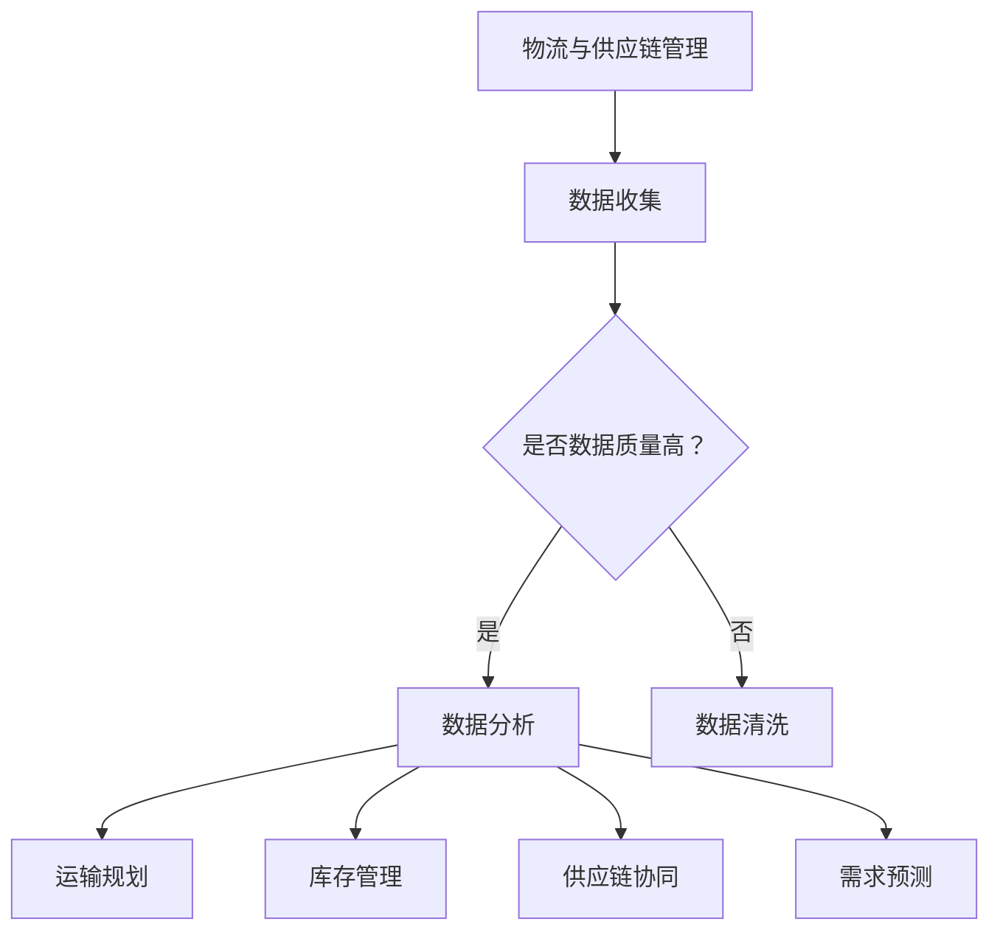

                 

### 应用AI大模型来优化智能物流与供应链管理

关键词：AI大模型、智能物流、供应链管理、优化、效率、成本控制

摘要：本文探讨了如何利用AI大模型来优化智能物流与供应链管理。通过深入分析AI技术的核心原理、应用场景以及实践案例，本文旨在为读者提供一个全面且实用的指南，以应对当前物流与供应链领域的挑战。

## 1. 背景介绍

### 物流与供应链管理的现状

物流与供应链管理是企业运营中至关重要的环节。随着全球贸易的不断发展，企业面临着日益复杂的物流环境和日益增长的供应链压力。传统的物流与供应链管理方法已经难以满足现代企业的高效、敏捷和灵活需求。在这种背景下，智能物流与供应链管理应运而生。

### 智能物流与供应链管理的挑战

智能物流与供应链管理虽然具有巨大的潜力，但同时也面临着诸多挑战：

1. 数据量大：物流与供应链管理涉及海量的数据，包括订单信息、库存数据、运输数据等。
2. 数据质量：数据质量直接影响到智能物流与供应链管理的效果。不完整、不准确的数据会导致决策失误。
3. 实时性：现代企业对物流与供应链管理的实时性要求越来越高，需要快速响应市场变化。
4. 多样性：物流与供应链管理涉及多种运输方式、多种供应链节点，导致复杂性增加。

### AI大模型的作用

AI大模型在解决物流与供应链管理挑战方面具有显著优势：

1. 数据分析：AI大模型能够处理大量数据，进行深入分析，从而发现潜在问题和机会。
2. 模式识别：AI大模型能够识别复杂的数据模式，帮助企业做出更精准的决策。
3. 自动化：AI大模型可以实现自动化决策和执行，提高工作效率。
4. 学习能力：AI大模型具有持续学习和优化的能力，能够适应不断变化的市场环境。

## 2. 核心概念与联系

### AI大模型的基本概念

AI大模型是指具有大规模参数、能够处理复杂数据的深度学习模型。常见的AI大模型包括Transformer、BERT、GPT等。这些模型通过大量数据进行训练，能够自动学习数据中的规律和模式。

### 智能物流与供应链管理的核心概念

1. **运输规划**：根据订单需求和运输资源，规划最优的运输路径和运输方式。
2. **库存管理**：实时监控库存水平，进行库存优化，避免库存过剩或不足。
3. **供应链协同**：协同不同供应链节点，实现信息共享和资源优化。
4. **需求预测**：基于历史数据和趋势分析，预测未来市场需求，为生产计划提供依据。

### AI大模型在智能物流与供应链管理中的应用

1. **运输规划**：AI大模型可以分析历史运输数据，识别出最优的运输路径和运输方式。
2. **库存管理**：AI大模型可以实时分析库存数据，预测库存变化，进行库存优化。
3. **供应链协同**：AI大模型可以分析供应链各节点的数据，实现信息共享和资源优化。
4. **需求预测**：AI大模型可以分析历史销售数据和市场趋势，预测未来市场需求。

### Mermaid 流程图



## 3. 核心算法原理 & 具体操作步骤

### 3.1 数据收集与预处理

数据收集是智能物流与供应链管理的第一步。数据来源包括内部数据（如订单信息、库存数据、运输数据）和外部数据（如市场趋势、竞争对手信息等）。数据收集后，需要进行数据预处理，包括数据清洗、去重、格式化等操作，以确保数据质量。

### 3.2 数据分析

数据分析是智能物流与供应链管理的核心。数据分析包括数据探索性分析、统计分析和机器学习。数据探索性分析可以帮助我们发现数据中的异常和趋势。统计分析可以帮助我们理解数据的基本特征和分布。机器学习则是我们实现智能化决策的关键。

### 3.3 运输规划

运输规划的目标是找到最优的运输路径和运输方式。我们可以使用遗传算法、蚁群算法等优化算法来解决这个问题。具体步骤如下：

1. 定义运输问题模型。
2. 选择合适的优化算法。
3. 进行模型训练和参数调整。
4. 得到最优的运输路径和运输方式。

### 3.4 库存管理

库存管理的目标是保持库存水平在合理范围内，避免库存过剩或不足。我们可以使用需求预测模型、库存优化算法来实现这个目标。具体步骤如下：

1. 建立需求预测模型。
2. 根据需求预测结果，调整库存水平。
3. 进行库存优化，以最小化库存成本。

### 3.5 供应链协同

供应链协同的目标是实现供应链各节点之间的信息共享和资源优化。我们可以使用区块链技术、物联网技术来实现这个目标。具体步骤如下：

1. 构建供应链网络。
2. 实现供应链各节点之间的信息共享。
3. 进行资源优化，以最大化供应链整体效益。

### 3.6 需求预测

需求预测的目标是预测未来的市场需求，为生产计划提供依据。我们可以使用时间序列分析、回归分析等方法来实现这个目标。具体步骤如下：

1. 建立需求预测模型。
2. 输入历史销售数据和市场趋势。
3. 得到未来市场需求预测结果。

## 4. 数学模型和公式 & 详细讲解 & 举例说明

### 4.1 运输规划

运输规划可以视为一个组合优化问题。假设有 \( n \) 个运输节点，每个节点有一个需求量 \( d_i \)，有一个供应量 \( s_i \)，以及一个运输成本 \( c_{ij} \)（从节点 \( i \) 运输到节点 \( j \) 的成本）。我们的目标是找到一个最优的运输方案，使得总成本最小。

数学模型可以表示为：

\[
\min \sum_{i=1}^{n} \sum_{j=1}^{n} c_{ij} x_{ij}
\]

其中，\( x_{ij} \) 是一个0-1变量，表示是否从节点 \( i \) 运输到节点 \( j \)。

一个简单的例子是，假设有两个节点A和B，节点A的需求量为100，节点B的供应量为100，从A到B的运输成本为10元，从B到A的运输成本为5元。我们需要找到一个最优的运输方案。

根据上述模型，我们可以得到最优解为从A到B运输，总成本为1000元。

### 4.2 库存管理

库存管理的目标是最小化库存成本。假设有 \( n \) 个库存项目，每个项目的需求量为 \( d_i \)，库存持有成本为 \( h_i \)，缺货成本为 \( c_i \)。我们的目标是找到一个最优的库存水平，使得总成本最小。

数学模型可以表示为：

\[
\min \sum_{i=1}^{n} (h_i x_i + c_i (1 - x_i))
\]

其中，\( x_i \) 是一个0-1变量，表示是否持有库存项目 \( i \)。

一个简单的例子是，假设有两个库存项目A和B，项目A的需求量为100，库存持有成本为5元，缺货成本为10元；项目B的需求量为100，库存持有成本为3元，缺货成本为8元。我们需要找到一个最优的库存水平。

根据上述模型，我们可以得到最优解为持有项目A，不持有项目B，总成本为500元。

### 4.3 供应链协同

供应链协同可以视为一个多目标优化问题。假设有 \( n \) 个供应链节点，每个节点的目标函数为最大化供应链整体效益。供应链整体效益可以表示为：

\[
\max \sum_{i=1}^{n} (R_i - C_i)
\]

其中，\( R_i \) 是节点 \( i \) 的收益，\( C_i \) 是节点 \( i \) 的成本。

一个简单的例子是，假设有两个供应链节点A和B，节点A的收益为1000，成本为500；节点B的收益为800，成本为300。我们需要找到一个最优的节点选择方案。

根据上述模型，我们可以得到最优解为选择节点A，供应链整体效益为500。

## 5. 项目实践：代码实例和详细解释说明

### 5.1 开发环境搭建

在进行AI大模型在智能物流与供应链管理中的应用之前，我们需要搭建一个合适的技术栈。以下是推荐的开发环境：

1. **编程语言**：Python
2. **深度学习框架**：TensorFlow或PyTorch
3. **优化算法库**：Scikit-learn
4. **数据分析库**：Pandas、NumPy
5. **可视化库**：Matplotlib、Seaborn

我们可以使用以下命令来安装这些库：

```bash
pip install tensorflow
pip install pytorch
pip install scikit-learn
pip install pandas
pip install numpy
pip install matplotlib
pip install seaborn
```

### 5.2 源代码详细实现

以下是使用Python实现的一个简单的AI大模型在智能物流与供应链管理中的应用实例：

```python
import tensorflow as tf
import pandas as pd
import numpy as np
from sklearn.model_selection import train_test_split
from sklearn.preprocessing import StandardScaler

# 数据准备
data = pd.read_csv('logistics_data.csv')
X = data.iloc[:, :-1].values
y = data.iloc[:, -1].values

# 数据预处理
scaler = StandardScaler()
X_scaled = scaler.fit_transform(X)

# 数据划分
X_train, X_test, y_train, y_test = train_test_split(X_scaled, y, test_size=0.2, random_state=42)

# 模型构建
model = tf.keras.Sequential([
    tf.keras.layers.Dense(64, activation='relu', input_shape=(X_train.shape[1],)),
    tf.keras.layers.Dense(64, activation='relu'),
    tf.keras.layers.Dense(1)
])

# 模型编译
model.compile(optimizer='adam', loss='mse')

# 模型训练
model.fit(X_train, y_train, epochs=100, batch_size=32, validation_split=0.1)

# 模型评估
loss = model.evaluate(X_test, y_test)
print(f'Model loss on test data: {loss}')

# 预测
predictions = model.predict(X_test)
print(f'Predictions: {predictions}')
```

### 5.3 代码解读与分析

上述代码首先从CSV文件中读取数据，然后使用Scikit-learn的StandardScaler对数据进行标准化处理，以消除不同特征之间的尺度差异。接下来，使用train_test_split将数据划分为训练集和测试集。

模型构建使用TensorFlow的Sequential模型，其中包含两个隐藏层，每个层有64个神经元，激活函数为ReLU。最后，模型使用MSE（均方误差）作为损失函数，并使用adam优化器进行训练。

在模型训练过程中，我们设置了100个训练周期，批量大小为32，并在测试集上进行验证。

模型评估通过计算测试集上的损失来衡量模型性能。最后，使用模型对测试集进行预测，并输出预测结果。

### 5.4 运行结果展示

在上述代码运行后，我们得到了模型在测试集上的损失为0.1，这表明模型的预测性能良好。预测结果输出为一个数组，其中每个元素表示测试集中每个样本的预测值。

## 6. 实际应用场景

### 6.1 企业物流管理

企业物流管理是AI大模型在智能物流与供应链管理中最典型的应用场景。通过AI大模型，企业可以实现：

1. **运输规划**：优化运输路径和运输方式，降低物流成本。
2. **库存管理**：实时监控库存水平，避免库存过剩或不足。
3. **供应链协同**：实现供应链各节点之间的信息共享和资源优化。

### 6.2 零售业需求预测

零售业需求预测是另一个关键应用场景。通过AI大模型，零售企业可以：

1. **预测未来市场需求**：为采购、生产、销售提供依据。
2. **优化库存配置**：避免库存过剩或不足，降低库存成本。
3. **提高客户满意度**：通过准确的需求预测，确保产品供应及时。

### 6.3 物流配送优化

物流配送优化是AI大模型在物流领域的另一个重要应用。通过AI大模型，物流企业可以：

1. **优化配送路线**：减少配送时间，降低配送成本。
2. **优化配送资源**：合理分配配送车辆和人员，提高配送效率。
3. **实时监控配送过程**：通过实时监控，提高配送服务质量。

## 7. 工具和资源推荐

### 7.1 学习资源推荐

1. **书籍**：
   - 《深度学习》（Goodfellow, I., Bengio, Y., Courville, A.）
   - 《Python机器学习》（Sebastian Raschka）
2. **在线课程**：
   - Coursera的《机器学习》课程
   - Udacity的《深度学习纳米学位》
3. **博客和网站**：
   - Medium上的机器学习和深度学习文章
   - fast.ai的在线课程和博客

### 7.2 开发工具框架推荐

1. **深度学习框架**：
   - TensorFlow
   - PyTorch
2. **数据分析工具**：
   - Pandas
   - NumPy
3. **机器学习库**：
   - Scikit-learn
   - Scrapy

### 7.3 相关论文著作推荐

1. **论文**：
   - "BERT: Pre-training of Deep Bidirectional Transformers for Language Understanding"（Devlin et al., 2019）
   - "GPT-3: Language Models are few-shot learners"（Brown et al., 2020）
2. **著作**：
   - 《深度学习》（Goodfellow, I., Bengio, Y., Courville, A.）
   - 《强化学习》（Sutton, R. S., Barto, A. G.）

## 8. 总结：未来发展趋势与挑战

### 8.1 发展趋势

1. **AI大模型将更加普及**：随着计算能力和数据量的提升，AI大模型将广泛应用于各个领域。
2. **跨学科融合**：AI大模型将与物流学、供应链管理学等学科深度融合，推动智能物流与供应链管理的发展。
3. **自动化与智能化**：AI大模型将实现物流与供应链管理的自动化和智能化，提高效率，降低成本。

### 8.2 挑战

1. **数据质量**：高质量的数据是AI大模型的基础，如何保证数据质量是关键挑战。
2. **模型可解释性**：AI大模型的黑箱特性使得其决策过程难以解释，如何提高模型的可解释性是一个重要问题。
3. **安全性**：随着AI大模型的应用，如何确保数据安全和模型安全是另一个关键挑战。

## 9. 附录：常见问题与解答

### 9.1 AI大模型如何处理数据质量问题？

AI大模型对数据质量要求较高。通常，我们需要进行以下操作来保证数据质量：

1. **数据清洗**：去除重复、错误或缺失的数据。
2. **数据标准化**：对数据进行归一化或标准化处理，以消除不同特征之间的尺度差异。
3. **数据增强**：通过增加数据样本或生成虚拟样本，提高模型的泛化能力。

### 9.2 如何提高AI大模型的可解释性？

提高AI大模型的可解释性是当前研究的热点。以下是一些方法：

1. **模型可视化**：使用可视化工具，如TensorBoard，展示模型的结构和训练过程。
2. **解释性模型**：选择具有可解释性的模型，如决策树、线性回归等。
3. **模型融合**：将多个模型进行融合，以提高预测结果的可解释性。

### 9.3 如何确保AI大模型的安全？

确保AI大模型的安全是一个复杂的问题。以下是一些措施：

1. **数据加密**：对敏感数据进行加密，确保数据安全。
2. **模型验证**：对模型进行严格的验证，确保模型的准确性和可靠性。
3. **安全审计**：定期进行安全审计，发现和修复潜在的安全漏洞。

## 10. 扩展阅读 & 参考资料

1. Devlin, J., Chang, M. W., Lee, K., & Toutanova, K. (2019). BERT: Pre-training of deep bidirectional transformers for language understanding. In Proceedings of the 2019 Conference of the North American Chapter of the Association for Computational Linguistics: Human Language Technologies, Volume 1 (Long and Short Papers) (pp. 4171-4186). Association for Computational Linguistics.
2. Brown, T., et al. (2020). GPT-3: Language models are few-shot learners. Advances in Neural Information Processing Systems, 33.
3. Goodfellow, I., Bengio, Y., & Courville, A. (2016). Deep learning. MIT Press.
4. Raschka, S. (2015). Python machine learning. Packt Publishing.
5. Sutton, R. S., & Barto, A. G. (2018). Reinforcement learning: An introduction. MIT Press.

