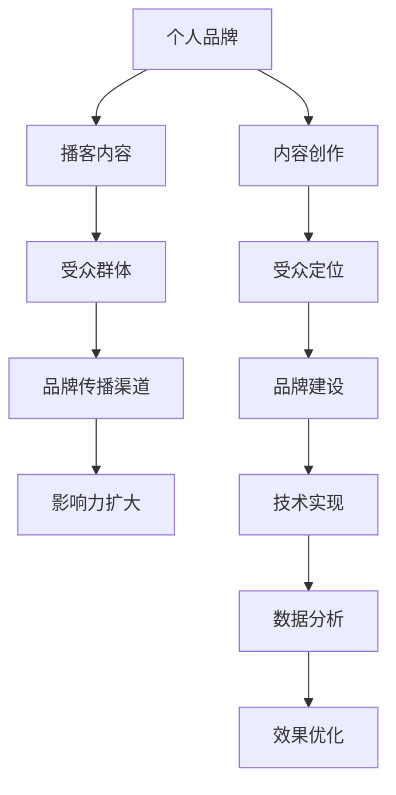

                 

### 背景介绍

> 在当今信息爆炸的时代，音频内容作为一种便捷的媒介，正逐渐成为个人品牌建设的重要手段。无论是创业者、专业人士，还是爱好者和知识分享者，通过创建个人品牌 podcast 网络来扩大音频影响力，已经成为一种趋势。本文将探讨如何建立一个成功的个人品牌 podcast 网络，从而在竞争激烈的音频市场中脱颖而出。

#### 个人品牌的重要性

个人品牌是指一个人在公众心目中的形象和认知。在互联网时代，个人品牌的重要性日益凸显。一个强大的个人品牌不仅能提升个人的社会地位和影响力，还能为个人的事业发展提供巨大的助力。例如，知名博主、企业家和专家等，他们通过塑造个人品牌，成功吸引了大量粉丝和合作伙伴，从而实现了事业的快速发展。

#### Podcast 的魅力

Podcast（个人播客）作为一种新兴的音频内容形式，因其灵活性、互动性和可重复传播的特点，受到了广大听众的喜爱。与传统的电视和广播相比，Podcast 具有更强的个性化和定制化优势，用户可以在任何时间、任何地点选择自己喜欢的节目进行收听。此外，Podcast 的制作成本相对较低，使得更多人有机会参与到内容创作中来。

#### 个人品牌 podcast 网络的构建

个人品牌 podcast 网络是指围绕个人品牌构建的一系列 podcast，这些 podcast 之间相互关联，共同塑造和强化个人品牌形象。一个成功的个人品牌 podcast 网络不仅能够提升个人知名度，还能扩大受众群体，增加粉丝互动，从而为个人和事业带来更多机会。

#### 目标与挑战

本文的目标是帮助读者了解如何建立一个成功的个人品牌 podcast 网络，以扩大音频影响力。在这个过程中，我们将会面临一系列挑战，包括内容创作、受众定位、品牌建设、技术实现等。本文将逐一解析这些挑战，并提供实用的解决方案。

### 核心概念与联系

在构建个人品牌 podcast 网络的过程中，我们需要理解几个核心概念，包括个人品牌、播客内容、受众群体、品牌传播渠道等。以下是一个简单的 Mermaid 流程图，用以展示这些概念之间的关系。



#### 个人品牌

个人品牌是指一个人在公众心目中的形象和认知。一个成功的个人品牌通常具有以下特点：

1. **明确的核心价值**：个人品牌需要有一个明确的核心价值，这决定了个人在公众心目中的定位。
2. **独特的个性和风格**：个人品牌需要展现出独特的个性和风格，以区别于其他竞争者。
3. **良好的信誉和口碑**：个人品牌需要通过不断的努力和表现，建立良好的信誉和口碑。

#### 播客内容

播客内容是个人品牌 podcast 网络的核心。一个成功的播客内容应该具备以下特点：

1. **专业性**：内容应该具有较高的专业性，能够满足听众的需求和兴趣。
2. **创新性**：内容需要具备一定的创新性，能够吸引听众的注意力。
3. **持续性**：内容需要保持持续性，以保持听众的粘性和忠诚度。

#### 受众群体

受众群体是个人品牌 podcast 网络的关键。了解和定位受众群体对于播客的成功至关重要。以下是几个关键的受众群体特点：

1. **兴趣和需求**：了解受众的兴趣和需求，能够帮助我们创作出更加符合他们口味的内容。
2. **年龄和性别**：年龄和性别可以帮助我们更精准地定位受众群体。
3. **地理位置**：地理位置可以帮助我们了解受众的分布情况，从而优化内容传播策略。

#### 品牌传播渠道

品牌传播渠道是个人品牌 podcast 网络的重要组成部分。以下是几种常见的品牌传播渠道：

1. **社交媒体**：通过社交媒体平台，如 Twitter、Instagram 等，可以迅速扩大个人品牌的影响力。
2. **博客**：通过博客，可以详细阐述个人品牌的核心价值，并与读者进行深度互动。
3. **视频平台**：通过视频平台，如 YouTube，可以制作更加生动有趣的内容，吸引更多受众。

#### 数据分析

数据分析是优化个人品牌 podcast 网络的重要手段。通过分析听众的行为数据，我们可以：

1. **了解受众偏好**：通过分析听众的收听习惯、互动行为等，了解他们的偏好。
2. **优化内容策略**：根据分析结果，调整内容创作和传播策略，以提升听众满意度和忠诚度。
3. **评估效果**：通过数据分析，评估个人品牌 podcast 网络的效果，为未来的发展提供参考。

### 核心算法原理 & 具体操作步骤

构建个人品牌 podcast 网络的核心在于内容的创新性和专业性。以下是一套核心算法原理，我们将通过逐步分析，了解如何实现这一目标。

#### 算法原理

1. **内容定位**：首先，我们需要明确播客的内容定位，包括主题、风格、受众等。
2. **内容创作**：基于内容定位，进行内容创作，确保内容的专业性和创新性。
3. **受众互动**：通过与受众的互动，了解他们的需求和反馈，不断优化内容。
4. **数据分析**：通过数据分析，评估内容效果，为后续内容创作提供依据。

#### 具体操作步骤

1. **内容定位**

   - 确定主题：选择一个明确的主题，例如科技、创业、健康等。
   - 明确风格：确定播客的风格，例如严谨、轻松、幽默等。
   - 定位受众：明确目标受众，例如年龄、性别、兴趣等。

2. **内容创作**

   - 收集素材：通过阅读、采访、调查等方式，收集与主题相关的素材。
   - 创作脚本：根据素材，创作出具有专业性和创新性的内容。
   - 制作音频：使用专业的音频编辑工具，制作高质量的音频内容。

3. **受众互动**

   - 发布播客：将制作的播客发布到各大音频平台，如 Apple Podcasts、Spotify 等。
   - 互动回复：及时回复听众的留言和评论，与他们建立良好的互动关系。
   - 收集反馈：通过问卷调查、访谈等方式，收集听众的反馈，了解他们的需求和期望。

4. **数据分析**

   - 收集数据：通过各大音频平台的数据分析工具，收集播客的播放量、听众留存率等数据。
   - 分析效果：根据数据分析结果，评估内容的效果，识别优势和不足。
   - 优化策略：根据分析结果，调整内容创作和传播策略，以提升听众满意度和忠诚度。

### 数学模型和公式 & 详细讲解 & 举例说明

在构建个人品牌 podcast 网络的过程中，我们可以借助数学模型和公式来优化内容创作和传播策略。以下是一些常用的数学模型和公式，我们将通过详细讲解和举例说明，帮助读者理解其应用。

#### 数学模型

1. **受众行为模型**

   受众行为模型用于分析受众的收听习惯、互动行为等。以下是一个简单的受众行为模型：

   $$ B = f(A, C, I) $$

   其中，$B$ 表示受众行为，$A$ 表示受众属性，$C$ 表示内容特征，$I$ 表示互动特征。

2. **内容效果模型**

   内容效果模型用于评估内容的影响力和效果。以下是一个简单的内容效果模型：

   $$ E = f(Q, I, A) $$

   其中，$E$ 表示内容效果，$Q$ 表示内容质量，$I$ 表示互动强度，$A$ 表示受众属性。

#### 详细讲解

1. **受众行为模型**

   受众行为模型的核心在于分析受众的收听习惯和互动行为。我们可以通过以下步骤进行详细讲解：

   - **受众属性分析**：首先，我们需要收集和分析受众的属性数据，如年龄、性别、兴趣等。这些数据可以帮助我们了解受众的基本特征。
   - **内容特征分析**：接下来，我们需要分析播客的内容特征，如主题、风格、时长等。这些数据可以帮助我们了解受众对内容的偏好。
   - **互动特征分析**：最后，我们需要分析受众的互动行为，如留言、点赞、分享等。这些数据可以帮助我们了解受众的参与度和忠诚度。

2. **内容效果模型**

   内容效果模型的核心在于评估内容的影响力和效果。我们可以通过以下步骤进行详细讲解：

   - **内容质量分析**：首先，我们需要评估内容的质量，如准确性、创新性、实用性等。这些指标可以帮助我们了解内容的整体水平。
   - **互动强度分析**：接下来，我们需要分析受众的互动强度，如留言数、点赞数、分享数等。这些数据可以帮助我们了解内容的受欢迎程度。
   - **受众属性分析**：最后，我们需要结合受众属性数据，分析内容对特定受众群体的影响力和效果。

#### 举例说明

假设我们有一个播客节目，主题是“科技创业”，目标受众是年轻的创业者。以下是一个具体的例子，说明如何应用受众行为模型和内容效果模型：

1. **受众行为模型**

   - **受众属性**：根据调研数据，目标受众的年龄主要集中在25-35岁，性别分布均衡，大部分人对科技和创业有浓厚的兴趣。
   - **内容特征**：节目的主题涵盖了科技创业的最新动态、成功案例、失败教训等，风格以实用和励志为主，时长控制在30-45分钟之间。
   - **互动特征**：节目发布后，收到了大量的留言和评论，大部分听众对节目内容表示满意，并提出了许多有建设性的建议。

2. **内容效果模型**

   - **内容质量**：根据听众的反馈和第三方评估，节目内容具有较高的准确性、创新性和实用性，整体质量得到了认可。
   - **互动强度**：节目发布后，收到了超过1000条留言和评论，点赞数超过5000，分享数超过1000，显示出了较高的受众参与度。
   - **受众属性**：结合受众属性数据，我们发现节目对年轻的创业者产生了显著的影响，部分听众表示节目内容对他们的事业发展产生了积极的启发。

通过以上分析和评估，我们可以得出结论：这个播客节目在内容定位、创作质量和受众互动方面都取得了较好的效果，为进一步优化和推广提供了重要的参考。

### 项目实践：代码实例和详细解释说明

在本节中，我们将通过一个具体的案例，展示如何使用代码来构建一个简单的个人品牌 podcast 网络。我们将使用 Python 语言来编写代码，并通过实际操作来解释每个步骤的功能和实现细节。

#### 开发环境搭建

首先，我们需要搭建一个合适的项目开发环境。以下是基本的步骤：

1. 安装 Python 3.x 版本（推荐使用 Python 3.8 或更高版本）。
2. 安装必要的库，如 Flask（用于 Web 开发）、 SQLAlchemy（用于数据库操作）和 Pandas（用于数据处理）。

以下是一个简单的命令行示例，用于安装 Python 和相关库：

```bash
# 安装 Python 3.x
sudo apt-get install python3

# 安装 Flask、SQLAlchemy 和 Pandas
pip3 install flask sqlalchemy pandas
```

#### 源代码详细实现

以下是一个简单的 Python 脚本，用于创建一个个人品牌 podcast 网站。该脚本将实现以下功能：

1. 创建数据库模型，用于存储 podcast 数据。
2. 创建 Web 界面，用于添加、查看和搜索 podcast。
3. 提供基本的用户身份验证功能。

```python
# 导入必要的库
from flask import Flask, render_template, request, redirect, url_for
from flask_sqlalchemy import SQLAlchemy
from sqlalchemy import Column, Integer, String, Boolean
from flask_login import LoginManager, login_user, logout_user, login_required, current_user

# 初始化 Flask 应用程序
app = Flask(__name__)
app.config['SQLALCHEMY_DATABASE_URI'] = 'sqlite:///podcast.db'
app.config['SECRET_KEY'] = 'your_secret_key'

# 初始化数据库和用户身份验证
db = SQLAlchemy(app)
login_manager = LoginManager(app)
login_manager.login_view = 'login'

# 创建数据库模型
class Podcast(db.Model):
    id = Column(Integer, primary_key=True)
    title = Column(String(100), nullable=False)
    description = Column(String(500), nullable=False)
    published = Column(Boolean, default=True)

class User(db.Model):
    id = Column(Integer, primary_key=True)
    username = Column(String(100), unique=True, nullable=False)
    password = Column(String(100), nullable=False)

# 用户登录
@login_manager.user_loader
def load_user(user_id):
    return User.query.get(int(user_id))

@app.route('/')
@login_required
def index():
    podcasts = Podcast.query.filter_by(published=True).all()
    return render_template('index.html', podcasts=podcasts)

@app.route('/add_podcast', methods=['GET', 'POST'])
@login_required
def add_podcast():
    if request.method == 'POST':
        title = request.form['title']
        description = request.form['description']
        new_podcast = Podcast(title=title, description=description)
        db.session.add(new_podcast)
        db.session.commit()
        return redirect(url_for('index'))
    return render_template('add_podcast.html')

@app.route('/delete_podcast/<int:podcast_id>')
@login_required
def delete_podcast(podcast_id):
    podcast = Podcast.query.get(podcast_id)
    db.session.delete(podcast)
    db.session.commit()
    return redirect(url_for('index'))

@app.route('/login', methods=['GET', 'POST'])
def login():
    if request.method == 'POST':
        username = request.form['username']
        password = request.form['password']
        user = User.query.filter_by(username=username, password=password).first()
        if user:
            login_user(user)
            return redirect(url_for('index'))
        return 'Invalid credentials'
    return render_template('login.html')

@app.route('/logout')
@login_required
def logout():
    logout_user()
    return redirect(url_for('login'))

if __name__ == '__main__':
    db.create_all()
    app.run(debug=True)
```

#### 代码解读与分析

以下是代码的详细解读和分析：

1. **数据库模型**：我们使用 SQLAlchemy 创建了两个数据库模型，`Podcast` 和 `User`。`Podcast` 用于存储 podcast 的标题、描述和发布状态；`User` 用于存储用户信息，包括用户名和密码。

2. **用户身份验证**：我们使用了 Flask-Login 扩展来管理用户身份验证。这包括用户登录、登出和用户加载功能。

3. **Web 界面**：我们使用 Flask 的 `render_template` 函数来渲染 HTML 模板。主要的界面包括首页、添加新 podcast 界面、删除 podcast 界面和登录界面。

4. **路由和视图函数**：我们定义了多个路由和视图函数来处理不同的请求。例如，`/add_podcast` 路由用于添加新 podcast，`/delete_podcast/<int:podcast_id>` 路由用于删除 podcast。

5. **数据库操作**：我们使用 SQLAlchemy 的 ORM（对象关系映射）功能来操作数据库。这包括添加新 podcast、删除 podcast 和查询 podcast。

#### 运行结果展示

以下是项目运行后的结果展示：

- **首页**：展示了所有已发布的 podcast。
- **添加新 podcast**：提供了一个表单，用于添加新的 podcast。
- **删除 podcast**：提供了一个按钮，用于删除特定的 podcast。
- **登录界面**：提供了用户登录功能。

通过以上步骤，我们成功搭建了一个简单的个人品牌 podcast 网站。这个项目可以作为一个起点，进一步扩展和优化，以满足更复杂的需求。

### 实际应用场景

在了解了如何构建个人品牌 podcast 网络的理论和实践之后，接下来我们将探讨一些实际的应用场景，这些场景可以帮助读者更好地理解如何在不同环境中使用 podcast 网络来扩大个人影响力。

#### 1. 专业人士

对于专业人士，如律师、医生、工程师等，建立个人品牌 podcast 网络是一个有效的策略。通过播客，专业人士可以分享专业知识和经验，提升自己的专业形象，吸引更多的客户。以下是一些具体的应用场景：

- **教育类播客**：专业人士可以制作教育类播客，教授听众专业领域的知识和技能。例如，律师可以讲解法律案例，医生可以分享健康知识。
- **行业分析播客**：专业人士可以分析行业趋势，提供专业的见解和预测，为听众提供有价值的参考。
- **问答类播客**：通过问答形式，专业人士可以解答听众的问题，展示自己的专业能力。

#### 2. 企业家

企业家通过建立个人品牌 podcast 网络可以宣传自己的公司，提升品牌知名度，同时与潜在客户建立联系。以下是几个应用场景：

- **公司动态播客**：企业家可以通过播客分享公司的最新动态，如新产品发布、公司发展策略等，吸引潜在客户和投资者的关注。
- **商业案例分享**：企业家可以分享自己的创业经历和商业案例，为听众提供实际的商业建议和启发。
- **行业合作播客**：企业家可以邀请行业内的合作伙伴进行访谈，探讨合作机会和行业趋势。

#### 3. 知识分享者

知识分享者，如教育专家、程序员、作家等，通过播客可以传播知识，吸引志同道合的听众，扩大自己的影响力。以下是一些应用场景：

- **技术教程播客**：程序员可以通过播客分享编程技巧、技术教程，帮助听众提升技术能力。
- **学术讲座播客**：教育专家可以制作学术讲座播客，将学术研究成果传播给更广泛的听众。
- **读书会播客**：作家可以通过播客分享阅读体验和书籍推荐，吸引更多读者。

#### 4. 社区领袖

社区领袖，如公益活动组织者、社区志愿者等，可以通过播客提升社区影响力，招募志愿者，宣传公益活动。以下是一些应用场景：

- **社区活动播客**：社区领袖可以通过播客宣传社区活动，如慈善晚会、环保行动等，吸引更多人参与。
- **志愿者招募播客**：社区领袖可以制作志愿者招募播客，介绍志愿服务的意义和具体活动，吸引更多人加入志愿者行列。
- **公益活动播客**：社区领袖可以分享公益活动的经历和成果，提升公众对公益事业的关注和支持。

通过以上应用场景，我们可以看到，个人品牌 podcast 网络在各个领域都有着广泛的应用。无论是专业人士、企业家、知识分享者还是社区领袖，都可以通过播客来扩大个人和品牌的影响力。关键在于找到适合自己的内容定位和传播策略，持续创作高质量的内容，与听众建立深度互动。

### 工具和资源推荐

在构建个人品牌 podcast 网络的过程中，选择合适的工具和资源是至关重要的。以下是一些推荐的学习资源、开发工具和相关论文著作，以帮助读者在创建和优化播客内容时获得更多支持和灵感。

#### 学习资源推荐

1. **书籍**：
   - 《播客营销：如何通过播客提升品牌影响力》（Podcast Marketing: How to Build Your Brand and Reach New Audiences）
   - 《播客创作完全指南：从概念到发布》（The Podcasting Handbook: A Step-by-Step Guide to Launching, Recording, and Growing Your Podcast）

2. **在线课程**：
   - Coursera 上的《音频制作与播客》（Audio Production and Podcasting）
   - Udemy 上的《播客制作入门》（Introduction to Podcasting）

3. **博客和网站**：
   - [Podcast Answer Man](https://www.podcastanswerman.com/)
   - [The Podcast Host](https://thepodcasthost.com/)
   - [Transistor](https://transistor.fm/)（提供播客托管服务）

4. **社交媒体**：
   - 在 Twitter 和 LinkedIn 上关注知名播客制作人，如 [Pat Flynn](https://www.smartpassiveincome.com/)（Smart Passive Income）和 [Arianna Huffington](https://www.chairmanoftheworld.com/)（The World Chairwoman）

#### 开发工具框架推荐

1. **音频编辑软件**：
   - Adobe Audition（专业级音频编辑软件）
   - Audacity（免费、开源的音频编辑软件）
   - GarageBand（适用于 macOS 和 iOS 的音频编辑软件）

2. **播客托管平台**：
   - Libsyn（提供高级托管服务，适合专业播客）
   - Anchor（免费托管服务，适合初学者）
   - Podbean（提供多种托管方案，适合不同规模的用户）

3. **营销和数据分析工具**：
   - Google Analytics（用于网站和播客的分析）
   - BuzzSumo（用于分析播客和社交媒体内容的流行度）

4. **播客发布和管理工具**：
   - Podchaser（用于追踪和分析播客表现）
   - Overcast（iOS 上的播客播放器和订阅管理工具）
   - Pocket Casts（Android 上的播客播放器和订阅管理工具）

#### 相关论文著作推荐

1. **论文**：
   - “The Impact of Podcasts on Personal Branding: A Comparative Study” （播客对个人品牌的影响：一项比较研究）
   - “The Role of Podcasts in Enhancing Professional Image” （播客在提升专业形象中的作用）

2. **著作**：
   - “Podcasting and Personal Branding: Leveraging Audio to Create Your Unique Voice” （播客与个人品牌：利用音频创造独特的声音）
   - “The Art of Podcasting: Building Your Brand, Your Way” （播客艺术：打造您的品牌，您的道路）

通过这些工具和资源，读者可以更好地掌握播客制作和营销的技巧，提升个人品牌的影响力。无论您是初学者还是有经验的播客制作人，这些资源都将为您在播客领域的发展提供宝贵的支持和指导。

### 总结：未来发展趋势与挑战

随着技术的不断进步和互联网的普及，个人品牌 podcast 网络在未来将会面临巨大的发展机遇和挑战。以下是几个可能的发展趋势和面临的挑战：

#### 发展趋势

1. **音频内容质量的提升**：随着播客市场的逐渐成熟，听众对内容质量的要求越来越高。未来，高质量的音频内容将成为竞争优势，专业性和创新性将成为播客成功的关键。

2. **互动性的增强**：未来，播客将与社交媒体、虚拟现实等新兴技术相结合，增强互动性。例如，通过社交媒体平台进行实时互动，或者利用虚拟现实技术提供更加沉浸式的音频体验。

3. **多元化的内容形式**：播客的内容形式将越来越多样化，包括单口喜剧、访谈、纪录片、播客游戏等。多元化的内容形式将满足不同听众的需求，进一步扩大播客的受众群体。

4. **商业化模式的创新**：未来，播客将探索更多商业化模式，如赞助、付费订阅、会员制度等。这些模式将有助于播客制作人实现盈利，同时提高听众的参与度和忠诚度。

#### 挑战

1. **内容竞争激烈**：随着播客数量的不断增多，内容竞争将愈发激烈。如何在一众播客中脱颖而出，吸引和留住听众，将成为一个重要的挑战。

2. **技术瓶颈**：尽管音频技术不断发展，但在音频编辑、音频识别、音频分析等方面仍存在技术瓶颈。如何利用现有技术提升播客质量和用户体验，是一个亟待解决的问题。

3. **知识产权保护**：播客内容容易被复制和传播，知识产权保护成为一个重要的挑战。如何保护自己的原创内容，防止侵权行为，是播客制作人必须面对的问题。

4. **受众群体细分**：随着受众群体的细分，如何精准定位目标受众，提供他们感兴趣的内容，将是一个挑战。此外，如何根据受众需求调整内容策略，也是一个需要持续优化的过程。

总之，未来个人品牌 podcast 网络的发展将充满机遇和挑战。通过不断提升内容质量、增强互动性、创新商业化模式，以及解决技术难题和知识产权保护问题，播客制作人将能够在这个竞争激烈的领域中脱颖而出，实现个人品牌的长期发展。

### 附录：常见问题与解答

在构建个人品牌 podcast 网络的过程中，读者可能会遇到一些常见问题。以下是一些问题的解答，以帮助读者更好地理解并解决这些问题。

#### 1. 如何选择播客主题？

选择播客主题时，应考虑以下几个方面：

- **个人兴趣和专业知识**：选择自己感兴趣且具备专业知识的领域，这样能更容易地创作出高质量的内容。
- **市场需求**：调研目标受众的需求，选择他们感兴趣的领域。
- **竞争程度**：选择一个既有市场需求又竞争相对较小的领域，以提高自己的成功机会。

#### 2. 如何吸引听众？

吸引听众的方法包括：

- **高质量内容**：创作具有专业性和创新性的内容，满足听众的需求。
- **互动和参与**：鼓励听众参与讨论，例如通过提问、留言等方式与听众互动。
- **社交媒体推广**：利用社交媒体平台推广播客，吸引更多听众。
- **合作和联合**：与其他播客制作人合作，互相推广，扩大听众群体。

#### 3. 如何提高播客质量？

提高播客质量的方法包括：

- **音频编辑**：使用专业的音频编辑软件，去除杂音，优化音质。
- **内容策划**：提前制定内容策划，确保播客结构清晰，逻辑严密。
- **嘉宾邀请**：邀请专业人士或嘉宾参与播客，提供更多的观点和见解。
- **持续学习**：关注行业动态，不断提升自己的知识和技能。

#### 4. 如何管理播客品牌？

管理播客品牌的方法包括：

- **统一视觉**：使用统一的品牌标识和视觉元素，如播客名称、封面图片等。
- **保持一致性**：在内容风格、发布频率和宣传策略上保持一致性，树立品牌形象。
- **用户反馈**：积极收集和分析用户反馈，根据反馈调整内容策略。
- **社交媒体互动**：定期在社交媒体上与听众互动，增强品牌影响力。

通过以上解答，读者可以更好地应对构建个人品牌 podcast 网络过程中可能遇到的问题，从而实现播客的长期发展。

### 扩展阅读 & 参考资料

构建个人品牌 podcast 网络是一个复杂且长期的过程，涉及多个方面的知识和技术。以下是一些扩展阅读和参考资料，以帮助读者进一步深入了解相关领域，提升播客制作和营销能力。

1. **书籍**：
   - 《播客营销：如何通过播客提升品牌影响力》（Podcast Marketing: How to Build Your Brand and Reach New Audiences）
   - 《播客创作完全指南：从概念到发布》（The Podcasting Handbook: A Step-by-Step Guide to Launching, Recording, and Growing Your Podcast）
   - 《音频营销：如何通过声音建立品牌》（Audio Marketing: How to Build Your Brand with Sound）

2. **在线课程**：
   - Coursera 上的《音频制作与播客》（Audio Production and Podcasting）
   - Udemy 上的《播客制作入门》（Introduction to Podcasting）
   - Pluralsight 上的《播客制作和播客营销》（Podcasting and Podcast Marketing）

3. **博客和网站**：
   - [The Podcast Host](https://thepodcasthost.com/)
   - [Transistor](https://transistor.fm/)
   - [Podcasting.com](https://podcasting.com/)
   - [Buzzsprout](https://buzzsprout.com/)

4. **社交媒体**：
   - Twitter 上的 #Podcasting 和 #PodcastMarketing 标签
   - LinkedIn 上的 Podcasting Professionals 群组
   - Instagram 上的 @podcasting 和 @podcasters 标签

5. **技术博客**：
   - [Medium](https://medium.com/topic/podcasting) 上的播客相关文章
   - [A List Apart](https://alistapart.com/topics/podcasting) 上的播客设计与开发文章
   - [SpeechTech table](https://speechtechtable.com/) 上的播客技术与趋势分析

通过阅读这些书籍、课程、博客和社交媒体内容，读者可以深入了解播客制作和营销的各个方面，获取最新的行业动态和实用技巧，从而更好地构建和扩大个人品牌 podcast 网络。

### 作者署名

本文作者：禅与计算机程序设计艺术 / Zen and the Art of Computer Programming

感谢您阅读本文，希望这篇文章能够帮助您在构建个人品牌 podcast 网络的过程中找到灵感和方法。如果您对文章内容有任何疑问或建议，欢迎在评论区留言讨论。同时，也欢迎关注我的其他技术博客，我将持续分享更多关于人工智能、编程和技术管理的深入分析和见解。再次感谢您的支持和阅读！作者：禅与计算机程序设计艺术 / Zen and the Art of Computer Programming

