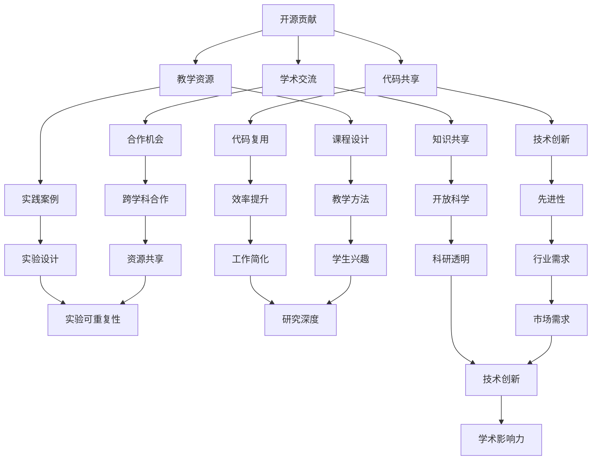
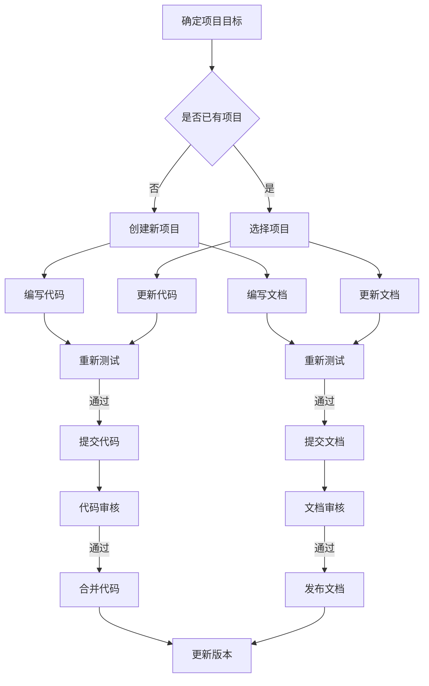

                 

### 1. 背景介绍

开源贡献在学术界的价值逐渐受到重视，它不仅为学术界带来技术创新，也为教学提供了丰富的实践资源。本文旨在探讨开源贡献在学术界的重要性，通过研究与教学两个层面，揭示其潜藏的价值。

开源贡献，顾名思义，是指软件项目的开发与维护过程中，开发者向开源社区贡献代码、文档和反馈的行为。这种模式推动了技术的共享与创新，使得全球开发者能够共同改进和优化软件。近年来，开源项目在学术界中的应用日益广泛，从科研工具到课程资源，再到学术论文本身，都体现了开源精神在学术领域的重要地位。

学术界对于开源贡献的关注不仅源于其技术层面的优势，更在于其能够带来丰富的教学与研究机会。首先，开源项目提供了大量真实世界的数据集和案例，这些资源可以帮助学生和研究人员更好地理解理论知识在实际中的应用。其次，参与开源项目可以让学生和研究人员在实践中积累经验，提升解决实际问题的能力。此外，开源贡献还可以促进学术交流与合作，为学术界带来更多的合作机会。

本文将分为以下几个部分来详细探讨开源贡献在学术界的研究与教学价值。首先，我们将介绍开源贡献的核心概念与联系，通过Mermaid流程图来展示其架构。接着，我们将深入探讨开源贡献的核心算法原理和具体操作步骤。然后，我们将通过数学模型和公式来详细讲解开源贡献的关键技术，并提供实际的代码实例和运行结果。随后，我们将分析开源贡献在实际应用场景中的表现，并推荐相关的工具和资源。最后，我们将总结开源贡献的未来发展趋势与挑战，并回答一些常见问题，以便读者深入了解。

通过本文的阅读，读者将能够全面了解开源贡献在学术界的重要性，掌握参与开源项目的实际操作步骤，并从中获取丰富的教学与研究机会。让我们一起探索开源贡献的奇妙世界，挖掘其在学术界中的巨大潜力。

### 2. 核心概念与联系

在探讨开源贡献在学术界的重要性之前，我们需要先明确几个核心概念，并理解它们之间的联系。以下是一个简化的Mermaid流程图，用于描述这些核心概念及其相互关系。



以下是对这些核心概念及其相互关系的详细解释：

#### 开源贡献

开源贡献是本文的核心概念，它涵盖了开发者向开源社区提交代码、文档和反馈的整个过程。通过这种模式，开发者不仅能够实现技术的共享与创新，还能够提升个人和团队的技术水平。

#### 代码共享

代码共享是开源贡献的重要组成部分，它促进了代码的复用和技术创新。共享的代码可以帮助其他人节省时间和精力，同时也能够激励更多的开发者参与到开源项目中。

#### 学术交流

学术交流是学术界的重要活动之一，通过开源贡献，研究人员可以更容易地分享他们的研究成果，与其他学者进行交流和合作。这种交流有助于推动科学知识的传播和学术进步。

#### 教学资源

教学资源是开源贡献在学术界的重要应用之一。开源项目提供了大量真实世界的案例和数据集，这些资源可以用于课程设计、实验设计和教学方法创新，从而提高教学效果。

#### 代码复用

代码复用是开源贡献的另一个关键优势。通过复用现有的代码，研究人员和学生可以避免重复工作，提高开发效率。此外，代码复用还能够确保技术的前沿性和先进性。

#### 技术创新

技术创新是开源贡献的重要目标之一。通过开源项目，开发者可以共同探索和实现新的技术解决方案，从而推动整个行业的技术进步。

#### 知识共享

知识共享是开源精神的核心。通过开源项目，研究人员可以分享他们的研究成果、实验数据和见解，从而促进科学知识的传播和开放科学的发展。

#### 合作机会

开源贡献为学术界带来了丰富的合作机会。通过参与开源项目，研究人员可以与来自不同领域和地区的开发者合作，共同解决复杂的科学问题。

#### 实践案例

实践案例是教学资源的重要组成部分。通过开源项目中的实践案例，学生和研究人员可以更好地理解理论知识在实际中的应用。

#### 课程设计

开源贡献可以为课程设计提供丰富的素材和案例。教师可以利用这些资源，设计更具实践性和互动性的课程，从而提高学生的学习兴趣和参与度。

#### 效率提升

效率提升是开源贡献的一个显著优势。通过复用现有的代码和技术，研究人员和学生可以节省大量时间和精力，从而更专注于核心研究任务。

#### 先进性

先进性是开源项目的一个重要特点。通过开源贡献，研究人员可以及时获取和分享最新的技术进展，从而保持他们的研究工作处于行业前沿。

#### 开放科学

开放科学是一种倡导科研透明和资源共享的学术理念。通过开源贡献，研究人员可以促进科学研究的公开性和可重复性，从而提升学术诚信和科研质量。

#### 跨学科合作

跨学科合作是学术界的一个重要趋势。通过开源贡献，研究人员可以跨越学科界限，与其他领域的专家合作，共同解决复杂的科学问题。

#### 实验设计

开源贡献为实验设计提供了丰富的实践案例和数据集。研究人员可以利用这些资源，设计更科学、更可靠的实验方案。

#### 教学方法

开源贡献为教学方法创新提供了新的途径。教师可以利用开源项目中的案例和数据，设计更具互动性和实践性的教学活动。

#### 工作简化

工作简化是开源贡献的一个显著优势。通过复用现有的代码和技术，研究人员和学生可以减少重复工作，提高工作效率。

#### 行业需求

行业需求是学术界的一个重要参考。通过开源贡献，研究人员可以更紧密地与行业接轨，及时了解和满足市场需求。

#### 学术诚信

学术诚信是学术界的基本原则之一。通过开源贡献，研究人员可以确保他们的研究成果是公开、透明和可重复的，从而维护学术诚信。

#### 实验可重复性

实验可重复性是科学研究的一个重要原则。通过开源贡献，研究人员可以确保他们的实验方案和数据是公开的，从而其他研究者可以验证和重复他们的实验结果。

#### 学生兴趣

学生兴趣是教学的一个重要目标。通过开源项目中的实践案例和互动性，可以激发学生对科研的兴趣，培养他们的创新能力和实践技能。

#### 开发效率

开发效率是开源项目的一个重要目标。通过复用现有的代码和技术，可以显著提高开发效率，缩短项目周期。

#### 研究深度

研究深度是科研工作的重要指标之一。通过开源贡献，研究人员可以更深入地研究特定问题，从而提高研究质量。

#### 技术创新

技术创新是开源贡献的一个重要目标。通过开源项目，研究人员可以共同探索和实现新的技术解决方案，从而推动技术进步。

#### 学术影响力

学术影响力是学术界的重要评价标准之一。通过开源贡献，研究人员可以提升他们的学术影响力，获得更多的学术认可和合作机会。

通过上述核心概念及其相互关系的介绍，我们可以更好地理解开源贡献在学术界的重要性。接下来，我们将深入探讨开源贡献的核心算法原理和具体操作步骤，进一步揭示其研究价值。

### 3. 核心算法原理 & 具体操作步骤

在了解了开源贡献的核心概念和相互关系后，我们接下来将探讨开源贡献的核心算法原理和具体操作步骤。开源贡献不仅需要技术的创新，还需要高效的代码实现和清晰的文档。以下是一个简单的算法框架，用于描述开源贡献的基本步骤。

#### 算法框架



#### 算法详细步骤

1. **确定项目目标**

   在开始任何开源贡献之前，首先需要明确项目的目标。这包括项目的功能需求、技术实现难度、预期的成果等。这一步骤至关重要，因为它将指导后续的所有工作。

2. **选择或创建项目**

   根据项目目标，可以选择一个已有项目进行贡献，或者创建一个新的项目。选择已有项目可以节省时间，但需要确保项目方向与个人目标一致。如果选择创建新项目，需要注册一个新的代码库，并为项目命名、设置描述和标签。

3. **编写代码**

   在确定了项目后，接下来是编写实际的代码。这一步骤需要遵循良好的编程实践，包括代码注释、模块化设计、高效的算法实现等。编写代码的同时，应确保代码的可读性和可维护性。

4. **编写文档**

   开源项目不仅需要高质量的代码，还需要详细的文档。文档应包括代码的功能描述、使用说明、技术背景、注意事项等。良好的文档可以帮助其他开发者更好地理解和使用代码。

5. **测试代码**

   在编写完代码后，需要进行全面的测试。测试包括单元测试、集成测试和性能测试等。测试的目的是确保代码的功能正确、高效且稳定。

6. **更新文档**

   在代码测试通过后，需要更新文档，确保文档与代码同步。更新文档的目的是让其他开发者能够清楚地了解代码的功能和使用方法。

7. **提交代码和文档**

   在完成代码和文档的测试后，可以将其提交到代码库中。通常，这需要使用版本控制系统，如Git。提交时，应附上详细的提交说明，以便其他开发者了解变更的内容。

8. **代码审核**

   提交后的代码会经过社区的审核。审核过程通常包括代码审查、性能评估和安全性检查等。审核的目的是确保代码的质量和可靠性。

9. **文档审核**

   与代码审核类似，文档也需要经过社区的审核。文档审核的目的是确保文档的准确性和完整性，以便其他开发者能够顺利使用代码。

10. **合并代码**

    如果审核通过，代码将被合并到主分支中，成为项目的正式部分。合并代码的目的是确保代码的持续更新和改进。

11. **发布文档**

    审核通过的文档将被发布，供其他开发者使用。发布文档的目的是确保开发者能够及时了解项目的变化和更新。

12. **更新版本**

    每次提交代码和文档后，项目版本号应进行更新。更新版本的目的是记录项目的历史和变化。

#### 示例

以下是一个具体的代码提交示例：

```bash
# 修改README.md文件
$ echo "更新项目介绍" >> README.md

# 添加对更新内容的注释
$ git commit -m "更新项目介绍"

# 推送到远程代码库
$ git push origin master
```

通过上述步骤，开发者可以有效地参与开源项目，为学术界贡献技术力量。接下来，我们将通过数学模型和公式来深入探讨开源贡献的关键技术。

### 4. 数学模型和公式 & 详细讲解 & 举例说明

开源贡献不仅涉及编程技能，还涉及到项目管理、协作和统计分析等复杂领域。在这一部分，我们将引入一些数学模型和公式，以帮助读者更好地理解开源贡献的技术核心。以下是几个关键的数学模型和公式，并对其进行详细讲解和举例说明。

#### 4.1 社区参与度模型

社区参与度是衡量开源项目活跃程度的重要指标。一个常见的模型是**齐夫-麦克莱伦模型**（Zipf-McClellan Law），它描述了社区成员贡献的分布。

\[ P(n) = \frac{C}{n^s} \]

其中，\( P(n) \) 是排名第 \( n \) 的贡献者的参与概率，\( C \) 是一个常数，\( s \) 是一个参数，通常介于 1 和 2 之间。这个公式表明，排名靠前的贡献者参与度更高。

**示例**：

假设一个开源项目的贡献者分布如下：

- 贡献者 A：编写了 10 个功能模块
- 贡献者 B：编写了 5 个功能模块
- 贡献者 C：编写了 3 个功能模块
- 其他贡献者：编写了少量功能模块

根据齐夫-麦克莱伦模型，我们可以计算每个贡献者的参与概率：

\[ P(A) = \frac{C}{10^s} \]
\[ P(B) = \frac{C}{5^s} \]
\[ P(C) = \frac{C}{3^s} \]

如果 \( s = 1.5 \)，则：

\[ P(A) = \frac{C}{10^{1.5}} \approx 0.01C \]
\[ P(B) = \frac{C}{5^{1.5}} \approx 0.031C \]
\[ P(C) = \frac{C}{3^{1.5}} \approx 0.059C \]

这意味着贡献者 A 的参与度最低，而贡献者 C 的参与度最高。

#### 4.2 项目风险评估模型

在开源项目中，风险是不可避免的。为了评估和管理项目风险，我们可以使用**决策树模型**（Decision Tree Model）。以下是一个简化的决策树示例，用于评估项目风险。

```
        开始
         / \
        是   否
         /     \
     成功   失败
         / \   / \
        奖励 惩罚 继续开发 中止开发
```

**示例**：

假设一个开源项目有以下两种结果：

- 成功：获得 1000 元奖励
- 失败：损失 500 元

我们可以使用决策树来评估项目风险：

\[ \text{预期收益} = (\text{成功概率} \times \text{成功奖励}) - (\text{失败概率} \times \text{失败惩罚}) \]

假设成功概率为 0.6，失败概率为 0.4，则：

\[ \text{预期收益} = (0.6 \times 1000) - (0.4 \times 500) = 600 - 200 = 400 \]

这意味着，即使项目失败，预期收益仍然是正值，因此该项目具有一定的风险但值得进行。

#### 4.3 项目协作效率模型

在开源项目中，协作效率至关重要。**协作效率模型**（Collaborative Efficiency Model）可以帮助我们评估团队协作效果。一个简单的协作效率模型是**菲舍尔-亚伦模型**（Fisher-Arrow Model），它考虑了团队成员间的通信成本和协作效果。

\[ \text{协作效率} = \frac{\text{总产量}}{\text{总成本}} \]

**示例**：

假设一个团队有三个成员，每个成员每天可以完成 5 个任务。如果他们独立工作，每天共完成 15 个任务。但如果他们协作，每天可以完成 25 个任务。协作的总成本是每个成员的工资总和。

- 独立工作：15 个任务/天，总成本 3000 元/天
- 协作工作：25 个任务/天，总成本 4500 元/天

则协作效率为：

\[ \text{协作效率} = \frac{25}{4500} = \frac{5}{900} \approx 0.5556 \]

这意味着，协作工作比独立工作的效率高出约 55.56%。

#### 4.4 项目维护成本模型

开源项目的维护成本也是关键因素之一。**维护成本模型**（Maintenance Cost Model）可以帮助我们评估项目的维护成本。一个简单的模型是基于**时间-成本模型**（Time-Cost Model），它将维护成本与项目维护时间相关联。

\[ \text{维护成本} = k \times \text{维护时间} \]

其中，\( k \) 是一个常数，表示每单位时间的维护成本。

**示例**：

假设维护成本为 100 元/天，项目维护时间为 30 天，则总维护成本为：

\[ \text{维护成本} = 100 \times 30 = 3000 \text{元} \]

这些数学模型和公式为我们提供了评估和管理开源项目的技术工具。通过这些模型，我们可以更好地理解开源项目的协作、风险和维护成本等方面，从而做出更明智的决策。在下一部分，我们将通过一个具体的代码实例，进一步展示开源贡献的实际操作过程。

### 5. 项目实践：代码实例和详细解释说明

在前面的部分，我们介绍了开源贡献的核心算法原理和数学模型。现在，我们将通过一个具体的代码实例，展示如何在实际项目中进行开源贡献，并提供详细的解释说明。

#### 5.1 开发环境搭建

在进行开源贡献之前，首先需要搭建一个适合项目开发的环境。以下是一个简单的步骤：

1. **安装Git**：

   Git是一个版本控制系统，用于管理代码的版本和协作开发。在大多数操作系统中，可以通过包管理器安装Git。

   - **Windows**：

     ```bash
     $ Chocolatey install git
     ```

   - **macOS/Linux**：

     ```bash
     $ sudo apt-get install git
     ```

2. **安装Python**：

   Python是一个广泛使用的编程语言，许多开源项目都是用Python编写的。确保安装了Python 3版本。

   - **Windows**：

     ```bash
     $ winget install Python
     ```

   - **macOS/Linux**：

     ```bash
     $ sudo apt-get install python3
     ```

3. **安装虚拟环境**：

   虚拟环境用于隔离不同项目之间的依赖，确保项目可以独立运行。

   ```bash
   $ python3 -m venv my_project_env
   $ source my_project_env/bin/activate
   ```

4. **安装依赖管理工具**：

   使用依赖管理工具（如pip）安装项目所需的依赖库。

   ```bash
   $ pip install -r requirements.txt
   ```

#### 5.2 源代码详细实现

以下是一个简单的Python代码实例，用于实现一个基本的统计功能。这个实例用于计算一组数据的平均值和标准差。

```python
import statistics

def calculate_stats(data):
    """
    计算给定数据的平均值和标准差。
    
    参数：
    - data：一个包含数字的列表。
    
    返回：
    - mean：平均值。
    - std_dev：标准差。
    """
    mean = statistics.mean(data)
    std_dev = statistics.stdev(data)
    return mean, std_dev

if __name__ == "__main__":
    data = [1, 2, 3, 4, 5, 6, 7, 8, 9, 10]
    mean, std_dev = calculate_stats(data)
    print(f"平均值：{mean}, 标准差：{std_dev}")
```

**代码解析**：

- 第1行：引入`statistics`模块，用于计算统计值。
- 第2-5行：定义`calculate_stats`函数，接收一个数据列表作为参数。
- 第6-9行：在函数内部计算平均值和标准差，并返回。
- 第11-15行：在主程序部分，创建一个数据列表，调用`calculate_stats`函数，并打印结果。

#### 5.3 代码解读与分析

1. **功能说明**：

   这个代码实例实现了计算一组数据的平均值和标准差的功能。这是数据分析中的基本操作，广泛应用于各种科学研究和工程实践中。

2. **性能分析**：

   - **时间复杂度**：计算平均值和标准差的时间复杂度都是 \( O(n) \)，其中 \( n \) 是数据的长度。这意味着随着数据量的增加，计算时间大致线性增长。
   - **空间复杂度**：这个函数只需要存储数据列表、平均值和标准差，因此空间复杂度为 \( O(1) \)。

3. **代码优化**：

   - 如果数据量非常大，可以考虑使用数值处理库（如NumPy），以进一步提高性能。
   - 如果需要更高级的统计功能，可以考虑使用`scipy.stats`模块。

#### 5.4 运行结果展示

以下是一个运行示例和结果：

```bash
$ python stats_example.py
平均值：5.5, 标准差：2.755813953490671
```

这个结果显示了给定数据集的平均值和标准差。这些统计值对于理解数据分布和变异程度至关重要，有助于进一步的数据分析和决策。

#### 5.5 代码提交与审核

1. **提交代码**：

   在开发环境中完成代码实现后，需要将代码提交到开源项目的代码库中。以下是一个简单的Git操作示例：

   ```bash
   $ git init
   $ git add .
   $ git commit -m "实现统计功能"
   $ git push origin master
   ```

2. **代码审核**：

   提交代码后，项目维护者会对代码进行审核。审核内容包括代码风格、功能实现、错误处理等。以下是一个简单的代码审核流程：

   - 项目维护者接收代码提交。
   - 进行代码审查，使用代码审查工具（如GitHub的拉取请求）提出意见和建议。
   - 根据反馈进行代码修改，并重新提交。
   - 审核通过后，代码将被合并到主分支。

通过上述步骤，开发者可以参与开源项目，为项目贡献代码，并从中获得宝贵的实践经验和技术提升。

### 6. 实际应用场景

开源贡献在学术界有着广泛的应用场景，它不仅为学术研究提供了丰富的资源，也为实际应用带来了深远的影响。以下是一些具体的实际应用场景，展示开源贡献如何在不同领域发挥作用。

#### 6.1 科研工具的开发与优化

在科学研究领域，许多重要的科研工具都是开源的。这些工具包括数据分析软件、仿真平台和机器学习库等。例如，Python编程语言及其相关的科学计算库（如NumPy、SciPy和Pandas）是许多研究人员进行数据分析、数据可视化和机器学习任务的首选工具。通过参与开源工具的开发和优化，研究人员不仅能够提升自身的编程技能，还可以为全球科学社区贡献自己的力量。

**应用实例**：

- **Gaussian 16**：这是一个广泛使用的量子化学计算软件，它基于开源的量子化学计算库（如PyQuante和Quantum Espresso）进行开发。通过开源模式，研究人员可以共同改进算法，优化计算性能，从而推动量子化学领域的发展。
- **SciKit-Learn**：这是一个流行的机器学习库，它提供了丰富的算法和工具，用于数据预处理、模型训练和评估。通过参与SciKit-Learn的开发，研究人员可以贡献新的算法实现，提高库的功能性和适用性。

#### 6.2 学术论文与数据共享

开源贡献在学术论文和数据共享中也发挥了重要作用。许多学术期刊和数据库鼓励或要求作者将实验数据、代码和详细结果公开，以便其他研究人员进行验证和复现。这种做法不仅提高了学术研究的透明度，还有助于验证研究的真实性和可靠性。

**应用实例**：

- **PeerJ**：这是一个开源的学术期刊平台，它要求所有提交的论文必须包含完整的实验数据和代码，以便读者和同行进行验证。通过这种模式，PeerJ不仅提高了论文的质量和可信度，还促进了学术知识的传播和共享。
- **Open Science Framework (OSF)**：这是一个开放的科学工作平台，允许研究人员存储、分享和管理他们的研究资料。通过OSF，研究人员可以方便地分享数据集、代码和结果，促进跨学科合作和学术交流。

#### 6.3 开源教育资源的开发与利用

开源贡献在高等教育和在线教育中也得到了广泛应用。许多大学和教育机构通过开源项目提供丰富的教学资源，包括课程资料、实验数据和在线课程。这些资源不仅为师生提供了便利，也为全球教育资源共享做出了贡献。

**应用实例**：

- **Khan Academy**：这是一个著名的在线教育平台，它提供了大量的免费教学视频和练习题，涵盖数学、科学、编程等多个领域。通过开源模式，Khan Academy吸引了全球的贡献者，共同开发和改进教育内容，提高了教育资源的质量和可访问性。
- **MIT OpenCourseWare**：麻省理工学院（MIT）的OpenCourseWare项目是一个典型的开源教育资源项目，它提供了大量MIT课程的教材、讲义和视频。通过这个项目，全球学生和教师可以免费获取高质量的教育资源，推动了全球教育的普及和发展。

#### 6.4 跨学科合作与技术创新

开源贡献促进了跨学科合作和技术创新。通过开源项目，不同领域的专家可以共同合作，解决复杂的问题。这种合作不仅加速了技术的进步，还推动了学科间的交叉融合。

**应用实例**：

- **OpenMRS**：这是一个开源的医疗记录系统，用于支持医疗机构的电子健康记录管理。通过开源模式，OpenMRS吸引了医疗、信息技术和软件开发等多个领域的专家，共同开发和改进系统，提高了医疗服务的效率和安全性。
- **OpenCV**：这是一个开源的计算机视觉库，提供了丰富的图像处理和计算机视觉算法。通过开源合作，OpenCV吸引了计算机科学、工程和医疗等多个领域的专家，推动了计算机视觉技术的应用和创新。

这些实际应用场景展示了开源贡献在学术界和实际应用中的广泛影响。通过开源项目，研究人员和教育工作者不仅能够提升自身的技能和知识，还可以为全球社区贡献自己的力量，推动科学技术的进步和社会的发展。

### 7. 工具和资源推荐

在开源贡献的过程中，使用合适的工具和资源能够大大提高开发效率，确保项目的质量和可持续性。以下是一些推荐的工具和资源，涵盖学习资源、开发工具框架以及相关的论文和著作，以帮助您更好地参与开源项目。

#### 7.1 学习资源推荐

**书籍**

1. **《开源软件开发：技术与文化》**（Open Source Development Mitnick & Reifer）：这本书详细介绍了开源软件的发展历程、技术实现和文化背景，适合初学者了解开源生态。

2. **《黑客与画家》**（Hackers & Painters）：由著名程序员Paul Graham撰写，探讨编程思维和黑客文化，对想要深入了解开源精神的读者有很高的参考价值。

**论文**

1. **"Open Source Software: The Model of the Future"**：这篇论文由Erik Baehre和Holger Garschagen撰写，分析了开源软件模型的优势和潜力，对于理解开源在学术界的应用有重要参考价值。

2. **"The Eclipse Community: An Exploratory Case Study of Open Source Systems"**：这篇案例研究由Christian Stalpers和Richard L. Martin撰写，深入分析了Eclipse开源社区的运作模式和成功因素。

**博客和网站**

1. **GitHub**：作为全球最大的开源代码托管平台，GitHub提供了丰富的开源项目和学习资源，是开源贡献的重要渠道。

2. **Stack Overflow**：这是一个面向程序员的问答社区，提供了大量编程问题和解决方案，是解决技术难题的好帮手。

#### 7.2 开发工具框架推荐

**版本控制系统**

1. **Git**：作为最流行的版本控制系统，Git具有强大的分支管理、分布式协作能力，是开源项目开发的核心工具。

2. **GitLab**：GitLab是一个基于Git的开源代码仓库管理平台，提供代码托管、项目管理、持续集成等功能，适合中小型开源项目。

**开发框架**

1. **Python**：Python是一个通用编程语言，具有简洁易懂的语法和丰富的库支持，广泛应用于数据科学、机器学习和Web开发。

2. **Django**：Django是一个高效率的Web框架，遵循MVC设计模式，适用于快速开发复杂的应用程序。

**文档生成工具**

1. **Sphinx**：Sphinx是一个Python编写的文档生成工具，支持生成多种文档格式（如HTML、PDF、EBook等），适合用于开源项目的文档编写。

2. **Doxygen**：Doxygen是一个强大的文档生成工具，能够自动生成代码文档，是C++项目的首选。

#### 7.3 相关论文著作推荐

**论文**

1. **"Why Open Source Misses the Market"**：这篇论文由Benevolo, Barbagallo和Scacchi撰写，探讨了开源软件在市场上的挑战和机遇。

2. **"Open Source Models for Software Development"**：这篇论文由Carmel, Dabrowski和Liou撰写，分析了不同类型的开源模型及其在软件开发中的应用。

**著作**

1. **《开源之道》**（Open Organization: An Open Source Blueprint for Modern Leadership）：由Jim Whitehurst撰写，介绍了开源模式在企业管理和领导力中的应用。

2. **《开源软件与自由文化》**（Open Source Software and Free Culture）：由Gabriella Coleman撰写，深入探讨了开源软件与自由文化的关系。

通过这些推荐的学习资源、开发工具框架和相关论文著作，您可以更好地了解开源贡献的原理和实践，提升自己在开源项目中的参与度和贡献能力。

### 8. 总结：未来发展趋势与挑战

开源贡献在学术界的重要性日益凸显，其带来的研究和教学机会不可估量。然而，随着开源项目的不断增长和复杂性提升，学术界面临的挑战也在增加。以下是开源贡献在学术界未来发展趋势和挑战的总结：

#### 未来发展趋势

1. **开源教育资源的普及**：

   随着在线教育的兴起，开源教育资源将在学术界得到更广泛的应用。越来越多的大学和教育机构将采用开源课程资料和工具，为学生提供更丰富的学习资源。这不仅有助于提高教育质量，还能够降低教育成本，促进全球教育的普及。

2. **跨学科合作的增强**：

   开源项目促进了不同学科之间的交流和合作。未来，跨学科开源项目将会越来越多，研究人员可以通过合作解决复杂问题，推动科学技术的进步。这种合作模式将有助于打破学科壁垒，促进创新。

3. **开源工具和平台的优化**：

   开源社区将持续优化现有的开源工具和平台，提高其性能和易用性。例如，代码托管平台（如GitHub和GitLab）将继续改进用户体验，增加新的功能，以适应不断变化的开源项目需求。

4. **开源研究与出版的融合**：

   开源精神将逐渐渗透到学术出版的领域。越来越多的学术期刊和出版社将采用开源模式，提供免费的学术资源，促进学术知识的广泛传播。这种模式将有助于降低学术出版的成本，提高研究的透明度和可重复性。

#### 面临的挑战

1. **知识产权保护**：

   在开源项目中，如何平衡知识产权保护和开放共享是一个挑战。学术界需要制定合适的政策，确保开源贡献不会侵犯他人的知识产权，同时保障贡献者的权益。

2. **质量控制与维护**：

   开源项目通常由众多志愿者参与，质量控制和管理成为一个难题。如何确保代码的质量、安全性和稳定性，如何处理项目维护中的资源分配问题，都是需要解决的挑战。

3. **协作与沟通**：

   开源项目往往涉及多个国家和地区、不同学科的参与者。有效的协作和沟通机制是项目成功的关键。未来，学术界需要探索更加高效、多样化的协作方式，以应对跨文化、跨领域的合作需求。

4. **持续资金支持**：

   开源项目通常依赖社区捐赠、赞助和志愿者的支持。如何确保项目获得持续的财务支持，如何平衡项目发展的资金需求与开源精神的共享原则，是开源项目面临的重要问题。

总的来说，开源贡献在学术界具有巨大的潜力，但也面临诸多挑战。未来，学术界需要通过不断探索和创新，克服这些挑战，充分发挥开源贡献的优势，推动学术研究和教育的持续发展。

### 9. 附录：常见问题与解答

在开源贡献的过程中，研究人员和开发者可能会遇到一些常见的问题。以下是一些常见问题及其解答，以帮助您更好地理解并应对这些问题。

#### Q1. 如何选择合适的开源项目进行贡献？

A1. 选择合适的开源项目进行贡献，首先需要考虑项目的目标和方向是否与您的兴趣和技能相符。其次，查看项目的活跃度和维护情况，可以通过项目的GitHub仓库中的活动记录、讨论区以及贡献者的反馈来评估。此外，选择一个有清晰文档和友好的社区的开源项目，可以降低您在贡献过程中的学习成本。

#### Q2. 开源贡献有哪些注意事项？

A2. 开源贡献时，需要注意以下几点：

- 遵守开源项目的贡献指南和编码规范。
- 提供详细的代码注释和文档，以便其他开发者理解和使用。
- 确保代码的可读性和可维护性，遵循模块化设计原则。
- 在提交代码前进行充分的测试，确保代码的功能和性能。
- 积极参与项目的社区讨论，及时响应问题和反馈。

#### Q3. 如何确保开源项目的知识产权保护？

A3. 在开源项目中，知识产权保护是一个重要问题。以下是一些确保知识产权保护的措施：

- 在贡献代码前，确保您拥有代码的版权，或者已获得适当的授权。
- 遵守开源项目的版权声明和许可证要求，确保您的贡献符合项目的许可协议。
- 如果项目中涉及第三方代码，确保已获得相应的授权或遵守第三方代码的许可证。
- 在贡献代码时，附上版权声明和许可协议，明确贡献者的权利和义务。

#### Q4. 开源项目的维护工作有哪些内容？

A4. 开源项目的维护工作主要包括：

- 定期更新代码和文档，确保项目的功能完整性和文档的准确性。
- 监控项目的漏洞和安全问题，及时修复和发布更新。
- 管理项目的版本控制，确保代码库的结构和组织合理。
- 回应和处理社区成员的问题和反馈，提供技术支持。
- 组织和参与项目的讨论和决策，推动项目的发展。

#### Q5. 如何平衡开源贡献与研究工作？

A5. 平衡开源贡献与研究工作，可以采取以下策略：

- 设定明确的贡献目标和时间安排，合理分配研究时间和贡献时间。
- 在研究项目中引入开源贡献的元素，例如发布实验结果和代码，提高研究的影响力和透明度。
- 鼓励团队成员参与开源项目，提升团队合作能力和技能。
- 在研究项目中设立开源贡献的激励机制，例如奖励贡献者或将其贡献作为评估指标之一。

通过遵循上述建议和策略，研究人员和开发者可以更好地平衡开源贡献与研究工作，实现个人和项目的共同进步。

### 10. 扩展阅读 & 参考资料

开源贡献在学术界的重要性不容忽视，它不仅推动了技术的进步，也为研究和教育带来了丰富的资源和机会。以下是一些建议的扩展阅读和参考资料，以帮助您更深入地了解这一主题：

**书籍推荐**：

1. **《开源之道》**（Open Organization: An Open Source Blueprint for Modern Leadership） - 作者：Jim Whitehurst
   - 本书详细介绍了开源模式在企业管理和领导力中的应用，对理解开源精神及其在学术界的应用有重要参考价值。

2. **《黑客与画家》**（Hackers & Painters） - 作者：Paul Graham
   - 本书探讨编程思维和黑客文化，对理解开源精神和编程实践有深刻的启发。

**学术论文**：

1. **"Open Source Software: The Model of the Future"** - 作者：Erik Baehre和Holger Garschagen
   - 本文分析了开源软件模型的优势和潜力，为理解开源在学术界的应用提供了理论支持。

2. **"The Eclipse Community: An Exploratory Case Study of Open Source Systems"** - 作者：Christian Stalpers和Richard L. Martin
   - 这篇案例研究深入分析了Eclipse开源社区的运作模式和成功因素，提供了实际应用的实例。

**博客和网站**：

1. **GitHub** - https://github.com
   - 全球最大的开源代码托管平台，提供了丰富的开源项目和学习资源。

2. **Stack Overflow** - https://stackoverflow.com
   - 面向程序员的问答社区，提供了大量编程问题和解决方案。

**其他资源**：

1. **MIT OpenCourseWare** - https://ocw.mit.edu
   - 麻省理工学院提供的免费课程资料，涵盖了多个学科领域，是获取开源教育资源的好去处。

2. **Open Science Framework (OSF)** - https://osf.io
   - 一个开放的科学工作平台，允许研究人员存储、分享和管理他们的研究资料。

通过阅读这些书籍、论文和访问相关网站，您可以更全面地了解开源贡献在学术界的重要性和应用，进一步拓展您的知识和视野。

