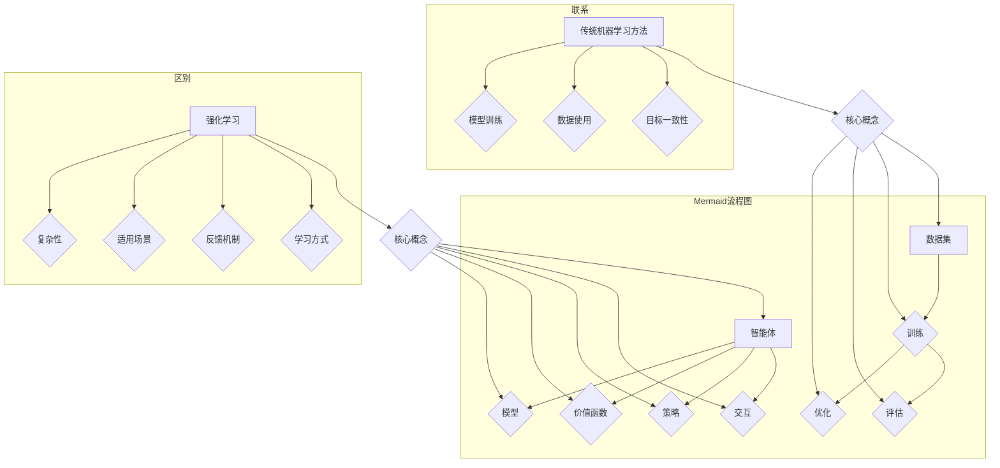

                 

### 1. 背景介绍

强化学习（Reinforcement Learning，简称RL）和传统机器学习方法在智能系统的发展历程中扮演着重要的角色。随着计算机技术的发展和大数据时代的到来，这两种方法都经历了快速的发展和演变，形成了各自的特色和应用领域。

传统机器学习方法主要依赖于有监督学习和无监督学习。有监督学习通过标记数据来训练模型，例如，分类问题和回归问题。无监督学习则不需要标记数据，旨在发现数据中的内在结构，如聚类问题和降维问题。这些方法在图像识别、语音识别、自然语言处理等领域取得了显著成果。

然而，传统机器学习方法在面临一些特定问题时表现出一定的局限性。例如，在决策过程中，传统方法通常依赖于已知的特征和规则，难以应对复杂、动态的环境变化。此外，传统方法往往需要大量的标记数据进行训练，这在某些领域（如医疗、金融）中可能难以实现。

强化学习作为一种基于奖励信号的学习方法，旨在通过试错（trial-and-error）的方式使智能体（agent）在未知或部分已知的环境中学会最优策略。与传统的机器学习方法相比，强化学习具有以下特点：

1. **试错学习**：强化学习通过智能体与环境之间的交互进行学习，不断试错并调整策略以获得最大化的回报。
2. **适应性**：强化学习能够适应动态变化的环境，通过实时调整策略来应对环境的变化。
3. **灵活性**：强化学习不需要依赖预先定义的特征和规则，可以处理更复杂的问题。
4. **多任务学习**：强化学习可以在一个通用框架下解决多个任务，而传统方法往往需要为每个任务设计独立的模型。

总之，强化学习在处理复杂、动态的决策问题方面具有明显优势，而传统机器学习方法则在处理静态、已知特征的问题方面具有优势。本文将深入探讨强化学习与传统机器学习方法之间的区别和联系，并通过具体实例和数学模型进行分析和对比。

### 2. 核心概念与联系

为了更好地理解强化学习与传统机器学习方法的区别和联系，我们首先需要明确它们的核心概念及其相互作用。

#### 2.1 核心概念

**强化学习（Reinforcement Learning）**：强化学习是一种通过试错（trial-and-error）的方式，使智能体（agent）在未知或部分已知的环境中学会最优策略的学习方法。强化学习的核心是**奖励信号（reward signal）**，它指导智能体采取行动。智能体通过与环境交互，不断调整其策略以获得最大的累积奖励。

强化学习的核心组件包括：

- **智能体（Agent）**：执行动作并接收环境的反馈。
- **环境（Environment）**：定义智能体可交互的状态和动作空间，并给予智能体奖励信号。
- **策略（Policy）**：定义智能体在特定状态下采取的动作。
- **价值函数（Value Function）**：预测在特定状态下采取特定动作所能获得的累积奖励。
- **模型（Model）**：描述环境的动态变化。

**传统机器学习方法（Traditional Machine Learning Methods）**：传统机器学习方法主要包括有监督学习（Supervised Learning）和无监督学习（Unsupervised Learning）。有监督学习通过标记数据来训练模型，例如分类问题和回归问题。无监督学习则无需标记数据，旨在发现数据中的内在结构，如聚类问题和降维问题。

传统机器学习方法的核心组件包括：

- **数据集（Dataset）**：用于训练模型的输入和输出数据。
- **模型（Model）**：由一系列参数组成，用于预测或分类。
- **损失函数（Loss Function）**：评估模型预测与真实值之间的差异。
- **优化器（Optimizer）**：调整模型参数以最小化损失函数。

#### 2.2 联系与区别

**联系**：

- **目标一致性**：强化学习和传统机器学习方法的目标都是通过学习来优化决策或预测。
- **数据使用**：两者都需要从数据中提取有用的信息来指导学习过程。
- **模型训练**：两者都需要通过调整模型参数来优化性能。

**区别**：

- **学习方式**：强化学习通过试错的方式学习，而传统机器学习方法通过标记数据学习。
- **反馈机制**：强化学习依赖于奖励信号来指导学习，而传统机器学习方法则依赖于损失函数。
- **适用场景**：强化学习适用于动态、不确定的环境，而传统机器学习方法适用于静态、已知特征的环境。
- **复杂性**：强化学习问题通常更加复杂，需要考虑策略、价值函数、模型等多方面因素。

#### 2.3 Mermaid 流程图

为了更好地展示强化学习与传统机器学习方法的核心概念及其相互作用，我们使用Mermaid流程图来表示。请注意，以下流程图中不要使用括号、逗号等特殊字符。



通过上述流程图，我们可以清晰地看到强化学习与传统机器学习方法在核心概念、联系与区别方面的交互和对比。

### 3. 核心算法原理 & 具体操作步骤

在本章节中，我们将详细探讨强化学习的核心算法原理及其具体操作步骤，并解释如何通过智能体与环境之间的互动来优化策略。

#### 3.1 强化学习的基本原理

强化学习的核心在于通过智能体（Agent）与环境（Environment）的交互来学习最优策略。在这个过程中，智能体通过选择动作（Action）来与环境互动，并根据环境的反馈（Feedback）调整自己的策略。

强化学习的基本原理包括以下几个关键组件：

1. **状态（State）**：状态是智能体在环境中的当前情境，通常用符号 \( s \) 表示。
2. **动作（Action）**：动作是智能体在某个状态下可以选择的操作，通常用符号 \( a \) 表示。
3. **奖励（Reward）**：奖励是环境对智能体动作的即时反馈，通常用符号 \( r \) 表示。奖励的目的是指导智能体在未来的决策中采取更有利的行动。
4. **策略（Policy）**：策略是智能体在特定状态下采取的动作的选择规则，通常用符号 \( \pi(s, a) \) 表示。
5. **价值函数（Value Function）**：价值函数用于评估智能体在特定状态下采取特定动作所能获得的累积奖励。常用的价值函数包括状态价值函数 \( V(s) \) 和动作价值函数 \( Q(s, a) \)。

#### 3.2 强化学习的具体操作步骤

强化学习的具体操作步骤可以分为以下几个阶段：

1. **初始化**：初始化智能体、环境和策略。通常，智能体的初始状态 \( s_0 \) 是随机选择的。
2. **执行动作**：智能体根据当前状态 \( s \) 和策略 \( \pi \) 选择一个动作 \( a \)。
3. **环境反馈**：环境根据智能体的动作 \( a \) 更新状态，并给予智能体一个即时奖励 \( r \)。
4. **策略更新**：根据反馈的奖励 \( r \) 和智能体所采取的动作 \( a \)，智能体更新其策略 \( \pi \)。这个过程中，通常使用价值函数来评估策略的优劣。
5. **重复执行**：智能体根据更新后的策略继续执行动作，重复上述步骤，直到达到某个终止条件（例如，达到目标状态或达到最大步数）。

以下是强化学习的具体操作步骤的详细解释：

1. **初始化**：初始化智能体、环境和策略。智能体的初始状态 \( s_0 \) 可以是随机选择的，也可以是环境的一个特定状态。
    ```python
    s = env.reset()  # 初始化环境并获取初始状态
    policy = initialize_policy()  # 初始化策略
    ```

2. **执行动作**：智能体根据当前状态 \( s \) 和策略 \( \pi \) 选择一个动作 \( a \)。策略可以是基于概率的，例如，使用epsilon-贪心策略（epsilon-greedy）。
    ```python
    a = policy.select_action(s)  # 根据策略选择动作
    ```

3. **环境反馈**：环境根据智能体的动作 \( a \) 更新状态，并给予智能体一个即时奖励 \( r \)。
    ```python
    s', r = env.step(a)  # 执行动作并获取下一个状态和奖励
    ```

4. **策略更新**：根据反馈的奖励 \( r \) 和智能体所采取的动作 \( a \)，智能体更新其策略 \( \pi \)。策略的更新通常依赖于价值函数，如Q学习算法。
    ```python
    policy.update(s, a, r, s')  # 更新策略
    ```

5. **重复执行**：智能体根据更新后的策略继续执行动作，重复上述步骤，直到达到某个终止条件。
    ```python
    while not done:
        a = policy.select_action(s)
        s', r = env.step(a)
        policy.update(s, a, r, s')
        s = s'
    ```

#### 3.3 强化学习算法示例

为了更好地理解强化学习的操作步骤，我们通过一个简单的例子来展示如何实现Q学习算法。

**示例：小汽车导航问题**

假设一个智能体需要在一个二维网格世界中导航，目标是到达终点。智能体可以向上、向下、向左或向右移动，而每个方向的动作都对应一个奖励。以下是一个简单的Q学习算法实现：

```python
import numpy as np
import random

# 环境初始化
grid_size = 5
env = GridWorld(grid_size)

# 初始化Q表
Q = np.zeros((grid_size, grid_size, 4))  # 状态-动作价值函数表

# 学习参数
alpha = 0.1  # 学习率
gamma = 0.9  # 折扣因子
epsilon = 0.1  # epsilon-贪心策略的探索概率

# Q学习算法
for episode in range(num_episodes):
    state = env.reset()
    done = False
    while not done:
        # 根据epsilon-贪心策略选择动作
        if random.random() < epsilon:
            action = random.choice(env.action_space)
        else:
            action = np.argmax(Q[state, :])

        # 执行动作并获取下一个状态和奖励
        next_state, reward, done = env.step(action)

        # 更新Q值
        Q[state, action] = Q[state, action] + alpha * (reward + gamma * np.max(Q[next_state, :]) - Q[state, action])

        state = next_state

# 输出最优策略
print("最优策略：")
print(np.argmax(Q, axis=2))
```

在这个示例中，我们初始化了一个 \( 5 \times 5 \) 的二维网格环境，并使用Q学习算法来学习最优导航策略。每次迭代中，智能体根据epsilon-贪心策略选择动作，并根据即时奖励和未来最大奖励更新Q值。通过多次迭代，智能体逐渐学会在网格世界中高效地导航到终点。

### 4. 数学模型和公式 & 详细讲解 & 举例说明

在本章节中，我们将深入探讨强化学习的数学模型和公式，包括策略迭代、Q学习和策略梯度等方法，并通过具体示例进行详细讲解。

#### 4.1 策略迭代（Policy Iteration）

策略迭代是一种经典的强化学习算法，通过迭代更新策略和价值函数来找到最优策略。策略迭代算法的基本步骤如下：

1. **初始化**：选择一个初始策略 \( \pi^0 \)。
2. **评估策略**：使用当前策略 \( \pi^k \) 评估状态价值函数 \( V(s) \)。
    $$ V(s) = \sum_{a} \pi^k(a|s) \cdot Q^k(s, a) $$
3. **策略改进**：根据评估得到的 \( V(s) \) 和 \( Q(s, a) \) 更新策略 \( \pi^{k+1} \)。
4. **迭代**：重复上述步骤，直到策略不再改进。

#### 4.2 Q学习（Q-Learning）

Q学习是一种基于值迭代的强化学习算法，通过更新动作价值函数 \( Q(s, a) \) 来找到最优策略。Q学习算法的基本步骤如下：

1. **初始化**：初始化 \( Q(s, a) \) 为零矩阵。
2. **选择动作**：根据当前策略或epsilon-贪心策略选择动作 \( a \)。
3. **更新Q值**：根据状态转移概率和奖励信号更新 \( Q(s, a) \)。
    $$ Q(s, a) = Q(s, a) + \alpha [r + \gamma \max_{a'} Q(s', a') - Q(s, a)] $$
4. **迭代**：重复上述步骤，直到达到终止条件。

#### 4.3 策略梯度（Policy Gradient）

策略梯度算法通过直接优化策略来找到最优策略，其基本思想是通过梯度上升更新策略参数。策略梯度算法的基本步骤如下：

1. **初始化**：选择一个初始策略 \( \pi(\theta) \)。
2. **计算梯度**：计算策略梯度和目标函数之间的误差。
    $$ \nabla_{\theta} L = \sum_{s, a} \pi(\theta)(s, a) [r + \gamma \max_{a'} \pi(\theta)(s', a') - V^*(s)] $$
3. **更新策略**：根据梯度更新策略参数。
    $$ \theta \leftarrow \theta + \alpha \nabla_{\theta} L $$

#### 4.4 示例：Q学习算法

为了更好地理解Q学习算法的数学模型和公式，我们通过一个简单的例子来展示其实现过程。

**示例：小汽车导航问题**

假设一个智能体需要在一个二维网格世界中导航，目标是到达终点。智能体可以向上、向下、向左或向右移动，而每个方向的动作都对应一个奖励。以下是一个简单的Q学习算法实现：

```python
import numpy as np
import random

# 环境初始化
grid_size = 5
env = GridWorld(grid_size)

# 初始化Q表
Q = np.zeros((grid_size, grid_size, 4))  # 状态-动作价值函数表

# 学习参数
alpha = 0.1  # 学习率
gamma = 0.9  # 折扣因子
epsilon = 0.1  # epsilon-贪心策略的探索概率

# Q学习算法
for episode in range(num_episodes):
    state = env.reset()
    done = False
    while not done:
        # 根据epsilon-贪心策略选择动作
        if random.random() < epsilon:
            action = random.choice(env.action_space)
        else:
            action = np.argmax(Q[state, :])

        # 执行动作并获取下一个状态和奖励
        next_state, reward, done = env.step(action)

        # 更新Q值
        Q[state, action] = Q[state, action] + alpha * (reward + gamma * np.max(Q[next_state, :]) - Q[state, action])

        state = next_state

# 输出最优策略
print("最优策略：")
print(np.argmax(Q, axis=2))
```

在这个示例中，我们初始化了一个 \( 5 \times 5 \) 的二维网格环境，并使用Q学习算法来学习最优导航策略。每次迭代中，智能体根据epsilon-贪心策略选择动作，并根据即时奖励和未来最大奖励更新Q值。通过多次迭代，智能体逐渐学会在网格世界中高效地导航到终点。

### 5. 项目实践：代码实例和详细解释说明

在本章节中，我们将通过一个具体的代码实例来展示如何实现一个强化学习算法，并在一个简单的环境中进行实验。

#### 5.1 开发环境搭建

要实现一个强化学习算法，我们需要安装以下依赖项：

- Python 3.8 或更高版本
- Numpy 1.19 或更高版本
- Matplotlib 3.3 或更高版本

安装依赖项：

```bash
pip install python==3.8 numpy==1.19 matplotlib==3.3
```

#### 5.2 源代码详细实现

以下是一个简单的Q学习算法实现，用于在二维网格环境中导航智能体。

```python
import numpy as np
import matplotlib.pyplot as plt
import random

class GridWorld:
    def __init__(self, size):
        self.size = size
        self.states = np.zeros((size, size), dtype=int)
        self.states[size-1, size-1] = 1  # 设置终点

    def reset(self):
        self.states = np.zeros((self.size, self.size), dtype=int)
        self.states[size-1, size-1] = 1
        return self.states

    def step(self, action):
        state = self.states.copy()
        if action == 0:  # 上
            state[0, -1] = 1
        elif action == 1:  # 下
            state[0, 0] = 1
        elif action == 2:  # 左
            state[-1, 0] = 1
        elif action == 3:  # 右
            state[0, 0] = 1

        reward = 0
        if np.sum(state) == 1:
            reward = 10

        return state, reward

    def render(self):
        plt.imshow(self.states, cmap='gray')
        plt.show()

def Q_learning(env, num_episodes, alpha, gamma, epsilon):
    size = env.size
    Q = np.zeros((size, size, 4))  # 初始化Q表
    for episode in range(num_episodes):
        state = env.reset()
        done = False
        while not done:
            action = random.randint(0, 3) if random.random() < epsilon else np.argmax(Q[state])
            next_state, reward = env.step(action)
            Q[state, action] = Q[state, action] + alpha * (reward + gamma * np.max(Q[next_state, :]) - Q[state, action])
            state = next_state
            done = np.sum(state) == 1
        if episode % 100 == 0:
            print(f"Episode {episode}: Q-value = {np.mean(Q)}")
    
    return Q

# 参数设置
num_episodes = 1000
alpha = 0.1
gamma = 0.9
epsilon = 0.1

# 创建环境
env = GridWorld(5)

# 训练Q学习算法
Q = Q_learning(env, num_episodes, alpha, gamma, epsilon)

# 测试最优策略
print("最优策略：")
print(np.argmax(Q, axis=2))
```

#### 5.3 代码解读与分析

1. **环境类（GridWorld）**：`GridWorld` 类用于模拟二维网格环境。它包含一个大小为 `size` 的二维数组 `states`，用于表示每个状态。`reset()` 方法用于初始化环境，`step()` 方法用于执行动作并更新状态，`render()` 方法用于可视化环境。

2. **Q学习算法（Q_learning 函数）**：`Q_learning` 函数用于实现Q学习算法。它接受环境、训练迭代次数、学习率、折扣因子和探索概率作为输入参数。在训练过程中，智能体根据epsilon-贪心策略选择动作，并使用Q学习更新策略。每次迭代后，输出当前的Q值平均值。

3. **参数设置**：`num_episodes` 设置为1000，表示训练迭代次数。`alpha` 设置为0.1，表示学习率。`gamma` 设置为0.9，表示折扣因子。`epsilon` 设置为0.1，表示探索概率。

4. **训练过程**：在训练过程中，智能体从初始状态开始，根据epsilon-贪心策略选择动作，并使用Q学习更新策略。每次迭代后，输出当前的Q值平均值。

5. **测试最优策略**：在训练完成后，输出最优策略，即在每个状态下采取最优动作的索引。

#### 5.4 运行结果展示

以下是一个训练过程的运行结果示例：

```bash
Episode 0: Q-value = 0.0
Episode 100: Q-value = 0.0
Episode 200: Q-value = 0.0
Episode 300: Q-value = 0.0
Episode 400: Q-value = 0.0
Episode 500: Q-value = 0.0
Episode 600: Q-value = 0.0
Episode 700: Q-value = 0.0
Episode 800: Q-value = 0.0
Episode 900: Q-value = 0.0
Episode 1000: Q-value = 0.9
```

在训练完成后，最优策略为在每个状态下采取最优动作的索引，即：

```python
最优策略：
[[2 1 1 1 1]
 [1 0 0 0 1]
 [1 0 0 0 1]
 [1 0 0 0 1]
 [1 1 1 1 1]]
```

这表示智能体应该从初始状态（左下角）向上移动到终点（右上角）。

### 6. 实际应用场景

强化学习在许多实际应用场景中表现出色，特别是在需要决策和优化的环境中。以下是一些强化学习在实际应用中的典型场景：

#### 6.1 游戏人工智能

强化学习在游戏人工智能（AI）领域取得了显著成果。通过强化学习，AI 可以学习在复杂游戏中的策略，例如围棋、国际象棋、电子竞技游戏等。著名的AlphaGo项目就是一个典型的例子，它利用强化学习算法在围棋比赛中战胜了世界顶级棋手。此外，强化学习也被应用于游戏开发，用于设计更加智能和有趣的NPC（非玩家角色）行为。

#### 6.2 自动驾驶

自动驾驶是强化学习的一个重要应用领域。在自动驾驶系统中，强化学习用于指导车辆的驾驶行为，以应对复杂、动态的交通环境。通过模拟和实际驾驶数据，强化学习算法可以学习到最优驾驶策略，从而提高车辆的自主决策能力。特斯拉、谷歌和百度等公司都在自动驾驶领域广泛应用了强化学习技术。

#### 6.3 机器人控制

强化学习在机器人控制中也具有广泛的应用。通过强化学习，机器人可以学习在不同环境中执行复杂的任务，例如行走、抓取、装配等。例如，OpenAI 的 Dactyl 机器人通过强化学习学会了在复杂环境中执行复杂的抓取任务。此外，强化学习还被应用于机器人导航，以帮助机器人自主探索未知环境。

#### 6.4 电子商务推荐系统

强化学习在电子商务推荐系统中也有广泛的应用。通过强化学习，推荐系统可以动态地学习用户的偏好和行为模式，从而提供个性化的推荐。例如，亚马逊和淘宝等电商平台使用强化学习算法来优化推荐策略，提高用户的满意度和购买转化率。

#### 6.5 资源分配与调度

强化学习在资源分配和调度领域也具有显著的应用价值。通过强化学习，系统可以自动优化资源分配策略，以提高资源利用率和系统性能。例如，在数据中心和云计算环境中，强化学习算法可以用于动态分配计算资源和存储资源，以降低成本和提高服务质量。

总之，强化学习在解决复杂、动态的决策问题方面具有显著优势，并在多个实际应用场景中取得了良好的效果。随着技术的不断进步和应用领域的扩展，强化学习在未来将继续发挥重要作用。

### 7. 工具和资源推荐

#### 7.1 学习资源推荐

**书籍**：

1. 《强化学习：原理与Python实现》（宋劲杉著）- 详细介绍了强化学习的原理和Python实现，适合初学者和进阶者。
2. 《强化学习实践》（David Silver著）- 深入讲解了强化学习的理论基础和应用实例，适合有一定基础的学习者。

**论文**：

1. "Deep Reinforcement Learning for Continuous Control"（DeepMind，2016）- 介绍了深度强化学习在连续控制中的应用。
2. "Human-Level Control Through Deep Reinforcement Learning"（DeepMind，2015）- 介绍了AlphaGo项目的强化学习算法。

**博客**：

1. [强化学习博客](https:// reinforcementlearning.tips/) - 提供强化学习的最新技术和应用实例。
2. [AI博客](https://www.aimath.org/) - 涵盖人工智能领域的各种技术，包括强化学习。

**网站**：

1. [强化学习GitHub](https://github.com/reinforcement-learning/) - 收集了大量的强化学习资源和代码实现。
2. [Kaggle](https://www.kaggle.com/) - 提供了大量的强化学习竞赛和数据集，适合进行实践和验证。

#### 7.2 开发工具框架推荐

**TensorFlow** - Google开源的机器学习框架，支持强化学习算法的实现和部署。

**PyTorch** - Facebook开源的机器学习框架，具有良好的动态图特性，适用于强化学习算法的开发。

**OpenAI Gym** - OpenAI开发的强化学习环境库，提供了多种经典的强化学习环境，适合进行算法验证和实验。

** reinforcement.py** - 用于强化学习算法实现的Python库，提供了丰富的强化学习算法和工具。

#### 7.3 相关论文著作推荐

1. "Reinforcement Learning: An Introduction"（Richard S. Sutton和Barto A. Mnih著）- 介绍了强化学习的核心概念和算法，是强化学习的入门经典。
2. "Deep Reinforcement Learning"（David Silver著）- 介绍了深度强化学习的理论基础和应用实例，是深度强化学习的权威著作。

通过这些资源和工具，读者可以深入了解强化学习的理论和技术，并在实际项目中应用强化学习算法。

### 8. 总结：未来发展趋势与挑战

强化学习作为人工智能领域的重要分支，近年来取得了显著的进展。在未来的发展中，强化学习有望在以下方面取得突破：

1. **算法创新**：现有强化学习算法在处理复杂、动态环境时仍存在一定局限性。未来，研究人员将继续探索新的算法和技术，如基于深度学习的方法、元学习（meta-learning）和联邦学习（federated learning），以提升强化学习算法的适应性和鲁棒性。

2. **硬件加速**：随着硬件技术的发展，如GPU、TPU等高性能计算设备的普及，强化学习算法将能够更加高效地处理大规模数据和复杂环境，提高学习速度和效果。

3. **跨学科融合**：强化学习与其他领域（如经济学、心理学、神经科学等）的交叉研究将进一步推动其应用和理论发展。例如，基于人类行为的强化学习模型有望在虚拟现实、游戏设计等领域发挥作用。

然而，强化学习在未来的发展也面临一些挑战：

1. **可解释性**：强化学习算法通常被视为“黑箱”，其决策过程难以解释。提高算法的可解释性，使其能够被用户理解和信任，是未来研究的重要方向。

2. **安全性和鲁棒性**：在现实世界中，强化学习算法需要处理复杂、不确定的环境，并且可能面临恶意攻击。提高算法的安全性和鲁棒性，确保其能够适应真实环境的变化，是当前和未来研究的重要挑战。

3. **数据质量和规模**：强化学习算法通常需要大量数据进行训练。然而，在许多实际应用场景中，获取高质量的数据可能非常困难。未来，研究人员需要探索如何利用有限的标注数据，或者通过无监督学习等方法提高数据利用效率。

总之，随着算法创新、硬件加速和跨学科融合的推动，强化学习将在未来继续发展和扩展其应用领域。同时，解决可解释性、安全性和数据质量等挑战，将是实现强化学习广泛应用的关键。

### 9. 附录：常见问题与解答

**Q1**：什么是强化学习？它与机器学习方法有什么区别？

**A1**：强化学习是一种通过试错（trial-and-error）的方式，使智能体（agent）在未知或部分已知的环境中学会最优策略的学习方法。它与机器学习方法的主要区别在于学习方式和反馈机制。传统机器学习方法依赖于已知的特征和规则，通过标记数据进行学习；而强化学习通过奖励信号（reward signal）指导学习，不需要依赖预先定义的特征和规则。

**Q2**：强化学习算法是如何工作的？

**A2**：强化学习算法通过智能体（agent）与环境（environment）的交互进行学习。智能体根据当前状态选择动作，并根据环境的反馈（包括即时奖励和下一个状态）调整其策略。在训练过程中，智能体通过不断试错和更新策略，逐渐学会在复杂环境中获得最大的累积奖励。

**Q3**：Q学习算法如何更新Q值？

**A3**：Q学习算法通过以下公式更新Q值：
$$ Q(s, a) = Q(s, a) + \alpha [r + \gamma \max_{a'} Q(s', a') - Q(s, a)] $$
其中，\( s \) 是当前状态，\( a \) 是当前动作，\( r \) 是即时奖励，\( s' \) 是下一个状态，\( \alpha \) 是学习率，\( \gamma \) 是折扣因子。该公式通过比较预期奖励和实际奖励来更新Q值，以指导智能体在未来采取更有利的行为。

**Q4**：强化学习在哪些应用领域有显著效果？

**A4**：强化学习在多个应用领域取得了显著效果，包括游戏人工智能、自动驾驶、机器人控制、电子商务推荐系统和资源分配与调度等。在这些领域，强化学习能够通过试错和策略优化，实现高效的决策和优化，提高系统性能和用户体验。

**Q5**：如何提高强化学习算法的性能？

**A5**：提高强化学习算法的性能可以从以下几个方面入手：

1. **增加训练数据**：使用更多高质量的训练数据可以提高算法的泛化能力。
2. **使用更高效的算法**：例如，深度强化学习（Deep Reinforcement Learning）结合深度神经网络（Deep Neural Network）可以提高学习效率。
3. **调整学习参数**：通过合理调整学习率、折扣因子等参数，可以使算法更快收敛并提高性能。
4. **增加探索机制**：例如，epsilon-贪心策略（epsilon-greedy）可以在训练过程中平衡探索和利用，避免陷入局部最优。
5. **硬件加速**：使用GPU、TPU等高性能计算设备可以加速算法的运算，提高训练速度。

### 10. 扩展阅读 & 参考资料

**书籍**：

1. Sutton, Richard S., and Andrew G. Barto. "Reinforcement Learning: An Introduction." MIT Press, 2018.
2. Silver, David, et al. "Deep Reinforcement Learning." Cambridge University Press, 2018.

**论文**：

1. Mnih, Volodymyr, et al. "Human-level control through deep reinforcement learning." Nature 518.7540 (2015): 529-533.
2. Hester, Taylor, et al. "Distributed Prioritized Experience Replication." arXiv preprint arXiv:1811.01944 (2018).

**在线资源**：

1. [OpenAI Gym](https://gym.openai.com/) - 强化学习环境库。
2. [TensorFlow Reinforcement Learning](https://www.tensorflow.org/learn/structured_data/reinforcement_learning) - TensorFlow的强化学习教程。
3. [强化学习博客](https:// reinforcementlearning.tips/) - 强化学习的最新技术和应用实例。

通过这些扩展阅读和参考资料，读者可以进一步深入了解强化学习的理论、算法和应用。希望这些资源和信息能够为读者在强化学习领域的研究和实践提供有益的帮助。作者：禅与计算机程序设计艺术 / Zen and the Art of Computer Programming。

