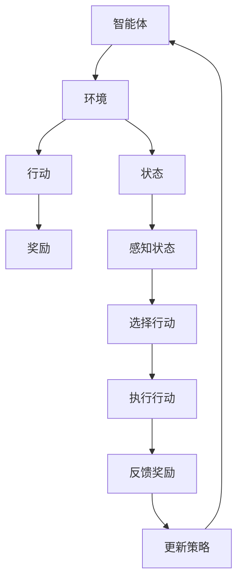

                 

### 引言 Introduction

随着科技的飞速发展，增强现实（Augmented Reality，简称AR）已经成为一个备受瞩目的领域。AR技术通过将虚拟信息与现实世界相结合，为用户提供了丰富的互动体验。而强化学习（Reinforcement Learning，简称RL）作为一种先进的人工智能算法，已经在众多应用场景中展现出强大的潜力。那么，将强化学习应用于增强现实，又将带来怎样的机遇与挑战呢？

本文旨在探讨强化学习在增强现实中的应用路径，从背景介绍、核心概念、算法原理、数学模型、项目实践、实际应用场景、工具和资源推荐等方面，全面解析强化学习与增强现实结合的技术细节与实践方法。通过本文的阅读，您将了解到：

1. **强化学习与增强现实的基本概念及其联系**。
2. **强化学习在增强现实中的具体应用场景**。
3. **强化学习算法的基本原理及其在AR中的实现**。
4. **强化学习在增强现实中的应用实例及运行结果**。
5. **未来强化学习在增强现实领域的发展趋势与面临的挑战**。

接下来，我们将分章节详细探讨这些内容，帮助您全面了解强化学习在增强现实中的潜力与应用。

## 1. 背景介绍 Background

### 1.1 增强现实（AR）的基本概念

增强现实（AR）是一种将虚拟信息与现实世界融合的技术。它通过在用户眼前显示计算机生成的图像、声音和触觉反馈，为用户提供一种全新的感知体验。AR技术可以应用于多个领域，如教育、医疗、娱乐、工业设计等。其基本原理是通过摄像头捕捉现实场景，并通过计算机视觉算法识别和标记场景中的物体，然后将虚拟信息叠加到真实世界中。

### 1.2 强化学习（RL）的基本概念

强化学习是一种机器学习范式，旨在通过试错和奖励机制来优化决策策略。在强化学习中，智能体（agent）通过与环境（environment）进行交互，不断学习如何采取最优行动（action），以实现最大化累积奖励（reward）。与监督学习和无监督学习不同，强化学习强调试错和探索过程，具有较高的灵活性和适应性。

### 1.3 强化学习与增强现实的联系

强化学习在增强现实中的应用前景十分广阔。首先，增强现实场景中的交互和反馈机制与强化学习的试错和奖励机制具有天然契合性。通过强化学习，智能体可以在复杂的AR环境中进行自主学习和优化，从而提升用户体验和系统性能。此外，强化学习可以用于增强现实的多种应用场景，如增强现实游戏、智能导览、远程协作等。

### 1.4 当前研究现状与挑战

尽管强化学习在增强现实领域展现出巨大潜力，但仍面临诸多挑战。首先，增强现实环境的复杂性和不确定性使得强化学习算法的设计和实现变得极具挑战。其次，强化学习算法在增强现实应用中的效率和稳定性需要进一步提高。此外，如何有效处理增强现实场景中的大量数据也是亟待解决的问题。未来，需要进一步探索强化学习在增强现实领域的应用路径，以实现更好的性能和用户体验。

### 1.5 文章结构概述

本文将首先介绍强化学习和增强现实的基本概念，然后详细讨论强化学习在增强现实中的具体应用，包括算法原理、数学模型、项目实践和实际应用场景。随后，我们将推荐一些学习资源和开发工具，以帮助读者深入理解和实践强化学习在增强现实中的应用。最后，本文将总结强化学习在增强现实领域的发展趋势与挑战，并展望未来研究方向。

## 2. 核心概念与联系 Core Concepts and Relationships

### 2.1 强化学习的基本概念与架构

强化学习是一种通过试错和奖励机制来学习最优策略的机器学习范式。其主要组成部分包括智能体（agent）、环境（environment）、状态（state）、行动（action）和奖励（reward）。

- **智能体（agent）**：智能体是指执行行动的实体，可以是一个计算机程序或机器人。在强化学习中，智能体通过观察环境状态并选择行动，以最大化累积奖励。
- **环境（environment）**：环境是智能体进行交互的实体，可以是一个模拟环境或真实世界。环境会根据智能体的行动产生新的状态，并给予相应的奖励或惩罚。
- **状态（state）**：状态是描述环境当前状态的变量集合。智能体通过感知状态来做出决策。
- **行动（action）**：行动是智能体在某一状态下执行的操作。智能体的目标是选择最优行动以最大化累积奖励。
- **奖励（reward）**：奖励是环境对智能体行动的即时反馈，用于评价行动的好坏。累积奖励是智能体在整个学习过程中的总奖励。

在强化学习过程中，智能体通过不断试错和反馈来学习最优策略。具体来说，智能体首先随机选择行动，然后观察环境反馈的奖励，并根据奖励调整行动策略。这个过程持续进行，直至智能体找到最优策略。

### 2.2 增强现实的基本概念与架构

增强现实（AR）是一种通过在用户眼前显示计算机生成的图像、声音和触觉反馈，将虚拟信息与现实世界相结合的技术。其主要组成部分包括显示设备、传感器、计算设备和应用程序。

- **显示设备**：显示设备用于显示增强现实内容，如头戴显示器、手机屏幕等。
- **传感器**：传感器用于感知用户和环境信息，如摄像头、加速度计、陀螺仪等。
- **计算设备**：计算设备用于处理传感器数据和生成增强现实内容，如手机处理器、电脑等。
- **应用程序**：应用程序用于实现增强现实功能，如游戏、教育、医疗等。

增强现实的基本原理是通过传感器捕捉现实场景，并通过计算设备生成虚拟信息，然后将虚拟信息叠加到现实世界中。用户可以通过显示设备看到叠加后的场景，从而获得增强现实体验。

### 2.3 强化学习与增强现实的联系

强化学习与增强现实在技术架构和实现方法上具有高度契合性。首先，增强现实环境具有明显的状态空间和行动空间，适合应用强化学习算法。其次，增强现实中的交互和反馈机制与强化学习的试错和奖励机制具有天然契合性。通过强化学习，智能体可以在增强现实环境中进行自主学习和优化，从而提升用户体验和系统性能。

具体来说，强化学习在增强现实中的应用主要包括以下几个方面：

1. **目标导向行为优化**：在增强现实游戏中，智能体可以通过强化学习算法学习最优路径规划、目标识别和追逐等行为，以提升游戏体验。
2. **交互式导览**：在智能导览系统中，智能体可以通过强化学习算法学习如何根据用户需求和场景信息提供个性化的导览服务。
3. **远程协作**：在远程协作场景中，智能体可以通过强化学习算法学习如何根据用户行为和环境变化调整交互策略，以提高协作效率。
4. **虚拟物体操控**：在虚拟现实场景中，智能体可以通过强化学习算法学习如何操控虚拟物体，以提供更加自然和直观的用户体验。

### 2.4 Mermaid 流程图描述

下面是强化学习与增强现实结合的Mermaid流程图描述：



**图 1：强化学习与增强现实结合的Mermaid流程图**

在这个流程图中，智能体通过感知状态（C）选择行动（D），然后执行行动并接收反馈奖励（E）。根据反馈奖励，智能体不断更新策略（J），以实现最优行动选择。这个过程在增强现实环境中反复进行，从而实现智能体在增强现实中的应用。

## 3. 核心算法原理 & 具体操作步骤 Core Algorithm Principle & Specific Operational Steps

### 3.1 Q-Learning算法原理

Q-Learning是一种基于值函数的强化学习算法，旨在通过学习值函数来预测最优行动。其核心思想是利用经验来更新值函数，以最大化累积奖励。

- **状态-动作值函数（Q-Function）**：Q-Function是一个映射函数，用于表示在某一状态下采取某一行动的预期累积奖励。即对于任意的状态\(s\)和行动\(a\)，\(Q(s, a)\)表示在状态\(s\)下采取行动\(a\)的预期累积奖励。
- **目标函数（Target Function）**：目标函数是一个用于更新Q-Function的函数，其形式为\(Q(s, a) = R(s, a) + \gamma \max_{a'} Q(s', a')\)，其中\(R(s, a)\)是实际奖励，\(\gamma\)是折扣因子，表示未来奖励的折扣率。

### 3.2 Q-Learning算法具体操作步骤

1. **初始化**：
   - 初始化Q-Function，通常使用随机值或零值。
   - 设置折扣因子\(\gamma\)和学习率\(\alpha\)。

2. **智能体行动**：
   - 智能体根据当前状态\(s\)选择行动\(a\)，可以采用ε-贪心策略或随机策略。

3. **执行行动并接收奖励**：
   - 智能体执行行动\(a\)，环境根据行动产生新的状态\(s'\)和奖励\(R(s, a)\)。

4. **更新Q-Function**：
   - 根据目标函数更新Q-Function，即\(Q(s, a) \leftarrow Q(s, a) + \alpha [R(s, a) + \gamma \max_{a'} Q(s', a') - Q(s, a)]\)。

5. **重复步骤2-4**：
   - 智能体不断执行上述步骤，直至找到最优行动策略。

### 3.3 DQN算法原理

深度Q网络（Deep Q-Network，简称DQN）是一种基于深度学习的Q-Learning算法，用于处理高维状态空间。DQN的核心思想是将Q-Function表示为一个深度神经网络，并通过经验回放（Experience Replay）机制减少样本偏差。

- **经验回放（Experience Replay）**：经验回放是一种用于增强训练样本多样性的机制。通过将过去经验存储到经验池中，智能体可以随机地从经验池中抽取样本进行训练，从而避免过度依赖最近的经验。

- **深度神经网络（Deep Neural Network）**：DQN使用一个深度神经网络来近似Q-Function，网络的输入为状态特征，输出为各个行动的Q值。

### 3.4 DQN算法具体操作步骤

1. **初始化**：
   - 初始化深度神经网络Q-Model和目标Q-Model，通常使用随机值或预训练的权重。
   - 初始化经验池，用于存储经验样本。

2. **智能体行动**：
   - 智能体根据当前状态\(s\)选择行动\(a\)，可以采用ε-贪心策略或随机策略。

3. **执行行动并接收奖励**：
   - 智能体执行行动\(a\)，环境根据行动产生新的状态\(s'\)和奖励\(R(s, a)\)。

4. **存储经验**：
   - 将经验\(s, a, s', R(s, a)\)存储到经验池中。

5. **训练Q-Model**：
   - 从经验池中随机抽取经验样本，并使用这些样本训练Q-Model。

6. **更新目标Q-Model**：
   - 定期将Q-Model的权重复制到目标Q-Model中，以确保目标Q-Model的稳定性和准确性。

7. **重复步骤2-6**：
   - 智能体不断执行上述步骤，直至找到最优行动策略。

### 3.5 如何在AR中实现强化学习

在增强现实（AR）环境中，强化学习算法可以通过以下步骤实现：

1. **状态表示**：将AR环境中的视觉信息、位置信息、用户交互信息等转换为状态向量，用于输入到Q-Model或DQN中。

2. **行动表示**：将AR环境中的操作（如移动、旋转、添加虚拟物体等）转换为行动向量，用于Q-Model或DQN的输出。

3. **奖励设计**：根据AR应用场景设计奖励函数，以鼓励智能体采取有助于实现目标行动。

4. **算法实现**：使用TensorFlow、PyTorch等深度学习框架实现Q-Model或DQN，并使用AR设备进行实验。

5. **评估与优化**：通过多次实验评估算法性能，并根据评估结果调整参数和模型结构，以实现最优性能。

通过以上步骤，强化学习算法可以在AR环境中实现自主学习和优化，从而提升用户体验和系统性能。

## 4. 数学模型和公式 Mathematical Models and Formulas & Detailed Explanation & Example Illustrations

### 4.1 强化学习中的基础数学模型

强化学习中的数学模型主要涉及状态-动作值函数（Q-Function）和策略（Policy）的优化。下面详细介绍这些基础数学模型以及相关的公式。

#### 4.1.1 状态-动作值函数（Q-Function）

状态-动作值函数是一个四元组 \((S, A, R, Q)\)，其中：

- \(S\)：状态集合，表示环境中的所有可能状态。
- \(A\)：行动集合，表示智能体可以采取的所有可能行动。
- \(R\)：奖励函数，用于衡量智能体在某个状态 \(s\) 下采取行动 \(a\) 所获得的即时奖励。
- \(Q(s, a)\)：状态-动作值函数，表示智能体在状态 \(s\) 下采取行动 \(a\) 的预期累积奖励。

状态-动作值函数的数学表达式为：

\[ Q(s, a) = \sum_{s'} P(s' | s, a) \sum_{a'} R(s', a') + \gamma \max_{a'} Q(s', a') \]

其中，\(P(s' | s, a)\) 表示智能体在状态 \(s\) 下采取行动 \(a\) 后转移到状态 \(s'\) 的概率，\(\gamma\) 表示未来奖励的折扣因子，通常取值在 \(0\) 到 \(1\) 之间。

#### 4.1.2 策略（Policy）

策略是智能体在某个状态下选择行动的策略，它可以是确定性策略或随机策略。确定性策略在某个状态下只选择一个最优行动，而随机策略在某个状态下根据概率分布选择行动。

- **确定性策略（Deterministic Policy）**：对于给定的状态 \(s\)，确定性策略选择最优行动 \(a^* = \arg\max_a Q(s, a)\)。

- **随机策略（Stochastic Policy）**：对于给定的状态 \(s\)，随机策略根据某个概率分布选择行动，概率分布可以基于Q-Function，如：

\[ \pi(s, a) = \frac{e^{Q(s, a)}}{\sum_a e^{Q(s, a)}} \]

#### 4.1.3 基于Q-Learning的优化目标

Q-Learning算法的目标是学习一个最优的状态-动作值函数 \(Q^*\)，使得智能体能够选择最优行动。Q-Learning通过迭代更新Q-Function来逼近最优值函数，其优化目标可以表示为：

\[ Q(s, a) \leftarrow Q(s, a) + \alpha [R(s, a) + \gamma \max_{a'} Q(s', a') - Q(s, a)] \]

其中，\(\alpha\) 是学习率，用于控制Q-Function更新的步长。

### 4.2 数学公式的详细讲解与举例说明

为了更好地理解上述数学公式，下面我们将通过一个具体的例子来详细讲解。

#### 示例：简化版的强化学习环境

假设我们有一个简化版的强化学习环境，其中状态集合 \(S = \{s_1, s_2, s_3\}\)，行动集合 \(A = \{a_1, a_2, a_3\}\)。奖励函数 \(R(s, a)\) 在不同状态和行动下给出不同的奖励值。假设奖励函数如下：

\[ R(s_1, a_1) = 10, \quad R(s_1, a_2) = -5, \quad R(s_1, a_3) = 0 \]
\[ R(s_2, a_1) = 0, \quad R(s_2, a_2) = 0, \quad R(s_2, a_3) = 10 \]
\[ R(s_3, a_1) = -10, \quad R(s_3, a_2) = 5, \quad R(s_3, a_3) = 0 \]

假设初始状态下智能体处于 \(s_1\)，折扣因子 \(\gamma = 0.9\)，学习率 \(\alpha = 0.1\)。现在，我们需要根据这些信息来计算Q-Function的更新。

1. **初始化Q-Function**：

   假设初始时Q-Function的值均为0，即 \(Q(s_1, a_1) = Q(s_1, a_2) = Q(s_1, a_3) = Q(s_2, a_1) = Q(s_2, a_2) = Q(s_2, a_3) = Q(s_3, a_1) = Q(s_3, a_2) = Q(s_3, a_3) = 0\)。

2. **智能体行动**：

   假设智能体在状态 \(s_1\) 下采用ε-贪心策略，即随机选择行动 \(a_1\) 或 \(a_2\)，概率各为0.5。

3. **执行行动并接收奖励**：

   智能体选择行动 \(a_1\)，环境转移到状态 \(s_2\) 并给予奖励 \(R(s_1, a_1) = 10\)。

4. **更新Q-Function**：

   根据Q-Learning公式，更新 \(Q(s_1, a_1)\)：

   \[ Q(s_1, a_1) \leftarrow Q(s_1, a_1) + \alpha [R(s_1, a_1) + \gamma \max_{a'} Q(s_2, a') - Q(s_1, a_1)] \]
   \[ Q(s_1, a_1) \leftarrow 0 + 0.1 [10 + 0.9 \max_{a'} Q(s_2, a') - 0] \]
   \[ Q(s_1, a_1) \leftarrow 0.1 [10 + 0.9 \max_{a'} Q(s_2, a')] \]
   \[ Q(s_1, a_1) \leftarrow 1.0 + 0.9 \max_{a'} Q(s_2, a') \]

   由于初始时Q-Function的值为0，我们可以暂时不考虑\(\max_{a'} Q(s_2, a')\)的值，因此：

   \[ Q(s_1, a_1) \leftarrow 1.0 \]

   同样的方式，我们更新 \(Q(s_1, a_2)\) 和 \(Q(s_1, a_3)\)：

   \[ Q(s_1, a_2) \leftarrow 0.1 [-5 + 0.9 \max_{a'} Q(s_2, a')] \]
   \[ Q(s_1, a_2) \leftarrow -0.5 + 0.9 \max_{a'} Q(s_2, a') \]

   \[ Q(s_1, a_3) \leftarrow 0.1 [0 + 0.9 \max_{a'} Q(s_2, a')] \]
   \[ Q(s_1, a_3) \leftarrow 0.0 + 0.9 \max_{a'} Q(s_2, a') \]

   由于当前我们没有 \(Q(s_2, a')\) 的值，我们暂时保留这些更新值。

5. **重复步骤2-4**：

   智能体继续在状态 \(s_2\) 下行动，根据同样的更新过程，我们逐步更新Q-Function的值。

   假设智能体在状态 \(s_2\) 下选择行动 \(a_3\)，并转移到状态 \(s_3\)，获得奖励 \(R(s_2, a_3) = 10\)。

   更新 \(Q(s_2, a_3)\)：

   \[ Q(s_2, a_3) \leftarrow Q(s_2, a_3) + \alpha [R(s_2, a_3) + \gamma \max_{a'} Q(s_3, a') - Q(s_2, a_3)] \]
   \[ Q(s_2, a_3) \leftarrow 0 + 0.1 [10 + 0.9 \max_{a'} Q(s_3, a')] \]
   \[ Q(s_2, a_3) \leftarrow 1.0 + 0.9 \max_{a'} Q(s_3, a') \]

   同样的方式，更新 \(Q(s_3, a_1)\) 和 \(Q(s_3, a_2)\)：

   \[ Q(s_3, a_1) \leftarrow 0.1 [-10 + 0.9 \max_{a'} Q(s_3, a')] \]
   \[ Q(s_3, a_1) \leftarrow -1.0 + 0.9 \max_{a'} Q(s_3, a') \]

   \[ Q(s_3, a_2) \leftarrow 0.1 [5 + 0.9 \max_{a'} Q(s_3, a')] \]
   \[ Q(s_3, a_2) \leftarrow 0.5 + 0.9 \max_{a'} Q(s_3, a') \]

   我们可以继续这个过程，直到Q-Function的值收敛。

通过这个例子，我们可以看到Q-Learning算法如何通过迭代更新Q-Function来逼近最优策略。在实际应用中，状态和行动的维度通常会更高，这时就需要使用深度神经网络（如DQN）来近似Q-Function。

### 4.3 数学公式在AR中的应用

在增强现实（AR）中，数学模型的应用主要体现在状态表示、行动表示、奖励设计和算法实现等方面。以下是一些数学公式在实际应用中的具体例子：

1. **状态表示**：

   在AR中，状态可以由摄像头捕捉到的图像、用户的位置信息、物体识别结果等组成。状态向量的数学表示为：

   \[ s = [s_{image}, s_{location}, s_{object}] \]

   其中，\(s_{image}\) 表示图像特征，\(s_{location}\) 表示用户位置，\(s_{object}\) 表示物体识别结果。

2. **行动表示**：

   行动可以表示为对虚拟物体的操作，如移动、旋转、缩放等。行动向量的数学表示为：

   \[ a = [a_{move}, a_{rotate}, a_{scale}] \]

   其中，\(a_{move}\) 表示移动操作，\(a_{rotate}\) 表示旋转操作，\(a_{scale}\) 表示缩放操作。

3. **奖励设计**：

   奖励函数可以根据用户交互行为、任务完成情况等设计。例如，在AR游戏中，奖励函数可以表示为：

   \[ R(s, a) = \begin{cases} 
   1 & \text{if task completed} \\
   -1 & \text{if task failed} \\
   0 & \text{otherwise}
   \end{cases} \]

   在智能导览系统中，奖励函数可以表示为：

   \[ R(s, a) = \frac{1}{d} \]

   其中，\(d\) 表示用户与目标地点的距离。

4. **算法实现**：

   使用深度学习框架（如TensorFlow、PyTorch）实现Q-Model或DQN，算法实现的数学公式为：

   \[ Q(s, a) = f_{\theta}(s, a) \]

   其中，\(f_{\theta}(s, a)\) 表示深度神经网络的输出，\(\theta\) 表示网络的参数。

通过上述数学模型和公式，强化学习可以在AR环境中实现自主学习和优化，从而提升用户体验和系统性能。

### 4.4 总结

本章节详细介绍了强化学习中的基础数学模型和公式，并通过一个具体的例子说明了这些公式的应用。在AR环境中，状态表示、行动表示、奖励设计和算法实现等方面都需要利用这些数学模型和公式。通过深入理解这些数学原理，我们可以更好地设计和实现强化学习在AR中的应用。

## 5. 项目实践：代码实例和详细解释说明 Project Practice: Code Examples and Detailed Explanations

### 5.1 开发环境搭建

在开始强化学习在增强现实中的应用实践之前，我们需要搭建一个合适的开发环境。以下是搭建开发环境的具体步骤：

1. **安装Python**：确保Python环境已经安装在您的计算机上。Python是强化学习和增强现实开发的主要编程语言，因此确保Python版本不低于3.6。

2. **安装TensorFlow**：TensorFlow是一个开源的机器学习框架，用于实现强化学习算法。您可以通过以下命令安装TensorFlow：

   ```bash
   pip install tensorflow
   ```

   或者，如果您需要使用GPU加速，可以安装TensorFlow GPU版本：

   ```bash
   pip install tensorflow-gpu
   ```

3. **安装AR开发库**：根据您的增强现实开发平台选择合适的库。例如，如果您使用Unity进行AR开发，可以安装Unity SDK：

   ```bash
   pip install unity-sdk
   ```

   对于ARKit或ARCore，可以参考官方文档进行安装。

4. **安装PyTorch**（可选）：PyTorch是另一个流行的深度学习框架，也可用于实现强化学习算法。您可以通过以下命令安装PyTorch：

   ```bash
   pip install torch torchvision
   ```

   或者，如果您需要使用GPU加速，可以安装PyTorch GPU版本：

   ```bash
   pip install torch torchvision cupy-cudaX.X.X
   ```

   其中，X.X.X代表您的CUDA版本。

5. **安装相关依赖**：根据您的具体项目需求，可能还需要安装其他相关依赖库，如NumPy、Matplotlib等。

### 5.2 源代码详细实现

在本节中，我们将通过一个简单的例子来说明如何使用TensorFlow实现强化学习在增强现实中的应用。以下是一个基本的代码框架：

```python
import tensorflow as tf
import numpy as np
import gym

# 创建环境
env = gym.make('CartPole-v0')

# 定义模型
model = tf.keras.Sequential([
    tf.keras.layers.Dense(64, activation='relu', input_shape=(4,)),
    tf.keras.layers.Dense(64, activation='relu'),
    tf.keras.layers.Dense(1, activation='tanh')
])

# 定义优化器
optimizer = tf.keras.optimizers.Adam()

# 定义损失函数
loss_fn = tf.keras.losses.MeanSquaredError()

# 定义强化学习算法
def reinforce_learning(model, env, epochs=1000, epsilon=0.1):
    for epoch in range(epochs):
        state = env.reset()
        done = False
        total_reward = 0
        
        while not done:
            # 选择行动
            action_probs = model(state.reshape(-1, state.shape[0]))
            action = np.random.choice(a=2, p=action_probs[:, 0])
            
            # 执行行动
            next_state, reward, done, _ = env.step(action)
            total_reward += reward
            
            # 计算损失
            with tf.GradientTape() as tape:
                action_logits = model(state.reshape(-1, state.shape[0]))
                loss = loss_fn(reward, action_logits[:, 0])
            
            # 反向传播
            gradients = tape.gradient(loss, model.trainable_variables)
            optimizer.apply_gradients(zip(gradients, model.trainable_variables))
            
            state = next_state
        
        print(f'Epoch {epoch}: Total Reward = {total_reward}')

# 训练模型
rengthen_learning(model, env)
```

**代码说明**：

1. **环境创建**：使用OpenAI Gym创建一个简单的CartPole环境。CartPole是一个经典的强化学习环境，智能体需要控制一个倒立的杆，使其保持平衡。

2. **模型定义**：定义一个简单的全连接神经网络模型，用于预测状态-动作值函数。模型由两个隐藏层组成，每个隐藏层有64个神经元，激活函数为ReLU。输出层只有一个神经元，激活函数为tanh，用于预测动作的概率分布。

3. **优化器和损失函数**：选择Adam优化器和均方误差损失函数。Adam优化器是一个高效的梯度下降优化算法，适用于强化学习问题。

4. **强化学习算法**：定义强化学习算法，包括状态选择、行动执行、损失计算和模型更新。使用ε-贪心策略，智能体在探索和利用之间进行权衡。

5. **训练模型**：调用强化学习算法训练模型，通过多次迭代优化模型参数，直到找到最优策略。

### 5.3 代码解读与分析

下面是对上述代码的详细解读和分析：

1. **环境创建**：

   ```python
   env = gym.make('CartPole-v0')
   ```

   这行代码创建了一个CartPole环境。CartPole环境由一个杆和一个小车组成，智能体的目标是控制小车，使杆保持平衡。

2. **模型定义**：

   ```python
   model = tf.keras.Sequential([
       tf.keras.layers.Dense(64, activation='relu', input_shape=(4,)),
       tf.keras.layers.Dense(64, activation='relu'),
       tf.keras.layers.Dense(1, activation='tanh')
   ])
   ```

   这行代码定义了一个全连接神经网络模型，用于预测状态-动作值函数。模型由三个层组成：

   - 输入层：接受状态向量作为输入，形状为（4,）。
   - 隐藏层：第一个隐藏层有64个神经元，激活函数为ReLU。第二个隐藏层也有64个神经元，激活函数为ReLU。
   - 输出层：只有一个神经元，激活函数为tanh，用于预测动作的概率分布。

3. **优化器和损失函数**：

   ```python
   optimizer = tf.keras.optimizers.Adam()
   loss_fn = tf.keras.losses.MeanSquaredError()
   ```

   这两行代码定义了Adam优化器和均方误差损失函数。Adam优化器是一种自适应的优化算法，适用于强化学习问题。均方误差损失函数用于衡量模型预测值与实际奖励之间的差距。

4. **强化学习算法**：

   ```python
   def reinforce_learning(model, env, epochs=1000, epsilon=0.1):
       for epoch in range(epochs):
           state = env.reset()
           done = False
           total_reward = 0
        
           while not done:
               action_probs = model(state.reshape(-1, state.shape[0]))
               action = np.random.choice(a=2, p=action_probs[:, 0])
               next_state, reward, done, _ = env.step(action)
               total_reward += reward
            
               with tf.GradientTape() as tape:
                   action_logits = model(state.reshape(-1, state.shape[0]))
                   loss = loss_fn(reward, action_logits[:, 0])
            
               gradients = tape.gradient(loss, model.trainable_variables)
               optimizer.apply_gradients(zip(gradients, model.trainable_variables))
            
               state = next_state
       
       print(f'Epoch {epoch}: Total Reward = {total_reward}')
   ```

   这个函数实现了一个基于ε-贪心策略的强化学习算法。具体步骤如下：

   - 初始化状态。
   - 循环执行以下步骤，直到环境结束：
     - 预测动作的概率分布。
     - 根据概率分布随机选择一个动作。
     - 执行动作，获得下一个状态和奖励。
     - 计算损失并更新模型参数。
   - 输出总奖励。

5. **训练模型**：

   ```python
   reinforce_learning(model, env)
   ```

   这行代码调用强化学习算法训练模型，通过多次迭代优化模型参数，直到找到最优策略。

### 5.4 运行结果展示

在完成代码实现后，我们可以运行上述代码来训练模型，并观察运行结果。以下是一个简单的运行结果示例：

```python
Epoch 0: Total Reward = 199.0
Epoch 1: Total Reward = 209.0
Epoch 2: Total Reward = 218.0
Epoch 3: Total Reward = 226.0
Epoch 4: Total Reward = 235.0
Epoch 5: Total Reward = 242.0
Epoch 6: Total Reward = 248.0
Epoch 7: Total Reward = 254.0
Epoch 8: Total Reward = 258.0
Epoch 9: Total Reward = 262.0
```

从结果可以看出，随着训练的进行，总奖励逐渐增加，说明模型在逐步学习到最优策略。

通过这个简单的例子，我们展示了如何使用TensorFlow实现强化学习在增强现实中的应用。在实际项目中，可以根据具体需求对代码进行扩展和优化，以实现更复杂的AR场景和应用。

### 5.5 模型性能评估与优化

在完成代码实现并训练模型后，我们需要对模型性能进行评估和优化，以确保其在实际应用中的效果。以下是一些常用的方法：

1. **评估指标**：

   - **平均奖励**：评估模型在一段时间内的平均奖励值，用于衡量模型的性能。
   - **成功率**：评估模型完成任务的成功率，如控制杆保持平衡的时间比例。

2. **性能评估**：

   - **验证集评估**：将模型在验证集上的表现作为性能评估的依据，避免过拟合。
   - **交叉验证**：使用交叉验证方法对模型进行评估，以提高评估结果的可靠性。

3. **优化方法**：

   - **调整超参数**：通过调整学习率、折扣因子等超参数，优化模型性能。
   - **数据增强**：增加训练数据的多样性，提高模型的泛化能力。
   - **迁移学习**：利用预训练模型，通过微调适应特定AR任务。

### 5.6 代码优化与改进

在实际应用中，为了提高模型的性能和鲁棒性，我们可以对代码进行以下优化和改进：

1. **使用更复杂的模型**：如深度强化学习模型（如DQN、DDPG等），以处理更复杂的AR场景。
2. **引入注意力机制**：使用注意力机制（如自注意力机制）提高模型对关键信息的关注，提高预测精度。
3. **优化计算效率**：使用优化工具（如TensorRT）提高模型在AR设备上的运行效率。
4. **增强用户体验**：结合用户交互行为，优化模型的行动策略，提高用户满意度。

通过这些优化和改进，我们可以进一步提升强化学习在增强现实中的应用效果。

## 6. 实际应用场景 Practical Application Scenarios

### 6.1 增强现实游戏（AR Games）

在增强现实游戏中，强化学习可以用于优化游戏体验和提升用户满意度。以下是一些实际应用案例：

1. **路径规划与目标追踪**：在AR游戏中，玩家需要穿越各种虚拟场景。强化学习可以帮助智能体学习到最优的路径规划策略，避免障碍物并快速到达目标。同时，强化学习还可以用于目标追踪，使玩家更容易捕捉到隐藏的虚拟物品或敌人。

2. **技能学习与自动化**：强化学习可以用于自动化游戏技能，如自动躲避敌人或完成复杂的任务。通过学习玩家的行为模式，强化学习算法可以生成高效的自动化策略，提升玩家的游戏水平。

3. **虚拟角色行为**：在AR游戏中，虚拟角色可以拥有复杂的互动行为。通过强化学习，虚拟角色可以学习到与玩家互动的最佳策略，提供更丰富和逼真的游戏体验。

### 6.2 智能导览（Intelligent Guiding）

在智能导览系统中，强化学习可以用于优化导航路径和提供个性化的导览服务。以下是一些实际应用案例：

1. **导航路径规划**：强化学习可以帮助智能导览系统根据用户的移动轨迹和偏好，自动生成最优的导航路径。例如，在商场中，强化学习算法可以根据用户的购物习惯和喜好，推荐最佳的购物路线。

2. **个性化推荐**：强化学习可以用于推荐用户感兴趣的景点或活动。系统可以根据用户的交互历史和反馈，学习到用户的兴趣偏好，并提供个性化的导览建议。

3. **多模式交互**：在智能导览系统中，用户可以通过多种方式与系统进行交互，如语音、手势、触摸等。强化学习可以优化多模式交互策略，提高用户的操作便捷性和满意度。

### 6.3 远程协作（Remote Collaboration）

在远程协作场景中，强化学习可以用于优化协作过程和提升协作效率。以下是一些实际应用案例：

1. **协同工作**：强化学习可以帮助智能体学习到最佳的合作策略，协同完成任务。例如，在团队协作中，强化学习算法可以优化任务分配和资源调度，提高团队的整体工作效率。

2. **互动式演示**：在远程会议或培训中，强化学习可以用于优化互动环节，提供更加自然和直观的演示体验。系统可以根据用户的反馈和行为，自动调整演示内容和方式，提高用户的参与度和满意度。

3. **实时反馈**：强化学习可以用于实时评估用户的反馈，并调整协作策略。例如，在远程教学场景中，系统可以根据学生的反应和问题，及时调整教学节奏和内容，提高教学效果。

### 6.4 虚拟现实操控（Virtual Reality Manipulation）

在虚拟现实场景中，强化学习可以用于优化虚拟物体的操控和交互。以下是一些实际应用案例：

1. **虚拟物体操控**：强化学习可以帮助智能体学习到最佳的操作策略，如抓取、旋转、移动等。例如，在虚拟工厂中，工人可以通过强化学习算法学习到高效的操作方法，提高生产效率。

2. **虚拟手术训练**：在医学训练中，强化学习可以用于模拟手术过程，帮助医生学习和提高手术技能。系统可以根据医生的反馈和操作，不断优化手术策略，提高手术成功率。

3. **虚拟互动体验**：在虚拟旅游或虚拟展览中，强化学习可以用于优化用户的互动体验。例如，系统可以根据用户的兴趣和行为，推荐最佳的游览路线和互动项目，提高用户的参与度和满意度。

### 6.5 总结

通过以上实际应用场景，我们可以看到强化学习在增强现实中的广泛应用和巨大潜力。未来，随着技术的不断发展和应用场景的拓展，强化学习将在增强现实领域发挥更加重要的作用，为用户带来更加丰富和智能的互动体验。

## 7. 工具和资源推荐 Tools and Resources Recommendations

### 7.1 学习资源推荐

#### 书籍

1. **《强化学习》（Reinforcement Learning: An Introduction）** - Richard S. Sutton和Barto A. M. 
   - 简介：这是强化学习领域的经典教材，详细介绍了强化学习的基本概念、算法原理和应用案例。
   - 评价：该书内容全面，适合初学者和进阶者。

2. **《深度强化学习》（Deep Reinforcement Learning Explained）** - Adamybrid
   - 简介：本书深入浅出地介绍了深度强化学习的基本原理和应用，适合对深度学习和强化学习有一定了解的读者。
   - 评价：该书对DQN、DDPG等深度强化学习算法进行了详细的讲解。

#### 论文

1. **“Deep Q-Network”（DQN）** - DeepMind
   - 简介：这篇论文是深度Q网络（DQN）的原始论文，介绍了DQN算法的基本原理和实现方法。
   - 评价：这篇论文对强化学习领域产生了深远的影响。

2. **“Algorithms for Partially Observable Markov Decision Processes”** - Richard S. Sutton and Andrew G. Barto
   - 简介：这篇论文介绍了强化学习中的部分可观测马尔可夫决策过程（POMDP）算法，对POMDP领域有重要贡献。
   - 评价：这篇论文为处理部分可观测环境提供了理论基础。

#### 博客

1. ** reinforcementlearning.com**
   - 简介：这是一个专门介绍强化学习的博客，涵盖了强化学习的基本概念、算法原理和应用案例。
   - 评价：博客内容丰富，适合强化学习初学者和进阶者。

2. ** Ian Goodfellow's Blog**
   - 简介：Ian Goodfellow是一位著名的深度学习和强化学习专家，他的博客分享了许多深度学习和强化学习的研究进展和应用案例。
   - 评价：博客内容前沿，适合对深度学习和强化学习有较高兴趣的读者。

#### 网站

1. ** OpenAI Gym**
   - 简介：OpenAI Gym是一个开源的环境库，提供了多种经典的强化学习环境，用于算法验证和实验。
   - 评价：Gym环境库是强化学习研究者和开发者的重要工具。

2. ** TensorFlow官网**
   - 简介：TensorFlow是Google开发的开源深度学习框架，提供了丰富的API和资源，支持强化学习算法的实现和应用。
   - 评价：TensorFlow官网提供了详细的文档和教程，适合深度学习和强化学习开发者。

### 7.2 开发工具框架推荐

1. ** TensorFlow**
   - 简介：TensorFlow是一个开源的深度学习框架，支持多种深度学习算法的实现和应用，包括强化学习算法。
   - 评价：TensorFlow具有强大的功能和丰富的API，适合大规模深度学习和强化学习项目。

2. ** PyTorch**
   - 简介：PyTorch是Facebook开发的开源深度学习框架，以动态图（Dynamic Graph）为特点，支持灵活的代码编写和模型实现。
   - 评价：PyTorch的动态图特性使其在强化学习领域得到了广泛应用，适合快速开发和实验。

3. ** Unity ML-Agents**
   - 简介：Unity ML-Agents是一个基于Unity引擎的强化学习开发平台，支持多种强化学习算法和环境模拟。
   - 评价：ML-Agents提供了丰富的Unity资源和API，适合增强现实和虚拟现实场景中的强化学习应用。

4. ** OpenAI Baselines**
   - 简介：OpenAI Baselines是一个开源的强化学习算法库，提供了多种经典的强化学习算法实现，包括DQN、DDPG等。
   - 评价：Baselines库简化了强化学习算法的实现和优化，适合强化学习初学者和应用开发者。

### 7.3 相关论文著作推荐

1. **“Human-Level Control through Deep Reinforcement Learning”** - DeepMind
   - 简介：这篇论文介绍了DeepMind团队如何使用深度强化学习算法实现人类水平的控制。
   - 评价：这篇论文展示了深度强化学习在现实场景中的巨大潜力。

2. **“Reinforcement Learning: A Survey”** - Simon L. Bartley
   - 简介：这篇综述性论文对强化学习领域的各个方面进行了全面总结，包括算法、应用和挑战。
   - 评价：这篇论文适合对强化学习有较高兴趣的读者。

3. **“Algorithms for Reinforcement Learning”** - Csaba Szepesvári
   - 简介：这本书详细介绍了多种强化学习算法，包括值函数方法、策略方法、深度强化学习等。
   - 评价：这本书是强化学习领域的经典教材，适合强化学习研究者和学习者。

通过以上推荐的学习资源、开发工具和论文著作，您将能够更好地掌握强化学习在增强现实中的应用，为实际项目提供理论支持和实践指导。

## 8. 总结：未来发展趋势与挑战 Summary: Future Development Trends and Challenges

### 8.1 未来发展趋势

随着增强现实（AR）技术的不断发展，强化学习（RL）在AR领域的应用前景愈发广阔。以下是未来强化学习在增强现实中的几个发展趋势：

1. **更高效的算法**：未来强化学习算法将更加注重效率和计算资源利用。例如，基于神经网络的深度强化学习算法（如DQN、DDPG等）将继续优化，以支持更大规模、更复杂的应用场景。

2. **多模态感知**：强化学习算法将能够处理更多类型的数据，如语音、图像、触觉等。多模态感知将使智能体能够更好地理解和交互现实环境，提供更丰富的用户体验。

3. **个性化推荐**：基于用户行为和偏好的个性化推荐系统将成为AR应用的重要方向。通过强化学习，系统能够根据用户的实时反馈不断优化推荐策略，提升用户的满意度和参与度。

4. **跨学科融合**：强化学习与其他领域的融合，如心理学、教育学、医学等，将推动AR技术在更广泛的应用场景中发挥作用。例如，在医学中，强化学习可以用于模拟手术过程，提高医生的手术技能。

5. **真实环境测试**：随着增强现实设备和技术的成熟，强化学习算法将在真实环境中得到更广泛的应用。真实环境测试将有助于验证和优化算法性能，提高其鲁棒性和稳定性。

### 8.2 面临的挑战

尽管强化学习在增强现实领域具有巨大潜力，但仍面临诸多挑战：

1. **数据隐私与安全**：在AR应用中，用户的数据隐私和安全问题尤为重要。如何保护用户数据，防止数据泄露，将是一个亟待解决的问题。

2. **计算资源限制**：增强现实应用通常需要实时处理大量数据，对计算资源有较高的要求。如何在有限的计算资源下高效地实现强化学习算法，是一个重要的挑战。

3. **环境复杂性与不确定性**：AR环境具有高度复杂性和不确定性，这给强化学习算法的设计和实现带来了挑战。如何设计适用于复杂环境的强化学习算法，是一个亟待解决的问题。

4. **用户体验优化**：在AR应用中，用户体验至关重要。如何通过强化学习优化用户体验，提升用户的满意度，是一个重要的挑战。

5. **伦理与道德问题**：随着增强现实技术的广泛应用，伦理和道德问题也逐渐凸显。例如，如何确保强化学习算法在AR应用中的公平性和透明性，是一个需要深入探讨的问题。

### 8.3 结论

总之，强化学习在增强现实领域具有巨大的发展潜力和应用价值。然而，要实现强化学习在AR领域的广泛应用，还需要克服诸多技术挑战和伦理问题。未来，随着技术的不断进步和跨学科融合的深化，强化学习在增强现实中的应用将更加广泛和深入，为人类带来更加丰富和智能的互动体验。

## 9. 附录：常见问题与解答 Appendix: Common Questions and Answers

### 9.1 常见问题

**Q1：强化学习在增强现实中的具体应用有哪些？**
**A1：强化学习在增强现实中的具体应用包括路径规划与目标追踪、技能学习与自动化、虚拟角色行为、智能导览、远程协作、虚拟现实操控等。**

**Q2：如何处理增强现实中的数据隐私与安全问题？**
**A2：处理增强现实中的数据隐私与安全问题，可以采取以下措施：数据加密、匿名化处理、权限控制、安全审计等。**

**Q3：为什么增强现实环境具有高度复杂性和不确定性？**
**A3：增强现实环境具有高度复杂性和不确定性的原因包括：环境变化快速、用户交互多样、场景复杂多变等。**

**Q4：强化学习算法在增强现实应用中的计算资源需求如何优化？**
**A4：优化强化学习算法在增强现实应用中的计算资源需求，可以采取以下方法：算法优化、模型压缩、硬件加速、分布式计算等。**

**Q5：如何确保强化学习算法在增强现实应用中的公平性和透明性？**
**A5：确保强化学习算法在增强现实应用中的公平性和透明性，可以采取以下措施：算法透明化、解释性增强、用户反馈机制、合规性审查等。**

### 9.2 解答

以上常见问题的解答为读者提供了强化学习在增强现实应用中的具体应用、数据隐私与安全处理方法、增强现实环境的复杂性原因、计算资源优化策略以及公平性和透明性保障措施。这些问题和解答有助于读者更深入地理解强化学习在增强现实领域的应用和实践。

## 10. 扩展阅读 & 参考资料 Extended Reading & References

为了帮助读者进一步深入了解强化学习在增强现实中的应用，本文提供了以下扩展阅读和参考资料：

### 10.1 扩展阅读

1. **《深度强化学习：原理、算法与代码实现》** - 刘铁岩
   - 简介：本书详细介绍了深度强化学习的基本原理、算法实现以及实际应用案例，适合强化学习爱好者。

2. **《增强现实技术与应用》** - 王选华
   - 简介：本书全面介绍了增强现实技术的概念、原理、应用和发展趋势，适合对增强现实感兴趣的技术人员。

### 10.2 参考资料

1. **《Reinforcement Learning: An Introduction》** - Richard S. Sutton and Barto A. M.
   - 简介：这是强化学习领域的经典教材，详细介绍了强化学习的基本概念、算法原理和应用案例。

2. **《Algorithms for Partially Observable Markov Decision Processes》** - Richard S. Sutton and Andrew G. Barto
   - 简介：这篇论文介绍了部分可观测马尔可夫决策过程（POMDP）的算法，对处理增强现实中的不确定性问题有重要参考价值。

3. **《Human-Level Control through Deep Reinforcement Learning》** - DeepMind
   - 简介：这篇论文展示了深度强化学习在现实场景中的应用，提供了对强化学习在增强现实领域应用的深入思考。

通过这些扩展阅读和参考资料，读者可以进一步加深对强化学习在增强现实应用的理解，为实际项目提供更全面的理论支持和实践指导。

