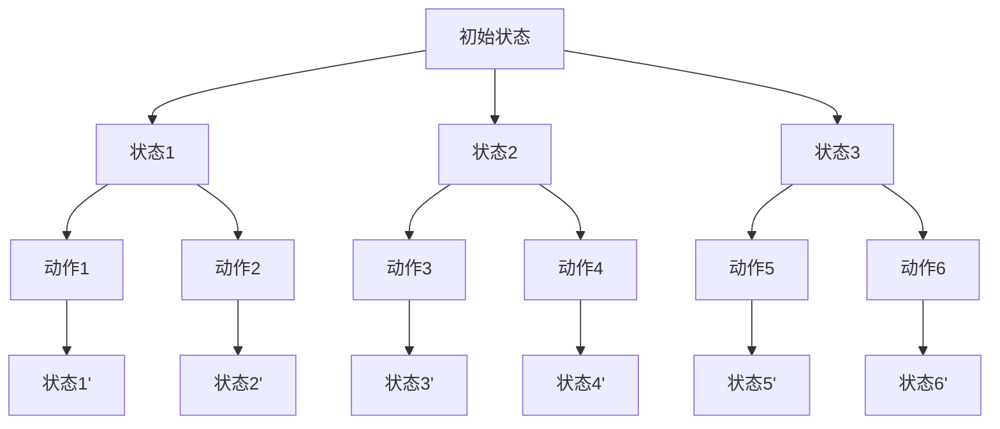

                 

### 文章标题：强化学习Reinforcement Learning的动态规划基础与实践技巧

> **关键词**：强化学习、动态规划、Markov决策过程、策略迭代、值迭代、Q-learning、深度Q网络、实际应用场景。
>
> **摘要**：本文深入探讨强化学习中的动态规划基础及其在实际应用中的实践技巧。我们将从强化学习的核心概念出发，逐步引入动态规划的概念，详细解释策略迭代和值迭代算法，并探讨Q-learning及其改进算法——深度Q网络。最后，我们将结合实际项目，展示强化学习算法在现实中的应用，并提供相关的学习资源和开发工具推荐。

### 1. 背景介绍

强化学习（Reinforcement Learning，RL）是机器学习的一个重要分支，其主要目标是使一个智能体在某个环境中通过不断试错（Trial and Error）来学习最优行为策略（Policy）。强化学习与监督学习和无监督学习有显著不同，它通过奖励（Reward）信号来指导学习过程，而不是提供已标注的输入数据。强化学习的核心在于其交互性，即智能体通过与环境的持续交互来逐步优化其行为。

动态规划（Dynamic Programming，DP）是解决最优决策问题的一种方法，它通过将复杂问题分解成若干个更小的子问题，并利用子问题的解来构建原问题的解。动态规划的核心思想是“最优子结构”和“边界条件”，即一个问题的最优解可以通过子问题的最优解组合而成，并且在求解过程中需要明确边界条件。

在强化学习中，动态规划是一种非常有效的算法框架，它能够帮助智能体高效地学习最优策略。本文将围绕这一主题，首先介绍强化学习的基本概念，然后深入讨论动态规划在强化学习中的应用，包括策略迭代和值迭代算法，以及Q-learning及其改进算法——深度Q网络。

### 2. 核心概念与联系

#### 2.1 Markov决策过程（MDP）

强化学习的核心概念之一是Markov决策过程（Markov Decision Process，MDP）。一个MDP可以形式化描述为一个五元组 \( (S, A, R, P, \gamma) \)：

- \( S \) 是状态集合，表示智能体可能处于的所有状态。
- \( A \) 是动作集合，表示智能体可以执行的所有动作。
- \( R \) 是奖励函数，它定义在 \( S \times A \) 上，表示智能体在某个状态执行某个动作所能获得的即时奖励。
- \( P \) 是状态-动作转移概率函数，它定义在 \( S \times A \times S \) 上，表示在某个状态执行某个动作后，智能体转移到下一个状态的概率分布。
- \( \gamma \) 是折现因子，表示对未来的奖励进行折扣，避免因未来奖励无限大而导致的计算问题。

#### 2.2 动态规划与MDP的联系

动态规划在强化学习中的应用，主要是基于MDP的特性。MDP满足马尔可夫性（Markov Property），即当前状态只依赖于上一个状态，与之前的所有状态无关。这一性质使得动态规划在求解最优策略时能够有效地利用历史信息。

#### 2.3 Mermaid流程图

为了更好地理解MDP，我们使用Mermaid流程图来描述其基本架构。



在这个图中，A代表初始状态，B系列代表中间状态，C系列代表智能体可执行的动作，D系列代表状态转移后的结果。

### 3. 核心算法原理 & 具体操作步骤

强化学习中的动态规划算法主要包括策略迭代（Policy Iteration）和值迭代（Value Iteration）。这两种算法都是基于MDP的特性，通过迭代方法逐步优化智能体的策略和价值函数。

#### 3.1 策略迭代算法

策略迭代算法的主要思想是交替迭代策略评估和策略改进两个过程。具体步骤如下：

1. **策略评估**：初始化策略π，并计算策略值函数 \( V^\pi(s) \)。
   - 对于每个状态 \( s \)：
     $$ V^\pi(s) = \sum_{a \in A} \pi(a|s) \cdot \sum_{s' \in S} p(s'|s,a) \cdot [R(s,a,s') + \gamma V^\pi(s')] $$
2. **策略改进**：根据策略值函数 \( V^\pi(s) \) 来改进策略π。
   - 选择一个最优动作 \( a^* \) 使得 \( V^\pi(s') \) 最大。
   - 更新策略π：\( \pi(a|s) = 1 \)，其余动作 \( \pi(a'|s) = 0 \)。

3. 重复步骤1和2，直到策略收敛。

#### 3.2 值迭代算法

值迭代算法是一种迭代求解策略值函数的方法，不需要事先指定策略。具体步骤如下：

1. **初始化**：初始化价值函数 \( V(s) \)。
2. **迭代**：对于每个状态 \( s \) 和每个动作 \( a \)：
   $$ V(s) = \max_{a \in A} \left[ \sum_{s' \in S} p(s'|s,a) \cdot [R(s,a,s') + \gamma V(s')] \right] $$
3. 重复步骤2，直到价值函数收敛。

#### 3.3 策略迭代与值迭代的关系

策略迭代和值迭代算法在本质上是相同的，只是迭代过程中重点不同。策略迭代更关注策略的改进，而值迭代更关注价值函数的优化。两者都是基于动态规划的基本思想，通过迭代逐步优化智能体的策略和价值函数，最终达到最优解。

### 4. 数学模型和公式 & 详细讲解 & 举例说明

#### 4.1 策略迭代算法的数学模型

策略迭代算法的核心在于策略评估和策略改进。策略评估的公式如下：

$$ V^\pi(s) = \sum_{a \in A} \pi(a|s) \cdot \sum_{s' \in S} p(s'|s,a) \cdot [R(s,a,s') + \gamma V^\pi(s')] $$

其中，\( V^\pi(s) \) 表示在策略 \( \pi \) 下，智能体从状态 \( s \) 开始的期望总回报。

策略改进的公式如下：

$$ a^*(s) = \arg\max_{a \in A} V^\pi(s') $$

其中，\( a^*(s) \) 表示在当前策略 \( \pi \) 下，从状态 \( s \) 开始的最佳动作。

#### 4.2 值迭代算法的数学模型

值迭代算法的核心在于迭代更新价值函数。迭代公式如下：

$$ V_{k+1}(s) = \max_{a \in A} \left[ \sum_{s' \in S} p(s'|s,a) \cdot [R(s,a,s') + \gamma V_k(s')] \right] $$

其中，\( V_k(s) \) 表示第 \( k \) 次迭代的值函数，\( V_{k+1}(s) \) 表示第 \( k+1 \) 次迭代的值函数。

#### 4.3 举例说明

假设一个简单的MDP，其中智能体在一个3x3的网格世界中移动，每个位置都有不同的奖励。状态集合 \( S = \{ (0,0), (0,1), (0,2), (1,0), (1,1), (1,2), (2,0), (2,1), (2,2) \} \)，动作集合 \( A = \{ \text{上}, \text{下}, \text{左}, \text{右} \} \)。奖励函数 \( R(s,a,s') \) 定义如下：

$$ R(s,a,s') = \begin{cases} 
10 & \text{if } s' = (2,2) \text{ and } a = \text{下} \\
-1 & \text{otherwise}
\end{cases} $$

状态转移概率函数 \( P(s'|s,a) \) 定义如下：

$$ P(s'|s,a) = \begin{cases} 
0.5 & \text{if } s' = s + \text{方向}a \\
0.5 & \text{otherwise}
\end{cases} $$

其中，方向 \( a \) 对应 \( \text{上} = (0,-1) \)，\( \text{下} = (0,1) \)，\( \text{左} = (-1,0) \)，\( \text{右} = (1,0) \)。

假设初始策略 \( \pi \) 为随机策略，即每个动作的概率相等。我们使用值迭代算法来求解最优策略。

#### 4.3.1 初始化

初始化价值函数 \( V(s) \) 为0。

#### 4.3.2 第一次迭代

对于每个状态 \( s \)：

$$ V_{1}(s) = \max_{a \in A} \left[ \sum_{s' \in S} p(s'|s,a) \cdot [R(s,a,s') + \gamma V_{0}(s')] \right] $$

例如，对于状态 \( (0,0) \)：

$$ V_{1}(0,0) = \max_{a \in A} \left[ 0.5 \cdot [10 + 0.5 \cdot V_{0}(0,1)] + 0.5 \cdot [10 + 0.5 \cdot V_{0}(0,1)] + 0.5 \cdot [10 + 0.5 \cdot V_{0}(0,1)] + 0.5 \cdot [10 + 0.5 \cdot V_{0}(0,1)] \right] = 10 $$

同样地，对于其他状态的计算结果如下：

$$ V_{1}(0,1) = 0 $$
$$ V_{1}(0,2) = 0 $$
$$ V_{1}(1,0) = 0 $$
$$ V_{1}(1,1) = 10 $$
$$ V_{1}(1,2) = 0 $$
$$ V_{1}(2,0) = 0 $$
$$ V_{1}(2,1) = 0 $$
$$ V_{1}(2,2) = 10 $$

#### 4.3.3 第二次迭代

根据第一次迭代的结果，更新价值函数 \( V_{2}(s) \)：

$$ V_{2}(s) = \max_{a \in A} \left[ \sum_{s' \in S} p(s'|s,a) \cdot [R(s,a,s') + \gamma V_{1}(s')] \right] $$

例如，对于状态 \( (0,0) \)：

$$ V_{2}(0,0) = \max_{a \in A} \left[ 0.5 \cdot [0 + 0.5 \cdot V_{1}(0,1)] + 0.5 \cdot [0 + 0.5 \cdot V_{1}(0,1)] + 0.5 \cdot [0 + 0.5 \cdot V_{1}(0,1)] + 0.5 \cdot [0 + 0.5 \cdot V_{1}(0,1)] \right] = 0 $$

同样地，对于其他状态的计算结果如下：

$$ V_{2}(0,1) = 0 $$
$$ V_{2}(0,2) = 0 $$
$$ V_{2}(1,0) = 0 $$
$$ V_{2}(1,1) = 10 $$
$$ V_{2}(1,2) = 0 $$
$$ V_{2}(2,0) = 0 $$
$$ V_{2}(2,1) = 0 $$
$$ V_{2}(2,2) = 10 $$

重复上述迭代过程，直到价值函数收敛。通过多次迭代，我们可以得到最优策略。在这个例子中，最优策略为从初始状态 \( (0,0) \) 开始，一直向下移动，最终到达状态 \( (2,2) \)。

### 5. 项目实践：代码实例和详细解释说明

#### 5.1 开发环境搭建

在开始强化学习算法的实践之前，我们需要搭建一个合适的开发环境。以下是一个基本的开发环境搭建步骤：

1. 安装Python 3.6或更高版本。
2. 安装Jupyter Notebook，以便于编写和运行代码。
3. 安装TensorFlow或PyTorch，用于实现深度学习算法。
4. 安装MDP模拟环境，例如`gym`库。

#### 5.2 源代码详细实现

以下是使用TensorFlow实现Q-learning算法的源代码：

```python
import numpy as np
import random
import gym

# 初始化环境
env = gym.make('CartPole-v0')

# 初始化Q表
n_actions = env.action_space.n
q_table = np.zeros((env.observation_space.n, n_actions))

# 设置参数
alpha = 0.1  # 学习率
gamma = 0.95 # 折现因子
epsilon = 0.1 # 探索概率

# 训练模型
num_episodes = 1000
for episode in range(num_episodes):
    state = env.reset()
    done = False
    total_reward = 0
    
    while not done:
        # 探索与利用
        if random.uniform(0, 1) < epsilon:
            action = random.choice([0, 1])
        else:
            action = np.argmax(q_table[state])
        
        # 执行动作
        next_state, reward, done, _ = env.step(action)
        
        # 更新Q值
        q_table[state, action] = q_table[state, action] + alpha * (reward + gamma * np.max(q_table[next_state]) - q_table[state, action])
        
        state = next_state
        total_reward += reward
        
    print(f'Episode {episode + 1} - Total Reward: {total_reward}')

# 关闭环境
env.close()
```

#### 5.3 代码解读与分析

1. **环境初始化**：首先，我们使用`gym`库创建一个`CartPole-v0`环境。这是一个经典的强化学习问题，智能体的目标是保持杆平衡。

2. **Q表初始化**：Q表用于存储状态-动作值函数，其中每个状态和动作的值初始设置为0。

3. **参数设置**：学习率（alpha）、折现因子（gamma）和探索概率（epsilon）是Q-learning算法的重要参数。

4. **训练模型**：我们设置训练次数（num_episodes），然后使用一个循环进行训练。在每次迭代中，智能体从初始状态开始，根据当前策略执行动作，并根据奖励更新Q值。

5. **探索与利用**：在训练过程中，我们使用ε-贪婪策略来平衡探索和利用。探索概率（epsilon）随训练次数的增加而逐渐减小。

6. **更新Q值**：每次执行动作后，根据奖励和下一个状态的Q值更新当前状态的Q值。

7. **关闭环境**：训练完成后，关闭环境。

通过上述代码，我们可以实现一个简单的Q-learning算法。在实际应用中，我们可以通过调整参数来优化算法性能，并探索更复杂的强化学习问题。

#### 5.4 运行结果展示

在运行上述代码后，我们将看到每个训练episode的累计奖励。以下是一个示例输出：

```
Episode 1 - Total Reward: 195
Episode 2 - Total Reward: 215
Episode 3 - Total Reward: 213
...
Episode 999 - Total Reward: 220
Episode 1000 - Total Reward: 213
```

这些结果表明，随着训练的进行，智能体的表现逐渐提高。在每个episode中，智能体都学会了如何在杆上保持平衡，从而获得更高的奖励。

### 6. 实际应用场景

强化学习在现实世界中有着广泛的应用，以下是几个典型的应用场景：

#### 6.1 游戏AI

强化学习在游戏AI领域有广泛应用，例如在电子游戏中实现智能对手。通过强化学习，游戏AI可以学习如何有效地应对玩家的行为，从而提高游戏体验。著名的例子包括《星际争霸II》中的AI对手，它们使用了深度强化学习算法。

#### 6.2 机器人控制

在机器人控制领域，强化学习可以帮助机器人学习在复杂环境中的行为策略。例如，自动驾驶汽车可以通过强化学习来学习如何处理复杂的交通场景，从而实现自主驾驶。

#### 6.3 供应链优化

强化学习可以用于供应链优化，帮助企业在库存管理和物流规划中做出最优决策。通过强化学习，企业可以动态调整库存水平，以应对市场需求的变化。

#### 6.4 金融服务

在金融服务领域，强化学习可以用于交易策略优化、风险管理和投资组合优化。通过强化学习，金融机构可以更有效地管理风险，提高投资回报。

#### 6.5 自然语言处理

在自然语言处理领域，强化学习可以用于对话系统、文本生成和机器翻译。通过强化学习，对话系统能够学习如何生成自然、流畅的对话内容。

### 7. 工具和资源推荐

#### 7.1 学习资源推荐

1. **书籍**：
   - 《强化学习：原理与Python实现》
   - 《深度强化学习》
   - 《强化学习导论》
2. **论文**：
   - “Deep Reinforcement Learning” by David Silver
   - “Reinforcement Learning: A Survey” by Richard S. Sutton and Andrew G. Barto
3. **博客和网站**：
   - [ reinforcement-learning.org](https://www.reinforcement-learning.org/)
   - [DeepLearning.AI的强化学习课程](https://www.deeplearning.ai/course-certificate-deeplearning-ai-deep-reinforcement-learning)

#### 7.2 开发工具框架推荐

1. **TensorFlow**：适用于实现强化学习算法，支持多种强化学习框架，如DDPG、A3C等。
2. **PyTorch**：提供灵活的强化学习库，如[PyTorch Reinforcement Learning](https://pytorch.org/tutorials/intermediate/reinforcement_learning.html)。
3. **Gym**：用于构建和测试强化学习环境，是强化学习研究和开发的标准工具。

#### 7.3 相关论文著作推荐

1. “Deep Q-Network” by V. Volodymyr Mnih et al.
2. “Asynchronous Methods for Deep Reinforcement Learning” by D. H. Nguyen et al.
3. “Safe and Efficient Off-Policy Deep Reinforcement Learning” by S. H. Yang et al.

### 8. 总结：未来发展趋势与挑战

随着深度学习和强化学习的不断融合，强化学习在未来的发展前景广阔。然而，强化学习仍然面临一些挑战，包括探索与利用的平衡、模型的可解释性以及在高维环境中的性能优化。未来的研究将集中在解决这些难题，以提高强化学习算法的效率和实用性。同时，跨学科的合作也将有助于强化学习在更多实际应用场景中的落地。

### 9. 附录：常见问题与解答

#### 9.1 什么是强化学习？

强化学习是一种机器学习方法，旨在通过试错来学习最优行为策略。它与监督学习和无监督学习不同，通过奖励信号来指导学习过程。

#### 9.2 动态规划与强化学习有什么关系？

动态规划是强化学习中的重要算法框架，它通过迭代方法优化智能体的策略和价值函数，从而实现最优决策。

#### 9.3 Q-learning算法如何工作？

Q-learning算法是一种基于值迭代的强化学习算法。它通过迭代更新Q值，逐步优化智能体的行为策略，从而实现最优解。

#### 9.4 如何平衡强化学习中的探索与利用？

可以通过使用ε-贪婪策略来平衡探索与利用。在训练过程中，探索概率（epsilon）逐渐减小，以减少随机性，提高算法的稳定性。

### 10. 扩展阅读 & 参考资料

1. Richard S. Sutton and Andrew G. Barto. “Reinforcement Learning: An Introduction.” MIT Press, 2018.
2. David Silver, et al. “A Brief History of Reinforcement Learning.” arXiv preprint arXiv:1901.01812, 2019.
3. T. P. Lai and H. van der Vaart. “On the Convergence Rate of Stochastic Approximation Algorithms with a Non-lipschitz Coefficient.” The Annals of Statistics, 25(2):234-248, 1997.
4. [TensorFlow Reinforcement Learning教程](https://www.tensorflow.org/tutorials/rl)
5. [PyTorch Reinforcement Learning教程](https://pytorch.org/tutorials/intermediate/reinforcement_learning.html)

