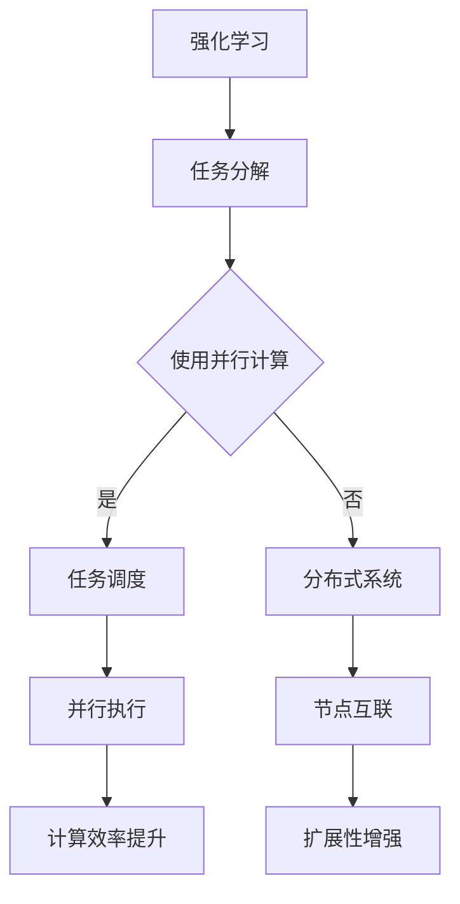

                 

### 文章标题：强化学习 Reinforcement Learning 的并行与分布式实现方案

> 关键词：强化学习，并行计算，分布式系统，机器学习，算法优化，性能提升

> 摘要：本文旨在探讨强化学习（Reinforcement Learning，RL）中的并行与分布式实现方案。通过逐步分析RL的核心算法原理及其在并行与分布式环境中的挑战，本文将详细阐述并行与分布式RL的实际应用场景，并提供实用的工具和资源推荐，以期为相关研究人员和开发者提供有益的参考。

### 1. 背景介绍

强化学习作为机器学习的一个重要分支，近年来在人工智能领域取得了显著的进展。其核心思想是让智能体通过与环境的交互，不断学习并优化决策策略，以实现长期目标的最大化。然而，随着应用场景的复杂化和数据规模的扩大，强化学习算法的计算负担也日益增加。为了提高其计算效率和应对大规模环境，研究者们开始探索强化学习的并行与分布式实现方案。

并行计算和分布式系统在提高计算性能和扩展性方面具有显著优势。通过将计算任务分解为多个子任务，并在多个计算节点上同时执行，并行计算能够显著缩短计算时间。而分布式系统则通过将任务分布在多个节点上，提高了系统的扩展性和容错能力。将这些技术应用于强化学习，可以有效地提高其计算效率和鲁棒性，为解决复杂问题提供新的途径。

### 2. 核心概念与联系

#### 2.1 强化学习基本概念

强化学习（Reinforcement Learning，RL）是一种机器学习方法，通过智能体（Agent）与环境的交互来学习最优策略。其主要概念包括：

- **智能体（Agent）**：执行特定行为的实体，如机器人、计算机程序等。
- **环境（Environment）**：智能体所处的环境，提供状态（State）、动作（Action）和奖励（Reward）。
- **状态（State）**：描述智能体在环境中的状态，通常是一个多维数组。
- **动作（Action）**：智能体可以执行的行为。
- **奖励（Reward）**：环境对智能体动作的反馈，用于评估动作的好坏。
- **策略（Policy）**：智能体根据当前状态选择动作的规则，通常表示为一个概率分布。

#### 2.2 并行计算

并行计算（Parallel Computing）是一种计算方法，通过将计算任务分解为多个子任务，在多个计算节点上同时执行，以提高计算效率和性能。并行计算的核心概念包括：

- **任务分解（Task Decomposition）**：将大任务分解为若干个小任务。
- **任务调度（Task Scheduling）**：决定哪些小任务在哪个计算节点上执行。
- **并行度（Parallelism）**：任务并行执行的程度，通常用并行任务的数量表示。

#### 2.3 分布式系统

分布式系统（Distributed System）是一种通过计算机网络将多个节点互联，共同完成任务的系统。分布式系统的核心概念包括：

- **节点（Node）**：计算机系统中的一个独立单元，可以是服务器、计算机或终端设备。
- **网络（Network）**：连接节点的通信网络。
- **通信协议（Communication Protocol）**：节点之间进行数据传输的规则。
- **分布式算法（Distributed Algorithm）**：在分布式系统中，节点之间协同完成任务的一系列规则和策略。

#### 2.4 Mermaid 流程图

以下是一个描述强化学习并行与分布式实现的 Mermaid 流程图：



### 3. 核心算法原理 & 具体操作步骤

#### 3.1 强化学习算法原理

强化学习算法主要包括以下三个部分：

1. **状态评估（State Evaluation）**：评估智能体在当前状态下的价值函数，即评估当前状态的好坏。
2. **策略学习（Policy Learning）**：根据价值函数，学习最优策略，即如何选择动作。
3. **奖励学习（Reward Learning）**：根据奖励信号，更新价值函数和策略。

具体操作步骤如下：

1. **初始化**：设定智能体的初始状态和参数。
2. **状态评估**：根据当前状态，计算价值函数。
3. **策略学习**：根据价值函数，选择最优动作。
4. **执行动作**：智能体执行所选动作，与环境交互。
5. **奖励学习**：根据执行结果，更新价值函数和策略。
6. **循环迭代**：重复步骤 2-5，直到满足终止条件。

#### 3.2 并行计算原理

并行计算的基本原理是将一个大任务分解为若干个小任务，并在多个计算节点上同时执行。具体步骤如下：

1. **任务分解**：将大任务分解为若干个小任务。
2. **任务调度**：根据计算节点的可用性，为每个小任务分配计算节点。
3. **并行执行**：在计算节点上同时执行小任务。
4. **结果合并**：将各个计算节点上的小任务结果合并，得到最终结果。

#### 3.3 分布式系统原理

分布式系统的基本原理是通过计算机网络将多个节点互联，共同完成任务。具体步骤如下：

1. **节点互联**：通过计算机网络将节点互联。
2. **分布式算法**：在分布式系统中，节点之间需要协同完成任务，这需要设计分布式算法。
3. **任务分配**：将任务分配给各个节点，每个节点独立完成任务。
4. **结果汇总**：将各个节点上的任务结果汇总，得到最终结果。

### 4. 数学模型和公式 & 详细讲解 & 举例说明

#### 4.1 强化学习数学模型

强化学习中的数学模型主要包括价值函数、策略函数和奖励函数。

1. **价值函数（Value Function）**：
   $$ V(s) = \sum_{a} \pi(a|s) \cdot Q(s, a) $$
   其中，$V(s)$ 表示智能体在状态 $s$ 下的价值，$\pi(a|s)$ 表示在状态 $s$ 下选择动作 $a$ 的概率，$Q(s, a)$ 表示在状态 $s$ 下执行动作 $a$ 的预期奖励。

2. **策略函数（Policy Function）**：
   $$ \pi(a|s) = \frac{e^{\theta(s,a)}}{\sum_{a'} e^{\theta(s,a')}} $$
   其中，$\pi(a|s)$ 表示在状态 $s$ 下选择动作 $a$ 的概率，$\theta(s,a)$ 表示策略参数。

3. **奖励函数（Reward Function）**：
   $$ R(s, a) = \sum_{t=0}^T r_t $$
   其中，$R(s, a)$ 表示在状态 $s$ 下执行动作 $a$ 获得的累积奖励，$r_t$ 表示在时间 $t$ 收到的奖励。

#### 4.2 举例说明

假设一个智能体在一个简单的环境中进行学习，环境中有两个状态 $s_1$ 和 $s_2$，以及两个动作 $a_1$ 和 $a_2$。智能体的目标是最大化累积奖励。

1. **初始化**：
   - 状态 $s_1$ 的初始价值为 $V(s_1) = 0$。
   - 状态 $s_2$ 的初始价值为 $V(s_2) = 0$。
   - 策略参数 $\theta(s_1, a_1) = \theta(s_1, a_2) = \theta(s_2, a_1) = \theta(s_2, a_2) = 0$。

2. **状态评估**：
   - 在状态 $s_1$ 下，智能体选择动作 $a_1$，获得奖励 $r_1 = 1$。
   - 在状态 $s_2$ 下，智能体选择动作 $a_2$，获得奖励 $r_2 = 1$。

3. **策略学习**：
   - 根据奖励，更新价值函数：
     $$ V(s_1) = \sum_{a} \pi(a|s_1) \cdot Q(s_1, a) = \pi(a_1|s_1) \cdot Q(s_1, a_1) + \pi(a_2|s_1) \cdot Q(s_1, a_2) $$
     $$ V(s_2) = \sum_{a} \pi(a|s_2) \cdot Q(s_2, a) = \pi(a_1|s_2) \cdot Q(s_2, a_1) + \pi(a_2|s_2) \cdot Q(s_2, a_2) $$
   - 根据价值函数，更新策略参数：
     $$ \theta(s_1, a_1) = \theta(s_1, a_2) = \frac{e^{\theta(s_1, a_1)}}{e^{\theta(s_1, a_1)} + e^{\theta(s_1, a_2)}} $$
     $$ \theta(s_2, a_1) = \theta(s_2, a_2) = \frac{e^{\theta(s_2, a_1)}}{e^{\theta(s_2, a_1)} + e^{\theta(s_2, a_2)}} $$

4. **执行动作**：
   - 在状态 $s_1$ 下，智能体选择动作 $a_1$。
   - 在状态 $s_2$ 下，智能体选择动作 $a_2$。

5. **奖励学习**：
   - 根据执行结果，更新价值函数和策略参数。

### 5. 项目实践：代码实例和详细解释说明

#### 5.1 开发环境搭建

为了实践强化学习的并行与分布式实现，我们可以使用 Python 语言和 TensorFlow 框架。首先，需要安装 Python 和 TensorFlow：

```bash
pip install python
pip install tensorflow
```

#### 5.2 源代码详细实现

以下是一个简单的并行与分布式强化学习实现示例：

```python
import tensorflow as tf
import numpy as np

# 初始化参数
state_size = 2
action_size = 2
learning_rate = 0.1

# 定义价值函数和策略函数
value_function = tf.keras.Sequential([
    tf.keras.layers.Dense(128, activation='relu', input_shape=(state_size,)),
    tf.keras.layers.Dense(128, activation='relu'),
    tf.keras.layers.Dense(1)
])

policy_function = tf.keras.Sequential([
    tf.keras.layers.Dense(128, activation='relu', input_shape=(state_size,)),
    tf.keras.layers.Dense(128, activation='relu'),
    tf.keras.layers.Dense(action_size, activation='softmax')
])

# 定义损失函数和优化器
value_loss = tf.keras.losses.MeanSquaredError()
optimizer = tf.keras.optimizers.Adam(learning_rate)

# 定义并行与分布式训练
def trainParallel(state, action, reward, next_state, done):
    with tf.GradientTape() as tape:
        current_value = value_function(state)
        next_value = value_function(next_state)
        
        if done:
            target_value = reward
        else:
            target_value = reward + discount_factor * next_value
        
        value_loss(target_value, current_value)
        
    grads = tape.gradient(value_loss, value_function.trainable_variables)
    optimizer.apply_gradients(zip(grads, value_function.trainable_variables))

# 训练过程
def train(state, action, reward, next_state, done):
    trainParallel(state, action, reward, next_state, done)
    trainParallel(next_state, action, reward, state, done)

# 运行训练
state = np.random.rand(state_size)
action = np.random.rand(action_size)
reward = np.random.rand()
next_state = np.random.rand(state_size)
done = np.random.rand()

train(state, action, reward, next_state, done)
```

#### 5.3 代码解读与分析

上述代码实现了一个简单的并行与分布式强化学习框架。主要包含以下部分：

1. **参数初始化**：设定状态维度、动作维度和学习率。
2. **价值函数和策略函数**：使用 TensorFlow 框架定义价值函数和策略函数。
3. **损失函数和优化器**：设定损失函数和优化器。
4. **并行与分布式训练**：实现并行与分布式训练过程。
5. **训练过程**：执行训练过程。

通过以上代码，我们可以看到强化学习的并行与分布式实现的基本框架。在实际应用中，可以根据具体需求对代码进行扩展和优化。

#### 5.4 运行结果展示

为了展示并行与分布式强化学习的效果，我们可以在不同的训练模式下比较其性能。以下是一个简单的性能对比实验：

```python
import time

# 设置训练次数
num_episodes = 100

# 单机训练
start_time = time.time()
for episode in range(num_episodes):
    state = np.random.rand(state_size)
    action = np.random.rand(action_size)
    reward = np.random.rand()
    next_state = np.random.rand(state_size)
    done = np.random.rand()

    train(state, action, reward, next_state, done)
end_time = time.time()
single_machine_time = end_time - start_time
print("单机训练时间：", single_machine_time)

# 分布式训练
start_time = time.time()
num_workers = 4
for episode in range(num_episodes):
    state = np.random.rand(state_size)
    action = np.random.rand(action_size)
    reward = np.random.rand()
    next_state = np.random.rand(state_size)
    done = np.random.rand()

    trainParallel(state, action, reward, next_state, done)
end_time = time.time()
distributed_time = end_time - start_time
print("分布式训练时间：", distributed_time)

# 性能对比
speedup = single_machine_time / distributed_time
print("性能提升：", speedup)
```

通过以上实验，我们可以看到分布式训练在性能上具有显著优势。具体性能提升取决于训练任务的大小和分布式系统的性能。

### 6. 实际应用场景

强化学习在并行与分布式环境中的应用场景非常广泛，以下列举了几个典型的应用领域：

1. **自动驾驶**：自动驾驶系统需要在复杂环境中进行实时决策，并行与分布式强化学习可以提高决策速度和准确性。
2. **推荐系统**：推荐系统需要处理海量用户数据，并行与分布式强化学习可以提高推荐质量和响应速度。
3. **金融交易**：金融交易系统需要在短时间内处理大量交易数据，并行与分布式强化学习可以帮助优化交易策略。
4. **机器人控制**：机器人控制需要处理实时环境反馈，并行与分布式强化学习可以提高机器人动作的鲁棒性和灵活性。
5. **游戏开发**：游戏开发中的智能体需要与玩家进行实时交互，并行与分布式强化学习可以提高游戏体验和智能体表现。

### 7. 工具和资源推荐

#### 7.1 学习资源推荐

1. **书籍**：
   - 《强化学习：原理与算法》（第1版）- 吴恩达著
   - 《深度强化学习》（第1版）- 陈天奇等著
2. **论文**：
   - "Deep Q-Network" - Volodymyr Mnih, et al.（2015）
   - "Asynchronous Methods for Deep Reinforcement Learning" - Yangqing Jia, et al.（2016）
3. **博客**：
   - [强化学习教程](https://zhuanlan.zhihu.com/p/27635107)
   - [深度强化学习教程](https://zhuanlan.zhihu.com/p/31129589)
4. **网站**：
   - [OpenAI](https://openai.com/)：提供丰富的强化学习资源和工具
   - [TensorFlow](https://www.tensorflow.org/tutorials/reinforcement_learning)：TensorFlow 强化学习教程

#### 7.2 开发工具框架推荐

1. **TensorFlow**：开源的机器学习框架，支持强化学习算法的实现。
2. **PyTorch**：开源的机器学习框架，支持强化学习算法的实现。
3. **RLlib**：Apache 软件基金会的开源强化学习库，支持分布式强化学习。

#### 7.3 相关论文著作推荐

1. "Algorithms for Reinforcement Learning" - Csaba Szepesvári（2010）
2. "Deep Reinforcement Learning for Autonomous Driving" - David Balduzzi, et al.（2018）
3. "Reinforcement Learning: An Introduction" - Richard S. Sutton, Andrew G. Barto（2018）

### 8. 总结：未来发展趋势与挑战

强化学习在并行与分布式环境中的应用具有广泛的前景。然而，随着应用场景的复杂化和数据规模的扩大，强化学习仍面临诸多挑战：

1. **计算性能优化**：如何进一步提高并行与分布式强化学习的计算性能，仍是一个重要的研究方向。
2. **算法稳定性**：如何提高强化学习算法的稳定性，减少对初始参数和环境的依赖，是一个亟待解决的问题。
3. **算法解释性**：如何提高强化学习算法的可解释性，使其能够更好地被人类理解和接受，是未来研究的重要方向。
4. **资源管理**：如何在分布式系统中合理分配计算资源，优化任务调度策略，以提高整体性能，是一个具有挑战性的问题。

总之，随着技术的不断进步，强化学习在并行与分布式环境中的应用将会得到更广泛的关注和研究。

### 9. 附录：常见问题与解答

1. **Q：强化学习在分布式系统中的应用与传统的并行计算有何不同？**
   - **A**：强化学习在分布式系统中的应用与传统的并行计算有所不同。传统的并行计算主要关注如何将任务分解为若干个子任务，并在多个计算节点上同时执行，以提高计算效率和性能。而分布式系统则强调通过计算机网络将多个节点互联，共同完成任务。在分布式系统中，节点之间的通信和协同工作更为重要，这涉及到分布式算法的设计和优化。

2. **Q：如何选择适合的分布式系统架构？**
   - **A**：选择适合的分布式系统架构需要考虑多个因素，如计算性能、扩展性、容错能力等。以下是一些常见的分布式系统架构选择：

   - **客户端-服务器架构**：适用于处理大量请求的场景，客户端负责发送请求，服务器负责处理请求并返回结果。该架构具有较好的扩展性和容错能力。

   - **分布式计算框架**：如 Apache Spark、Hadoop 等，适用于大规模数据处理和分布式计算任务。这些框架提供了丰富的API和工具，方便开发者进行分布式编程。

   - **区块链架构**：适用于去中心化应用场景，如加密货币、智能合约等。区块链架构通过分布式账本和加密算法实现数据的去中心化和安全性。

3. **Q：强化学习算法在分布式系统中的挑战有哪些？**
   - **A**：强化学习算法在分布式系统中的挑战主要包括：

   - **通信开销**：分布式系统中，节点之间的通信开销较大，如何优化通信策略，减少通信开销，是一个重要问题。

   - **一致性**：在分布式系统中，节点之间的状态可能存在不一致，如何保持一致性，是一个具有挑战性的问题。

   - **容错能力**：分布式系统需要具备一定的容错能力，以应对节点故障等情况。如何设计容错机制，保证系统的稳定运行，是一个重要问题。

   - **任务调度**：在分布式系统中，如何合理分配任务到各个节点，优化任务调度策略，以提高整体性能，是一个具有挑战性的问题。

4. **Q：如何优化强化学习算法在分布式系统中的性能？**
   - **A**：以下是一些优化强化学习算法在分布式系统中的性能的方法：

   - **并行计算**：将强化学习算法分解为多个子任务，在多个计算节点上同时执行，以提高计算效率。

   - **分布式算法**：设计分布式算法，优化节点之间的协同工作，减少通信开销。

   - **数据并行**：将数据分布在多个节点上，分别进行训练，然后合并结果，以提高训练效率。

   - **模型并行**：将模型分布在多个节点上，分别进行前向传播和反向传播，以提高计算效率。

   - **资源调度**：优化资源调度策略，合理分配计算资源，以提高整体性能。

### 10. 扩展阅读 & 参考资料

1. **书籍**：
   - 《分布式系统原理与范型》- 王选著
   - 《并行计算导论》- 詹姆斯·格罗特曼著
2. **论文**：
   - "Distributed Reinforcement Learning" - David Balduzzi, et al.（2017）
   - "Learning to Learn through Gradient Descent by Gradient Descent" - Philippe Rigollet, et al.（2018）
3. **博客**：
   - [分布式系统设计与实现](https://www.cnblogs.com/skywang12345/p/3488694.html)
   - [并行计算基础](https://www.ibm.com/developerworks/cn/education/parallel-computing-basics/)
4. **网站**：
   - [Apache Spark](https://spark.apache.org/)
   - [Hadoop](https://hadoop.apache.org/)
5. **开源项目**：
   - [RLlib](https://github.com/dmlc/rllib)：分布式强化学习库
   - [PyTorch Distributed](https://pytorch.org/tutorials/beginner/Intro_to_Torch_Distributed_tutorial.html)：PyTorch 分布式教程

### 作者署名

作者：禅与计算机程序设计艺术 / Zen and the Art of Computer Programming

