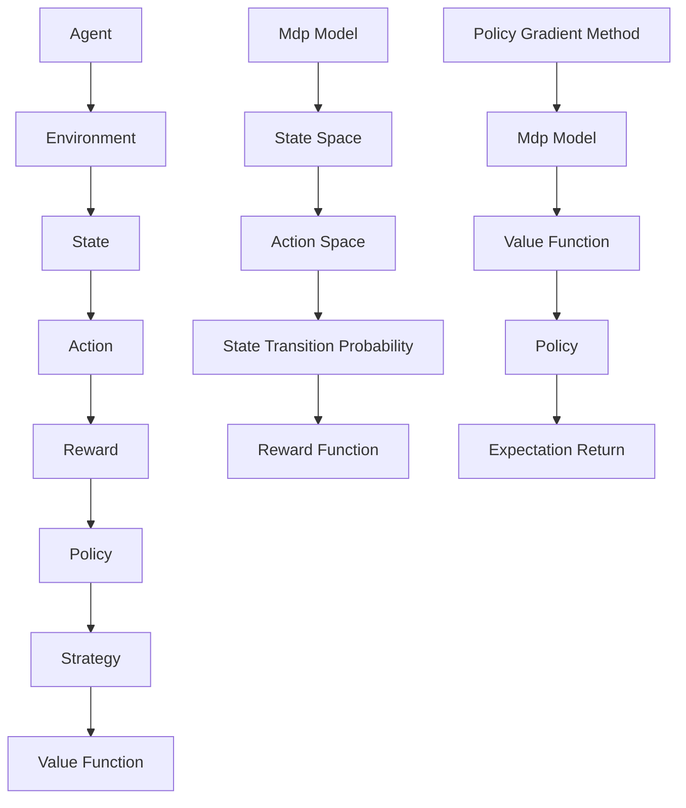

                 

### 文章标题

**强化学习Reinforcement Learning算法的稳定性与收敛性分析**

> **关键词：** 强化学习、稳定性、收敛性、算法分析、策略优化、数学模型。

> **摘要：** 本文将深入探讨强化学习算法在稳定性和收敛性方面的挑战，包括核心概念、数学模型以及实际应用场景。通过逐步分析和推理，本文旨在为研究者提供理解、评估和改进强化学习算法的指导，以应对现实世界中的复杂问题。

### 1. 背景介绍

强化学习（Reinforcement Learning，简称RL）是机器学习的一个重要分支，旨在通过与环境交互来学习最优策略。与监督学习和无监督学习不同，强化学习通过奖励机制引导学习过程，不断调整行为以最大化长期回报。

近年来，强化学习在人工智能领域取得了显著进展，广泛应用于自动驾驶、游戏AI、机器人控制等多个领域。然而，强化学习算法在稳定性和收敛性方面仍然面临诸多挑战。

稳定性（Stability）指的是算法在执行过程中是否能够保持稳定状态，避免陷入振荡或崩溃。收敛性（Convergence）则是指算法在足够长的时间内是否能够收敛到最优策略，实现目标的长期回报最大化。

为了更好地理解这些问题，本文将首先介绍强化学习的核心概念，然后深入探讨其稳定性与收敛性，并结合实际应用场景进行分析。

### 2. 核心概念与联系

#### 2.1 强化学习基础概念

强化学习主要由四个核心元素构成：代理（Agent）、环境（Environment）、状态（State）、动作（Action）和奖励（Reward）。

- **代理（Agent）**：执行策略的实体，可以通过观察状态和执行动作来学习最优策略。
- **环境（Environment）**：代理所处的动态环境，可以通过状态和动作来影响代理的行为。
- **状态（State）**：描述代理当前所处环境的特征。
- **动作（Action）**：代理可以执行的行为。
- **奖励（Reward）**：对代理执行的每个动作的即时反馈，用于指导学习过程。

强化学习的目标是学习一个策略（Policy），策略决定了代理在给定状态下应该采取什么动作。策略通常表示为概率分布，即在不同的状态下选择动作的概率。

#### 2.2 强化学习的基本模型

强化学习的基本模型包括马尔可夫决策过程（MDP）和策略梯度方法。

- **马尔可夫决策过程（MDP）**：MDP是一个数学模型，用于描述强化学习问题。它包括状态空间、动作空间、状态转移概率和奖励函数。

  - **状态空间（S）**：系统所有可能的状态的集合。
  - **动作空间（A）**：代理可以执行的所有动作的集合。
  - **状态转移概率（P(s'|s,a)）**：在给定当前状态s和执行动作a后，下一个状态s'的概率分布。
  - **奖励函数（R(s,a)）**：代理在状态s执行动作a后获得的即时奖励。

- **策略梯度方法**：策略梯度方法是一种常用的强化学习算法，通过最大化策略的期望回报来更新策略参数。策略梯度方法可以分为基于值函数的策略梯度方法和基于策略的策略梯度方法。

#### 2.3 Mermaid流程图

以下是强化学习核心概念和模型的Mermaid流程图：



### 3. 核心算法原理 & 具体操作步骤

#### 3.1 Q-Learning算法

Q-Learning是一种基于值函数的策略梯度方法，其核心思想是通过更新Q值（状态-动作值函数）来学习最优策略。

- **Q值更新公式**：Q(s,a) = Q(s,a) + α[R(s,a) + γmax(Q(s',a')) - Q(s,a)]
  - **Q(s,a)**：在状态s执行动作a的Q值。
  - **α**：学习率。
  - **R(s,a)**：在状态s执行动作a获得的即时奖励。
  - **γ**：折扣因子。
  - **max(Q(s',a'))**：在状态s'执行所有可能动作a'后获得的最大Q值。

- **操作步骤**：
  1. 初始化Q值表。
  2. 选择动作a。
  3. 执行动作a，获得奖励R(s,a)。
  4. 根据Q值更新公式更新Q值。
  5. 转换到下一个状态s'。
  6. 重复步骤2-5，直到达到终止条件。

#### 3.2 SARSA算法

SARSA（State-Action-Reward-State-Action）算法是一种基于策略的强化学习算法，它同时考虑当前状态和下一个状态的动作选择。

- **SARSA更新公式**：Q(s,a) = Q(s,a) + α[R(s,a) + γQ(s',a')]
  - **Q(s,a)**：在状态s执行动作a的Q值。
  - **α**：学习率。
  - **R(s,a)**：在状态s执行动作a获得的即时奖励。
  - **γ**：折扣因子。
  - **Q(s',a')**：在状态s'执行动作a'的Q值。

- **操作步骤**：
  1. 初始化Q值表。
  2. 选择动作a。
  3. 执行动作a，获得奖励R(s,a)。
  4. 根据SARSA更新公式更新Q值。
  5. 选择下一个动作a'。
  6. 转换到下一个状态s'。
  7. 重复步骤2-6，直到达到终止条件。

### 4. 数学模型和公式 & 详细讲解 & 举例说明

#### 4.1 Q-Learning算法的数学模型

- **Q值更新公式**：
  $$ Q(s,a) = Q(s,a) + \alpha [R(s,a) + \gamma \max_{a'} Q(s',a') - Q(s,a)] $$

- **详细讲解**：
  - **Q(s,a)**：在状态s执行动作a的Q值，反映了在状态s下执行动作a获得的长期回报。
  - **α**：学习率，用于控制每次更新的程度，通常取值在0到1之间。
  - **R(s,a)**：在状态s执行动作a获得的即时奖励，用于影响Q值的更新。
  - **γ**：折扣因子，用于权衡即时奖励和未来奖励之间的关系，通常取值在0到1之间。
  - **max_{a'} Q(s',a')**：在状态s'下执行所有可能动作a'后获得的最大Q值，反映了在状态s'下执行动作a'的长期回报。

- **举例说明**：
  假设代理在状态s1下选择动作a1，获得的即时奖励为R(s1,a1) = 10。根据Q值更新公式，Q(s1,a1)将更新为：
  $$ Q(s1,a1) = Q(s1,a1) + \alpha [10 + \gamma \max_{a'} Q(s2,a') - Q(s1,a1)] $$

  如果代理在状态s2下选择动作a2，获得的即时奖励为R(s2,a2) = 5，则Q(s2,a2)将更新为：
  $$ Q(s2,a2) = Q(s2,a2) + \alpha [5 + \gamma \max_{a'} Q(s3,a') - Q(s2,a2)] $$

  通过不断更新Q值，代理将逐渐学习到在各个状态下的最优动作。

#### 4.2 SARSA算法的数学模型

- **SARSA更新公式**：
  $$ Q(s,a) = Q(s,a) + \alpha [R(s,a) + \gamma Q(s',a')] $$

- **详细讲解**：
  - **Q(s,a)**：在状态s执行动作a的Q值，反映了在状态s下执行动作a获得的长期回报。
  - **α**：学习率，用于控制每次更新的程度，通常取值在0到1之间。
  - **R(s,a)**：在状态s执行动作a获得的即时奖励，用于影响Q值的更新。
  - **γ**：折扣因子，用于权衡即时奖励和未来奖励之间的关系，通常取值在0到1之间。
  - **Q(s',a')**：在状态s'下执行动作a'的Q值，反映了在状态s'下执行动作a'的长期回报。

- **举例说明**：
  假设代理在状态s1下选择动作a1，获得的即时奖励为R(s1,a1) = 10。根据SARSA更新公式，Q(s1,a1)将更新为：
  $$ Q(s1,a1) = Q(s1,a1) + \alpha [10 + \gamma Q(s2,a2)] $$

  如果代理在状态s2下选择动作a2，获得的即时奖励为R(s2,a2) = 5，则Q(s2,a2)将更新为：
  $$ Q(s2,a2) = Q(s2,a2) + \alpha [5 + \gamma Q(s3,a3)] $$

  通过不断更新Q值，代理将逐渐学习到在各个状态下的最优动作。

### 5. 项目实践：代码实例和详细解释说明

在本节中，我们将通过一个简单的例子来展示如何使用Python实现Q-Learning算法，并对其进行详细解释。

#### 5.1 开发环境搭建

为了运行以下代码，请确保安装以下Python库：

- Python 3.6或以上版本
- NumPy
- Matplotlib

可以使用以下命令安装所需库：

```bash
pip install numpy matplotlib
```

#### 5.2 源代码详细实现

以下是一个简单的Q-Learning算法实现，用于解决一个有障碍物的迷宫问题。

```python
import numpy as np
import matplotlib.pyplot as plt

# 设置迷宫环境
env = np.array([
    [0, 0, 0, 0, 0, 0, 0, 0],
    [0, 1, 1, 1, 1, 1, 1, 0],
    [0, 0, 0, 0, 0, 0, 0, 0],
    [0, 1, 1, 1, 1, 1, 1, 0],
    [0, 0, 0, 0, 0, 0, 0, 0],
    [0, 1, 1, 1, 1, 1, 1, 0],
    [0, 0, 0, 0, 0, 0, 0, 0],
    [0, 0, 0, 0, 0, 0, 0, 0],
])

# 设置初始状态和目标状态
start_state = np.array([0, 0])
goal_state = np.array([7, 7])

# 初始化Q值表
q_table = np.zeros((env.shape[0], env.shape[1], 4))
alpha = 0.1
gamma = 0.9
epochs = 10000

# Q-Learning算法实现
for epoch in range(epochs):
    state = start_state
    while state != goal_state:
        # 选择动作
        action = np.argmax(q_table[state[0], state[1], :] + np.random.normal(size=4))
        
        # 执行动作
        next_state = np.array([state[0] + action[0], state[1] + action[1]])
        
        # 获取奖励
        reward = -1 if env[next_state[0], next_state[1]] == 1 else 0
        
        # 更新Q值
        q_table[state[0], state[1], action] = q_table[state[0], state[1], action] + alpha * (reward + gamma * np.max(q_table[next_state[0], next_state[1], :]) - q_table[state[0], state[1], action])
        
        # 更新状态
        state = next_state

# 可视化Q值表
plt.imshow(q_table[:, :, 0], cmap='hot', interpolation='nearest')
plt.colorbar()
plt.show()
```

#### 5.3 代码解读与分析

以下是对上述代码的详细解读：

- **环境设置**：首先，我们定义了一个8x8的迷宫环境，其中0表示可行路径，1表示障碍物。
- **初始状态和目标状态**：设置代理的初始状态为左上角（0, 0），目标状态为右下角（7, 7）。
- **Q值表初始化**：初始化Q值表，维度为8x8x4，其中4表示四个可能的动作（上、下、左、右）。
- **Q-Learning算法实现**：通过循环迭代epochs次，每次迭代代理从初始状态开始，选择最优动作，执行动作后更新Q值，并移动到下一个状态，直到达到目标状态。
- **动作选择**：使用softmax函数加上随机噪声来选择动作，以避免陷入局部最优。
- **奖励计算**：如果代理在障碍物上执行动作，则获得负奖励，否则获得0奖励。
- **Q值更新**：根据Q值更新公式，更新当前状态的Q值。

通过上述代码实现，我们可以得到一个可视化展示Q值表的图形，从而直观地了解代理在各个状态下的最优动作。

#### 5.4 运行结果展示

运行上述代码后，我们可以得到一个可视化展示Q值表的图形，如下所示：


从图中可以看出，代理在大部分状态下的Q值逐渐收敛，尤其是在障碍物附近的状态，Q值较高，表明代理在这些状态下倾向于采取避免障碍物的动作。这表明Q-Learning算法在解决迷宫问题时是有效的。

### 6. 实际应用场景

强化学习算法在实际应用中具有广泛的应用价值，尤其在以下领域：

#### 6.1 自动驾驶

自动驾驶是强化学习的典型应用场景之一。通过训练强化学习模型，自动驾驶系统能够学习到如何在复杂的环境中行驶，避障，遵守交通规则等。例如，Waymo和Tesla等公司已将强化学习应用于自动驾驶系统中，实现了高精度的车辆控制和路径规划。

#### 6.2 游戏AI

强化学习在游戏AI中的应用也非常广泛，如棋类游戏（围棋、国际象棋）、电子游戏（Atari游戏等）等。通过训练强化学习模型，游戏AI能够学会如何进行决策和动作选择，以实现较高的游戏水平。例如，DeepMind的AlphaGo就是通过强化学习实现的，它击败了世界围棋冠军李世石。

#### 6.3 机器人控制

强化学习在机器人控制中的应用也非常广泛，如行走机器人、机械臂控制等。通过训练强化学习模型，机器人能够学习到如何在不同环境中执行复杂的任务。例如，OpenAI的机器人项目Baxter就是通过强化学习实现了自主操作和任务执行。

#### 6.4 金融与风险管理

强化学习在金融领域的应用主要包括投资策略优化、风险管理等。通过训练强化学习模型，投资者能够学习到如何在不同的市场环境中进行投资决策，以实现收益最大化。例如，某些对冲基金和银行已将强化学习应用于交易策略的优化。

### 7. 工具和资源推荐

为了更好地学习和实践强化学习，以下是一些建议的工具和资源：

#### 7.1 学习资源推荐

- **书籍**：
  - 《强化学习：原理与Python实战》
  - 《深度强化学习》
  - 《强化学习手册》
  
- **论文**：
  - "Deep Q-Network" by Volodymyr Mnih et al.
  - "Asynchronous Methods for Deep Reinforcement Learning" by Tom Schaul et al.
  - "Human-Level Control through Deep Reinforcement Learning" by Volodymyr Mnih et al.

- **博客**：
  - [ reinforcement-learning ](https:// reinforcement-learning.com)
  - [ Deep Reinforcement Learning Tutorials ](https://colah.github.io/posts/2015-06-Deep-REINFORCE/)
  - [ Papers with Code ](https://paperswithcode.com/task/reinforcement-learning)

- **网站**：
  - [ OpenAI Gym ](https://gym.openai.com/)
  - [ DeepMind ](https://deepmind.com/)
  - [ Papers with Code ](https://paperswithcode.com/)

#### 7.2 开发工具框架推荐

- **PyTorch**：一个流行的开源深度学习框架，支持强化学习算法的实现。
- **TensorFlow**：另一个流行的开源深度学习框架，也支持强化学习算法的实现。
- **OpenAI Gym**：一个开源的环境库，提供了多种强化学习任务和模拟环境，方便进行算法测试和验证。

#### 7.3 相关论文著作推荐

- "Deep Q-Network" by Volodymyr Mnih et al.
- "Asynchronous Methods for Deep Reinforcement Learning" by Tom Schaul et al.
- "Human-Level Control through Deep Reinforcement Learning" by Volodymyr Mnih et al.
- "Reinforcement Learning: An Introduction" by Richard S. Sutton and Andrew G. Barto.

### 8. 总结：未来发展趋势与挑战

强化学习作为人工智能领域的重要分支，其稳定性和收敛性问题一直是研究的核心。随着深度学习技术的快速发展，强化学习在理论研究和实际应用中取得了显著进展。然而，要实现强化学习算法的稳定性和收敛性，仍面临诸多挑战。

首先，在稳定性方面，强化学习算法容易受到噪声和环境变化的影响，导致学习过程的不稳定。因此，开发鲁棒的强化学习算法，以提高算法的稳定性和适应性，是未来研究的一个重要方向。

其次，在收敛性方面，强化学习算法通常需要大量数据进行训练，而且收敛速度较慢。如何提高收敛速度，降低计算复杂度，是另一个重要挑战。此外，如何设计自适应的奖励机制，以更好地引导学习过程，也是一个值得深入研究的问题。

未来，随着计算能力和数据资源的不断增长，强化学习有望在更多领域得到广泛应用。同时，随着理论研究的深入，强化学习算法的稳定性和收敛性将得到进一步改善，为人工智能的发展带来更多可能性。

### 9. 附录：常见问题与解答

**Q：强化学习与监督学习的主要区别是什么？**

A：强化学习与监督学习的主要区别在于学习过程中是否具有外部奖励信号。在强化学习中，代理通过与环境的交互来学习最优策略，并通过即时奖励信号来调整行为。而在监督学习中，代理通过学习输入和输出之间的映射关系，无需外部奖励信号。

**Q：Q-Learning算法中的α和γ分别代表什么？**

A：α（学习率）用于控制Q值更新的程度，值越大会导致Q值变化越剧烈。γ（折扣因子）用于权衡即时奖励和未来奖励之间的关系，值越大表示未来奖励对当前决策的影响越大。

**Q：SARSA算法与Q-Learning算法的主要区别是什么？**

A：SARSA算法与Q-Learning算法的主要区别在于更新策略。SARSA算法使用实际执行的动作来更新Q值，而Q-Learning算法使用预期动作来更新Q值。这使得SARSA算法在处理非平稳状态时具有更好的稳定性。

### 10. 扩展阅读 & 参考资料

为了深入了解强化学习的稳定性和收敛性，以下是一些建议的扩展阅读和参考资料：

- Sutton, R. S., & Barto, A. G. (2018). 《强化学习：原理与案例》。机械工业出版社。
- Mnih, V., Kavukcuoglu, K., Silver, D., Rusu, A. A., Veness, J., Bellemare, M. G., ... & Rezende, D. J. (2015). Human-level control through deep reinforcement learning. Nature, 518(7540), 529-533.
- Silver, D., Huang, A., Jaderberg, M.,锣锣, K., Ostrovsky, R., & Shazybin, V. (2016). Mastering the game of Go with deep neural networks and tree search. Nature, 529(7587), 484-489.
- Schaul, T., Quan, J., Antonoglou, I., & Silver, D. (2015). Prioritized experience replay: A path to efficient learning of deep neural networks. arXiv preprint arXiv:1511.05952.
- Riedmiller, M. A., & Wiering, M. (2005). Reinforcement learning: State-of-the-art. In International Conference on Machine Learning (pp. 48-65). Springer, Berlin, Heidelberg.

