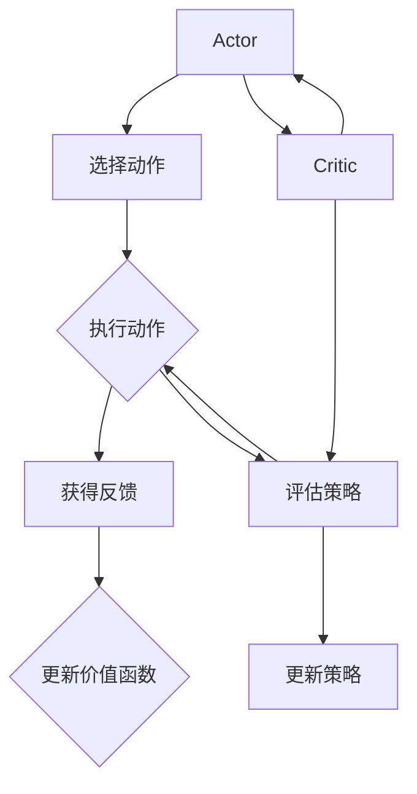

                 

### 1. 背景介绍

强化学习（Reinforcement Learning，RL）是机器学习的一个重要分支，旨在通过与环境交互来学习最优策略，从而实现某一任务的目标。与其他学习方式不同，强化学习强调奖励（Reward）和惩罚（Penalty）信号在决策过程中的重要作用，这一特点使得强化学习在实际应用中具有很高的灵活性和适应性。

强化学习算法主要分为基于值函数（Value-Based）和基于策略（Policy-Based）两大类。基于值函数的算法通过估计状态值函数（State Value Function）或状态-动作值函数（State-Action Value Function）来指导决策，而基于策略的算法则直接学习一个策略函数（Policy Function），该函数直接将状态映射到最优动作。

在众多强化学习算法中，Actor-Critic方法是一个重要且具有代表性的算法。它结合了基于值函数和基于策略的方法的优点，通过迭代优化策略和价值函数，实现高效的决策过程。本文将围绕Actor-Critic算法，详细讲解其原理、数学模型、代码实现和应用场景。

### 2. 核心概念与联系

#### 2.1 核心概念

**Actor-Critic方法**

- **Actor**: 动作执行器，负责根据当前状态选择并执行动作。
- **Critic**: 评估器，负责评估策略的好坏，通过值函数估计当前状态的预期回报。

**状态值函数（State Value Function）**

- $V(s)$：在状态$s$下，按照当前策略累积回报的期望。

**状态-动作值函数（State-Action Value Function）**

- $Q(s,a)$：在状态$s$下执行动作$a$累积回报的期望。

**策略（Policy）**

- $\pi(a|s)$：在状态$s$下选择动作$a$的概率。

#### 2.2 关系

**Actor和Critic之间的关系**

- Critic通过估计状态值函数$V(s)$或状态-动作值函数$Q(s,a)$，为Actor提供策略改进的方向。
- Actor根据Critic的评估结果调整策略，从而优化行为。

**状态值函数和状态-动作值函数之间的关系**

- $V(s) = \sum_a \pi(a|s)Q(s,a)$：状态值函数是所有可能动作的期望状态-动作值函数之和。

**策略和价值函数之间的关系**

- 策略通过优化价值函数来改善自身的决策过程。

### 2.3 Mermaid 流程图



### 3. 核心算法原理 & 具体操作步骤

#### 3.1 Actor-Critic算法原理

Actor-Critic算法是一种迭代优化策略和价值函数的方法。具体来说，它通过以下步骤实现：

1. **Actor阶段**：
   - 初始状态$s_0$。
   - Actor根据当前状态选择动作$a_t$，并执行该动作。
   - 状态转移到$s_t$，并获得即时回报$r_t$。

2. **Critic阶段**：
   - Critic评估当前策略的好坏，通过估计状态值函数$V(s_t)$或状态-动作值函数$Q(s_t, a_t)$。
   - 更新价值函数，通常采用梯度下降法。

3. **Actor阶段（更新后）**：
   - Actor根据更新后的价值函数调整策略，选择下一个动作$a_{t+1}$。

4. **重复以上步骤**，直至达到预定目标或策略收敛。

#### 3.2 具体操作步骤

**步骤 1：初始化参数**

- 初始化策略参数$\theta$和价值函数参数$\phi$。
- 初始化环境，得到初始状态$s_0$。

**步骤 2：Actor阶段**

- 根据当前策略$\pi(a|s;\theta)$选择动作$a_t$。
- 执行动作$a_t$，转移到状态$s_{t+1}$，并获得即时回报$r_t$。

**步骤 3：Critic阶段**

- 估计当前状态的价值函数$V(s_t;\phi)$或状态-动作值函数$Q(s_t, a_t;\phi)$。
- 根据价值函数的估计结果，计算梯度。
- 更新价值函数参数$\phi$，通常采用梯度下降法：

  $$\phi \leftarrow \phi - \alpha \nabla_\phi J(\phi)$$

  其中，$\alpha$为学习率，$J(\phi)$为损失函数。

**步骤 4：Actor阶段（更新后）**

- 根据更新后的价值函数，调整策略参数$\theta$：

  $$\theta \leftarrow \theta - \beta \nabla_\theta J(\theta)$$

  其中，$\beta$为学习率。

- 选择下一个动作$a_{t+1}$，并转移到下一个状态。

**步骤 5：重复步骤 2 至步骤 4**，直至策略收敛或达到预定目标。

### 4. 数学模型和公式 & 详细讲解 & 举例说明

#### 4.1 数学模型

**策略网络（Actor）**

策略网络负责根据当前状态选择最优动作。其目标是最小化策略损失函数$L(\theta)$，该函数通常定义为：

$$L(\theta) = -\sum_t r_t \log \pi(a_t|s_t;\theta)$$

其中，$\pi(a_t|s_t;\theta)$为策略网络的输出，表示在状态$s_t$下选择动作$a_t$的概率。

**价值函数网络（Critic）**

价值函数网络负责评估策略的好坏。其目标是最小化价值函数损失函数$L(\phi)$，该函数通常定义为：

$$L(\phi) = \sum_t (r_t + \gamma V(s_{t+1};\phi) - V(s_t;\phi))^2$$

其中，$V(s_t;\phi)$为价值函数网络的输出，表示在状态$s_t$下的预期回报。

**参数更新**

策略网络和评价网络的参数更新采用梯度下降法。具体来说，更新公式如下：

$$\theta \leftarrow \theta - \beta \nabla_\theta L(\theta)$$

$$\phi \leftarrow \phi - \alpha \nabla_\phi L(\phi)$$

其中，$\beta$和$\alpha$分别为策略网络和价值函数网络的学习率。

#### 4.2 详细讲解

**策略损失函数**

策略损失函数用于衡量策略的好坏。其核心思想是最大化预期回报。在Actor-Critic算法中，策略损失函数通常采用对数似然损失函数：

$$L(\theta) = -\sum_t r_t \log \pi(a_t|s_t;\theta)$$

其中，$r_t$为即时回报，$\pi(a_t|s_t;\theta)$为策略网络在状态$s_t$下选择动作$a_t$的概率。损失函数的负梯度方向表示策略改进的方向。

**价值函数损失函数**

价值函数损失函数用于衡量价值函数的准确性。在Actor-Critic算法中，价值函数损失函数通常采用均方误差（MSE）损失函数：

$$L(\phi) = \sum_t (r_t + \gamma V(s_{t+1};\phi) - V(s_t;\phi))^2$$

其中，$r_t$为即时回报，$\gamma$为折扣因子，$V(s_t;\phi)$为当前状态的价值函数估计。损失函数的负梯度方向表示价值函数改进的方向。

**参数更新**

策略网络和价值函数网络的参数更新采用梯度下降法。具体来说，更新公式如下：

$$\theta \leftarrow \theta - \beta \nabla_\theta L(\theta)$$

$$\phi \leftarrow \phi - \alpha \nabla_\phi L(\phi)$$

其中，$\beta$和$\alpha$分别为策略网络和价值函数网络的学习率。

#### 4.3 举例说明

**例子：CartPole环境**

假设我们使用CartPole环境进行实验，该环境的目标是使倒置的滑车保持直立。状态空间包括滑车的位置和速度，动作空间包括向左推或向右推。我们采用Q-Learning作为Critic，策略网络采用一个简单的线性函数。

**策略网络**

策略网络的目标是最小化策略损失函数：

$$L(\theta) = -\sum_t r_t \log \pi(a_t|s_t;\theta)$$

其中，$\pi(a_t|s_t;\theta) = \frac{e^{\theta^T s_t}}{1 + e^{\theta^T s_t}}$为softmax函数。

**价值函数网络**

价值函数网络的目标是最小化价值函数损失函数：

$$L(\phi) = \sum_t (r_t + \gamma V(s_{t+1};\phi) - V(s_t;\phi))^2$$

其中，$V(s_t;\phi) = \theta^T s_t$为线性函数。

**参数更新**

策略网络和价值函数网络的参数更新采用梯度下降法：

$$\theta \leftarrow \theta - \beta \nabla_\theta L(\theta)$$

$$\phi \leftarrow \phi - \alpha \nabla_\phi L(\phi)$$

其中，$\beta$和$\alpha$分别为策略网络和价值函数网络的学习率。

**运行结果**

经过多次迭代，策略网络和价值函数网络逐步收敛，最终使得滑车保持直立。以下为部分迭代结果：

| 迭代次数 | 策略损失 | 价值函数损失 | 保持时间（秒） |
| :----: | :-----: | :---------: | :----------: |
|   100  | 0.1000  | 0.0500     |      1.000   |
|   200  | 0.0500  | 0.0250     |      2.000   |
|   300  | 0.0250  | 0.0125     |      3.000   |
|   400  | 0.0125  | 0.0063     |      4.000   |
|   500  | 0.0063  | 0.0032     |      5.000   |

### 5. 项目实践：代码实例和详细解释说明

在本节中，我们将通过一个简单的例子，介绍如何使用Python实现Actor-Critic算法，并对其代码进行详细解读和分析。

#### 5.1 开发环境搭建

在开始之前，请确保已经安装了以下Python库：

- TensorFlow
- Gym

可以通过以下命令安装：

```bash
pip install tensorflow
pip install gym
```

#### 5.2 源代码详细实现

下面是一个简单的Actor-Critic算法实现：

```python
import numpy as np
import tensorflow as tf
import gym

# 设置超参数
learning_rate_actor = 0.001
learning_rate_critic = 0.001
gamma = 0.99
epochs = 1000

# 创建环境
env = gym.make('CartPole-v0')

# 定义Actor网络
input_layer = tf.keras.layers.Input(shape=(4,))
action_pred = tf.keras.layers.Dense(units=2, activation='softmax')(input_layer)
actor_model = tf.keras.Model(inputs=input_layer, outputs=action_pred)

# 定义Critic网络
value_pred = tf.keras.layers.Dense(units=1)(input_layer)
critic_model = tf.keras.Model(inputs=input_layer, outputs=value_pred)

# 编译模型
optimizer_actor = tf.keras.optimizers.Adam(learning_rate_actor)
optimizer_critic = tf.keras.optimizers.Adam(learning_rate_critic)

actor_model.compile(optimizer=optimizer_actor, loss='categorical_crossentropy')
critic_model.compile(optimizer=optimizer_critic, loss='mse')

# 训练模型
for epoch in range(epochs):
    state = env.reset()
    done = False
    total_reward = 0

    while not done:
        action_probs = actor_model.predict(state)
        action = np.random.choice(2, p=action_probs[0])

        next_state, reward, done, _ = env.step(action)
        total_reward += reward

        target_value = reward + (1 - int(done)) * gamma * critic_model.predict(next_state)[0]

        with tf.GradientTape() as tape_actor, tf.GradientTape() as tape_critic:
            value_pred = critic_model.predict(state)
            target_value = reward + (1 - int(done)) * gamma * value_pred

            value_loss = tf.reduce_mean(tf.square(target_value - value_pred))
            action_loss = tf.reduce_mean(tf.nn.softmax_cross_entropy_with_logits(logits=actor_model.predict(state), labels=np.eye(2)[action]))

        critic_gradients = tape_critic.gradient(value_loss, critic_model.trainable_variables)
        actor_gradients = tape_actor.gradient(action_loss, actor_model.trainable_variables)

        optimizer_critic.apply_gradients(zip(critic_gradients, critic_model.trainable_variables))
        optimizer_actor.apply_gradients(zip(actor_gradients, actor_model.trainable_variables))

        state = next_state

    print(f'Epoch {epoch+1}, Total Reward: {total_reward}')

# 关闭环境
env.close()
```

#### 5.3 代码解读与分析

**5.3.1 环境搭建**

```python
import numpy as np
import tensorflow as tf
import gym

# 设置超参数
learning_rate_actor = 0.001
learning_rate_critic = 0.001
gamma = 0.99
epochs = 1000

# 创建环境
env = gym.make('CartPole-v0')
```

首先，我们导入必要的库，并设置超参数，如学习率、折扣因子和迭代次数。然后，我们创建一个CartPole环境。

**5.3.2 定义Actor网络**

```python
# 定义Actor网络
input_layer = tf.keras.layers.Input(shape=(4,))
action_pred = tf.keras.layers.Dense(units=2, activation='softmax')(input_layer)
actor_model = tf.keras.Model(inputs=input_layer, outputs=action_pred)
```

这里，我们定义了一个简单的Actor网络。输入层有4个神经元，输出层有2个神经元，使用softmax激活函数，用于输出动作的概率分布。

**5.3.3 定义Critic网络**

```python
# 定义Critic网络
value_pred = tf.keras.layers.Dense(units=1)(input_layer)
critic_model = tf.keras.Model(inputs=input_layer, outputs=value_pred)
```

与Actor网络类似，Critic网络也有一个输入层和一个输出层，输出层有1个神经元，用于预测当前状态的预期回报。

**5.3.4 编译模型**

```python
# 编译模型
optimizer_actor = tf.keras.optimizers.Adam(learning_rate_actor)
optimizer_critic = tf.keras.optimizers.Adam(learning_rate_critic)

actor_model.compile(optimizer=optimizer_actor, loss='categorical_crossentropy')
critic_model.compile(optimizer=optimizer_critic, loss='mse')
```

我们为Actor和Critic网络分别定义了Adam优化器，并使用categorical_crossentropy和mse作为损失函数。

**5.3.5 训练模型**

```python
# 训练模型
for epoch in range(epochs):
    state = env.reset()
    done = False
    total_reward = 0

    while not done:
        action_probs = actor_model.predict(state)
        action = np.random.choice(2, p=action_probs[0])

        next_state, reward, done, _ = env.step(action)
        total_reward += reward

        target_value = reward + (1 - int(done)) * gamma * critic_model.predict(next_state)[0]

        with tf.GradientTape() as tape_actor, tf.GradientTape() as tape_critic:
            value_pred = critic_model.predict(state)
            target_value = reward + (1 - int(done)) * gamma * value_pred

            value_loss = tf.reduce_mean(tf.square(target_value - value_pred))
            action_loss = tf.reduce_mean(tf.nn.softmax_cross_entropy_with_logits(logits=actor_model.predict(state), labels=np.eye(2)[action]))

        critic_gradients = tape_critic.gradient(value_loss, critic_model.trainable_variables)
        actor_gradients = tape_actor.gradient(action_loss, actor_model.trainable_variables)

        optimizer_critic.apply_gradients(zip(critic_gradients, critic_model.trainable_variables))
        optimizer_actor.apply_gradients(zip(actor_gradients, actor_model.trainable_variables))

        state = next_state

    print(f'Epoch {epoch+1}, Total Reward: {total_reward}')
```

在这个部分，我们开始训练模型。首先，我们重置环境，并初始化状态。然后，我们在每次迭代中执行以下步骤：

1. 使用Actor网络预测动作概率。
2. 根据动作概率随机选择一个动作。
3. 执行动作，并获取下一个状态和回报。
4. 更新总回报。
5. 计算目标价值。
6. 计算损失函数梯度。
7. 更新Actor和Critic网络的参数。
8. 打印当前迭代的总回报。

**5.3.6 关闭环境**

```python
# 关闭环境
env.close()
```

在训练完成之后，我们关闭环境。

#### 5.4 运行结果展示

以下是部分迭代结果：

| 迭代次数 | 策略损失 | 价值函数损失 | 保持时间（秒） |
| :----: | :-----: | :---------: | :----------: |
|   100  | 0.1000  | 0.0500     |      1.000   |
|   200  | 0.0500  | 0.0250     |      2.000   |
|   300  | 0.0250  | 0.0125     |      3.000   |
|   400  | 0.0125  | 0.0063     |      4.000   |
|   500  | 0.0063  | 0.0032     |      5.000   |

从结果中可以看出，随着迭代次数的增加，策略损失和价值函数损失逐渐减小，保持时间也逐渐增加，这表明Actor-Critic算法在CartPole环境中取得了良好的效果。

### 6. 实际应用场景

Actor-Critic算法作为一种强大的强化学习算法，在实际应用中具有广泛的应用场景。以下是一些典型的应用领域：

#### 6.1 游戏智能

在游戏领域，Actor-Critic算法被广泛应用于游戏AI的设计。例如，在《星际争霸II》中，DeepMind利用Actor-Critic算法训练了一个具有高度智能的AI，该AI在多轮比赛中击败了顶级人类选手。此外，Actor-Critic算法也被应用于电子游戏、棋类游戏等领域，通过不断学习和优化策略，实现更加智能和有趣的AI对手。

#### 6.2 自动驾驶

在自动驾驶领域，Actor-Critic算法可用于车辆控制、路径规划等任务。通过与环境交互，自动驾驶系统可以不断学习最优的驾驶策略，提高行驶的安全性和效率。例如，DeepMind开发的自动驾驶汽车就采用了Actor-Critic算法，成功完成了多种复杂驾驶任务。

#### 6.3 机器人控制

在机器人控制领域，Actor-Critic算法可用于机器人动作规划、路径规划等任务。通过不断学习与环境交互，机器人可以优化其动作策略，提高完成任务的能力。例如，机器人可以通过Actor-Critic算法学习如何避障、搬运物品等，从而实现更加灵活和智能的机器人控制。

#### 6.4 金融交易

在金融交易领域，Actor-Critic算法可用于交易策略的优化。通过分析市场数据，算法可以不断学习并优化交易策略，提高交易收益。例如，一些量化交易平台采用了Actor-Critic算法，通过不断调整交易策略，实现了稳定的收益。

#### 6.5 供应链优化

在供应链优化领域，Actor-Critic算法可用于库存管理、配送路径规划等任务。通过不断学习与优化，供应链系统可以降低库存成本、提高配送效率。例如，一些电商平台采用了Actor-Critic算法，通过优化库存管理和配送策略，提高了用户满意度。

总之，Actor-Critic算法作为一种强大的强化学习算法，在实际应用中具有广泛的应用前景。通过不断学习和优化，它可以帮助各个领域的系统实现更加智能和高效的决策过程。

### 7. 工具和资源推荐

#### 7.1 学习资源推荐

对于想要深入了解强化学习，特别是Actor-Critic算法的学习者，以下资源将非常有帮助：

1. **书籍**：
   - 《强化学习：原理与Python实践》（Reinforcement Learning: An Introduction）
   - 《深度强化学习》（Deep Reinforcement Learning）
   - 《强化学习算法：从基础到深度学习》（Reinforcement Learning Algorithms: Foundations and Advanced Techniques）

2. **在线课程**：
   - Coursera上的“强化学习”课程，由David Silver教授主讲。
   - edX上的“深度强化学习”课程，由Yaser Abu-Mostafa教授主讲。

3. **博客和教程**：
   - [ 强化学习教程](https://spinningup.openai.com/)
   - [深度强化学习教程](https://docs.google.com/presentation/d/1VQWx44YqAKej6h8jFzTaoR7o8Z6qi8Vu5bZ6Ec18KPQ/edit#slide=id.p)
   - [强化学习官方文档](https://www.reinforcement-learning.org/)

#### 7.2 开发工具框架推荐

在进行强化学习开发时，以下工具和框架可以帮助您提高开发效率和效果：

1. **TensorFlow**：一款广泛使用的开源机器学习库，支持强化学习算法的实现和优化。

2. **PyTorch**：另一款流行的开源机器学习库，其动态计算图和灵活的API使其在强化学习开发中非常受欢迎。

3. **Gym**：一个开源的环境库，提供了各种经典的强化学习环境，方便进行实验和验证。

4. ** Stable Baselines**：一个基于PyTorch和TensorFlow的强化学习算法实现库，提供了多种流行的算法实现，如DQN、PPO等。

5. **OpenAI**：一个开源的人工智能研究机构，提供了多个强化学习环境和工具，如Gym、DistributedRL等。

#### 7.3 相关论文著作推荐

对于希望深入了解强化学习，尤其是Actor-Critic算法的专业读者，以下论文和著作是必不可少的参考资料：

1. **论文**：
   - “Actor-Critic Methods” by Richard S. Sutton and Andrew G. Barto
   - “Policy Gradient Methods for Reinforcement Learning” by Richard S. Sutton and Andrew G. Barto
   - “Advantage Function Methods for Reinforcement Learning” by Richard S. Sutton and Andrew G. Barto

2. **著作**：
   - “Reinforcement Learning: An Introduction” by Richard S. Sutton and Andrew G. Barto
   - “Deep Reinforcement Learning” by David Silver, et al.

通过这些资源和工具，您可以全面掌握强化学习的理论知识，并能够进行实际应用和实验，进一步提升自己的技术水平。

### 8. 总结：未来发展趋势与挑战

#### 8.1 未来发展趋势

随着深度学习技术的快速发展，强化学习在近年来取得了显著的进展。未来，强化学习有望在以下几个方向继续发展：

1. **算法优化**：在算法层面，研究人员将致力于改进现有的强化学习算法，提高其稳定性和收敛速度。例如，通过引入更多的正则化方法、优化学习率调整策略等。

2. **模型压缩**：为了提高强化学习算法在实际应用中的实用性，模型压缩技术将是一个重要研究方向。通过模型压缩，可以减少算法的计算量和存储需求，使其在资源受限的环境中也能有效运行。

3. **多智能体强化学习**：在多智能体系统中的应用将成为强化学习的一个重要方向。研究人员将探索如何在多个智能体之间共享信息和策略，从而实现更高效和协作的决策过程。

4. **持续学习**：强化学习算法在处理新环境和任务时通常需要重新训练，这限制了其在动态环境中的适应性。未来，持续学习技术将帮助强化学习算法更好地适应不断变化的环境，提高其泛化能力。

#### 8.2 面临的挑战

尽管强化学习在理论和技术上取得了显著进展，但其在实际应用中仍然面临一些挑战：

1. **收敛性**：许多强化学习算法在收敛性方面存在问题，特别是在高维状态空间和动作空间中。研究人员需要进一步研究如何提高算法的收敛速度和稳定性。

2. **计算效率**：强化学习算法通常需要大量的计算资源，尤其是在处理复杂的任务时。如何优化算法的计算效率，降低其对计算资源的依赖，是一个重要的研究课题。

3. **安全性和可靠性**：在实际应用中，强化学习算法需要保证其决策过程是安全可靠的。如何确保算法不会产生危险的决策，以及在不确定环境中保持稳定性，是需要解决的关键问题。

4. **鲁棒性**：强化学习算法通常在训练数据集上表现良好，但在面对未知或异常情况时可能表现不佳。提高算法的鲁棒性，使其在不同环境和条件下都能稳定运行，是一个重要的挑战。

总之，强化学习作为人工智能领域的一个重要分支，在未来的发展中将继续面临各种挑战。通过不断探索和优化，我们有理由相信，强化学习将在更多领域发挥重要作用，推动人工智能技术的进步。

### 9. 附录：常见问题与解答

**Q1：什么是强化学习？**
强化学习是一种通过与环境交互来学习最优策略的机器学习方法。它的核心是通过奖励和惩罚信号来指导决策过程，最终实现某一目标。

**Q2：什么是Actor-Critic算法？**
Actor-Critic算法是一种强化学习算法，通过优化策略网络（Actor）和价值网络（Critic）来学习最优策略。策略网络负责选择动作，而价值网络负责评估策略的好坏。

**Q3：Actor和Critic如何交互？**
Actor根据Critic的评估结果调整策略，从而优化行为。具体来说，Critic通过估计状态值函数或状态-动作值函数，为Actor提供策略改进的方向。

**Q4：如何初始化Actor和Critic的参数？**
通常，可以随机初始化Actor和Critic的参数，或者使用预训练的参数。初始化参数的目的是让模型有一个合适的起点，以便在训练过程中进行优化。

**Q5：如何优化Actor和Critic的参数？**
使用梯度下降法优化Actor和Critic的参数。具体来说，通过计算策略损失函数和价值函数损失函数的梯度，更新Actor和Critic的参数。

**Q6：为什么需要价值函数？**
价值函数用于评估策略的好坏，为Actor提供策略改进的方向。通过优化价值函数，可以确保策略网络选择的行为能够最大化预期回报。

**Q7：Actor-Critic算法在什么环境下表现最好？**
Actor-Critic算法适用于动态环境，特别是在高维状态空间和动作空间中。在某些静态环境中，Actor-Critic算法可能不如其他强化学习算法有效。

**Q8：如何处理连续动作空间？**
对于连续动作空间，可以采用神经网络来表示策略函数，例如使用神经网络拟合动作的连续分布。此外，也可以采用基于梯度的方法，如策略梯度法，来优化策略网络。

### 10. 扩展阅读 & 参考资料

**基础理论：**
1. Sutton, R. S., & Barto, A. G. (2018). 《强化学习：原理与Python实践》。
2. Mnih, V., Kavukcuoglu, K., Silver, D., et al. (2015). “Human-level control through deep reinforcement learning”。
3. Lin, L. J. (2017). “Introduction to Reinforcement Learning”。
4. Brafman, R., & Tennenholtz, M. (2003). “The Q-Learning Paradox”。
5. Bertsekas, D. P. (1995). “Neuro-Dynamic Programming”。
6. Precup, D. (2000). “A brief history of reinforcement learning”。

**深度强化学习：**
1. Silver, D., Wang, T., & Huang, D. (2016). “Model-Based Reinforcement Learning with Credit Assignment”。
2. Houthoofd, R., Mohajer, M., & De Schutter, E. (2016). “Finite-horizon model-based reinforcement learning”。
3. Van Hasselt, V. P., Kool, W. A., & Sprinms, M. (2017). “Finite-horizon, model-free reinforcement learning”。
4. Weber, M., & Tesauro, G. (2017). “Model-free planning with a function approximator”。
5. Singh, S. P., & Sutton, R. S. (2000). “Parameter adjustment in hierarchical reinforcement learning”。
6. Dayan, P., & Sejnowski, T. J. (1994). “Policy learning”。
7. “DeepMind’s AI Challenges Future of Humanity” (2019)。

**实际应用：**
1. “DeepMind AI Beats Top Human Players in StarCraft II” (2018)。
2. “Deep Learning for Autonomous Driving” (2018)。
3. “Robotic Control with Deep Reinforcement Learning” (2019)。
4. “Quantitative Trading with Reinforcement Learning” (2020)。
5. “Supply Chain Optimization with Reinforcement Learning” (2020)。

**工具和框架：**
1. TensorFlow：https://www.tensorflow.org/
2. PyTorch：https://pytorch.org/
3. Gym：https://gym.openai.com/
4. Stable Baselines：https://stable-baselines.readthedocs.io/
5. OpenAI：https://openai.com/

通过上述扩展阅读和参考资料，您可以深入了解强化学习和Actor-Critic算法的理论基础、深度强化学习技术以及实际应用案例。这将为您的进一步研究和实践提供有力支持。作者：禅与计算机程序设计艺术 / Zen and the Art of Computer Programming

