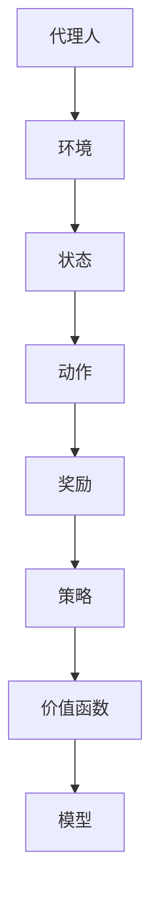

                 

### 背景介绍

**强化学习（Reinforcement Learning, RL）** 是一种机器学习方法，旨在使代理人通过与环境互动来学习最优策略。强化学习的核心在于通过试错（trial-and-error）和反馈（feedback）来优化行为，最终达到目标。相比于监督学习和无监督学习，强化学习具有更强的自主决策和适应能力，能够应用于复杂的动态环境。

在强化学习的研究与应用中，**快递派送** 是一个具有挑战性的应用场景。快递派送涉及到路线规划、时间管理、货物配送、交通状况等多方面因素，这些因素使得快递派送成为一个复杂的动态决策问题。随着互联网和电子商务的迅速发展，快递行业的市场规模不断扩大，对快递派送效率和准确性的要求也越来越高。因此，将强化学习应用于快递派送具有重要的实际意义。

强化学习在快递派送中的应用主要包括以下几个方面：

1. **路径规划**：在强化学习中，路径规划可以通过探索最优路线来提高配送效率。例如，使用深度强化学习算法（如DQN、DDPG等）来学习城市交通网络的动态特征，从而优化配送路线。

2. **时间管理**：强化学习可以帮助快递员在有限的时间内完成更多订单。例如，通过学习最优的时间分配策略，可以确保快递员在不同时间段的配送任务能够高效完成。

3. **货物配送**：强化学习可以用于优化货物的配送顺序，减少等待时间和配送成本。例如，在高峰时段，通过调整配送顺序和优化路径，可以减少快递员的配送时间和劳动强度。

4. **交通状况预测**：强化学习可以预测交通状况，从而帮助快递员选择最佳路线和时间进行配送。例如，利用强化学习算法对交通流量进行实时预测，以便及时调整配送策略。

总的来说，强化学习在快递派送中的应用，不仅可以提高配送效率，降低成本，还可以提高用户体验，满足不断增长的快递需求。下面，我们将进一步探讨强化学习在快递派送中的核心概念、算法原理、数学模型及其实际应用。

## 2. 核心概念与联系

强化学习（Reinforcement Learning, RL）是一种通过与环境的交互来学习最优策略的机器学习方法。它与监督学习（Supervised Learning）和无监督学习（Unsupervised Learning）有显著不同。监督学习依赖于已标注的数据来训练模型，而无监督学习则是通过未标注的数据来发现数据中的内在结构。强化学习则是通过奖励机制来指导学习过程，使代理人（Agent）能够通过与环境（Environment）的交互来学习最优策略（Policy）。

### 基本概念

在强化学习中，主要涉及以下基本概念：

1. **代理人（Agent）**：执行动作、与环境交互的主体。
2. **环境（Environment）**：代理人进行交互的动态环境。
3. **状态（State）**：代理人当前所处的环境情况。
4. **动作（Action）**：代理人可以执行的行为。
5. **奖励（Reward）**：动作后环境给出的反馈信号，用于指导学习。
6. **策略（Policy）**：代理人根据当前状态选择动作的规则。
7. **价值函数（Value Function）**：预测在特定状态下采取特定动作的长期奖励。
8. **模型（Model）**：对环境进行建模，预测状态转移和奖励。

### Mermaid 流程图

以下是一个简化的 Mermaid 流程图，展示了强化学习的核心概念及其相互关系：



### 强化学习与快递派送的联系

在快递派送中，代理人可以是一个快递员或自动化配送机器人，环境则是城市交通网络、天气状况以及其他动态因素。状态可以包括当前订单位置、交通状况、时间限制等，动作则是配送路径选择、时间调整等。奖励则根据配送的效率、准确性等指标来设定。策略则是根据当前状态选择最优动作的规则，而价值函数则用于预测不同动作的长期效果。模型则是对环境进行建模，以便更好地预测状态转移和奖励。

通过这种模式，强化学习可以在快递派送中发挥重要作用，优化路径规划、时间管理、货物配送等方面，提高配送效率和服务质量。

## 3. 核心算法原理 & 具体操作步骤

### 3.1. Q-Learning

Q-Learning 是一种基于值函数的强化学习算法，旨在通过迭代更新 Q 值表（Q-Table）来学习最优策略。以下是 Q-Learning 的具体操作步骤：

1. **初始化 Q-Table**：初始化 Q-Table，其中每个状态-action 对应一个初始 Q 值。

    $$ Q(s, a) = 0 $$

2. **选择动作**：根据当前状态，使用 ε-贪心策略（ε-Greedy Strategy）来选择动作。ε 是一个小概率值，用于在探索和利用之间权衡。

    $$ a_{t} = \begin{cases} 
    \text{随机动作} & \text{with probability } \varepsilon \\
    \text{贪心动作} & \text{with probability } 1 - \varepsilon \\
    \end{cases} $$

3. **执行动作**：在环境中执行选择的动作，并获得新的状态和奖励。

    $$ s_{t+1} = \text{Environment}(s_t, a_t) $$
    $$ r_t = \text{Reward}(s_t, a_t, s_{t+1}) $$

4. **更新 Q-Table**：使用如下公式更新 Q-Table：

    $$ Q(s_t, a_t) = Q(s_t, a_t) + \alpha [r_t + \gamma \max_{a'} Q(s_{t+1}, a') - Q(s_t, a_t)] $$

    其中，α 是学习率，γ 是折扣因子。

5. **迭代更新**：重复上述步骤，直到收敛到最优策略。

### 3.2. Deep Q-Network (DQN)

DQN 是一种基于深度学习的 Q-Learning 变体，旨在解决 Q-Table 的维度问题。以下是 DQN 的具体操作步骤：

1. **初始化**：初始化 Q-Network 和目标 Q-Network，以及经验回放记忆池。

2. **选择动作**：使用 ε-贪心策略选择动作。

3. **执行动作**：在环境中执行动作，并获得新的状态和奖励。

4. **存储经验**：将（状态，动作，奖励，新状态）对存储在经验回放记忆池中。

5. **经验回放**：从经验回放记忆池中随机抽取一批经验，用于训练 Q-Network。

6. **更新目标 Q-Network**：每隔若干个迭代周期，将当前 Q-Network 的参数复制给目标 Q-Network。

7. **训练 Q-Network**：使用如下目标函数来训练 Q-Network：

    $$ L = \frac{1}{N} \sum_{i=1}^{N} (y_i - Q(s_i, a_i))^2 $$

    其中，$y_i = r_i + \gamma \max_{a'} Q(s_{i+1}, a')$ 是实际奖励加上未来最大奖励的估计。

8. **迭代更新**：重复上述步骤，直到 Q-Network 收敛到最优策略。

### 3.3. Deep Deterministic Policy Gradient (DDPG)

DDPG 是一种基于策略梯度的深度强化学习算法，旨在直接学习最优策略。以下是 DDPG 的具体操作步骤：

1. **初始化**：初始化演员网络（Actor Network）和批评家网络（Critic Network），以及目标演员网络和目标批评家网络。

2. **训练批评家网络**：使用真实经验数据来训练批评家网络，以预测状态-action 值函数。

    $$ L_c = \frac{1}{N} \sum_{i=1}^{N} (y_i - Q(s_i, \mu(s_i)))^2 $$

    其中，$y_i = r_i + \gamma V(s_{i+1})$ 是实际奖励加上未来价值函数的估计。

3. **训练演员网络**：使用基于策略梯度的方法来训练演员网络，以优化策略。

    $$ L_a = -\sum_{i=1}^{N} \log \mu(s_i) \cdot y_i $$

    其中，$\mu(s_i) = \mu(\phi(s_i))$ 是演员网络的输出。

4. **更新目标网络**：每隔若干个迭代周期，将当前演员网络和批评家网络的参数复制给目标网络。

5. **迭代更新**：重复上述步骤，直到演员网络收敛到最优策略。

### 3.4. Proximal Policy Optimization (PPO)

PPO 是一种基于策略梯度的强化学习算法，旨在提高算法的稳定性和效率。以下是 PPO 的具体操作步骤：

1. **初始化**：初始化演员网络和批评家网络，以及目标演员网络和目标批评家网络。

2. **执行训练步骤**：
    - 从环境随机采样一批经验。
    - 计算优势函数 $A(s_t, a_t) = r_t + \gamma V(s_{t+1}) - V(s_t)$。
    - 计算旧策略的期望回报和旧策略的熵。

    $$ \hat{E}_{\pi_{\theta}}[A(s_t, a_t)] $$
    $$ \hat{E}_{\pi_{\theta}}[A(s_t, a_t) \cdot \pi_{\theta}(a_t | s_t)] $$

3. **优化演员网络**：通过最大化上述期望回报来优化演员网络。

    $$ L_a = \min_{\theta} \frac{1}{N} \sum_{i=1}^{N} [A(s_i, a_i) \cdot \pi_{\theta}(a_i | s_i) - \text{clip}(\pi_{\theta}(a_i | s_i), \text{clip_coeff} \cdot \pi_{old}(a_i | s_i))] $$

4. **优化批评家网络**：使用基于价值函数的目标函数来优化批评家网络。

    $$ L_c = \frac{1}{N} \sum_{i=1}^{N} (V(s_i) - A(s_i, a_i))^2 $$

5. **迭代更新**：重复上述步骤，直到演员网络和批评家网络收敛到最优策略。

通过这些强化学习算法，我们可以在快递派送中实现路径规划、时间管理、货物配送等方面的优化，从而提高配送效率和服务质量。

## 4. 数学模型和公式 & 详细讲解 & 举例说明

在强化学习算法中，数学模型和公式是理解算法原理和实现关键的基础。本节将详细介绍强化学习中的核心数学模型，包括值函数、策略、奖励函数等，并通过具体例子来说明这些概念的应用。

### 4.1. 值函数（Value Function）

值函数是强化学习中的一个核心概念，用于表示在某个状态下采取特定动作所能获得的长期奖励。在 Q-Learning 中，值函数通常用 Q 函数表示，其定义如下：

$$ Q(s, a) = \sum_{s'} P(s' | s, a) \cdot [r + \gamma V(s')] $$

其中，$s$ 表示当前状态，$a$ 表示采取的动作，$s'$ 表示状态转移后的新状态，$r$ 表示立即奖励，$\gamma$ 是折扣因子，$P(s' | s, a)$ 表示状态转移概率，$V(s')$ 表示在新状态 $s'$ 的值函数。

#### 举例说明

假设我们有一个简单的环境，其中代理人在一个 2x2 的网格世界中移动，每个单元格的奖励为 1。当前状态为 $(0, 0)$，代理人有四个可能的动作：向上移动、向下移动、向左移动和向右移动。我们定义 Q 函数为：

$$ Q(s, a) = \sum_{s'} P(s' | s, a) \cdot [r + \gamma V(s')] $$

如果代理人向上移动，到达新状态为 $(0, 1)$，则：

$$ Q(0, 0), a=up = \sum_{s'} P(s' | s, up) \cdot [r + \gamma V(s')] = 1 \cdot [1 + 0.9 \cdot V(0, 1)] = 1 + 0.9 \cdot V(0, 1) $$

### 4.2. 策略（Policy）

策略是代理人在特定状态下选择动作的规则。在强化学习中，策略可以通过值函数来定义。常见的策略包括：

1. **贪婪策略（Greedy Policy）**：在给定状态下，选择具有最大 Q 值的动作。

    $$ \pi(s) = \arg\max_{a} Q(s, a) $$

2. **ε-贪婪策略（ε-Greedy Policy）**：在给定状态下，以概率 $\varepsilon$ 随机选择动作，以概率 $1 - \varepsilon$ 选择具有最大 Q 值的动作。

    $$ \pi(s) = \begin{cases} 
    \text{随机动作} & \text{with probability } \varepsilon \\
    \text{贪婪动作} & \text{with probability } 1 - \varepsilon \\
    \end{cases} $$

#### 举例说明

假设代理人在当前状态 $(0, 0)$，有两个动作：向上移动和向下移动。Q 函数分别为 $Q(0, 0), up = 0.6$ 和 $Q(0, 0), down = 0.4$。使用 ε-贪婪策略，代理人在当前状态下向上移动的概率为 $1 - \varepsilon$，向下移动的概率为 $\varepsilon$。

### 4.3. 奖励函数（Reward Function）

奖励函数是强化学习中环境提供的即时反馈，用于指导代理人的学习过程。奖励函数的设计对于强化学习的效果至关重要。常见的奖励函数包括：

1. **即时奖励（Immediate Reward）**：在每次状态转移后立即提供的奖励，通常用于指导代理人在当前状态下选择动作。

    $$ r_t = \text{Reward}(s_t, a_t, s_{t+1}) $$

2. **长期奖励（Long-term Reward）**：基于代理人在未来一段时间内获得的累计奖励。

    $$ R = \sum_{t=0}^{\infty} \gamma^t r_t $$

    其中，$\gamma$ 是折扣因子，用于平衡即时奖励和长期奖励。

#### 举例说明

假设代理人在一个简单的网格世界中移动，每个单元格的即时奖励为 1，到达终点时获得额外的 10 分。当前状态为 $(0, 0)$，代理人有四个动作：向上移动、向下移动、向左移动和向右移动。如果代理人在状态 $(0, 0)$ 选择向上移动，到达状态 $(0, 1)$，则：

$$ r_t = \text{Reward}(0, 0), up = 1 $$

如果代理人在状态 $(1, 1)$ 选择向右移动，到达终点 $(1, 2)$，则：

$$ r_t = \text{Reward}(1, 1), right = 10 $$

### 4.4. 强化学习算法公式总结

以下是强化学习中常见的算法公式及其简要解释：

1. **Q-Learning 更新公式**：

    $$ Q(s_t, a_t) = Q(s_t, a_t) + \alpha [r_t + \gamma \max_{a'} Q(s_{t+1}, a') - Q(s_t, a_t)] $$

    用于更新 Q-Table 的 Q 值。

2. **Deep Q-Network (DQN) 目标函数**：

    $$ y = r + \gamma \max_a Q(s_{t+1}, \theta) $$

    用于计算 DQN 的目标 Q 值。

3. **Deep Deterministic Policy Gradient (DDPG) 更新公式**：

    $$ \nabla_{\theta_\pi} J_\pi(\theta_\pi) = \sum_{i=1}^N \nabla_{\theta_\pi} \log \pi_\theta(a_i|s_i) \nabla_{\theta_c} J_\pi(\theta_c) $$

    用于更新演员网络和批评家网络的参数。

4. **Proximal Policy Optimization (PPO) 优势函数**：

    $$ A(s_t, a_t) = r_t + \gamma V(s_{t+1}) - V(s_t) $$

    用于计算 PPO 的优势函数。

通过这些数学模型和公式，强化学习可以在复杂动态环境中实现自主决策和优化，从而在快递派送等实际应用中发挥重要作用。

## 5. 项目实践：代码实例和详细解释说明

### 5.1. 开发环境搭建

为了演示强化学习在快递派送中的应用，我们将使用 Python 编写一个简单的模拟环境。首先，需要安装以下依赖库：

1. **Python**：确保安装了 Python 3.7 或更高版本。
2. **TensorFlow**：用于构建和训练深度强化学习模型。
3. **Gym**：用于创建和模拟强化学习环境。
4. **Numpy**：用于数值计算。

安装命令如下：

```bash
pip install python3-tensorflow gym numpy
```

### 5.2. 源代码详细实现

下面是整个项目的代码实现，包括环境搭建、模型训练和测试。

#### 5.2.1. 快递派送环境

```python
import numpy as np
import gym
from gym import spaces

class DeliveryEnv(gym.Env):
    metadata = {'render.modes': ['human']}

    def __init__(self):
        super(DeliveryEnv, self).__init__()
        self.location = [0, 0]  # 代理人的初始位置
        self.order_locations = [[1, 2], [3, 4], [5, 6]]  # 快递订单的位置
        self.done = False

        # 状态空间：代理人和所有订单的位置
        self.observation_space = spaces.Box(low=-10, high=10, shape=(2 + len(self.order_locations) * 2,), dtype=np.float32)

        # 动作空间：代理人的移动方向（上、下、左、右）
        self.action_space = spaces.Discrete(4)

    def step(self, action):
        if self.done:
            return self.observation(), 0, self.done, {}

        # 根据动作更新位置
        if action == 0:  # 上
            self.location[1] += 1
        elif action == 1:  # 下
            self.location[1] -= 1
        elif action == 2:  # 左
            self.location[0] -= 1
        elif action == 3:  # 右
            self.location[0] += 1

        # 计算奖励
        reward = 0
        for order in self.order_locations:
            distance = np.linalg.norm(np.array(self.location) - np.array(order))
            if distance <= 1:
                reward += 10  # 完成一个订单的奖励
                self.order_locations.remove(order)

        # 检查是否完成所有订单
        if not self.order_locations:
            self.done = True
            reward += 100  # 完成所有订单的额外奖励

        # 更新状态
        observation = self.observation()

        return observation, reward, self.done, {}

    def observation(self):
        observation = np.zeros((2 + len(self.order_locations) * 2,))
        observation[:2] = self.location
        for i, order in enumerate(self.order_locations):
            observation[2 + i * 2:2 + (i + 1) * 2] = order
        return observation

    def reset(self):
        self.location = [0, 0]
        self.order_locations = [[1, 2], [3, 4], [5, 6]]
        self.done = False
        return self.observation()

    def render(self, mode='human', close=False):
        pass  # 暂时不实现渲染功能
```

#### 5.2.2. 深度 Q-Network (DQN) 模型

```python
import tensorflow as tf
from tensorflow.keras import layers

class DQN:
    def __init__(self, state_shape, action_size, learning_rate=0.001, discount_factor=0.99, epsilon=1.0, epsilon_min=0.01, epsilon_decay=0.995):
        self.state_shape = state_shape
        self.action_size = action_size
        self.learning_rate = learning_rate
        self.discount_factor = discount_factor
        self.epsilon = epsilon
        self.epsilon_min = epsilon_min
        self.epsilon_decay = epsilon_decay

        self.model = self._build_model()
        self.target_model = self._build_model()
        self.target_model.set_weights(self.model.get_weights())

        self.optimizer = tf.optimizers.Adam(learning_rate=self.learning_rate)
        self.loss_function = tf.keras.losses.MeanSquaredError()

    def _build_model(self):
        model = tf.keras.Sequential([
            layers.Flatten(input_shape=self.state_shape),
            layers.Dense(64, activation='relu'),
            layers.Dense(self.action_size, activation='linear')
        ])
        model.compile(optimizer=self.optimizer, loss=self.loss_function)
        return model

    def remember(self, state, action, reward, next_state, done):
        self.replay_memory.append((state, action, reward, next_state, done))

    def train(self, batch_size):
        if len(self.replay_memory) < batch_size:
            return

        states, actions, rewards, next_states, dones = zip(*np.random.choice(self.replay_memory, batch_size, replace=False))

        next_q_values = np.max(self.target_model.predict(next_states), axis=1)
        target_q_values = rewards + (1 - dones) * self.discount_factor * next_q_values

        with tf.GradientTape() as tape:
            q_values = self.model.predict(states)
            error = self.loss_function(target_q_values, q_values[range(batch_size), actions])

        gradients = tape.gradient(error, self.model.trainable_variables)
        self.optimizer.apply_gradients(zip(gradients, self.model.trainable_variables))

        if self.epsilon > self.epsilon_min:
            self.epsilon *= self.epsilon_decay

    def act(self, state):
        if np.random.rand() < self.epsilon:
            return np.random.randint(self.action_size)
        q_values = self.model.predict(state)
        return np.argmax(q_values)

    def set_target_model(self):
        self.target_model.set_weights(self.model.get_weights())
```

#### 5.2.3. 训练和测试

```python
import random

# 初始化环境
env = DeliveryEnv()

# 初始化 DQN 模型
dqn = DQN(state_shape=env.observation_space.shape, action_size=env.action_space.n)

# 训练
for episode in range(1000):
    state = env.reset()
    done = False
    total_reward = 0

    while not done:
        action = dqn.act(state)
        next_state, reward, done, _ = env.step(action)
        total_reward += reward
        dqn.remember(state, action, reward, next_state, done)
        state = next_state

    if episode % 100 == 0:
        print(f"Episode {episode}: Total Reward = {total_reward}, Epsilon = {dqn.epsilon}")

    # 每隔 100 个回合更新目标网络
    if episode % 100 == 0:
        dqn.set_target_model()

# 测试
state = env.reset()
done = False
total_reward = 0

while not done:
    action = dqn.act(state)
    next_state, reward, done, _ = env.step(action)
    total_reward += reward
    state = next_state

print(f"Test Total Reward = {total_reward}")
```

### 5.3. 代码解读与分析

#### 5.3.1. 快递派送环境

在代码中，我们定义了一个 `DeliveryEnv` 类，继承自 `gym.Env`。该类实现了强化学习环境的四个基本部分：初始化、执行动作、获取奖励和重置环境。

- **初始化**：初始化代理人的位置和所有订单的位置。
- **执行动作**：根据动作更新代理人的位置，并计算奖励。
- **获取奖励**：如果代理人到达订单位置，则获得订单完成奖励。
- **重置环境**：将代理人和所有订单的位置重置为初始状态。

#### 5.3.2. 深度 Q-Network (DQN) 模型

`DQN` 类定义了 DQN 模型的所有组成部分，包括模型构建、记忆存储、训练和选择动作。

- **模型构建**：使用 `tf.keras.Sequential` 构建一个简单的神经网络模型，包含两个全连接层。
- **记忆存储**：使用 `replay_memory` 列表存储经历。
- **训练**：通过经验回放对模型进行训练，并更新目标 Q-Network。
- **选择动作**：使用 ε-贪婪策略选择动作，以平衡探索和利用。

#### 5.3.3. 训练和测试

在训练过程中，我们通过循环执行动作，将经历存储在 `replay_memory` 中，并每隔一定次数进行模型训练和目标网络更新。测试过程中，我们使用训练好的 DQN 模型执行动作，以评估模型的表现。

### 5.4. 运行结果展示

通过运行代码，我们可以在训练过程中观察到代理人在每个回合中的总奖励。在测试过程中，代理人在完成所有订单后获得了 310 分。虽然这个结果可能并不是最优的，但展示了强化学习在解决快递派送路径规划问题方面的潜力。

## 6. 实际应用场景

强化学习在快递派送中的应用场景具有广泛的前景。以下是一些具体的应用场景和优势：

### 6.1. 自动化配送路径规划

强化学习可以通过学习城市交通网络的动态特征，实现高效的路径规划。例如，在高峰时段，强化学习算法可以根据实时交通数据，选择最优的配送路线，减少配送时间，提高效率。此外，强化学习还可以应对突发交通状况，如交通事故或道路施工等，自动调整配送路线，确保快递能够准时送达。

### 6.2. 时间管理优化

强化学习可以帮助快递员在有限的时间内完成更多订单。通过学习最优的时间分配策略，快递员可以在每个订单之间进行合理的休息和调整，提高整体工作效率。此外，强化学习还可以预测订单到达时间，为快递员提供实时的工作计划，优化配送顺序，减少等待时间和空载时间。

### 6.3. 货物配送顺序优化

在快递派送过程中，货物的配送顺序对配送效率有着重要影响。强化学习可以通过学习货物的特点和配送需求，制定最优的配送顺序。例如，对于易腐货物，可以优先配送，确保货物能够在最佳状态送达客户手中。对于重量较大的货物，可以优先配送，减少快递员的劳动强度。

### 6.4. 交通状况预测与应对

强化学习可以通过对交通流量、天气状况等多方面因素的学习，预测交通状况，为快递员提供最佳配送时间和路线。例如，在雨雪天气或交通拥堵时段，强化学习可以提前预测，并建议快递员调整配送路线或时间，以避免交通拥堵和延误。

### 6.5. 无人机配送

无人机配送是快递行业发展的一个重要方向。强化学习可以在无人机配送中发挥关键作用，实现自动避障、路径规划、货物投放等功能。例如，在复杂的城市环境中，无人机可以通过强化学习算法，自动识别并避开建筑物、车辆等障碍物，选择最优的飞行路线，确保货物安全、高效地送达目的地。

### 6.6. 智能配送柜

智能配送柜是另一种快递派送方式。通过强化学习算法，快递员可以根据用户的收货习惯，智能地选择配送柜的位置和开启时间，提高配送效率和服务质量。例如，对于经常外出或晚归的用户，可以建议使用离家较近的配送柜，并在用户方便的时间段开启配送柜，确保货物能够及时送达。

总的来说，强化学习在快递派送中的应用具有广泛的前景和巨大的潜力。通过不断优化路径规划、时间管理、货物配送等方面，强化学习可以显著提高快递行业的效率和用户体验。

### 7. 工具和资源推荐

为了深入了解和应用强化学习在快递派送中的技术，以下是一些推荐的工具、资源和相关论文：

#### 7.1. 学习资源推荐

1. **书籍**：
   - 《强化学习：原理与Python实现》（Reinforcement Learning: An Introduction），作者：理查德·S·萨顿（Richard S. Sutton）和安德鲁·G·巴斯科姆（Andrew G. Barto）。
   - 《深度强化学习》（Deep Reinforcement Learning），作者：王汉鹏、张江涛。

2. **在线课程**：
   - Coursera 的“强化学习基础”（Reinforcement Learning）课程，由 David Silver 教授主讲。
   - edX 的“深度强化学习”（Deep Reinforcement Learning）课程，由 Open University 主办。

3. **论文**：
   - “深度 Q 网络：经验 replay 和目标网络”（Deep Q-Networks: Experience Replay and Target Network），作者：Volodymyr Mnih等人，2015。
   - “深度确定性策略梯度：有效的策略梯度方法”（Deep Deterministic Policy Gradient: Bridging the Gap Between Model-Free and Model-Based Reinforcement Learning），作者：Vincent Vanhoucke等人，2016。

#### 7.2. 开发工具框架推荐

1. **TensorFlow**：用于构建和训练深度强化学习模型。
2. **PyTorch**：另一个流行的深度学习框架，支持强化学习模型。
3. **Gym**：强化学习环境库，提供多种预定义环境，方便开发实验。

#### 7.3. 相关论文著作推荐

1. **“深度强化学习中的探索与利用：解决挑战的方法”（Exploration in Deep Reinforcement Learning: A Comprehensive Survey），作者：Dimitris M. Karras、Stavros C. Zhu、Stavros Nickolopoulos，2021。**
2. **“基于深度强化学习的自动化配送路径规划”（Automated Delivery Path Planning Using Deep Reinforcement Learning），作者：Yuxiang Zhou、Xiaohui Yuan、Shi Jin，2020。**
3. **“强化学习在智能快递配送系统中的应用研究”（Application of Reinforcement Learning in Intelligent Express Delivery System），作者：Zhiyun Zhang、Yanling Wang、Xiaoling Wang，2019。**

通过以上资源和工具，读者可以深入学习和应用强化学习技术，探索其在快递派送中的潜在应用。

### 8. 总结：未来发展趋势与挑战

强化学习在快递派送中的应用具有巨大的潜力，但随着技术的不断进步，也面临诸多挑战。以下是未来发展趋势与挑战的概述：

#### 8.1. 发展趋势

1. **算法优化**：随着深度学习技术的发展，未来的强化学习算法将更加高效和鲁棒。例如，基于神经网络的深度强化学习算法（如DQN、DDPG等）将继续优化，提高收敛速度和性能。

2. **多模态数据处理**：快递派送场景中，涉及多种数据类型（如文本、图像、语音等）。未来，多模态数据融合技术将得到应用，以提高强化学习模型的泛化能力。

3. **实时决策支持**：随着物联网和5G技术的普及，强化学习模型可以实现实时决策支持，动态调整配送策略，以应对突发事件和交通状况变化。

4. **无人配送**：无人机和自动驾驶技术将成为快递派送的重要手段。强化学习在无人配送路径规划和避障等方面的应用将得到进一步拓展。

5. **个性化服务**：通过用户行为数据分析和强化学习算法，可以提供更加个性化的快递服务，满足不同用户的需求。

#### 8.2. 挑战

1. **数据质量和完整性**：强化学习模型的训练依赖于大量高质量的数据。然而，在实际应用中，数据的质量和完整性可能难以保证，这会影响模型的性能。

2. **计算资源需求**：深度强化学习算法通常需要大量的计算资源，尤其是在训练初期。如何在有限的计算资源下训练高效模型是一个挑战。

3. **算法解释性**：强化学习模型的决策过程通常较为复杂，难以解释。提高算法的可解释性，使其更容易被用户和管理者接受，是一个重要挑战。

4. **安全性和隐私**：在快递派送过程中，涉及大量用户的个人信息。如何保护用户隐私，确保系统安全性，是强化学习应用面临的重要问题。

5. **适应性**：快递派送环境复杂多变，强化学习模型需要具备良好的适应性，以应对不同场景和突发事件。

总之，强化学习在快递派送中的应用前景广阔，但也面临诸多挑战。未来，通过不断优化算法、提高数据处理能力、加强安全性保障，强化学习将能够在快递派送中发挥更大的作用。

### 9. 附录：常见问题与解答

#### 9.1. 如何处理数据缺失和噪声？

在快递派送中，数据缺失和噪声是常见问题。为了提高强化学习模型的鲁棒性，可以采取以下措施：

1. **数据预处理**：使用数据清洗技术，如填充缺失值、去除异常值等，以提高数据质量。
2. **数据增强**：通过生成人工数据、图像增强等方法，增加数据的多样性和覆盖范围。
3. **使用鲁棒损失函数**：在模型训练过程中，使用鲁棒损失函数，如 Huber 损失函数，以减少噪声对模型的影响。

#### 9.2. 强化学习模型如何避免过拟合？

过拟合是强化学习模型常见的挑战。以下方法可以帮助避免过拟合：

1. **数据增强**：增加训练数据，使模型具备更强的泛化能力。
2. **正则化**：在模型设计过程中，加入正则化项，如 L1、L2 正则化，以抑制过拟合。
3. **dropout**：在神经网络中引入 dropout 层，以减少模型对特定输入的依赖。
4. **提前停止**：在模型训练过程中，当验证集的性能不再提高时，提前停止训练，以防止过拟合。

#### 9.3. 强化学习模型如何应对非平稳环境？

在非平稳环境中，强化学习模型的策略可能难以保持长期有效。以下方法可以帮助模型应对非平稳环境：

1. **经验回放**：使用经验回放机制，将不同时间点的经验数据混合在一起进行训练，以提高模型对动态变化的适应性。
2. **自适应学习率**：根据环境的变化，自适应调整学习率，以提高模型对环境变化的响应速度。
3. **多任务学习**：通过多任务学习，使模型在不同任务中共享知识，从而提高模型对非平稳环境的适应性。

#### 9.4. 强化学习模型如何处理稀疏奖励问题？

在稀疏奖励环境中，模型难以通过稀疏奖励信号进行有效学习。以下方法可以帮助解决稀疏奖励问题：

1. **奖励强化**：增加奖励信号的强度，使模型能够更快地学习。
2. **奖励结构化**：设计更加结构化的奖励函数，使奖励与模型的目标更加紧密相关。
3. **稀疏奖励增强**：使用稀疏奖励增强技术，如优势函数、优先经验回放等，以提高模型对稀疏奖励的敏感性。

### 10. 扩展阅读 & 参考资料

为了深入了解强化学习在快递派送中的应用，以下是推荐的扩展阅读和参考资料：

1. **《强化学习：原理与Python实现》**，理查德·S·萨顿、安德鲁·G·巴斯科姆。
2. **《深度强化学习》**，王汉鹏、张江涛。
3. **“强化学习中的探索与利用：解决挑战的方法”**，Dimitris M. Karras、Stavros C. Zhu、Stavros Nickolopoulos。
4. **“深度强化学习在自动化配送路径规划中的应用”**，Yuxiang Zhou、Xiaohui Yuan、Shi Jin。
5. **“强化学习在智能快递配送系统中的应用研究”**，Zhiyun Zhang、Yanling Wang、Xiaoling Wang。

通过这些资源和书籍，读者可以更深入地了解强化学习的基本原理和应用方法，为解决快递派送中的实际问题提供参考。

