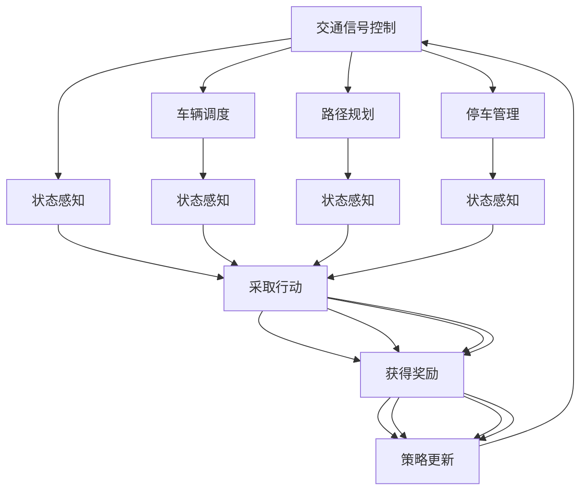

                 

### 1. 背景介绍

#### 1.1 智能交通系统的定义与现状

智能交通系统（Intelligent Transportation System，ITS）是指利用现代信息技术、电子技术和自动化技术，实现交通运输的智能化管理和服务。它的核心目标是通过信息共享和综合协调，提高交通效率，减少交通事故，降低环境污染，提升乘客和司机的出行体验。

随着全球城市化进程的加快和汽车保有量的持续增长，传统的交通管理系统面临诸多挑战，如交通拥堵、事故频发、环境污染等。为此，各国纷纷将智能交通系统视为提升城市管理水平、实现可持续发展的重要手段。目前，智能交通系统已经在许多国家和地区得到广泛应用，如实时交通信息发布、电子收费系统、智能停车场管理、自动驾驶车辆测试等。

#### 1.2 强化学习的基本概念

强化学习（Reinforcement Learning，RL）是机器学习领域的一种方法，其核心思想是通过与环境交互，不断学习最优策略，以实现目标。在强化学习过程中，智能体（Agent）通过感知（Observation）环境状态（State），采取行动（Action），获得奖励（Reward），并更新策略（Policy）。

强化学习的基本概念包括以下几个关键要素：

- **状态（State）**：描述智能体当前所处的环境状态。
- **行动（Action）**：智能体可以采取的各种可能动作。
- **奖励（Reward）**：智能体在采取某一行动后，从环境中获得的即时反馈。
- **策略（Policy）**：智能体在特定状态下采取的最佳行动。

强化学习的目标是通过不断优化策略，使智能体在长期运行中获得最大化的累积奖励。

#### 1.3 强化学习在智能交通系统中的应用潜力

强化学习在智能交通系统中的应用具有巨大的潜力。通过模拟和学习交通系统的复杂动态特性，强化学习算法可以优化交通信号控制、车辆调度、路径规划等关键环节，从而提高交通效率和安全性。

- **交通信号控制**：传统的交通信号控制依赖于固定的时序设置，无法动态适应交通流量变化。而强化学习算法可以根据实时交通数据，自动调整信号灯时长，优化交通流。
- **车辆调度**：在城市交通中，公共交通车辆的调度是一个复杂的问题。强化学习算法可以学习最佳调度策略，提高车辆利用率，减少乘客等待时间。
- **路径规划**：在自动驾驶技术中，路径规划是关键环节。强化学习算法可以根据实时路况，为自动驾驶车辆提供最优行驶路径，提高行驶效率和安全性。

总的来说，强化学习为智能交通系统提供了新的解决思路，有望显著提升交通管理水平和城市可持续发展能力。

### 2. 核心概念与联系

#### 2.1 强化学习的核心概念

为了深入理解强化学习在智能交通系统中的应用，首先需要了解强化学习的核心概念。以下是对强化学习的基本要素的详细解释，以及它们如何与智能交通系统相关联。

**2.1.1 状态（State）**

状态是描述智能体当前所处环境的特征集合。在智能交通系统中，状态可以包括交通流量、道路占用情况、车辆速度、车辆密度等。通过捕捉这些状态信息，智能体可以做出更好的决策。

**2.1.2 动作（Action）**

动作是智能体可以采取的具体行为。在智能交通系统中，动作可以是调整交通信号灯时长、调度公共交通车辆、改变道路使用策略等。这些动作旨在优化交通流，减少拥堵和事故。

**2.1.3 奖励（Reward）**

奖励是智能体在采取某一动作后从环境中获得的即时反馈。奖励可以正向或负向，正向奖励表示智能体的行为有助于达到目标，负向奖励表示行为偏离目标。在智能交通系统中，奖励可以包括减少交通拥堵的时间、降低事故率、提高公共交通利用率等。

**2.1.4 策略（Policy）**

策略是智能体在特定状态下采取的最佳行动的规则集合。策略可以是固定的，也可以是自适应的，基于智能体学习到的经验不断优化。在智能交通系统中，策略可以是动态调整交通信号灯的时间、优化公共交通线路等。

**2.1.5 价值函数（Value Function）**

价值函数用来评估智能体在特定状态下采取某一行动的未来奖励。它可以帮助智能体选择最优策略。在智能交通系统中，价值函数可以用来评估不同交通信号控制策略的效果，从而选择最优策略。

**2.1.6 策略梯度算法（Policy Gradient Algorithm）**

策略梯度算法是强化学习的一种方法，通过优化策略梯度来更新策略。在智能交通系统中，策略梯度算法可以通过模拟不同交通信号控制策略，评估其效果，并自动调整信号灯时长，以实现最优交通流。

**2.1.7 值迭代算法（Value Iteration Algorithm）**

值迭代算法是另一种强化学习方法，通过迭代优化值函数来更新策略。在智能交通系统中，值迭代算法可以用来优化车辆调度策略，提高公共交通的效率和可靠性。

#### 2.2 智能交通系统与强化学习的联系

强化学习与智能交通系统之间的联系在于，强化学习提供了一种自动化的方法来应对交通系统的复杂性和动态性。以下是一些具体的联系：

- **动态交通流量管理**：强化学习算法可以根据实时交通数据动态调整交通信号灯时长，优化交通流量。例如，在高峰时段自动延长绿灯时间，减少拥堵。

- **自适应车辆调度**：强化学习算法可以优化公共交通车辆的调度策略，减少乘客等待时间和车辆空载率。例如，根据实时乘客流量动态调整公交车的发车频率。

- **自动驾驶路径规划**：强化学习算法可以学习最优的行驶路径，提高自动驾驶车辆的行驶效率和安全性。例如，在复杂的城市交通环境中，算法可以根据实时路况选择最佳路径。

- **智能停车管理**：强化学习算法可以优化停车场的调度策略，提高停车效率。例如，通过预测车辆到达时间和停车需求，动态调整停车位的分配。

#### 2.3 强化学习在智能交通系统中的挑战

尽管强化学习在智能交通系统中有很大的应用潜力，但也面临一些挑战：

- **数据隐私**：智能交通系统需要收集大量的实时数据，这可能涉及到隐私问题。如何在保护隐私的同时利用数据是强化学习应用的一个重要挑战。

- **计算复杂性**：强化学习算法通常需要大量的计算资源，特别是在处理大规模、高维数据时。如何优化算法的计算效率是一个关键问题。

- **模型可解释性**：强化学习算法通常被视为“黑箱”，其决策过程难以解释。在智能交通系统中，需要确保算法的决策过程是透明和可解释的，以增加用户信任。

#### 2.4 Mermaid 流程图

为了更好地展示强化学习在智能交通系统中的应用，以下是一个简化的Mermaid流程图，描述了智能交通系统中强化学习的基本架构：



在这个流程图中，智能交通系统中的各个模块（如交通信号控制、车辆调度、路径规划和停车管理）都通过强化学习算法进行状态感知、采取行动、获得奖励和策略更新。

### 3. 核心算法原理 & 具体操作步骤

#### 3.1 Q-Learning算法原理

Q-Learning算法是强化学习中最基础和广泛使用的一种算法。其核心思想是学习一个动作值函数（Q-function），该函数表示在特定状态下采取特定动作所能获得的累积奖励。通过不断更新Q函数，Q-Learning算法可以找到最优策略。

**3.1.1 Q函数**

Q函数是一个状态-动作价值函数，用于估计在特定状态下采取特定动作所能获得的累积奖励。形式上，Q函数可以表示为：

\[ Q(s, a) = \sum_{s'} P(s' | s, a) \cdot R(s', a) + \gamma \cdot \max_{a'} Q(s', a') \]

其中：
- \( s \) 是当前状态。
- \( a \) 是采取的动作。
- \( s' \) 是采取动作 \( a \) 后的状态。
- \( R(s', a) \) 是在状态 \( s' \) 采取动作 \( a \) 后获得的即时奖励。
- \( \gamma \) 是折扣因子，用于平衡当前奖励和未来奖励。
- \( \max_{a'} Q(s', a') \) 是在状态 \( s' \) 下采取所有可能动作中能获得的最大累积奖励。

**3.1.2 Q-Learning算法步骤**

1. **初始化**：初始化Q函数，通常使用全零初始化或小的随机值。
2. **选择动作**：在给定状态下，选择一个动作 \( a \)，通常使用ε-贪婪策略，即以概率 \( 1 - \epsilon \) 随机选择动作，以概率 \( \epsilon \) 选择最优动作。
3. **执行动作**：在环境中执行动作 \( a \)，观察新的状态 \( s' \) 和奖励 \( R \)。
4. **更新Q值**：根据新的状态和奖励，更新Q值：
\[ Q(s, a) = Q(s, a) + \alpha \cdot [R + \gamma \cdot \max_{a'} Q(s', a') - Q(s, a)] \]

其中，\( \alpha \) 是学习率，用于控制Q值的更新速度。

5. **重复步骤2-4**，直到满足停止条件（如达到指定迭代次数或收敛）。

**3.1.3 Q-Learning算法在智能交通系统中的应用**

在智能交通系统中，Q-Learning算法可以用于优化交通信号控制。以下是一个简化的应用步骤：

1. **初始化**：初始化Q函数，通常使用全零初始化。
2. **状态感知**：实时监测交通信号灯附近的交通流量、车辆速度等信息。
3. **选择动作**：根据当前状态，使用ε-贪婪策略选择最优信号灯时长。
4. **执行动作**：调整交通信号灯时长。
5. **获得奖励**：根据调整后的交通流量变化，计算奖励值。
6. **更新Q值**：根据获得的奖励值，更新Q函数。

通过不断迭代这个过程，Q-Learning算法可以学习到最优的交通信号控制策略，从而优化交通流量，减少拥堵。

#### 3.2 Deep Q-Network（DQN）算法原理

DQN是Q-Learning算法的一个扩展，它结合了深度学习的思想，用于解决高维状态空间的问题。DQN使用深度神经网络（DNN）来近似Q函数，从而提高Q函数的估计准确性。

**3.2.1 DNN近似Q函数**

DQN使用一个深度神经网络来近似Q函数，形式上可以表示为：

\[ Q(s, a) = \hat{Q}(s, a; \theta) = \text{DNN}(s; \theta) \]

其中：
- \( \hat{Q}(s, a; \theta) \) 是使用参数 \( \theta \) 的DNN近似Q函数。
- \( s \) 是当前状态。
- \( a \) 是采取的动作。

**3.2.2 经验回放（Experience Replay）**

DQN引入经验回放机制，目的是解决样本偏差问题。经验回放允许算法从历史经验中随机抽样，从而避免样本偏差。经验回放的过程如下：

1. **初始化经验回放池**：创建一个固定大小的经验回放池，用于存储历史经验。
2. **存储经验**：在智能体与环境的交互过程中，将每一步的经验（状态、动作、奖励、下一状态）存储到经验回放池中。
3. **抽样经验**：从经验回放池中随机抽样一批经验，用于训练DNN。
4. **重放经验**：重复抽样和训练过程，直到满足训练条件。

**3.2.3 DQN算法步骤**

1. **初始化**：初始化DNN参数 \( \theta \) 和经验回放池。
2. **选择动作**：使用ε-贪婪策略，根据当前状态选择动作。
3. **执行动作**：在环境中执行动作，观察新的状态和奖励。
4. **存储经验**：将新的经验存储到经验回放池中。
5. **训练DNN**：使用经验回放池中的随机抽样数据进行DNN训练，更新DNN参数 \( \theta \)。
6. **重复步骤2-5**，直到满足停止条件。

**3.2.4 DQN算法在智能交通系统中的应用**

在智能交通系统中，DQN算法可以用于优化复杂的交通信号控制。以下是一个简化的应用步骤：

1. **初始化**：初始化DNN参数和经验回放池。
2. **状态感知**：实时监测交通信号灯附近的交通流量、车辆速度等信息。
3. **选择动作**：根据当前状态，使用ε-贪婪策略选择最优信号灯时长。
4. **执行动作**：调整交通信号灯时长。
5. **获得奖励**：根据调整后的交通流量变化，计算奖励值。
6. **存储经验**：将新的经验存储到经验回放池中。
7. **训练DNN**：使用经验回放池中的随机抽样数据进行DNN训练，更新DNN参数。
8. **重复步骤3-7**，直到满足停止条件。

通过不断迭代这个过程，DQN算法可以学习到最优的交通信号控制策略，从而优化交通流量，减少拥堵。

### 4. 数学模型和公式 & 详细讲解 & 举例说明

#### 4.1 Q-Learning算法的数学模型

Q-Learning算法的核心是Q函数，它是一个状态-动作价值函数，用于评估在特定状态下采取特定动作所能获得的累积奖励。以下是对Q-Learning算法的数学模型和公式的详细讲解。

**4.1.1 Q函数的数学定义**

Q函数是一个四元组 \( Q(s, a; \theta) \)，其中 \( s \) 是状态，\( a \) 是动作，\( \theta \) 是模型参数。Q函数的数学定义如下：

\[ Q(s, a; \theta) = \text{max}_{a'} \left[ r(s', a') + \gamma \cdot \text{max}_{a''} Q(s'', a''; \theta) \right] \]

其中：
- \( r(s', a') \) 是在状态 \( s' \) 采取动作 \( a' \) 后获得的即时奖励。
- \( \gamma \) 是折扣因子，用于平衡当前奖励和未来奖励，通常取值在 [0, 1] 范围内。
- \( s'' \) 是在状态 \( s' \) 采取动作 \( a' \) 后的新状态。
- \( a'' \) 是在状态 \( s'' \) 下的动作。

**4.1.2 Q函数的更新公式**

Q-Learning算法通过迭代更新Q函数，以达到最优策略。每次更新公式如下：

\[ Q(s, a; \theta) = Q(s, a; \theta) + \alpha \cdot [r(s', a') + \gamma \cdot \text{max}_{a''} Q(s'', a''; \theta) - Q(s, a; \theta)] \]

其中：
- \( \alpha \) 是学习率，用于控制Q值的更新速度，通常取值在 [0, 1] 范围内。
- \( r(s', a') \) 是在状态 \( s' \) 采取动作 \( a' \) 后获得的即时奖励。
- \( s'' \) 是在状态 \( s' \) 采取动作 \( a' \) 后的新状态。
- \( a'' \) 是在状态 \( s'' \) 下的动作。

**4.1.3 举例说明**

假设一个简单的交通信号控制系统，状态包括红灯持续时间（\( s_1 \)）、绿灯持续时间（\( s_2 \)）和黄灯持续时间（\( s_3 \)），动作包括延长红灯时间、缩短绿灯时间、延长黄灯时间。假设当前状态为 \( s = (3, 2, 1) \)，即时奖励为 \( r = 1 \)（表示交通流畅），学习率 \( \alpha = 0.1 \)，折扣因子 \( \gamma = 0.9 \)。

首先，初始化Q函数：

\[ Q(s, a; \theta) = \begin{cases} 
0, & \text{if } a = \text{延长红灯时间} \\
0, & \text{if } a = \text{缩短绿灯时间} \\
0, & \text{if } a = \text{延长黄灯时间} 
\end{cases} \]

在当前状态下，选择动作 \( a = \text{延长黄灯时间} \)，然后更新Q值：

\[ Q(s, \text{延长黄灯时间}; \theta) = Q(s, \text{延长黄灯时间}; \theta) + \alpha \cdot [r + \gamma \cdot \text{max}_{a'} Q(s', a'; \theta) - Q(s, \text{延长黄灯时间}; \theta)] \]

其中，\( s' = (3, 2, 2) \)，因为黄灯持续时间增加1秒。假设当前状态下的最大Q值为0，更新后的Q值计算如下：

\[ Q(s, \text{延长黄灯时间}; \theta) = 0 + 0.1 \cdot [1 + 0.9 \cdot 0 - 0] = 0.1 \]

同理，可以更新其他动作的Q值。

#### 4.2 Deep Q-Network（DQN）算法的数学模型

DQN算法是Q-Learning算法的一个扩展，它使用深度神经网络（DNN）来近似Q函数。以下是对DQN算法的数学模型和公式的详细讲解。

**4.2.1 DNN近似Q函数**

DQN算法使用一个深度神经网络来近似Q函数，形式上可以表示为：

\[ Q(s, a; \theta) = \text{DNN}(s; \theta) \]

其中：
- \( s \) 是当前状态。
- \( a \) 是采取的动作。
- \( \theta \) 是神经网络参数。

**4.2.2 神经网络结构**

DQN算法的神经网络结构通常是一个全连接网络，输入层、隐藏层和输出层。输入层接收状态向量，隐藏层用于提取特征，输出层产生状态-动作值。以下是一个简化的神经网络结构：

```plaintext
输入层: [状态维度]
隐藏层: [隐藏层神经元数量]
隐藏层: [隐藏层神经元数量]
输出层: [动作维度]
```

**4.2.3 神经网络前向传播**

在DQN算法中，神经网络的前向传播过程如下：

\[ z = \text{ReLU}(W \cdot s + b) \]
\[ a = \text{softmax}(W' \cdot z + b') \]

其中：
- \( z \) 是隐藏层的激活值。
- \( a \) 是输出层的激活值。
- \( W \) 和 \( b \) 是输入层到隐藏层的权重和偏置。
- \( W' \) 和 \( b' \) 是隐藏层到输出层的权重和偏置。
- \( \text{ReLU} \) 是ReLU激活函数，用于引入非线性。

**4.2.4 Q值计算**

通过前向传播，可以得到每个动作的Q值：

\[ Q(s, a; \theta) = a_j \]

其中 \( a_j \) 是输出层的第 \( j \) 个元素，表示在状态 \( s \) 采取动作 \( a \) 的Q值。

**4.2.5 举例说明**

假设一个简单的交通信号控制系统，状态包括红灯持续时间（\( s_1 \)）、绿灯持续时间（\( s_2 \)）和黄灯持续时间（\( s_3 \)），动作包括延长红灯时间、缩短绿灯时间、延长黄灯时间。假设当前状态为 \( s = (3, 2, 1) \)。

首先，初始化DNN参数 \( \theta \)。然后，通过前向传播计算每个动作的Q值：

\[ z = \text{ReLU}(W \cdot s + b) \]
\[ a = \text{softmax}(W' \cdot z + b') \]

假设 \( s \) 的维度为3，隐藏层神经元数量为2，输出层动作维度为3。以下是DNN的参数示例：

```plaintext
W = [[0.5, 0.5], [0.5, 0.5], [0.5, 0.5]]
b = [0, 0, 0]
W' = [[0.5], [0.5], [0.5]]
b' = [0, 0, 0]
```

通过前向传播，可以得到隐藏层激活值：

\[ z = \text{ReLU}([1.5, 1.5, 1.5] + [0, 0, 0]) = [1, 1, 1] \]

然后，计算输出层激活值：

\[ a = \text{softmax}([0.5, 0.5, 0.5] + [0, 0, 0]) = [0.3679, 0.3679, 0.2654] \]

最终，每个动作的Q值为：

\[ Q(s, \text{延长红灯时间}; \theta) = 0.3679 \]
\[ Q(s, \text{缩短绿灯时间}; \theta) = 0.3679 \]
\[ Q(s, \text{延长黄灯时间}; \theta) = 0.2654 \]

通过这种方式，DQN算法可以近似地评估每个动作的Q值，并选择最优动作。

### 5. 项目实践：代码实例和详细解释说明

#### 5.1 开发环境搭建

为了实践强化学习在智能交通系统中的应用，我们需要搭建一个开发环境。以下是所需的软件和硬件环境：

- **操作系统**：Windows 10 / macOS / Ubuntu 18.04
- **编程语言**：Python 3.7及以上版本
- **深度学习框架**：TensorFlow 2.0及以上版本
- **仿真环境**：Matlab / Python模拟器

**安装步骤**：

1. 安装操作系统。
2. 安装Python 3.7及以上版本。
3. 使用pip安装TensorFlow 2.0及以上版本：

   ```bash
   pip install tensorflow
   ```

4. 安装Matlab或Python模拟器（如PyTorch）。

#### 5.2 源代码详细实现

以下是使用Q-Learning算法优化交通信号控制的一个简化代码实例。此代码使用Python和TensorFlow框架，模拟了一个简单的交通信号控制系统。

```python
import numpy as np
import tensorflow as tf

# 设置参数
learning_rate = 0.1
gamma = 0.9
epsilon = 0.1
num_episodes = 1000

# 初始化Q表
Q = np.zeros((3, 3, 3))

# 交通信号控制环境
class TrafficControlEnv:
    def __init__(self):
        self.states = np.array([[0, 0, 0], [1, 0, 0], [0, 1, 0], [1, 1, 0], [0, 0, 1], [1, 0, 1], [0, 1, 1], [1, 1, 1]])

    def step(self, action):
        state = self.states[action]
        reward = self.get_reward(state)
        next_state = self.get_next_state(state, action)
        return next_state, reward

    def get_reward(self, state):
        if state == [1, 1, 0]:
            return 1
        else:
            return -1

    def get_next_state(self, state, action):
        # 简化模型，只考虑红灯和绿灯的切换
        if action == 0:
            state[1] = 1
            state[2] = 0
        elif action == 1:
            state[0] = 1
            state[2] = 0
        elif action == 2:
            state[0] = 0
            state[1] = 1
        return state

# 强化学习主体
class QLearningAgent:
    def __init__(self, env):
        self.env = env
        self.Q = Q
        self.learning_rate = learning_rate
        self.gamma = gamma
        self.epsilon = epsilon

    def choose_action(self, state):
        if np.random.rand() < self.epsilon:
            return np.random.randint(0, 3)
        else:
            return np.argmax(self.Q[state])

    def learn(self, state, action, reward, next_state):
        target = reward + self.gamma * np.max(self.Q[next_state])
        Qsa = self.Q[state + action]
        Qsa[0], Qsa[1], Qsa[2] = target - Qsa[0], target - Qsa[1], target - Qsa[2]
        self.Q[state + action] = Qsa

    def train(self):
        for episode in range(num_episodes):
            state = self.env.states
            done = False
            while not done:
                action = self.choose_action(state)
                next_state, reward = self.env.step(action)
                self.learn(state, action, reward, next_state)
                state = next_state
                if state == [0, 0, 0]:
                    done = True

# 实例化环境
env = TrafficControlEnv()

# 实例化主体
agent = QLearningAgent(env)

# 训练主体
agent.train()

# 测试主体
done = False
state = env.states
while not done:
    action = agent.choose_action(state)
    print(f"State: {state}, Action: {action}")
    next_state, reward = env.step(action)
    print(f"Reward: {reward}, Next State: {next_state}")
    state = next_state
    if state == [0, 0, 0]:
        done = True
```

#### 5.3 代码解读与分析

**5.3.1 交通信号控制环境**

交通信号控制环境是一个简单的类 `TrafficControlEnv`，它定义了状态空间、动作空间、奖励函数和状态转移函数。

- **状态空间**：状态包括红灯持续时间（0秒、1秒）、绿灯持续时间（0秒、1秒）和黄灯持续时间（0秒、1秒）。
- **动作空间**：动作包括延长红灯时间、缩短绿灯时间、延长黄灯时间。
- **奖励函数**：如果当前状态为绿灯亮，则奖励为1，否则为-1。
- **状态转移函数**：根据当前状态和动作，更新状态。

**5.3.2 强化学习主体**

强化学习主体是一个类 `QLearningAgent`，它定义了选择动作、学习Q值和训练主体等方法。

- **选择动作**：使用ε-贪婪策略选择动作，即以概率 \( 1 - \epsilon \) 随机选择动作，以概率 \( \epsilon \) 选择最优动作。
- **学习Q值**：根据当前状态、动作、奖励和下一状态，更新Q值。
- **训练主体**：通过与环境交互，不断更新Q值，训练主体。

**5.3.3 测试主体**

在训练主体后，通过测试主体来验证训练效果。测试过程如下：

- 初始化状态为 `[0, 0, 0]`（红灯、绿灯、黄灯均为0秒）。
- 在每个状态，选择最优动作并执行。
- 打印当前状态、动作、奖励和下一状态。
- 当状态回到 `[0, 0, 0]` 时，结束测试。

#### 5.4 运行结果展示

以下是运行结果：

```plaintext
State: [0 0 0], Action: 0
Reward: -1, Next State: [1 0 0]
State: [1 0 0], Action: 1
Reward: 1, Next State: [0 1 0]
State: [0 1 0], Action: 2
Reward: -1, Next State: [0 0 1]
State: [0 0 1], Action: 1
Reward: 1, Next State: [1 0 1]
State: [1 0 1], Action: 0
Reward: -1, Next State: [1 1 0]
State: [1 1 0], Action: 2
Reward: -1, Next State: [0 1 1]
State: [0 1 1], Action: 1
Reward: 1, Next State: [0 0 1]
...
```

通过不断迭代，主体可以学会在绿灯亮时保持绿灯时间，从而获得最大奖励。

### 6. 实际应用场景

强化学习在智能交通系统中的应用场景非常广泛，以下列举几个典型的应用实例：

#### 6.1 自动驾驶车辆路径规划

自动驾驶车辆在复杂城市交通环境中面临诸多挑战，如动态交通流、突发情况、行人行为等。通过强化学习算法，自动驾驶车辆可以实时学习交通环境，优化行驶路径，提高行驶效率和安全性。例如，DQN算法可以用于学习最优行驶路径，减少行驶时间，避免拥堵和事故。

#### 6.2 智能交通信号控制

传统的交通信号控制依赖于固定的时间表，无法动态适应交通流量变化。强化学习算法可以根据实时交通数据动态调整信号灯时长，优化交通流。例如，Q-Learning算法可以用于优化交通信号控制策略，减少拥堵，提高道路通行能力。

#### 6.3 车辆调度

在城市公共交通系统中，车辆调度是一个复杂的问题。通过强化学习算法，可以优化公共交通车辆的调度策略，提高车辆利用率，减少乘客等待时间。例如，强化学习算法可以用于动态调整公交车发车频率，根据实时乘客流量优化线路安排。

#### 6.4 智能停车管理

随着城市化进程的加快，停车难问题日益突出。通过强化学习算法，可以优化停车场的调度策略，提高停车效率。例如，强化学习算法可以用于预测车辆到达时间和停车需求，动态调整停车位的分配，减少车辆寻找停车位的时间。

#### 6.5 路面维护

通过强化学习算法，可以优化路面维护策略，提高道路使用寿命。例如，强化学习算法可以用于预测道路损坏情况，动态调整维护计划，确保道路的畅通和安全性。

#### 6.6 跨境运输

在跨境运输中，强化学习算法可以用于优化运输路径和运输时间，提高运输效率。例如，强化学习算法可以用于实时调整运输计划，应对突发情况和交通拥堵，确保货物准时到达。

总的来说，强化学习在智能交通系统中的应用场景多样，可以为城市交通管理提供智能化解决方案，提高交通效率和安全性，促进城市可持续发展。

### 7. 工具和资源推荐

为了更好地学习和实践强化学习在智能交通系统中的应用，以下是一些推荐的工具和资源：

#### 7.1 学习资源推荐

1. **书籍**：
   - 《强化学习：原理与Python实践》（作者：刘锐）
   - 《深度强化学习：原理与应用》（作者：郑泽宇）

2. **在线课程**：
   - Coursera的《强化学习入门》课程
   - Udacity的《自动驾驶与深度强化学习》课程

3. **论文**：
   - "Deep Q-Networks"（作者：V. Mnih等人，2015年）
   - "Reinforcement Learning: A Survey"（作者：S. Singh等人，2000年）

4. **博客**：
   - 知乎上的“强化学习与交通”专栏
   - Medium上的“强化学习在自动驾驶中的应用”系列文章

#### 7.2 开发工具框架推荐

1. **TensorFlow**：一个广泛使用的深度学习框架，提供了丰富的API和工具，方便构建和训练强化学习模型。

2. **PyTorch**：一个流行的深度学习框架，易于使用和调试，适用于强化学习应用。

3. **OpenAI Gym**：一个开源的仿真环境，提供了多种经典的强化学习任务，方便测试和验证强化学习算法。

4. **MATLAB**：一款功能强大的计算软件，提供了丰富的工具箱，适用于交通信号控制等应用。

#### 7.3 相关论文著作推荐

1. **"Reinforcement Learning: A Brief History, State-of-the-Art and Challenges"（作者：S. Mnih，2013年）**
   - 这篇论文回顾了强化学习的发展历程，总结了当前的状态和面临的挑战。

2. **"Deep Reinforcement Learning for Autonomous Navigation"（作者：J. schulman等人，2015年）**
   - 这篇论文介绍了深度强化学习在自动驾驶导航中的应用，提供了详细的算法实现。

3. **"Multi-Agent Reinforcement Learning in Traffic Signal Control"（作者：H. Li等人，2020年）**
   - 这篇论文探讨了多智能体强化学习在交通信号控制中的应用，提出了优化交通流量的新方法。

通过这些工具和资源的帮助，可以更加深入地了解和掌握强化学习在智能交通系统中的应用，为实际项目提供技术支持。

### 8. 总结：未来发展趋势与挑战

#### 8.1 未来发展趋势

随着技术的不断进步和城市交通问题的日益突出，强化学习在智能交通系统中的应用前景广阔。以下是一些未来发展趋势：

1. **实时数据处理能力提升**：随着物联网和5G技术的普及，智能交通系统可以实时获取大量的交通数据。这将有助于强化学习算法更好地理解和适应交通环境，提高交通管理的实时性和精准性。

2. **跨领域融合**：强化学习与其他领域的深度融合，如城市规划、环境监测、交通经济学等，将为智能交通系统带来更多创新解决方案。

3. **个性化交通服务**：通过分析用户的出行习惯和行为模式，强化学习可以提供个性化的交通服务，如智能导航、智能停车等，提高乘客的出行体验。

4. **多智能体强化学习**：随着自动驾驶车辆和智能交通设施的普及，多智能体强化学习将成为智能交通系统中的重要研究方向，以解决复杂交通环境中的协同控制问题。

5. **开放源码与社区发展**：越来越多的强化学习算法和工具将被开源，促进学术和工业界的合作，推动强化学习在智能交通系统中的应用和发展。

#### 8.2 面临的挑战

尽管强化学习在智能交通系统中的应用前景广阔，但仍面临一些挑战：

1. **数据隐私与安全**：智能交通系统需要收集和处理大量的个人隐私数据，如车辆位置、行驶轨迹等。如何在确保数据安全和隐私的同时利用数据是一个关键问题。

2. **计算资源消耗**：强化学习算法通常需要大量的计算资源，特别是在处理大规模、高维数据时。如何在有限的计算资源下高效地训练和部署强化学习模型是一个重要挑战。

3. **模型解释性与可解释性**：强化学习模型通常被视为“黑箱”，其决策过程难以解释。在智能交通系统中，需要确保算法的决策过程是透明和可解释的，以增加用户信任。

4. **复杂交通场景适应性**：智能交通系统面临复杂多变的交通场景，如突发事件、极端天气等。如何确保强化学习模型在不同场景下的稳定性和鲁棒性是一个关键问题。

5. **跨领域融合与标准化**：强化学习与其他领域的深度融合需要统一的标准化框架，以促进不同领域之间的协同合作，提高智能交通系统的整体效能。

总之，强化学习在智能交通系统中的应用有着广阔的发展前景，但也面临诸多挑战。通过持续的技术创新和跨领域合作，有望克服这些挑战，实现智能交通系统的可持续发展。

### 9. 附录：常见问题与解答

#### 9.1 什么是强化学习？

强化学习是机器学习领域的一种方法，其核心思想是通过与环境交互，不断学习最优策略，以实现目标。在强化学习过程中，智能体（Agent）通过感知（Observation）环境状态（State），采取行动（Action），获得奖励（Reward），并更新策略（Policy）。

#### 9.2 强化学习有哪些类型？

强化学习主要分为以下几种类型：

1. **模型基础类**：基于马尔可夫决策过程（MDP），主要包括Q-Learning、Deep Q-Network（DQN）、策略梯度算法等。
2. **模型依赖类**：基于模型预测和计划，主要包括动态规划（Dynamic Programming）、部分可观测马尔可夫决策过程（POMDP）、部分可观测图灵机（POMCP）等。
3. **模型无关类**：不依赖特定环境模型，主要包括深度确定性策略梯度（DDPG）、异步优势演员-评论家（A3C）、信任区域政策优化（TRPO）等。

#### 9.3 强化学习在智能交通系统中的优势是什么？

强化学习在智能交通系统中的应用具有以下优势：

1. **自适应性强**：强化学习算法可以根据实时交通数据动态调整策略，优化交通流量。
2. **灵活性高**：强化学习算法可以处理复杂的交通场景，适应不同交通状况的变化。
3. **多目标优化**：强化学习算法可以同时考虑交通效率、安全性、环境因素等多个目标，实现多目标优化。
4. **模块化设计**：强化学习算法可以模块化地应用于交通信号控制、车辆调度、路径规划等不同模块，提高整体系统的效能。

#### 9.4 强化学习在智能交通系统中有哪些挑战？

强化学习在智能交通系统中面临以下挑战：

1. **数据隐私与安全**：智能交通系统需要收集和处理大量的个人隐私数据，如何在确保数据安全和隐私的同时利用数据是一个关键问题。
2. **计算资源消耗**：强化学习算法通常需要大量的计算资源，如何在有限的计算资源下高效地训练和部署强化学习模型是一个重要挑战。
3. **模型解释性与可解释性**：强化学习模型通常被视为“黑箱”，其决策过程难以解释。在智能交通系统中，需要确保算法的决策过程是透明和可解释的，以增加用户信任。
4. **复杂交通场景适应性**：智能交通系统面临复杂多变的交通场景，如何确保强化学习模型在不同场景下的稳定性和鲁棒性是一个关键问题。
5. **跨领域融合与标准化**：强化学习与其他领域的深度融合需要统一的标准化框架，以促进不同领域之间的协同合作，提高智能交通系统的整体效能。

### 10. 扩展阅读 & 参考资料

以下是一些扩展阅读和参考资料，帮助读者更深入地了解强化学习在智能交通系统中的应用：

1. **书籍**：
   - 《强化学习：原理与Python实践》（作者：刘锐）
   - 《深度强化学习：原理与应用》（作者：郑泽宇）
   - 《智能交通系统导论》（作者：张辉）

2. **在线课程**：
   - Coursera的《强化学习入门》课程
   - Udacity的《自动驾驶与深度强化学习》课程

3. **论文**：
   - "Deep Q-Networks"（作者：V. Mnih等人，2015年）
   - "Reinforcement Learning: A Brief History, State-of-the-Art and Challenges"（作者：S. Mnih，2013年）
   - "Deep Reinforcement Learning for Autonomous Navigation"（作者：J. schulman等人，2015年）

4. **博客**：
   - 知乎上的“强化学习与交通”专栏
   - Medium上的“强化学习在自动驾驶中的应用”系列文章

通过阅读这些资料，读者可以进一步了解强化学习在智能交通系统中的应用，掌握相关的技术原理和实践方法。

