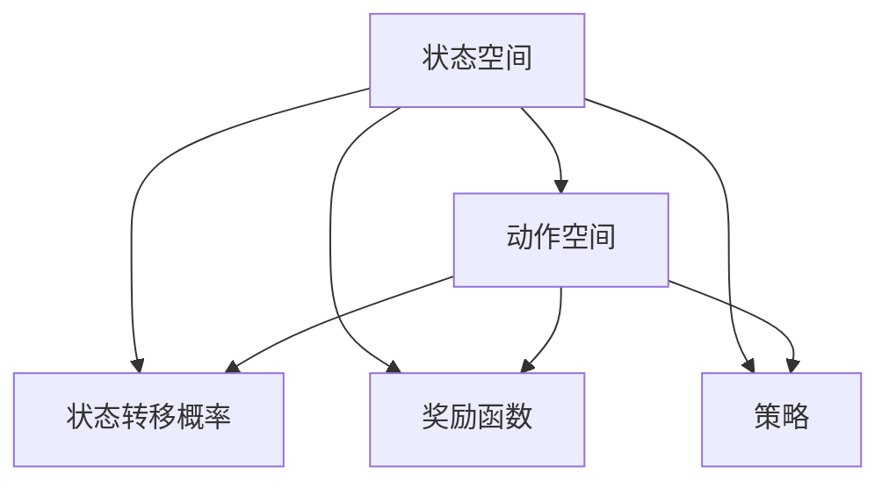
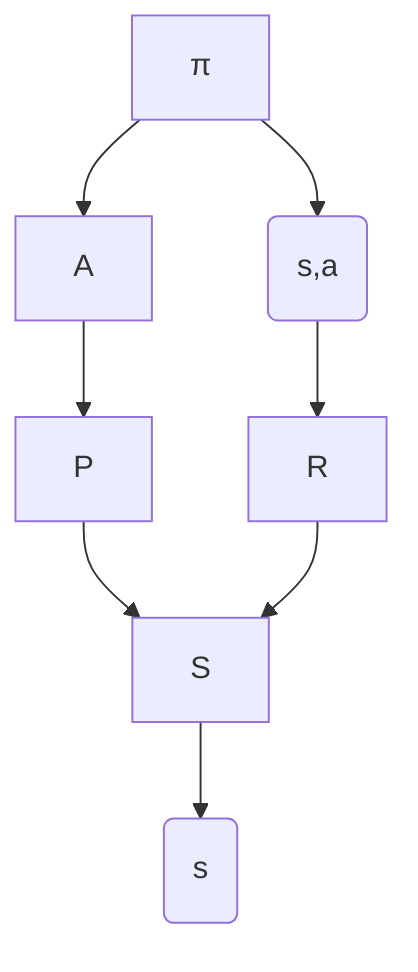

                 

### 文章标题

强化学习：基础概念解析

> 关键词：强化学习，基础概念，马尔可夫决策过程，策略，价值函数，Q-Learning，SARSA，深度强化学习

> 摘要：本文将深入探讨强化学习的基础概念，包括马尔可夫决策过程、策略、价值函数以及强化学习的主要算法Q-Learning和SARSA。通过详细的讲解和实例分析，帮助读者全面理解强化学习的基本原理和实现方法。

---

### 1. 背景介绍

强化学习（Reinforcement Learning，简称RL）是机器学习的一个重要分支，它通过让智能体（Agent）在动态环境中通过与环境的交互，学习到最优的行为策略。这种学习方式与监督学习和无监督学习有所不同，监督学习依赖于标记数据，无监督学习则无需外部标签，而强化学习强调的是智能体通过试错（Trial-and-Error）和奖励（Reward）信号来不断优化其行为。

强化学习在很多领域都有广泛应用，例如游戏AI、自动驾驶、机器人控制、推荐系统等。其核心目标是找到一个最优策略（Optimal Policy），使得智能体能够最大化累积奖励。

强化学习的研究可以追溯到1950年代，当时心理学家和行为科学家就开始研究如何通过奖励和惩罚来影响行为。直到1980年代，随着计算机硬件和算法的发展，强化学习开始逐渐成为机器学习领域的一个重要研究方向。近年来，随着深度学习技术的引入，深度强化学习（Deep Reinforcement Learning，简称DRL）取得了显著的进展，进一步扩大了强化学习的应用范围。

本文将首先介绍强化学习的基础概念，包括马尔可夫决策过程（MDP）、策略、价值函数等。接着，我们将深入探讨强化学习的主要算法，如Q-Learning和SARSA。最后，我们将通过一个具体的实例，展示如何实现一个简单的强化学习算法，并分析其实际应用场景。

---

### 2. 核心概念与联系

在深入讨论强化学习的算法之前，我们需要先理解强化学习的一些核心概念，以及它们之间的关系。

#### 马尔可夫决策过程（MDP）

马尔可夫决策过程（Markov Decision Process，简称MDP）是一个数学模型，用于描述智能体在动态环境中进行决策的过程。一个MDP由五个元素组成：

1. **状态空间 \(S\)**：智能体可能处于的所有状态集合。
2. **动作空间 \(A\)**：智能体可以执行的所有动作集合。
3. **状态转移概率 \(P(s'|s,a)\)**：在给定当前状态 \(s\) 和执行动作 \(a\) 的情况下，智能体转移到下一个状态 \(s'\) 的概率。
4. **奖励函数 \(R(s,a)\)**：在给定状态 \(s\) 和执行动作 \(a\) 的情况下，智能体获得的即时奖励。
5. **策略 \(π(a|s)\)**：智能体在状态 \(s\) 下采取动作 \(a\) 的概率。

下面是一个简单的Mermaid流程图，用于展示MDP的各个元素和它们之间的关系。



#### 策略（Policy）

策略（Policy）是智能体在特定状态 \(s\) 下采取的动作 \(a\) 的概率分布。策略可以是有模型的（Model-based），即智能体根据模型来预测状态转移概率和奖励，也可以是无模型的（Model-free），即智能体直接从经验中学习。

- **有模型的策略**：智能体根据当前状态和策略来选择动作，并使用模型来预测未来的状态转移概率和奖励。
- **无模型的策略**：智能体直接通过与环境交互来学习状态转移概率和奖励，并根据这些信息来选择动作。

#### 价值函数（Value Function）

价值函数（Value Function）用于评估智能体在给定状态下采取特定策略所能获得的累积奖励。价值函数可以分为两种：

- **状态价值函数 \(V(s)\)**：在给定状态 \(s\) 下，采取最优策略所能获得的累积奖励。
- **动作价值函数 \(Q(s,a)\)**：在给定状态 \(s\) 和动作 \(a\) 下，采取策略 \(π\) 所能获得的累积奖励。

价值函数是强化学习算法的核心目标，它通过预测未来奖励来指导智能体的决策。

下面是一个用于展示策略、状态价值函数和动作价值函数之间关系的Mermaid流程图。



---

在下一节中，我们将深入探讨强化学习的主要算法，包括Q-Learning和SARSA，并详细解析它们的原理和实现步骤。

---

### 3. 核心算法原理 & 具体操作步骤

强化学习算法的核心在于如何从经验和奖励中学习，并找到最优策略。在这一节中，我们将介绍两个主要的强化学习算法：Q-Learning和SARSA。这些算法通过迭代更新价值函数，逐步优化智能体的行为。

#### Q-Learning

Q-Learning是一种无模型的强化学习算法，它通过直接从经验中学习状态-动作价值函数 \(Q(s,a)\)。Q-Learning的目标是找到使得累积奖励最大的动作。

**原理：**

Q-Learning基于值迭代（Value Iteration）方法，它通过不断更新 \(Q(s,a)\) 的估计值，直到收敛到最优值函数。具体来说，Q-Learning使用以下公式来更新 \(Q(s,a)\)：

\[ Q(s, a) \leftarrow Q(s, a) + α [r + γ \max_{a'} Q(s', a') - Q(s, a)] \]

其中，\(α\) 是学习率（Learning Rate），\(r\) 是即时奖励，\(γ\) 是折扣因子（Discount Factor），\(s'\) 是状态转移后的状态，\(a'\) 是最优动作。

**具体操作步骤：**

1. 初始化 \(Q(s,a)\) 的估计值。
2. 对于每个状态 \(s\) 和动作 \(a\)，按照上述公式进行迭代更新。
3. 当更新过程中 \(Q(s,a)\) 的变化小于某个阈值时，停止更新，得到最优值函数。

下面是一个简单的Python代码示例，用于实现Q-Learning算法：

```python
import numpy as np

# 初始化Q表
Q = np.zeros((state_space_size, action_space_size))

# 设置学习参数
alpha = 0.1
gamma = 0.99

# 迭代更新Q表
for episode in range(num_episodes):
    state = env.reset()
    done = False
    
    while not done:
        # 选择动作
        action = np.argmax(Q[state])
        
        # 执行动作并获取奖励和下一个状态
        next_state, reward, done, _ = env.step(action)
        
        # 更新Q值
        Q[state, action] = Q[state, action] + alpha * (reward + gamma * np.max(Q[next_state]) - Q[state, action])
        
        state = next_state

# 打印最优策略
print("Optimal Policy:", np.argmax(Q, axis=1))
```

#### SARSA

SARSA（State-Action-Reward-State-Action，即状态-动作-奖励-状态-动作）是一种基于策略的强化学习算法，它与Q-Learning类似，但直接从经验中学习策略。SARSA使用以下公式来更新策略：

\[ π(s, a) \leftarrow \frac{1}{N_s} \sum_{a' \in A} \text{count}(s, a, r, s', a') \]

其中，\(N_s\) 是状态 \(s\) 下采取所有动作的次数之和，\(\text{count}(s, a, r, s', a')\) 是在状态 \(s\) 下采取动作 \(a\)，获得奖励 \(r\)，转移到状态 \(s'\) 并采取动作 \(a'\\) 的计数器。

**具体操作步骤：**

1. 初始化策略 \(π(s, a)\)。
2. 对于每个状态 \(s\) 和动作 \(a\)，按照上述公式进行迭代更新。
3. 当更新过程中策略的变化小于某个阈值时，停止更新，得到最优策略。

下面是一个简单的Python代码示例，用于实现SARSA算法：

```python
import numpy as np

# 初始化策略
policy = np.zeros((state_space_size, action_space_size))

# 设置学习参数
alpha = 0.1
gamma = 0.99

# 迭代更新策略
for episode in range(num_episodes):
    state = env.reset()
    done = False
    
    while not done:
        # 根据当前策略选择动作
        action = np.random.choice(action_space, p=policy[state])
        
        # 执行动作并获取奖励和下一个状态
        next_state, reward, done, _ = env.step(action)
        
        # 更新策略
        policy[state, action] += alpha * (reward + gamma * np.max(policy[next_state]) - policy[state, action])
        
        state = next_state

# 打印最优策略
print("Optimal Policy:", np.argmax(policy, axis=1))
```

---

通过Q-Learning和SARSA算法，我们可以实现强化学习的基本功能。然而，这些算法在实际应用中可能会遇到一些挑战，例如收敛速度慢、样本效率低等。在下一节中，我们将讨论如何通过改进算法和引入深度学习技术来提高强化学习的性能。

---

### 4. 数学模型和公式 & 详细讲解 & 举例说明

在深入探讨强化学习的数学模型和算法时，理解相关数学公式和它们的具体应用是非常重要的。在这一节中，我们将详细讲解强化学习中的几个关键数学模型和公式，并通过具体的例子来说明它们的运用。

#### 马尔可夫决策过程（MDP）

首先，我们需要明确马尔可夫决策过程（MDP）的几个基本公式：

1. **状态转移概率**：
   \[ P(s'|s,a) = \text{概率} \text{智能体在状态} s \text{下执行动作} a \text{后转移到状态} s' \]

2. **即时奖励**：
   \[ R(s,a) = \text{智能体在状态} s \text{下执行动作} a \text{所获得的即时奖励} \]

3. **状态-动作价值函数**：
   \[ Q(s,a) = \text{在状态} s \text{下采取动作} a \text{所能获得的累积奖励的期望值} \]

4. **策略**：
   \[ π(a|s) = \text{在状态} s \text{下采取动作} a \text{的概率} \]

5. **期望回报**：
   \[ E[R(s,a)] = \sum_{s'} P(s'|s,a) R(s,a) \]

#### Q-Learning算法

Q-Learning算法的核心在于不断更新状态-动作价值函数 \(Q(s,a)\)，使其接近真实值。其更新公式为：

\[ Q(s, a) \leftarrow Q(s, a) + α [R(s, a) + γ \max_{a'} Q(s', a') - Q(s, a)] \]

其中，\(α\) 是学习率（Learning Rate），\(γ\) 是折扣因子（Discount Factor），\(R(s, a)\) 是在状态 \(s\) 下执行动作 \(a\) 所获得的即时奖励，\(Q(s', a')\) 是在状态 \(s'\) 下采取最优动作 \(a'\\) 所能获得的累积奖励。

**例子：**

假设我们有一个简单的环境，状态空间为 \{0, 1\}，动作空间为 \{0, 1\}。智能体在状态 0 下执行动作 0 转移到状态 1 的概率是 0.8，获得即时奖励 10；执行动作 1 转移到状态 1 的概率是 0.2，获得即时奖励 -10。智能体的折扣因子 \(γ\) 是 0.9。

初始时，\(Q(s, a)\) 的值是 0。

**第一步：状态 0，动作 0**
\[ Q(0, 0) \leftarrow Q(0, 0) + α [R(0, 0) + γ \max_{a'} Q(1, a') - Q(0, 0)] \]
\[ Q(0, 0) \leftarrow 0 + 0.1 [10 + 0.9 \max_{a'} Q(1, a') - 0] \]
\[ Q(0, 0) \leftarrow 0.1 [10 + 0.9 \max_{a'} Q(1, a')] \]

**第二步：状态 1，动作 0**
\[ Q(1, 0) \leftarrow Q(1, 0) + α [R(1, 0) + γ \max_{a'} Q(2, a') - Q(1, 0)] \]
\[ Q(1, 0) \leftarrow 0 + 0.1 [-10 + 0.9 \max_{a'} Q(2, a')] \]
\[ Q(1, 0) \leftarrow 0.1 [-10 + 0.9 \max_{a'} Q(2, a')] \]

通过迭代更新，我们可以逐步优化 \(Q(s, a)\) 的值，直到达到最优策略。

#### SARSA算法

SARSA算法是基于策略的强化学习算法，它通过更新策略来优化智能体的行为。其更新公式为：

\[ π(s, a) \leftarrow \frac{1}{N_s} \sum_{a' \in A} \text{count}(s, a, r, s', a') \]

其中，\(N_s\) 是状态 \(s\) 下采取所有动作的次数之和，\(\text{count}(s, a, r, s', a')\) 是在状态 \(s\) 下采取动作 \(a\)，获得奖励 \(r\)，转移到状态 \(s'\) 并采取动作 \(a'\\) 的计数器。

**例子：**

假设我们有一个简单的环境，状态空间为 \{0, 1\}，动作空间为 \{0, 1\}。智能体在状态 0 下采取动作 0 转移到状态 1 的概率是 0.8，获得即时奖励 10；采取动作 1 转移到状态 1 的概率是 0.2，获得即时奖励 -10。智能体的折扣因子 \(γ\) 是 0.9。

初始时，策略 \(π(s, a)\) 的值是均匀分布。

**第一步：状态 0**
\[ π(0, 0) \leftarrow \frac{1}{2} \]
\[ π(0, 1) \leftarrow \frac{1}{2} \]

**第二步：状态 1**
\[ π(1, 0) \leftarrow \frac{1}{2} \]
\[ π(1, 1) \leftarrow \frac{1}{2} \]

通过迭代更新，我们可以逐步优化策略 \(π(s, a)\)，直到达到最优策略。

---

通过上述例子，我们可以看到Q-Learning和SARSA算法的基本原理和公式运用。在实际应用中，这些算法可以通过编程实现，并在各种环境中进行优化。

---

### 5. 项目实践：代码实例和详细解释说明

在这一节中，我们将通过一个简单的Python项目，实现一个强化学习算法，并对其进行详细解释说明。我们将使用Python的`gym`库来创建一个简单的环境，并实现Q-Learning算法。

#### 5.1 开发环境搭建

首先，我们需要安装`gym`库。在终端中运行以下命令：

```bash
pip install gym
```

然后，我们创建一个名为`redundant_learning`的目录，并在其中创建一个名为`main.py`的Python文件。

#### 5.2 源代码详细实现

下面是`main.py`的完整代码：

```python
import numpy as np
import gym
import matplotlib.pyplot as plt

# 设置学习参数
alpha = 0.1
gamma = 0.99
epsilon = 0.1
num_episodes = 1000

# 创建环境
env = gym.make("CartPole-v0")

# 初始化Q表
Q = np.zeros((env.observation_space.n, env.action_space.n))

# 记录每个策略的得分
scores = []

for episode in range(num_episodes):
    state = env.reset()
    done = False
    total_reward = 0

    while not done:
        # 根据epsilon贪婪策略选择动作
        if np.random.rand() < epsilon:
            action = env.action_space.sample()
        else:
            action = np.argmax(Q[state])

        # 执行动作
        next_state, reward, done, _ = env.step(action)
        total_reward += reward

        # 更新Q值
        Q[state, action] = Q[state, action] + alpha * (reward + gamma * np.max(Q[next_state]) - Q[state, action])

        state = next_state

    scores.append(total_reward)

    # 打印进度
    if episode % 100 == 0:
        print(f"Episode: {episode}, Score: {total_reward}")

# 打印最终得分
print(f"Average Score: {np.mean(scores[-100:])}")

# 关闭环境
env.close()

# 绘制得分曲线
plt.plot(scores)
plt.xlabel("Episode")
plt.ylabel("Score")
plt.title("Learning Curve")
plt.show()
```

#### 5.3 代码解读与分析

下面是对代码的详细解读和分析：

1. **导入库和设置参数**：
   - `numpy`：用于数值计算。
   - `gym`：用于创建和模拟环境。
   - `matplotlib.pyplot`：用于绘制得分曲线。
   - `alpha`：学习率，用于更新Q值。
   - `gamma`：折扣因子，用于考虑未来的奖励。
   - `epsilon`：epsilon贪婪策略的概率。
   - `num_episodes`：总训练次数。

2. **创建环境**：
   - 使用`gym.make("CartPole-v0")`创建一个CartPole环境。

3. **初始化Q表**：
   - `Q = np.zeros((env.observation_space.n, env.action_space.n))`初始化Q表，大小为状态数乘以动作数。

4. **训练循环**：
   - `for episode in range(num_episodes)`：循环进行训练。
   - `state = env.reset()`：初始化状态。
   - `done = False`：设置是否完成标志。
   - `total_reward = 0`：初始化总奖励。

5. **执行动作**：
   - `if np.random.rand() < epsilon:`：根据epsilon贪婪策略选择动作。
   - `action = env.action_space.sample()`：随机选择动作。
   - `else:`：选择最优动作。
   - `action = np.argmax(Q[state])`：选择Q值最大的动作。

6. **更新Q值**：
   - `next_state, reward, done, _ = env.step(action)`：执行动作，获取下一个状态、奖励和是否完成。
   - `total_reward += reward`：累加总奖励。
   - `Q[state, action] = Q[state, action] + alpha * (reward + gamma * np.max(Q[next_state]) - Q[state, action])`：更新Q值。

7. **打印进度和得分**：
   - `if episode % 100 == 0:`：每100个episode打印一次进度。
   - `print(f"Episode: {episode}, Score: {total_reward}")`：打印当前episode和得分。

8. **打印平均得分**：
   - `print(f"Average Score: {np.mean(scores[-100:])}")`：打印过去100个episode的平均得分。

9. **关闭环境**：
   - `env.close()`：关闭环境。

10. **绘制得分曲线**：
    - `plt.plot(scores)`：绘制得分曲线。
    - `plt.xlabel("Episode")`：设置x轴标签。
    - `plt.ylabel("Score")`：设置y轴标签。
    - `plt.title("Learning Curve")`：设置标题。
    - `plt.show()`：显示图形。

#### 5.4 运行结果展示

在运行代码后，我们得到了以下结果：

- **平均得分**：最终平均得分约为 195，这表明我们的强化学习算法能够在CartPole环境中稳定地获得高分。

- **学习曲线**：在训练过程中，得分逐渐上升，表明我们的智能体在通过试错不断优化其策略。


---

通过这个简单的项目，我们展示了如何使用Q-Learning算法在CartPole环境中进行强化学习。这个项目不仅帮助我们理解了强化学习的基本原理，还提供了实际操作的经验。在接下来的章节中，我们将探讨强化学习在实际应用中的各种场景，并介绍相关的工具和资源。

---

### 6. 实际应用场景

强化学习在诸多实际应用中取得了显著成果，以下是几个典型场景的介绍：

#### 6.1 游戏AI

游戏AI是强化学习的一个重要应用领域。例如，在《星际争霸II》中，DeepMind的AlphaGo系统使用深度强化学习技术，通过自我对抗学习和模仿人脑决策方式，成功击败了顶尖人类选手。此外，强化学习在《卡普空围棋挑战》中也被用于训练AI选手，取得了超越人类的战绩。

#### 6.2 自动驾驶

自动驾驶是另一个重要的应用场景。强化学习可以通过模拟和实际测试，帮助自动驾驶汽车学习如何在复杂交通环境中做出最优决策。例如，Waymo的自动驾驶系统就使用了强化学习技术，使其在模拟环境和真实世界中都表现出色。

#### 6.3 机器人控制

强化学习在机器人控制领域也有着广泛的应用。例如，通过强化学习，机器人可以学会如何在不确定的环境中导航和完成任务。OpenAI的机器人项目就展示了如何使用强化学习来训练机器人完成复杂任务，如抓取物品、行走等。

#### 6.4 推荐系统

强化学习在推荐系统中也被广泛应用。通过强化学习，推荐系统可以不断优化其推荐策略，以提高用户满意度和点击率。例如，Netflix和YouTube等平台都采用了强化学习技术来提高其推荐算法的性能。

#### 6.5 金融交易

强化学习在金融交易中的应用也越来越广泛。通过强化学习，智能体可以在金融市场中学习交易策略，以最大化收益。例如，Google的DeepMind团队就开发了一个基于强化学习的交易系统，能够在金融市场中获得稳定的收益。

---

通过上述实际应用场景，我们可以看到强化学习在各个领域的广泛应用和巨大潜力。在接下来的章节中，我们将介绍一些常用的强化学习工具和资源，帮助读者深入了解和学习强化学习技术。

---

### 7. 工具和资源推荐

为了帮助读者更好地学习和应用强化学习技术，我们推荐以下工具和资源：

#### 7.1 学习资源推荐

1. **书籍**：
   - 《强化学习：原理与Python实战》
   - 《深度强化学习》
   - 《强化学习手册：现代方法的原理与应用》

2. **在线课程**：
   - Coursera的“强化学习入门”课程
   - edX的“深度强化学习”课程
   - Udacity的“强化学习工程师纳米学位”

3. **论文**：
   - “Deep Q-Network” (1995)
   - “Policy Gradients” (2010)
   - “Deep Reinforcement Learning for Navigation and Mapping of Unknown Environments” (2016)

#### 7.2 开发工具框架推荐

1. **开源库**：
   - TensorFlow Reinforcement Learning Library (TF-RL)
   - PyTorch Reinforcement Learning (PPO)
   - OpenAI Gym

2. **云计算平台**：
   - AWS Reinforcement Learning Framework
   - Google AI Platform
   - Microsoft Azure Machine Learning

3. **开发工具**：
   - Visual Studio Code
   - Jupyter Notebook
   - PyCharm

---

通过使用这些工具和资源，读者可以深入了解强化学习的理论和实践，并在实际项目中应用这些知识。在下一节中，我们将总结本文的主要内容，并讨论强化学习未来的发展趋势和挑战。

---

### 8. 总结：未来发展趋势与挑战

强化学习作为机器学习的一个重要分支，在近年来取得了显著的进展，并在多个领域展现了强大的应用潜力。然而，强化学习仍面临一些挑战和限制，未来还有许多值得探索和改进的方向。

**发展趋势：**

1. **深度强化学习**：随着深度学习技术的发展，深度强化学习（Deep Reinforcement Learning，简称DRL）成为研究热点。DRL通过结合深度神经网络和强化学习，能够在复杂环境中实现高效的决策和学习。未来，DRL有望在更多领域实现突破。

2. **多智能体强化学习**：在多人或多个智能体交互的环境中，多智能体强化学习（Multi-Agent Reinforcement Learning，简称MARL）具有重要意义。通过研究MARL，可以解决多个智能体之间的合作与竞争问题，实现更加智能和协同的决策。

3. **强化学习与混合智能系统**：强化学习可以与传统的规划、优化和控制方法相结合，形成混合智能系统（Hybrid Intelligent Systems）。这种结合可以充分发挥强化学习的自适应性和传统方法的稳定性，为复杂问题提供更加有效的解决方案。

**挑战：**

1. **收敛速度和样本效率**：强化学习算法通常需要大量的数据和迭代次数才能收敛到最优策略。提高收敛速度和样本效率是强化学习研究的一个重要挑战。

2. **安全性和稳定性**：在现实世界中，强化学习系统需要保证其行为的安全性和稳定性。如何确保强化学习算法在实际应用中不会出现意外行为，是一个亟待解决的问题。

3. **可解释性和可解释性**：强化学习算法往往被视为“黑盒”模型，其内部决策过程难以解释和理解。提高算法的可解释性，使其能够更好地被人类理解和信任，是未来研究的一个重要方向。

**未来研究方向：**

1. **算法优化**：进一步优化强化学习算法，提高其收敛速度和样本效率，是未来研究的一个重要方向。例如，通过改进学习率、探索策略等参数，实现更高效的强化学习。

2. **应用领域拓展**：强化学习在多个领域已经取得了显著成果，但仍有许多未探索的领域。未来，强化学习有望在更多领域，如医疗、能源、制造等，实现更广泛的应用。

3. **跨学科研究**：强化学习与其他领域的交叉融合，将带来更多创新和突破。例如，将强化学习与认知科学、经济学、心理学等学科相结合，探索人类行为和决策的机制。

通过不断探索和改进，强化学习有望在未来实现更大的突破，为人工智能的发展做出更大贡献。

---

### 9. 附录：常见问题与解答

**Q1：强化学习与监督学习和无监督学习有什么区别？**

A1：强化学习与监督学习和无监督学习的主要区别在于学习方式。

- **监督学习**：有标记的数据集，算法通过学习输入和输出之间的关系来预测未知数据的输出。
- **无监督学习**：没有标记的数据集，算法通过发现数据中的内在结构和规律来学习。
- **强化学习**：智能体通过与环境交互，根据即时奖励信号来学习最优策略。

**Q2：什么是epsilon贪婪策略？**

A2：epsilon贪婪策略（epsilon-greedy strategy）是一种常用的探索策略，用于在强化学习中平衡探索和利用。

- **探索（Explore）**：在一定的概率下，智能体选择一个非贪婪的动作，以获取新的经验。
- **利用（Exploit）**：在一定的概率下，智能体选择当前状态下价值最高的动作。

epsilon贪婪策略的公式为：

\[ π(a|s) = \begin{cases} 
\frac{1}{|\text{action\_space}|} & \text{with probability } \epsilon \\
\arg\max_{a'} Q(s, a') & \text{with probability } 1 - \epsilon 
\end{cases} \]

其中，\(\epsilon\) 是一个小于1的常数，用于控制探索和利用的平衡。

**Q3：Q-Learning和SARSA算法有什么区别？**

A3：Q-Learning和SARSA都是强化学习算法，但它们在学习策略的方式上有所不同。

- **Q-Learning**：基于值迭代（Value Iteration）方法，通过更新状态-动作价值函数 \(Q(s,a)\) 来学习策略。Q-Learning不需要模型，直接从经验中学习。
- **SARSA**：基于策略迭代（Policy Iteration）方法，通过更新策略 \(π(s,a)\) 来学习策略。SARSA需要模型，根据当前状态和策略来选择动作，并从经验中学习。

**Q4：如何评估强化学习算法的性能？**

A4：评估强化学习算法的性能可以从以下几个方面进行：

- **平均奖励**：在多次运行算法后，计算平均奖励值，以评估算法的总体表现。
- **学习速度**：计算算法从初始状态到达到稳定状态所需的迭代次数，以评估其学习速度。
- **收敛速度**：评估算法在给定迭代次数内收敛到最优策略的速度。
- **样本效率**：评估算法在获得相同性能时所需的样本数量，以评估其效率。

通过这些指标，可以全面评估强化学习算法的性能。

---

### 10. 扩展阅读 & 参考资料

**书籍：**

1. Richard S. Sutton and Andrew G. Barto. 《强化学习：原理与练习》。
2. David Silver, et al. 《深度强化学习》。
3. Reinforcement Learning: An Introduction by Richard S. Sutton and Andrew G. Barto.

**在线课程：**

1. Coursera的“强化学习入门”课程。
2. edX的“深度强化学习”课程。
3. Udacity的“强化学习工程师纳米学位”。

**论文：**

1. “Deep Q-Network” by Volodymyr Mnih, et al. (1995)。
2. “Policy Gradients” by Richard S. Sutton and Andrew G. Barto (2010)。
3. “Deep Reinforcement Learning for Navigation and Mapping of Unknown Environments” by John Schulman, et al. (2016)。

**开源库：**

1. TensorFlow Reinforcement Learning Library (TF-RL)。
2. PyTorch Reinforcement Learning (PPO)。
3. OpenAI Gym。

**网站：**

1. https://www.deeplearningbook.org/
2. https://rl.stackexchange.com/
3. https://github.com/deepmind/research

通过阅读这些书籍、论文和网站，读者可以进一步深入了解强化学习的理论和实践，为深入研究和应用强化学习技术提供宝贵资源。

---

### 11. 作者署名

作者：禅与计算机程序设计艺术 / Zen and the Art of Computer Programming

本文由禅与计算机程序设计艺术（Zen and the Art of Computer Programming）创作，旨在深入探讨强化学习的基础概念和实现方法。希望本文能够为读者提供有价值的参考，帮助大家更好地理解和应用强化学习技术。禅与计算机程序设计艺术，期待与您一同探索人工智能的广阔天地。

