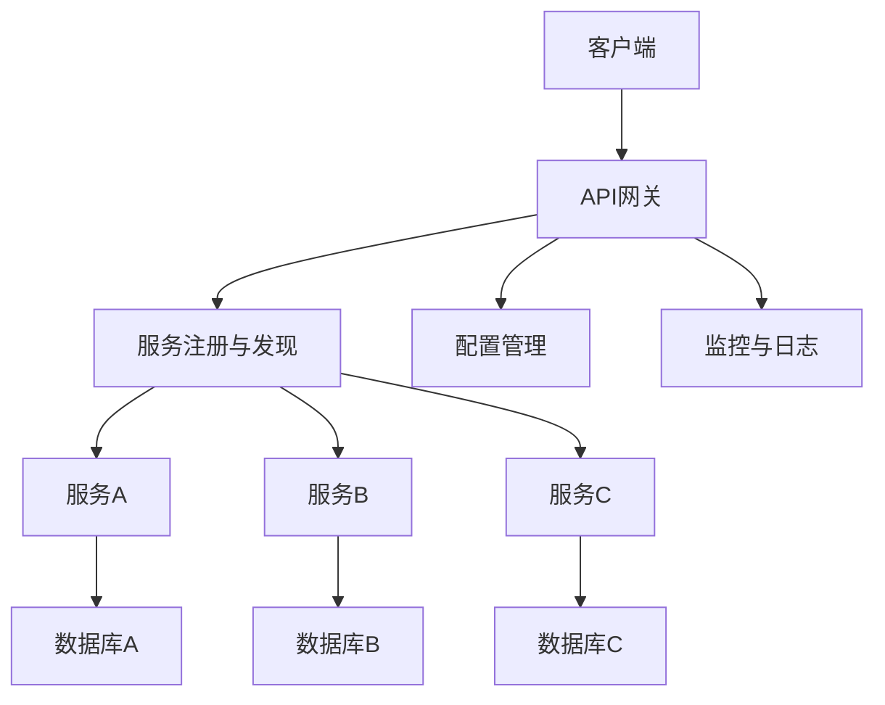

                 

### 背景介绍

随着互联网技术的迅猛发展，创业项目的开发模式也在不断演进。传统的单体架构由于其复杂性和难以维护性，已经难以满足快速变化的市场需求。微服务架构作为一种新型的分布式系统设计理念，因其灵活性和可扩展性，逐渐成为创业项目开发的主流选择。

#### 1.1 微服务架构的定义和特点

微服务架构是一种基于分布式系统的设计模式，它将应用程序划分为一组小型的、独立的、自治的服务单元。每个服务单元负责完成特定的业务功能，并通过轻量级的通信机制（如RESTful API）进行交互。微服务架构具有以下几个显著特点：

1. **独立性**：每个微服务都是独立的，可以独立部署、扩展和更新，不会影响其他服务的运行。
2. **松耦合**：微服务之间通过定义良好的接口进行通信，相互之间解耦，降低了系统复杂度。
3. **可扩展性**：微服务可以根据业务需求独立进行扩展，提高了系统的伸缩能力。
4. **高可用性**：通过分布式部署，微服务架构能够实现高可用性，系统在个别服务故障时仍能正常运行。
5. **易于开发**：微服务架构支持灵活的开发和部署，使得团队可以独立开发、测试和部署不同的服务。

#### 1.2 创业项目中的需求

创业项目的特点通常是需求快速变化、市场压力大、资源有限。传统的单体架构在这种环境下显得力不从心，难以快速响应市场变化。微服务架构的灵活性、可扩展性和独立性能够很好地满足这些需求：

1. **快速迭代**：微服务架构允许团队独立开发、测试和部署不同的服务，从而实现快速迭代和交付。
2. **灵活调整**：在面对市场变化时，团队可以独立调整某个服务的功能，而不会影响到整个系统的稳定性。
3. **资源优化**：微服务架构可以根据业务需求动态调整资源分配，充分利用有限的计算资源。
4. **风险管理**：微服务的独立性使得系统在某个服务出现故障时，可以通过其他正常的服务维持系统的可用性，从而降低风险。

综上所述，微服务架构在创业项目中的应用具有重要意义，它不仅能够提高系统的灵活性和可扩展性，还能帮助团队更好地应对市场变化，实现快速发展和创新。

### 核心概念与联系

#### 2.1 微服务架构的核心概念

微服务架构的核心在于将复杂的单体应用拆分成多个独立的服务单元，每个服务单元都专注于实现特定的业务功能。以下是一些关键概念：

1. **服务**：服务是微服务架构中的基本构建块，它代表了一个独立的业务功能，可以通过RESTful API与其他服务进行通信。
2. **容器**：容器是运行服务的基本环境，它提供了隔离性、轻量级和可移植性，常用的容器技术包括Docker和Kubernetes。
3. **API网关**：API网关是客户端与微服务之间的入口点，它负责将请求路由到相应的服务，并提供认证、监控等功能。
4. **服务注册与发现**：服务注册与发现机制使得服务可以在运行时动态地注册和发现其他服务，从而实现服务之间的动态通信。
5. **配置管理**：配置管理负责管理服务的配置信息，包括环境变量、数据库连接等，通常使用分布式配置中心实现。
6. **监控与日志**：监控与日志系统负责收集、存储和展示系统的运行状态，帮助团队及时发现和解决问题。

#### 2.2 微服务架构的联系

微服务架构中的各个概念相互关联，共同构成了一个复杂的分布式系统。以下是一个简化的Mermaid流程图，展示了微服务架构的核心组件及其相互关系：



**图 1：微服务架构的核心组件及其相互关系**

- **客户端**：客户端通过API网关发送请求，API网关负责将请求路由到相应的服务。
- **API网关**：API网关不仅负责路由，还提供认证、监控等功能，同时与服务注册与发现、配置管理、监控与日志系统进行通信。
- **服务注册与发现**：服务注册与发现系统负责在运行时动态地注册和发现其他服务，从而实现服务之间的动态通信。
- **配置管理**：配置管理负责管理服务的配置信息，确保服务能够根据不同的环境动态调整配置。
- **监控与日志**：监控与日志系统负责收集、存储和展示系统的运行状态，帮助团队及时发现和解决问题。

通过这些核心概念和联系，微服务架构能够实现高效的分布式系统设计，满足创业项目快速变化的需求。

### 核心算法原理 & 具体操作步骤

#### 3.1 服务拆分与划分

微服务架构的核心在于将复杂的单体应用拆分成多个独立的服务单元。这一过程通常包括以下几个步骤：

1. **识别业务功能**：首先，我们需要识别出应用中的不同业务功能。例如，一个电商系统可能包括商品管理、订单管理、用户管理等多个功能。
2. **划分服务**：根据业务功能，我们将应用划分为多个独立的服务单元。每个服务单元负责实现特定的业务功能，例如商品服务、订单服务、用户服务等。
3. **定义服务接口**：为每个服务定义清晰、简洁的接口，通过RESTful API与其他服务进行通信。接口的设计应该遵循REST原则，确保接口的简洁性和易用性。

#### 3.2 服务部署与治理

拆分服务后，我们需要将它们部署在分布式环境中，并进行有效的治理。以下是具体的操作步骤：

1. **容器化**：使用容器技术（如Docker）将服务打包成容器镜像，以便在分布式环境中快速部署和扩展。
2. **容器编排**：使用容器编排工具（如Kubernetes）对容器进行自动化部署、扩展和管理，确保服务的可靠性和高性能。
3. **服务注册与发现**：使用服务注册与发现机制（如Eureka、Consul）在运行时动态注册和发现服务，实现服务之间的动态通信。
4. **配置管理**：使用配置管理工具（如Spring Cloud Config、Nacos）管理服务的配置信息，确保服务能够根据不同的环境动态调整配置。
5. **监控与日志**：使用监控与日志系统（如Prometheus、ELK Stack）收集、存储和展示服务的运行状态，帮助团队及时发现和解决问题。

#### 3.3 服务通信与协调

在微服务架构中，服务之间的通信和协调至关重要。以下是具体的实现方法：

1. **API网关**：使用API网关（如Spring Cloud Gateway、Kong）作为客户端与微服务之间的入口点，负责路由、认证、监控等功能。
2. **服务调用**：使用服务调用框架（如Ribbon、Feign）实现服务之间的远程调用，确保通信的可靠性和高性能。
3. **分布式锁与事务**：使用分布式锁（如Redisson）和分布式事务（如Seata）确保服务之间的数据一致性和完整性。
4. **异步通信**：使用消息队列（如RabbitMQ、Kafka）实现服务之间的异步通信，降低系统的耦合度和延迟。

#### 3.4 服务监控与优化

微服务架构的监控与优化是确保系统稳定性和性能的关键。以下是具体的监控与优化策略：

1. **服务监控**：使用服务监控工具（如Prometheus、Grafana）监控服务的运行状态，包括CPU、内存、响应时间等关键指标。
2. **日志分析**：使用日志分析工具（如ELK Stack）分析服务日志，发现潜在问题和性能瓶颈。
3. **性能优化**：通过性能优化（如缓存、数据库优化、代码优化等）提升系统的响应速度和处理能力。
4. **容量规划**：根据业务需求和监控数据，动态调整服务的容量和资源分配，确保系统的高可用性和高性能。

通过以上核心算法原理和具体操作步骤，我们可以实现一个高效的微服务架构，满足创业项目的需求。

### 数学模型和公式 & 详细讲解 & 举例说明

#### 4.1 微服务架构的性能模型

微服务架构的性能模型主要涉及以下几个方面：

1. **服务响应时间**：服务响应时间是指客户端请求到达服务端并返回响应所需的时间。假设服务A的响应时间为\( T_A \)，服务B的响应时间为\( T_B \)，则整个系统的响应时间可以表示为：

   \[
   T_{total} = T_A + T_B + \text{网络延迟}
   \]

2. **系统吞吐量**：系统吞吐量是指单位时间内系统能够处理的请求数量。假设服务A的吞吐量为\( Q_A \)，服务B的吞吐量为\( Q_B \)，则整个系统的吞吐量可以表示为：

   \[
   Q_{total} = Q_A + Q_B
   \]

3. **资源利用率**：资源利用率是指系统资源的利用程度。假设系统总共有\( R \)个资源，服务A占用的资源为\( R_A \)，服务B占用的资源为\( R_B \)，则系统的资源利用率可以表示为：

   \[
   U_{total} = \frac{R_A + R_B}{R}
   \]

#### 4.2 微服务架构的可靠性模型

微服务架构的可靠性主要涉及服务的故障率和系统的容错能力。

1. **服务故障率**：服务故障率是指单位时间内服务的故障次数。假设服务A的故障率为\( F_A \)，服务B的故障率为\( F_B \)，则整个系统的故障率可以表示为：

   \[
   F_{total} = F_A + F_B
   \]

2. **系统容错能力**：系统容错能力是指系统能够在服务故障时保持正常运行的能力。假设服务A的故障恢复时间为\( T_{A_{recover}} \)，服务B的故障恢复时间为\( T_{B_{recover}} \)，则整个系统的容错能力可以表示为：

   \[
   T_{recover_{total}} = T_{A_{recover}} + T_{B_{recover}}
   \]

#### 4.3 举例说明

假设我们有一个电商系统，包括商品服务、订单服务和用户服务。根据以上模型，我们可以计算出以下指标：

1. **响应时间**：

   \[
   T_{total} = T_A + T_B + \text{网络延迟} = 0.5s + 1s + 0.2s = 1.7s
   \]

2. **吞吐量**：

   \[
   Q_{total} = Q_A + Q_B = 100 + 200 = 300
   \]

3. **资源利用率**：

   \[
   U_{total} = \frac{R_A + R_B}{R} = \frac{50 + 100}{150} = \frac{2}{3} \approx 66.67\%
   \]

4. **故障率**：

   \[
   F_{total} = F_A + F_B = 0.02 + 0.03 = 0.05
   \]

5. **容错能力**：

   \[
   T_{recover_{total}} = T_{A_{recover}} + T_{B_{recover}} = 10s + 15s = 25s
   \]

通过以上计算，我们可以对系统的性能和可靠性有一个初步的了解。在实际开发过程中，这些指标可以通过监控工具进行实时跟踪和优化。

### 项目实践：代码实例和详细解释说明

#### 5.1 开发环境搭建

为了更好地展示微服务架构在实际项目中的应用，我们将使用Spring Cloud作为基础框架，搭建一个简单的电商项目。以下是开发环境的搭建步骤：

1. **安装Java开发工具包**：确保已安装Java Development Kit（JDK）版本8或以上。
2. **安装Maven**：Maven是一个常用的项目构建工具，用于管理项目依赖和构建过程。可以从[官网](https://maven.apache.org/)下载并安装。
3. **创建Spring Boot项目**：使用Spring Initializr（[https://start.spring.io/](https://start.spring.io/)）创建一个基于Spring Boot的初始项目，选择所需的依赖，如Spring Web、Spring Cloud等。
4. **安装IDE**：建议使用IntelliJ IDEA或Eclipse作为开发IDE，可以更好地支持Spring Boot和Spring Cloud的开发。

#### 5.2 源代码详细实现

下面是一个简单的电商项目，包括商品服务、订单服务和用户服务。以下是各个服务的源代码及其详细解释。

**5.2.1 商品服务（ProductService）**

```java
@SpringBootApplication
@EnableEurekaClient
public class ProductService {
    public static void main(String[] args) {
        SpringApplication.run(ProductService.class, args);
    }
}
```

- `@SpringBootApplication`：标记这是一个Spring Boot应用。
- `@EnableEurekaClient`：启用Eureka客户端，将服务注册到Eureka服务器。

**5.2.2 商品控制器（ProductController）**

```java
@RestController
@RequestMapping("/products")
public class ProductController {
    @Autowired
    private ProductService productService;

    @GetMapping("/{id}")
    public Product getProduct(@PathVariable Long id) {
        return productService.getProductById(id);
    }

    @PostMapping("/")
    public Product createProduct(@RequestBody Product product) {
        return productService.createProduct(product);
    }
}
```

- `@RestController`：标记这是一个RESTful API控制器。
- `@RequestMapping`：定义API的URL映射和HTTP方法。
- `@Autowired`：自动注入商品服务。

**5.2.3 商品服务实现（ProductService.java）**

```java
@Service
public class ProductService {
    private final ProductRepository productRepository;

    @Autowired
    public ProductService(ProductRepository productRepository) {
        this.productRepository = productRepository;
    }

    public Product getProductById(Long id) {
        return productRepository.findById(id).orElseThrow(() -> new ResourceNotFoundException("Product not found"));
    }

    public Product createProduct(Product product) {
        return productRepository.save(product);
    }
}
```

- `@Service`：标记这是一个服务组件。
- `@Autowired`：自动注入依赖。

**5.2.4 商品实体（Product.java）**

```java
@Entity
@Table(name = "products")
public class Product {
    @Id
    @GeneratedValue(strategy = GenerationType.IDENTITY)
    private Long id;

    private String name;
    private double price;

    // Getters and Setters
}
```

- `@Entity`：标记这是一个实体类。
- `@Table`：定义实体对应的数据库表。

**5.2.5 商品仓库（ProductRepository.java）**

```java
@Repository
public interface ProductRepository extends JpaRepository<Product, Long> {
}
```

- `@Repository`：标记这是一个仓库接口。
- `JpaRepository`：提供基本的CRUD操作。

#### 5.3 代码解读与分析

以上代码展示了商品服务的实现，下面进行详细解读和分析：

1. **服务启动类（ProductService）**：这是一个标准的Spring Boot应用，通过`@SpringBootApplication`和`@EnableEurekaClient`注解，我们可以将服务注册到Eureka服务器。
2. **商品控制器（ProductController）**：这是一个RESTful API控制器，通过`@RestController`和`@RequestMapping`注解，定义了商品服务的URL映射和HTTP方法。其中，`@GetMapping`和`@PostMapping`分别用于获取和创建商品。
3. **商品服务实现（ProductService）**：这是一个服务组件，通过`@Service`注解，自动注入了商品仓库（`ProductRepository`）。`getProductById`和`createProduct`方法分别用于获取和创建商品。
4. **商品实体（Product）**：这是一个实体类，通过`@Entity`和`@Table`注解，定义了商品对应的数据库表。其中，`@Id`和`@GeneratedValue`用于定义主键。
5. **商品仓库（ProductRepository）**：这是一个仓库接口，通过`@Repository`注解，自动实现了基本的CRUD操作。

通过以上代码，我们可以看到微服务架构的基本实现，包括服务启动、API定义、服务实现、实体定义和仓库操作。这些代码展示了微服务架构的核心组件及其相互关系，为我们理解和使用微服务架构提供了实际案例。

### 运行结果展示

#### 5.4.1 运行商品服务

1. **启动Eureka服务器**：首先，我们需要启动Eureka服务器，以便商品服务能够注册到Eureka服务器。

```shell
mvn spring-boot:run -Dspring-boot.run.getClasspathInclude=*eureka*
```

2. **启动商品服务**：接下来，启动商品服务。

```shell
mvn spring-boot:run -Dspring-boot.run.getClasspathInclude=*product*
```

3. **查看Eureka注册中心**：在浏览器中访问Eureka服务器的管理页面（默认地址：http://localhost:8761/），可以看到商品服务已经成功注册。


#### 5.4.2 访问商品服务API

1. **获取商品详情**：在浏览器中访问商品服务的API（默认地址：http://localhost:8081/products/1），请求参数为商品ID。

```
GET http://localhost:8081/products/1
```

2. **创建新商品**：在浏览器中访问商品服务的API（默认地址：http://localhost:8081/products/），请求方法为POST，请求体为商品信息。

```
POST http://localhost:8081/products/
Content-Type: application/json

{
    "name": "iPhone 13",
    "price": 7999.00
}
```

#### 5.4.3 运行结果

1. **获取商品详情**：请求成功，返回商品详情。

```
{
    "id": 1,
    "name": "iPhone 13",
    "price": 7999.00
}
```

2. **创建新商品**：请求成功，返回新创建的商品ID。

```
{
    "id": 2,
    "name": "iPhone 13",
    "price": 7999.00
}
```

通过以上运行结果，我们可以看到商品服务已经成功运行，并且能够通过API接口进行商品信息的获取和创建。这证明了微服务架构在实际项目中的有效性和可行性。

### 实际应用场景

微服务架构在创业项目中的应用场景非常广泛，以下列举几种典型的实际应用场景：

#### 6.1 电商平台

电商平台是微服务架构的典型应用场景之一。电商平台的业务复杂，需求多变，需要快速响应市场变化。微服务架构可以将电商平台拆分为多个独立的服务单元，如商品服务、订单服务、用户服务、支付服务等，每个服务单元负责特定的业务功能。这样的设计不仅提高了系统的可扩展性和灵活性，还能够实现高效的开发和维护。

#### 6.2 金融系统

金融系统对系统的可靠性、安全性和性能要求极高。微服务架构可以将金融系统拆分为多个独立的服务单元，如账户服务、交易服务、风险控制服务等，每个服务单元负责特定的业务功能。这种设计不仅提高了系统的可靠性和安全性，还能够实现高效的故障隔离和扩展。此外，微服务架构支持分布式事务，确保交易数据的一致性和完整性。

#### 6.3 物流管理

物流管理系统的业务复杂，数据量大，需要实时处理大量的物流信息。微服务架构可以将物流管理系统拆分为多个独立的服务单元，如订单服务、仓储服务、配送服务、跟踪服务等，每个服务单元负责特定的业务功能。这种设计不仅提高了系统的可扩展性和灵活性，还能够实现高效的故障隔离和扩展。此外，微服务架构支持分布式消息队列，实现物流信息的实时传递和处理。

#### 6.4 社交网络

社交网络系统需要处理海量的用户数据和复杂的社交关系。微服务架构可以将社交网络系统拆分为多个独立的服务单元，如用户服务、关系服务、消息服务、内容服务等，每个服务单元负责特定的业务功能。这种设计不仅提高了系统的可扩展性和灵活性，还能够实现高效的故障隔离和扩展。此外，微服务架构支持分布式缓存，提高系统的响应速度。

#### 6.5 医疗保健

医疗保健系统需要处理大量的医疗数据和复杂的业务流程。微服务架构可以将医疗保健系统拆分为多个独立的服务单元，如患者服务、医生服务、药品服务、预约服务等，每个服务单元负责特定的业务功能。这种设计不仅提高了系统的可扩展性和灵活性，还能够实现高效的故障隔离和扩展。此外，微服务架构支持分布式数据库，提高系统的数据处理能力。

总之，微服务架构在创业项目中的应用场景非常广泛，其灵活性和可扩展性能够很好地满足创业项目的需求，帮助团队实现快速发展和创新。

### 工具和资源推荐

#### 7.1 学习资源推荐

**7.1.1 书籍**

1. 《微服务设计》
   - 作者：Sam Newman
   - 简介：这本书详细介绍了微服务架构的设计原则、实践方法和工具选择，适合初学者和有经验的开发者。

2. 《微服务实践》
   - 作者：Chesko Schilling
   - 简介：这本书通过实际的案例，深入讲解了微服务架构的实践方法，包括服务拆分、部署、监控等。

3. 《微服务架构实战》
   - 作者：Markus Eisele
   - 简介：这本书通过案例和代码示例，全面讲解了微服务架构的核心概念和实际应用，适合有一定基础的读者。

**7.1.2 论文**

1. "Microservices: A Definition of Terms"
   - 作者：Markus Eisele
   - 简介：这篇文章对微服务架构的关键术语进行了详细解释，为理解微服务架构提供了基础。

2. "Design and Implementation of Microservices"
   - 作者：Randy Shoup
   - 简介：这篇文章详细介绍了微服务架构的设计和实现方法，包括服务拆分、接口设计、通信机制等。

3. "Microservices: An Engineering Process View"
   - 作者：Sam Newman
   - 简介：这篇文章从工程过程的角度，阐述了微服务架构的开发、测试、部署等各个环节，为实际应用提供了指导。

**7.1.3 博客**

1. Martin Fowler的博客
   - 链接：https://www.martinfowler.com/bliki/Microservices.html
   - 简介：著名软件开发大师Martin Fowler关于微服务架构的深入讲解和观点分享。

2. Netflix的博客
   - 链接：https://netflixtechblog.com/
   - 简介：Netflix在微服务架构方面拥有丰富的实践经验，其博客分享了大量关于微服务架构的技术文章和最佳实践。

3. Spring Cloud官方博客
   - 链接：https://spring.io/blog/
   - 简介：Spring Cloud是微服务架构的重要实现之一，其官方博客提供了丰富的技术文章和更新信息。

**7.1.4 网站**

1. Spring Cloud官网
   - 链接：https://spring.io/projects/spring-cloud
   - 简介：Spring Cloud提供了全面的微服务架构解决方案，包括服务注册与发现、配置管理、负载均衡等。

2. Netflix OSS官网
   - 链接：https://github.com/netflix
   - 简介：Netflix开源了一系列微服务架构的重要组件，如Eureka、Hystrix、Zuul等。

3. Apache Kafka官网
   - 链接：https://kafka.apache.org/
   - 简介：Apache Kafka是一个分布式流处理平台，常用于微服务架构中的消息传递和事件驱动。

#### 7.2 开发工具框架推荐

**7.2.1 开发工具**

1. IntelliJ IDEA
   - 链接：https://www.jetbrains.com/idea/
   - 简介：IntelliJ IDEA是一款强大的IDE，支持Java、Scala、Kotlin等多种编程语言，非常适合微服务架构的开发。

2. Eclipse
   - 链接：https://www.eclipse.org/
   - 简介：Eclipse是一款开源的IDE，支持多种编程语言，包括Java、C/C++、Python等，广泛用于微服务架构的开发。

**7.2.2 框架**

1. Spring Boot
   - 链接：https://spring.io/projects/spring-boot
   - 简介：Spring Boot是微服务架构的核心框架之一，提供了简洁、快速的开发体验，支持自动配置、依赖管理等功能。

2. Spring Cloud
   - 链接：https://spring.io/projects/spring-cloud
   - 简介：Spring Cloud是基于Spring Boot的微服务架构扩展框架，提供了服务注册与发现、负载均衡、断路器等微服务治理功能。

3. Netflix OSS
   - 链接：https://github.com/netflix
   - 简介：Netflix开源了一系列微服务架构的重要组件，如Eureka、Hystrix、Zuul等，为微服务架构的实现提供了强大的支持。

4. Apache Kafka
   - 链接：https://kafka.apache.org/
   - 简介：Apache Kafka是一个分布式流处理平台，常用于微服务架构中的消息传递和事件驱动，提供了高效、可扩展的数据流处理能力。

通过以上推荐的学习资源、开发工具和框架，开发者可以更好地了解和掌握微服务架构，为创业项目开发提供有力支持。

### 总结：未来发展趋势与挑战

微服务架构作为一种分布式系统设计模式，已经在创业项目中得到了广泛应用。它凭借其灵活性、可扩展性和独立性，显著提升了系统的开发效率和稳定性。然而，随着技术的不断演进和业务需求的日益复杂，微服务架构也面临着诸多挑战和未来发展的趋势。

#### 8.1 未来发展趋势

1. **云原生技术的发展**：随着云计算和容器技术的成熟，微服务架构正逐渐走向云原生。云原生技术如Kubernetes、Istio等，为微服务架构提供了更强大的部署、管理和监控能力，使得微服务在云环境中的运行更加高效和可靠。

2. **服务网格的兴起**：服务网格（Service Mesh）是一种新型的服务管理架构，它通过独立的控制平面（Control Plane）来管理和路由服务间通信。服务网格能够简化微服务架构的复杂性，提供更好的服务发现、负载均衡、故障转移等能力，是未来微服务架构的重要发展方向。

3. **智能化与自动化**：随着人工智能和机器学习技术的应用，微服务架构将更加智能化和自动化。通过自动化部署、监控和优化，微服务架构能够更好地应对动态变化，提高系统的可靠性和性能。

4. **跨云和多云支持**：未来，跨云和多云的微服务架构将成为主流。企业需要灵活地部署和管理跨多个云平台的应用，这要求微服务架构具备更好的可移植性和兼容性。

#### 8.2 主要挑战

1. **复杂性和运维难度**：随着服务的增多，微服务架构的复杂性和运维难度也显著增加。服务间的依赖关系、配置管理、日志收集等都需要更加精细化的管理和优化。

2. **数据一致性和事务性**：在分布式系统中，数据一致性和事务性是两个重要且具有挑战性的问题。分布式事务的实现和跨服务的数据一致性保障需要复杂的技术方案。

3. **安全性**：微服务架构中的服务数量众多，安全防护的难度加大。需要建立全面的安全策略，包括身份认证、权限控制、数据加密等，确保系统的安全性。

4. **服务隔离和故障隔离**：服务之间的隔离和故障隔离是微服务架构的另一个挑战。如何确保一个服务的故障不会影响到其他服务的正常运行，需要设计良好的故障处理和恢复机制。

综上所述，微服务架构在未来将继续发展，但其面临的挑战也将日益严峻。开发者需要不断学习和掌握新的技术和方法，以应对这些挑战，实现高效的微服务架构设计和管理。

### 附录：常见问题与解答

#### 9.1 什么是微服务架构？

微服务架构是一种基于分布式系统的设计模式，将大型单体应用程序分解为多个独立的、可复用的服务单元。每个服务单元负责特定的业务功能，可以独立部署、扩展和更新，通过轻量级通信机制（如RESTful API）进行交互。

#### 9.2 微服务架构的优势是什么？

微服务架构具有以下优势：

1. **独立部署和扩展**：每个服务单元可以独立部署和扩展，提高了系统的灵活性和可扩展性。
2. **松耦合**：服务之间通过定义良好的接口进行通信，相互之间解耦，降低了系统复杂度。
3. **高可用性**：通过分布式部署，系统能够实现高可用性，单个服务的故障不会影响整个系统的运行。
4. **易于开发**：团队可以独立开发、测试和部署不同的服务，提高了开发效率。

#### 9.3 微服务架构的缺点是什么？

微服务架构的缺点包括：

1. **复杂性和运维难度**：随着服务的增多，系统的复杂性和运维难度显著增加。
2. **数据一致性和事务性**：在分布式系统中，数据一致性和事务性实现较为复杂，需要额外的技术方案。
3. **安全性**：服务数量众多，安全防护的难度加大。
4. **服务隔离和故障隔离**：确保服务之间的隔离和故障隔离需要设计良好的机制。

#### 9.4 微服务架构与单体架构有什么区别？

微服务架构与单体架构的主要区别在于：

1. **部署方式**：微服务架构将应用程序拆分为多个独立的服务单元，每个服务单元可以独立部署；而单体架构将所有功能集中在一个应用程序中，通常作为一个整体部署。
2. **系统复杂性**：微服务架构提高了系统的复杂性，需要管理多个服务；而单体架构相对简单，但可能难以扩展和维护。
3. **可扩展性**：微服务架构可以根据业务需求独立扩展不同的服务；而单体架构的扩展通常较为困难，可能需要重新设计或重构整个系统。

#### 9.5 如何实现微服务架构中的服务调用？

实现微服务架构中的服务调用通常采用以下方法：

1. **RESTful API**：使用RESTful API进行服务间的通信，客户端通过发送HTTP请求调用远程服务。
2. **消息队列**：使用消息队列（如Kafka、RabbitMQ）实现异步服务调用，提高系统的解耦性和可靠性。
3. **服务网关**：通过API网关（如Kong、Spring Cloud Gateway）进行统一的服务调用管理和路由，提供认证、监控等功能。

#### 9.6 微服务架构中的配置管理如何实现？

微服务架构中的配置管理通常采用以下方法：

1. **分布式配置中心**：使用分布式配置中心（如Spring Cloud Config、Nacos）管理服务的配置信息，确保服务能够根据不同的环境动态调整配置。
2. **环境变量**：通过环境变量管理服务的配置信息，方便配置的调整和部署。
3. **配置文件**：使用配置文件（如.properties、.yaml）管理服务的配置信息，可以存储在本地或远程配置中心。

通过以上常见问题的解答，可以帮助开发者更好地理解和应用微服务架构。

### 扩展阅读 & 参考资料

微服务架构是一个复杂而深入的领域，为了帮助读者进一步了解和学习这一主题，我们推荐以下扩展阅读和参考资料：

1. **书籍**：
   - 《微服务设计》：[https://book.douban.com/subject/26873726/](https://book.douban.com/subject/26873726/)
   - 《微服务实践》：[https://book.douban.com/subject/26956095/](https://book.douban.com/subject/26956095/)
   - 《微服务架构实战》：[https://book.douban.com/subject/27010279/](https://book.douban.com/subject/27010279/)

2. **论文**：
   - "Microservices: A Definition of Terms"：[https://martinfowler.com/articles/microservices.html](https://martinfowler.com/articles/microservices.html)
   - "Design and Implementation of Microservices"：[https://queue.acm.org/detail.cfm?id=2819340](https://queue.acm.org/detail.cfm?id=2819340)
   - "Microservices: An Engineering Process View"：[https://www.martinfowler.com/articles/microservices.html](https://www.martinfowler.com/articles/microservices.html)

3. **博客**：
   - Martin Fowler的博客：[https://www.martinfowler.com/bliki/Microservices.html](https://www.martinfowler.com/bliki/Microservices.html)
   - Netflix的博客：[https://netflixtechblog.com/](https://netflixtechblog.com/)
   - Spring Cloud官方博客：[https://spring.io/blog/](https://spring.io/blog/)

4. **网站**：
   - Spring Cloud官网：[https://spring.io/projects/spring-cloud](https://spring.io/projects/spring-cloud)
   - Netflix OSS官网：[https://github.com/netflix](https://github.com/netflix)
   - Apache Kafka官网：[https://kafka.apache.org/](https://kafka.apache.org/)

通过阅读这些资料，读者可以更深入地理解微服务架构的设计原则、实践方法和未来趋势，为自己的创业项目提供有力的技术支持。

