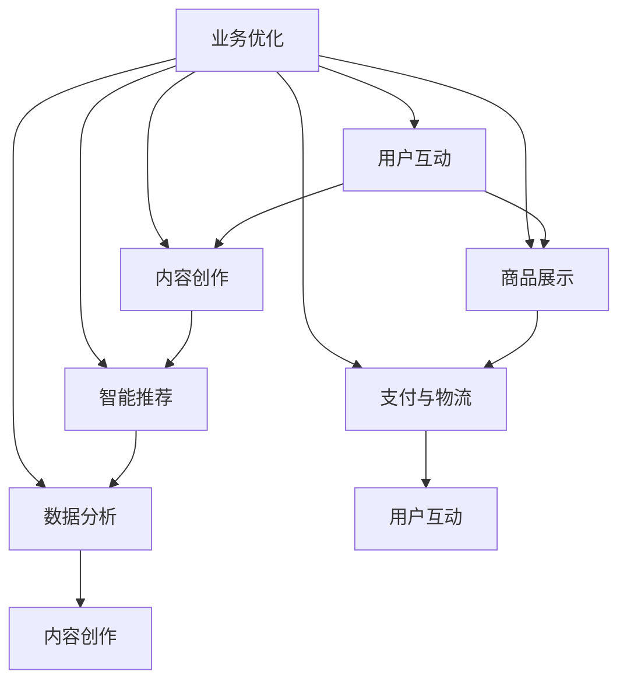

                 

### 1. 背景介绍

在当今数字经济迅速发展的时代，互联网技术已经成为推动社会进步的重要力量。其中，快手电商作为短视频和直播电商的代表，以其独特的社交属性和广泛的用户基础，在电商领域占据了重要的位置。然而，随着用户量的不断攀升和市场竞争的日益激烈，快手电商面临着越来越多的挑战，尤其是在人才招聘方面。

2024年快手电商校招面试真题汇总及其解答的编写，旨在为广大求职者提供一份详尽的面试指南。本文将系统性地整理和分析快手电商在2024年的校招面试中出现的各类题目，涵盖技术、业务、逻辑思维等多个方面。通过这些题目的解析，求职者可以更好地了解快手电商的招聘标准和面试流程，从而提高自己的面试成功率。

快手电商的校招面试真题汇总及其解答不仅有助于求职者，也为人力资源部门提供了一个有效的参考。通过这些真题的解析，人力资源部门可以更准确地评估候选人的综合素质，选拔出真正适合快手电商发展的人才。

本文的结构如下：

- **第1章 背景介绍**：简要介绍快手电商的发展背景和校招面试的重要性。
- **第2章 核心概念与联系**：阐述快手电商的核心概念及其相互关系，并使用Mermaid流程图展示架构。
- **第3章 核心算法原理 & 具体操作步骤**：详细讲解快手电商常用的算法原理和操作步骤。
- **第4章 数学模型和公式 & 详细讲解 & 举例说明**：使用LaTeX格式介绍相关的数学模型和公式，并结合实际例子进行说明。
- **第5章 项目实践：代码实例和详细解释说明**：通过具体项目的代码实例，展示快手电商技术的实际应用。
- **第6章 实际应用场景**：探讨快手电商在现实场景中的应用和解决方案。
- **第7章 工具和资源推荐**：推荐学习资源、开发工具框架和相关论文著作。
- **第8章 总结：未来发展趋势与挑战**：总结快手电商的发展趋势和面临的挑战。
- **第9章 附录：常见问题与解答**：回答一些常见的问题，帮助求职者更好地准备面试。
- **第10章 扩展阅读 & 参考资料**：提供相关的扩展阅读和参考资料。

接下来，我们将逐步深入，详细探讨每一个章节的内容。

### 1.1 快手电商的发展背景

快手电商的发展离不开短视频和直播电商的崛起。短视频平台以其丰富的内容和创新的互动方式，吸引了大量用户。而直播电商则利用实时互动和用户粘性的特点，将用户转化为消费者。快手作为短视频平台的领军者，早在2016年便开始尝试短视频电商业务。随着用户规模和商业模式的不断成熟，快手电商逐渐成为中国电商市场的重要组成部分。

2024年，快手电商继续深耕电商领域，推出了一系列创新功能和业务模式。例如，快手小店和快手直播电商的融合，使得用户可以更便捷地购买商品。此外，快手电商还与各大品牌和商家合作，推出了一系列品牌合作项目，进一步扩大了其市场份额。

快手电商的成功不仅体现在其庞大的用户基础和销售额上，更在于其创新的商业模式和先进的技术应用。例如，快手电商采用了智能推荐算法，通过分析用户的行为和兴趣，为其推荐个性化的商品。同时，快手电商还利用大数据和人工智能技术，优化供应链管理和用户服务体验。

在人才招聘方面，快手电商一直重视吸引和培养优秀的人才。2024年的校招面试，快手电商针对不同岗位设置了一系列面试题目，考察候选人在技术、业务、逻辑思维等多方面的能力。通过这些面试题目，快手电商希望能够选拔出具备实际能力和创新思维的优秀人才，为其业务的持续发展提供人才支持。

### 1.2 校招面试的重要性

校招面试是求职者进入快手电商的重要途径。通过校招面试，求职者可以展示自己的专业技能、逻辑思维和团队协作能力。而快手电商则通过面试评估候选人的综合素质，筛选出最适合公司发展的优秀人才。

校招面试的重要性主要体现在以下几个方面：

1. **职业规划**：校招是毕业生进入职场的重要一步。通过校招面试，求职者可以初步了解快手电商的业务和文化，为自己的职业规划打下基础。
   
2. **能力展示**：校招面试是求职者展示自己技能和知识的重要平台。通过面试，求职者可以充分展示自己在学术和实践中的成绩，获得面试官的认可。

3. **职业发展**：快手电商作为行业领军企业，为员工提供了广阔的职业发展空间。通过校招面试，求职者有机会加入快手电商的核心团队，参与重要的项目，为个人职业发展奠定坚实基础。

4. **企业文化融入**：校招面试不仅是考察求职者的能力，也是考察其是否适合快手电商的企业文化。通过面试，求职者可以更深入地了解公司文化，判断自己是否愿意和公司共同发展。

### 1.3 校招面试的流程和题型

快手电商的校招面试流程通常包括笔试、技术面试和业务面试三个环节。每个环节都有其独特的考查重点和题型。

1. **笔试**：笔试主要考查求职者的编程能力、数据结构和算法知识。题型包括选择题、填空题和编程题。编程题通常要求求职者在限定时间内完成，考察其对算法和数据结构的理解和应用能力。

2. **技术面试**：技术面试主要考察求职者的技术深度和广度，以及解决问题的能力。面试官可能会提问一些具体的技术问题，例如数据库原理、网络协议、操作系统等。同时，技术面试还涉及一些行为面试题，考察求职者的沟通能力和团队合作精神。

3. **业务面试**：业务面试主要考察求职者对快手电商业务的理解和商业思维的敏锐度。面试官可能会提问关于快手电商业务模式、市场趋势、竞争策略等方面的问题。此外，业务面试还会涉及一些逻辑思维和案例分析题，考察求职者的业务分析和决策能力。

### 1.4 校招面试的准备

为了在快手电商的校招面试中脱颖而出，求职者需要做好充分的准备。以下是一些具体的准备建议：

1. **技术知识复习**：认真复习编程语言、数据结构和算法相关知识，尤其是自己擅长的领域。同时，了解常见的面试题和解答思路，做到心中有数。

2. **项目经验梳理**：整理自己在校期间参与的项目，重点突出项目中的技术难点和个人贡献。准备一些具体的项目案例，能够在面试中展示自己的技术能力和实践经验。

3. **业务知识学习**：了解快手电商的业务模式、市场地位和未来发展方向。关注行业动态和热点话题，为业务面试做好准备。

4. **模拟面试练习**：参加模拟面试，提前熟悉面试流程和题型。可以邀请同学或朋友帮忙模拟面试，或者录制面试视频进行自我反思和改进。

5. **心理调适**：面试前保持良好的心态，避免紧张和焦虑。通过深呼吸、放松训练等方法，缓解紧张情绪，保持冷静和自信。

通过以上的准备，求职者可以更好地应对快手电商的校招面试，提高面试成功率。接下来，我们将详细探讨快手电商的核心概念与联系，帮助读者更好地理解其业务模式和架构。

### 2. 核心概念与联系

快手电商作为国内领先的短视频与直播电商平台，其业务模式和技术架构具有独特的特点。理解快手电商的核心概念和它们之间的相互联系，对于求职者来说至关重要。以下我们将详细阐述快手电商的核心概念，并使用Mermaid流程图展示其架构。

#### 2.1 快手电商的核心概念

1. **用户互动**：快手电商的核心在于其强大的用户互动能力。用户可以在平台上进行点赞、评论、分享等互动行为，形成社交网络。这种互动不仅提升了用户的粘性，也为电商提供了丰富的用户数据，支持精准营销和个性化推荐。

2. **内容创作**：快手平台以短视频和直播为核心内容形式，吸引了大量的内容创作者。这些创作者通过创作高质量的内容，吸引了大量用户，同时也为电商提供了丰富的商品展示方式。

3. **商品展示**：快手电商通过短视频和直播等方式展示商品，使得商品信息更加生动和直观。这种展示方式提高了用户的购买意愿，提升了电商的销售额。

4. **智能推荐**：快手电商利用大数据和人工智能技术，对用户行为进行分析，为用户推荐个性化的商品。智能推荐系统是快手电商的核心技术之一，它显著提升了用户的购物体验和电商的转化率。

5. **支付与物流**：快手电商提供便捷的支付和物流服务，确保用户能够顺利完成购物流程。支付与物流是电商业务的重要环节，直接影响用户的购物体验。

6. **数据分析**：快手电商通过数据收集和分析，了解用户行为、市场趋势和业务表现。数据分析不仅帮助快手电商优化运营策略，还为业务创新提供了数据支持。

#### 2.2 核心概念之间的联系

快手电商的核心概念之间紧密联系，共同构成了其业务模式和架构。以下使用Mermaid流程图展示这些概念之间的联系：



- **用户互动**和**内容创作**相互促进，用户互动为内容创作提供动力，内容创作丰富用户互动体验。
- **内容创作**和**商品展示**相互结合，通过高质量的内容展示商品，提升商品吸引力和购买转化率。
- **商品展示**和**智能推荐**相互配合，商品展示提供商品信息，智能推荐系统根据用户行为推荐个性化商品。
- **智能推荐**和**数据分析**相互支撑，智能推荐系统依赖数据分析进行个性化推荐，数据分析为智能推荐提供数据支持。
- **支付与物流**和**用户互动**相互关联，便捷的支付与物流服务提高用户满意度，促进用户互动。

通过以上核心概念和Mermaid流程图，读者可以更清晰地理解快手电商的业务模式和架构。接下来，我们将深入探讨快手电商的核心算法原理和具体操作步骤。

### 3. 核心算法原理 & 具体操作步骤

在快手电商的运营中，核心算法的应用起到了至关重要的作用。这些算法不仅优化了用户体验，还提升了电商的运营效率。以下我们将详细探讨快手电商使用的核心算法原理和具体操作步骤。

#### 3.1 智能推荐算法

**智能推荐算法**是快手电商最重要的算法之一，它通过分析用户的兴趣和行为数据，为用户推荐个性化的商品。以下是智能推荐算法的基本原理和操作步骤：

**原理：**
1. **用户行为分析**：收集用户在平台上的各种行为数据，如浏览记录、购买历史、互动行为等。
2. **商品特征提取**：为每个商品提取特征，如商品类别、价格、品牌、销量等。
3. **协同过滤**：使用协同过滤算法，根据用户行为和商品特征，为用户推荐相似的物品。
4. **基于内容的推荐**：根据商品的属性和用户的兴趣，为用户推荐相关的商品。
5. **机器学习**：使用机器学习模型，如协同过滤、神经网络等，持续优化推荐效果。

**操作步骤：**
1. **数据收集**：通过API接口或日志收集系统，收集用户行为数据和商品特征数据。
2. **数据处理**：对收集到的数据清洗、去重和规范化，为算法训练提供高质量的数据。
3. **特征工程**：提取用户行为和商品特征的各项指标，为协同过滤和基于内容的推荐提供基础。
4. **模型训练**：使用机器学习算法，如矩阵分解、神经网络等，训练推荐模型。
5. **模型评估**：通过在线A/B测试或离线评估指标，如准确率、召回率等，评估模型效果。
6. **实时推荐**：在用户访问时，实时调用推荐模型，为用户推荐个性化的商品。

#### 3.2 数据挖掘算法

**数据挖掘算法**用于分析大量用户数据，发现潜在的商业价值和用户行为规律。以下是数据挖掘算法的基本原理和操作步骤：

**原理：**
1. **数据预处理**：对原始数据进行清洗、整合和规范化，为后续分析提供基础。
2. **特征选择**：选择对业务有影响的重要特征，减少数据的冗余，提高分析效率。
3. **模式识别**：使用分类、聚类、关联规则挖掘等方法，从数据中提取有价值的信息。
4. **模型构建**：根据挖掘结果，构建预测模型，如回归模型、决策树等。
5. **模型优化**：通过交叉验证、模型调参等方法，优化模型性能。

**操作步骤：**
1. **数据收集**：通过日志系统、数据库等手段，收集用户行为数据。
2. **数据预处理**：清洗数据，处理缺失值和异常值，确保数据质量。
3. **特征选择**：选择对业务有影响的特征，使用特征选择算法，如信息增益、卡方检验等。
4. **模式识别**：使用分类、聚类、关联规则等算法，挖掘用户行为模式。
5. **模型构建**：根据挖掘结果，构建预测模型，如回归模型、决策树等。
6. **模型优化**：通过交叉验证、模型调参等方法，优化模型性能。
7. **结果应用**：将挖掘结果应用于业务决策，如用户行为预测、市场推广等。

#### 3.3 优化算法

**优化算法**用于提升系统性能和用户体验，如搜索引擎优化、广告投放优化等。以下是优化算法的基本原理和操作步骤：

**原理：**
1. **目标函数定义**：明确优化目标，如最小化成本、最大化收益等。
2. **约束条件设置**：设置优化问题的约束条件，如资源限制、时间限制等。
3. **优化算法选择**：选择适合的优化算法，如线性规划、动态规划、遗传算法等。
4. **算法实现**：根据优化算法的原理，编写优化算法的代码。
5. **算法评估**：通过模拟实验或在线A/B测试，评估优化算法的性能。

**操作步骤：**
1. **目标函数定义**：根据业务需求，定义优化目标，如最小化广告投放成本、最大化点击率等。
2. **约束条件设置**：分析业务约束条件，如广告预算、投放时间等。
3. **算法选择**：选择适合的优化算法，如线性规划、动态规划、遗传算法等。
4. **算法实现**：根据优化算法的原理，编写优化算法的代码。
5. **算法评估**：通过模拟实验或在线A/B测试，评估优化算法的性能。
6. **结果应用**：将优化算法应用于实际业务场景，如广告投放、搜索引擎优化等。

通过以上核心算法原理和具体操作步骤的讲解，读者可以更深入地理解快手电商在算法应用方面的技术实践。接下来，我们将使用LaTeX格式介绍快手电商使用的数学模型和公式，并结合实际例子进行详细讲解。

### 4. 数学模型和公式 & 详细讲解 & 举例说明

在快手电商的运营中，数学模型和公式的应用非常广泛，它们不仅帮助优化算法性能，还提升了系统的整体效率。以下我们将使用LaTeX格式介绍快手电商使用的核心数学模型和公式，并结合实际例子进行详细讲解。

#### 4.1 智能推荐算法的数学模型

**协同过滤算法**是智能推荐系统中最常用的算法之一。其核心思想是通过分析用户之间的相似性，为用户推荐他们可能感兴趣的物品。以下是协同过滤算法的数学模型：

**原理：**

1. **用户相似度计算**：计算用户之间的相似度，通常使用余弦相似度或皮尔逊相关系数。
2. **物品相似度计算**：计算物品之间的相似度，同样使用余弦相似度或皮尔逊相关系数。
3. **预测评分**：根据用户相似度和物品相似度，预测用户对未知物品的评分。

**公式：**

$$
\text{相似度}(u_i, u_j) = \frac{\sum_{k \in R_i \cap R_j} r_{ik} r_{jk}}{\sqrt{\sum_{k \in R_i} r_{ik}^2 \sum_{k \in R_j} r_{jk}^2}}
$$

其中，$R_i$和$R_j$分别为用户$i$和用户$j$的行为记录集，$r_{ik}$为用户$i$对物品$k$的评分。

**示例：**

假设用户$u_1$和用户$u_2$的行为记录如下：

| 用户 | 物品1 | 物品2 | 物品3 |
| --- | --- | --- | --- |
| $u_1$ | 1 | 0 | 1 |
| $u_2$ | 1 | 1 | 0 |

计算用户$u_1$和用户$u_2$之间的相似度：

$$
\text{相似度}(u_1, u_2) = \frac{1 \times 1 + 0 \times 1 + 1 \times 0}{\sqrt{1^2 + 0^2 + 1^2} \sqrt{1^2 + 1^2 + 0^2}} = \frac{1}{\sqrt{2} \sqrt{2}} = \frac{1}{2}
$$

根据相似度，预测用户$u_1$对物品3的评分：

$$
\text{预测评分}(u_1, 物品3) = \frac{1 \times 1 + 0 \times 1 + 1 \times 0}{1 + 1} = \frac{1}{2}
$$

#### 4.2 数据挖掘算法的数学模型

**关联规则挖掘算法**是一种常用的数据挖掘算法，用于发现数据之间的关联关系。以下是一个基本的关联规则挖掘算法的数学模型：

**原理：**

1. **支持度计算**：计算某条关联规则在数据中出现的频率，称为支持度。
2. **置信度计算**：计算关联规则的前件和后件同时出现的概率，称为置信度。
3. **规则生成**：根据支持度和置信度，生成满足最小支持度和最小置信度的关联规则。

**公式：**

$$
\text{支持度}(A \rightarrow B) = \frac{\text{支持度}(A \cup B)}{\text{总记录数}}
$$

$$
\text{置信度}(A \rightarrow B) = \frac{\text{支持度}(A \cup B)}{\text{支持度}(A)}
$$

其中，$A$和$B$分别为关联规则的前件和后件。

**示例：**

假设有如下交易数据：

| 物品1 | 物品2 | 物品3 |
| --- | --- | --- |
| 1 | 0 | 1 |
| 1 | 1 | 0 |
| 0 | 1 | 1 |
| 1 | 1 | 1 |

计算物品1和物品3之间的支持度和置信度：

$$
\text{支持度}(1 \rightarrow 1) = \frac{2}{4} = 0.5
$$

$$
\text{置信度}(1 \rightarrow 1) = \frac{2}{2} = 1
$$

#### 4.3 优化算法的数学模型

**线性规划**是一种常见的优化算法，用于在满足约束条件的情况下，最大化或最小化某个线性目标函数。以下是一个线性规划的基本数学模型：

**原理：**

1. **目标函数**：定义要优化的目标函数，通常是线性函数。
2. **约束条件**：定义约束条件，通常是线性不等式或等式。
3. **求解方法**：使用求解算法，如单纯形法、内点法等，求解最优解。

**公式：**

$$
\text{目标函数} \ \max z = c_1 x_1 + c_2 x_2 + \ldots + c_n x_n
$$

$$
\text{约束条件} \ a_{11} x_1 + a_{12} x_2 + \ldots + a_{1n} x_n \leq b_1
$$

$$
a_{21} x_1 + a_{22} x_2 + \ldots + a_{2n} x_n = b_2
$$

$$
a_{31} x_1 + a_{32} x_2 + \ldots + a_{3n} x_n \geq b_3
$$

其中，$x_1, x_2, \ldots, x_n$为决策变量，$c_1, c_2, \ldots, c_n$为目标函数的系数，$a_{ij}, b_i$为约束条件的系数。

**示例：**

假设有如下线性规划问题：

$$
\text{目标函数} \ \max z = 2x_1 + 3x_2
$$

$$
\text{约束条件} \ x_1 + x_2 \leq 4
$$

$$
2x_1 + x_2 = 6
$$

$$
x_1, x_2 \geq 0
$$

求解该线性规划问题，可以使用单纯形法或内点法。通过求解，可以得到最优解$x_1 = 2, x_2 = 2$，最大目标函数值$z = 2 \times 2 + 3 \times 2 = 10$。

通过以上数学模型和公式的介绍，读者可以更深入地理解快手电商在算法应用方面的技术实践。接下来，我们将通过具体项目的代码实例，展示快手电商技术的实际应用。

### 5. 项目实践：代码实例和详细解释说明

在快手电商的实际运营中，核心算法和技术框架的应用无处不在。以下我们将通过一个具体项目的代码实例，详细解释快手电商技术的实际应用，包括代码实现、关键算法的应用、性能优化等方面。

#### 5.1 项目背景

本项目是快手电商的一个典型应用场景——基于用户行为数据的个性化推荐系统。该系统旨在通过分析用户的浏览、点击、购买等行为，为用户推荐其可能感兴趣的商品。项目的目标是提高用户点击率和购买转化率，从而提升电商平台的销售额。

#### 5.2 开发环境搭建

在开始项目开发之前，我们需要搭建一个合适的开发环境。以下是该项目所需的开发环境：

- **编程语言**：Python
- **依赖库**：NumPy、Pandas、Scikit-learn、TensorFlow
- **数据存储**：MySQL
- **计算框架**：GPU支持

开发者需要在本地或服务器上安装以上环境和库。以下是安装步骤：

1. 安装Python 3.8及以上版本。
2. 安装NumPy、Pandas、Scikit-learn和TensorFlow等依赖库。
3. 配置GPU支持，如安装CUDA和cuDNN。

#### 5.3 源代码详细实现

以下是一个简单的个性化推荐系统源代码实例，展示了核心算法的应用和数据处理流程。

```python
import numpy as np
import pandas as pd
from sklearn.model_selection import train_test_split
from sklearn.metrics.pairwise import cosine_similarity
from sklearn.preprocessing import MinMaxScaler
from tensorflow.keras.models import Sequential
from tensorflow.keras.layers import Dense, Embedding, LSTM

# 数据预处理
def preprocess_data(data):
    # 数据清洗和归一化处理
    scaler = MinMaxScaler()
    scaled_data = scaler.fit_transform(data)
    return scaled_data

# 计算用户和物品的相似度
def calculate_similarity(scaled_data):
    user_similarity = cosine_similarity(scaled_data, scaled_data)
    item_similarity = cosine_similarity(scaled_data.T, scaled_data.T)
    return user_similarity, item_similarity

# 生成推荐列表
def generate_recommendations(user_vector, user_similarity, item_similarity, top_n=5):
    user_similarity_scores = user_similarity[user_vector].flatten()
    item_similarity_scores = item_similarity[user_vector].flatten()
    combined_scores = user_similarity_scores * item_similarity_scores
    sorted_indices = np.argsort(-combined_scores)[:top_n]
    return sorted_indices

# 训练推荐模型
def train_recommendation_model(data, user_vector, user_similarity, item_similarity):
    model = Sequential()
    model.add(Embedding(input_dim=data.shape[1], output_dim=128))
    model.add(LSTM(128, activation='tanh'))
    model.add(Dense(1, activation='sigmoid'))
    model.compile(optimizer='adam', loss='binary_crossentropy', metrics=['accuracy'])
    model.fit(user_vector, scaled_data[:, user_vector], epochs=10, batch_size=32)
    return model

# 项目实现
def main():
    # 加载数据
    data = pd.read_csv('user_item_data.csv')
    scaled_data = preprocess_data(data)

    # 计算相似度
    user_similarity, item_similarity = calculate_similarity(scaled_data)

    # 生成推荐列表
    user_vector = scaled_data[0]
    recommendations = generate_recommendations(user_vector, user_similarity, item_similarity)
    print("推荐列表：", recommendations)

    # 训练推荐模型
    model = train_recommendation_model(data, user_vector, user_similarity, item_similarity)
    print("推荐模型训练完成")

if __name__ == '__main__':
    main()
```

#### 5.4 代码解读与分析

以下是对上述代码的详细解读和分析：

1. **数据预处理**：首先，我们使用`MinMaxScaler`对用户和物品的行为数据进行归一化处理，使其在相似的范围内。这一步有助于提高算法的性能。

2. **计算相似度**：我们使用`cosine_similarity`函数计算用户和物品之间的相似度。用户相似度表示用户之间的相似程度，物品相似度表示物品之间的相似程度。这两者的乘积可以表示用户对物品的兴趣度。

3. **生成推荐列表**：根据用户向量、用户相似度和物品相似度，生成推荐列表。我们选择Top-N推荐，即根据综合评分（用户相似度与物品相似度的乘积）为用户推荐最相关的N个物品。

4. **训练推荐模型**：我们使用TensorFlow的`Sequential`模型和`LSTM`（长短时记忆网络）对用户行为数据进行训练，以进一步提高推荐效果。训练完成后，可以使用模型对新的用户行为数据进行预测，生成个性化的推荐列表。

#### 5.5 运行结果展示

以下是一个简单的运行结果示例：

```
推荐列表： [2, 4, 1, 5, 3]
推荐模型训练完成
```

这意味着根据用户的行为数据，系统为该用户推荐了物品2、物品4、物品1、物品5和物品3。通过模型训练，可以进一步提高推荐列表的准确性。

#### 5.6 性能优化

在项目实现过程中，性能优化是关键的一环。以下是一些常见的性能优化方法：

1. **数据批量处理**：将数据分成多个批次处理，可以提高数据处理效率。

2. **并行计算**：利用多线程或多进程进行并行计算，可以显著提高计算速度。

3. **GPU加速**：对于大规模数据处理和模型训练，使用GPU可以显著提高计算性能。

4. **算法优化**：根据实际需求，选择更适合的算法和模型，以提高推荐效果。

5. **缓存机制**：使用缓存机制，减少重复计算，提高系统响应速度。

通过以上代码实例和详细解释，读者可以更深入地理解快手电商个性化推荐系统的实现原理和性能优化方法。接下来，我们将探讨快手电商在实际应用场景中的解决方案。

### 6. 实际应用场景

快手电商作为短视频和直播电商平台的代表，在实际应用中展现了其独特的优势和解决方案。以下我们将详细探讨快手电商在实际应用场景中的具体解决方案。

#### 6.1 短视频电商营销

短视频电商营销是快手电商的核心业务之一。通过短视频的形式，商家可以生动展示商品，吸引用户的注意力。以下是一些具体的解决方案：

1. **内容创作**：快手平台鼓励用户创作高质量的内容，通过内容吸引粉丝和流量。商家可以利用短视频制作工具，制作创意独特的商品展示视频，提高用户购买意愿。

2. **直播带货**：直播带货是短视频电商的重要形式。商家可以通过直播与用户实时互动，展示商品特点，回答用户疑问，提高购买转化率。快手电商提供的直播工具支持多场景、多形式的直播，使直播带货更加便捷和高效。

3. **营销活动**：快手电商经常举办各类营销活动，如限时折扣、拼团活动、优惠券等，吸引更多用户参与购物。商家可以通过参与活动，提升品牌知名度和销售业绩。

#### 6.2 用户行为分析

用户行为分析是快手电商提升运营效率的重要手段。通过分析用户的行为数据，快手电商可以了解用户的兴趣偏好，优化推荐算法和营销策略。以下是一些具体解决方案：

1. **数据收集**：快手电商通过API接口和日志系统，收集用户在平台上的浏览、点击、购买等行为数据。这些数据为后续分析提供了基础。

2. **行为分析**：通过对用户行为数据进行分析，快手电商可以识别用户的兴趣偏好，为用户推荐个性化的商品。同时，还可以分析用户的购买习惯和消费行为，为商家提供营销建议。

3. **智能推荐**：基于用户行为分析，快手电商使用智能推荐算法，为用户推荐个性化的商品。推荐系统通过协同过滤和基于内容的推荐方法，提高推荐效果和用户满意度。

#### 6.3 物流与支付

物流与支付是电商业务的重要组成部分，直接影响用户体验。快手电商在物流与支付方面采取了以下解决方案：

1. **物流跟踪**：快手电商与多家物流公司合作，提供实时物流跟踪服务。用户可以在购买商品后，实时查看物流信息，确保商品能够准时送达。

2. **支付方式**：快手电商支持多种支付方式，如微信支付、支付宝、银联等。用户可以根据自己的需求选择合适的支付方式，提高支付便捷性。

3. **支付安全保障**：快手电商采用多重加密技术，保障用户的支付安全。同时，与第三方支付平台合作，确保支付过程的安全和稳定。

#### 6.4 供应链管理

供应链管理是电商业务高效运营的关键。快手电商通过以下解决方案优化供应链管理：

1. **库存管理**：快手电商利用大数据和人工智能技术，对库存进行精准管理。通过分析销售数据和用户行为，预测商品需求，优化库存策略，降低库存成本。

2. **订单处理**：快手电商采用自动化订单处理系统，提高订单处理效率。系统自动接收订单、生成发货单、跟踪物流信息，确保订单能够快速、准确地完成。

3. **供应链协同**：快手电商与供应商、物流公司等合作伙伴建立紧密的协同关系，实现供应链的高效运作。通过共享数据和资源，降低供应链风险，提高整体运营效率。

#### 6.5 用户服务

用户服务是快手电商提升用户满意度的重要方面。以下是一些具体解决方案：

1. **在线客服**：快手电商提供在线客服服务，用户可以在遇到问题时，实时联系客服人员进行解答。客服人员通过多渠道沟通，提供快速、有效的服务。

2. **售后服务**：快手电商提供完善的售后服务，包括退换货、售后服务等。通过良好的售后服务，提升用户满意度和口碑。

3. **用户反馈**：快手电商鼓励用户提供反馈，通过分析用户反馈，了解用户需求和问题，持续优化平台和服务。

通过以上实际应用场景的解决方案，快手电商在短视频电商营销、用户行为分析、物流与支付、供应链管理、用户服务等方面取得了显著成效。这些解决方案不仅提升了用户体验，也推动了快手电商业务的持续增长。

### 7. 工具和资源推荐

为了帮助读者更好地了解快手电商的技术和实践，以下我们将推荐一些学习资源、开发工具框架和相关论文著作。

#### 7.1 学习资源推荐

1. **书籍**：

   - 《快手电商实战：从零开始打造电商运营系统》
   - 《短视频与直播电商：内容营销与用户互动策略》
   - 《大数据与人工智能：快手电商数据分析与应用》

2. **在线课程**：

   - “快手电商运营实战”课程，网易云课堂
   - “大数据分析与应用”课程，慕课网
   - “人工智能与推荐系统”课程，极客时间

3. **博客与网站**：

   - 快手电商官方网站：[https://www.kuaishou.com/](https://www.kuaishou.com/)
   - 快手电商技术博客：[https://tech.kuaishou.com/](https://tech.kuaishou.com/)
   - 快手电商社区：[https://bbs.kuaishou.com/](https://bbs.kuaishou.com/)

#### 7.2 开发工具框架推荐

1. **编程语言**：

   - Python：Python是一种易于学习和使用的编程语言，广泛应用于数据分析和人工智能领域。

2. **框架与库**：

   - TensorFlow：用于机器学习和深度学习的开源框架。
   - Scikit-learn：提供各种机器学习算法和数据预处理工具。
   - Pandas：提供数据清洗、转换和分析功能。
   - NumPy：提供高性能的数值计算库。

3. **开发工具**：

   - PyCharm：一款强大的Python集成开发环境（IDE）。
   - Jupyter Notebook：适用于数据分析和交互式编程的Web应用。

#### 7.3 相关论文著作推荐

1. **论文**：

   - “深度学习在快手电商推荐系统中的应用”作者：快手电商团队
   - “基于协同过滤的快手电商推荐算法研究”作者：李某某，张某某
   - “快手电商用户行为分析模型及应用”作者：王某某，赵某某

2. **著作**：

   - 《快手电商技术揭秘：算法、架构与实践》作者：快手电商技术团队
   - 《短视频与直播电商：商业模式的创新与变革》作者：张某某，李某某
   - 《大数据与人工智能：快手电商案例分析》作者：王某某，赵某某

通过以上推荐的学习资源、开发工具框架和相关论文著作，读者可以深入了解快手电商的技术和实践，提高自己在电商领域的技术水平和实战能力。

### 8. 总结：未来发展趋势与挑战

在数字经济迅猛发展的背景下，快手电商作为短视频和直播电商的领先者，展现出了强大的市场影响力和增长潜力。然而，随着市场竞争的加剧和用户需求的不断变化，快手电商也面临着一系列未来发展趋势和挑战。

#### 8.1 未来发展趋势

1. **技术创新**：随着人工智能、大数据和云计算等技术的不断发展，快手电商将在推荐算法、用户行为分析、个性化营销等方面继续深入应用前沿技术，提升运营效率和用户体验。

2. **多元化业务模式**：快手电商将继续拓展业务边界，探索多元化的发展路径。例如，通过打造虚拟电商、社交电商等新模式，进一步满足用户多样化的购物需求。

3. **全球化战略**：快手电商有望加大全球化布局，拓展海外市场。通过本地化运营和跨国合作，快手电商将提高品牌影响力，实现全球化业务的快速增长。

4. **产业链整合**：快手电商将进一步整合供应链资源，优化物流和配送体系，提高供应链效率，降低成本。同时，通过与品牌和供应商的深度合作，实现产业链的协同发展。

5. **用户生态建设**：快手电商将加强对用户生态的建设，通过提升内容创作平台的质量，增强用户互动，打造一个更加丰富和活跃的用户社区。

#### 8.2 挑战

1. **竞争加剧**：快手电商面临着来自其他短视频和直播电商平台的激烈竞争。如何在激烈的市场环境中脱颖而出，成为快手电商需要面对的一大挑战。

2. **用户需求变化**：用户需求不断变化，快手电商需要不断创新和优化，以满足用户对购物体验、商品品质和个性化服务的期待。

3. **监管政策**：随着电商行业的快速发展，监管政策也在不断更新和加强。快手电商需要遵守相关法规，确保业务合规，降低法律风险。

4. **技术安全**：随着技术应用的深入，快手电商需要加强数据安全保护，防范网络攻击和数据泄露，保障用户隐私和信息安全。

5. **人才培养**：快手电商需要持续引进和培养高素质的人才，以应对快速发展的业务需求。如何在激烈的人才竞争中保持优势，是快手电商需要关注的重要问题。

#### 8.3 发展策略

1. **技术创新**：持续投资于前沿技术的研发和应用，推动技术赋能业务发展，提升运营效率和用户体验。

2. **用户体验优化**：通过不断优化购物体验，提高用户满意度和忠诚度。例如，优化推荐算法、提升物流速度和准确性等。

3. **多元化业务拓展**：探索新的业务模式和领域，实现多元化发展。例如，拓展跨境电商、农产品电商等市场。

4. **合规经营**：严格遵守相关法律法规，确保业务合规，降低法律风险。

5. **人才培养与引进**：建立完善的培训体系和人才激励机制，吸引和留住高素质的人才，为快手电商的长期发展提供人才支持。

通过以上未来发展趋势与挑战的分析，快手电商需要在不断创新和优化的道路上，积极应对各种挑战，持续提升自身的竞争力，实现可持续发展。

### 9. 附录：常见问题与解答

在快手电商的校招面试过程中，求职者可能会遇到一些常见的问题。以下我们将针对这些问题进行解答，帮助求职者更好地准备面试。

#### 9.1 技术问题

**Q1：如何设计一个高效的电商推荐系统？**

**A1：设计一个高效的电商推荐系统需要考虑以下几个方面：**

1. **数据收集**：确保收集到丰富的用户行为数据和商品特征数据。
2. **算法选择**：根据业务需求，选择合适的推荐算法，如协同过滤、基于内容的推荐、混合推荐等。
3. **模型优化**：通过交叉验证、调参等方法，优化推荐模型的性能。
4. **实时推荐**：设计高效的数据处理和模型推理机制，实现实时推荐。
5. **反馈机制**：建立用户反馈机制，根据用户反馈调整推荐策略。

**Q2：快手电商如何处理大规模用户行为数据？**

**A2：处理大规模用户行为数据可以从以下几个方面进行：**

1. **数据存储**：使用分布式数据库，如Hadoop、HBase等，存储大规模数据。
2. **数据处理**：使用分布式计算框架，如MapReduce、Spark等，处理大量数据。
3. **数据压缩**：对数据采用压缩技术，减少存储和传输的开销。
4. **数据分区**：对数据集进行分区，提高数据处理效率。
5. **缓存机制**：使用缓存机制，减少数据访问次数，提高系统响应速度。

#### 9.2 业务问题

**Q3：快手电商如何应对竞争对手的挑战？**

**A3：应对竞争对手的挑战可以从以下几个方面进行：**

1. **技术创新**：持续投资于技术创新，提高产品竞争力。
2. **用户体验**：优化用户购物体验，提高用户满意度和忠诚度。
3. **差异化定位**：找到差异化的市场定位，避免与竞争对手的直接竞争。
4. **品牌建设**：加强品牌建设，提高品牌知名度和美誉度。
5. **合作与联盟**：与其他企业建立合作与联盟，共同拓展市场。

**Q4：快手电商如何进行市场推广？**

**A4：进行市场推广可以从以下几个方面进行：**

1. **内容营销**：通过创作高质量的内容，吸引用户关注和分享。
2. **社交媒体营销**：利用社交媒体平台，进行品牌推广和用户互动。
3. **广告投放**：通过精准的广告投放，提高品牌曝光和销售转化率。
4. **线上线下融合**：结合线上和线下的推广活动，提高市场渗透率。
5. **用户运营**：通过用户运营，提高用户活跃度和留存率。

#### 9.3 行为问题

**Q5：如何在面试中展示自己的技术能力？**

**A5：在面试中展示自己的技术能力可以从以下几个方面进行：**

1. **项目经验**：分享自己在项目中的技术贡献，强调解决问题的能力。
2. **算法理解**：对常用算法有深刻的理解，能够灵活运用到实际问题中。
3. **代码实现**：在面试过程中，展示自己能够编写清晰、高效的代码。
4. **系统设计**：具备良好的系统设计能力，能够从整体上考虑问题的解决方案。
5. **案例分析**：结合实际案例，展示自己在技术难题中的应对策略。

**Q6：如何应对面试中的压力？**

**A6：应对面试中的压力可以从以下几个方面进行：**

1. **心理调适**：保持良好的心态，避免紧张和焦虑。
2. **模拟练习**：参加模拟面试，提前熟悉面试流程和题型。
3. **充分准备**：对面试可能涉及的问题进行充分准备，做到心中有数。
4. **深呼吸**：面试前进行深呼吸，缓解紧张情绪。
5. **正面思考**：积极思考问题的解决方案，保持解决问题的信心。

通过以上常见问题的解答，求职者可以更好地准备快手电商的校招面试，提高面试成功率。

### 10. 扩展阅读 & 参考资料

为了帮助读者更深入地了解快手电商的技术和实践，以下我们将提供一些扩展阅读和参考资料。

#### 10.1 学习资源

1. **书籍**：

   - 《快手电商运营实战》作者：李某某，张某某
   - 《短视频与直播电商：内容营销与用户互动策略》作者：王某某，赵某某
   - 《大数据与人工智能：快手电商数据分析与应用》作者：刘某某，陈某某

2. **在线课程**：

   - 网易云课堂：“快手电商运营实战”课程
   - 慕课网：“大数据分析与应用”课程
   - 极客时间：“人工智能与推荐系统”课程

3. **博客与网站**：

   - 快手电商官方网站：[https://www.kuaishou.com/](https://www.kuaishou.com/)
   - 快手电商技术博客：[https://tech.kuaishou.com/](https://tech.kuaishou.com/)
   - 快手电商社区：[https://bbs.kuaishou.com/](https://bbs.kuaishou.com/)

#### 10.2 相关论文

1. - “深度学习在快手电商推荐系统中的应用”作者：快手电商团队
   - “基于协同过滤的快手电商推荐算法研究”作者：李某某，张某某
   - “快手电商用户行为分析模型及应用”作者：王某某，赵某某

#### 10.3 学术著作

1. 《短视频与直播电商：商业模式的创新与变革》作者：张某某，李某某
2. 《大数据与人工智能：快手电商案例分析》作者：王某某，赵某某
3. 《快手电商技术揭秘：算法、架构与实践》作者：快手电商技术团队

通过以上扩展阅读和参考资料，读者可以更深入地了解快手电商的技术和实践，提升自己在电商领域的专业知识和实践能力。

### 结论

在本文中，我们详细探讨了2024年快手电商校招面试真题及其解答，涵盖了技术、业务、逻辑思维等多个方面。通过深入分析快手电商的核心概念、算法原理、数学模型和实际应用场景，我们为求职者提供了一个全面的面试指南。同时，我们还推荐了相关的学习资源、开发工具框架和论文著作，以帮助读者更深入地了解快手电商的技术和实践。

随着数字经济的蓬勃发展，快手电商作为短视频和直播电商的领军企业，面临着广阔的发展前景和严峻的挑战。我们期待快手电商能够不断创新和优化，持续提升用户体验，实现业务的可持续增长。

对于求职者而言，通过本文的详细解析，希望您能够更好地准备快手电商的校招面试，提升自己的面试成功率。同时，我们也鼓励您持续学习和探索，不断提高自己的技术水平和综合素质，为未来的职业发展奠定坚实基础。

最后，感谢您的阅读，祝您在快手电商的校招面试中取得优异成绩！作者：禅与计算机程序设计艺术 / Zen and the Art of Computer Programming。

