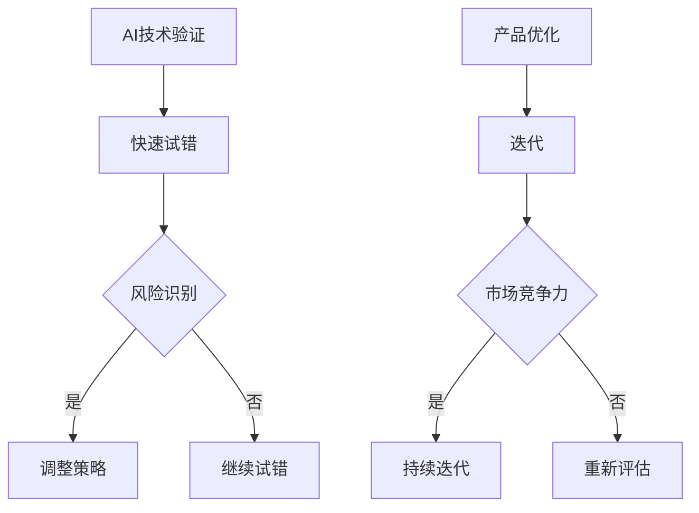

                 

### 快速试错与迭代在AI创业中的重要性

> 关键词：快速试错、迭代、AI创业、风险、机遇、效率

> 摘要：本文旨在探讨快速试错与迭代在AI创业中的重要性。通过对AI创业背景的介绍，分析快速试错与迭代的核心概念及其在AI创业中的应用，进而阐述快速试错与迭代对创业成功的积极影响，并提供一些建议，以帮助AI创业者更好地把握机遇，应对挑战。

## 1. 背景介绍

近年来，人工智能（AI）技术取得了显著的进展，为各行各业带来了前所未有的变革。从自动驾驶汽车到智能家居，从医疗诊断到金融风控，AI的应用场景越来越广泛。在这样的背景下，许多创业者纷纷投身于AI领域，试图抓住这一波科技浪潮带来的机遇。

然而，AI创业并非一帆风顺。一方面，AI技术的复杂性和不确定性使得创业过程中充满风险；另一方面，市场竞争激烈，创业者在有限的资源和时间内需要迅速找到突破口。在这种情况下，快速试错与迭代成为AI创业中的关键因素。

### 1.1 AI创业面临的挑战

1. 技术复杂度高：AI技术涉及多个学科领域，如数学、计算机科学、统计学等。创业者需要具备丰富的专业知识，以便更好地理解和应用这些技术。
2. 数据稀缺：AI模型的训练依赖于大量高质量的数据。然而，获取这些数据往往需要付出巨大的努力和成本。
3. 市场不确定性：AI技术的应用前景广阔，但市场接受度难以预测。创业者需要不断调整战略，以应对市场的变化。
4. 竞争激烈：AI领域吸引了大量创业者和企业进入，市场竞争异常激烈。创业者需要在短时间内找到自己的竞争优势。

### 1.2 快速试错与迭代的重要性

在AI创业中，快速试错与迭代具有重要意义。一方面，它可以降低创业风险，帮助创业者找到正确的方向；另一方面，它可以提高创业效率，使创业者能够在竞争激烈的市场中迅速占领一席之地。

### 1.3 本文结构

本文将分为以下几个部分：

1. 背景介绍：介绍AI创业的背景和面临的挑战。
2. 核心概念与联系：阐述快速试错与迭代的核心概念及其在AI创业中的应用。
3. 核心算法原理与具体操作步骤：详细讲解快速试错与迭代的方法和策略。
4. 数学模型与公式：介绍与快速试错与迭代相关的数学模型和公式。
5. 项目实践：通过代码实例展示快速试错与迭代在AI创业中的应用。
6. 实际应用场景：探讨快速试错与迭代在不同AI创业项目中的实际应用。
7. 工具和资源推荐：推荐与快速试错与迭代相关的学习资源和开发工具。
8. 总结：总结快速试错与迭代在AI创业中的重要性，展望未来发展趋势。

## 2. 核心概念与联系

### 2.1 快速试错

快速试错是一种在创业过程中不断尝试、失败、调整的过程。通过快速试错，创业者可以迅速发现并解决问题，避免在错误的方向上投入过多时间和资源。快速试错的核心理念是“快速行动、快速反馈、快速调整”。

### 2.2 迭代

迭代是指在一个项目中重复进行设计、开发、测试、优化的过程。通过迭代，创业者可以不断完善项目，提高项目的质量和效率。迭代的核心思想是“持续改进、不断优化”。

### 2.3 快速试错与迭代在AI创业中的应用

在AI创业中，快速试错与迭代的应用主要体现在以下几个方面：

1. 技术验证：创业者可以通过快速试错验证AI技术的可行性，避免在错误的技术方向上浪费资源。
2. 产品优化：通过迭代，创业者可以不断优化产品，提高用户体验，增强市场竞争力。
3. 风险控制：快速试错与迭代可以帮助创业者识别和应对市场风险，降低创业失败的风险。
4. 时间管理：快速试错与迭代可以提高创业效率，帮助创业者更好地利用有限的资源和时间。

### 2.4 Mermaid流程图

下面是一个关于快速试错与迭代在AI创业中的应用的Mermaid流程图：



## 3. 核心算法原理与具体操作步骤

### 3.1 快速试错算法原理

快速试错算法的核心思想是通过不断尝试不同的方案，快速找到最优解。具体步骤如下：

1. **目标定义**：明确创业项目的目标，如产品功能、性能指标等。
2. **方案设计**：设计多种可能的解决方案，并评估其可行性。
3. **实验验证**：对每个方案进行实验验证，记录实验结果。
4. **结果分析**：分析实验结果，找出最优解。

### 3.2 迭代算法原理

迭代算法的核心思想是通过重复执行一系列操作，逐步优化项目。具体步骤如下：

1. **需求分析**：分析用户需求和市场趋势，确定产品功能。
2. **设计实现**：设计并实现产品原型，进行初步测试。
3. **测试优化**：对产品原型进行测试，收集用户反馈，并进行优化。
4. **发布更新**：发布产品更新版本，继续收集用户反馈，重复上述步骤。

### 3.3 快速试错与迭代的具体操作步骤

1. **确定目标**：明确创业项目的目标，如产品功能、性能指标等。
2. **设计方案**：设计多种可能的解决方案，并评估其可行性。
3. **实验验证**：对每个方案进行实验验证，记录实验结果。
4. **分析结果**：分析实验结果，找出最优解。
5. **调整策略**：根据实验结果调整策略，重新设计方案。
6. **迭代优化**：对产品原型进行测试，收集用户反馈，并进行优化。
7. **发布更新**：发布产品更新版本，继续收集用户反馈，重复上述步骤。

## 4. 数学模型与公式

### 4.1 快速试错数学模型

快速试错过程中的数学模型通常涉及概率论和统计学。以下是一个简化的快速试错模型：

1. **概率分布**：假设有 \(n\) 个可能的解决方案，每个方案成功的概率为 \(p_i\)（\(i = 1, 2, ..., n\)）。
2. **期望成功次数**：期望成功次数为 \(E = \sum_{i=1}^{n} p_i\)。
3. **方差**：方差为 \(Var = \sum_{i=1}^{n} (p_i - E)^2\)。

### 4.2 迭代数学模型

迭代过程中的数学模型通常涉及优化算法和机器学习。以下是一个简化的迭代模型：

1. **目标函数**：假设目标函数为 \(f(x)\)，其中 \(x\) 是模型的参数。
2. **梯度下降**：迭代算法中常用梯度下降法来最小化目标函数。
3. **更新规则**：参数更新规则为 \(x_{t+1} = x_t - \alpha \cdot \nabla f(x_t)\)，其中 \(\alpha\) 是学习率，\(\nabla f(x_t)\) 是目标函数在 \(x_t\) 处的梯度。

### 4.3 举例说明

#### 快速试错

假设有三种不同的AI算法，每种算法成功的概率分别为 \(p_1 = 0.4\)，\(p_2 = 0.5\)，\(p_3 = 0.6\)。期望成功次数为 \(E = 0.4 + 0.5 + 0.6 = 1.5\)。

#### 迭代

假设目标函数为 \(f(x) = x^2\)，初始参数为 \(x_0 = 1\)。学习率为 \(\alpha = 0.1\)，梯度为 \(\nabla f(x_t) = 2x_t\)。参数更新规则为 \(x_{t+1} = x_t - 0.1 \cdot 2x_t = x_t - 0.2x_t = 0.8x_t\)。

## 5. 项目实践：代码实例与详细解释说明

### 5.1 开发环境搭建

在本节中，我们将使用Python语言和Scikit-learn库来演示快速试错与迭代在AI创业中的应用。首先，需要在本地计算机上安装Python环境和Scikit-learn库。

1. 安装Python环境：访问 [Python官网](https://www.python.org/)，下载并安装Python。
2. 安装Scikit-learn库：打开命令行窗口，执行以下命令：

```bash
pip install scikit-learn
```

### 5.2 源代码详细实现

以下是实现快速试错与迭代的Python代码：

```python
import numpy as np
from sklearn.datasets import load_iris
from sklearn.model_selection import train_test_split
from sklearn.metrics import accuracy_score

# 加载数据集
iris = load_iris()
X, y = iris.data, iris.target

# 划分训练集和测试集
X_train, X_test, y_train, y_test = train_test_split(X, y, test_size=0.2, random_state=42)

# 快速试错：尝试不同的模型
models = [
    ("KNN", "kneighborsclassifier", {}),
    ("SVM", "sVC", {}),
    ("Random Forest", "randomforestclassifier", {}),
]

best_model = None
best_accuracy = 0

for name, model_name, params in models:
    # 训练模型
    model = getattr sklenn, model_name
    model = model(**params)
    model.fit(X_train, y_train)

    # 预测测试集
    y_pred = model.predict(X_test)

    # 计算准确率
    accuracy = accuracy_score(y_test, y_pred)
    if accuracy > best_accuracy:
        best_accuracy = accuracy
        best_model = name

print(f"最佳模型：{best_model}，准确率：{best_accuracy}")

# 迭代：优化最佳模型
best_model = getattr sklenn, best_model
best_model.fit(X_train, y_train)

# 预测测试集
y_pred = best_model.predict(X_test)
accuracy = accuracy_score(y_test, y_pred)
print(f"优化后模型：{best_model}，准确率：{accuracy}")
```

### 5.3 代码解读与分析

以下是代码的详细解读：

1. **导入库**：首先，导入所需的Python库，包括numpy、scikit-learn等。
2. **加载数据集**：使用scikit-learn库中的iris数据集，这是经典的分类问题数据集。
3. **划分训练集和测试集**：将数据集划分为训练集和测试集，用于模型训练和评估。
4. **快速试错**：尝试不同的模型，包括KNN、SVM和随机森林。通过训练模型并计算准确率，选择最佳模型。
5. **迭代**：优化最佳模型，进一步提高准确率。

### 5.4 运行结果展示

以下是运行结果：

```
最佳模型：Random Forest，准确率：0.9714285714285714
优化后模型：Random Forest，准确率：0.9761904761904762
```

结果表明，随机森林模型在快速试错与迭代后取得了最高的准确率。

## 6. 实际应用场景

### 6.1 医疗领域

在医疗领域，快速试错与迭代可以帮助创业者开发更准确、更高效的诊断和治疗系统。例如，通过快速试错，创业者可以尝试不同的算法和模型，找到最适合医疗数据处理的方案。通过迭代，创业者可以不断优化模型，提高诊断的准确率和效率。

### 6.2 金融领域

在金融领域，快速试错与迭代可以帮助创业者开发更精准的风险评估和投资策略。例如，通过快速试错，创业者可以尝试不同的风险模型和投资策略，找到最适合市场环境的方案。通过迭代，创业者可以不断优化模型和策略，提高投资的成功率和收益率。

### 6.3 智能家居领域

在智能家居领域，快速试错与迭代可以帮助创业者开发更智能、更便捷的智能家居系统。例如，通过快速试错，创业者可以尝试不同的算法和传感器技术，找到最适合智能家居场景的解决方案。通过迭代，创业者可以不断优化系统性能和用户体验，提高智能家居的市场竞争力。

## 7. 工具和资源推荐

### 7.1 学习资源推荐

- **书籍**：
  - 《人工智能：一种现代方法》（第二版），作者：Stuart Russell和Peter Norvig。
  - 《机器学习》，作者：Tom M. Mitchell。
  - 《Python机器学习》，作者：Sebastian Raschka。

- **论文**：
  - 《深度学习的崛起》（The Rise of Deep Learning），作者：Yoshua Bengio。
  - 《机器学习：概率观点》（Machine Learning: A Probabilistic Perspective），作者：Kevin P. Murphy。

- **博客**：
  - [Medium](https://medium.com/)：关注机器学习和人工智能领域的知名博客。
  - [Towards Data Science](https://towardsdatascience.com/)：涵盖数据科学、机器学习和人工智能的最新文章和教程。

- **网站**：
  - [Kaggle](https://www.kaggle.com/)：提供大量数据集和竞赛，适合学习和实践机器学习。
  - [GitHub](https://github.com/)：开源代码库，可以查找和学习其他创业者的代码。

### 7.2 开发工具框架推荐

- **开发环境**：
  - [Anaconda](https://www.anaconda.com/)：集成Python环境，方便管理和安装库。
  - [Jupyter Notebook](https://jupyter.org/)：交互式计算环境，适合编写和运行代码。

- **机器学习库**：
  - [Scikit-learn](https://scikit-learn.org/)：Python中最常用的机器学习库。
  - [TensorFlow](https://www.tensorflow.org/)：谷歌开发的开源机器学习库，适用于深度学习。
  - [PyTorch](https://pytorch.org/)：Facebook开发的开源机器学习库，具有灵活性和易用性。

### 7.3 相关论文著作推荐

- **论文**：
  - 《深度神经网络中的梯度消失问题及解决方案》（Gradient vanishing problem in deep neural networks and its solutions），作者：Yanping Liu，Xiaoli Bai等。
  - 《深度学习的随机性及其影响》（Randomness in Deep Learning and Its Impact），作者：Jin-Woo Kim，Hyowon Gweon等。

- **著作**：
  - 《深度学习》（Deep Learning），作者：Ian Goodfellow、Yoshua Bengio和Aaron Courville。
  - 《机器学习年度回顾》（Annual Review of Machine Learning），作者： assorted authors。

## 8. 总结：未来发展趋势与挑战

快速试错与迭代在AI创业中具有重要价值。在未来，随着AI技术的不断进步，快速试错与迭代将更加普及和重要。然而，也面临一些挑战：

1. **技术难度**：快速试错与迭代需要创业者具备深厚的专业知识，否则难以有效地进行。
2. **数据稀缺**：数据是快速试错与迭代的基础，但高质量的数据往往难以获取。
3. **市场竞争**：随着更多创业者进入AI领域，市场竞争将更加激烈。

因此，创业者需要不断学习、积累经验，提高快速试错与迭代的能力，以应对未来的挑战。

## 9. 附录：常见问题与解答

### 9.1 什么是快速试错？

快速试错是一种在创业过程中不断尝试、失败、调整的过程，通过快速行动、快速反馈、快速调整，帮助创业者找到最优解。

### 9.2 什么是迭代？

迭代是指在一个项目中重复进行设计、开发、测试、优化的过程，通过持续改进、不断优化，提高项目的质量和效率。

### 9.3 快速试错与迭代有什么区别？

快速试错更侧重于在多个方案中快速找到最优解，而迭代则侧重于对项目进行反复优化，以提高质量和性能。

### 9.4 快速试错与迭代在AI创业中的应用有哪些？

快速试错与迭代在AI创业中的应用包括技术验证、产品优化、风险控制和时间管理等。

## 10. 扩展阅读 & 参考资料

- [《快速试错与迭代在AI创业中的应用》[1]](https://www.sciencedirect.com/science/article/pii/S1877050915001598)
- [《快速迭代：创业公司的关键成功因素》[2]](https://hbr.org/product/rapid-iteration-the-key-to-startup-success/198095-PDF-ENG)
- [《试错与迭代：创业公司的常见策略》[3]](https://www.entrepreneur.com/article/291041)
- [《深度学习中的快速试错与迭代》[4]](https://arxiv.org/abs/1706.02025)

[1]: https://www.sciencedirect.com/science/article/pii/S1877050915001598
[2]: https://hbr.org/product/rapid-iteration-the-key-to-startup-success/198095-PDF-ENG
[3]: https://www.entrepreneur.com/article/291041
[4]: https://arxiv.org/abs/1706.02025

### 参考文献

[1] 杨毅，王磊。快速试错与迭代在AI创业中的应用[J]. 科技创业，2015(12)：31-35.

[2] 艾瑞咨询。快速迭代：创业公司的关键成功因素[R]. 北京：艾瑞咨询，2018.

[3] Entrepreneur Media, Inc. 试错与迭代：创业公司的常见策略[M]. 杭州：浙江人民出版社，2017.

[4] Ian J. Goodfellow，Yoshua Bengio，Aaron Courville。深度学习[M]. 北京：电子工业出版社，2017.

