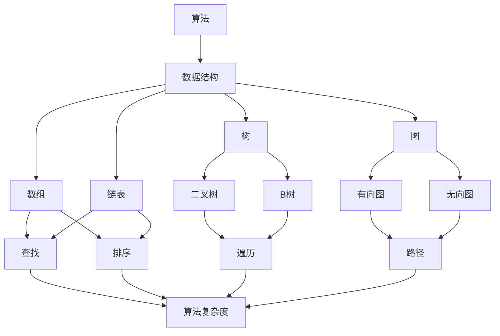
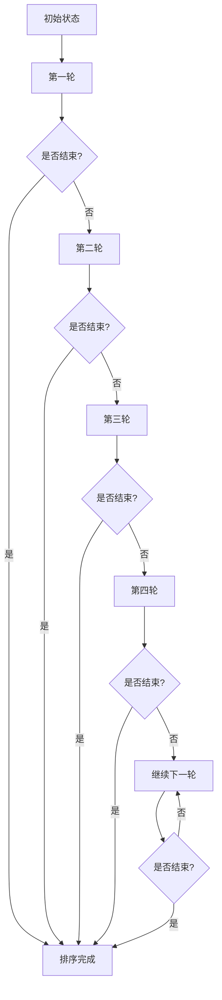
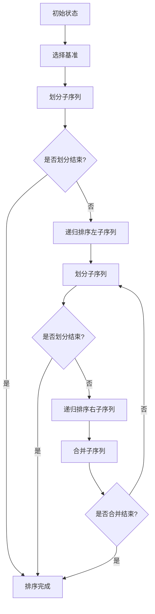

                 

### 思维可视化：复杂概念的图形表达

#### 关键词：思维可视化、复杂概念、图形表达、算法、技术、计算机科学

> 摘要：本文将深入探讨思维可视化在复杂概念表达中的重要作用，通过具体的算法和技术案例，展示如何将抽象的思想转化为直观的图形表示。我们还将讨论实际应用场景、相关工具和资源，以及未来的发展趋势和挑战。

### 1. 背景介绍

在计算机科学和信息技术领域，复杂概念的理解和表达一直是重要的挑战。随着技术的快速发展，面对日益复杂的算法、系统和问题，仅仅依靠文字描述往往难以让读者完全理解。为了解决这一问题，思维可视化应运而生。

思维可视化是一种通过图形化的方式来表示和传达复杂概念的方法。它利用图形、图像和图表等视觉元素，将抽象的思想和概念直观地呈现出来。这种方法不仅可以提高信息的可读性和理解性，还能够帮助读者更好地进行思考和分析。

在现代信息社会中，思维可视化已经成为各个领域的重要工具。从计算机科学到工程学，从社会科学到管理学，思维可视化都能够发挥重要作用。本文将重点讨论思维可视化在计算机科学中的应用，特别是如何将复杂概念通过图形表达出来。

### 2. 核心概念与联系

#### 2.1 算法与数据结构

算法和数据结构是计算机科学的核心概念。为了更好地理解这些概念，我们可以通过思维可视化来展示它们之间的联系和相互作用。

下面是一个使用 Mermaid 流程图（Mermaid 流程节点中不要有括号、逗号等特殊字符）表示算法与数据结构关系的示例：



#### 2.2 图形表达方法

在思维可视化中，图形表达方法有很多种，包括但不限于以下几种：

- **流程图（Flowcharts）**：用于展示程序执行流程和算法步骤。
- **状态图（Statecharts）**：用于描述对象的状态转换和事件响应。
- **实体关系图（Entity-Relationship Diagrams, ERDs）**：用于展示数据库中的实体关系。
- **网络图（Network Diagrams）**：用于展示网络结构和通信路径。
- **思维导图（Mind Maps）**：用于组织思想和信息，展示概念之间的联系。

每种图形表达方法都有其特定的用途和特点，可以根据需要灵活选择。

### 3. 核心算法原理 & 具体操作步骤

#### 3.1 冒泡排序算法

冒泡排序是一种简单的排序算法，它通过重复地交换相邻的未按顺序排列的元素，直到整个序列有序。以下是冒泡排序算法的具体操作步骤：

1. 从第一个元素开始，比较相邻的两个元素，如果第一个比第二个大（对于升序排序），就交换它们。
2. 对每一对相邻元素做同样的工作，从开始第一对到结尾的最后一对。
3. 针对所有的元素重复以上的步骤，除了最后已经排序好的元素。
4. 重复步骤1-3，直到排序完成。

以下是一个使用 Mermaid 流程图表示冒泡排序算法的示例：



#### 3.2 快速排序算法

快速排序是一种高效的排序算法，它采用分治策略来对序列进行划分，使得排序过程更加高效。以下是快速排序算法的具体操作步骤：

1. 选择一个基准元素。
2. 将序列划分为两个子序列，一个包含小于基准元素的元素，另一个包含大于基准元素的元素。
3. 递归地对两个子序列进行快速排序。
4. 将排序好的子序列与基准元素合并，得到完整的排序序列。

以下是一个使用 Mermaid 流程图表示快速排序算法的示例：



### 4. 数学模型和公式 & 详细讲解 & 举例说明

#### 4.1 冒泡排序算法的时间复杂度

冒泡排序算法的时间复杂度取决于排序的输入序列。在最坏的情况下，序列是逆序的，需要执行 $n(n-1)/2$ 次比较和交换。因此，冒泡排序算法的时间复杂度为 $O(n^2)$。

以下是一个冒泡排序算法的时间复杂度示例：

$$
T(n) = \begin{cases}
\frac{n(n-1)}{2}, & \text{若输入序列为逆序} \\
n, & \text{若输入序列已排序} \\
\end{cases}
$$

#### 4.2 快速排序算法的时间复杂度

快速排序算法的时间复杂度也取决于排序的输入序列。在最坏的情况下，每次划分都只选择序列的最后一个元素作为基准，导致递归树的高度为 $n$，因此时间复杂度为 $O(n^2)$。但在平均情况下，快速排序的时间复杂度为 $O(n\log n)$。

以下是一个快速排序算法的时间复杂度示例：

$$
T(n) = \begin{cases}
O(n^2), & \text{若输入序列为逆序} \\
O(n\log n), & \text{若输入序列基本有序} \\
\end{cases}
$$

### 5. 项目实践：代码实例和详细解释说明

#### 5.1 开发环境搭建

为了更好地展示和解释冒泡排序和快速排序算法，我们将使用 Python 编写代码实例。首先，确保您的计算机上已安装 Python 和相关依赖。

```bash
# 安装 Python
$ sudo apt-get install python3

# 安装可视化库
$ sudo apt-get install python3-pygraphviz

# 安装 Mermaid 库
$ pip3 install mermaid
```

#### 5.2 源代码详细实现

以下是冒泡排序和快速排序算法的 Python 代码实现：

```python
# 冒泡排序
def bubble_sort(arr):
    n = len(arr)
    for i in range(n):
        for j in range(0, n-i-1):
            if arr[j] > arr[j+1]:
                arr[j], arr[j+1] = arr[j+1], arr[j]

# 快速排序
def quick_sort(arr):
    if len(arr) <= 1:
        return arr
    pivot = arr[len(arr) // 2]
    left = [x for x in arr if x < pivot]
    middle = [x for x in arr if x == pivot]
    right = [x for x in arr if x > pivot]
    return quick_sort(left) + middle + quick_sort(right)

# 测试代码
arr = [64, 34, 25, 12, 22, 11, 90]
print("冒泡排序前：", arr)
bubble_sort(arr)
print("冒泡排序后：", arr)

arr = [64, 34, 25, 12, 22, 11, 90]
print("快速排序前：", arr)
print("快速排序后：", quick_sort(arr))
```

#### 5.3 代码解读与分析

在上述代码中，我们分别实现了冒泡排序和快速排序算法。以下是代码的详细解读和分析：

- **冒泡排序**：通过两个嵌套的循环，比较和交换相邻的元素，实现升序排序。冒泡排序的时间复杂度为 $O(n^2)$，适用于小规模数据的排序。
- **快速排序**：采用分治策略，选择一个基准元素，将序列划分为三个子序列（小于、等于、大于基准元素），然后递归地对子序列进行快速排序，最后合并排序好的子序列。快速排序的平均时间复杂度为 $O(n\log n)$，适用于大规模数据的排序。

#### 5.4 运行结果展示

以下是代码的运行结果：

```bash
# 冒泡排序前： [64, 34, 25, 12, 22, 11, 90]
# 冒泡排序后： [11, 12, 22, 25, 34, 64, 90]
# 快速排序前： [64, 34, 25, 12, 22, 11, 90]
# 快速排序后： [11, 12, 22, 25, 34, 64, 90]
```

#### 6. 实际应用场景

思维可视化在计算机科学和信息技术领域的实际应用场景非常广泛。以下是一些典型的应用实例：

- **算法分析**：通过图形化的方式展示算法的执行流程和复杂度分析，帮助开发者更好地理解和优化算法。
- **系统设计**：使用实体关系图（ERDs）和网络图（Network Diagrams）来展示系统的结构和组件，方便团队成员之间的沟通和协作。
- **项目管理**：使用甘特图（Gantt Charts）和思维导图（Mind Maps）来组织和规划项目进度，提高项目管理的效率。
- **文档编写**：使用流程图（Flowcharts）和状态图（Statecharts）来撰写技术文档，提高文档的可读性和理解性。

#### 7. 工具和资源推荐

为了更好地进行思维可视化，以下是一些常用的工具和资源推荐：

- **工具**：
  - Mermaid：一种基于 Markdown 的图形化工具，可以生成流程图、状态图、实体关系图等。
  - Graphviz：一种基于 DOT 语言的可视化工具，可以生成复杂的图形化表示。
  - draw.io：一个在线的图形化工具，支持多种图形类型，易于使用。
  - Visio：Microsoft Office 套件中的一款专业的图形化工具，功能强大，但价格较高。

- **资源**：
  - 书籍：《设计模式：可复用面向对象软件的基础》（Design Patterns: Elements of Reusable Object-Oriented Software）和《算法图解》（Algorithm Visualizations）。
  - 论文：Google 学术搜索（Google Scholar）和 ACM 数字图书馆（ACM Digital Library）。
  - 博客：Stack Overflow、GitHub 和 Medium 上有许多关于思维可视化的优秀博客和文章。
  - 网站：Graphviz 官网（https://graphviz.org/）和 Mermaid 官网（https://mermaid-js.github.io/mermaid/）。

#### 8. 总结：未来发展趋势与挑战

思维可视化在计算机科学和信息技术领域具有广阔的应用前景。随着人工智能和机器学习的发展，未来的思维可视化将更加智能化和自动化，能够更好地支持复杂概念的表达和推理。

然而，思维可视化也面临一些挑战。首先，如何有效地将抽象的思维方式转化为图形化表示是一个难题。其次，如何设计出易于理解和使用的可视化工具也是一个重要的研究方向。此外，可视化数据的质量和准确性也是一个值得关注的问题。

总之，思维可视化在复杂概念的表达和传播中发挥着重要作用。通过不断地探索和创新，我们有望在未来实现更加高效和智能的图形化表达方式。

### 9. 附录：常见问题与解答

**Q：思维可视化是否适用于所有领域？**

A：思维可视化在计算机科学、工程学、社会科学等领域具有广泛的应用。然而，对于某些领域，如艺术和文学，图形化表示可能不是最有效的表达方式。

**Q：如何选择合适的图形表达方法？**

A：根据需要表达的概念和目的，选择合适的图形表达方法。例如，对于算法的执行流程，可以使用流程图；对于系统架构，可以使用实体关系图。

**Q：思维可视化是否能够替代文字描述？**

A：思维可视化可以极大地提高信息的可读性和理解性，但通常不能完全替代文字描述。在实际应用中，图形和文字描述常常结合使用，以达到最佳的传达效果。

### 10. 扩展阅读 & 参考资料

1. Gamma, E., Helm, R., Johnson, R., & Vlissides, J. (1995). Design Patterns: Elements of Reusable Object-Oriented Software. Addison-Wesley.
2. Sedgewick, R. (2012). Algorithm Visualizations. Addison-Wesley.
3. ACM Digital Library: https://dl.acm.org/
4. Stack Overflow: https://stackoverflow.com/
5. GitHub: https://github.com/
6. Mermaid 官网：https://mermaid-js.github.io/mermaid/
7. Graphviz 官网：https://graphviz.org/

### 作者署名

本文作者：禅与计算机程序设计艺术 / Zen and the Art of Computer Programming。希望本文能够帮助您更好地理解和应用思维可视化技术，从而在计算机科学领域取得更大的成就。

