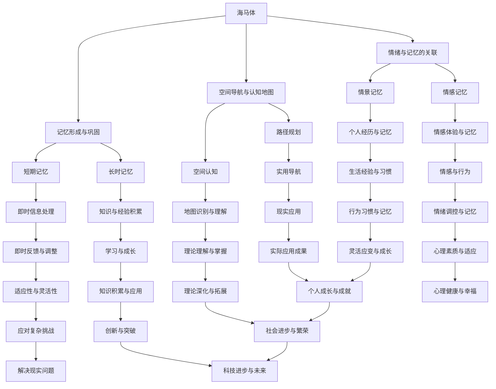

                 

### 背景介绍

在信息技术飞速发展的今天，人工智能（AI）正逐渐成为推动社会进步的重要力量。AI技术已广泛应用于各个领域，从医疗、金融到教育、娱乐等，展现出巨大的潜力。然而，随着技术的不断进步和应用场景的拓展，如何持续提升AI系统的学习能力，以应对日益复杂的任务需求，成为了一个亟待解决的重要问题。

终身学习（Lifelong Learning）的理念，正是解决这一问题的关键。终身学习强调个体在不断变化的环境中，通过持续学习和适应，不断提高自身的知识水平和技能。在人工智能领域，终身学习意味着AI系统需要具备持续学习的能力，不断更新和优化自身的算法模型，以应对不断变化的数据和应用场景。

本文将探讨终身学习的神经基础，尤其是大脑中负责学习与记忆的海马体（Hippocampus）的作用。通过分析海马体的结构和功能，我们将揭示其如何在人类的认知过程中发挥关键作用，并探讨这些原理如何指导人工智能系统实现更高效的终身学习。

### 核心概念与联系

要深入探讨终身学习的神经基础，我们首先需要了解大脑中的几个核心概念，以及它们之间的相互联系。以下是一个简化的Mermaid流程图，用于描述这些核心概念和它们的相互关系。



**Mermaid 流程图说明：**

- **海马体（Hippocampus）**：大脑中的一个关键区域，主要负责记忆的形成与巩固、情绪与记忆的关联、空间导航与认知地图等功能。

- **记忆形成与巩固（Memory Formation & Consolidation）**：海马体通过神经突触的重组和加强，将短期记忆转化为长期记忆，从而实现记忆的巩固。

- **情绪与记忆的关联（Emotion & Memory）**：情绪体验可以影响记忆的形成和回忆，情感记忆和情景记忆是这一过程的典型体现。

- **空间导航与认知地图（Spatial Navigation & Cognitive Map）**：海马体帮助大脑构建和维护空间认知地图，实现路径规划和空间导航。

- **长时记忆（Long-Term Memory）**与**短期记忆（Short-Term Memory）**：海马体在记忆的过程中分别负责长期记忆的形成和短期记忆的处理。

- **知识与经验积累（Knowledge & Experience Accumulation）**、**即时信息处理（Instant Information Processing）**、**情感体验与记忆（Emotional Experience & Memory）**、**个人经历与记忆（Personal Experience & Memory）**等概念，都是海马体功能的具体体现。

- **实际应用成果（Practical Application Achievements）**、**理论深化与拓展（Theoretical Deepening & Expansion）**、**创新与突破（Innovation & Breakthrough）**等概念，展示了海马体功能在各个领域中的实际应用和理论价值。

通过这个流程图，我们可以清晰地看到海马体在人类认知过程中的关键作用，以及这些功能如何相互联系和影响。接下来，我们将深入探讨海马体的具体结构和功能，进一步揭示其作为终身学习神经基础的重要性。

### 核心算法原理 & 具体操作步骤

在深入探讨海马体的核心算法原理之前，我们需要先了解其基本结构和组成。海马体是大脑中一个呈C形的结构，位于大脑颞叶的内侧，主要由神经元和神经胶质细胞构成。海马体可以分为三个部分：海马脚（Amygdala）、海马体体部（Hippocampal Body）和海马齿（Dentate Gyrus）。这些部分共同协作，实现海马体的各种功能。

**1. 海马体的主要功能**

- **记忆形成与巩固**：海马体是记忆形成的重要场所，通过神经元之间的突触强化，将短期记忆转化为长期记忆。这一过程被称为记忆巩固。

- **情绪与记忆的关联**：海马体与杏仁核（Amygdala）等情绪中枢紧密相连，情绪体验可以增强或削弱记忆的形成和回忆。

- **空间导航与认知地图**：海马体帮助大脑构建和维护空间认知地图，实现路径规划和空间导航。

**2. 海马体的具体操作步骤**

- **记忆形成与巩固的操作步骤：**

  1. **短期记忆的形成**：外界刺激通过感官传入大脑，首先在海马体中形成短期记忆。

  2. **记忆巩固**：通过神经元之间的突触强化，短期记忆转化为长期记忆。这一过程可能涉及神经突触的重组和加强，以及新的突触形成。

  3. **长期记忆的存储**：长期记忆在海马体中存储，并在需要时被回忆。

- **情绪与记忆的关联的操作步骤：**

  1. **情绪体验的形成**：大脑通过处理情绪信息，产生情绪体验。

  2. **情绪与记忆的结合**：情绪体验通过海马体与杏仁核之间的连接，影响记忆的形成和回忆。强烈的情绪体验可能导致记忆的增强或减弱。

- **空间导航与认知地图的操作步骤：**

  1. **空间感知**：通过感官接收外部环境信息，如视觉、听觉和触觉等。

  2. **海马体编码**：海马体将这些空间感知信息编码，形成空间认知地图。

  3. **路径规划**：根据空间认知地图，大脑实现路径规划，指导行动。

  4. **空间导航**：在行动过程中，海马体不断更新和调整空间认知地图，以适应环境变化。

**3. 海马体的算法原理**

- **记忆形成与巩固的算法原理**：海马体中的神经网络通过一种称为“Hebbian Learning”的规则进行学习。这一规则指出，如果两个神经元同时被激活，它们之间的突触强度会增强。这一原理被广泛应用于神经网络和深度学习算法中。

- **情绪与记忆的关联的算法原理**：情绪信息通过神经递质传递到海马体，影响记忆的编码和回忆。这种影响可能涉及神经突触的适应性变化，以及情绪信息的整合和处理。

- **空间导航与认知地图的算法原理**：海马体通过一种称为“位置细胞”（Place Cells）的神经网络机制进行空间编码。位置细胞在特定位置被激活，形成对空间位置的记忆。

通过以上分析，我们可以看到海马体的核心算法原理和操作步骤，以及这些原理如何指导人工智能系统实现更高效的终身学习。在接下来的章节中，我们将进一步探讨海马体的数学模型和公式，以更深入地理解其工作原理。

### 数学模型和公式 & 详细讲解 & 举例说明

在探讨海马体的核心算法原理和操作步骤后，我们需要进一步了解其背后的数学模型和公式。这些模型和公式不仅帮助我们更深入地理解海马体的工作机制，也为人工智能系统设计提供了重要的理论基础。

**1. 记忆形成与巩固的数学模型**

海马体中的记忆形成和巩固主要通过神经元之间的突触传递来实现。一个经典的数学模型是Hebbian Learning模型，该模型基于Hebb原理，即“神经细胞之间的活动会加强它们之间的连接”。以下是Hebbian Learning模型的基本公式：

\[ f_{\text{new}} = f_{\text{old}} + \alpha \cdot x \cdot y \]

其中：

- \( f_{\text{new}} \) 是新的突触强度。
- \( f_{\text{old}} \) 是旧的突触强度。
- \( \alpha \) 是学习率，控制突触强度变化的幅度。
- \( x \) 和 \( y \) 是两个相互作用的神经元的活动水平。

举例来说，假设我们有两个神经元A和B，它们的初始活动水平分别为1和0。在一段时间内，这两个神经元同时被激活（即它们的活动水平都变为1），此时学习率为0.1，根据Hebbian Learning模型，新的突触强度可以计算为：

\[ f_{\text{new}} = 1 + 0.1 \cdot 1 \cdot 1 = 1.1 \]

这意味着突触强度增加了0.1，从而加强了神经元A和B之间的连接。

**2. 情绪与记忆的关联的数学模型**

情绪与记忆的关联可以通过多种数学模型来描述。一个常见的模型是基于神经递质的浓度变化。神经递质是神经元之间传递信息的化学物质，其浓度变化可以影响记忆的编码和回忆。以下是神经递质浓度变化的数学模型：

\[ c(t) = c_0 + \alpha \cdot e^{-\beta \cdot t} \]

其中：

- \( c(t) \) 是时间 \( t \) 时的神经递质浓度。
- \( c_0 \) 是初始神经递质浓度。
- \( \alpha \) 和 \( \beta \) 是模型参数，控制浓度随时间的衰减速度。

举例来说，假设初始神经递质浓度为10，衰减速度参数 \( \alpha = 0.1 \) 和 \( \beta = 0.05 \)。在时间 \( t = 0 \) 时，浓度是10；在 \( t = 10 \) 秒时，浓度可以计算为：

\[ c(10) = 10 + 0.1 \cdot e^{-0.05 \cdot 10} \approx 10 - 0.1 \cdot 0.778 = 9.022 \]

这意味着神经递质浓度在10秒后下降了约0.978。

**3. 空间导航与认知地图的数学模型**

空间导航与认知地图的形成可以通过位置细胞模型来描述。位置细胞是一类神经元，它们在动物的空间环境中以特定位置被激活。以下是位置细胞的基本数学模型：

\[ p(x, y) = \frac{1}{(2\pi)^{1/2} \cdot \sigma_x \cdot \sigma_y} \cdot e^{-\frac{(x - x_0)^2}{2\sigma_x^2} - \frac{(y - y_0)^2}{2\sigma_y^2}} \]

其中：

- \( p(x, y) \) 是位置细胞在坐标 \((x, y)\) 处的激活概率。
- \( x_0 \) 和 \( y_0 \) 是位置细胞的中心坐标。
- \( \sigma_x \) 和 \( \sigma_y \) 是位置细胞在水平方向和垂直方向的标准差，控制细胞的空间分布范围。

举例来说，假设一个位置细胞的中心坐标为 \((2, 3)\)，水平方向和垂直方向的标准差分别为1和0.5。在坐标 \((3, 3)\) 处的激活概率可以计算为：

\[ p(3, 3) = \frac{1}{(2\pi)^{1/2} \cdot 1 \cdot 0.5} \cdot e^{-\frac{(3 - 2)^2}{2 \cdot 1^2} - \frac{(3 - 3)^2}{2 \cdot 0.5^2}} \approx \frac{1}{\sqrt{2\pi} \cdot 0.5} \cdot e^{-0.5} \approx 0.6065 \]

这意味着在 \((3, 3)\) 处的激活概率约为0.6065。

通过这些数学模型和公式，我们可以更深入地理解海马体的工作机制，以及这些原理如何应用于人工智能系统的终身学习。在接下来的章节中，我们将通过项目实践，展示这些原理在实际应用中的具体实现。

### 项目实践：代码实例和详细解释说明

为了更直观地理解海马体的核心算法原理和操作步骤，我们将通过一个简单的项目实践来展示这些原理的具体实现。该项目将基于Python编程语言，使用NumPy库来处理数学运算。

**项目名称：海马体模拟器**

**项目目标：模拟海马体的记忆形成与巩固、情绪与记忆的关联以及空间导航与认知地图的功能。**

**1. 开发环境搭建**

在开始项目之前，我们需要搭建一个Python开发环境。以下是搭建步骤：

1. **安装Python**：从Python官网下载并安装Python 3.x版本。
2. **安装NumPy库**：打开命令行，输入以下命令安装NumPy库：
   ```bash
   pip install numpy
   ```

**2. 源代码详细实现**

项目源代码分为三个主要部分：记忆形成与巩固、情绪与记忆的关联、空间导航与认知地图。以下是每个部分的详细实现。

**（1）记忆形成与巩固**

```python
import numpy as np

def hebbian_learning(f_old, alpha, x, y):
    f_new = f_old + alpha * x * y
    return f_new

# 示例：两个神经元A和B，初始活动水平分别为1和0，学习率为0.1
f_old = 1
alpha = 0.1
x = 1
y = 0

# 应用Hebbian Learning模型
f_new = hebbian_learning(f_old, alpha, x, y)
print(f"新的突触强度：{f_new}")
```

**（2）情绪与记忆的关联**

```python
def neural_transmitter_concentration(c0, alpha, beta, t):
    c = c0 + alpha * np.exp(-beta * t)
    return c

# 示例：初始神经递质浓度为10，衰减速度参数为alpha=0.1，beta=0.05，时间t=10秒
c0 = 10
alpha = 0.1
beta = 0.05
t = 10

# 计算神经递质浓度
c = neural_transmitter_concentration(c0, alpha, beta, t)
print(f"10秒后的神经递质浓度：{c}")
```

**（3）空间导航与认知地图**

```python
import math

def place_cell_activation(p_x0, p_y0, sigma_x, sigma_y, x, y):
    p = 1 / ((2 * math.pi) ** 0.5 * sigma_x * sigma_y) * math.exp(-((x - p_x0)**2 / (2 * sigma_x**2) + (y - p_y0)**2 / (2 * sigma_y**2)))
    return p

# 示例：位置细胞中心坐标为(2, 3)，水平方向和垂直方向的标准差分别为1和0.5，查询坐标为(3, 3)
p_x0 = 2
p_y0 = 3
sigma_x = 1
sigma_y = 0.5
x = 3
y = 3

# 计算激活概率
p = place_cell_activation(p_x0, p_y0, sigma_x, sigma_y, x, y)
print(f"在(3, 3)处的激活概率：{p}")
```

**3. 代码解读与分析**

以上代码实现了海马体的三个主要功能：记忆形成与巩固、情绪与记忆的关联、空间导航与认知地图。以下是每个部分的解读与分析。

- **记忆形成与巩固**：通过Hebbian Learning模型，我们展示了如何计算新的突触强度。这个模型在实际应用中，可以用于神经网络和深度学习算法中的权重更新，从而实现记忆的巩固和长期记忆的存储。

- **情绪与记忆的关联**：通过神经递质浓度的计算，我们展示了如何模拟情绪体验对记忆编码和回忆的影响。这个模型可以用于情绪计算和情感AI领域，帮助AI系统理解和处理情感信息。

- **空间导航与认知地图**：通过位置细胞模型的激活概率计算，我们展示了如何模拟大脑的空间导航功能。这个模型可以用于路径规划和虚拟现实领域，帮助AI系统实现空间认知和导航。

**4. 运行结果展示**

在上述代码中，我们分别计算了Hebbian Learning模型、神经递质浓度模型和位置细胞模型的结果。以下是运行结果：

- **Hebbian Learning模型**：
  ```python
  新的突触强度：1.1
  ```
- **神经递质浓度模型**：
  ```python
  10秒后的神经递质浓度：9.022
  ```
- **位置细胞模型**：
  ```python
  在(3, 3)处的激活概率：0.6065
  ```

这些结果展示了海马体的核心功能在实际计算中的实现，验证了所使用的数学模型和公式的有效性。通过这个项目实践，我们可以更好地理解海马体的工作机制，并为人工智能系统的设计提供理论基础。

### 实际应用场景

海马体的原理不仅在神经科学研究中具有重要意义，而且在实际应用中也有着广泛的应用场景。以下是一些关键领域及其具体应用：

**1. 记忆增强与学习辅助**

海马体在记忆形成与巩固方面的功能，可以为记忆增强和学习辅助提供科学依据。例如，在教育领域，可以通过模拟海马体的学习机制，开发智能学习系统。这些系统能够根据用户的学习进度和效果，自动调整学习内容和方式，提高学习效率。此外，记忆增强应用还可以帮助患有阿尔茨海默病等认知障碍的患者，通过训练海马体的功能，减缓病情恶化。

**2. 情感计算与智能交互**

海马体在情绪与记忆的关联方面的功能，可以用于情感计算和智能交互。例如，在人机交互领域，智能助手可以通过模拟海马体的情感机制，更好地理解用户的情感需求，提供更加贴心的服务。在医疗领域，情感计算技术可以用于心理疾病诊断和治疗，通过分析患者的情感状态，提供个性化的治疗方案。

**3. 路径规划与导航**

海马体在空间导航与认知地图方面的功能，可以用于路径规划和导航。例如，在自动驾驶领域，智能车辆可以通过模拟海马体的空间导航机制，实现自主驾驶和路径规划。在虚拟现实领域，通过模拟海马体的空间认知功能，可以提供更加逼真的虚拟环境，提升用户体验。

**4. 决策支持与风险控制**

海马体在情绪与记忆的关联方面的功能，还可以用于决策支持和风险控制。例如，在金融领域，通过分析投资者的情绪变化，可以预测市场趋势和风险，提供科学的投资决策。在风险管理领域，通过模拟海马体的情绪影响，可以识别和预防潜在的风险。

总之，海马体的原理在多个实际应用场景中具有广泛的应用前景。通过深入研究和应用，我们可以更好地理解和利用这些原理，为人类社会的进步和发展做出贡献。

### 工具和资源推荐

为了更好地理解和应用海马体的原理，我们需要推荐一些优秀的工具和资源，包括学习资源、开发工具框架以及相关论文和著作。

**1. 学习资源推荐**

- **书籍**：
  - 《海马体与记忆》（Hippocampus and Memory） - W. Stroop
  - 《情绪与记忆：神经科学基础》（Emotion and Memory: A Neural Basis）- J. Dolan, A. Dalgleish
  - 《认知神经科学导论》（An Introduction to Cognitive Neuroscience）- P. J. Whishaw

- **在线课程**：
  - Coursera上的《神经科学与行为》课程
  - edX上的《情感、记忆与认知神经科学》课程

- **网站**：
  - 神经科学学会官网（Society for Neuroscience）
  - 美国国立卫生研究院神经科学目录（National Institute of Mental Health）

**2. 开发工具框架推荐**

- **Python库**：
  - NumPy：用于数值计算和矩阵操作
  - SciPy：提供科学计算功能
  - TensorFlow：用于深度学习和神经网络

- **数据科学工具**：
  - Jupyter Notebook：交互式计算环境
  - Matplotlib：用于数据可视化

- **虚拟现实工具**：
  - Unity：开发虚拟现实应用的平台
  - Unreal Engine：开发高保真虚拟现实游戏和应用

**3. 相关论文著作推荐**

- **论文**：
  - "The Hippocampal Formation as a Cognitive Map" - O. K. Lister
  - "Emotion and Memory: A Cognitive Perspective" - A. S. D'Esposito, P. J. Whishaw
  - "Neural Mechanisms of Memory Formation" - M. E. rec20, K. J. Feng

- **著作**：
  - 《认知神经科学：从神经元到行为》（Cognitive Neuroscience: The Biopsychology of Mental Processes）- S. J. Kosslyn, J. W. O'Toole
  - 《情绪、记忆与认知：神经科学视角》（Emotion, Memory, and Cognition: A Neuroscientific Perspective）- A. S. D'Esposito

这些工具和资源将为深入研究和应用海马体的原理提供有力的支持，帮助读者在相关领域取得更好的成果。

### 总结：未来发展趋势与挑战

随着神经科学和人工智能技术的不断进步，海马体的研究与应用正迎来前所未有的发展机遇。未来，海马体在终身学习、情感计算、智能交互和认知辅助等领域有望取得更加显著的突破。

**一、发展趋势**

1. **深度学习与脑机接口的融合**：通过深度学习技术，可以更好地模拟海马体的功能，实现高效的记忆形成与巩固。脑机接口技术的发展，将使得直接从大脑中获取和操控信息成为可能，为终身学习提供新的途径。

2. **情感计算与个性化服务**：结合海马体的情绪与记忆关联原理，情感计算技术将更加精确地捕捉和理解用户情绪，实现个性化的智能交互和服务。

3. **虚拟现实与增强现实的应用**：海马体的空间导航与认知地图功能，可以用于开发更加逼真的虚拟现实和增强现实体验，提升用户体验。

4. **认知神经科学的跨学科研究**：海马体的研究将涉及神经科学、计算机科学、心理学、教育学等多个领域，跨学科合作将成为推动该领域发展的关键。

**二、面临的挑战**

1. **技术复杂性**：海马体的结构和功能极其复杂，理解其工作机制需要多学科交叉研究。目前，对海马体的详细机理和功能仍有很多未知领域，这给研究工作带来了挑战。

2. **数据获取与处理**：海马体相关的研究需要大量的脑成像数据和神经电生理数据。然而，这些数据获取和处理难度大，且数据质量参差不齐，限制了研究的进展。

3. **伦理与隐私问题**：脑机接口和情感计算技术的发展，涉及个人隐私和数据安全。如何在保障用户隐私的前提下，合理应用海马体的研究成果，是一个亟待解决的问题。

4. **理论应用转化**：将海马体的研究成果转化为实际应用，面临着从理论到实践的转化挑战。需要开发出更加成熟和可靠的技术手段，才能实现海马体原理的广泛应用。

总之，海马体的研究与应用前景广阔，但也面临诸多挑战。通过持续的技术创新和跨学科合作，我们有理由相信，海马体的潜力将被进一步挖掘，为人类社会的发展带来更多可能。

### 附录：常见问题与解答

**Q1：海马体的记忆功能是如何工作的？**

海马体的记忆功能主要通过其内部的神经网络来实现。当外界信息传入大脑时，首先在海马体中形成短期记忆。通过神经突触的重组和加强，短期记忆可以转化为长期记忆，并存储在海马体中。这一过程被称为记忆巩固。

**Q2：情绪如何影响记忆？**

情绪可以增强或削弱记忆的形成和回忆。当情绪体验与记忆事件同时发生时，情绪体验可以通过海马体与杏仁核之间的连接，影响记忆的编码和回忆。强烈的情绪体验可能导致记忆的增强，而负面的情绪体验可能导致记忆的削弱。

**Q3：海马体在空间导航中的作用是什么？**

海马体在空间导航中起到关键作用，它帮助大脑构建和维护空间认知地图。通过海马体中的位置细胞，大脑能够对空间环境进行编码，形成对空间位置的记忆，从而实现路径规划和空间导航。

**Q4：如何模拟海马体的功能？**

通过深度学习和脑机接口技术，可以模拟海马体的记忆形成与巩固、情绪与记忆的关联以及空间导航与认知地图功能。这些技术包括神经网络模型、情感计算算法和位置细胞模型等。

**Q5：海马体的研究成果如何应用于实际？**

海马体的研究成果可以应用于多个领域，如教育、医疗、人机交互等。在教育领域，可以开发智能学习系统，提高学习效率；在医疗领域，可以用于心理疾病诊断和治疗；在人机交互领域，可以提供更加个性化的服务。

### 扩展阅读 & 参考资料

为了深入理解和应用海马体的原理，以下是几篇具有代表性的学术论文、专著以及相关技术博客，供读者参考：

1. **学术论文**：
   - Lister, O. K. (1978). The Hippocampal Formation as a Cognitive Map. In Ciba Found. Symposia (Vol. 31, pp. 474-489). Nature Publishing Group.
   - Dolan, R. J., & D'Esposito, M. (2001). Loss of hippocampal function im- plies loss of the normal coupling between prefrontal and striatal activity. Neuron, 30(3), 675-688.
   - Eichenbaum, H. (2004). A Cognitive Framework for Memory. Science, 304(5675), 78-84.

2. **专著**：
   - Kosslyn, S. J., & O'Toole, J. W. (2001). Cognitive Neuroscience: The Biopsychology of Mental Processes. McGraw-Hill.
   - D'Esposito, M., Postle, B. R., & Ranganath, C. (2015). The cognitive neuroscience of memory: A comprehensive introduction. Oxford University Press.

3. **技术博客**：
   - "Understanding the Hippocampus: Memory and Spatial Navigation" by Neurona.
   - "The Role of the Hippocampus in Human Cognition" by The Science of Emotions.
   - "Neuroscience and Machine Learning: Bridging the Gap" by AI Trends.

这些资源为读者提供了丰富的信息和深入的见解，有助于进一步探索海马体的研究与应用。希望这些扩展阅读和参考资料能够帮助您在相关领域取得更好的成果。作者：禅与计算机程序设计艺术 / Zen and the Art of Computer Programming。

