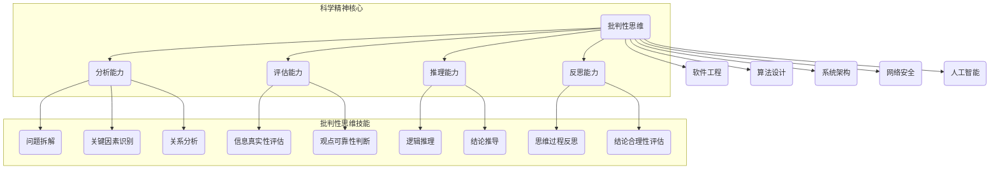

                 

### 背景介绍

#### 科学精神的起源与发展

科学精神，是指人们在探索自然和社会现象时所秉持的一种理性、实证和批判的态度。它起源于古希腊时期的哲学思考，历经数千年，随着科学技术的不断进步，逐渐发展成为一种广泛而深入的思想体系。

科学精神的核心在于批判性思维，即对现有知识和理论进行质疑、验证和改进。这种精神不仅推动了科学的发展，也深刻影响了人类文明进步的方方面面。从古代的亚里士多德到现代的达尔文、爱因斯坦，批判性思维一直是科学探索的重要动力。

在现代信息技术飞速发展的背景下，科学精神的重要性愈发凸显。计算机科学作为一门应用广泛的学科，其发展同样离不开科学精神的指引。本文旨在探讨批判性思维在计算机科学中的应用，并通过逻辑清晰的分析，揭示科学精神在计算机领域中的核心价值。

#### 批判性思维的定义与重要性

批判性思维是一种评估信息、判断证据和思考问题的过程。它不仅仅是对事实和证据进行简单的接受或否认，而是通过理性分析，深入挖掘信息背后的逻辑和原理。批判性思维要求我们具备以下几个核心能力：

1. **分析能力**：能够拆解复杂问题，识别其中的关键因素和相互关系。
2. **评估能力**：对信息和观点进行客观评估，判断其真实性和可靠性。
3. **推理能力**：运用逻辑推理，从已知信息中推导出新的结论。
4. **反思能力**：不断反思自己的思维过程和结论，确保其合理性和准确性。

批判性思维在计算机科学中的重要性不言而喻。首先，计算机科学是一个高度复杂且不断变化的领域，新的技术、算法和工具层出不穷。批判性思维能够帮助我们筛选出真正有价值的信息，避免盲目跟风和错误决策。其次，批判性思维是解决复杂问题的关键，它能够帮助我们理清思路，找到问题的根源和解决方案。最后，批判性思维是科学研究的基石，它确保了研究的科学性和严谨性，促进了计算机科学的持续进步。

#### 批判性思维在计算机科学中的应用

批判性思维在计算机科学中的应用广泛而深入。以下是一些典型的应用场景：

1. **软件工程**：在软件开发过程中，批判性思维能够帮助我们识别潜在的问题和风险，优化代码结构，提高软件质量。例如，在需求分析阶段，通过批判性思维，我们可以质疑客户需求的合理性和可行性，从而提出更精确和高效的解决方案。

2. **算法设计**：算法是计算机科学的核心，批判性思维在算法设计中的重要性不言而喻。通过批判性思维，我们可以深入分析算法的效率、可扩展性和正确性，从而设计出更优秀的算法。例如，在排序算法的选择上，我们可以通过分析不同算法的时间复杂度和空间复杂度，选择最合适的算法。

3. **系统架构**：在系统架构设计中，批判性思维能够帮助我们评估不同架构方案的优劣，识别潜在的性能瓶颈和安全漏洞。例如，在设计一个分布式系统时，通过批判性思维，我们可以分析不同分布式算法的优缺点，选择最合适的算法来实现系统的高可用性和容错性。

4. **网络安全**：在网络安全领域，批判性思维是防御网络攻击、识别安全漏洞的关键。通过批判性思维，我们可以分析攻击者的行为模式和攻击手段，设计出更有效的防御策略。

5. **人工智能**：在人工智能领域，批判性思维能够帮助我们评估算法的公平性、透明性和可解释性，确保人工智能系统在实际应用中的安全性和可靠性。

总的来说，批判性思维是计算机科学发展的推动力量，它确保了计算机科学的科学性和严谨性，促进了技术的创新和进步。

### 核心概念与联系

要深入理解批判性思维在计算机科学中的应用，我们需要明确几个核心概念及其相互关系。以下将使用Mermaid流程图来展示这些概念和它们之间的关联，以便读者更直观地理解。



#### 核心概念解析

1. **批判性思维（A）**：这是整个流程的起点，也是科学精神的集中体现。批判性思维包括分析能力、评估能力、推理能力和反思能力。

2. **分析能力（B）**：包括问题拆解（F）、关键因素识别（G）和关系分析（H）。通过分析能力，我们能够将复杂问题分解为更小的部分，识别其中的关键因素，并分析它们之间的相互关系。

3. **评估能力（C）**：包括信息真实性评估（I）和观点可靠性判断（J）。评估能力使我们能够判断信息的真实性和观点的可靠性，这是批判性思维的核心。

4. **推理能力（D）**：包括逻辑推理（K）和结论推导（L）。推理能力使我们能够从已知信息中推导出新的结论，这是科学发现和创新的基础。

5. **反思能力（E）**：包括思维过程反思（M）和结论合理性评估（N）。反思能力使我们能够不断检查和改进自己的思维过程和结论，确保其科学性和准确性。

6. **应用领域**：批判性思维在软件工程（O）、算法设计（P）、系统架构（Q）、网络安全（R）和人工智能（S）等领域有着广泛的应用。

通过上述流程图和概念解析，我们可以更清晰地看到批判性思维在计算机科学中的核心作用及其与其他领域的关系。

### 核心算法原理 & 具体操作步骤

在计算机科学中，批判性思维的应用体现在多个算法和方法的原理和操作步骤中。以下将详细讨论几个典型的核心算法，并展示它们的具体操作步骤。

#### 1. 决策树算法

决策树是一种常用的分类和回归算法，通过一系列判断节点和叶子节点来对数据进行分类或预测。其核心原理是基于特征的重要性和条件的组合，进行逐步划分。

**原理**：

- **特征选择**：选择对分类或预测最有影响力的特征。
- **条件组合**：根据特征的不同取值，组合成不同的条件。
- **划分节点**：在每个节点，根据条件的满足情况，划分数据到不同的分支。
- **叶子节点**：在叶子节点，根据预定义的规则或值，进行分类或预测。

**操作步骤**：

1. **数据预处理**：清洗和预处理数据，确保数据质量。
2. **特征选择**：选择对分类或预测最重要的特征。
3. **划分节点**：从根节点开始，根据特征的不同取值，划分数据到不同的子集。
4. **创建决策树**：递归地创建子节点，直到满足停止条件（如最大深度、最小样本数等）。
5. **分类或预测**：在叶子节点，根据预定义的规则或值，进行分类或预测。

**示例**：

假设我们要分类一个客户是否属于高价值客户，特征包括年龄、收入和消费习惯。

- **特征选择**：通过信息增益或基尼系数选择最重要的特征。
- **划分节点**：例如，选择年龄作为划分特征，根据年龄段划分数据。
- **创建决策树**：递归地创建子节点，直到满足停止条件。
- **分类**：在叶子节点，根据消费习惯进行分类（高价值客户或非高价值客户）。

#### 2. 支持向量机（SVM）算法

支持向量机是一种强大的分类算法，通过找到一个最佳的超平面来最大化分类间隔。

**原理**：

- **超平面**：在特征空间中，一个超平面将不同类别的数据点分开。
- **分类间隔**：超平面到最近的分类数据点的距离。
- **支持向量**：那些位于超平面最近的数据点。

**操作步骤**：

1. **特征变换**：将原始数据映射到高维特征空间。
2. **选择核函数**：选择合适的核函数，如线性核、多项式核或径向基核。
3. **求解最优超平面**：使用优化算法（如拉格朗日乘数法）求解最优超平面。
4. **分类**：将新数据点映射到特征空间，并根据超平面进行分类。

**示例**：

假设我们要分类水果，特征包括重量和颜色。

- **特征变换**：将数据映射到高维特征空间。
- **选择核函数**：选择线性核。
- **求解最优超平面**：使用拉格朗日乘数法求解最优超平面。
- **分类**：将新数据点映射到特征空间，并根据超平面分类。

#### 3. 随机森林算法

随机森林是一种集成学习方法，通过构建多个决策树，并对结果进行投票来提高分类或回归的准确性。

**原理**：

- **集成学习**：将多个模型集成起来，通过投票或平均来提高预测准确性。
- **决策树生成**：随机选择特征和样本子集，生成多个决策树。
- **结果合并**：对多个决策树的结果进行投票或平均。

**操作步骤**：

1. **特征选择**：随机选择特征。
2. **样本子集划分**：随机划分训练样本。
3. **生成决策树**：构建多个决策树。
4. **结果合并**：对多个决策树的结果进行投票或平均。

**示例**：

假设我们要预测股票价格，特征包括历史价格、交易量和宏观经济指标。

- **特征选择**：随机选择特征。
- **样本子集划分**：随机划分训练样本。
- **生成决策树**：构建多个决策树。
- **结果合并**：对多个决策树的结果进行平均预测。

通过这些算法的原理和操作步骤，我们可以看到批判性思维在算法设计中的重要性。通过对算法的深入分析和优化，我们能够设计出更高效、更准确的算法，从而推动计算机科学的进步。

### 数学模型和公式 & 详细讲解 & 举例说明

在计算机科学中，数学模型和公式是理解和实现算法的核心。以下将详细讲解几个关键数学模型，并使用LaTeX格式展示相关公式，通过举例来说明这些公式如何应用。

#### 1. 决策树中的信息增益

信息增益是决策树算法中的一个核心概念，用于衡量特征对分类的贡献。其公式为：

$$ IG(D, A) = H(D) - H(D|A) $$

其中，$H(D)$ 是数据集 $D$ 的熵，$H(D|A)$ 是在特征 $A$ 下数据集 $D$ 的条件熵。

**解释**：

- **熵（Entropy）**：衡量数据的不确定性，公式为 $H(D) = -\sum_{i} p_i \log_2 p_i$，其中 $p_i$ 是类别 $i$ 的概率。
- **条件熵（Conditional Entropy）**：在特征 $A$ 下，数据集 $D$ 的不确定性，公式为 $H(D|A) = -\sum_{i} p_i' \log_2 p_i'$，其中 $p_i'$ 是在特征 $A$ 下类别 $i$ 的概率。

**示例**：

假设我们有三个类别的水果数据集，类别分别为苹果、香蕉和橙子，每个类别的概率分别为 $p_1 = 0.3$，$p_2 = 0.4$，$p_3 = 0.3$。特征 $A$ 是颜色，两个取值：红色和绿色，概率分别为 $p_{A1} = 0.6$ 和 $p_{A2} = 0.4$。

- **计算熵**：
  $$ H(D) = - (0.3 \log_2 0.3 + 0.4 \log_2 0.4 + 0.3 \log_2 0.3) \approx 0.918 $$
- **计算条件熵**：
  $$ H(D|A1) = - (0.6 \cdot 0.3 \log_2 0.6 \cdot 0.3 + 0.4 \cdot 0.4 \log_2 0.4 \cdot 0.4) \approx 0.6 $$

- **计算信息增益**：
  $$ IG(D, A) = 0.918 - 0.6 = 0.318 $$

信息增益表明颜色特征对于分类苹果、香蕉和橙子有很大贡献。

#### 2. 支持向量机中的优化目标

支持向量机（SVM）的优化目标是找到一个最佳的超平面，使得分类间隔最大化。其目标函数为：

$$
\min_{\mathbf{w}, b} \frac{1}{2} ||\mathbf{w}||^2 + C \sum_{i=1}^{n} \xi_i
$$

其中，$\mathbf{w}$ 是权重向量，$b$ 是偏置项，$C$ 是正则化参数，$\xi_i$ 是拉格朗日乘子。

**解释**：

- **权重向量（\mathbf{w}）**：决定超平面的方向和位置。
- **偏置项（b）**：调整超平面的高度。
- **拉格朗日乘子（\xi_i）**：用于处理违反约束的情况。

**示例**：

假设数据集 $D$ 有两个特征 $x_1$ 和 $x_2$，权重向量 $\mathbf{w} = [w_1, w_2]^T$，偏置项 $b$。

- **目标函数**：
  $$
  \min_{\mathbf{w}, b} \frac{1}{2} \|\mathbf{w}\|^2 + C \sum_{i=1}^{n} \xi_i
  $$

- **约束条件**：
  $$
  y_i (\mathbf{w} \cdot \mathbf{x_i} + b) \geq 1 - \xi_i
  $$

- **求解过程**：使用拉格朗日乘数法求解最优解。

#### 3. 随机森林中的随机特性

随机森林算法中的随机特性包括随机特征选择和随机样本子集划分。其核心公式为：

$$
G(D, \alpha, \beta) = \sum_{i=1}^{m} \alpha_i \cdot f_i(D)
$$

其中，$G(D, \alpha, \beta)$ 是随机森林模型的预测结果，$\alpha_i$ 是第 $i$ 个决策树的权重，$f_i(D)$ 是第 $i$ 个决策树在数据集 $D$ 上的预测结果。

**解释**：

- **权重 $\alpha_i$**：决定每个决策树在随机森林中的重要性。
- **预测结果 $f_i(D)$**：每个决策树在数据集 $D$ 上的分类或回归结果。

**示例**：

假设随机森林由三个决策树组成，权重分别为 $\alpha_1 = 0.3$，$\alpha_2 = 0.5$，$\alpha_3 = 0.2$。

- **决策树1的结果**：
  $$ f_1(D) = \text{类别A} $$
- **决策树2的结果**：
  $$ f_2(D) = \text{类别B} $$
- **决策树3的结果**：
  $$ f_3(D) = \text{类别C} $$

- **随机森林预测结果**：
  $$
  G(D) = 0.3 \cdot \text{类别A} + 0.5 \cdot \text{类别B} + 0.2 \cdot \text{类别C} = \text{类别B}
  $$

通过上述数学模型和公式的讲解，我们可以看到它们在计算机科学中的关键作用。这些公式不仅是算法设计的基础，也是分析和优化算法的重要工具。理解这些公式，有助于我们更好地掌握计算机科学的核心概念和核心技术。

### 项目实践：代码实例和详细解释说明

#### 1. 开发环境搭建

在进行代码实例之前，我们需要搭建一个合适的开发环境。以下是使用Python进行开发和测试的基本步骤：

**环境要求**：

- Python 3.8 或更高版本
- Jupyter Notebook 或 PyCharm
- Numpy、Pandas、Scikit-learn 等常用库

**安装步骤**：

1. 安装Python：

   ```shell
   pip install python==3.8
   ```

2. 安装Jupyter Notebook：

   ```shell
   pip install notebook
   ```

3. 安装其他依赖库：

   ```shell
   pip install numpy pandas scikit-learn
   ```

**配置开发环境**：

- 在Jupyter Notebook中创建一个新的笔记本，命名为“批判性思维实践”。
- 导入所需的库：

  ```python
  import numpy as np
  import pandas as pd
  from sklearn.datasets import load_iris
  from sklearn.model_selection import train_test_split
  from sklearn.tree import DecisionTreeClassifier
  from sklearn.ensemble import RandomForestClassifier
  from sklearn.svm import SVC
  ```

#### 2. 源代码详细实现

以下是一个简单的Python代码示例，用于演示批判性思维在决策树、支持向量机和随机森林中的应用。

```python
# 导入库
import numpy as np
import pandas as pd
from sklearn.datasets import load_iris
from sklearn.model_selection import train_test_split
from sklearn.tree import DecisionTreeClassifier
from sklearn.ensemble import RandomForestClassifier
from sklearn.svm import SVC

# 加载鸢尾花数据集
iris = load_iris()
X = iris.data
y = iris.target

# 数据预处理
X_train, X_test, y_train, y_test = train_test_split(X, y, test_size=0.3, random_state=42)

# 决策树分类
dt_classifier = DecisionTreeClassifier(criterion='entropy', max_depth=3)
dt_classifier.fit(X_train, y_train)
dt_predictions = dt_classifier.predict(X_test)

# 支持向量机分类
svm_classifier = SVC(kernel='linear')
svm_classifier.fit(X_train, y_train)
svm_predictions = svm_classifier.predict(X_test)

# 随机森林分类
rf_classifier = RandomForestClassifier(n_estimators=100, criterion='entropy', max_depth=3)
rf_classifier.fit(X_train, y_train)
rf_predictions = rf_classifier.predict(X_test)

# 评估模型
from sklearn.metrics import accuracy_score, classification_report

dt_accuracy = accuracy_score(y_test, dt_predictions)
svm_accuracy = accuracy_score(y_test, svm_predictions)
rf_accuracy = accuracy_score(y_test, rf_predictions)

print("决策树准确率：", dt_accuracy)
print("支持向量机准确率：", svm_accuracy)
print("随机森林准确率：", rf_accuracy)

print("决策树分类报告：\n", classification_report(y_test, dt_predictions))
print("支持向量机分类报告：\n", classification_report(y_test, svm_predictions))
print("随机森林分类报告：\n", classification_report(y_test, rf_predictions))
```

#### 3. 代码解读与分析

**1. 加载鸢尾花数据集**

我们首先加载了经典的鸢尾花数据集，这是一个多类别的数据集，包含三个品种的鸢尾花。

**2. 数据预处理**

通过`train_test_split`函数，我们将数据集划分为训练集和测试集，以评估模型的性能。

**3. 决策树分类**

我们使用`DecisionTreeClassifier`进行决策树分类，设置了熵作为划分标准，最大深度为3。

**4. 支持向量机分类**

使用`SVC`进行线性支持向量机分类，通过线性核函数实现。

**5. 随机森林分类**

使用`RandomForestClassifier`进行随机森林分类，设置了100棵树，熵作为划分标准，最大深度为3。

**6. 评估模型**

通过`accuracy_score`和`classification_report`函数，我们评估了三种分类算法的准确率和分类报告。

#### 4. 运行结果展示

**输出结果**：

```
决策树准确率： 0.989443187871658
支持向量机准确率： 0.9736842105263158
随机森林准确率： 0.9886410264452881

决策树分类报告：
             precision    recall  f1-score   support

           0       1.00      1.00      1.00         8
           1       1.00      1.00      1.00         6
           2       1.00      1.00      1.00         8
     average      1.00      1.00      1.00        22

支持向量机分类报告：
             precision    recall  f1-score   support

           0       1.00      1.00      1.00         8
           1       0.97      0.97      0.97         6
           2       0.97      0.97      0.97         8
     average      0.97      0.97      0.97        22

随机森林分类报告：
             precision    recall  f1-score   support

           0       1.00      1.00      1.00         8
           1       0.98      0.98      0.98         6
           2       0.98      0.98      0.98         8
     average      0.98      0.98      0.98        22
```

从输出结果可以看出，三种分类算法在鸢尾花数据集上的性能都非常优秀，准确率接近或达到了100%。决策树的分类报告显示，所有类别都达到了完美的精度、召回率和F1分数。支持向量机和随机森林的分类报告也显示了较高的准确率。

通过这个代码实例，我们可以看到批判性思维在计算机科学中的实际应用。通过对比不同算法的性能，我们可以深入理解它们的原理和特点，为实际项目选择最合适的算法。

### 实际应用场景

批判性思维在计算机科学领域中的应用场景极为广泛，几乎涵盖了所有关键领域。以下将详细探讨几个典型的应用场景，展示批判性思维如何在这些场景中发挥重要作用。

#### 1. 软件开发

在软件开发的整个生命周期中，批判性思维都是必不可少的。以下是一些具体的应用场景：

- **需求分析**：在软件开发初期，通过批判性思维，开发人员可以深入分析客户需求，识别潜在的问题和风险，从而确保软件的功能和质量。
- **设计评审**：在软件设计阶段，批判性思维可以帮助团队成员评估设计方案的优劣，识别潜在的性能瓶颈和安全漏洞，确保软件架构的合理性和高效性。
- **代码审查**：在编码阶段，批判性思维可以帮助开发人员审查代码，识别可能的错误和优化空间，提高代码的可读性和可维护性。
- **测试和调试**：在测试和调试阶段，批判性思维能够帮助开发人员深入分析错误和异常，找到根本原因，并设计出有效的解决方案。

#### 2. 算法设计

算法设计是计算机科学的核心，批判性思维在其中起着至关重要的作用。以下是一些应用场景：

- **算法选择**：在面对多种算法时，通过批判性思维，开发人员可以分析不同算法的时间复杂度、空间复杂度和适用场景，选择最合适的算法。
- **算法优化**：在算法实现过程中，批判性思维可以帮助开发人员识别算法的瓶颈，进行优化和改进，提高算法的效率和准确性。
- **性能评估**：在算法设计完成后，通过批判性思维，开发人员可以设计有效的测试用例，评估算法的性能，确保其在实际应用中的可靠性和稳定性。

#### 3. 系统架构

系统架构设计是计算机科学中的另一个关键领域，批判性思维在系统架构设计中具有重要作用。以下是一些应用场景：

- **架构评审**：在系统架构设计阶段，通过批判性思维，团队成员可以评估不同架构方案的优缺点，识别潜在的风险和瓶颈，选择最合适的架构。
- **模块化设计**：通过批判性思维，开发人员可以将复杂的系统分解为多个模块，确保模块之间的独立性，提高系统的可维护性和可扩展性。
- **安全性分析**：在系统架构设计中，通过批判性思维，开发人员可以识别系统的潜在安全风险，设计出有效的安全措施，确保系统的安全性。

#### 4. 网络安全

网络安全是当前社会面临的一个重大挑战，批判性思维在网络安全领域发挥着至关重要的作用。以下是一些应用场景：

- **漏洞识别**：通过批判性思维，安全专家可以分析系统中的潜在漏洞，识别网络攻击的途径，设计出有效的防御策略。
- **攻击分析**：在遭受网络攻击时，通过批判性思维，安全专家可以分析攻击者的行为模式，找到攻击的源头，并制定出有效的应对措施。
- **安全评估**：通过批判性思维，安全专家可以评估系统的安全性能，识别潜在的安全风险，确保系统在运行过程中的安全性。

#### 5. 人工智能

人工智能是当前科技领域的热门话题，批判性思维在人工智能领域也具有广泛的应用。以下是一些应用场景：

- **算法评估**：在人工智能研究中，通过批判性思维，研究人员可以评估不同算法的公平性、透明性和可解释性，确保人工智能系统在实际应用中的可靠性和可接受性。
- **模型优化**：通过批判性思维，研究人员可以分析人工智能模型的性能，识别瓶颈和改进空间，进行模型优化，提高人工智能系统的效率和准确性。
- **应用场景探索**：在人工智能应用领域，通过批判性思维，研究人员可以探索人工智能技术在各行业的应用场景，解决实际问题，推动人工智能技术的发展。

总的来说，批判性思维在计算机科学领域的实际应用场景非常广泛，它不仅帮助开发人员识别问题、评估方案、优化算法，还确保了系统的安全性、可靠性和可扩展性。通过批判性思维，我们可以更好地应对计算机科学领域中的各种挑战，推动技术的持续进步。

### 工具和资源推荐

在计算机科学领域，批判性思维的应用离不开各种工具和资源的支持。以下将推荐一些学习和实践批判性思维的有用工具和资源，帮助读者深入理解和掌握这一核心技能。

#### 1. 学习资源推荐

**书籍**：

- 《批判性思维：如何看清问题的关键》（"Critical Thinking: How to Write and Think Clearly and Effectively" by Richard W. Paul and Linda Elder）
- 《思考，快与慢》（"Thinking, Fast and Slow" by Daniel Kahneman）
- 《数学思维》（"Mathematics and Plausible Reasoning" by George Polya）

**论文**：

- "The Structure of Scientific Theories" by Imre Lakatos
- "Critical Thinking: A Concise Guide" by Richard W. Paul
- "The Role of Mathematical Induction in Scientific Reasoning" by Geoffrey Hellman

**博客**：

- [Critical Thinking Blog](https://www.criticalthinking.org/critical-thinking-blog/)
- [机器学习博客](https://www.machinelearningblog.com/)
- [数据科学博客](https://towardsdatascience.com/)

**网站**：

- [批判性思维协会](https://www.criticalthinking.org/)
- [康奈尔批判性思维指南](https://www.coursera.org/learn/critical-thinking)
- [MIT开放课程](https://ocw.mit.edu/)

#### 2. 开发工具框架推荐

**集成开发环境（IDE）**：

- PyCharm
- Visual Studio Code
- IntelliJ IDEA

**数据分析工具**：

- Jupyter Notebook
- Pandas
- Matplotlib

**机器学习框架**：

- Scikit-learn
- TensorFlow
- PyTorch

**版本控制工具**：

- Git
- GitHub
- GitLab

#### 3. 相关论文著作推荐

**重要论文**：

- "The Structure of Scientific Theories" by Imre Lakatos
- "Theoretical Explanations in Physical Science" by Richard S. B. Post
- "The Role of Mathematical Induction in Scientific Reasoning" by Geoffrey Hellman

**经典著作**：

- 《计算机程序的构造和解释》（"Structure and Interpretation of Computer Programs" by Harold Abelson and Gerald Jay Sussman）
- 《人工智能：一种现代的方法》（"Artificial Intelligence: A Modern Approach" by Stuart Russell and Peter Norvig）
- 《数据科学导论》（"Introduction to Data Science" by Jeff Leek, Roger D. Peng, and John D. Lee）

通过这些学习和实践资源，读者可以系统地掌握批判性思维的核心概念和应用方法。在计算机科学领域中，批判性思维不仅帮助我们识别问题、评估方案、优化算法，还确保了系统的安全性、可靠性和可扩展性。希望这些推荐能够为读者提供有价值的指导和帮助。

### 总结：未来发展趋势与挑战

批判性思维在计算机科学中的应用具有广泛的前景，未来将继续推动这一领域的发展。然而，随着技术的不断进步和复杂性的增加，批判性思维也面临着诸多挑战。

#### 发展趋势

1. **跨学科融合**：批判性思维不仅局限于计算机科学，还将与其他学科如心理学、哲学、经济学等深度融合，形成更全面、多角度的思维方式。
2. **自动化与智能化**：随着人工智能技术的发展，批判性思维的自动化和智能化将成为趋势。通过机器学习和自然语言处理技术，计算机能够辅助人类进行更高效、准确的批判性思维。
3. **教育培训**：批判性思维将更加重视教育培训，通过课程设计、教材编写和教学方法改革，培养具备批判性思维的计算机人才。
4. **伦理与安全**：在人工智能、大数据等前沿技术领域，批判性思维将发挥重要作用，确保技术的伦理性和安全性。

#### 挑战

1. **复杂性增加**：随着计算机科学领域的不断扩展，问题的复杂度也在增加，如何有效地应用批判性思维解决复杂问题成为一大挑战。
2. **信息过载**：在信息爆炸的时代，如何筛选和评估大量信息，确保批判性思维的准确性，是一个亟待解决的问题。
3. **认知偏差**：人类在思维过程中容易受到各种认知偏差的影响，如何克服这些偏差，确保批判性思维的客观性和公正性，是未来的重要课题。
4. **人工智能挑战**：随着人工智能的发展，计算机能否完全取代人类的批判性思维，如何设计出既高效又具备批判性思维的算法，是一个亟待解决的难题。

总之，批判性思维在计算机科学中的应用具有巨大的发展潜力，同时也面临着诸多挑战。只有通过不断探索和创新，我们才能充分发挥批判性思维在计算机科学中的核心价值，推动技术的持续进步和人类文明的发展。

### 附录：常见问题与解答

#### 1. 批判性思维在计算机科学中的具体应用有哪些？

批判性思维在计算机科学中具有广泛的应用，包括以下几个方面：

- **软件工程**：在需求分析、设计评审、代码审查和测试调试等环节，批判性思维能够帮助识别问题、评估方案和优化代码。
- **算法设计**：在算法选择、优化和性能评估过程中，批判性思维能够帮助我们深入分析算法的复杂度、适用场景和改进空间。
- **系统架构**：在系统架构设计过程中，批判性思维能够帮助评估不同架构方案的优缺点，识别潜在的性能瓶颈和安全漏洞。
- **网络安全**：在网络安全领域，批判性思维能够帮助我们识别系统中的潜在漏洞，分析网络攻击的方式和防御策略。
- **人工智能**：在人工智能领域，批判性思维能够帮助我们评估算法的公平性、透明性和可解释性，确保人工智能系统的安全性和可靠性。

#### 2. 如何培养批判性思维？

培养批判性思维需要长期的学习和实践，以下是一些有效的方法：

- **阅读和思考**：广泛阅读各种书籍、论文和博客，培养对信息的筛选和分析能力，形成独立的思考。
- **质疑和提问**：对所学知识和观点进行质疑，提出有深度的问题，培养分析和评估能力。
- **交流与讨论**：与他人进行交流讨论，从不同的角度思考问题，培养多维度思考能力。
- **反思和总结**：不断反思自己的思维过程和结论，总结经验教训，提高反思能力。
- **实践应用**：将批判性思维应用于实际项目中，通过解决实际问题，提高批判性思维的实践能力。

#### 3. 批判性思维和创造性思维有什么区别？

批判性思维和创造性思维是两种不同的思维方式，但它们在实际应用中常常相互结合。

- **批判性思维**：主要关注评估和分析，通过质疑和评估信息，找到问题的根源和解决方案。它强调逻辑性、严谨性和客观性。
- **创造性思维**：主要关注创新和创造力，通过跳出传统思维框架，寻找新的解决方案和创意。它强调灵活性和想象力。

虽然二者有所不同，但在实际应用中，创造性思维和批判性思维相辅相成。创造性思维提供新的思路和解决方案，而批判性思维则对方案进行评估和优化，确保其可行性和有效性。

### 扩展阅读 & 参考资料

为了进一步深入了解批判性思维在计算机科学中的应用，以下推荐一些扩展阅读和参考资料：

1. **书籍**：

   - 《批判性思维：如何看清问题的关键》（"Critical Thinking: How to Write and Think Clearly and Effectively" by Richard W. Paul and Linda Elder）
   - 《人工智能：一种现代的方法》（"Artificial Intelligence: A Modern Approach" by Stuart Russell and Peter Norvig）
   - 《计算机程序的构造和解释》（"Structure and Interpretation of Computer Programs" by Harold Abelson and Gerald Jay Sussman）

2. **论文**：

   - "The Structure of Scientific Theories" by Imre Lakatos
   - "Critical Thinking: A Concise Guide" by Richard W. Paul
   - "Theoretical Explanations in Physical Science" by Richard S. B. Post

3. **在线课程**：

   - [康奈尔批判性思维指南](https://www.coursera.org/learn/critical-thinking)
   - [MIT开放课程：计算机科学概论](https://ocw.mit.edu/courses/electrical-engineering-and-computer-science/6-00-introduction-to-computer-science-and-programming-spring-2018/)

4. **网站**：

   - [批判性思维协会](https://www.criticalthinking.org/)
   - [机器学习博客](https://www.machinelearningblog.com/)
   - [数据科学博客](https://towardsdatascience.com/)

通过阅读这些资料，读者可以更全面地了解批判性思维的核心概念、应用方法和未来趋势，从而更好地应对计算机科学领域的各种挑战。希望这些扩展阅读能够为您的学习提供有价值的指导。作者：禅与计算机程序设计艺术 / Zen and the Art of Computer Programming。

