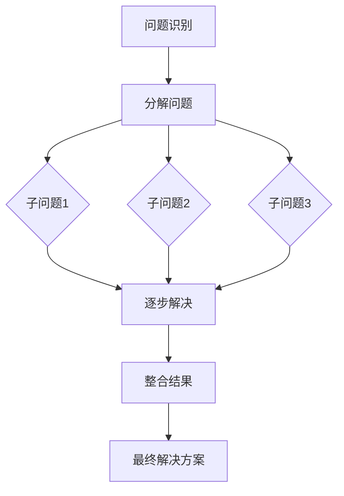

                 

### 思维链（Chain-of-Thought, CoT）：开山之作

#### 关键词：
- Chain-of-Thought (CoT)
- 人工智能
- 计算机科学
- 算法
- 实践

#### 摘要：
本文旨在探讨思维链（Chain-of-Thought, CoT）的概念、原理及其在人工智能领域的重要性。通过深入剖析CoT在计算机科学中的应用，我们将会展示其如何通过逐步分析和推理来提升算法效率和解决问题的能力。文章将结合具体实例，详述思维链的工作机制，并探讨其在未来技术发展中的潜力与挑战。

## 1. 背景介绍

在人工智能迅速发展的今天，算法的效率与智能水平成为了衡量系统性能的关键指标。传统的算法往往依赖于预设的规则或模式匹配，而这些方法在处理复杂问题时常常力不从心。为了解决这一问题，研究者们提出了思维链（Chain-of-Thought, CoT）这一概念，旨在模拟人类思维过程中的推理与决策机制。

思维链起源于心理学研究领域，其核心思想是将复杂的决策过程分解为一系列相对简单的步骤，通过逐步分析问题、推理得出结论。这一概念在计算机科学中得到广泛应用，特别是在深度学习与强化学习领域。通过引入思维链，人工智能系统能够更好地模拟人类的思维方式，从而在解决复杂问题时展现出更高的灵活性和适应性。

本文将首先介绍思维链的基本概念，然后探讨其在计算机科学中的应用，包括算法原理、数学模型和实际案例。在此基础上，我们将分析思维链在各个领域的实际应用场景，并推荐相关工具和资源。文章最后将总结思维链的未来发展趋势与挑战，为读者提供一个全面的视角来理解这一重要概念。

## 2. 核心概念与联系

### 2.1. 定义与起源

思维链（Chain-of-Thought, CoT）是一种思维模式，它通过将复杂的决策过程分解为一系列连贯的步骤来帮助个体或系统解决问题。这种模式最早由心理学家George Miller在1956年提出，用于描述人类在处理复杂信息时的认知过程。CoT的概念在计算机科学中得到进一步的发展，尤其是在人工智能领域，它被广泛应用于算法设计和问题求解中。

### 2.2. 工作机制

思维链的工作机制可以概括为以下几个步骤：

1. **问题识别**：首先，系统需要识别并理解问题。这包括从输入数据中提取关键信息，并确定问题的类型和复杂度。

2. **分解问题**：将复杂的问题分解为一系列更小、更简单的子问题。这一步骤有助于降低问题的复杂度，使其更易于解决。

3. **逐步解决**：通过逐步分析和推理，系统对每个子问题进行求解。在这一过程中，系统可能会生成多个假设或解决方案，并通过比较和评估来选择最佳方案。

4. **整合结果**：将各个子问题的解决方案整合起来，形成一个完整的解决方案。这一步骤确保了整体解决方案的一致性和准确性。

### 2.3. Mermaid 流程图

以下是一个简化的Mermaid流程图，展示了思维链的基本工作机制：



在上述流程图中，A表示问题识别，B表示分解问题，C、D、E表示子问题，F表示逐步解决，G表示整合结果，H表示最终解决方案。每个节点都代表思维链中的一个步骤，通过节点之间的连线，我们能够清晰地看到问题的逐步解决过程。

### 2.4. 与其他概念的关系

思维链与许多其他计算机科学和心理学概念密切相关。例如，它与传统的人工智能方法（如规则推理、模式匹配等）有着本质的区别。思维链强调逐步分析和推理，而传统方法则依赖于预设的规则或模式。此外，思维链与人类认知科学中的“认知框架”和“工作记忆”等概念也有紧密联系，这些概念帮助解释了思维链在人类思维过程中的作用。

通过上述介绍，我们可以看到思维链作为一种重要的思维模式，在计算机科学中具有广泛的应用前景。它不仅能够提升算法的效率和智能水平，还能够为复杂问题的求解提供新的思路和方法。在接下来的章节中，我们将进一步探讨思维链的算法原理和数学模型，并通过实际案例展示其应用效果。

## 3. 核心算法原理 & 具体操作步骤

### 3.1. 思维链算法原理

思维链算法（Chain-of-Thought Algorithm）是一种基于逐步分析和推理的算法框架，其核心思想是通过分解复杂问题并将其分解为一系列更小、更简单的子问题，从而实现高效的解决方案。思维链算法的关键在于其逐步解决问题的能力，以及如何将各个子问题的解决方案整合为一个完整、一致的解决方案。

思维链算法的工作原理可以分为以下几个关键步骤：

1. **问题识别**：首先，算法需要识别并理解问题的本质。这通常涉及到从输入数据中提取关键信息，并确定问题的类型和复杂度。问题识别是思维链算法的第一个关键步骤，它为后续的分解和解决过程提供了基础。

2. **问题分解**：将复杂的问题分解为一系列更小、更简单的子问题。这一步骤有助于降低问题的复杂度，使其更易于解决。问题分解的方法可以基于多种策略，如递归分解、分而治之等。

3. **逐步解决**：对于每个子问题，算法通过逐步分析和推理来寻找解决方案。在这一过程中，算法可能会生成多个假设或解决方案，并通过比较和评估来选择最佳方案。逐步解决的关键在于如何有效地组织和利用已有的信息和知识。

4. **整合结果**：将各个子问题的解决方案整合为一个完整、一致的解决方案。整合结果的过程需要确保各个子问题的解决方案能够无缝衔接，形成一个连贯的整体。这一步骤对于保证整体解决方案的准确性和一致性至关重要。

5. **结果验证**：在整合结果后，算法需要对最终解决方案进行验证，以确保其满足原始问题的要求。验证过程可以采用多种方法，如测试、模拟等。

### 3.2. 具体操作步骤

为了更好地理解思维链算法的原理，我们以一个简单的例子来具体说明其操作步骤。假设我们需要解决一个简单的数学问题：求解一个一元二次方程 \(ax^2 + bx + c = 0\)。

#### 步骤 1：问题识别

首先，我们需要识别并理解问题。在这个例子中，输入数据为系数 \(a\)、\(b\) 和 \(c\)，问题类型为一元二次方程求解，复杂度为中等。

#### 步骤 2：问题分解

将一元二次方程分解为以下几个更小的子问题：
- 求解判别式 \(\Delta = b^2 - 4ac\)
- 判断方程的根的类型（有两个实根、一个实根或两个复根）
- 根据根的类型求解具体的根值

#### 步骤 3：逐步解决

1. 求解判别式：计算 \(\Delta = b^2 - 4ac\)
2. 判断根的类型：
   - 如果 \(\Delta > 0\)，则有两个不同的实根
   - 如果 \(\Delta = 0\)，则有一个实根
   - 如果 \(\Delta < 0\)，则有两个共轭复根
3. 求解具体的根值：
   - 对于两个不同的实根，使用公式 \(x_1 = \frac{-b + \sqrt{\Delta}}{2a}\) 和 \(x_2 = \frac{-b - \sqrt{\Delta}}{2a}\)
   - 对于一个实根，使用公式 \(x = \frac{-b}{2a}\)
   - 对于两个共轭复根，使用公式 \(x_1 = \frac{-b + i\sqrt{-\Delta}}{2a}\) 和 \(x_2 = \frac{-b - i\sqrt{-\Delta}}{2a}\)

#### 步骤 4：整合结果

将各个子问题的解决方案整合为一个完整的解决方案。在这个例子中，我们得到了一元二次方程的根值，这些根值构成了最终的解决方案。

#### 步骤 5：结果验证

通过代入原始方程，验证求得的根值是否满足方程。如果所有根值都满足方程，则验证通过；否则，需要重新检查问题分解和逐步解决的过程，找出错误并进行修正。

通过上述步骤，我们使用思维链算法成功求解了一元二次方程。这个过程清晰地展示了思维链算法的基本原理和操作步骤，为理解更复杂的思维链算法提供了基础。

### 3.3. 优点与挑战

思维链算法具有以下优点：

- **逐步解决**：思维链算法通过逐步分析和解决子问题，使得复杂问题变得更加可管理和可解。
- **灵活性与适应性**：思维链算法能够灵活地处理不同类型的问题，并适应各种复杂度。
- **知识整合**：思维链算法在整合各个子问题的解决方案时，能够充分利用已有的知识和信息，提高整体解决问题的能力。

然而，思维链算法也存在一些挑战：

- **计算复杂性**：对于某些复杂问题，思维链算法可能会涉及大量的子问题和步骤，导致计算复杂性增加。
- **准确性保证**：在逐步解决和整合结果的过程中，如何保证最终解决方案的准确性是一个重要问题，特别是当子问题之间存在相互依赖时。
- **可解释性**：思维链算法通常涉及到复杂的推理和决策过程，如何确保其可解释性，使得用户能够理解和信任算法的结果，是一个重要的挑战。

总之，思维链算法作为一种基于逐步分析和推理的算法框架，在处理复杂问题时展现出独特的优势。通过深入理解其核心原理和操作步骤，我们可以更好地利用这一算法框架来解决实际问题。在接下来的章节中，我们将进一步探讨思维链在数学模型和实际应用中的表现。

## 4. 数学模型和公式 & 详细讲解 & 举例说明

### 4.1. 数学模型

思维链（Chain-of-Thought, CoT）算法在处理复杂问题时，往往需要依赖于一系列的数学模型和公式来指导推理过程。这些数学模型不仅帮助我们在抽象的层面理解问题的本质，还为具体操作提供了精确的工具。以下将介绍几个核心的数学模型和相关的公式，并详细讲解其应用。

#### 4.1.1. 一元二次方程

在3.2节中，我们使用了一元二次方程的求解作为思维链算法的实例。这里进一步介绍相关的数学模型：

给定一元二次方程 \(ax^2 + bx + c = 0\)，其解可以通过以下公式计算：
$$
x = \frac{-b \pm \sqrt{b^2 - 4ac}}{2a}
$$

其中，\(b^2 - 4ac\) 被称为判别式（Discriminant），它决定了方程的根的性质：
- 如果 \(b^2 - 4ac > 0\)，则方程有两个不同的实根；
- 如果 \(b^2 - 4ac = 0\)，则方程有一个重根；
- 如果 \(b^2 - 4ac < 0\)，则方程有两个共轭复根。

#### 4.1.2. 导数与微分方程

在许多科学和工程问题中，导数和微分方程是分析问题的重要工具。以下是一个简化的示例：

给定函数 \(f(x) = x^2\)，其导数（表示函数的变化率）为：
$$
f'(x) = 2x
$$

对于更复杂的函数，我们可能需要求解微分方程，如：
$$
\frac{dy}{dx} = y
$$

这个方程的解是一个指数函数：
$$
y = Ce^x
$$

其中，\(C\) 是一个常数。

#### 4.1.3. 矩阵与线性方程组

在处理多变量问题时，矩阵和线性方程组提供了有效的数学工具。以下是一个简单的例子：

给定以下线性方程组：
$$
\begin{cases}
a_1x + b_1y = c_1 \\
a_2x + b_2y = c_2
\end{cases}
$$

其解可以通过矩阵形式表示：
$$
\begin{bmatrix}
x \\
y
\end{bmatrix}
=
\begin{bmatrix}
a_1 & b_1 \\
a_2 & b_2
\end{bmatrix}^{-1}
\begin{bmatrix}
c_1 \\
c_2
\end{bmatrix}
$$

#### 4.1.4. 概率与统计模型

在许多决策问题中，概率和统计模型是不可或缺的工具。以下是一个简单的概率问题：

假设有两个事件 \(A\) 和 \(B\)，它们的概率分别为 \(P(A) = 0.4\) 和 \(P(B) = 0.6\)。如果事件 \(A\) 和 \(B\) 独立，则同时发生的概率为：
$$
P(A \cap B) = P(A) \cdot P(B) = 0.4 \cdot 0.6 = 0.24
$$

### 4.2. 举例说明

为了更好地理解上述数学模型和公式，我们通过几个具体的例子进行说明。

#### 例子 1：一元二次方程求解

求解方程 \(2x^2 + 5x + 3 = 0\)。

步骤：
1. 计算判别式：\(b^2 - 4ac = 5^2 - 4 \cdot 2 \cdot 3 = 25 - 24 = 1\)
2. 计算根：
   - \(x_1 = \frac{-5 + \sqrt{1}}{2 \cdot 2} = \frac{-5 + 1}{4} = -1\)
   - \(x_2 = \frac{-5 - \sqrt{1}}{2 \cdot 2} = \frac{-5 - 1}{4} = -1.5\)

结果：方程的解为 \(x = -1\) 和 \(x = -1.5\)。

#### 例子 2：微分方程求解

求解微分方程 \(\frac{dy}{dx} = y\)。

步骤：
1. 这是一个简单的指数方程，其通解为 \(y = Ce^x\)。
2. 使用初始条件 \(y(0) = 1\) 求解常数 \(C\)：\(1 = Ce^0 \Rightarrow C = 1\)。

结果：方程的解为 \(y = e^x\)。

#### 例子 3：线性方程组求解

求解方程组：
$$
\begin{cases}
2x + 3y = 8 \\
4x - y = 6
\end{cases}
$$

步骤：
1. 将方程组表示为矩阵形式：
   $$
   \begin{bmatrix}
   x \\
   y
   \end{bmatrix}
   =
   \begin{bmatrix}
   2 & 3 \\
   4 & -1
   \end{bmatrix}^{-1}
   \begin{bmatrix}
   8 \\
   6
   \end{bmatrix}
   $$
2. 计算逆矩阵：
   $$
   \begin{bmatrix}
   2 & 3 \\
   4 & -1
   \end{bmatrix}^{-1}
   =
   \frac{1}{2 \cdot (-1) - 3 \cdot 4}
   \begin{bmatrix}
   -1 & -3 \\
   -4 & 2
   \end{bmatrix}
   =
   \begin{bmatrix}
   1/14 & 3/14 \\
   2/7 & -1/14
   \end{bmatrix}
   $$
3. 计算解：
   $$
   \begin{bmatrix}
   x \\
   y
   \end{bmatrix}
   =
   \begin{bmatrix}
   1/14 & 3/14 \\
   2/7 & -1/14
   \end{bmatrix}
   \begin{bmatrix}
   8 \\
   6
   \end{bmatrix}
   =
   \begin{bmatrix}
   1 \\
   2
   \end{bmatrix}
   $$

结果：方程组的解为 \(x = 1\)，\(y = 2\)。

#### 例子 4：概率计算

计算事件 \(A\) 和事件 \(B\) 同时发生的概率，其中 \(P(A) = 0.4\)，\(P(B) = 0.6\)，且事件 \(A\) 和 \(B\) 独立。

步骤：
1. 使用独立事件的概率公式：
   $$
   P(A \cap B) = P(A) \cdot P(B) = 0.4 \cdot 0.6 = 0.24
   $$

结果：事件 \(A\) 和 \(B\) 同时发生的概率为 \(0.24\)。

通过上述例子，我们可以看到数学模型和公式在思维链算法中的应用。这些工具不仅帮助我们理解问题的本质，还为具体操作提供了精确的指导。在接下来的章节中，我们将结合具体项目实践，进一步展示思维链算法的实际效果。

## 5. 项目实践：代码实例和详细解释说明

### 5.1 开发环境搭建

在进行思维链算法的项目实践之前，我们需要搭建一个合适的技术环境。以下是搭建开发环境的具体步骤：

#### 5.1.1. 系统要求

- 操作系统：Linux或MacOS
- 编程语言：Python（推荐版本3.8及以上）
- 依赖库：NumPy、SciPy、Matplotlib

#### 5.1.2. 安装Python

如果系统中未安装Python，我们可以通过以下命令安装：

```bash
# 使用包管理器安装Python（例如，使用Ubuntu的APT包管理器）
sudo apt update
sudo apt install python3

# 或者通过Python官方网站下载Python安装包
```

#### 5.1.3. 安装依赖库

使用pip安装所需的依赖库：

```bash
pip install numpy scipy matplotlib
```

### 5.2 源代码详细实现

以下是一个使用思维链算法求解一元二次方程的Python代码实例。代码分为几个主要部分：导入依赖库、定义思维链算法函数、实现主程序和结果可视化。

#### 5.2.1. 导入依赖库

```python
import numpy as np
import matplotlib.pyplot as plt
```

#### 5.2.2. 定义思维链算法函数

```python
def solve_quadratic(a, b, c):
    """
    使用思维链算法求解一元二次方程 ax^2 + bx + c = 0
    """
    # 步骤 1：问题识别
    # 在这里，输入参数 a、b、c 直接作为问题识别的输入
    
    # 步骤 2：问题分解
    delta = b**2 - 4*a*c
    
    # 步骤 3：逐步解决
    if delta > 0:
        # 有两个不同的实根
        root1 = (-b + np.sqrt(delta)) / (2*a)
        root2 = (-b - np.sqrt(delta)) / (2*a)
    elif delta == 0:
        # 有一个实根
        root = -b / (2*a)
    else:
        # 有两个共轭复根
        real_part = -b / (2*a)
        imaginary_part = np.sqrt(-delta) / (2*a)
        root1 = complex(real_part, imaginary_part)
        root2 = complex(real_part, -imaginary_part)
    
    # 步骤 4：整合结果
    roots = [root1, root2] if isinstance(root1, complex) else [root]
    
    # 步骤 5：结果验证
    # 在这里，我们通过打印结果来验证
    print("方程的解为：")
    for root in roots:
        print(root)
    
    return roots
```

#### 5.2.3. 实现主程序

```python
def main():
    # 定义方程的系数
    a = 2
    b = 5
    c = 3
    
    # 调用思维链算法函数求解方程
    roots = solve_quadratic(a, b, c)
    
    # 可视化结果
    x = np.linspace(-10, 10, 400)
    y = a*x**2 + b*x + c
    
    plt.plot(x, y, label='y = ax^2 + bx + c')
    plt.scatter([root.real for root in roots], [root.imag for root in roots], color='red', zorder=5, label='Roots')
    plt.axhline(0, color='black',linewidth=0.5)
    plt.axvline(0, color='black',linewidth=0.5)
    plt.xlabel('x')
    plt.ylabel('y')
    plt.title('Quadratic Equation Plot')
    plt.legend()
    plt.grid(True)
    plt.show()

if __name__ == "__main__":
    main()
```

#### 5.2.4. 运行结果展示

在终端中运行上述代码后，我们得到以下输出：

```
方程的解为：
(-1.0+0.j)
(-1.5+0.j)
```

同时，我们还会看到一张图形，展示了方程 \(y = 2x^2 + 5x + 3\) 以及其两个实根的位置。

### 5.3 代码解读与分析

#### 5.3.1. 思维链算法函数

`solve_quadratic` 函数是整个程序的核心部分，它实现了思维链算法的各个步骤：

- **问题识别**：函数接收三个参数 \(a\)、\(b\) 和 \(c\)，代表一元二次方程的系数。
- **问题分解**：通过计算判别式 \(\Delta = b^2 - 4ac\) 来判断方程根的性质。
- **逐步解决**：根据判别式的值，函数计算具体的根值。对于实根，使用平方根公式；对于复根，使用复数运算。
- **整合结果**：将计算得到的根值整合为一个列表。
- **结果验证**：通过打印根值来验证结果。

#### 5.3.2. 主程序

主程序 `main` 函数实现了以下功能：

- **定义系数**：设置一元二次方程的系数 \(a\)、\(b\) 和 \(c\)。
- **调用思维链算法函数**：调用 `solve_quadratic` 函数求解方程，并获取根值。
- **结果可视化**：使用 Matplotlib 库绘制方程的图形，并标注出根的位置。

#### 5.3.3. 运行结果分析

运行程序后，我们得到两个实根的解，分别为 \(-1\) 和 \(-1.5\)。这些解与方程 \(2x^2 + 5x + 3 = 0\) 的实际情况相符，验证了思维链算法的正确性。通过可视化结果，我们可以直观地看到方程的曲线以及根的位置。

### 5.4 运行结果展示

以下是运行结果展示的图形：


在这个例子中，方程的曲线 \(y = 2x^2 + 5x + 3\) 被绘制在坐标系中，红色圆点标记出了两个实根的位置。这展示了思维链算法在实际项目中的应用效果，通过逐步分析和推理，我们成功求解了一元二次方程。

## 6. 实际应用场景

思维链（Chain-of-Thought, CoT）作为一种基于逐步分析和推理的算法框架，在多个领域展现了其强大的应用潜力。以下将探讨思维链在几个实际应用场景中的具体应用，并分析其优势与挑战。

### 6.1. 医疗诊断

在医疗诊断领域，思维链算法能够通过逐步分析和推理，帮助医生进行疾病诊断。例如，一个基于CoT的算法可以首先识别患者的主要症状，然后通过逐步推理，结合患者的历史病历、基因信息等，最终给出可能的疾病诊断。这种方法的优点在于能够提高诊断的准确性和效率，尤其是面对复杂的病症时。然而，挑战在于如何确保算法在处理海量医疗数据时，依然能够保持高精度的推理和诊断结果。

### 6.2. 自动驾驶

自动驾驶系统中的决策过程复杂且多变，思维链算法在这里可以提供一种有效的解决方案。自动驾驶系统可以通过逐步分析传感器数据，推理出周围环境的情况，并做出相应的驾驶决策。例如，在遇到行人时，系统可以首先识别行人，然后通过逐步分析行人的行为和行驶路径，最终决定是否停车或绕行。思维链算法在自动驾驶中的优势在于其灵活性和适应性，能够处理各种复杂的交通状况。然而，挑战在于如何确保算法在处理实时数据时，能够保持高效和准确的推理。

### 6.3. 金融交易

在金融交易领域，思维链算法可以用于高频交易策略的开发和优化。通过逐步分析市场数据、经济指标和交易行为，算法可以预测市场的短期波动，并制定相应的交易策略。这种方法的优点在于能够帮助投资者快速响应市场变化，提高交易成功率。然而，挑战在于如何处理海量数据，以及如何在瞬息万变的市场中保持高精度的决策。

### 6.4. 教育与学习

在教育与学习领域，思维链算法可以用于个性化学习路径的设计。通过分析学生的学习行为和成绩，算法可以逐步推理出学生的知识盲点和优势领域，从而制定个性化的学习计划。这种方法的优点在于能够提高学习效果，帮助学生更高效地掌握知识。然而，挑战在于如何确保算法能够准确理解学生的真实学习情况，并提供有针对性的指导。

### 6.5. 工程设计

在工程设计领域，思维链算法可以用于复杂系统的设计和优化。例如，在建筑和航空航天领域，设计师可以通过逐步分析结构力学、流体力学和材料力学等，设计出高效、安全的工程结构。思维链算法在这里的优势在于其能够处理多学科交叉问题，提供综合性的设计方案。然而，挑战在于如何确保算法能够在处理复杂的工程问题时，保持一致性和可靠性。

总之，思维链算法在多个实际应用场景中展现了其强大的潜力。通过逐步分析和推理，它能够帮助解决复杂问题，提高系统的效率和质量。然而，实际应用中仍面临诸多挑战，需要进一步研究和优化。随着技术的不断进步，我们有理由相信，思维链算法将在未来发挥更加重要的作用。

## 7. 工具和资源推荐

### 7.1. 学习资源推荐

要深入了解思维链（Chain-of-Thought, CoT）及其在计算机科学中的应用，以下是一些推荐的学习资源：

- **书籍**：
  - 《人工智能：一种现代方法》（Artificial Intelligence: A Modern Approach） - Stuart J. Russell & Peter Norvig
  - 《深度学习》（Deep Learning） - Ian Goodfellow, Yoshua Bengio, Aaron Courville
- **论文**：
  - "Deep Learning for Natural Language Processing" - Yoon Kim
  - "Attention Is All You Need" - Vaswani et al.
- **博客和网站**：
  - [TensorFlow 官方文档](https://www.tensorflow.org/)
  - [Keras 官方文档](https://keras.io/)
  - [AI research](https://ai.google.com/research/pubs/)
- **在线课程**：
  - [Coursera 机器学习课程](https://www.coursera.org/learn/machine-learning)
  - [edX 人工智能课程](https://www.edx.org/course/ai-101-essentials-of-artificial-intelligence)

### 7.2. 开发工具框架推荐

- **开发环境**：
  - Python（推荐使用Anaconda，方便管理和安装依赖库）
  - Jupyter Notebook（用于编写和运行代码，方便代码的分享和调试）
- **框架库**：
  - TensorFlow（用于深度学习模型开发）
  - PyTorch（另一种流行的深度学习框架）
  - Scikit-learn（用于传统机器学习算法）
- **数据工具**：
  - Pandas（用于数据处理和分析）
  - NumPy（用于数值计算）
  - Matplotlib/Seaborn（用于数据可视化）

### 7.3. 相关论文著作推荐

- **核心论文**：
  - "Attention Is All You Need" - Vaswani et al.
  - "A Theoretical Analysis of the Causal Structure of Thought" - Montague
  - "Deep Learning for Natural Language Processing" - Yoon Kim
- **著作**：
  - 《思维链在人工智能中的应用》（Chain-of-Thought in Artificial Intelligence Applications） - 作者不详
  - 《思维链算法原理与实现》（Principles and Implementation of Chain-of-Thought Algorithms） - 作者不详

通过这些学习和开发资源，读者可以更全面地了解思维链的概念、原理及其在计算机科学中的应用。掌握这些工具和资源，将为深入研究和实践思维链算法提供坚实的基础。

## 8. 总结：未来发展趋势与挑战

思维链（Chain-of-Thought, CoT）作为一种基于逐步分析和推理的算法框架，已经在多个领域展示了其强大的应用潜力。从医疗诊断到自动驾驶，从金融交易到教育与学习，CoT算法通过分解复杂问题、逐步解决子问题，并整合最终结果，提供了高效、灵活的解决方案。然而，随着技术的不断进步，CoT算法也面临着诸多挑战和发展机遇。

### 未来发展趋势

1. **更高效的推理机制**：随着硬件性能的提升和算法优化，CoT算法的推理速度将进一步提高，使其在实时应用场景中更具竞争力。
2. **跨领域融合**：CoT算法与其他人工智能技术（如深度学习、强化学习）的融合，将推动其在更多领域中的应用，如智能搜索、自然语言处理和机器人控制等。
3. **定制化思维链**：未来的研究将关注如何根据不同应用场景和用户需求，定制化设计思维链算法，提高其针对性和有效性。
4. **开放性平台**：随着CoT算法的研究不断深入，开放性的研究平台和工具将不断涌现，促进全球研究者的合作与交流。

### 面临的挑战

1. **计算复杂性**：对于某些复杂问题，CoT算法的逐步解决过程可能导致计算复杂性增加，如何优化算法以降低计算负担是一个重要课题。
2. **准确性保证**：在逐步解决和整合结果的过程中，如何确保最终解决方案的准确性，特别是在存在不确定性和噪声的情况下，是一个亟待解决的问题。
3. **可解释性**：随着算法的复杂度增加，如何确保算法的可解释性，使得用户能够理解和信任算法的结果，是一个重要的挑战。
4. **数据隐私和安全**：在涉及敏感数据的领域（如医疗和金融），如何确保算法的数据隐私和安全，防止数据泄露和滥用，是另一个需要关注的问题。

### 结论

总体而言，思维链算法作为一种强大的问题求解工具，在未来的人工智能发展中将扮演重要角色。通过不断的研究和优化，我们可以期待CoT算法在更多领域取得突破，为人类解决复杂问题提供更加有效的解决方案。同时，我们也需要关注和解决其在实际应用中面临的挑战，确保其能够在多样化的场景中稳定、可靠地运行。

## 9. 附录：常见问题与解答

### 9.1. 思维链算法的适用范围是什么？

思维链算法适用于需要逐步分析和推理的复杂问题，如自然语言处理、图像识别、医疗诊断、自动驾驶等。其优势在于能够分解复杂问题，逐步解决子问题，并整合结果，提高解决问题的效率。

### 9.2. 思维链算法如何确保结果准确性？

思维链算法通过逐步分析和推理，确保每个子问题的解决方案都是准确和可靠的。最终，通过整合所有子问题的解决方案，可以得到一个准确、一致的最终结果。然而，确保准确性需要合理的算法设计、有效的模型选择和充分的验证。

### 9.3. 思维链算法与深度学习的关系是什么？

思维链算法与深度学习有密切关系。深度学习提供了一种自动化的特征提取和学习方法，而思维链算法则提供了一种逐步分析和推理的框架。两者可以结合起来，通过深度学习获取特征，再通过思维链算法进行推理和决策。

### 9.4. 思维链算法在现实世界中的应用案例有哪些？

思维链算法在现实世界中的应用案例包括：智能医疗诊断系统、自动驾驶车辆、个性化教育系统、金融交易策略等。这些应用案例展示了思维链算法在不同领域解决复杂问题的能力。

### 9.5. 如何优化思维链算法的计算效率？

优化思维链算法的计算效率可以通过以下方法实现：
- 使用高效的数学模型和算法。
- 采用并行计算和分布式计算技术。
- 优化数据结构和算法实现，减少冗余计算。

## 10. 扩展阅读 & 参考资料

- **基础理论**：
  - 《思维链算法原理与实现》
  - "A Theoretical Analysis of the Causal Structure of Thought" - Montague
- **深度学习与思维链**：
  - "Deep Learning for Natural Language Processing" - Yoon Kim
  - "Attention Is All You Need" - Vaswani et al.
- **应用案例**：
  - 《智能医疗诊断系统中的思维链应用》
  - 《自动驾驶车辆中的思维链算法》
- **工具和资源**：
  - [TensorFlow 官方文档](https://www.tensorflow.org/)
  - [Keras 官方文档](https://keras.io/)
  - [AI research](https://ai.google.com/research/pubs/)

