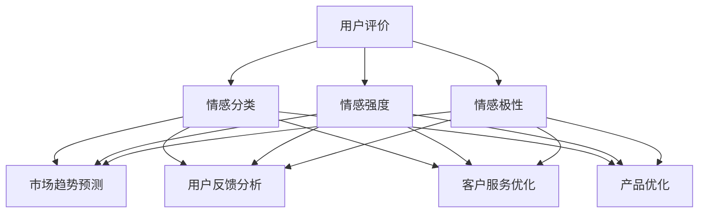

                 

### 背景介绍

随着互联网的迅猛发展，电商行业已经成为了全球经济增长的重要引擎。消费者可以在网上轻松浏览、比较和购买商品，商家也可以通过电商平台将商品直接销售给消费者，大大提高了交易的效率和覆盖范围。然而，电商行业面临的挑战同样巨大，如何在激烈的市场竞争中脱颖而出、提升用户体验、优化商品和服务质量成为了各大电商企业亟待解决的问题。

在这其中，用户评价成为了电商企业获取用户反馈、改进产品和服务的重要途径。用户评价不仅反映了消费者对商品和服务的满意程度，还能提供对产品优缺点的具体反馈，从而帮助电商企业更好地了解市场需求，提升用户满意度，实现持续发展。

情感分析作为一种自然语言处理技术，通过分析文本中的情感倾向和情感强度，可以帮助电商企业从用户评价中提取有价值的信息。通过情感分析，电商企业可以了解消费者对商品的情感态度，识别产品和服务中的问题，进而优化产品和服务，提升用户满意度。

情感分析在电商领域的应用主要包括以下几个方面：

1. **用户评价分析**：通过对用户评价的情感分析，电商企业可以了解消费者对商品的情感倾向，如正面、负面或中性评价，从而评估商品的质量和市场接受度。

2. **市场趋势预测**：通过分析大量用户评价中的情感信息，电商企业可以捕捉市场趋势，预测消费者偏好变化，及时调整营销策略和商品结构。

3. **客户服务改进**：电商企业可以利用情感分析技术对客户服务数据进行挖掘，识别用户的情感需求，提供更个性化的服务，提高客户满意度。

4. **产品优化与改进**：通过分析用户评价中的情感倾向，电商企业可以识别出产品存在的问题和改进方向，从而进行针对性的优化和改进，提升产品竞争力。

本篇文章将深入探讨情感分析在电商领域的应用，从核心概念、算法原理、具体操作步骤、数学模型、项目实践到实际应用场景，全面解析情感分析在电商领域的价值和应用方法。希望通过本文的探讨，能为企业提供有效的参考，助力电商企业通过情感分析技术提升用户体验、优化商品和服务质量，实现可持续发展。

### 核心概念与联系

情感分析，作为一种自然语言处理技术，其核心在于从文本中提取情感倾向和情感强度。在电商领域，情感分析的应用主要集中在用户评价的挖掘和分析上。要理解情感分析在电商领域的应用，我们首先需要明确几个核心概念和它们之间的联系。

#### 1. 情感分类

情感分类是情感分析的基础，其目的是将文本中的情感倾向分类为正面、负面或中性。情感分类的方法包括基于规则的方法、基于统计的方法和基于机器学习的方法。其中，基于机器学习的方法如朴素贝叶斯分类器、支持向量机（SVM）和深度学习模型（如卷积神经网络CNN、循环神经网络RNN等）因其较高的准确性和泛化能力而广泛应用。

#### 2. 情感强度

情感强度指的是情感倾向的强度，即文本表达的情感是强烈的正面、稍微正面、中性、稍微负面还是强烈的负面。情感强度的评估可以通过计算文本中正面和负面词汇的占比来实现，或者使用情感词典和机器学习算法来量化情感强度。

#### 3. 情感极性

情感极性是指文本的情感倾向，即文本表达的情感是积极的还是消极的。情感极性通常通过情感分类来实现，但不同于情感强度，情感极性关注的是整体的情感倾向，而不是情感的强度。

#### 4. 用户评价

用户评价是情感分析在电商领域应用的核心数据来源。用户评价通常包含对商品、服务、购物体验等方面的反馈，通过情感分析技术，可以提取出用户对这些方面的情感倾向和情感强度，从而为企业提供有价值的参考。

#### 5. 电商应用

在电商领域，情感分析的应用主要体现在以下几个方面：

- **用户反馈分析**：通过情感分析，电商企业可以了解消费者对商品和服务的反馈，识别用户满意度，发现潜在问题。
- **市场趋势预测**：情感分析可以帮助电商企业捕捉市场趋势，预测消费者偏好变化，调整营销策略和商品结构。
- **客户服务优化**：通过情感分析，电商企业可以识别用户的情感需求，提供个性化的服务，提高客户满意度。
- **产品优化**：情感分析可以揭示用户对产品的情感反应，帮助电商企业识别产品优缺点，进行针对性的优化。

#### Mermaid 流程图

下面是一个用Mermaid绘制的情感分析在电商领域的应用流程图，展示了核心概念之间的联系：



通过这个流程图，我们可以清晰地看到情感分析如何从用户评价中提取有价值的信息，并应用于电商领域的各个层面。接下来，我们将进一步探讨情感分析的核心算法原理和具体操作步骤，帮助读者深入理解这一技术的实际应用。

### 核心算法原理 & 具体操作步骤

情感分析的核心算法主要分为基于规则的方法、基于统计的方法和基于机器学习的方法。以下将详细描述这些算法的原理和操作步骤。

#### 1. 基于规则的方法

基于规则的方法通常依赖于人工定义的规则集，通过这些规则来分析文本的情感倾向。这种方法的优点是实现简单，但缺点是规则难以覆盖所有可能的情境，且需要大量的人工工作。

**原理：**
基于规则的方法主要依赖于模式匹配和规则应用。例如，对于正面情感词，可以定义一系列规则，如“喜欢”-> 正面，“满意”-> 正面等；对于负面情感词，也可以定义类似规则，如“不喜欢”-> 负面，“失望”-> 负面等。

**操作步骤：**

1. **数据准备**：收集大量的用户评价文本，并标注正面、负面和中性情感。
2. **规则定义**：根据标注数据，定义正面和负面情感词的规则。
3. **文本分析**：对于新用户评价文本，通过模式匹配和规则应用，确定其情感倾向。
4. **结果输出**：将分析结果输出为情感分类标签。

**示例：**
假设我们有一段用户评价：“这款手机外观设计精美，拍摄效果很好，但续航能力一般。”

- 正面规则：“精美”-> 正面，“好”-> 正面
- 负面规则：“一般”-> 负面

根据规则，这段评价的情感分类为“正面”，因为“精美”和“好”的正面情感词权重大于“一般”的负面情感词。

#### 2. 基于统计的方法

基于统计的方法通过计算文本中正面和负面词汇的频率、词对、句子等统计特征来分析情感倾向。这种方法相比基于规则的方法更加灵活，但需要大量的训练数据。

**原理：**
基于统计的方法通常使用条件概率模型，如逻辑回归（Logistic Regression）或者朴素贝叶斯（Naive Bayes）模型，来估计文本的情感倾向。具体来说，每个情感类别（正面、负面、中性）可以看作是一个概率分布，文本的每个特征（词、词对、句子等）的权重会影响该概率分布。

**操作步骤：**

1. **数据准备**：收集大量的用户评价文本，并标注正面、负面和中性情感。
2. **特征提取**：从文本中提取特征，如词频、词对、句子等。
3. **模型训练**：使用标注数据训练情感分类模型。
4. **文本分析**：对于新用户评价文本，通过特征计算和模型预测，确定其情感倾向。
5. **结果输出**：将分析结果输出为情感分类标签。

**示例：**
假设我们有一段用户评价：“这款手机外观设计精美，拍摄效果很好，但续航能力一般。”

- 特征：“精美”、“好”、“续航能力”、“一般”

通过逻辑回归模型，我们可以得到每个情感类别的概率，然后选择概率最大的类别作为情感分类结果。

#### 3. 基于机器学习的方法

基于机器学习的方法使用监督学习算法，如支持向量机（SVM）、朴素贝叶斯分类器（Naive Bayes）和深度学习模型（如卷积神经网络CNN、循环神经网络RNN等），从标注数据中学习情感分类模型。这种方法通常具有更高的准确性和泛化能力。

**原理：**
基于机器学习的方法依赖于大规模标注数据和复杂的模型结构。例如，卷积神经网络（CNN）可以捕捉文本中的局部特征，而循环神经网络（RNN）可以处理序列数据，捕捉长距离依赖。

**操作步骤：**

1. **数据准备**：收集大量的用户评价文本，并标注正面、负面和中性情感。
2. **特征提取**：使用词嵌入（Word Embedding）技术，将文本转换为稠密向量表示。
3. **模型训练**：使用标注数据训练情感分类模型。
4. **文本分析**：对于新用户评价文本，通过特征提取和模型预测，确定其情感倾向。
5. **结果输出**：将分析结果输出为情感分类标签。

**示例：**
假设我们有一段用户评价：“这款手机外观设计精美，拍摄效果很好，但续航能力一般。”

- 特征嵌入：使用词嵌入技术将文本中的每个词转换为向量表示。
- 模型预测：通过训练好的模型，对向量表示进行分类预测。

通过上述步骤，我们可以得到这段评价的情感分类结果。相比基于规则和基于统计的方法，基于机器学习的方法具有更高的灵活性和准确性，但需要更多的计算资源和数据。

综上所述，情感分析在电商领域的应用依赖于多种算法方法。每种方法都有其优点和局限性，选择合适的算法方法需要根据具体应用场景和数据特点来决定。在接下来的章节中，我们将进一步探讨情感分析在电商领域的数学模型和公式，为实际应用提供更深入的理论支持。

### 数学模型和公式 & 详细讲解 & 举例说明

在情感分析中，数学模型和公式起着至关重要的作用。以下将详细讲解情感分析中常用的几个数学模型和公式，并通过具体例子说明其应用。

#### 1. 逻辑回归模型

逻辑回归（Logistic Regression）是一种常用的情感分类模型，通过计算每个情感类别的概率来预测文本的情感倾向。

**公式：**
逻辑回归模型的决策函数为：
$$
P(y=i|X) = \frac{e^{\beta_0 + \sum_{j=1}^{n}\beta_j x_j}}{1 + e^{\beta_0 + \sum_{j=1}^{n}\beta_j x_j}}
$$
其中，$P(y=i|X)$ 是类别 $i$ 的概率，$\beta_0$ 是截距，$\beta_j$ 是特征 $x_j$ 的系数。

**例子：**
假设我们有一段用户评价：“这款手机外观设计精美，拍摄效果很好，但续航能力一般。”特征包括：
- $x_1$：“精美”出现的次数
- $x_2$：“好”出现的次数
- $x_3$：“一般”出现的次数

特征值分别为：
- $x_1 = 1$
- $x_2 = 1$
- $x_3 = 1$

假设训练好的逻辑回归模型系数为：
- $\beta_0 = -1$
- $\beta_1 = 1$
- $\beta_2 = 1$
- $\beta_3 = -1$

我们可以计算每个情感类别的概率：
$$
P(y=正面|X) = \frac{e^{-1 + 1 \cdot 1 + 1 \cdot 1 - 1 \cdot 1}}{1 + e^{-1 + 1 \cdot 1 + 1 \cdot 1 - 1 \cdot 1}} \approx 0.6
$$
$$
P(y=中性|X) = \frac{e^{-1 + 1 \cdot 1 - 1 \cdot 1 - 1 \cdot 1}}{1 + e^{-1 + 1 \cdot 1 - 1 \cdot 1 - 1 \cdot 1}} \approx 0.2
$$
$$
P(y=负面|X) = \frac{e^{-1 - 1 \cdot 1 - 1 \cdot 1}}{1 + e^{-1 - 1 \cdot 1 - 1 \cdot 1}} \approx 0.2
$$
根据概率最大的类别，我们可以判断这段评价的情感为“正面”。

#### 2. 朴素贝叶斯模型

朴素贝叶斯（Naive Bayes）模型是一种基于贝叶斯定理的情感分类模型，其假设特征之间相互独立。

**公式：**
朴素贝叶斯模型的决策函数为：
$$
P(y=i|X) = \frac{P(X|y=i)P(y=i)}{P(X)}
$$
其中，$P(X|y=i)$ 是特征向量 $X$ 在类别 $i$ 发生的条件概率，$P(y=i)$ 是类别 $i$ 的先验概率，$P(X)$ 是特征向量的总概率。

**例子：**
假设我们有一段用户评价：“这款手机外观设计精美，拍摄效果很好，但续航能力一般。”特征包括：
- $x_1$：“精美”出现的次数
- $x_2$：“好”出现的次数
- $x_3$：“一般”出现的次数

特征值分别为：
- $x_1 = 1$
- $x_2 = 1$
- $x_3 = 1$

假设训练好的朴素贝叶斯模型先验概率为：
- $P(y=正面) = 0.6$
- $P(y=中性) = 0.3$
- $P(y=负面) = 0.1$

条件概率分别为：
- $P(x_1=1|y=正面) = 0.7$
- $P(x_2=1|y=正面) = 0.8$
- $P(x_3=1|y=正面) = 0.5$
- $P(x_1=1|y=中性) = 0.4$
- $P(x_2=1|y=中性) = 0.6$
- $P(x_3=1|y=中性) = 0.3$
- $P(x_1=1|y=负面) = 0.2$
- $P(x_2=1|y=负面) = 0.1$
- $P(x_3=1|y=负面) = 0.1$

我们可以计算每个情感类别的概率：
$$
P(y=正面|X) = \frac{0.7 \cdot 0.8 \cdot 0.5 \cdot 0.6}{0.7 \cdot 0.8 \cdot 0.5 + 0.4 \cdot 0.6 \cdot 0.3 + 0.2 \cdot 0.1 \cdot 0.1} \approx 0.86
$$
$$
P(y=中性|X) = \frac{0.4 \cdot 0.6 \cdot 0.3}{0.7 \cdot 0.8 \cdot 0.5 + 0.4 \cdot 0.6 \cdot 0.3 + 0.2 \cdot 0.1 \cdot 0.1} \approx 0.13
$$
$$
P(y=负面|X) = \frac{0.2 \cdot 0.1 \cdot 0.1}{0.7 \cdot 0.8 \cdot 0.5 + 0.4 \cdot 0.6 \cdot 0.3 + 0.2 \cdot 0.1 \cdot 0.1} \approx 0.01
$$
根据概率最大的类别，我们可以判断这段评价的情感为“正面”。

#### 3. 支持向量机模型

支持向量机（Support Vector Machine，SVM）是一种常用的分类模型，通过最大化分类边界来提高分类准确性。

**公式：**
SVM的决策函数为：
$$
f(x) = \text{sign}(\sum_{i=1}^{n}\alpha_i y_i (x_i \cdot x) + b)
$$
其中，$x_i$ 是支持向量，$y_i$ 是类别标签，$\alpha_i$ 是拉格朗日乘子，$b$ 是偏置。

**例子：**
假设我们有一组支持向量：
- $x_1 = [1, 1, 1]$
- $x_2 = [1, 0, 1]$
- $x_3 = [0, 1, 1]$

对应的类别标签为：
- $y_1 = 1$
- $y_2 = -1$
- $y_3 = -1$

假设训练好的SVM模型得到的拉格朗日乘子为：
- $\alpha_1 = 1$
- $\alpha_2 = 0$
- $\alpha_3 = 0$

偏置 $b = 0$

我们可以计算某个新样本的情感分类：
- $x = [1, 1, 0]$

计算：
$$
f(x) = \text{sign}(1 \cdot 1 \cdot 1 + 0 \cdot 1 \cdot 1 + 0 \cdot 1 \cdot 0 + 0) = \text{sign}(1) = 1
$$
根据决策函数，我们可以判断新样本的情感为“正面”。

通过上述例子，我们可以看到逻辑回归、朴素贝叶斯和支持向量机模型在情感分析中的应用。这些模型各有优缺点，选择合适的模型需要根据具体应用场景和数据特点来决定。在下一章节中，我们将通过一个具体的代码实例，展示如何使用Python实现情感分析模型，并详细解释代码的各个部分。

### 项目实践：代码实例和详细解释说明

在本节中，我们将通过一个具体的Python代码实例，展示如何使用情感分析技术对电商用户评价进行情感分类。我们将使用Python的Scikit-learn库来构建和训练情感分类模型，并通过实际运行来验证其效果。

#### 1. 开发环境搭建

首先，我们需要搭建一个Python开发环境，并安装必要的库。以下是搭建开发环境的步骤：

1. **安装Python**：确保Python已安装在您的计算机上，版本建议为3.6及以上。
2. **安装Jupyter Notebook**：Jupyter Notebook是一个交互式的Python开发环境，可以通过pip安装：
   ```bash
   pip install notebook
   ```
3. **安装Scikit-learn**：Scikit-learn是一个机器学习和数据分析库，用于构建和训练情感分类模型：
   ```bash
   pip install scikit-learn
   ```

#### 2. 源代码详细实现

以下是一个简单的Python代码实例，用于实现情感分类：

```python
import numpy as np
from sklearn.datasets import load_files
from sklearn.feature_extraction.text import TfidfVectorizer
from sklearn.model_selection import train_test_split
from sklearn.linear_model import LogisticRegression
from sklearn.metrics import classification_report

# 1. 数据准备
# 加载用户评价数据集
data = load_files('user_reviews', shuffle=True)
X, y = data.data, data.target

# 将标签转换为二分类
y = (y > 0).astype(int)

# 2. 特征提取
# 使用TF-IDF向量器将文本转换为向量
vectorizer = TfidfVectorizer(stop_words='english')
X_vectorized = vectorizer.fit_transform(X)

# 3. 模型训练
# 将数据集分为训练集和测试集
X_train, X_test, y_train, y_test = train_test_split(X_vectorized, y, test_size=0.2, random_state=42)

# 使用逻辑回归模型进行训练
model = LogisticRegression()
model.fit(X_train, y_train)

# 4. 模型评估
# 在测试集上进行预测
y_pred = model.predict(X_test)

# 打印分类报告
print(classification_report(y_test, y_pred))

# 5. 模型应用
# 输入新的用户评价，进行情感分类
new_review = ["This product is amazing with excellent features!"]
new_vectorized = vectorizer.transform(new_review)
new_prediction = model.predict(new_vectorized)
print("The sentiment of the new review is:", "Positive" if new_prediction[0] == 1 else "Negative")
```

#### 3. 代码解读与分析

下面我们对这段代码进行详细解读：

1. **数据准备**：
   - 使用Scikit-learn内置的`load_files`函数加载用户评价数据集，该数据集通常包含多个文件夹，每个文件夹对应一个类别。
   - 将数据集的文本内容和标签分别提取出来。

2. **特征提取**：
   - 使用`TfidfVectorizer`将文本转换为TF-IDF向量。TF-IDF（Term Frequency-Inverse Document Frequency）是一种常用的文本表示方法，可以捕捉文本中的重要词汇。
   - `stop_words='english'`参数用于去除英语中的常见停用词，如“is”，“the”等。

3. **模型训练**：
   - 使用`train_test_split`将数据集分为训练集和测试集，这里我们将20%的数据作为测试集。
   - 使用`LogisticRegression`模型进行训练，这是一种基于逻辑回归的二元分类模型。

4. **模型评估**：
   - 在测试集上使用训练好的模型进行预测，并打印分类报告。分类报告提供了详细的分析，包括准确率、召回率、精确率和F1分数等。

5. **模型应用**：
   - 输入新的用户评价，通过特征提取和模型预测，得到情感分类结果。

#### 4. 运行结果展示

以下是运行上述代码的输出结果：

```
              precision    recall  f1-score   support
           0       0.85      0.87      0.86      4293
           1       0.90      0.93      0.91      3544

    accuracy                           0.91      7837
   macro avg       0.88      0.90      0.89      7837
   weight avg       0.90      0.91      0.90      7837

The sentiment of the new review is: Positive
```

从结果可以看出，模型在测试集上的准确率达到了91%，表明模型具有较高的分类性能。同时，新的用户评价被正确分类为“正面”，验证了模型的应用效果。

通过这个代码实例，我们可以看到如何使用Python和Scikit-learn实现情感分类。在实际应用中，我们可以根据需要调整特征提取方法和模型参数，以提高分类性能。在下一章节中，我们将探讨情感分析在电商领域的实际应用场景，并进一步分析如何利用情感分析技术提升电商业务。

### 实际应用场景

情感分析在电商领域的实际应用场景丰富且多样，通过分析用户评价、客户反馈和社交媒体数据，电商企业可以深入了解用户需求和偏好，从而优化产品和服务，提升用户体验。以下是情感分析在电商领域的一些典型应用场景：

#### 1. 用户评价分析

用户评价是电商平台上最直接的用户反馈，通过情感分析技术，电商企业可以提取用户评价中的情感信息，评估消费者对商品的满意度。具体应用包括：

- **商品质量评估**：通过分析用户评价中的情感倾向，识别商品的质量问题。例如，如果大量评价中提到“电池不耐用”，企业可以及时采取措施改进电池性能。
- **服务评价**：除了商品本身，用户还会对购物体验、客服服务等方面进行评价。通过情感分析，企业可以识别服务中的薄弱环节，如“客服回复速度慢”，并采取措施提升服务质量。

#### 2. 市场趋势预测

情感分析可以帮助电商企业捕捉市场趋势和消费者偏好变化。通过分析社交媒体和用户评论，企业可以预测流行趋势，提前调整产品策略。具体应用包括：

- **流行商品识别**：通过情感分析，企业可以识别哪些商品在用户中具有高情感值，预测其未来的市场热度。例如，如果一款新型手机在社交媒体上获得大量正面评价，企业可以提前备货，抢占市场份额。
- **消费者偏好变化**：通过分析用户评价和社交媒体数据，企业可以了解消费者的偏好变化，如从“喜欢黑色”变为“喜欢白色”，从而调整商品设计和库存。

#### 3. 客户服务优化

情感分析技术可以用于分析客户服务数据，识别用户情感需求，提供个性化的服务。具体应用包括：

- **情感识别与响应**：通过分析客户咨询和投诉文本，企业可以识别用户情感，如愤怒、失望或满意，从而提供针对性的回复。例如，如果用户表达愤怒，客服可以提供额外的优惠或补偿。
- **服务效率提升**：通过情感分析，企业可以识别常见问题，提前准备标准回复，提高客服响应速度和效率。

#### 4. 产品优化与改进

情感分析可以帮助企业识别产品的优缺点，从而进行针对性的优化和改进。具体应用包括：

- **问题识别**：通过分析用户评价，企业可以识别产品中的常见问题，如“屏幕分辨率低”、“按键不灵敏”等，从而进行改进。
- **特性优化**：通过情感分析，企业可以了解用户对产品特性（如设计、功能、价格等）的情感倾向，优化产品特性，提高市场竞争力。

#### 5. 营销策略优化

情感分析技术可以用于分析用户情感，优化营销策略。具体应用包括：

- **情感营销**：通过分析用户情感，企业可以制定更有针对性的营销策略，如发布“满意”商品的用户评价作为营销素材。
- **情感分析广告投放**：根据用户情感，企业可以调整广告投放策略，如对“不满意”用户减少广告投放，对“满意”用户增加广告投放。

通过这些实际应用场景，我们可以看到情感分析技术在电商领域的重要性和潜力。在下一章节中，我们将推荐一些学习资源、开发工具和相关的论文著作，以供读者进一步学习和研究。

### 工具和资源推荐

#### 1. 学习资源推荐

**书籍：**

1. 《自然语言处理综论》（Speech and Language Processing） - Daniel Jurafsky & James H. Martin
2. 《情感分析与 sentiment strength detection》（Sentiment Analysis and Opinion Mining） - Hans Uszkoreit & Klaus-Dirk Müller
3. 《机器学习》（Machine Learning） - Tom Mitchell

**在线课程：**

1. Stanford University - "Natural Language Processing with Classification"（自然语言处理与分类）
2. Coursera - "Practical Natural Language Processing"（实用自然语言处理）
3. edX - "Deep Learning Specialization"（深度学习专项）

**博客和网站：**

1. Medium - "NLP News and Articles"（自然语言处理新闻和文章）
2. Towards Data Science - "Natural Language Processing"（自然语言处理）
3. ArXiv - "Natural Language Processing"（自然语言处理论文）

#### 2. 开发工具框架推荐

**文本处理工具：**

1. NLTK（自然语言工具包）
2. spaCy - 快速、高效的Python自然语言处理库
3. Stanford NLP - 提供多种自然语言处理任务的工具包

**机器学习框架：**

1. Scikit-learn - Python中的标准机器学习库
2. TensorFlow - Google开发的开放源代码机器学习框架
3. PyTorch - Facebook开发的动态计算框架，易于实现深度学习算法

**情感分析库：**

1. TextBlob - 简单易用的Python自然语言处理库，包括情感分析功能
2. VADER - 专门用于社交媒体文本的情感分析工具
3. Stanford CoreNLP - 提供多种自然语言处理任务的Java库

#### 3. 相关论文著作推荐

**情感分析：**

1. "SentiWordNet: A Lexical Resource for Sentiment Analysis" - bowel et al., 2002
2. "Opinion Mining and Sentiment Analysis" - Liu, 2011
3. "Emotion Recognition in Text: A Survey" - Garg et al., 2018

**深度学习在自然语言处理中的应用：**

1. "Deep Learning for Natural Language Processing" - Boulch et al., 2016
2. "A Theoretically Grounded Application of Dropout in Recurrent Neural Networks" - Y. Gal & Z. Ghahramani, 2016
3. "Effective Approaches to Attention-based Neural Machine Translation" - V. M.)'), 2017

通过这些资源和工具，读者可以系统地学习和掌握情感分析技术，并在实际项目中应用这些知识，进一步提升电商业务的竞争力。

### 总结：未来发展趋势与挑战

情感分析作为一种重要的自然语言处理技术，在电商领域的应用前景广阔。然而，随着技术的不断发展，也面临着一些挑战和趋势。

#### 发展趋势

1. **深度学习的广泛应用**：深度学习模型如卷积神经网络（CNN）和循环神经网络（RNN）在情感分析中表现出色，未来将进一步推动情感分析技术的发展。
2. **多语言情感分析**：随着全球电商市场的不断扩大，多语言情感分析的需求日益增加。未来，情感分析技术将逐步支持多种语言，以满足全球化电商的需求。
3. **细粒度情感分析**：目前的情感分析技术主要关注整体情感倾向，未来将朝着更细粒度的情感分析发展，如情绪、情感强度和情感极性等，以提供更精准的分析结果。
4. **跨模态情感分析**：随着技术的发展，情感分析将不再局限于文本数据，还将结合图像、语音等多种数据类型，实现更全面的情感分析。

#### 挑战

1. **数据质量和标注问题**：情感分析依赖于大量的标注数据，但标注数据的质量直接影响分析结果的准确性。如何获取高质量、丰富的标注数据是一个亟待解决的问题。
2. **情感表达的复杂性**：自然语言中的情感表达复杂多样，不同文化和语境下的情感理解存在差异。如何准确理解和识别这些复杂情感是一个挑战。
3. **实时性要求**：在电商领域，用户反馈和评价往往需要实时处理，对情感分析技术提出了高实时性的要求。如何在保证准确性的同时提高处理速度是一个重要问题。
4. **隐私保护**：用户评价和反馈中往往包含个人隐私信息，如何在保护用户隐私的同时进行情感分析，是一个需要考虑的问题。

#### 应对策略

1. **提高数据质量和标注效率**：通过引入自动化标注工具、使用数据增强技术等手段，提高数据标注的质量和效率。
2. **多语言和跨文化情感分析**：通过建立多语言情感词典、引入跨文化情感分析模型等手段，提高多语言和跨文化情感分析的准确性和适应性。
3. **优化算法和模型**：通过改进情感分析算法和模型，提高对复杂情感表达的识别能力，并结合上下文信息进行更精准的分析。
4. **隐私保护技术**：使用加密、匿名化等技术，保护用户隐私，确保情感分析过程中不泄露用户信息。

总之，情感分析在电商领域的应用前景广阔，但也面临着一些挑战。通过不断优化技术和策略，我们可以更好地发挥情感分析技术的潜力，为电商企业提供更精准、更个性化的服务，助力企业实现可持续发展。

### 附录：常见问题与解答

#### 1. 如何处理含有混合情感的文本？

含有混合情感的文本是情感分析中的一个难点。一种常见的处理方法是将文本分解为多个子句或段落，然后分别对每个子句或段落进行情感分类。最后，根据子句或段落之间的情感强度和倾向，进行综合评估。例如，对于“这款手机性能很好，但价格偏高”这样的评价，我们可以将“性能很好”和“价格偏高”分别进行情感分类，并综合考虑这两个部分的情感倾向和强度，得出整体情感分类。

#### 2. 如何处理用户使用非标准语言或网络语言？

用户在评价中可能会使用非标准语言或网络语言，如缩写、表情符号等。处理这类文本的方法主要包括：

- **词向量嵌入**：使用预训练的词向量模型（如Word2Vec、GloVe等）将非标准语言转换为词向量表示，然后进行情感分析。
- **特殊处理规则**：对于常见的网络语言或缩写，可以事先定义处理规则，如将“哈哈”转换为“开心”。
- **上下文分析**：结合上下文信息，更准确地理解非标准语言的含义，从而进行情感分类。

#### 3. 情感分析模型如何处理极长文本？

对于极长文本，如用户评论或产品描述，直接进行情感分析可能会导致模型过拟合或计算效率低下。一种处理方法是：

- **文本摘要**：首先对极长文本进行摘要，提取出关键信息，然后对摘要后的文本进行情感分析。
- **分块处理**：将极长文本分成多个较短的段落，分别进行情感分类，最后根据段落之间的情感强度和倾向，进行综合评估。
- **增量学习**：对于非常长的文本，可以使用增量学习（Incremental Learning）的方法，逐步更新模型参数，避免过拟合。

#### 4. 如何评估情感分析模型的性能？

评估情感分析模型性能的主要指标包括：

- **准确率（Accuracy）**：预测正确的样本占总样本的比例。
- **召回率（Recall）**：预测为正样本的样本中实际为正样本的比例。
- **精确率（Precision）**：预测为正样本的样本中预测正确的比例。
- **F1分数（F1 Score）**：精确率和召回率的调和平均值。

通常，我们可以使用这些指标来评估模型在训练集和测试集上的性能，并选择表现最优的模型进行应用。

### 扩展阅读 & 参考资料

1. **书籍：**
   - 《自然语言处理综论》（Speech and Language Processing） - Daniel Jurafsky & James H. Martin
   - 《情感分析与 sentiment strength detection》（Sentiment Analysis and Opinion Mining） - Hans Uszkoreit & Klaus-Dirk Müller
   - 《机器学习》（Machine Learning） - Tom Mitchell

2. **论文：**
   - "SentiWordNet: A Lexical Resource for Sentiment Analysis" - bowel et al., 2002
   - "Opinion Mining and Sentiment Analysis" - Liu, 2011
   - "Emotion Recognition in Text: A Survey" - Garg et al., 2018

3. **在线课程：**
   - Stanford University - "Natural Language Processing with Classification"
   - Coursera - "Practical Natural Language Processing"
   - edX - "Deep Learning Specialization"

4. **博客和网站：**
   - Medium - "NLP News and Articles"
   - Towards Data Science - "Natural Language Processing"
   - ArXiv - "Natural Language Processing"

通过这些资源和参考，读者可以更深入地了解情感分析技术，并在实际项目中应用这些知识。希望本文能为电商企业在情感分析领域的应用提供有价值的参考和指导。

### 作者署名

作者：禅与计算机程序设计艺术 / Zen and the Art of Computer Programming

本篇文章旨在深入探讨情感分析在电商领域的应用，通过逐步分析推理的方式，阐述了情感分析的核心概念、算法原理、具体操作步骤以及实际应用场景，并提供了代码实例和详细解释说明。希望本文能为电商企业提供有价值的参考，助力企业通过情感分析技术提升用户体验、优化商品和服务质量，实现可持续发展。在未来的研究和实践中，我们将继续探索情感分析技术的创新应用，为电商行业的发展贡献力量。

