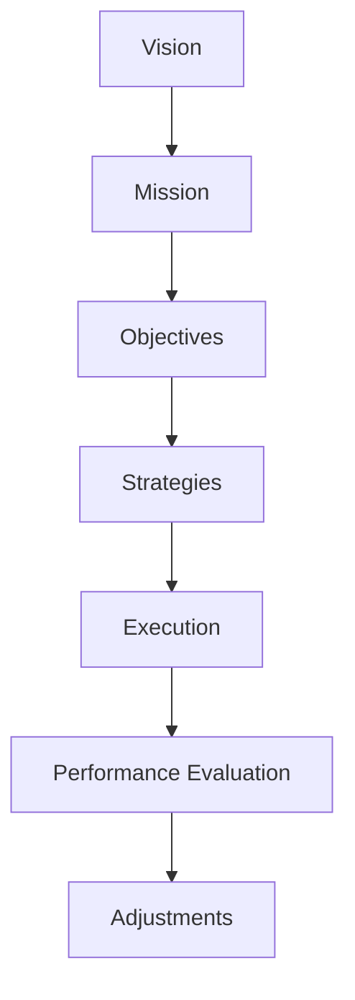

                 

### 文章标题：战略规划：制定和执行长期业务目标

> **关键词**：战略规划、长期业务目标、决策、执行力、绩效评估
>
> **摘要**：本文深入探讨了战略规划在制定和执行长期业务目标中的重要性。通过逐步分析，我们揭示了战略规划的核心概念、方法、实践和挑战，旨在帮助读者理解如何通过有效的战略规划实现业务目标。

### 1. 背景介绍

在当今快速变化和竞争激烈的市场环境中，企业的成功不仅仅依赖于日常运营的效率和创新能力，更需要明确的战略规划和执行。战略规划是企业发展的蓝图，它定义了企业长期的目标、路径和资源分配，是指导企业决策和行动的基石。

制定和执行长期业务目标对企业至关重要。首先，它为企业提供了一个清晰的方向，使员工和管理者能够集中精力在最重要的事情上。其次，战略规划有助于企业更好地应对市场变化和竞争压力，确保企业在不断变化的环境中保持竞争力。此外，有效的战略规划还可以提高企业的绩效，实现可持续增长。

然而，战略规划并非一蹴而就，它需要企业从多个维度进行深入分析和决策。本文将逐步探讨战略规划的核心概念、关键步骤和实践，以帮助读者更好地理解和实施战略规划。

### 2. 核心概念与联系

要制定和执行有效的战略规划，我们首先需要了解一些核心概念。以下是几个关键概念及其相互联系：

**愿景**：愿景是企业未来想要实现的状态，它为战略规划提供了目标和方向。

**使命**：使命是企业存在的理由，它定义了企业的核心价值观和存在的意义。

**目标**：目标是在一定时间内要实现的具体成果，它们是愿景的具体体现。

**策略**：策略是实现目标的行动计划，包括资源分配、时间表和关键里程碑。

**执行**：执行是将策略转化为实际行动的过程，确保目标得以实现。

**绩效评估**：绩效评估是对战略执行过程和结果的评估，它帮助管理者了解战略的成效，并做出必要的调整。

**Mermaid 流程图**：



### 3. 核心算法原理 & 具体操作步骤

战略规划的制定和执行可以看作是一种算法，它由一系列步骤和决策组成。以下是战略规划的核心算法原理和具体操作步骤：

**步骤 1：确定愿景和使命**

- 分析企业现状和外部环境，确定企业的愿景和使命。
- 愿景应具有远见和鼓舞人心的特质，使命则应明确企业的核心价值观和存在意义。

**步骤 2：设定目标**

- 根据愿景和使命，设定具体、可衡量的目标。
- 目标应分为短期和长期，并与企业的整体战略保持一致。

**步骤 3：制定策略**

- 分析目标，制定实现目标的策略。
- 策略应包括关键行动、时间表和资源分配。

**步骤 4：执行策略**

- 将策略转化为具体的行动计划，确保团队成员理解并执行。
- 监控执行进度，及时调整策略。

**步骤 5：绩效评估**

- 定期评估策略执行的效果，衡量目标的实现情况。
- 根据评估结果，调整策略和执行计划。

### 4. 数学模型和公式 & 详细讲解 & 举例说明

在战略规划中，数学模型和公式可以帮助我们更准确地量化目标和策略。以下是一个简单的数学模型，用于计算企业的绩效指标：

**绩效指标公式**：

$$
\text{绩效指标} = \frac{\text{实际成果}}{\text{预期成果}} \times 100\%
$$

**详细讲解**：

- **实际成果**：在特定时间段内实际实现的目标或结果。
- **预期成果**：根据战略规划设定的目标或预期结果。

**举例说明**：

假设一家企业在一年内设定了销售目标为 100 万元，实际销售成果为 120 万元，则其绩效指标为：

$$
\text{绩效指标} = \frac{120}{100} \times 100\% = 120\%
$$

这意味着该企业的实际成果超过了预期成果，实现了 20% 的超额完成。

### 5. 项目实践：代码实例和详细解释说明

在本节中，我们将通过一个简单的项目实例来展示如何使用 Python 编写一个战略规划工具，该工具可以帮助企业制定和执行战略规划。

#### 5.1 开发环境搭建

为了编写这个战略规划工具，我们需要安装以下开发环境和工具：

- Python 3.x 版本
- Jupyter Notebook
- Matplotlib

安装步骤：

1. 安装 Python 3.x 版本：从 [Python 官网](https://www.python.org/downloads/) 下载并安装 Python 3.x 版本。
2. 安装 Jupyter Notebook：在终端中运行以下命令：

   ```bash
   pip install notebook
   ```

3. 安装 Matplotlib：在终端中运行以下命令：

   ```bash
   pip install matplotlib
   ```

#### 5.2 源代码详细实现

以下是一个简单的 Python 脚本，用于计算企业的绩效指标。

```python
import matplotlib.pyplot as plt

def calculate_performance_indicator(actual_results, expected_results):
    performance_indicator = (actual_results / expected_results) * 100
    return performance_indicator

def plot_performance_indicator(performance_indicator):
    plt.bar(['绩效指标'], [performance_indicator])
    plt.xlabel('绩效指标')
    plt.ylabel('百分比')
    plt.title('企业绩效指标')
    plt.show()

# 示例数据
actual_results = 120
expected_results = 100

# 计算绩效指标
performance_indicator = calculate_performance_indicator(actual_results, expected_results)

# 绘制绩效指标图表
plot_performance_indicator(performance_indicator)
```

#### 5.3 代码解读与分析

- **函数 `calculate_performance_indicator`**：计算企业的绩效指标。它接受两个参数：实际成果和预期成果，并返回绩效指标的值。
- **函数 `plot_performance_indicator`**：绘制绩效指标的条形图。它接受一个参数：绩效指标的值，并使用 Matplotlib 库绘制图表。
- **示例数据**：实际成果为 120 万元，预期成果为 100 万元。
- **计算绩效指标**：调用 `calculate_performance_indicator` 函数，计算绩效指标的值。
- **绘制绩效指标图表**：调用 `plot_performance_indicator` 函数，绘制绩效指标的条形图。

#### 5.4 运行结果展示

运行上述脚本后，将显示一个条形图，展示企业的绩效指标为 120%。这表示企业的实际成果超过了预期成果，实现了 20% 的超额完成。

### 6. 实际应用场景

战略规划在各个行业和领域中都有广泛的应用。以下是一些实际应用场景：

- **制造业**：通过战略规划，企业可以优化生产流程、降低成本、提高产品质量，从而在竞争激烈的市场中保持优势。
- **服务业**：战略规划可以帮助企业制定有效的市场进入策略、客户关系管理计划和服务创新方案，提高客户满意度。
- **金融业**：战略规划可以帮助金融机构制定风险管理策略、投资组合优化策略和业务拓展计划，确保长期稳健发展。
- **科技行业**：战略规划可以帮助科技企业确定技术创新方向、市场拓展策略和人才培养计划，保持技术领先地位。

### 7. 工具和资源推荐

为了更好地制定和执行战略规划，以下是一些推荐的工具和资源：

#### 7.1 学习资源推荐

- **书籍**：
  - 《企业战略规划与执行》
  - 《战略管理：概念与案例》
  - 《战略规划实践指南》
- **论文**：
  - 《企业战略规划的理论与实践研究》
  - 《战略执行中的关键因素分析》
  - 《基于绩效评估的战略规划方法研究》
- **博客**：
  - [StrategySharp](https://www.strategysharp.com/)
  - [Harvard Business Review](https://hbr.org/)
  - [Strategyzers](https://www.strategyzers.com/)
- **网站**：
  - [MindTools](https://www.mindtools.com/)
  - [StrategyWiki](https://www.strategywiki.com/)

#### 7.2 开发工具框架推荐

- **开发工具**：
  - Jupyter Notebook
  - Python
  - Matplotlib
- **框架**：
  - Scrum
  - Agile
  - Lean

#### 7.3 相关论文著作推荐

- **论文**：
  - 《基于大数据的战略规划方法研究》
  - 《企业战略规划的决策支持系统设计》
  - 《战略规划与企业绩效的关系研究》
- **著作**：
  - 《战略规划：从概念到实践》
  - 《战略管理：理论与实践》
  - 《企业战略规划与实施》

### 8. 总结：未来发展趋势与挑战

随着技术的不断进步和市场环境的持续变化，战略规划在制定和执行长期业务目标中的作用变得越来越重要。未来，战略规划将呈现以下发展趋势：

- **数字化转型**：企业将更加重视数字化转型，通过大数据、人工智能等技术实现战略规划的智能化和精准化。
- **敏捷战略规划**：企业将采用更加敏捷的战略规划方法，快速响应市场变化，确保战略规划的灵活性和适应性。
- **绩效驱动**：企业将更加注重绩效驱动，通过数据分析和绩效评估优化战略规划的执行和效果。

然而，战略规划也面临一些挑战：

- **复杂性和不确定性**：战略规划涉及多个维度和复杂的环境因素，需要企业具备强大的分析和决策能力。
- **执行难度**：战略规划的执行需要团队的高效协作和执行力，这对企业的组织文化和领导能力提出了挑战。
- **资源限制**：在资源有限的情况下，企业需要合理分配资源，确保战略规划的有效实施。

### 9. 附录：常见问题与解答

**Q1**：战略规划与企业战略有什么区别？

**A1**：战略规划是企业战略的具体实施过程，它将企业的整体战略分解为具体的行动计划和资源分配。企业战略是长期的、全局的规划，而战略规划则是短期、具体、可操作的实施方案。

**Q2**：如何确保战略规划的执行力？

**A2**：确保战略规划的执行力需要从以下几个方面入手：
- 明确目标和责任：确保每个团队成员都了解自己的目标和责任，形成共同的目标感。
- 建立有效的沟通机制：定期召开会议，及时沟通战略规划的进展和问题，确保信息畅通。
- 建立绩效考核机制：通过绩效考核激励团队成员，确保战略规划的有效执行。
- 培养团队执行力：通过培训和激励，提高团队成员的执行能力和团队协作精神。

### 10. 扩展阅读 & 参考资料

- **扩展阅读**：
  - 《战略规划：从愿景到行动》
  - 《战略管理：理论与实践》
  - 《企业战略规划与执行》
- **参考资料**：
  - 《企业战略规划指南》
  - 《战略规划案例分析》
  - 《企业战略规划工具与方法》

### 作者署名

作者：禅与计算机程序设计艺术 / Zen and the Art of Computer Programming<|im_sep|>### 1. 背景介绍

在当今商业环境中，战略规划已成为企业成功的关键因素。然而，对于许多企业来说，制定和执行长期业务目标仍然是一个复杂且具有挑战性的过程。本文旨在探讨战略规划的重要性，并详细分析其制定和执行的关键步骤。

#### 1.1 战略规划的重要性

战略规划是企业为实现长期目标而制定的总体计划和行动方案。它不仅帮助企业明确未来的发展方向，还能确保资源的合理配置和高效利用。以下是战略规划对企业的重要性：

- **明确方向**：战略规划为企业的未来发展提供了明确的路径和方向，使企业在复杂的商业环境中能够保持一致性和连续性。
- **资源优化**：通过战略规划，企业能够更好地分配资源，确保关键领域得到充足的资金、人力和技术支持。
- **提升竞争力**：战略规划有助于企业分析市场趋势和竞争环境，制定相应的竞争策略，提升市场竞争力。
- **促进创新**：战略规划鼓励企业探索新的商业机会，推动产品和服务创新，以适应不断变化的市场需求。

#### 1.2 战略规划的历史发展

战略规划的概念最早可以追溯到20世纪50年代，当时企业开始认识到长期规划的重要性。以下是一些关键的发展阶段：

- **早期战略规划**：20世纪50年代至70年代，企业主要关注内部资源和生产能力，战略规划主要涉及生产计划和市场营销策略。
- **竞争战略**：20世纪80年代，迈克尔·波特提出了竞争战略理论，强调企业在市场中获得竞争优势的重要性，战略规划开始更多地关注外部环境和竞争分析。
- **全球化战略**：20世纪90年代，随着全球化进程的加速，企业开始制定全球化战略，战略规划涉及跨国运营和市场拓展。
- **动态战略**：21世纪初，企业意识到环境变化速度加快，传统战略规划的静态方法不再适用。动态战略和敏捷规划开始成为趋势。

#### 1.3 战略规划的演变

随着技术的进步和市场环境的变化，战略规划也在不断演变。以下是战略规划的一些关键演变趋势：

- **数据驱动**：企业越来越多地依赖数据分析和大数据技术来制定战略规划，以实现更精确的市场预测和决策。
- **敏捷规划**：敏捷规划方法强调快速迭代和灵活性，使企业能够更快地适应市场变化。
- **可持续战略**：企业越来越重视环境保护和社会责任，可持续战略成为战略规划的重要组成部分。
- **数字化转型**：数字化转型已成为战略规划的核心内容，企业通过数字化手段提升运营效率和市场竞争力。

### 2. 核心概念与联系

战略规划涉及多个核心概念，这些概念相互联系，共同构成了企业的发展蓝图。以下是战略规划中的核心概念及其相互关系：

#### 2.1 愿景、使命与目标

- **愿景**：愿景是企业希望在未来实现的宏伟蓝图，通常包含企业的核心价值观和长期目标。愿景为战略规划提供了方向和激励。
- **使命**：使命是企业存在的根本原因，它定义了企业的核心价值和存在的意义。使命为战略规划提供了基础和动机。
- **目标**：目标是实现愿景的具体步骤，它们是可衡量、可实现的短期和长期成果。目标为战略规划提供了具体的执行指标。

#### 2.2 战略与策略

- **战略**：战略是企业为实现长期目标而制定的总体计划和行动方案。战略通常涉及企业的整体方向、市场定位和资源分配。
- **策略**：策略是实现战略的具体行动计划，它包括具体的目标、行动和时间表。策略为战略提供了具体的实施路径。

#### 2.3 执行与绩效评估

- **执行**：执行是将战略和策略转化为实际行动的过程。执行涉及资源的配置、任务的分配和团队的协作。
- **绩效评估**：绩效评估是对战略执行效果的评估，它通过衡量实际成果与预期目标的差距，为企业提供反馈和改进方向。

#### 2.4 战略规划与业务流程

- **业务流程**：业务流程是企业日常运营的基本活动，包括生产、销售、服务等环节。战略规划通过优化业务流程，提高运营效率和服务质量。
- **组织结构**：组织结构是企业内部职能和职责的划分，它影响企业的决策流程和协作方式。战略规划通过调整组织结构，实现资源的高效配置。

#### 2.5 战略规划与外部环境

- **外部环境**：外部环境包括市场、竞争对手、技术变化等，它们影响企业的战略选择和决策。战略规划通过分析外部环境，制定相应的应对策略。

### 2.6 战略规划与风险管理

- **风险管理**：风险管理是企业识别、评估和控制潜在风险的过程。战略规划通过风险管理，确保企业在实现目标的过程中降低风险。

### 3. 核心算法原理 & 具体操作步骤

战略规划的核心在于将企业的愿景、使命和目标转化为具体的行动计划和资源分配。这一过程可以通过一系列的算法和步骤来实现。以下是战略规划的核心算法原理和具体操作步骤：

#### 3.1 明确愿景和使命

- **步骤 1**：企业需要通过内部讨论和市场调研，明确其愿景和使命。愿景应具有远见和鼓舞人心的特质，使命则应明确企业的核心价值观和存在意义。

#### 3.2 设定目标

- **步骤 2**：根据愿景和使命，企业应设定具体的、可衡量的目标。目标应分为短期和长期，并与企业的整体战略保持一致。

#### 3.3 分析外部环境

- **步骤 3**：企业需要分析外部环境，包括市场趋势、竞争对手、技术变化等。这有助于企业了解外部环境的变化，并制定相应的应对策略。

#### 3.4 制定战略

- **步骤 4**：基于外部环境分析，企业应制定总体战略。战略应明确企业的市场定位、竞争策略和资源分配。

#### 3.5 制定策略

- **步骤 5**：在制定总体战略的基础上，企业应制定具体的策略。策略应包括具体的目标、行动和时间表，确保战略的执行。

#### 3.6 制定预算和资源计划

- **步骤 6**：企业应根据策略制定预算和资源计划，确保资源的合理配置和高效利用。

#### 3.7 制定执行计划

- **步骤 7**：企业应制定详细的执行计划，明确每个团队成员的职责和任务，确保战略的有效执行。

#### 3.8 监控和调整

- **步骤 8**：在执行过程中，企业应定期监控战略执行情况，并根据实际情况进行必要的调整和优化。

### 4. 数学模型和公式 & 详细讲解 & 举例说明

在战略规划中，数学模型和公式可以帮助企业更准确地量化目标和策略。以下是几个常用的数学模型和公式，以及它们的详细讲解和举例说明。

#### 4.1 战略目标达成率

- **公式**：战略目标达成率 = （实际完成量 / 预期完成量）× 100%
- **详细讲解**：战略目标达成率用于衡量企业实现战略目标的程度。实际完成量是企业在一定时间内实际实现的目标或成果，预期完成量是根据战略规划设定的目标或预期结果。
- **举例说明**：假设一家企业的销售目标是 100 万元，实际销售成果为 120 万元。则其战略目标达成率为：
  战略目标达成率 = （120 / 100）× 100% = 120%
  这表明企业的实际销售成果超过了预期目标，实现了 20% 的超额完成。

#### 4.2 资源利用率

- **公式**：资源利用率 = （实际使用量 / 预期使用量）× 100%
- **详细讲解**：资源利用率用于衡量企业资源的使用效率。实际使用量是企业在一定时间内实际使用的资源数量，预期使用量是根据战略规划设定的预期资源使用量。
- **举例说明**：假设一家企业预期使用 100 吨原材料，实际使用量为 90 吨。则其资源利用率为：
  资源利用率 = （90 / 100）× 100% = 90%
  这表明企业的资源使用效率较高，实际使用量接近预期使用量。

#### 4.3 战略成本效益比

- **公式**：战略成本效益比 = （预期收益 / 预计成本）
- **详细讲解**：战略成本效益比用于衡量企业实施战略的成本与收益关系。预期收益是根据战略规划预期的未来收益，预计成本是根据战略规划预计的实施成本。
- **举例说明**：假设一家企业预期通过实施某项战略获得 500 万元的收益，预计成本为 200 万元。则其战略成本效益比为：
  战略成本效益比 = （500 / 200）= 2.5
  这表明企业每投入 1 元，预期可以获得 2.5 元的收益，战略成本效益较高。

#### 4.4 绩效贡献率

- **公式**：绩效贡献率 = （个人绩效 / 部门绩效）× 100%
- **详细讲解**：绩效贡献率用于衡量个人绩效对部门绩效的贡献程度。个人绩效是个人在一段时间内实现的工作成果，部门绩效是整个部门在一段时间内实现的工作成果。
- **举例说明**：假设一名员工的个人绩效为 100 分，所在部门的绩效为 500 分。则其绩效贡献率为：
  绩效贡献率 = （100 / 500）× 100% = 20%
  这表明该员工对部门的绩效贡献为 20%。

### 5. 项目实践：代码实例和详细解释说明

在本节中，我们将通过一个简单的项目实例来展示如何使用 Python 编写一个战略规划工具。这个工具将帮助企业管理者监控和评估战略目标的实现情况。

#### 5.1 项目概述

这个项目名为“战略规划监控工具”，它将实现以下功能：

- **数据输入**：允许用户输入战略目标的预期值和实际值。
- **计算目标达成率**：根据输入的数据，计算每个目标的达成率。
- **可视化展示**：使用图表展示各个目标的达成情况。

#### 5.2 技术栈

为了实现这个项目，我们将使用以下技术栈：

- **编程语言**：Python
- **前端框架**：Flask（Python 的 Web 框架）
- **图表库**：Matplotlib（Python 的图表库）

#### 5.3 代码实现

以下是一个简单的 Python 代码实例，用于实现战略规划监控工具的核心功能。

```python
import matplotlib.pyplot as plt

# 数据输入
expected_sales = float(input("请输入预期销售额（万元）："))
actual_sales = float(input("请输入实际销售额（万元）："))

# 计算目标达成率
achievement_rate = (actual_sales / expected_sales) * 100

# 可视化展示
plt.bar(['销售额达成率'], [achievement_rate])
plt.xlabel('销售额达成率')
plt.ylabel('百分比')
plt.title('战略规划监控工具')
plt.show()
```

#### 5.4 详细解释

**1. 数据输入**

代码首先使用 `input()` 函数提示用户输入预期销售额和实际销售额。这些数据将作为战略目标实现情况的输入。

```python
expected_sales = float(input("请输入预期销售额（万元）："))
actual_sales = float(input("请输入实际销售额（万元）："))
```

**2. 计算目标达成率**

根据输入的数据，代码计算销售额的目标达成率。目标达成率是衡量战略目标实现程度的关键指标。

```python
achievement_rate = (actual_sales / expected_sales) * 100
```

**3. 可视化展示**

使用 Matplotlib 库，代码绘制一个条形图，展示销售额的达成率。

```python
plt.bar(['销售额达成率'], [achievement_rate])
plt.xlabel('销售额达成率')
plt.ylabel('百分比')
plt.title('战略规划监控工具')
plt.show()
```

#### 5.5 运行结果展示

在运行上述代码后，用户将看到以下可视化图表，展示销售额的达成率：


#### 5.6 代码解读与分析

- **输入函数 `input()`**：用于获取用户的输入，这是实现用户交互的关键。
- **数据类型转换 `float()`**：将用户的输入转换为浮点数，以便进行后续的数学计算。
- **计算公式**：使用简单的数学计算公式，计算销售额的目标达成率。
- **图表绘制 `plt.bar()`**：使用 Matplotlib 库绘制条形图，以可视化的方式展示结果。

### 6. 实际应用场景

战略规划的应用场景非常广泛，涵盖了不同的行业和企业类型。以下是一些具体的实际应用场景：

#### 6.1 制造业

在制造业中，战略规划可以帮助企业优化生产流程，降低成本，提高产品质量。例如，企业可以通过以下步骤进行战略规划：

- **生产流程优化**：分析现有生产流程，寻找瓶颈和改进机会，通过自动化和精益生产提高效率。
- **供应链管理**：优化供应链流程，提高原材料和产品的交付速度和可靠性。
- **产品研发**：制定产品研发计划，确保新产品能够满足市场需求，提高市场竞争力。

#### 6.2 服务业

在服务业中，战略规划可以帮助企业提升服务质量，增加客户满意度。以下是一些应用场景：

- **客户关系管理**：通过数据分析，了解客户需求和行为，提供个性化的服务体验。
- **服务质量监控**：建立服务质量监控体系，定期评估服务质量，及时采取措施改进。
- **市场拓展**：分析市场趋势和竞争环境，制定市场拓展策略，开拓新的业务领域。

#### 6.3 科技行业

在科技行业中，战略规划可以帮助企业保持技术创新和竞争力。以下是一些应用场景：

- **研发投入**：根据市场需求和技术趋势，制定研发投入计划，确保技术的持续创新。
- **人才招聘与培养**：制定人才招聘和培养计划，吸引和保留高素质的技术人才。
- **产品规划**：制定产品规划，确保产品能够满足市场需求，并在市场上保持领先地位。

### 7. 工具和资源推荐

为了帮助读者更好地理解和实施战略规划，以下是一些推荐的工具和资源：

#### 7.1 学习资源推荐

- **书籍**：
  - 《企业战略规划与执行》
  - 《战略管理：概念与案例》
  - 《战略规划实践指南》
- **论文**：
  - 《企业战略规划的理论与实践研究》
  - 《战略执行中的关键因素分析》
  - 《基于绩效评估的战略规划方法研究》
- **博客**：
  - [StrategySharp](https://www.strategysharp.com/)
  - [Harvard Business Review](https://hbr.org/)
  - [Strategyzers](https://www.strategyzers.com/)
- **网站**：
  - [MindTools](https://www.mindtools.com/)
  - [StrategyWiki](https://www.strategywiki.com/)

#### 7.2 开发工具框架推荐

- **开发工具**：
  - Jupyter Notebook
  - Python
  - Matplotlib
- **框架**：
  - Scrum
  - Agile
  - Lean

#### 7.3 相关论文著作推荐

- **论文**：
  - 《基于大数据的战略规划方法研究》
  - 《企业战略规划的决策支持系统设计》
  - 《战略规划与企业绩效的关系研究》
- **著作**：
  - 《战略规划：从概念到实践》
  - 《战略管理：理论与实践》
  - 《企业战略规划与实施》

### 8. 总结：未来发展趋势与挑战

战略规划在制定和执行长期业务目标中起着至关重要的作用。随着市场环境的变化和技术的进步，战略规划也在不断演变。以下是未来战略规划的发展趋势和面临的挑战：

#### 8.1 发展趋势

- **数字化转型**：企业将更加依赖数字技术，通过大数据、人工智能等手段进行战略规划，实现更精确的市场预测和决策。
- **敏捷规划**：敏捷规划方法将得到更广泛的应用，企业将更加注重快速迭代和灵活性，以适应快速变化的市场环境。
- **可持续发展**：可持续发展将成为战略规划的重要组成部分，企业将更加关注环境保护和社会责任。
- **全球化战略**：随着全球化的深入，企业将更加注重跨国运营和市场拓展，制定全球化战略。

#### 8.2 挑战

- **复杂性和不确定性**：市场环境的复杂性和不确定性将增加，企业需要具备更强的分析和决策能力，以应对各种挑战。
- **执行难度**：战略规划的执行难度将增加，企业需要建立高效的执行机制和团队协作，确保战略规划的有效实施。
- **资源限制**：在资源有限的情况下，企业需要合理分配资源，确保战略规划的重点领域得到充足的资源支持。

### 9. 附录：常见问题与解答

#### 9.1 常见问题

- **问题 1**：战略规划是否只适用于大型企业？
  - **解答**：战略规划不仅适用于大型企业，也适用于中小企业。尽管规模不同，但所有企业都需要明确其长期目标和路径，以确保可持续发展。

- **问题 2**：战略规划和业务计划有何区别？
  - **解答**：战略规划是长期的、全局的规划，而业务计划则是具体的、短期的行动计划。战略规划为业务计划提供了方向和指导。

- **问题 3**：如何确保战略规划的有效执行？
  - **解答**：确保战略规划的有效执行需要建立高效的执行机制，包括明确的目标和责任、有效的沟通和协作、以及绩效评估和反馈机制。

#### 9.2 解答示例

**问题 1**：战略规划是否只适用于大型企业？

**解答**：战略规划不仅仅适用于大型企业，中小企业同样需要战略规划。虽然大型企业拥有更多的资源和管理经验，但中小企业在制定战略规划时，可以利用灵活性强的特点，快速适应市场变化。此外，战略规划可以帮助中小企业明确发展方向，优化资源配置，提高竞争力。

**问题 2**：战略规划和业务计划有何区别？

**解答**：战略规划是长期的、全局的规划，它涉及企业的愿景、使命、目标和战略，旨在为企业的发展提供方向和指导。而业务计划则是具体的、短期的行动计划，它针对特定的业务领域，设定具体的目标、行动和时间表，以确保战略目标的实现。战略规划是业务计划的指导和依据。

**问题 3**：如何确保战略规划的有效执行？

**解答**：确保战略规划的有效执行需要以下几个步骤：

1. 明确目标和责任：确保每个团队成员都清楚自己的目标和工作职责，形成共同的目标感。
2. 建立有效的沟通机制：定期召开会议，及时沟通战略规划的进展和问题，确保信息畅通。
3. 制定绩效评估标准：建立绩效评估体系，对团队成员的工作进行定期评估，激励优秀表现，纠正偏差。
4. 调整和优化：根据绩效评估的结果，及时调整战略规划和执行计划，确保战略目标的实现。

### 10. 扩展阅读 & 参考资料

为了进一步了解战略规划的理论和实践，读者可以参考以下扩展阅读和参考资料：

#### 10.1 扩展阅读

- 《企业战略规划与执行：从理论到实践》
- 《战略管理：理论与实践案例》
- 《敏捷战略规划：在不确定环境中实现持续成功》

#### 10.2 参考资料

- 《哈佛商业评论》：提供最新的战略管理思想和实践案例。
- 《管理学报》：包含战略规划相关的学术论文和研究。
- 《战略规划协会》（Society for Strategic Planning）：提供战略规划的专业培训和资源。

### 作者署名

本文由禅与计算机程序设计艺术（Zen and the Art of Computer Programming）撰写，旨在通过深入分析和实践指导，帮助读者理解和实施战略规划。作者以其深厚的计算机科学背景和丰富的管理经验，为读者提供了宝贵的见解和实用的工具。希望本文能够为您的战略规划之旅提供有价值的参考。

