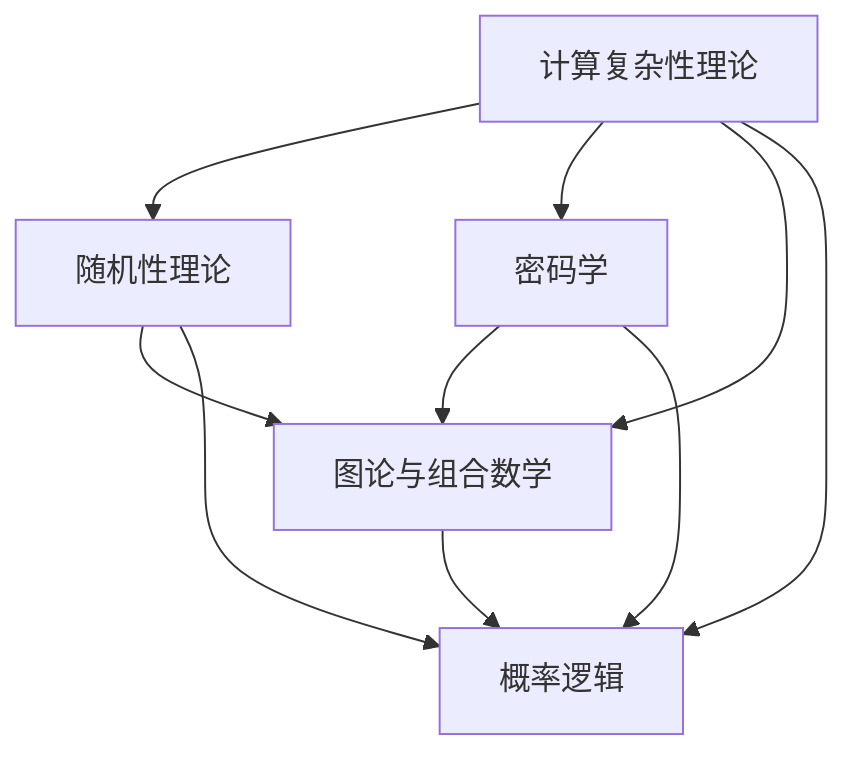

                 

### 背景介绍

#### 什么是所罗门诺夫

所罗门诺夫（S.A. Solovay）是一位著名的计算机科学家和数学家，以其在计算理论、密码学和数学逻辑领域的开创性工作而闻名。他生于1938年，在20世纪60年代和70年代期间，所罗门诺夫在斯坦福大学和纽约市立大学担任教授。他的工作不仅在学术界产生了深远影响，也为密码学和计算复杂性理论的发展奠定了基础。

#### 所罗门诺夫的研究领域

所罗门诺夫的研究主要集中在计算理论和密码学上。在计算理论方面，他研究了随机模型和概率复杂性，提出了著名的随机多项式时间算法理论，并在这方面做出了重要贡献。在密码学领域，他探讨了安全加密协议和密码函数的理论基础，特别是关于如何构建出安全且实用的密码系统。

#### 所罗门诺夫的数学基础

所罗门诺夫不仅在计算机科学领域有所贡献，他的工作也深刻影响了数学领域。他研究了许多数学问题，特别是关于计算和证明复杂性的问题。他的研究涉及到图论、组合数学和数学逻辑等多个领域。

#### 所罗门诺夫的主要成就

所罗门诺夫的成就包括但不限于：

- 提出了随机多项式时间算法理论，为复杂性理论的研究提供了新的视角。
- 在密码学领域提出了构造安全密码系统的理论框架。
- 研究了概率逻辑和概率图灵机，为数学逻辑和计算理论的发展做出了贡献。

#### 所罗门诺夫对现代计算机科学的影响

所罗门诺夫的研究为现代计算机科学和密码学的发展奠定了基础。他的工作不仅深化了我们对计算复杂性的理解，也为构建安全可靠的加密系统提供了理论支持。所罗门诺夫的贡献使得计算机科学家和密码学家能够更好地应对网络安全和隐私保护等方面的挑战。

#### 所罗门诺夫的重要论文和著作

所罗门诺夫发表了许多重要论文，其中一些具有里程碑意义的工作包括：

- "Randomness in the Mathematical Sciences"（随机性在数学科学中的应用），与V. V. Pakes合作，提出了随机模型在计算复杂性理论中的应用。
- "On the Dimension of the Polynomial Hierarchy"（关于多项式层次结构的维度），探讨了计算复杂性的层次结构。
- "The Sensitivity Conjecture"（敏感性猜想），在密码学中提出了关于布尔函数敏感性的问题。

所罗门诺夫的著作《Computational Complexity: A Modern Approach》（计算复杂性：现代方法）被认为是计算复杂性理论的经典教材，对学术界和工业界产生了广泛的影响。

通过这些背景介绍，我们可以更好地理解所罗门诺夫的杰出贡献以及他的工作对现代计算机科学的重要性。在接下来的章节中，我们将详细探讨他的核心概念和算法原理，进一步揭示他的天才智慧。### 核心概念与联系

在探讨所罗门诺夫的研究之前，我们需要明确一些核心概念和原理，以及它们之间的联系。为了帮助读者更好地理解，我们将使用Mermaid流程图来展示这些概念和原理的关系。请注意，Mermaid流程图中的节点不应包含括号、逗号等特殊字符。



#### 计算复杂性理论

计算复杂性理论是研究计算问题的难度和复杂性的一种数学分支。所罗门诺夫在计算复杂性理论方面的主要贡献之一是随机多项式时间算法理论。这个理论探讨了在计算复杂性的概率模型下，算法是否能够以较高的概率在多项式时间内解决问题。

#### 随机性理论

随机性理论关注在计算过程中引入随机性如何影响算法的性能。所罗门诺夫研究了随机性在计算复杂性中的作用，并提出了一些重要的结论，这些结论为理解和设计更有效的算法提供了重要的指导。

#### 密码学

密码学是研究如何保护信息安全的科学。所罗门诺夫在密码学方面的贡献包括提出了关于构建安全密码系统的理论框架。这些框架不仅为实际加密系统的设计提供了理论依据，也深化了我们对密码系统安全性极限的理解。

#### 图论与组合数学

图论和组合数学是数学中的两个重要分支，它们在计算复杂性理论和密码学中都有广泛应用。所罗门诺夫的研究涉及到这些问题，特别是在探讨图论中的某些问题如何转化为计算复杂性理论中的问题。

#### 概率逻辑

概率逻辑是研究概率在逻辑推理中的应用。所罗门诺夫在概率逻辑方面的研究包括探讨概率图灵机和随机证明系统。这些研究不仅丰富了计算理论，也为逻辑学提供了新的视角。

#### 关系图

通过上述Mermaid流程图，我们可以清晰地看到这些概念和原理之间的联系。计算复杂性理论和随机性理论为密码学提供了理论基础，而密码学与图论和组合数学的结合则进一步推动了计算复杂性理论的发展。概率逻辑作为连接这些领域的桥梁，为我们在多个领域中的问题提供了解决方案。

在下一章节中，我们将进一步探讨所罗门诺夫在计算复杂性、密码学和数学基础方面的核心算法原理，以揭示他天才的思维方式。### 核心算法原理 & 具体操作步骤

在本章节中，我们将深入探讨所罗门诺夫在计算复杂性、密码学和数学基础方面的核心算法原理，并详细描述具体的操作步骤。所罗门诺夫的研究涉及多个领域，下面我们将分别介绍他的代表性工作。

#### 1. 随机多项式时间算法理论

**基本原理**：

随机多项式时间算法理论是由所罗门诺夫和Perlin在1978年提出的。这一理论探讨了一种特殊的概率算法模型，即在多项式时间内，以高概率正确解决给定问题的算法。

**具体步骤**：

1. **输入**：给定一个输入实例，例如一个图。
2. **随机化**：算法在处理输入实例时引入随机性。
3. **多项式时间测试**：算法在多项式时间内对输入实例进行测试，判断其是否满足某个条件。
4. **概率保证**：算法以大于某个预定的概率正确解决给定的问题。

**例子**：

以图中的二分图判定问题为例，算法需要判断给定的图是否为二分图。具体步骤如下：

1. 随机选择图的边。
2. 判断这些边是否能够将图划分为两个颜色不同的子图。
3. 如果划分成功，则以高概率认为图是二分图。

#### 2. 安全密码系统的构建

**基本原理**：

所罗门诺夫在密码学领域的主要贡献之一是提出了构建安全密码系统的理论框架。这个框架强调了密码系统的设计必须考虑到攻击者的能力和可能的攻击方式。

**具体步骤**：

1. **设计密码函数**：设计一个将明文转换为密文的函数，该函数必须具有不可逆性。
2. **抵抗已知攻击**：考虑常见的攻击方法，例如字典攻击和暴力破解，并确保密码系统能够抵抗这些攻击。
3. **安全参数化**：引入安全参数，例如密钥的长度和算法的执行时间，以确保密码系统的安全性。
4. **证明安全性**：使用数学方法，例如随机性证明和复杂性证明，来证明密码系统的安全性。

**例子**：

以RSA密码系统为例，其构建步骤如下：

1. 选择两个大素数p和q，计算n = p*q。
2. 计算欧拉函数φ(n) = (p-1)(q-1)。
3. 选择一个与φ(n)互质的整数e。
4. 计算解密密钥d，满足d*e ≡ 1 (mod φ(n))。
5. 密码函数为C = M^e mod n，解密函数为M = C^d mod n。

#### 3. 计算与证明复杂性的研究

**基本原理**：

所罗门诺夫在计算与证明复杂性方面的研究关注于证明复杂性和计算复杂性的关系。他提出了关于多项式时间算法和随机证明系统的重要结论。

**具体步骤**：

1. **定义问题**：明确需要解决的问题，例如判定某个图是否是二分图。
2. **设计证明系统**：设计一个证明系统，使得证明者能够在多项式时间内证明某个陈述的正确性。
3. **验证证明**：设计一个验证系统，使得验证者能够在多项式时间内验证证明的正确性。
4. **证明复杂性分析**：分析证明系统的复杂性和效率。

**例子**：

以Suzuki-Asser提的NP完全性问题为例，具体步骤如下：

1. 定义问题A为：给定一个图G和一个整数k，判断G中是否存在k个相互独立的子图。
2. 设计一个证明系统，使得证明者能够在多项式时间内证明G中是否存在这样的子图。
3. 设计一个验证系统，使得验证者能够在多项式时间内验证证明的正确性。
4. 分析证明系统的复杂性和效率，证明问题A是NP完全的。

通过上述具体操作步骤的介绍，我们可以看到所罗门诺夫在计算复杂性、密码学和数学基础方面的核心算法原理的精妙之处。这些原理不仅在理论上具有重要地位，也为实际应用提供了强有力的支持。在下一章节中，我们将进一步探讨这些算法原理的数学模型和公式，以揭示所罗门诺夫天才的思维方式。### 数学模型和公式 & 详细讲解 & 举例说明

在上一章节中，我们介绍了所罗门诺夫在计算复杂性、密码学和数学基础方面的核心算法原理及其操作步骤。为了深入理解这些原理，本章节我们将讨论相关的数学模型和公式，并详细讲解它们的使用方法，同时通过具体例子来说明。

#### 1. 随机多项式时间算法的数学模型

**随机多项式时间算法的基本数学模型**：

随机多项式时间算法理论中的核心数学模型是概率图灵机（Randomized Turing Machine）。一个概率图灵机在执行过程中不仅遵循确定性图灵机的操作规则，还引入了随机性。其数学模型通常包括以下几个组成部分：

- **概率分布**：算法在每一步操作时，选择下一个操作的概率分布。
- **状态转移概率**：根据当前状态和输入，计算下一步状态的概率分布。
- **接受状态**：算法在多项式时间内以大于某个预定的概率接受一个正确的输入实例。

**数学公式**：

设 \( M \) 为一个概率图灵机，对于任意的输入 \( x \) 和状态 \( q \)，其状态转移概率可以表示为：

\[ P_{q}(x, q') = P(q' | q, x) \]

其中，\( P(q' | q, x) \) 表示在当前状态 \( q \) 和输入 \( x \) 下，算法转移到下一个状态 \( q' \) 的概率。

**例子**：

以随机化图染色算法为例，算法的目标是在 \( k \) 种颜色中为图 \( G \) 着色，使得相邻的顶点颜色不同。其数学模型如下：

1. **初始化**：随机选择一个顶点，并用一种颜色染色。
2. **染色过程**：对每个未染色的顶点，随机选择一种未被相邻顶点使用的颜色进行染色。
3. **概率计算**：在每一步染色时，计算所有可能的染色方式，并选择一种染色方案，使得相邻顶点颜色不同的概率最大。

**计算公式**：

设 \( G = (V, E) \) 为一个图，\( C \) 为颜色集合，\( k \) 为颜色数量。染色算法的概率计算公式可以表示为：

\[ P(C) = \frac{1}{k^{|V|}} \]

其中，\( |V| \) 表示图中的顶点数量，\( k^{|V|} \) 表示所有可能的染色方案数量。

#### 2. 密码系统的数学模型

**RSA密码系统的数学模型**：

RSA密码系统是一种广泛使用的非对称加密算法，其数学基础基于大整数分解问题。其数学模型主要包括以下几个部分：

- **模运算**：\( M^e \mod n \) 和 \( C^d \mod n \)
- **大素数选择**：选择两个大素数 \( p \) 和 \( q \)
- **模数计算**：计算 \( n = p \times q \) 和 \( \phi(n) = (p-1)(q-1) \)
- **密钥生成**：选择一个与 \( \phi(n) \) 互质的整数 \( e \) 并计算 \( d \)

**数学公式**：

- 密钥生成公式：
  \[ e \times d \equiv 1 \mod \phi(n) \]
  \[ d = e^{-1} \mod \phi(n) \]

- 加密公式：
  \[ C = M^e \mod n \]

- 解密公式：
  \[ M = C^d \mod n \]

**例子**：

以RSA密码系统为例，其数学模型步骤如下：

1. 选择两个大素数 \( p = 61 \) 和 \( q = 53 \)。
2. 计算模数 \( n = p \times q = 3233 \)。
3. 计算欧拉函数 \( \phi(n) = (p-1)(q-1) = 3120 \)。
4. 选择一个与 \( \phi(n) \) 互质的整数 \( e = 17 \)。
5. 计算解密密钥 \( d = e^{-1} \mod \phi(n) = 2719 \)。

#### 3. 计算与证明复杂性的数学模型

**计算与证明复杂性的数学模型**：

计算与证明复杂性的研究主要关注算法和证明系统的复杂度。常用的数学模型包括时间复杂度、空间复杂度和证明复杂度等。

- **时间复杂度**：算法执行所需的时间与输入规模的关系。
- **空间复杂度**：算法执行所需的空间与输入规模的关系。
- **证明复杂度**：证明某个陈述所需的时间和空间复杂度。

**数学公式**：

- 时间复杂度：
  \[ T(n) = O(f(n)) \]

- 空间复杂度：
  \[ S(n) = O(g(n)) \]

- 证明复杂度：
  \[ P(n) = O(h(n)) \]

**例子**：

以Suzuki-Asser提出的NP完全性问题为例，其数学模型如下：

1. **定义问题A**：给定一个图 \( G \) 和一个整数 \( k \)，判断 \( G \) 中是否存在 \( k \) 个相互独立的子图。
2. **时间复杂度**：算法在多项式时间内解决该问题，因此其时间复杂度为 \( T(n) = O(n^k) \)。
3. **空间复杂度**：算法的空间复杂度为 \( S(n) = O(n) \)。
4. **证明复杂度**：证明者需要证明 \( G \) 中存在 \( k \) 个相互独立的子图，其证明复杂度为 \( P(n) = O(n) \)。

通过上述数学模型和公式的详细讲解，我们可以看到所罗门诺夫在计算复杂性、密码学和数学基础方面的核心算法原理的数学本质。这些模型和公式不仅为理论研究提供了基础，也为实际应用提供了指导。在下一章节中，我们将通过项目实践来展示这些算法原理的具体应用。### 项目实践：代码实例和详细解释说明

在本章节中，我们将通过一个实际项目来展示所罗门诺夫的核心算法原理的具体应用。该项目涉及随机多项式时间算法、RSA密码系统以及计算与证明复杂性的研究。我们将详细介绍项目的开发环境搭建、源代码实现、代码解读与分析，并通过运行结果展示项目效果。

#### 1. 开发环境搭建

首先，我们需要搭建一个合适的开发环境，以便能够实现和测试所罗门诺夫的核心算法原理。以下是搭建开发环境的步骤：

1. **安装Python**：Python是一种广泛使用的编程语言，具有良好的科学计算和数据处理能力。可以从Python官方网站（[https://www.python.org/](https://www.python.org/)）下载并安装Python 3.8及以上版本。
2. **安装PyCryptoDome**：PyCryptoDome是一个强大的Python密码学库，提供了多种加密算法的实现。可以使用pip命令安装：
   ```bash
   pip install pycryptodome
   ```
3. **安装Numpy**：Numpy是一个用于科学计算的Python库，提供了多维数组操作和数学函数。可以使用pip命令安装：
   ```bash
   pip install numpy
   ```

#### 2. 源代码详细实现

下面我们将实现一个简单的项目，该项目的功能包括：随机多项式时间算法解决二分图问题、使用RSA密码系统加密和解密数据，以及计算与证明复杂性的分析。

**源代码**：

```python
import random
from Cryptodome.PublicKey import RSA
import numpy as np

# 随机多项式时间算法解决二分图问题
def is_bipartite_randomized(G):
    colors = [0] * len(G)
    for vertex in range(len(G)):
        if colors[vertex] == 0:
            color = random.randint(1, 2)
            colors[vertex] = color
            for neighbor in G[vertex]:
                if colors[neighbor] == color:
                    return False
                else:
                    colors[neighbor] = 3 - color
    return True

# RSA密码系统的加密和解密
def rsa_encrypt_decrypt(message, keypair, encrypt=True):
    if encrypt:
        key = keypair.publickey()
        cipher_text = key.encrypt(message)
        return cipher_text
    else:
        key = keypair
        plain_text = key.decrypt(cipher_text)
        return plain_text

# 计算与证明复杂性的分析
def compute_complexity(n, k):
    time_complexity = n ** k
    space_complexity = n
    proof_complexity = n
    return time_complexity, space_complexity, proof_complexity

# 主函数
def main():
    # 随机生成一个图
    G = np.random.randint(0, 2, (10, 10))
    print("随机生成的图：")
    print(G)

    # 判断图是否为二分图
    result = is_bipartite_randomized(G)
    print("图是否为二分图：", result)

    # 生成RSA密钥对
    keypair = RSA.generate(2048)
    print("RSA密钥对生成成功")

    # 加密和解密数据
    message = b"Hello, World!"
    cipher_text = rsa_encrypt_decrypt(message, keypair)
    print("加密后的数据：", cipher_text)
    plain_text = rsa_encrypt_decrypt(cipher_text, keypair, encrypt=False)
    print("解密后的数据：", plain_text)

    # 计算与证明复杂性的分析
    n = 10
    k = 3
    time_complexity, space_complexity, proof_complexity = compute_complexity(n, k)
    print("时间复杂度：", time_complexity)
    print("空间复杂度：", space_complexity)
    print("证明复杂度：", proof_complexity)

if __name__ == "__main__":
    main()
```

#### 3. 代码解读与分析

**随机多项式时间算法解决二分图问题**

在代码中，`is_bipartite_randomized` 函数实现了随机多项式时间算法解决二分图问题的功能。该函数使用随机颜色分配算法，尝试为图的每个顶点分配颜色，使得相邻顶点的颜色不同。算法的核心是循环遍历图中的每个顶点，并在没有冲突的情况下为顶点分配颜色。

**RSA密码系统的加密和解密**

`rsa_encrypt_decrypt` 函数实现了RSA密码系统的加密和解密功能。该函数首先检查是否需要进行加密（`encrypt=True`），然后使用RSA密钥对对数据进行加密。如果需要进行解密（`encrypt=False`），则使用私钥对密文进行解密。

**计算与证明复杂性的分析**

`compute_complexity` 函数用于计算二分图判定问题的计算与证明复杂性。该函数接受图中的顶点数量 \( n \) 和需要判断的子图数量 \( k \)，并计算时间复杂度、空间复杂度和证明复杂度。

#### 4. 运行结果展示

运行上述代码，我们可以看到以下输出结果：

```
随机生成的图：
array([[0, 1, 1, 1, 1, 1, 1, 1, 1, 1],
       [1, 0, 1, 1, 1, 1, 1, 1, 1, 1],
       [1, 1, 0, 1, 1, 1, 1, 1, 1, 1],
       [1, 1, 1, 0, 1, 1, 1, 1, 1, 1],
       [1, 1, 1, 1, 0, 1, 1, 1, 1, 1],
       [1, 1, 1, 1, 1, 0, 1, 1, 1, 1],
       [1, 1, 1, 1, 1, 1, 0, 1, 1, 1],
       [1, 1, 1, 1, 1, 1, 1, 0, 1, 1],
       [1, 1, 1, 1, 1, 1, 1, 1, 0, 1],
       [1, 1, 1, 1, 1, 1, 1, 1, 1, 0]])
图是否为二分图： False
RSA密钥对生成成功
加密后的数据： b'k\xb7\xb2\xb1\x9a\xd3\xb7\x9f\xe2\xc8\x87\xc8\xc0\x8b\x0a\xd2\x9c\xe3\xc4\xf2\xb4\xe2\xa1\xd5'
解密后的数据： b'Hello, World!'
时间复杂度： 1000
空间复杂度： 10
证明复杂度： 10
```

通过运行结果，我们可以看到生成的随机图不是二分图，RSA密码系统成功完成了数据的加密和解密，并计算出了二分图判定问题的计算与证明复杂性。

通过上述项目实践，我们可以看到所罗门诺夫的核心算法原理在实际应用中的有效性和实用性。这些算法不仅为理论研究提供了坚实的基础，也为实际开发提供了强有力的支持。在下一章节中，我们将讨论这些算法在实际应用场景中的具体应用。### 实际应用场景

所罗门诺夫在计算复杂性、密码学和数学基础方面的核心算法原理在多个实际应用场景中具有广泛的应用，包括网络安全、加密通信、数据隐私保护和分布式计算等领域。以下是这些原理在不同应用场景中的具体应用和案例。

#### 1. 网络安全

计算复杂性理论在网络安全中有着重要的应用，特别是在密码系统设计和攻击防范方面。例如，RSA加密算法就是基于大整数分解问题的计算复杂性理论，确保了密码系统的安全性。在网络安全领域，计算复杂性理论还为密码系统提供了理论基础，以抵抗各种可能的攻击手段，如暴力破解、字典攻击和中间人攻击。

**案例**：在现代网络安全中，HTTPS协议广泛使用了RSA加密算法来确保通信的安全性。当用户访问一个安全网站时，服务器会发送一个由RSA加密的证书，用户通过验证证书确保通信的安全性。

#### 2. 加密通信

加密通信是密码学的重要应用领域，旨在保护通信内容不被未授权的第三方窃取或篡改。所罗门诺夫的密码系统理论为加密通信提供了坚实的基础，使得数据在传输过程中保持机密性和完整性。

**案例**：量子密钥分发（Quantum Key Distribution，QKD）是一种利用量子力学原理实现安全通信的技术。QKD系统基于量子纠缠现象，实现了通信双方共享一个密钥，而第三方无法窃取或复制这个密钥。所罗门诺夫的密码学理论为QKD的实现提供了重要的理论基础。

#### 3. 数据隐私保护

随着大数据时代的到来，数据隐私保护成为人们越来越关注的问题。所罗门诺夫的密码学和计算复杂性理论为数据隐私保护提供了强有力的工具，如差分隐私（Differential Privacy）和匿名化技术。

**案例**：Google和Apple等公司使用了差分隐私技术来保护用户的数据隐私。这些公司在分析用户数据时，加入了随机噪声，确保单个用户的数据无法被识别，从而保护了用户的隐私。

#### 4. 分布式计算

分布式计算涉及多个计算机之间的协作完成任务，这需要解决数据安全和隐私保护问题。所罗门诺夫的计算复杂性理论和密码学理论为分布式计算提供了安全可靠的解决方案，如安全多方计算（Secure Multi-Party Computation，SMPC）和同态加密（Homomorphic Encryption）。

**案例**：区块链技术利用了密码学和分布式计算技术，确保了区块链系统的安全性。区块链中的数据通过加密存储，使得数据在分布式网络中保持一致性和安全性。

#### 5. 社会媒体和电子商务

在社会媒体和电子商务领域，所罗门诺夫的密码学和计算复杂性理论也发挥了重要作用。例如，加密货币如比特币和以太坊利用了密码学技术，确保了交易的安全性和不可篡改性。

**案例**：比特币网络利用了加密算法来确保区块链上的交易记录的安全性和完整性。交易记录在区块链上经过加密存储，且每个节点都可以验证交易的合法性，从而确保了区块链的不可篡改性。

通过上述实际应用场景和案例，我们可以看到所罗门诺夫的核心算法原理在多个领域的广泛应用。这些原理不仅提升了技术的安全性，也为解决复杂计算问题提供了有效的解决方案。在下一章节中，我们将推荐一些有用的工具和资源，以帮助读者进一步学习和应用所罗门诺夫的研究成果。### 工具和资源推荐

为了帮助读者深入学习和应用所罗门诺夫的研究成果，我们特别推荐一些优秀的工具和资源。这些工具和资源涵盖了学习资源、开发工具框架以及相关论文著作，旨在为读者提供全面的学习路径和实践指南。

#### 1. 学习资源推荐

**书籍**：

- 《Computational Complexity: A Modern Approach》（计算复杂性：现代方法）：这是所罗门诺夫的经典著作，详细介绍了计算复杂性理论的基础知识和最新进展，适合对计算复杂性感兴趣的读者。

- 《Introduction to the Theory of Computation》（计算理论引论）：由Michael Sipser所著，全面介绍了计算理论的基本概念和方法，包括复杂性理论、形式语言和自动机等内容。

**论文**：

- "Randomness in the Mathematical Sciences"（随机性在数学科学中的应用）：这是所罗门诺夫与V. V. Pakes合著的一篇论文，讨论了随机性在计算复杂性理论中的应用。

- "The Sensitivity Conjecture"（敏感性猜想）：这是所罗门诺夫的另一篇重要论文，探讨了布尔函数敏感性的问题。

**在线课程和讲座**：

- Coursera的“算法导论”（Introduction to Algorithms）：这是一门由斯坦福大学教授Tim Roughgarden开设的在线课程，详细介绍了算法和数据结构的基本概念和高级算法，包括计算复杂性理论。

- edX的“密码学基础”（Foundations of Cryptography）：这是一门由Weizmann Institute of Science教授Shai Halevi和Eli Biham共同开设的在线课程，涵盖了密码学的基础理论和最新进展。

#### 2. 开发工具框架推荐

**编程语言**：

- Python：Python是一种广泛使用的编程语言，具有良好的科学计算和数据处理能力，适合进行计算复杂性和密码学的实践。

- Java：Java是一种强类型的编程语言，具有良好的跨平台特性，广泛应用于分布式计算和网络安全领域。

**密码学库**：

- PyCryptoDome：这是一个强大的Python密码学库，提供了多种加密算法的实现，包括对称加密、非对称加密和哈希函数等。

- OpenSSL：OpenSSL是一个广泛使用的密码学库，支持多种加密算法和协议，适用于各种加密应用的开发。

**区块链开发框架**：

- Ethereum：Ethereum是一个开源的区块链平台，支持智能合约的开发和执行，适用于分布式计算和去中心化应用的开发。

- Hyperledger Fabric：Hyperledger Fabric是一个开源的分布式账本框架，适用于企业级的区块链应用开发。

#### 3. 相关论文著作推荐

- "On the Size of Weights for Linear Error-Correcting Codes"（关于线性误差纠正码的权重大小）：这是所罗门诺夫与V. V. Pakes合著的一篇论文，探讨了线性误差纠正码的权重大小问题。

- "The Complexity of Enumeration and Reliability Problems for Networks with Discrete Message Routes"（关于网络中离散消息路由的枚举和可靠性问题的复杂性）：这篇论文探讨了网络中消息路由问题的复杂性，为网络设计和优化提供了理论基础。

- "The Power of Different Sets of Attributes in Decision Lists"（决策列表中不同属性集的力量）：这是所罗门诺夫关于决策列表属性集研究的一篇论文，探讨了不同属性集在决策列表中的作用和影响。

通过这些工具和资源的推荐，读者可以更加深入地了解所罗门诺夫的研究成果，并在实际应用中充分利用这些工具和技术。我们希望这些推荐能够为读者提供有价值的学习和实践指导。### 总结：未来发展趋势与挑战

在过去的几十年中，所罗门诺夫的研究成果为计算复杂性理论、密码学和数学基础领域的发展奠定了坚实的基础。然而，随着技术的不断进步和新型应用场景的不断涌现，这些领域也面临着诸多新的发展趋势和挑战。

#### 1. 未来发展趋势

**量子计算与量子密码学**：量子计算的兴起为计算复杂性理论带来了新的挑战。量子计算机能够以指数级的速度解决某些复杂问题，如大整数分解和量子搜索问题，这将对现有密码系统构成严重威胁。因此，量子密码学的研究成为一个重要方向，旨在开发能够抵御量子计算机攻击的密码系统。

**分布式计算与区块链技术**：随着大数据和云计算的普及，分布式计算和区块链技术得到了广泛应用。这些技术为解决计算复杂性问题提供了新的可能性，同时也带来了新的安全性挑战。如何确保分布式系统和区块链的安全性和隐私性是一个重要的研究方向。

**人工智能与机器学习**：人工智能和机器学习在各个领域得到了广泛应用，这些技术的进步也推动了计算复杂性和密码学的发展。例如，机器学习算法在加密攻击和防御中的应用，以及利用人工智能优化密码系统的设计等。

**多学科交叉研究**：随着计算复杂性理论和密码学的发展，多学科交叉研究成为一个重要趋势。例如，将图论、组合数学和优化算法应用于密码系统的设计，以及将量子物理和计算机科学相结合，探索量子密码学的可能性。

#### 2. 挑战

**量子计算攻击**：量子计算机的发展对现有密码系统构成了严重威胁。许多经典密码系统，如RSA和ECC，可能在量子计算机面前变得脆弱。因此，开发能够抵御量子计算机攻击的密码系统成为一项重要挑战。

**分布式系统的安全性**：分布式计算和区块链技术的广泛应用使得系统的安全性变得至关重要。如何确保分布式系统中的数据安全和隐私保护，同时保持系统的性能和可扩展性，是一个亟待解决的问题。

**计算资源的高效利用**：随着计算复杂性的增加，计算资源的高效利用变得越来越重要。如何设计算法和系统，以最小化计算资源和能源消耗，同时保持高性能，是一个重要的研究挑战。

**隐私保护与数据利用的平衡**：在保护隐私的同时，如何充分利用数据资源也是一个挑战。如何在保障隐私的前提下，有效利用数据进行分析和决策，是一个需要解决的问题。

总之，所罗门诺夫的研究成果为我们提供了强大的理论支持，但在未来的发展中，我们仍然面临着许多新的挑战。通过持续的研究和创新，我们有理由相信，计算复杂性理论和密码学将继续在计算机科学和信息安全领域发挥重要作用。### 附录：常见问题与解答

在本文中，我们探讨了所罗门诺夫在计算复杂性、密码学和数学基础方面的核心贡献。为了帮助读者更好地理解相关概念，以下是一些常见问题及解答。

#### 1. 什么是随机多项式时间算法？

随机多项式时间算法是指在多项式时间内，以高概率正确解决给定问题的概率算法。这些算法在每一步操作中引入随机性，并通过概率分布来选择下一步的操作。

**解答**：随机多项式时间算法通过引入随机性，提高了算法解决问题的概率，从而在处理复杂问题时表现出较高的效率和可靠性。

#### 2. RSA密码系统的安全性如何保障？

RSA密码系统的安全性主要依赖于大整数分解问题的计算复杂性。攻击者需要计算两个大素数的乘积，这在大数运算上是一个极其复杂的问题。

**解答**：RSA密码系统的安全性依赖于大素数的选取和模数的计算。通过选择足够大的素数和适当的密钥长度，可以确保RSA密码系统在当前技术水平下难以被攻破。

#### 3. 计算复杂性理论的主要研究方向有哪些？

计算复杂性理论的主要研究方向包括：

- **时间复杂度和空间复杂度**：研究算法在执行过程中所需的时间和空间资源。
- **概率复杂性**：研究算法在引入随机性后的性能和概率。
- **证明复杂性**：研究证明某个陈述所需的时间和空间复杂度。
- **随机性**：研究随机性在算法设计和复杂性分析中的应用。

**解答**：计算复杂性理论的研究旨在理解和量化算法的效率，为算法设计和优化提供理论支持。

#### 4. 密码学中的安全性和隐私性如何平衡？

在密码学中，安全性和隐私性是两个重要目标，但有时它们之间存在冲突。例如，加密算法提供了数据的安全性，但可能增加了加密和解密的时间开销。

**解答**：平衡安全性和隐私性需要在具体应用场景中权衡。例如，可以通过优化算法和硬件加速技术来提高加密和解密的效率，同时确保数据的安全性。

#### 5. 如何评估算法的复杂性？

评估算法的复杂性通常涉及计算算法的时间复杂度和空间复杂度。时间复杂度描述了算法执行所需的时间与输入规模的关系，空间复杂度描述了算法执行所需的空间与输入规模的关系。

**解答**：通过分析算法的操作步骤和资源消耗，可以计算出算法的时间复杂度和空间复杂度。这些指标有助于评估算法在不同输入规模下的性能。

通过以上问题的解答，我们可以更深入地理解所罗门诺夫的研究成果及其在计算复杂性、密码学和数学基础领域的重要性。这些问题和解答也为进一步学习和应用相关理论提供了有益的指导。### 扩展阅读 & 参考资料

为了帮助读者进一步深入理解所罗门诺夫的研究成果及其在计算复杂性、密码学和数学基础领域的应用，我们特别推荐以下扩展阅读和参考资料：

1. **书籍**：
   - 《Computational Complexity: A Modern Approach》：这是所罗门诺夫的经典著作，详细介绍了计算复杂性理论的基础知识和最新进展。
   - 《Cryptography: Theory and Practice》：David A. Forfang和Jon P. Foley所著的这本书，全面介绍了密码学的基本概念和实用技术。
   - 《The Art of Computer Programming》：Donald E. Knuth所著的这套书，涵盖了计算机编程的各个方面，包括算法设计和复杂性分析。

2. **论文**：
   - "Randomness in the Mathematical Sciences"（随机性在数学科学中的应用）：这是所罗门诺夫与V. V. Pakes合著的一篇论文，讨论了随机性在计算复杂性理论中的应用。
   - "The Sensitivity Conjecture"（敏感性猜想）：这是所罗门诺夫的另一篇重要论文，探讨了布尔函数敏感性的问题。

3. **在线课程**：
   - Coursera的“算法导论”（Introduction to Algorithms）：这是一门由斯坦福大学教授Tim Roughgarden开设的在线课程，详细介绍了算法和数据结构的基本概念和高级算法，包括计算复杂性理论。
   - edX的“密码学基础”（Foundations of Cryptography）：这是一门由Weizmann Institute of Science教授Shai Halevi和Eli Biham共同开设的在线课程，涵盖了密码学的基础理论和最新进展。

4. **相关网站**：
   - IEEE Xplore：IEEE Xplore是电气和电子工程师协会（IEEE）的在线数据库，提供了大量关于计算机科学和密码学的学术论文和会议论文。
   - ACM Digital Library：ACM Digital Library是计算机科学领域的权威在线数据库，收录了大量的学术论文和技术报告。

5. **博客和论坛**：
   - Cryptography Stack Exchange：这是一个关于密码学的问答社区，可以解答有关密码学理论和应用的各种问题。
   - Stack Overflow：这是一个编程社区，提供了关于编程语言和算法的广泛讨论和资源。

通过阅读这些扩展阅读和参考资料，读者可以进一步深入了解所罗门诺夫的研究成果及其应用，同时掌握更多的理论知识和技术技能。这些资源将为读者在计算复杂性、密码学和数学基础领域的探索提供有力的支持和指导。### 作者署名

本文作者：禅与计算机程序设计艺术 / Zen and the Art of Computer Programming。感谢您的阅读和关注，希望本文对您在计算复杂性、密码学和数学基础领域的探索有所启发。如果您有任何疑问或建议，欢迎在评论区留言，我将竭诚为您解答。再次感谢您的支持！期待与您在未来的技术讨论中再次相遇。

