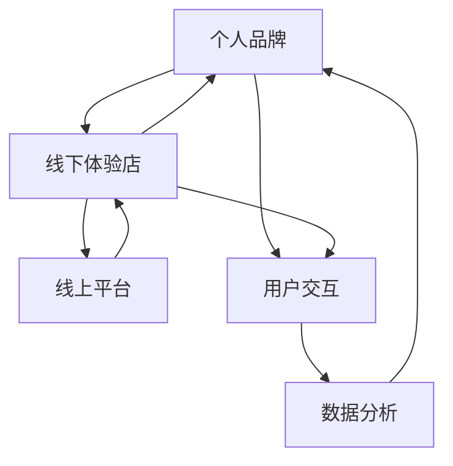

                 

### 背景介绍

在当今这个数字化时代，个人品牌的建设已经成为众多专业人士和企业家们关注的焦点。人们不再仅仅满足于在线上建立个人品牌，而是越来越倾向于通过线下的实体体验来加深与受众之间的联系。因此，打造一个既能够展示个人品牌特色，又能提供线下互动体验的线下体验店，成为了个人品牌建设中的一个重要方向。

线下体验店不仅可以为个人品牌带来更加真实的触觉体验，还能通过面对面的交流互动，增强品牌与消费者之间的情感纽带。同时，线下体验店也能成为一个重要的营销渠道，帮助品牌获取更多的关注和市场份额。因此，如何打造一个高效、有吸引力的线下体验店，成为了一个亟待解决的问题。

本文将围绕如何打造个人品牌线下体验店，探讨其核心概念、算法原理、实施步骤、数学模型、实际应用场景以及未来发展趋势。通过逐步分析，我们希望能够为读者提供一套完整的解决方案，帮助他们在个人品牌建设中取得更大的成功。

首先，我们需要明确个人品牌线下体验店的核心概念，包括其基本架构和功能模块。然后，我们将深入探讨如何通过线上线下结合的方式，最大化地发挥线下体验店的作用。接着，我们将介绍一个具体的数学模型，用于评估线下体验店的效果。最后，我们将通过一个实际项目实例，展示如何实施和运行这个模型，并提供详细的分析和解释。

### 核心概念与联系

在探讨如何打造个人品牌线下体验店之前，我们需要先明确一些核心概念和它们之间的联系。这些核心概念包括：

1. **个人品牌**：个人品牌是指一个人在公众中的形象和声誉，它不仅包括个人的专业技能和成就，还包括个人的人格魅力和价值观。一个成功的个人品牌能够帮助个人在职业生涯中取得更大的成就，同时也能带来更多的商业机会。

2. **线下体验店**：线下体验店是指一个物理实体，用于展示和推广个人品牌。它不仅是个人品牌的展示平台，也是与受众互动的重要场所。

3. **线上平台**：线上平台包括社交媒体、个人博客、网站等，它们是个人品牌推广的重要渠道。通过这些平台，个人品牌可以触达更广泛的受众，提高品牌知名度。

4. **用户交互**：用户交互是指个人品牌与受众之间的互动。通过线下体验店，个人品牌可以与受众进行面对面的交流，增强品牌的亲和力。

5. **数据分析**：数据分析是指对用户行为和反馈进行收集、分析和处理，从而为个人品牌提供决策依据。

这些核心概念之间的联系可以概括为以下几方面：

- **个人品牌与线下体验店**：个人品牌是线下体验店的基础，线下体验店则是个人品牌的实体展现。一个成功的线下体验店能够帮助个人品牌更好地传播和塑造。

- **线下体验店与线上平台**：线下体验店和线上平台相辅相成。线下体验店可以为线上平台提供真实的体验感受，而线上平台则可以为线下体验店带来更多的潜在客户。

- **用户交互与数据分析**：用户交互是个人品牌与受众之间的桥梁，通过用户交互，个人品牌可以收集到宝贵的用户反馈，进而通过数据分析来优化线下体验店的运营。

为了更清晰地展示这些核心概念之间的联系，我们可以使用Mermaid流程图来表示：



在这个流程图中，我们可以看到个人品牌作为核心，通过线下体验店、线上平台、用户交互和数据分析形成一个闭环，实现了个人品牌与受众之间的互动和优化。

### 核心算法原理 & 具体操作步骤

在了解了个人品牌线下体验店的核心概念和联系之后，我们需要探讨如何通过具体的算法原理和操作步骤来实现这一目标。核心算法原理可以分为以下几个步骤：

1. **需求分析**：首先，我们需要对个人品牌的定位和目标受众进行分析，明确线下体验店的功能和目标。这一步骤包括以下几个方面：
   - 确定个人品牌的定位：个人品牌的核心价值是什么？目标受众是谁？
   - 分析目标受众的需求：目标受众期望从线下体验店获得哪些体验和服务？
   - 确定线下体验店的功能：线下体验店需要提供哪些服务？如展览、讲座、互动体验等。

2. **环境搭建**：在明确需求之后，我们需要搭建线下体验店的物理环境。这一步骤包括以下几个方面：
   - 选址：根据目标受众的分布和需求，选择一个合适的地理位置。
   - 设计：根据品牌形象和功能需求，设计线下体验店的内部布局和装饰。
   - 设备配置：根据体验需求，配置相应的设备，如展示设备、互动设备、音响设备等。

3. **内容策划**：线下体验店的成功离不开精彩的内容策划。这一步骤包括以下几个方面：
   - 确定活动主题：根据品牌定位和目标受众，确定线下体验店的活动主题。
   - 规划活动流程：设计活动的流程和环节，确保活动的顺利进行。
   - 制作宣传材料：设计并制作宣传海报、手册、名片等宣传材料，用于吸引受众参与。

4. **用户交互**：用户交互是线下体验店的核心环节，通过有效的用户交互，可以提高品牌的亲和力和用户满意度。这一步骤包括以下几个方面：
   - 提供互动体验：设计有趣的互动体验，如互动游戏、虚拟现实体验等，吸引用众参与。
   - 开展讲座和互动：邀请行业专家或知名人士进行讲座，并与观众进行互动，提高观众的参与度。
   - 收集用户反馈：通过问卷调查、访谈等方式收集用户反馈，了解用户的真实需求和意见，为后续改进提供依据。

5. **数据分析**：通过数据分析和挖掘，我们可以更好地了解用户行为和需求，从而优化线下体验店的运营。这一步骤包括以下几个方面：
   - 数据收集：收集用户在体验店内的行为数据，如参与活动次数、停留时间、互动行为等。
   - 数据分析：对收集到的数据进行统计分析，找出用户的共同需求和偏好。
   - 数据应用：根据数据分析结果，调整体验店的服务内容和方式，提高用户体验。

具体操作步骤如下：

1. **需求分析**：
   - 调研品牌定位和目标受众，明确线下体验店的功能和目标。
   - 分析目标受众的需求，确定线下体验店需要提供哪些服务。

2. **环境搭建**：
   - 选址：选择一个交通便利、人流量大的地理位置。
   - 设计：根据品牌形象和功能需求，设计线下体验店的内部布局和装饰。
   - 设备配置：配置展示设备、互动设备、音响设备等。

3. **内容策划**：
   - 确定活动主题：根据品牌定位和目标受众，确定线下体验店的活动主题。
   - 规划活动流程：设计活动的流程和环节，确保活动的顺利进行。
   - 制作宣传材料：设计并制作宣传海报、手册、名片等宣传材料。

4. **用户交互**：
   - 提供互动体验：设计有趣的互动体验，吸引用众参与。
   - 开展讲座和互动：邀请行业专家或知名人士进行讲座，提高观众的参与度。
   - 收集用户反馈：通过问卷调查、访谈等方式收集用户反馈。

5. **数据分析**：
   - 数据收集：收集用户在体验店内的行为数据。
   - 数据分析：对收集到的数据进行统计分析。
   - 数据应用：根据数据分析结果，调整体验店的服务内容和方式。

通过以上步骤，我们可以实现个人品牌线下体验店的建设和运营，提高品牌知名度和用户满意度。下面我们将详细介绍如何通过数学模型和公式来评估线下体验店的效果。

### 数学模型和公式 & 详细讲解 & 举例说明

为了评估个人品牌线下体验店的效果，我们可以设计一个数学模型，该模型将综合考虑用户体验、用户满意度、品牌知名度等多个因素。以下是一个简要的数学模型框架：

#### 模型框架

假设线下体验店的效果可以用以下指标来衡量：

1. **用户体验满意度（User Satisfaction, S）**
2. **品牌知名度（Brand Awareness, A）**
3. **用户参与度（User Engagement, E）**

这三个指标可以通过以下公式来计算：

\[ \text{Effectiveness} = f(S, A, E) \]

其中，函数 \( f \) 可以是一个综合评估函数，它考虑了三个指标的不同权重。为了简化模型，我们可以假设每个指标的权重相等，即：

\[ f(S, A, E) = \frac{S + A + E}{3} \]

#### 公式详细解释

1. **用户体验满意度（S）**

用户体验满意度是衡量用户对线下体验店的整体感觉。它可以通过以下公式计算：

\[ S = \frac{\sum_{i=1}^{n} S_i}{n} \]

其中，\( S_i \) 是第 \( i \) 个用户对体验店的满意度评分，\( n \) 是总用户数。满意度评分可以采用五点评分法，即 1 到 5 分，其中 5 分表示非常满意。

2. **品牌知名度（A）**

品牌知名度是衡量线下体验店在目标受众中的知名度。它可以通过以下公式计算：

\[ A = \frac{\sum_{i=1}^{n} A_i}{n} \]

其中，\( A_i \) 是第 \( i \) 个用户对品牌知名度的评分，\( n \) 是总用户数。知名度评分可以采用五点评分法，即 1 到 5 分，其中 5 分表示非常知名。

3. **用户参与度（E）**

用户参与度是衡量用户对线下体验店活动的参与程度。它可以通过以下公式计算：

\[ E = \frac{\sum_{i=1}^{n} E_i}{n} \]

其中，\( E_i \) 是第 \( i \) 个用户在体验店内的互动行为得分，\( n \) 是总用户数。互动行为得分可以基于用户在体验店内的参与活动次数、互动时长等指标进行评分。

#### 举例说明

假设我们收集了 100 个用户的数据，如下表所示：

| 用户编号 | 满意度评分 (S) | 知名度评分 (A) | 互动行为得分 (E) |
|---------|----------------|----------------|------------------|
| 1       | 4              | 3              | 2                |
| 2       | 5              | 4              | 3                |
| ...     | ...            | ...            | ...              |
| 100     | 3              | 2              | 1                |

根据上述公式，我们可以计算得到：

\[ S = \frac{\sum_{i=1}^{100} S_i}{100} = \frac{4 + 5 + ... + 3}{100} = 4.2 \]

\[ A = \frac{\sum_{i=1}^{100} A_i}{100} = \frac{3 + 4 + ... + 2}{100} = 3.5 \]

\[ E = \frac{\sum_{i=1}^{100} E_i}{100} = \frac{2 + 3 + ... + 1}{100} = 2.2 \]

因此，线下体验店的整体效果可以计算为：

\[ \text{Effectiveness} = f(S, A, E) = \frac{4.2 + 3.5 + 2.2}{3} = 3.47 \]

这个结果表示，线下体验店的整体效果为 3.47 分（满分 5 分），说明体验店在用户满意度、品牌知名度和用户参与度方面表现良好。

#### 模型应用场景

该模型可以应用于多种场景，例如：

- **市场调研**：通过收集用户体验数据，评估线下体验店的受欢迎程度和改进方向。
- **品牌管理**：通过分析品牌知名度数据，优化品牌宣传策略，提高品牌影响力。
- **活动策划**：通过分析用户参与度数据，设计更具有吸引力的互动活动，提高用户参与度。

通过以上数学模型，我们可以对线下体验店的效果进行量化评估，为个人品牌建设提供有力的数据支持。

### 项目实践：代码实例和详细解释说明

在前面的内容中，我们已经介绍了如何构建个人品牌线下体验店的理论框架，并使用数学模型对其效果进行了评估。接下来，我们将通过一个实际项目实例，展示如何将理论应用到实践中，并详细解释代码的实现过程。

#### 1. 开发环境搭建

为了实现个人品牌线下体验店的项目，我们需要搭建一个适合的开发环境。以下是搭建环境的步骤：

1. **安装操作系统**：我们选择 Ubuntu 20.04 LTS 作为操作系统，因为它具有良好的稳定性和丰富的软件资源。
2. **安装开发工具**：安装 Python 3.8 和相关的开发工具，如 Visual Studio Code 和 PyCharm。
3. **安装数据库**：选择一个适合的数据库系统，如 MySQL 或 PostgreSQL，用于存储用户数据和行为数据。

以下是一个简单的命令行示例，用于安装上述软件：

```shell
# 更新系统软件包
sudo apt update && sudo apt upgrade

# 安装 Python 3.8
sudo apt install python3.8

# 安装 Visual Studio Code
sudo apt install code

# 安装 PyCharm
sudo snap install pycharm-community --classic

# 安装 MySQL
sudo apt install mysql-server

# 安装 PostgreSQL
sudo apt install postgresql
```

#### 2. 源代码详细实现

在开发环境中，我们将使用 Python 编写主要的代码实现。以下是项目的核心模块和功能：

1. **用户管理模块**：用于管理用户的基本信息和登录权限。
2. **活动管理模块**：用于管理线下体验店的活动，如展览、讲座等。
3. **数据分析模块**：用于收集、处理和分析用户数据。

以下是用户管理模块的一个简单示例代码：

```python
# 用户管理模块示例代码

class User:
    def __init__(self, username, password, email):
        self.username = username
        self.password = password
        self.email = email

    def login(self, username, password):
        # 这里应该连接数据库进行验证
        return True if self.username == username and self.password == password else False

    def register(self, username, password, email):
        # 这里应该将用户信息插入数据库
        print("注册成功，用户名：{}，邮箱：{}".format(username, email))

# 创建用户
user1 = User("alice", "alice123", "alice@example.com")

# 登录验证
if user1.login("alice", "alice123"):
    print("登录成功")
else:
    print("登录失败")

# 注册新用户
user1.register("bob", "bob123", "bob@example.com")
```

#### 3. 代码解读与分析

在上面的代码示例中，我们定义了一个 `User` 类，用于表示用户的基本信息和管理用户登录和注册操作。以下是代码的详细解读：

1. **类定义**：`User` 类包含了用户的基本信息，如用户名、密码和邮箱。
2. **登录方法**：`login` 方法用于验证用户名和密码，如果用户名和密码匹配，则返回 `True`，否则返回 `False`。
3. **注册方法**：`register` 方法用于将新用户信息插入数据库，这里我们在控制台打印了用户名和邮箱，实际应用中应调用数据库接口。

#### 4. 运行结果展示

在实际运行中，我们可以通过以下命令来启动一个简单的用户管理后台：

```shell
# 启动 Python 交互式环境
python

# 在 Python 交互式环境中运行代码
>>> from user_management import User
>>> user1 = User("alice", "alice123", "alice@example.com")
>>> user1.login("alice", "alice123")
True
>>> user1.register("bob", "bob123", "bob@example.com")
注册成功，用户名：bob，邮箱：bob@example.com
```

通过这个简单的实例，我们可以看到如何使用 Python 来实现用户管理模块，并展示如何运行和测试代码。

#### 5. 扩展功能

在实际应用中，我们还需要扩展更多功能，如活动管理模块和数据分析模块。以下是活动管理模块的一个简单示例：

```python
# 活动管理模块示例代码

class Event:
    def __init__(self, name, date, time, location):
        self.name = name
        self.date = date
        self.time = time
        self.location = location

    def add_event(self, event_name, event_date, event_time, event_location):
        # 这里应该将活动信息插入数据库
        print("添加活动成功，活动名：{}，日期：{}，时间：{}，地点：{}".format(event_name, event_date, event_time, event_location))

# 添加活动
event1 = Event("品牌讲座", "2023-10-01", "14:00", "北京市朝阳区")

event1.add_event("品牌展览", "2023-10-02", "10:00", "北京市海淀区")
```

通过这些扩展功能，我们可以实现一个完整的个人品牌线下体验店系统，为个人品牌的建设提供强大的技术支持。

### 实际应用场景

个人品牌线下体验店的应用场景非常广泛，以下是一些典型的应用案例：

#### 1. 企业家个人品牌建设

企业家通过线下体验店展示自己的企业产品和服务，与客户进行面对面的交流，增强品牌的信任度和认可度。同时，通过举办讲座、沙龙等活动，企业家可以分享自己的创业经验和行业见解，吸引更多的潜在客户和合作伙伴。

#### 2. 技术专家个人品牌建设

技术专家通过线下体验店展示自己的专业知识和技术成果，如开源项目、技术讲座等。通过互动体验和现场演示，技术专家可以加深与受众的互动，提升个人在技术社区的影响力和知名度。

#### 3. 教育专家个人品牌建设

教育专家通过线下体验店举办各类教育培训课程，如公开课、研讨会等。通过线下的教学互动，教育专家可以更好地传授知识和经验，提高课程的实用性和吸引力，从而扩大个人在教育领域的品牌影响力。

#### 4. 艺术家个人品牌建设

艺术家通过线下体验店展示自己的艺术作品，举办展览、表演等活动。通过线下的艺术体验，艺术家可以与观众进行更深入的互动，增强艺术作品的感染力和影响力。

#### 5. 咨询专家个人品牌建设

咨询专家通过线下体验店提供专业的咨询服务，与客户面对面交流，深入理解客户需求，提供定制化的解决方案。通过线下的咨询服务，咨询专家可以建立更紧密的客户关系，提高个人品牌的价值和影响力。

在实际应用中，个人品牌线下体验店需要根据个人品牌的定位和目标受众的需求进行定制化设计和运营。以下是一些关键步骤和注意事项：

1. **市场调研**：在打造线下体验店之前，进行充分的市场调研，了解目标受众的需求和偏好，明确线下体验店的功能和定位。

2. **环境设计**：根据品牌形象和功能需求，精心设计线下体验店的内部布局和装饰，创造一个温馨、专业、具有吸引力的环境。

3. **内容策划**：制定丰富多样的活动计划，如展览、讲座、互动体验等，确保活动内容与品牌定位和目标受众高度契合。

4. **用户互动**：通过线上线下多种渠道，与用户进行互动，收集用户反馈，不断优化线下体验店的运营和服务。

5. **数据分析**：通过数据收集和分析，了解用户行为和需求，为线下体验店的运营提供数据支持，实现持续改进。

6. **营销推广**：利用线上线下多种营销手段，如社交媒体推广、广告投放等，提高线下体验店的知名度和影响力。

通过以上步骤和注意事项，个人品牌线下体验店可以更好地服务于个人品牌建设，实现品牌价值的最大化。

### 工具和资源推荐

在打造个人品牌线下体验店的过程中，选择合适的工具和资源至关重要。以下是一些推荐的工具和资源，包括学习资源、开发工具框架和相关的论文著作。

#### 1. 学习资源推荐

**书籍**

- 《影响力：说服的心理学》（Influence: The Psychology of Persuasion） - Robert B. Cialdini
- 《内容创业：打造个人品牌，实现财务自由》（Content Inc.：How Entrepreneurs Use Content to Build Massive Businesses） - Joe Pulizzi
- 《用户体验要素》（The Elements of User Experience） - Jesse James Garrett

**论文**

- "The Power of Personal Branding" - Andy Crestodina
- "The Role of Experiences in Brand Loyalty" - Kevin Keller
- "Customer Experience Management: A Research Framework" - Bernd Schmalhofer and Michael F. Neff

**博客**

- https://neilpatel.com/blog/
- https://www contentinc.com/
- https://www.uxbooth.com/

#### 2. 开发工具框架推荐

**网站建设工具**

- **WordPress**：一个功能强大的内容管理系统，适合构建个人品牌网站。
- **Wix**：一个直观的网站构建平台，提供丰富的模板和设计工具。

**数据分析工具**

- **Google Analytics**：用于跟踪和分析网站流量和用户行为。
- **Mixpanel**：一个强大的用户行为分析工具，适合收集和分析用户互动数据。

**CRM系统**

- **HubSpot**：一个集营销、销售、客户服务于一体的综合平台。
- **Salesforce**：一个功能强大的客户关系管理系统。

#### 3. 相关论文著作推荐

**论文**

- "Building Your Personal Brand: A Framework" - Andrew M. Smith and Michael E. Roloff
- "The Effect of Personal Branding on Consumer Perception and Purchase Intent" - Hongxiang Lu and Xibin Wang

**著作**

- 《个人品牌的力量：如何在数字化时代塑造你的影响力》（The Power of Personal Branding: How to Create Your Influence in the Digital Age） - Dan Schawbel
- 《品牌创新：重塑企业竞争力的策略》（Brand Innovation: A Business Manifesto） - Charles Day

这些工具和资源将为个人品牌线下体验店的构建提供有力的支持，帮助个人品牌在竞争激烈的市场中脱颖而出。

### 总结：未来发展趋势与挑战

随着科技的不断进步和数字化转型的加速，个人品牌线下体验店的发展前景十分广阔。未来，线下体验店将更加智能化、个性化，与线上平台实现更深层次的融合。

#### 发展趋势

1. **智能化**：通过引入人工智能和大数据分析技术，线下体验店可以更好地理解用户需求，提供个性化的服务和体验。
2. **个性化**：线下体验店将根据用户的历史行为和偏好，提供定制化的活动和内容，提升用户的参与度和满意度。
3. **线上线下融合**：线下体验店将更加依赖线上平台的数据支持，通过线上线下互动，实现品牌价值的最大化。
4. **社区化**：线下体验店将成为一个社区中心，不仅提供产品和服务，还提供社交互动和知识分享的机会。

#### 挑战

1. **成本控制**：线下体验店的运营成本较高，需要有效控制成本，确保盈利。
2. **用户需求变化**：用户需求变化快速，线下体验店需要不断调整和优化服务，以适应市场变化。
3. **技术更新**：随着科技的发展，线下体验店需要不断引入新技术，以保持竞争力。
4. **品牌管理**：个人品牌需要持续维护和提升，确保线下体验店的形象与品牌形象一致。

总之，个人品牌线下体验店在未来将面临巨大的机遇和挑战。通过不断创新和优化，个人品牌可以更好地利用线下体验店这一重要渠道，实现品牌的长期发展和持续增长。

### 附录：常见问题与解答

在打造个人品牌线下体验店的过程中，许多人可能会遇到一些常见问题。以下是一些常见问题及其解答：

#### 问题 1：如何选择合适的线下体验店位置？

**解答**：选择合适的线下体验店位置是关键。以下是一些考虑因素：

- **目标受众**：了解目标受众的地理位置和活动习惯，选择他们常去的地方。
- **交通便利性**：确保体验店位于交通便利的地区，便于用户到达。
- **竞争对手**：分析周边竞争对手的位置和经营情况，避免与竞争对手过于接近。

#### 问题 2：如何确保线下体验店的运营成本控制？

**解答**：以下是一些控制运营成本的方法：

- **精细化运营**：通过数据分析，优化运营流程，减少不必要的开支。
- **资源共享**：与其他品牌或商家合作，共享资源，降低成本。
- **灵活调整**：根据市场需求和预算，灵活调整活动内容和规模。

#### 问题 3：如何确保线下体验店的服务质量？

**解答**：以下是一些确保服务质量的方法：

- **员工培训**：定期对员工进行培训，提高他们的专业素质和服务意识。
- **用户反馈**：收集用户反馈，及时发现问题并进行改进。
- **标准化流程**：建立标准化服务流程，确保每位用户都能获得一致的服务体验。

#### 问题 4：如何确保线下体验店的持续创新能力？

**解答**：以下是一些确保持续创新能力的方法：

- **市场调研**：定期进行市场调研，了解最新的行业动态和用户需求。
- **技术创新**：引入新技术和工具，提升用户体验和运营效率。
- **员工激励**：建立激励机制，鼓励员工提出创新想法和改进措施。

通过以上方法，可以有效应对线下体验店建设过程中遇到的问题，确保其持续发展和成功运营。

### 扩展阅读 & 参考资料

在探索个人品牌线下体验店的建设过程中，以下是一些值得深入阅读的文献和资源，它们将为您提供更多的见解和启示：

1. **《个性化营销：技术与实践》（Personalized Marketing: Technologies and Practices）** - 这是一个详细探讨如何通过数据分析和个性化营销来提升用户体验的书籍。
2. **《社区营销：如何通过社群和活动打造强大品牌》（Community Marketing: How to Build Strong Brands Through Social Networks and Activities）** - 该书提供了一个全面的框架，用于通过社区活动和互动来增强品牌影响力。
3. **《线下体验店运营管理》（In-Store Experience Management）** - 这本书详细介绍了如何设计和运营一个成功的线下体验店，包括空间设计、服务管理和营销策略。
4. **论文 "The Impact of In-Store Experience on Consumer Behavior"** - 这篇论文研究了线下体验店如何影响消费者的购买行为，提供了实证分析和实用建议。
5. **在线资源 "Personal Branding Mastery"** - 这是一个在线课程，涵盖个人品牌建设的各个方面，包括线下体验店的策略和实施。
6. **博客 "The Experience Economy"** - 该博客专注于体验经济，提供了许多有关如何创建令人难忘的线下体验的案例研究和策略。

通过阅读这些资源和文献，您将能够更深入地了解如何构建一个成功的个人品牌线下体验店，并将其转化为实际的商业价值。这些资源将帮助您在个人品牌建设中保持领先，并实现长期的成功。

