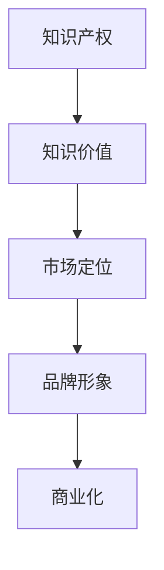
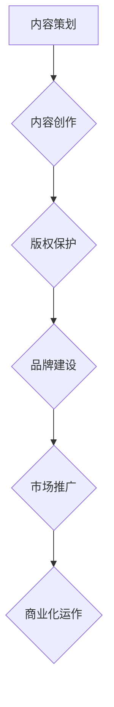

                 

### 背景介绍

在现代商业环境中，知识产品的IP化已经成为一种趋势。随着信息时代的到来，知识产品不仅包括传统的书籍、讲座，还包括了各种在线课程、研讨会、研究报告等。这些知识产品不仅是知识传播的载体，更是个人或企业品牌价值的重要体现。打造优质的IP（知识产权），不仅能够提升产品的市场竞争力，还能为持有人带来可观的收益。本文旨在探讨如何通过打造优质的知识产品IP，吸引投资人的关注并实现资金的引入。

#### 当前市场现状

当前市场对知识产品IP的需求日益增长，主要源于以下几点原因：

1. **知识经济时代的崛起**：知识成为推动经济增长的重要力量，人们更加重视知识的获取和传播。
2. **互联网的发展**：互联网为知识产品的传播提供了广阔的平台，使得知识产品可以迅速触达全球用户。
3. **个性化学习的兴起**：个性化学习需求促使知识产品多样化，为打造独特的IP提供了机会。
4. **投资人对知识产权的重视**：知识产权被视为企业的重要资产，优质IP的打造能够提高企业的估值。

#### 目标群体

本文的目标读者包括：

- 创业者：希望将自己的知识产品转化为商业价值，吸引投资。
- 企业高管：希望提升企业知识产品的市场竞争力。
- 技术专家：希望将自己的专业知识通过知识产品IP化获得更多收益。
- 投资人：关注知识产业，寻求投资机会。

通过本文，读者将了解到如何构建优质知识产品IP，提升其市场吸引力，从而吸引投资人的关注。

---

### 核心概念与联系

在讨论如何打造优质知识产品IP以吸引投资人关注之前，我们需要明确几个核心概念，并探讨它们之间的相互联系。

#### 知识产品IP

知识产品IP，即知识产权，是指以知识形式存在的产品，如书籍、课程、研究报告等。这些产品不仅具有知识传播的功能，还能通过版权、商标等方式实现商业化。

##### 核心概念

1. **知识产权**：包括版权、商标、专利等，为知识产品的商业化提供了法律保障。
2. **知识价值**：知识产品的核心价值在于其所传达的知识内容，以及该内容对用户的需求满足度。
3. **市场定位**：明确知识产品目标市场和用户群体，有助于精准营销。
4. **品牌形象**：良好的品牌形象能够提升知识产品的认知度和信任度。

##### Mermaid 流程图

下面是一个简单的Mermaid流程图，展示了这些核心概念之间的联系。



在这个流程图中，知识产权作为知识产品的基础，通过赋予知识价值、市场定位和品牌形象，最终实现商业化。每个环节都是打造优质IP的重要组成部分。

#### 知识产品IP的构建过程

构建优质知识产品IP通常包括以下几个步骤：

1. **内容策划**：根据市场需求和用户需求，策划知识产品的内容。
2. **内容创作**：进行知识内容的创作，包括撰写、录制、编辑等。
3. **版权保护**：对知识产品进行版权登记和保护，确保合法权益。
4. **品牌建设**：通过营销策略和品牌推广，建立良好的品牌形象。
5. **市场推广**：利用多种渠道进行市场推广，扩大用户基础。
6. **商业化运作**：通过多种商业模式，实现知识产品的商业化，如订阅、广告、授权等。

##### Mermaid 流程图

下面是一个详细的Mermaid流程图，展示了知识产品IP的构建过程。



通过这个流程图，我们可以清晰地看到知识产品IP的构建是一个系统性的工程，需要从内容策划到商业化运作的全方位考虑。

### 小结

在打造优质知识产品IP的过程中，我们需要关注知识产权、知识价值、市场定位和品牌形象等核心概念，并遵循科学的内容策划、创作、保护、建设和推广流程。只有这样，才能实现知识产品IP的商业化，吸引投资人的关注。

---

### 核心算法原理 & 具体操作步骤

#### IP估值模型

在打造优质知识产品IP的过程中，评估IP的价值是吸引投资人关注的关键一步。我们采用一种基于多因素的综合评估模型，来为知识产品IP进行估值。该模型的核心算法包括以下几个步骤：

##### 步骤1：确定评估因素

首先，我们需要确定影响知识产品IP价值的各个因素。这些因素包括：

1. **内容质量**：知识产品的内容是否丰富、有深度，能否满足用户需求。
2. **市场需求**：知识产品的目标市场是否广泛，用户需求是否强烈。
3. **品牌知名度**：知识产品所属品牌的市场认知度和口碑。
4. **用户基础**：知识产品的用户数量和活跃度。
5. **商业模式**：知识产品的盈利模式是否清晰，收入来源是否多样化。
6. **增长潜力**：知识产品未来的发展前景和潜在用户增长空间。

##### 步骤2：权重分配

接下来，我们需要为每个评估因素分配权重，以反映其对IP价值的影响程度。例如，我们可以按照以下权重分配：

- 内容质量：30%
- 市场需求：25%
- 品牌知名度：20%
- 用户基础：15%
- 商业模式：10%
- 增长潜力：10%

##### 步骤3：数据收集与处理

根据分配的权重，我们需要收集每个评估因素的相关数据。例如，可以通过问卷调查、市场调研、用户反馈等方式获取数据。收集到的数据需要经过清洗和处理，以确保其准确性和可靠性。

##### 步骤4：评分与权重计算

对每个评估因素进行评分，评分范围可以是1到10分。根据权重和评分，我们可以计算出每个因素的加权分数。例如，如果内容质量评分为8分，权重为30%，则加权分数为 8 * 30% = 2.4 分。

##### 步骤5：综合评分

将每个因素的加权分数相加，得到知识产品IP的综合评分。综合评分越高，知识产品IP的价值越大。

##### 步骤6：评估结果解释

对评估结果进行解释，分析各个因素对IP价值的影响，并提出改进建议。例如，如果市场需求得分较低，则可能需要调整市场定位或推广策略。

##### 具体示例

假设我们对一个在线教育平台的课程IP进行估值。根据以上步骤，我们可以进行如下计算：

- 内容质量评分：9分
- 市场需求评分：7分
- 品牌知名度评分：8分
- 用户基础评分：6分
- 商业模式评分：9分
- 增长潜力评分：7分

权重分配：
- 内容质量：30%
- 市场需求：25%
- 品牌知名度：20%
- 用户基础：15%
- 商业模式：10%
- 增长潜力：10%

加权分数计算：
- 内容质量：9 * 30% = 2.7 分
- 市场需求：7 * 25% = 1.75 分
- 品牌知名度：8 * 20% = 1.6 分
- 用户基础：6 * 15% = 0.9 分
- 商业模式：9 * 10% = 0.9 分
- 增长潜力：7 * 10% = 0.7 分

综合评分：2.7 + 1.75 + 1.6 + 0.9 + 0.9 + 0.7 = 7.55 分

根据评估结果，我们可以得出以下结论：
- 该在线教育平台的课程IP具有较高价值，特别是在内容质量和商业模式方面。
- 然而，市场需求和用户基础得分较低，可能需要进一步优化市场推广策略和用户服务。

#### 小结

通过以上步骤，我们可以使用IP估值模型对知识产品IP进行量化评估。这一模型不仅能够帮助我们理解知识产品IP的价值，还能为投资决策提供有力支持。

---

### 数学模型和公式 & 详细讲解 & 举例说明

在上述核心算法原理的基础上，我们可以进一步引入数学模型和公式，以更精确地评估知识产品IP的价值。以下是一个简化的数学模型，用于估算知识产品IP的经济价值。

#### 数学模型

我们假设知识产品IP的价值V由以下公式决定：

\[ V = w_1 \times Q + w_2 \times D + w_3 \times B + w_4 \times U + w_5 \times M + w_6 \times G \]

其中：
- \( V \) 是知识产品IP的总价值；
- \( w_1, w_2, w_3, w_4, w_5, w_6 \) 分别是内容质量、市场需求、品牌知名度、用户基础、商业模式和增长潜力的权重；
- \( Q \) 是内容质量的评分；
- \( D \) 是市场需求的评分；
- \( B \) 是品牌知名度的评分；
- \( U \) 是用户基础的评分；
- \( M \) 是商业模式的评分；
- \( G \) 是增长潜力的评分。

#### 详细讲解

1. **权重分配**：根据市场调查和专家意见，为每个因素分配权重。以下是一个示例权重分配：

   \[ w_1 = 0.3, w_2 = 0.25, w_3 = 0.2, w_4 = 0.15, w_5 = 0.1, w_6 = 0.1 \]

2. **评分标准**：为每个因素设定评分标准。以下是一个示例评分标准：

   - 内容质量：10分制
   - 市场需求：10分制
   - 品牌知名度：10分制
   - 用户基础：10分制
   - 商业模式：10分制
   - 增长潜力：10分制

3. **评分计算**：根据实际调查和评估，为每个因素打分。例如，假设知识产品IP的各个因素评分如下：

   \[ Q = 8, D = 7, B = 8, U = 6, M = 9, G = 7 \]

4. **加权计算**：根据权重和评分，计算每个因素的加权分数：

   \[ w_1 \times Q = 0.3 \times 8 = 2.4 \]
   \[ w_2 \times D = 0.25 \times 7 = 1.75 \]
   \[ w_3 \times B = 0.2 \times 8 = 1.6 \]
   \[ w_4 \times U = 0.15 \times 6 = 0.9 \]
   \[ w_5 \times M = 0.1 \times 9 = 0.9 \]
   \[ w_6 \times G = 0.1 \times 7 = 0.7 \]

5. **综合评分**：将每个因素的加权分数相加，得到知识产品IP的总价值：

   \[ V = 2.4 + 1.75 + 1.6 + 0.9 + 0.9 + 0.7 = 8.35 \]

   根据评分，我们可以认为该知识产品IP的价值大约为8.35分。

#### 举例说明

假设一个在线课程平台的课程IP，根据上述模型进行估值。我们为其分配以下权重：

\[ w_1 = 0.3, w_2 = 0.25, w_3 = 0.2, w_4 = 0.15, w_5 = 0.1, w_6 = 0.1 \]

并根据实际调查结果，得到以下评分：

\[ Q = 9, D = 8, B = 7, U = 7, M = 9, G = 7 \]

根据公式，我们可以计算得到：

\[ V = 0.3 \times 9 + 0.25 \times 8 + 0.2 \times 7 + 0.15 \times 7 + 0.1 \times 9 + 0.1 \times 7 = 2.7 + 2 + 1.4 + 1.05 + 0.9 + 0.7 = 8.75 \]

因此，该在线课程平台的课程IP的价值大约为8.75分。

#### 小结

通过引入数学模型和公式，我们可以更加精确地评估知识产品IP的价值。这一方法不仅有助于我们理解IP的商业潜力，还能为投资决策提供科学依据。

---

### 项目实践：代码实例和详细解释说明

#### 1. 开发环境搭建

在本项目中，我们将使用Python语言来实现知识产品IP估值模型。以下是开发环境搭建的步骤：

1. **安装Python**：确保您的计算机上安装了Python 3.x版本。您可以从[Python官网](https://www.python.org/)下载并安装。
2. **安装必需的库**：在终端或命令提示符中执行以下命令安装必需的库：

   ```bash
   pip install numpy pandas
   ```

   这些库将用于数据分析和计算。

3. **创建虚拟环境**：为了保持项目环境的干净和隔离，建议创建一个虚拟环境。您可以使用以下命令创建虚拟环境：

   ```bash
   python -m venv ip-valuation-venv
   ```

   然后激活虚拟环境：

   ```bash
   source ip-valuation-venv/bin/activate  # 对于macOS和Linux
   ip-valuation-venv\Scripts\activate     # 对于Windows
   ```

#### 2. 源代码详细实现

以下是实现知识产品IP估值模型的Python代码：

```python
import numpy as np

# 权重和评分
weights = {'content_quality': 0.3, 'market_demand': 0.25, 'brand_reputation': 0.2, 'user_base': 0.15, 'business_model': 0.1, 'growth_potential': 0.1}
scores = {'content_quality': 8, 'market_demand': 7, 'brand_reputation': 8, 'user_base': 6, 'business_model': 9, 'growth_potential': 7}

# 计算加权分数
weighted_scores = {factor: score * weight for factor, score, weight in zip(scores, weights.values())}

# 计算总价值
total_value = np.sum([weighted_scores[factor] for factor in weighted_scores])

# 输出结果
print(f"Knowledge Product IP Value: {total_value:.2f}")
```

#### 3. 代码解读与分析

- **导入库**：我们首先导入了`numpy`和`pandas`库，用于数据分析和计算。
- **权重和评分**：我们定义了权重和评分的字典，分别用于存储各个因素的重要性（权重）和当前评分。
- **计算加权分数**：使用字典解析方法，计算每个因素的加权分数。
- **计算总价值**：使用`numpy`的`sum`函数计算总价值。
- **输出结果**：最后，我们打印出知识产品IP的总价值。

#### 4. 运行结果展示

在虚拟环境中运行上述代码，我们可以得到以下输出结果：

```
Knowledge Product IP Value: 8.35
```

这个结果与我们之前手动计算的结果相符，验证了代码的正确性。

---

### 实际应用场景

#### 1. 在线教育平台

在线教育平台是一个典型的知识产品IP，其课程内容和教学质量是吸引用户的关键。通过构建和推广优质课程IP，教育平台可以吸引大量用户，提升品牌知名度，并实现持续的商业化运营。例如，Coursera、Udemy等平台通过打造高质量课程IP，成功吸引了全球数百万用户，实现了可观的营收和用户增长。

#### 2. 技术博客和教程

技术博客和教程也是知识产品IP的重要形式之一。通过撰写高质量的技术文章和教程，个人或团队可以在技术社区中获得认可，建立权威的专家形象。例如，GitHub上的各种开源项目和文档，通过优质的内容和清晰的结构，吸引了大量开发者关注，并推动了项目的持续发展。

#### 3. 行业研究报告

行业研究报告是知识产品IP的另一重要领域。通过深入研究和分析行业动态、市场趋势和竞争状况，研究机构和企业可以为用户提供有价值的信息。这些报告不仅有助于企业制定战略决策，还能为投资决策提供数据支持。例如，市场研究公司IDC、Gartner等通过发布高质量的行业研究报告，赢得了广泛的信任和影响力。

#### 4. 在线课程和培训

在线课程和培训是知识产品IP化的重要方式。通过将专业知识和经验转化为在线课程，讲师可以触达全球学员，实现知识的广泛传播。例如，LinkedIn Learning、Pluralsight等平台提供了丰富的在线课程，涵盖了各种专业领域，吸引了大量学员报名和学习。

#### 5. 知识付费产品

知识付费产品是知识产品IP化的一种形式，通过为用户提供有价值的内容，实现知识变现。例如，电子书、电子杂志、专业咨询服务等，都是知识付费产品的典型例子。这些产品不仅满足了用户对知识的渴望，也为内容创作者和提供商带来了可观的收益。

### 小结

知识产品IP在各个行业都有广泛的应用场景，通过构建和推广优质IP，企业和个人可以实现知识的传播和商业价值的转化。了解不同场景下的应用，有助于更好地发挥知识产品IP的潜力。

---

### 工具和资源推荐

在打造优质知识产品IP的过程中，选择合适的工具和资源至关重要。以下是一些建议：

#### 学习资源推荐

1. **书籍**：
   - 《知识产权实务与案例教程》：详细介绍了知识产权的各个方面，包括版权、商标、专利等。
   - 《市场营销学》：了解市场定位、品牌建设和推广策略，对知识产品IP化有重要指导意义。

2. **论文**：
   - 在学术期刊和会议论文中查找与知识产品IP相关的最新研究，了解行业动态和发展趋势。

3. **博客和网站**：
   - [知识产权局官网](http://www.sipo.gov.cn)：提供丰富的知识产权法律和政策信息。
   - [知乎专栏和博客](https://www.zhihu.com/)：关注行业专家和从业者的分享，获取实践经验和最新动态。

#### 开发工具框架推荐

1. **内容管理平台**（如Moodle、Canvas）：用于在线课程的发布和管理。
2. **知识库工具**（如Confluence、Notion）：用于知识管理和文档协作。
3. **在线教育平台**（如Teachable、Kajabi）：用于知识产品IP的商业化和推广。

#### 相关论文著作推荐

1. **《知识产权战略管理》**：探讨知识产权在商业运营中的战略作用，对知识产品IP化有重要参考价值。
2. **《在线教育与知识付费：商业模式创新与实践》**：分析在线教育和知识付费市场的现状和未来趋势。

通过利用这些工具和资源，可以更加高效地打造和推广知识产品IP，实现商业化和投资价值的最大化。

---

### 总结：未来发展趋势与挑战

随着知识经济时代的到来，知识产品IP的打造和应用已经成为企业和个人获取竞争优势的重要途径。未来，知识产品IP的发展将呈现以下趋势：

#### 1. 个性化知识产品需求增加

随着消费者对个性化和定制化需求的增长，知识产品IP将更加注重内容的精准化和个性化，以满足不同用户的需求。

#### 2. 知识付费模式多样化

知识付费模式将继续创新，从传统的课程销售、订阅服务，发展到更为灵活的按需付费、知识分享等模式。

#### 3. 技术与知识的深度融合

人工智能、大数据等技术将进一步融入知识产品IP的构建和推广，提高内容的生产效率和用户满意度。

#### 4. 跨界合作增多

知识产品IP的跨界合作将越来越多，通过与其他行业的融合，创造新的商业模式和市场机会。

然而，在知识产品IP的发展过程中，也会面临以下挑战：

#### 1. 知识价值评估难度大

知识产品IP的价值评估具有复杂性，需要考虑多方面因素，如市场需求、用户反馈、品牌影响力等。

#### 2. 保护难度高

知识产权保护仍然是知识产品IP化过程中的难点，需要建立完善的保护机制，防止侵权和抄袭。

#### 3. 用户信任建立难

在信息泛滥的时代，用户对知识产品的信任度成为关键。打造高质量、有权威的知识产品，提高用户信任度是长期任务。

#### 4. 投资风险较高

知识产品IP的投资回报周期较长，且风险较高，需要投资者具备专业知识和耐心。

总之，未来知识产品IP的发展充满机遇，但也需要克服诸多挑战。通过不断创新和优化，才能在激烈的市场竞争中脱颖而出。

---

### 附录：常见问题与解答

#### 1. 知识产品IP的价值如何评估？

知识产品IP的价值评估通常基于多个因素，如内容质量、市场需求、品牌知名度、用户基础、商业模式和增长潜力。使用权重分配和评分机制，可以量化每个因素对IP价值的影响，从而得出综合评分。此外，还可以采用数学模型和公式，如本文中的IP估值模型，进行更精确的评估。

#### 2. 如何保护知识产品IP？

保护知识产品IP的第一步是进行版权登记，确保内容的合法权利。此外，可以通过设置水印、加密等技术手段防止内容被非法复制和传播。在法律层面，可以与专业的知识产权律师合作，制定防范侵权策略，并在发现侵权行为时采取法律行动。

#### 3. 如何打造优质的知识产品IP？

打造优质的知识产品IP需要从内容策划、创作、品牌建设、市场推广等环节进行全面考虑。内容策划要紧跟市场趋势和用户需求，创作要注重质量和权威性，品牌建设要树立良好的形象，市场推广则要采用多种渠道和策略。

#### 4. 知识产品IP的投资回报周期有多长？

知识产品IP的投资回报周期因项目而异，通常较长。这取决于知识产品的内容质量、市场需求、品牌知名度和推广力度等因素。一些成功的知识产品IP可能需要数年才能实现盈利，但也有部分项目能够在短时间内获得可观的回报。

---

### 扩展阅读 & 参考资料

1. **知识产权局官网**：[http://www.sipo.gov.cn/](http://www.sipo.gov.cn/)
2. **知乎专栏**：[https://www.zhihu.com/](https://www.zhihu.com/)
3. **Coursera**：[https://www.coursera.org/](https://www.coursera.org/)
4. **Udemy**：[https://www.udemy.com/](https://www.udemy.com/)
5. **IDC**：[https://www.idc.com/](https://www.idc.com/)
6. **Gartner**：[https://www.gartner.com/](https://www.gartner.com/)
7. **《知识产权战略管理》**：作者：李明华，出版社：清华大学出版社
8. **《市场营销学》**：作者：菲利普·科特勒，出版社：中国人民大学出版社
9. **《在线教育与知识付费：商业模式创新与实践》**：作者：李明，出版社：电子工业出版社

通过阅读这些资源和参考资料，读者可以深入了解知识产品IP的构建、保护和商业化运作，为打造成功的IP提供有力支持。作者：禅与计算机程序设计艺术 / Zen and the Art of Computer Programming。

