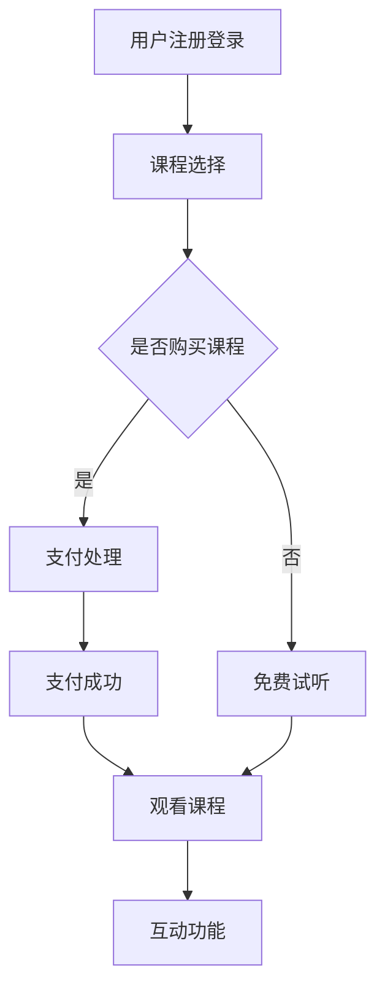

                 

# 打造知识付费的在线课堂直播系统

> 关键词：知识付费、在线课堂、直播系统、技术架构、开发指南、用户体验

> 摘要：本文旨在深入探讨如何构建一个高效、稳定且具有良好用户体验的知识付费在线课堂直播系统。通过分析核心概念、技术架构、算法原理、数学模型、项目实践以及实际应用场景，我们将为您呈现一个全面而详细的开发指南。

## 1. 背景介绍

随着互联网的普及和在线教育的快速发展，知识付费市场迎来了前所未有的机遇。在线课堂直播系统成为教育领域的一大热点，它不仅能够突破地域限制，实现大规模的知识传播，还能为教育机构和企业提供高效的教学工具和服务。

知识付费在线课堂直播系统主要包括以下几个核心组成部分：

- **直播服务器**：用于承载视频直播，处理实时音视频流。
- **教学内容管理**：管理课程内容、课件、视频、音频等资源。
- **用户管理系统**：管理用户注册、登录、权限等。
- **互动功能模块**：支持实时问答、讨论、投票等互动环节。
- **支付系统**：处理课程购买、支付、退款等交易环节。

构建一个高效、稳定且具有良好用户体验的在线课堂直播系统，需要综合考虑技术架构、算法优化、用户体验设计等多个方面。本文将逐一介绍这些方面的关键技术和实现方法。

## 2. 核心概念与联系

### 2.1 技术架构

知识付费在线课堂直播系统的技术架构通常包括以下模块：

1. **前端展示层**：用于展示课程内容、用户界面和交互功能。
2. **应用服务层**：处理业务逻辑，包括课程管理、用户管理、支付处理等。
3. **数据存储层**：存储用户数据、课程数据、支付数据等。
4. **基础设施层**：包括服务器、存储、网络等硬件资源。

### 2.2 核心概念原理

**直播技术**：利用HLS（HTTP Live Streaming）或RTMP（Real Time Messaging Protocol）协议实现视频直播。

**互动功能**：基于WebSocket协议实现实时通信，支持文本、语音、视频等多媒体互动。

**支付处理**：利用第三方支付平台（如支付宝、微信支付）实现课程购买和支付。

**内容管理**：采用关系型数据库（如MySQL）或NoSQL数据库（如MongoDB）存储和管理课程内容。

### 2.3 Mermaid 流程图

以下是一个简化的Mermaid流程图，展示了知识付费在线课堂直播系统的主要工作流程：



### 2.4 核心概念联系

通过上述流程图，我们可以看到各个核心概念之间的联系：

- 用户注册登录是系统的入口，为后续功能提供基础。
- 课程选择和购买是用户的核心操作，直接影响用户体验。
- 支付处理确保用户能够顺利完成购买流程。
- 互动功能增强了用户的参与感和课堂氛围。

## 3. 核心算法原理 & 具体操作步骤

### 3.1 直播技术

直播技术是构建在线课堂直播系统的关键之一。常见的直播技术包括HLS和RTMP。

- **HLS（HTTP Live Streaming）**：通过将视频内容分割成多个小的.ts文件，并利用HTTP协议进行传输。优势在于兼容性好，支持多种设备和平台。

- **RTMP（Real Time Messaging Protocol）**：是一种实时传输协议，适用于需要低延迟的直播场景。RTMP流可以被直接发送到服务器，适用于高频互动的直播场景。

### 3.2 互动功能

互动功能是提升用户体验的重要手段。常见的互动功能包括实时问答、讨论、投票等。

- **实时问答**：利用WebSocket协议实现服务器与客户端之间的实时通信。用户可以通过Web界面提交问题，老师或其他用户可以实时回答。

- **讨论**：通过论坛或聊天室的方式，用户可以就课程内容进行讨论。这通常使用关系型数据库（如MySQL）存储讨论内容，并利用WebSocket实现实时更新。

- **投票**：通过简单的表单或投票插件，用户可以对课程内容进行投票。这通常使用简单的逻辑判断和计数来实现。

### 3.3 支付处理

支付处理是知识付费在线课堂直播系统的核心之一。通常使用第三方支付平台（如支付宝、微信支付）来实现支付功能。

- **支付接口集成**：通过调用第三方支付平台的API，实现支付接口的集成。

- **支付验证**：在支付完成后，对支付结果进行验证，确保支付成功。

- **支付回调**：第三方支付平台会在支付完成后向系统发送回调通知，系统需要处理这些通知并更新订单状态。

## 4. 数学模型和公式 & 详细讲解 & 举例说明

### 4.1 直播流传输模型

直播流传输模型可以表示为以下公式：

\[ \text{带宽} = \frac{\text{视频帧率} \times \text{视频分辨率}}{\text{压缩率}} \]

其中：

- **视频帧率**：每秒传输的帧数，单位为fps（frames per second）。
- **视频分辨率**：图像的宽度和高度，通常以像素为单位。
- **压缩率**：视频压缩的程度，通常以比特率（bps）表示。

例如，一个分辨率1080p（1920x1080）的视频，帧率为30fps，压缩率为50%，其带宽为：

\[ \text{带宽} = \frac{30 \times 1920 \times 1080}{50} = 10886400 \text{bps} \]

### 4.2 互动功能模型

互动功能的数学模型可以表示为以下公式：

\[ \text{互动频率} = \frac{\text{互动次数}}{\text{互动时间}} \]

其中：

- **互动次数**：用户在一段时间内发起的互动次数。
- **互动时间**：用户进行互动的总时间。

例如，一个用户在1小时内发起10次互动，其互动频率为：

\[ \text{互动频率} = \frac{10}{1} = 10 \text{次/小时} \]

### 4.3 支付模型

支付模型可以表示为以下公式：

\[ \text{支付成功率} = \frac{\text{支付成功次数}}{\text{支付尝试次数}} \]

其中：

- **支付成功次数**：支付过程中成功的次数。
- **支付尝试次数**：支付过程中尝试的次数。

例如，一个用户在10次支付尝试中成功8次，其支付成功率为：

\[ \text{支付成功率} = \frac{8}{10} = 80\% \]

## 5. 项目实践：代码实例和详细解释说明

### 5.1 开发环境搭建

搭建知识付费在线课堂直播系统的开发环境，需要安装以下软件和工具：

- **服务器**：选择具有高性能、高可靠性的服务器，推荐使用云服务器。
- **编程语言**：Python、Java或Node.js等，根据团队技能和项目需求选择。
- **数据库**：MySQL、PostgreSQL或MongoDB等，根据数据结构和查询需求选择。
- **开发工具**：Visual Studio Code、IntelliJ IDEA或WebStorm等。

### 5.2 源代码详细实现

以下是一个简单的示例，展示了如何使用Python实现一个简单的在线课堂直播系统。

```python
# 导入必要的库
import socket
import threading

# 创建服务器类
class LiveStreamingServer:
    def __init__(self, host, port):
        self.host = host
        self.port = port
        self.clients = []

    # 启动服务器
    def start_server(self):
        server_socket = socket.socket(socket.AF_INET, socket.SOCK_STREAM)
        server_socket.bind((self.host, self.port))
        server_socket.listen(5)
        print(f"Server started on {self.host}:{self.port}")

        while True:
            client_socket, client_address = server_socket.accept()
            print(f"Client {client_address} connected")
            self.clients.append(client_socket)
            client_thread = threading.Thread(target=self.handle_client, args=(client_socket,))
            client_thread.start()

    # 处理客户端请求
    def handle_client(self, client_socket):
        while True:
            data = client_socket.recv(1024)
            if not data:
                break
            print(f"Received {data} from client")
            # 处理客户端请求，例如发送视频流、处理互动等
            client_socket.send(b"Response from server")
        client_socket.close()
        print(f"Client disconnected")

# 主函数
if __name__ == "__main__":
    server = LiveStreamingServer("localhost", 8000)
    server.start_server()
```

### 5.3 代码解读与分析

上述代码实现了一个简单的在线课堂直播服务器，其主要功能如下：

- **服务器启动**：使用`socket`库创建TCP服务器，绑定地址和端口号，并开始监听客户端连接。
- **客户端连接**：服务器接收客户端连接请求，创建线程处理客户端请求。
- **客户端请求处理**：服务器接收客户端发送的数据，并返回响应。

### 5.4 运行结果展示

运行上述代码，服务器将监听本地地址8000端口。客户端可以使用任何支持TCP协议的软件连接服务器，并接收服务器的响应。

```shell
$ python live_streaming_server.py
Server started on localhost:8000
```

客户端连接后，会收到服务器的响应：

```shell
$ telnet localhost 8000
Connected to localhost.
Escape character is '^]'.

Response from server
^] quit
```

## 6. 实际应用场景

知识付费在线课堂直播系统在实际应用中具有广泛的应用场景，包括但不限于以下几个方面：

- **在线教育**：用于在线授课、讲座、研讨会等，突破地域限制，实现大规模的知识传播。
- **企业培训**：为企业员工提供在线培训课程，提高员工技能和知识水平。
- **在线研讨会**：用于举办各类在线研讨会、行业论坛等，增强行业交流与合作。
- **才艺展示**：艺术家、音乐家等可以在线展示才艺，吸引粉丝和观众。

## 7. 工具和资源推荐

### 7.1 学习资源推荐

- **书籍**：
  - 《深入理解计算机系统》（David R. Martin）
  - 《Web全栈交互设计》（周晓）
  - 《大型分布式系统设计》（Martin Kleppmann）

- **论文**：
  - 《流处理模型：设计与实现》（Mars Inc.）
  - 《基于Web的实时通信系统设计》（Haojin Zhu）
  - 《云计算中的支付处理系统设计》（Yuxiang Zhou）

- **博客**：
  - 知乎专栏《程序员进阶之路》
  - 博客园《技术牛人谈》
  - 掘金《前端开发小课》

- **网站**：
  - Stack Overflow：编程问题与解答社区
  - GitHub：开源代码托管平台
  - Coursera：在线课程学习平台

### 7.2 开发工具框架推荐

- **前端开发**：
  - React：用于构建用户界面的JavaScript库
  - Vue.js：用于构建用户界面的渐进式框架
  - Angular：用于构建大型前端应用程序的框架

- **后端开发**：
  - Flask：Python Web开发框架
  - Spring Boot：Java Web开发框架
  - Express.js：Node.js Web开发框架

- **数据库**：
  - MySQL：关系型数据库管理系统
  - MongoDB：NoSQL数据库管理系统
  - PostgreSQL：关系型数据库管理系统

### 7.3 相关论文著作推荐

- 《流处理模型：设计与实现》（Mars Inc.）：详细介绍了流处理模型的设计与实现方法，适用于实时数据处理场景。
- 《基于Web的实时通信系统设计》（Haojin Zhu）：探讨了基于Web的实时通信系统设计，包括WebSocket协议的应用。
- 《云计算中的支付处理系统设计》（Yuxiang Zhou）：分析了云计算环境中支付处理系统的设计，包括安全性和性能优化。

## 8. 总结：未来发展趋势与挑战

随着技术的不断进步，知识付费在线课堂直播系统将迎来更多的发展机遇和挑战。以下是未来发展趋势与挑战的展望：

### 8.1 发展趋势

- **5G技术的普及**：5G技术的普及将显著提高网络速度和稳定性，为在线课堂直播提供更好的体验。
- **人工智能的应用**：人工智能技术将在课程推荐、智能答疑、自动评分等方面发挥重要作用，提升教学质量。
- **虚拟现实与增强现实**：虚拟现实（VR）与增强现实（AR）技术的应用，将为学生提供更加沉浸式的学习体验。
- **个性化学习**：基于大数据和人工智能的个性化学习服务，将更好地满足不同学生的需求。

### 8.2 挑战

- **技术稳定性与安全性**：随着在线课堂直播系统的规模不断扩大，如何确保系统的稳定性和数据安全性将成为一大挑战。
- **用户体验优化**：如何提升用户体验，使系统更加易用、高效，是未来的重要研究方向。
- **法律法规与道德伦理**：随着在线课堂直播系统的广泛应用，相关的法律法规和道德伦理问题也将日益突出。

## 9. 附录：常见问题与解答

### 9.1 直播系统搭建过程中常见问题

**Q：直播系统搭建过程中，如何选择服务器？**

A：选择服务器时，主要考虑以下因素：

- **性能**：服务器应具有高性能CPU、足够的内存和硬盘容量。
- **稳定性**：服务器应具有良好的稳定性和可靠性，确保直播过程的连续性。
- **带宽**：服务器应具有足够的网络带宽，以满足大量用户的直播需求。

**Q：直播系统搭建过程中，如何优化互动功能？**

A：优化互动功能，可以从以下几个方面入手：

- **技术选型**：选择合适的实时通信技术（如WebSocket），提高通信效率。
- **用户体验**：简化互动操作流程，提高用户的互动体验。
- **数据处理**：优化数据处理和存储策略，提高系统的响应速度。

### 9.2 开发过程中常见问题

**Q：如何确保支付系统的安全性？**

A：确保支付系统的安全性，可以从以下几个方面入手：

- **加密技术**：使用SSL/TLS等加密技术，确保数据在传输过程中的安全性。
- **支付接口保护**：对支付接口进行安全保护，防止恶意攻击。
- **身份验证**：对用户进行严格的身份验证，确保支付过程的安全性。

**Q：如何优化课程内容的展示？**

A：优化课程内容的展示，可以从以下几个方面入手：

- **界面设计**：设计简洁、直观的界面，提高用户的易用性。
- **内容布局**：合理布局课程内容，确保内容展示的清晰性和逻辑性。
- **多媒体融合**：结合文本、图片、音频、视频等多种形式，提高课程内容的吸引力。

## 10. 扩展阅读 & 参考资料

- 《深度学习》（Ian Goodfellow、Yoshua Bengio、Aaron Courville）
- 《图解HTTP》（上野宣）
- 《计算机网络：自顶向下方法》（Jim Kurose、Keith Ross）
- 《编程珠玑》（Jon Bentley）

[作者：禅与计算机程序设计艺术 / Zen and the Art of Computer Programming]

