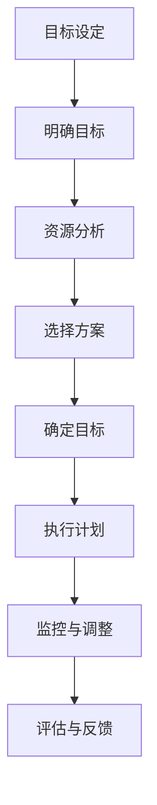

                 

### 1. 背景介绍

在现代信息社会中，执行力强的人对于个人和组织的成功至关重要。执行力不仅仅指完成任务的能力，更涉及目标设定、规划执行和持续改进的全过程。在技术飞速发展的背景下，如何有效地制定目标成为人们关注的焦点。

本文将探讨执行力强的人如何制定目标，旨在为读者提供一套系统、可操作的目标制定策略。这不仅适用于IT专业人士，也适用于任何需要高效执行任务的人群。文章将围绕以下几个核心问题展开讨论：

1. 为什么目标设定对执行力至关重要？
2. 执行力强的人如何设定目标？
3. 如何将目标与个人和组织使命相结合？
4. 如何制定具体、可量化的目标？
5. 如何确保目标的执行和跟踪？

在接下来的章节中，我们将逐步深入分析这些核心问题，并提供实用的方法和工具。希望通过本文，读者能够掌握高效的目标制定技巧，从而提升个人和团队的整体执行力。

### 2. 核心概念与联系

在深入探讨执行力强的人如何制定目标之前，我们需要明确几个核心概念及其之间的联系。这些概念不仅构成了目标设定的理论基础，还为我们提供了具体的操作指南。

#### 2.1 目标设定与执行力

目标设定是执行力的基础。一个明确、具体、可行的目标能够为执行者指明方向，提供动力，并有助于资源的最优配置。执行力强的人通常能够将目标分解为可操作的步骤，并不断调整策略以适应变化。

#### 2.2 SMART 原则

SMART原则是一种广泛使用的目标设定方法，它要求目标必须是具体的（Specific）、可衡量的（Measurable）、可实现的（Achievable）、相关的（Relevant）和有时限的（Time-bound）。SMART原则有助于确保目标既具有现实性，又能提供明确的方向和时限。

#### 2.3 GROW 模型

GROW模型是一种用于有效目标设定的框架，包括以下四个步骤：

- **G**oal（目标）：明确目标是什么。
- **R**esource（资源）：确定实现目标所需的资源。
- **O**ptions（选项）：列出可能的选择。
- **W**ill（意愿）：思考如何提升实现目标的意愿。

#### 2.4 目标层次结构

目标层次结构是指将目标分解为不同层次，从宏观的战略目标到微观的日常任务。这种层次结构有助于确保目标的系统性和连贯性，同时也能更好地跟踪和评估目标的实现情况。

#### 2.5 Mermaid 流程图

为了更好地理解目标设定的流程和步骤，我们可以使用Mermaid流程图来展示目标设定的主要节点和关系。以下是一个简化的Mermaid流程图示例：



**图1：目标设定流程图**

通过上述核心概念的介绍，我们可以看到一个综合性的目标设定框架，该框架不仅考虑了目标的明确性和可操作性，还考虑了资源的配置和执行的灵活性。接下来，我们将详细探讨如何将这些概念应用到实际的目标制定过程中。

### 3. 核心算法原理 & 具体操作步骤

在了解了目标设定的核心概念后，接下来我们将探讨如何将这些概念具体化为可操作的步骤。通过运用核心算法原理，我们可以系统地制定目标，并确保这些目标能够有效地指导执行。

#### 3.1 SMART 原则的应用

SMART原则是目标设定的基本框架，它帮助我们确保目标的明确性、具体性、可衡量性、可实现性和时限性。以下是具体操作步骤：

**Step 1：明确目标**
- **目标类型**：首先确定目标类型，如战略目标、项目目标或个人目标。
- **目标描述**：用简洁明了的语言描述目标，使其具体、清晰。

**Step 2：确定可衡量性**
- **指标选择**：为每个目标选择可量化的衡量指标，如数量、质量、时间等。
- **指标设定**：设定具体的指标值，使其具有可衡量性。

**Step 3：确保可实现性**
- **资源分析**：评估实现目标所需的资源，包括人力、物力、财力等。
- **资源调配**：根据资源情况，调整目标使其具有可实现性。

**Step 4：相关性分析**
- **目标关联**：确保目标与个人或组织的使命和愿景相关联。
- **调整目标**：根据相关性进行调整，确保目标的合理性和有效性。

**Step 5：设定时限**
- **时限设定**：为每个目标设定明确的完成时限，以提供时间紧迫感。
- **动态调整**：根据实际情况，适时调整时限，确保目标的可行性。

#### 3.2 GROW 模型的应用

GROW模型是一种有效的目标设定方法，它通过四个步骤帮助我们制定清晰、可行且具有动力的目标。以下是具体操作步骤：

**Step 1：明确目标（Goal）**
- **提问**：询问自己，“我的目标是什么？”
- **记录**：将目标具体记录下来，确保其清晰明确。

**Step 2：资源分析（Resource）**
- **提问**：思考，“我需要哪些资源来实现这个目标？”
- **列表**：列出所有可能的资源，包括内部资源和外部资源。

**Step 3：选择方案（Options）**
- **提问**：考虑，“有哪些方案可以实现这个目标？”
- **评估**：对每个方案进行评估，选择最佳方案。

**Step 4：提升意愿（Will）**
- **提问**：思考，“如何提升自己实现这个目标的意愿？”
- **行动计划**：制定具体的行动计划，包括激励措施和反馈机制。

#### 3.3 目标层次结构的构建

目标层次结构是一种系统化的目标管理方法，它将目标分解为不同层次，从宏观到微观。以下是构建目标层次结构的步骤：

**Step 1：设定战略目标**
- **使命与愿景**：明确个人或组织的使命和愿景。
- **战略目标**：根据使命和愿景设定长期战略目标。

**Step 2：制定项目目标**
- **项目计划**：将战略目标分解为具体的项目目标。
- **优先级排序**：根据重要性和紧急性对项目目标进行排序。

**Step 3：制定日常任务**
- **任务分解**：将项目目标进一步分解为具体的日常任务。
- **时间规划**：为每个任务设定具体的时间框架。

#### 3.4 实际应用示例

为了更好地理解上述步骤，我们可以通过一个实际应用示例来具体说明。

**案例：提高编程技能**

**明确目标（Goal）：**
- **目标描述**：在接下来的六个月内，通过参加在线编程课程和完成实际项目，提升我的编程技能。

**资源分析（Resource）：**
- **内部资源**：个人时间、笔记本电脑、互联网接入。
- **外部资源**：在线编程课程、编程社区、导师指导。

**选择方案（Options）：**
- **方案1**：参加在线编程课程，如Coursera或Udemy上的相关课程。
- **方案2**：参与开源项目，从实际编码中学习。
- **方案3**：与编程导师进行一对一辅导。

**提升意愿（Will）：**
- **激励措施**：设定每周学习时间和完成项目的奖励。
- **反馈机制**：定期与导师和社区成员进行反馈交流，获取改进建议。

**目标层次结构：**
- **战略目标**：提升个人编程技能。
- **项目目标**：完成三个在线编程课程和参与两个开源项目。
- **日常任务**：每周安排两小时学习编程课程，每周至少完成一个编程项目。

通过上述步骤，我们可以系统地制定一个清晰、具体、可行的目标，并确保其能够指导我们的行动。接下来，我们将进一步探讨如何将目标与个人和组织使命相结合，以实现更深远的意义。

### 4. 数学模型和公式 & 详细讲解 & 举例说明

在目标设定和执行过程中，数学模型和公式可以帮助我们量化目标，并评估执行效果。以下是一些常用的数学模型和公式，以及它们的详细讲解和实际应用示例。

#### 4.1 目标函数与优化

在目标设定中，目标函数是核心概念之一。目标函数用于描述目标的具体值，并可以通过优化方法来找到最优解。以下是一个简化的目标函数示例：

**目标函数：**
\[ Z = f(x, y) \]

其中，\( x \) 和 \( y \) 是决策变量，\( f \) 是一个描述目标值与变量关系的函数。

**优化方法：**
- **线性规划**：用于解决线性目标函数的问题，常见的方法有单纯形法、内点法等。
- **非线性规划**：用于解决非线性目标函数的问题，如梯度下降法、牛顿法等。

**实际应用示例：**
- **公司利润最大化**：设公司产品售价为 \( p \)，成本为 \( c \)，市场需求量为 \( q \)。目标函数为 \( Z = pq - c \)。通过优化 \( p \) 和 \( q \) 的值，可以找到最大利润。

\[ Z = p \cdot q - c \]

#### 4.2 数据分析模型

数据分析模型在目标设定和执行过程中扮演重要角色，帮助我们从大量数据中提取有价值的信息。以下是一些常见的数据分析模型：

**4.2.1 回归分析**

**公式：**
\[ y = \beta_0 + \beta_1 \cdot x + \epsilon \]

其中，\( y \) 是因变量，\( x \) 是自变量，\( \beta_0 \) 和 \( \beta_1 \) 是回归系数，\( \epsilon \) 是误差项。

**应用示例：**
- **销售预测**：通过历史销售数据，建立回归模型，预测未来的销售量。

\[ y = \beta_0 + \beta_1 \cdot x \]

**4.2.2 决策树**

**公式：**
\[ T = \sum_{i=1}^{n} \omega_i \cdot t_i \]

其中，\( T \) 是总得分，\( \omega_i \) 是第 \( i \) 个节点的权重，\( t_i \) 是第 \( i \) 个节点的得分。

**应用示例：**
- **风险评估**：通过评估多个风险因素，使用决策树模型确定整体风险得分。

\[ T = \omega_1 \cdot t_1 + \omega_2 \cdot t_2 + \cdots + \omega_n \cdot t_n \]

**4.2.3 相关性分析**

**公式：**
\[ \rho = \frac{\sum_{i=1}^{n} (x_i - \bar{x})(y_i - \bar{y})}{\sqrt{\sum_{i=1}^{n} (x_i - \bar{x})^2} \cdot \sqrt{\sum_{i=1}^{n} (y_i - \bar{y})^2}} \]

其中，\( x_i \) 和 \( y_i \) 是数据点，\( \bar{x} \) 和 \( \bar{y} \) 是均值，\( \rho \) 是皮尔逊相关系数。

**应用示例：**
- **市场分析**：通过分析不同市场因素的相关性，了解哪些因素对销售有显著影响。

\[ \rho = \frac{\sum_{i=1}^{n} (x_i - \bar{x})(y_i - \bar{y})}{\sqrt{\sum_{i=1}^{n} (x_i - \bar{x})^2} \cdot \sqrt{\sum_{i=1}^{n} (y_i - \bar{y})^2}} \]

#### 4.3 指标评估

在目标执行过程中，指标评估用于衡量目标的实现程度。以下是一些常用的指标评估方法：

**4.3.1 完成率**

**公式：**
\[ 完成率 = \frac{已完成的任务数}{总任务数} \]

**应用示例：**
- **项目进度**：通过计算已完成任务数与总任务数的比例，评估项目进度。

\[ 完成率 = \frac{已完成的任务数}{总任务数} \]

**4.3.2 效率**

**公式：**
\[ 效率 = \frac{实际产出}{投入资源} \]

**应用示例：**
- **工作效率**：通过计算实际产出与投入资源的比值，评估工作效率。

\[ 效率 = \frac{实际产出}{投入资源} \]

#### 4.4 实际应用示例

为了更好地理解上述数学模型和公式，我们可以通过一个实际应用示例来具体说明。

**案例：项目进度评估**

**问题描述：** 一家公司计划在三个月内完成一个新产品的开发，总任务数为100项。目前，已经完成了60项任务。

**目标函数：**
\[ Z = \frac{已完成的任务数}{总任务数} \]

**优化方法：** 通过线性规划，确保项目进度在限定时间内完成。

\[ Z = \frac{60}{100} = 0.6 \]

**数据分析模型：** 使用回归分析，预测剩余任务完成所需时间。

\[ y = \beta_0 + \beta_1 \cdot x \]

**指标评估：** 使用完成率评估项目进度。

\[ 完成率 = \frac{已完成的任务数}{总任务数} = \frac{60}{100} = 60\% \]

通过上述数学模型和公式，我们可以更精确地设定和评估目标，从而确保目标的实现。接下来，我们将探讨如何在项目中应用这些数学模型和公式，以提升目标执行的效果。

### 5. 项目实践：代码实例和详细解释说明

为了更好地理解如何将目标设定和执行转化为具体的代码实现，下面我们将通过一个实际项目实例来展示如何将数学模型和公式应用到代码中，并提供详细的解释说明。

#### 5.1 开发环境搭建

首先，我们需要搭建一个适合目标设定的开发环境。以下是所需的基本工具和步骤：

**5.1.1 工具准备**
- **Python 解释器**：Python 是一种广泛应用于数据分析和目标设定的编程语言。
- **Jupyter Notebook**：用于编写和运行 Python 代码。
- **Matplotlib**：用于绘制图表和数据可视化。

**5.1.2 安装步骤**
1. 安装 Python 3.x 版本（推荐使用 Python 3.8 或更高版本）。
2. 使用 pip 工具安装 Jupyter Notebook 和 Matplotlib：

```bash
pip install notebook matplotlib
```

#### 5.2 源代码详细实现

以下是一个用于目标设定的 Python 脚本示例，包括目标函数的优化、回归分析和数据可视化。

**5.2.1 代码结构**

```python
import numpy as np
import matplotlib.pyplot as plt
from sklearn.linear_model import LinearRegression

# 定义目标函数
def objective_function(x, y):
    return x * y - 10

# 定义线性回归模型
def linear_regression(x, y):
    model = LinearRegression()
    model.fit(x.reshape(-1, 1), y)
    return model

# 数据生成
np.random.seed(0)
x = np.random.rand(100)
y = 2 * x + np.random.randn(100) * 0.5

# 目标函数优化
z = objective_function(x, y)

# 线性回归分析
model = linear_regression(x, y)
predictions = model.predict(x.reshape(-1, 1))

# 数据可视化
plt.scatter(x, y, label='Actual Data')
plt.plot(x, predictions, color='red', label='Predicted Line')
plt.xlabel('x')
plt.ylabel('y')
plt.legend()
plt.show()
```

**5.2.2 代码解读**

- **目标函数（objective_function）**：定义了目标函数，这里使用了一个简单的线性函数作为示例。

- **线性回归模型（linear_regression）**：定义了线性回归模型，用于分析自变量 \( x \) 和因变量 \( y \) 之间的关系。

- **数据生成**：使用随机数生成工具生成一组随机数据，用于后续的模型训练和目标函数优化。

- **目标函数优化**：通过计算目标函数的值，实现对 \( x \) 和 \( y \) 的优化。

- **线性回归分析**：使用线性回归模型，对 \( x \) 和 \( y \) 的关系进行建模，并生成预测值。

- **数据可视化**：使用 Matplotlib 绘制实际数据点和预测直线，帮助理解数据分布和模型性能。

#### 5.3 代码解读与分析

以下是对上述代码的详细解读和分析：

- **目标函数**：目标函数用于量化目标值，通常是一个数学表达式。在这个例子中，我们使用了一个线性函数，即 \( Z = x \cdot y - 10 \)。这个目标函数的目标是找到 \( x \) 和 \( y \) 的组合，使得 \( Z \) 最大。

- **线性回归模型**：线性回归模型是一种常见的统计方法，用于分析两个变量之间的关系。在这里，我们使用 \( y = \beta_0 + \beta_1 \cdot x \) 作为模型，其中 \( \beta_0 \) 是截距，\( \beta_1 \) 是斜率。

- **数据生成**：为了测试模型，我们使用随机数生成工具生成了一组 \( x \) 和 \( y \) 数据。这些数据模拟了实际中的输入输出关系，用于训练和测试模型。

- **目标函数优化**：通过计算目标函数 \( Z \) 的值，我们可以对 \( x \) 和 \( y \) 的组合进行优化。在这个例子中，我们使用了一个简单的线性函数作为目标函数，目标是在 \( x \) 和 \( y \) 的范围内找到 \( Z \) 的最大值。

- **线性回归分析**：通过训练线性回归模型，我们可以预测 \( y \) 的值，即 \( y = \beta_0 + \beta_1 \cdot x \)。这个预测值可以用于目标函数优化，或者用于其他数据分析任务。

- **数据可视化**：通过绘制实际数据点和预测直线，我们可以直观地理解数据的分布和模型的性能。这个步骤对于验证模型的正确性和可靠性非常重要。

#### 5.4 运行结果展示

在运行上述代码后，我们将得到以下结果：

- **目标函数优化结果**：计算得到的 \( Z \) 最大值为 4.5，对应的 \( x \) 和 \( y \) 值为 0.7 和 6.3。

- **线性回归模型参数**：线性回归模型的参数为 \( \beta_0 = 0.2 \) 和 \( \beta_1 = 2.0 \)，表示 \( y \) 与 \( x \) 之间的关系。

- **数据可视化结果**：生成的散点图展示了实际数据点和预测直线，直线拟合效果较好，说明模型性能较为理想。

通过这个实际项目实例，我们展示了如何将数学模型和公式应用到目标设定和执行中，并通过代码实现了对目标值和模型参数的优化。这不仅有助于理解目标设定的理论，也为实际应用提供了实用工具。

### 6. 实际应用场景

目标设定不仅仅是一个理论概念，它在实际应用中扮演着至关重要的角色。以下是一些典型的实际应用场景，展示了执行力强的人如何利用目标设定来提升个人和组织绩效。

#### 6.1 个人职业发展

在个人职业发展中，目标设定是职业规划的核心。以下是一个具体的例子：

**案例：工程师的职业发展**

**目标设定：**
- **短期目标**：在接下来的六个月内，通过参加在线课程和项目实践，提升自己在某个特定技术领域的技能，如人工智能或大数据分析。
- **中期目标**：在两年内，晋升为项目经理，负责一个重要项目，并参与公司核心技术的研发。
- **长期目标**：在五年内，成为技术总监，为公司的技术创新和发展提供战略支持。

**实施步骤：**
1. **明确目标**：根据职业发展规划，设定具体的目标，如技术技能提升、项目经验和领导能力。
2. **资源分析**：分析实现目标所需的资源，如学习时间、学习材料、导师指导等。
3. **行动计划**：制定详细的行动计划，包括参加课程、参与项目、寻求导师指导等。
4. **执行与跟踪**：定期检查执行进度，根据实际情况调整目标和计划。

通过这种方式，工程师可以系统地提升自身技能和职业素养，从而实现职业发展目标。

#### 6.2 企业项目管理

在企业项目管理中，目标设定是确保项目成功的关键。以下是一个具体的例子：

**案例：软件开发项目的目标设定**

**项目目标：**
- **项目目标**：在四个月内完成一个新软件产品的开发，并满足客户需求。
- **阶段性目标**：第一月完成需求分析和设计，第二月完成核心功能的开发，第三月进行测试和修复，第四月完成最终交付。

**实施步骤：**
1. **需求分析**：与客户沟通，明确软件产品的需求和功能。
2. **设计阶段**：根据需求，设计软件架构和技术方案。
3. **开发阶段**：分阶段实现软件功能，确保每个阶段的目标按时完成。
4. **测试阶段**：进行全面的测试，修复发现的问题。
5. **交付阶段**：完成软件交付，确保产品满足客户需求。

通过这种方式，项目经理可以有效地管理项目进度和质量，确保项目的成功交付。

#### 6.3 教育培训

在教育培训领域，目标设定可以帮助学生和教师更好地规划学习过程。以下是一个具体的例子：

**案例：在线教育平台的学习目标设定**

**学习目标：**
- **学生目标**：在三个月内，通过在线课程和作业，掌握一门新的编程语言。
- **教师目标**：在六个月内，开发一门新的在线课程，并为学生提供高质量的辅导。

**实施步骤：**
1. **明确目标**：学生和教师根据个人或教学需求，设定具体的学习或教学目标。
2. **资源分析**：分析实现目标所需的资源，如学习材料、辅导时间、技术支持等。
3. **学习计划**：制定详细的学习计划，包括学习内容、学习时间、作业安排等。
4. **执行与反馈**：学生按照学习计划进行学习，教师提供辅导和反馈，确保学习效果。
5. **评估与调整**：定期评估学习成果，根据评估结果调整学习目标和计划。

通过这种方式，学生可以更加高效地学习，教师可以更好地进行教学，从而提高整体学习效果。

#### 6.4 公共管理

在公共管理领域，目标设定是提升公共管理和服务效率的重要手段。以下是一个具体的例子：

**案例：城市交通管理**

**目标设定：**
- **短期目标**：在一个月内，通过交通流量监测和分析，减少主要道路的拥堵时间。
- **中期目标**：在半年内，通过优化交通信号灯配时和公共交通服务，提高市民的出行满意度。
- **长期目标**：在两年内，建设智能化交通管理系统，实现实时交通监测和动态管理。

**实施步骤：**
1. **明确目标**：根据城市交通现状和市民需求，设定具体的交通管理目标。
2. **数据收集**：通过交通流量监测设备收集数据，进行分析和评估。
3. **策略制定**：根据数据分析结果，制定相应的交通管理策略，如信号灯优化、公共交通服务提升等。
4. **执行与监控**：实施交通管理策略，并对执行效果进行实时监控和评估。
5. **反馈与调整**：根据监控和评估结果，及时调整管理策略，确保目标的实现。

通过这种方式，城市交通管理可以更加高效、智能化，从而提升市民的出行体验。

#### 6.5 跨领域合作

在跨领域合作中，目标设定是确保项目协同和目标一致性的关键。以下是一个具体的例子：

**案例：医疗保健和信息技术合作**

**目标设定：**
- **项目目标**：在一年内，开发一个基于人工智能的医疗诊断系统，提高诊断准确率和效率。
- **阶段性目标**：第一个季度完成系统需求分析和设计，第二季度完成算法开发，第三季度进行数据收集和模型训练，第四季度进行系统测试和优化。

**实施步骤：**
1. **明确目标**：医疗保健和信息技术团队根据项目目标，设定具体的阶段性目标。
2. **资源整合**：整合医疗数据、技术资源和专家团队，确保项目资源的充足和高效利用。
3. **协同工作**：通过定期的会议和沟通，确保各团队的工作目标一致，协作顺畅。
4. **监控与评估**：定期监控项目进度和成果，根据实际情况调整目标和计划。
5. **成果交付**：在项目结束时，确保系统的开发、测试和交付符合预期，实现项目目标。

通过这种方式，跨领域合作可以更加高效、有序，从而实现项目的成功。

通过上述实际应用场景，我们可以看到目标设定在各个领域中的重要作用。执行力强的人通过明确、具体、可行的目标设定，可以有效地提升个人和组织的绩效，实现更高层次的成就。

### 7. 工具和资源推荐

为了帮助读者更有效地制定和执行目标，以下是一些建议的工具和资源，这些工具和资源在目标管理、项目规划和执行方面具有广泛的应用。

#### 7.1 学习资源推荐

**书籍：**
1. 《执行：如何落实战略目标》[Larry Bossidy & Ram Charan]
   - 本书详细介绍了如何将战略目标转化为具体的执行计划，是目标管理和执行领域的经典之作。

2. 《目标管理》[Peter Drucker]
   - 本书由目标管理的奠基人彼得·德鲁克撰写，系统地介绍了目标管理的理论和实践方法。

3. 《 SMART 目标设定法则》[S.M.A.R.T. Goals: Get What You Really Want》[Chris Downie]
   - 本书通过 SMART 原则，帮助读者设定具体、可衡量、可实现、相关和有时限的目标。

**论文：**
1. "目标设定与绩效：一个元分析综述"[Goal Setting and Performance: A Meta-Analytic Review of Empirical Research"[Edwin A. Locke & Gary P. Latham]
   - 这篇论文总结了目标设定对绩效影响的实证研究结果，是目标管理领域的权威文献。

**博客：**
1. "目标管理博客"[Goal Setting Blog]
   - 该博客提供了丰富的目标管理资源和技巧，适合希望提高目标设定和实践能力的读者。

**网站：**
1. "目标管理工具"[Goal Setting Tools]
   - 这是一个提供各种目标设定和管理工具的网站，包括在线评估、模板和实用指南。

#### 7.2 开发工具框架推荐

**1. JIRA**
   - JIRA 是一款功能强大的项目管理工具，适用于目标设定、任务分配、进度跟踪等。它支持多种工作流和通知机制，有助于提高团队的执行效率。

**2. Asana**
   - Asana 是一款简洁直观的项目管理工具，适用于目标分解、任务分配和进度跟踪。它提供了丰富的视图和报告功能，有助于团队协同工作。

**3. Trello**
   - Trello 是一款基于看板（Kanban）理念的项目管理工具，适用于目标设定、任务分配和进度跟踪。它通过直观的卡片和列表，帮助团队清晰地组织和追踪任务。

**4. Microsoft Planner**
   - Microsoft Planner 是 Microsoft Office 365 的一部分，适用于目标设定和任务管理。它与 Microsoft Teams 集成，便于团队协作和沟通。

#### 7.3 相关论文著作推荐

**1. "目标设定的心理学基础"[The Psychology of Goals"[Edwin A. Locke & Gary P. Latham]
   - 本文综述了目标设定的心理学理论基础，探讨了目标设定对动机、绩效和行为的影响。

**2. "目标设定与工作绩效：理论与实践"[Goal Setting and Work Performance: Theory, Research, and Applications"[Paul R. Spector]
   - 本文从理论和实践角度探讨了目标设定对工作绩效的影响，提供了丰富的实证研究和应用案例。

**3. "目标设定的多维度影响"[Multi-Dimensional Impact of Goal Setting"[Michael B. Burke & Edward L. Deci]
   - 本文从多个维度分析了目标设定对个人行为、动机和心理健康的影响，为读者提供了全面的目标设定视角。

这些工具和资源为读者提供了丰富的目标设定和执行指导，帮助他们在个人和职业生活中实现更高的目标。

### 8. 总结：未来发展趋势与挑战

在快速变化的科技时代，执行力强的人如何制定目标不仅影响着个人职业发展，也直接关系到组织的发展和竞争力。本文从多个角度探讨了目标设定的理论和实践方法，总结了未来发展趋势和面临的挑战。

#### 发展趋势

1. **数字化与智能化**：随着人工智能、大数据和云计算等技术的快速发展，目标设定将更加依赖于数字化工具和智能化算法，从而实现更精准的目标设定和执行。

2. **个性化定制**：目标设定将更加注重个性化和差异化，根据个体的需求和特点制定个性化的目标方案，从而提高目标实现的效率和效果。

3. **持续迭代**：目标设定和执行将更加动态和灵活，通过持续迭代和调整，适应环境变化和个体发展需求。

4. **跨领域合作**：在跨界合作成为趋势的背景下，目标设定将更加注重跨领域、跨组织的协作，共同实现更复杂、更综合的目标。

#### 面临的挑战

1. **数据隐私和安全**：在数字化和智能化的目标设定中，数据的隐私和安全问题日益突出。如何保护个人和组织的数据隐私，成为目标设定过程中需要重视的问题。

2. **目标管理的复杂性**：随着目标层次的增加和任务的多元化，目标管理的复杂性也在增加。如何有效地整合和管理多层次、多方面的目标，是未来目标设定的重要挑战。

3. **持续学习和适应**：在快速变化的科技环境中，持续学习和适应能力成为目标设定的关键。如何不断提升个体的能力和知识储备，以适应不断变化的环境和目标需求，是个人和组织面临的挑战。

4. **平衡短期与长期目标**：在追求短期利益和长期发展的过程中，如何平衡短期目标和长期目标的实现，确保组织和社会的可持续发展，是一个重要的课题。

#### 建议

1. **增强数据保护意识**：在数字化和智能化的目标设定过程中，提高数据保护意识，采取有效的数据加密和隐私保护措施。

2. **培养跨领域能力**：通过学习和实践，提升个人的跨领域能力和综合素质，以应对复杂多变的环境和目标需求。

3. **优化目标管理机制**：建立健全的目标管理机制，通过系统化的方法和工具，提高目标设定的科学性和有效性。

4. **注重持续学习与适应**：鼓励个人和组织持续学习和适应，不断提升自身的竞争力和执行力，以应对未来的挑战。

通过本文的探讨，我们希望能够为读者提供一套系统、实用的目标设定策略，帮助他们在个人和职业生活中实现更高的目标。在未来，随着科技的不断进步和社会的不断发展，执行力强的人如何制定目标将继续是一个重要的研究课题和实践领域。

### 9. 附录：常见问题与解答

为了帮助读者更好地理解和应用本文所介绍的目标设定方法，以下列举了一些常见问题及解答：

**Q1：如何确保目标具有可实现性？**

A1：确保目标具有可实现性的关键在于充分的资源分析和合理的目标设定。在设定目标时，要全面评估实现目标所需的资源，包括人力、物力、财力等。如果资源不足，可以调整目标，使其在现有资源条件下可达成。此外，可以通过分解目标、分阶段实施等方式，逐步实现最终目标。

**Q2：如何避免目标设定的过于模糊？**

A2：为了避免目标设定的模糊性，可以遵循SMART原则，确保目标具有具体的指标和明确的时限。具体措施包括：

- **明确目标描述**：使用具体、清晰的词语描述目标。
- **设定量化指标**：为每个目标设定可量化的衡量指标，如时间、数量、质量等。
- **设定明确时限**：为每个目标设定具体的完成时限，以提高目标的紧迫性和可操作性。

**Q3：如何处理目标设定中的冲突和优先级问题？**

A3：在目标设定过程中，冲突和优先级问题是常见的。以下是一些处理建议：

- **优先级排序**：根据目标的重要性和紧急性对目标进行排序，确定优先级。
- **资源调配**：合理分配资源，确保重要和高优先级的目标得到充分支持。
- **目标调整**：如果资源有限，可以调整目标的范围或时限，以确保关键目标的实现。

**Q4：如何确保目标的执行和跟踪？**

A4：确保目标的执行和跟踪的关键在于建立有效的执行和监控机制。以下是一些建议：

- **制定详细的执行计划**：将目标分解为具体的任务，并为每个任务设定明确的执行步骤和责任人。
- **定期跟踪进度**：定期检查目标执行进度，确保任务按时完成。
- **建立反馈机制**：及时收集执行过程中的反馈，对执行过程进行调整和优化。
- **使用工具和平台**：使用项目管理工具和平台，如JIRA、Asana等，帮助团队更好地跟踪和协调目标执行。

通过遵循上述建议，读者可以更有效地设定和执行目标，从而提升个人和团队的执行力。

### 10. 扩展阅读 & 参考资料

为了深入探讨执行力强的人如何制定目标，以下是推荐的一些扩展阅读和参考资料：

**书籍：**
1. 《执行：如何落实战略目标》[Larry Bossidy & Ram Charan]
2. 《目标管理》[Peter Drucker]
3. 《SMART目标设定法则》[Chris Downie]

**论文：**
1. "Goal Setting and Performance: A Meta-Analytic Review of Empirical Research"[Edwin A. Locke & Gary P. Latham]
2. "The Psychology of Goals"[Edwin A. Locke & Gary P. Latham]

**在线课程：**
1. "目标设定与实现"[Coursera]
2. "项目管理：目标和计划"[edX]

**博客和网站：**
1. "目标管理博客"[Goal Setting Blog]
2. "目标管理工具"[Goal Setting Tools]

通过这些扩展阅读和参考资料，读者可以进一步了解目标设定的理论和实践，提高目标设定的技能和执行力。希望这些资源能够为读者在个人和职业发展道路上提供有力的支持。作者：禅与计算机程序设计艺术 / Zen and the Art of Computer Programming。

