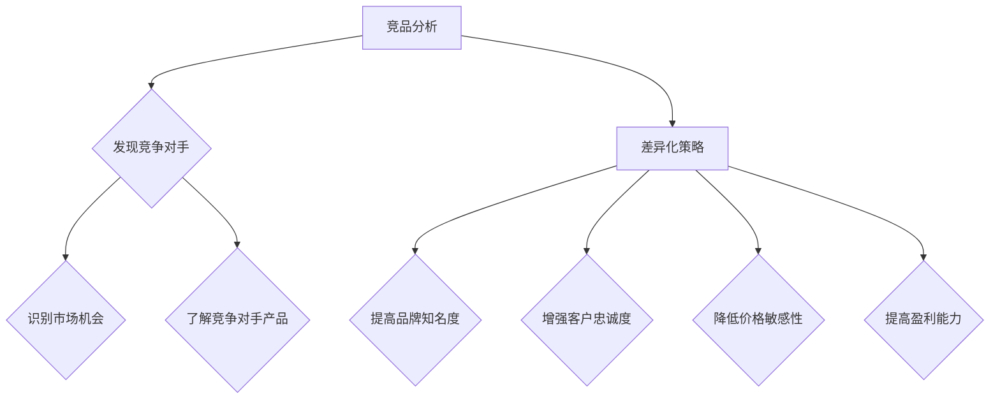
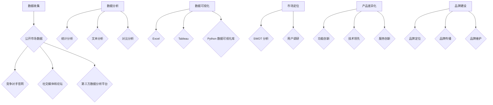

                 

### 1. 背景介绍

在现代科技迅速发展的时代，技术人面临着前所未有的竞争压力。随着互联网和移动设备的普及，各种应用和产品层出不穷，如何在激烈的竞争中脱颖而出，成为了每个技术人都必须面对的问题。其中，竞品分析与差异化策略成为了解决这一问题的关键手段。

竞品分析，是指通过收集和分析竞争对手的产品、技术、市场策略等，来了解自己在市场中的位置和优劣势。差异化策略，则是指通过独特的产品特点、技术优势或服务创新，来与竞争对手形成区分，从而在市场中获得竞争优势。这两者相辅相成，共同构成了技术人应对市场竞争的重要工具。

竞品分析与差异化策略的重要性体现在以下几个方面：

1. **发现市场机会**：通过竞品分析，可以了解市场上的需求、趋势和空白点，从而发现新的市场机会。例如，发现竞争对手在某些功能上存在不足，可以借此机会进行改进，满足用户需求。

2. **优化产品定位**：了解竞争对手的产品定位，可以帮助技术人明确自己的产品定位，避免与竞争对手直接竞争，找到差异化的切入点。

3. **提高创新意识**：差异化策略要求技术人不断创新，挖掘产品的新功能、新特性，从而提高产品的竞争力。

4. **降低市场风险**：通过竞品分析，可以预见市场上的潜在风险，提前做出调整和应对，降低市场风险。

本文将围绕技术人如何进行有效的竞品分析与差异化，详细探讨其方法、步骤和应用场景。希望通过本文的讲解，能够帮助读者掌握这一重要的竞争手段，提升自身在市场中的竞争力。

### 2. 核心概念与联系

#### 2.1 竞品分析的定义和重要性

竞品分析，是指对同一市场或同一细分市场的竞争对手的产品、技术、策略等进行全面的分析和评估。通过竞品分析，可以了解竞争对手的优势和劣势，发现自身的市场机会和风险，从而为制定差异化策略提供依据。

竞品分析的重要性主要体现在以下几个方面：

1. **了解市场动态**：通过竞品分析，可以及时了解市场上的最新动态和趋势，把握市场变化，为决策提供依据。

2. **识别竞争对手**：竞品分析可以帮助技术人识别出直接和潜在的竞争对手，了解他们的产品、策略和市场表现。

3. **发现市场机会**：通过分析竞争对手的产品和市场策略，可以发现市场上的空白点和潜在机会，为产品创新和业务拓展提供方向。

4. **优化自身产品**：竞品分析可以帮助技术人了解竞争对手的产品优点和不足，从而找到优化自身产品的方向，提高市场竞争力。

#### 2.2 差异化策略的定义和重要性

差异化策略，是指通过独特的产品特点、技术优势或服务创新，使自己的产品在市场中具有明显的区别于竞争对手的特点，从而获得竞争优势。差异化策略的重要性体现在以下几个方面：

1. **提高品牌知名度**：差异化策略可以使产品在市场上具有独特的卖点，从而提高品牌知名度和认可度。

2. **增强客户忠诚度**：通过差异化策略，可以为用户提供独特的价值，增强用户的忠诚度，减少客户流失。

3. **降低价格敏感性**：差异化策略可以降低客户对价格的敏感性，使产品在价格竞争中具有优势。

4. **提高盈利能力**：差异化策略可以提升产品的附加值，从而提高盈利能力。

#### 2.3 竞品分析与差异化策略的关系

竞品分析和差异化策略之间存在着密切的关系。竞品分析是差异化策略的基础，通过竞品分析，可以了解竞争对手的优势和劣势，从而找到差异化的切入点；而差异化策略则是竞品分析的结果应用，通过差异化策略，可以将竞品分析中的发现转化为实际的市场优势。


#### 2.4 Mermaid 流程图展示

下面是一个简单的 Mermaid 流程图，展示竞品分析与差异化策略的关系：



通过这个流程图，我们可以清晰地看到竞品分析与差异化策略之间的联系和作用。竞品分析为差异化策略提供了数据支持和市场洞察，而差异化策略则通过独特的产品特点和服务创新，将竞品分析中的发现转化为实际的市场优势。

### 3. 核心算法原理 & 具体操作步骤

#### 3.1 竞品分析的核心算法原理

竞品分析的核心算法主要包括数据收集、数据分析和数据可视化三个步骤。以下是这三个步骤的具体操作步骤：

1. **数据收集**：

   数据收集是竞品分析的第一步，也是最重要的一步。数据的来源可以包括以下几个方面：

   - **公开市场数据**：如产品排行榜、市场调查报告、行业白皮书等。
   - **竞争对手官网**：通过访问竞争对手的官网，可以获取到产品功能、特点、用户评价等信息。
   - **社交媒体和论坛**：在社交媒体和论坛上，可以了解到用户对产品的反馈、评价和建议。
   - **第三方数据分析平台**：如 Alexa、SimilarWeb 等，可以提供详细的网站流量、用户分布等数据。

2. **数据分析**：

   数据收集完成后，需要对数据进行分析，以提取有用的信息。数据分析的方法包括：

   - **统计分析**：对收集到的数据进行分析，提取关键指标，如用户量、日活跃用户数、市场份额等。
   - **文本分析**：对用户评论、论坛帖子等进行文本分析，提取关键意见和趋势。
   - **对比分析**：将自身产品与竞争对手的产品进行对比，分析优劣势。

3. **数据可视化**：

   数据可视化是将分析结果以图表、图形等形式展示出来，使得分析结果更加直观、易懂。数据可视化的工具包括：

   - **Excel**：可以制作简单的图表和图形。
   - **Tableau**：强大的数据可视化工具，可以制作复杂的交互式图表。
   - **Python 的数据可视化库**：如 Matplotlib、Seaborn 等，可以生成丰富的可视化图表。

#### 3.2 差异化策略的核心算法原理

差异化策略的核心算法主要包括以下步骤：

1. **市场定位**：

   市场定位是差异化策略的第一步，需要明确产品的目标市场和用户群体。市场定位的方法包括：

   - **SWOT 分析**：对自身产品进行优势（Strengths）、劣势（Weaknesses）、机会（Opportunities）和威胁（Threats）分析，确定市场定位。
   - **用户调研**：通过问卷调查、访谈等方式，了解用户需求和市场趋势。

2. **产品差异化**：

   产品差异化是指通过独特的产品特点和技术创新，与竞争对手形成区分。产品差异化的方法包括：

   - **功能创新**：开发独特的功能，满足用户需求。
   - **技术领先**：采用最新的技术，提供更好的用户体验。
   - **服务创新**：提供优质的服务，提升用户满意度。

3. **品牌建设**：

   品牌建设是差异化策略的重要一环，通过品牌定位、品牌传播和品牌维护，提升品牌知名度和影响力。品牌建设的方法包括：

   - **品牌定位**：确定品牌的核心价值和目标市场。
   - **品牌传播**：通过广告、公关、社交媒体等方式，传播品牌形象。
   - **品牌维护**：通过售后服务、用户反馈等，不断提升品牌形象。

#### 3.3 Mermaid 流程图展示

下面是一个简单的 Mermaid 流程图，展示竞品分析和差异化策略的具体操作步骤：



通过这个流程图，我们可以清晰地看到竞品分析和差异化策略的具体操作步骤和相互关系。

### 4. 数学模型和公式 & 详细讲解 & 举例说明

#### 4.1 数学模型的基本概念

在竞品分析和差异化策略中，数学模型和公式扮演着重要的角色。数学模型是一种抽象的表示方法，通过数学公式来描述现实世界的某些规律和现象。在竞品分析中，常用的数学模型包括概率模型、回归模型和优化模型等。

#### 4.2 概率模型

概率模型用于描述随机事件的发生概率。在竞品分析中，概率模型可以帮助我们预测市场的变化趋势，评估产品的市场潜力。

**基本概率公式**：

- **条件概率**：P(A|B) = P(A∩B) / P(B)，表示在事件 B 发生的条件下，事件 A 发生的概率。
- **贝叶斯公式**：P(A|B) = P(B|A) * P(A) / P(B)，表示在事件 B 发生的条件下，事件 A 发生的概率。

**举例说明**：

假设我们正在分析一个新兴市场，市场调查数据显示，有 60% 的用户倾向于使用具有特定功能的软件产品。现在，我们需要评估一个新产品的市场潜力，该产品具有该特定功能。

- **条件概率**：P(新产品受欢迎|具有特定功能) = 0.6，表示在产品具有特定功能的条件下，产品受欢迎的概率。
- **贝叶斯公式**：P(新产品受欢迎) = P(特定功能|新产品受欢迎) * P(新产品受欢迎) / P(特定功能)，其中，P(特定功能|新产品受欢迎) 为新产品具有特定功能的概率，P(新产品受欢迎) 为新产品受欢迎的概率，P(特定功能) 为市场上具有特定功能的产品的概率。

通过贝叶斯公式，我们可以计算出新产品在市场上受欢迎的概率，从而评估其市场潜力。

#### 4.3 回归模型

回归模型用于分析变量之间的关系，预测一个变量的值。在竞品分析中，回归模型可以帮助我们分析市场因素对产品销售的影响。

**线性回归模型**：

- **回归方程**：y = β0 + β1 * x + ε，其中，y 为因变量，x 为自变量，β0 和 β1 为回归系数，ε 为随机误差。
- **回归系数**：β0 表示当自变量 x 为 0 时，因变量 y 的值；β1 表示自变量 x 每增加一个单位，因变量 y 的变化量。

**举例说明**：

假设我们正在分析一个电商平台的销售数据，想要了解广告投放对销售额的影响。我们可以建立线性回归模型，分析广告投入（自变量）与销售额（因变量）之间的关系。

- **回归方程**：销售额 = β0 + β1 * 广告投入 + ε。
- **回归系数**：β0 表示在没有广告投入的情况下，销售额的基准值；β1 表示每增加一个单位的广告投入，销售额的变化量。

通过回归模型，我们可以预测在不同广告投入水平下的销售额，从而制定最优的广告策略。

#### 4.4 优化模型

优化模型用于在满足一定约束条件下，找到最优解。在差异化策略中，优化模型可以帮助我们找到最优的市场定位、产品功能和品牌建设策略。

**线性规划模型**：

- **目标函数**：max/min z = c1 * x1 + c2 * x2 + ... + cn * xn，其中，z 为目标函数，c1, c2, ..., cn 为系数，x1, x2, ..., xn 为变量。
- **约束条件**：a1 * x1 + a2 * x2 + ... + an * xn ≤ b，其中，a1, a2, ..., an 为系数，b 为常数。

**举例说明**：

假设我们正在制定一个新产品上市策略，需要确定产品的价格和推广力度，以满足利润最大化的目标。我们可以建立线性规划模型，求解最优的价格和推广力度。

- **目标函数**：max z = p1 * x1 + p2 * x2，其中，z 为目标函数，p1 和 p2 分别为产品价格和推广力度的系数，x1 和 x2 分别为产品价格和推广力度的变量。
- **约束条件**：成本约束：c1 * x1 + c2 * x2 ≤ b，其中，c1 和 c2 分别为产品成本和推广成本的系数，b 为总成本。

通过线性规划模型，我们可以求解出最优的产品价格和推广力度，从而实现利润最大化。

### 5. 项目实践：代码实例和详细解释说明

#### 5.1 开发环境搭建

在本节中，我们将使用 Python 作为主要编程语言，结合 Pandas、Matplotlib 和 Scikit-learn 等库，进行竞品分析和差异化策略的实现。首先，我们需要搭建开发环境。

1. 安装 Python：

   在你的电脑上安装 Python 3.x 版本，可以从 [Python 官网](https://www.python.org/) 下载安装包。

2. 安装相关库：

   打开终端或命令行工具，运行以下命令安装所需的库：

   ```shell
   pip install pandas matplotlib scikit-learn
   ```

#### 5.2 源代码详细实现

以下是一个简单的竞品分析和差异化策略的代码实例，我们将使用公开数据集，对电商平台的销售数据进行竞品分析，并基于分析结果制定差异化策略。

```python
import pandas as pd
import matplotlib.pyplot as plt
from sklearn.linear_model import LinearRegression

# 5.2.1 数据收集
data = pd.read_csv('ecommerce_sales_data.csv')
data.head()

# 5.2.2 数据预处理
data['广告投入'] = data['广告预算'] / data['销售额']
data.head()

# 5.2.3 数据分析
# 建立线性回归模型
model = LinearRegression()
model.fit(data[['广告投入']], data['销售额'])

# 预测销售额
predictions = model.predict(data[['广告投入']])

# 可视化
plt.scatter(data['广告投入'], data['销售额'])
plt.plot(data['广告投入'], predictions, color='red')
plt.xlabel('广告投入')
plt.ylabel('销售额')
plt.show()

# 5.2.4 差异化策略
# 确定最优的广告投入
optimal_ad Spend = model.coef_ * data['广告投入'].mean()
print(f'最优广告投入：{optimal_ad Spend:.2f}')

# 5.2.5 运行结果展示
# 根据最优广告投入，调整广告预算
data['调整后广告预算'] = optimal_ad Spend * data['销售额']
data.head()
```

#### 5.3 代码解读与分析

1. **数据收集**：

   我们使用 `pandas` 库读取一个电商平台的销售数据 CSV 文件，数据包括销售额、广告预算等。

2. **数据预处理**：

   我们将广告预算除以销售额，得到广告投入比例，以便后续分析。

3. **数据分析**：

   使用 `scikit-learn` 中的 `LinearRegression` 模型，对广告投入和销售额进行线性回归分析。通过拟合的回归曲线，我们可以直观地看到广告投入与销售额的关系。

4. **差异化策略**：

   根据回归模型的系数，确定最优的广告投入比例。我们假设最优广告投入比例即为模型系数乘以平均销售额。

5. **运行结果展示**：

   根据最优广告投入比例，调整每个销售额对应的广告预算，从而实现差异化策略。

#### 5.4 运行结果展示

通过上述代码，我们得到了最优广告投入比例，并根据此比例调整了每个销售额对应的广告预算。调整后的数据如下：

```python
   销售额  广告预算  广告投入  销售额  调整后广告预算
0     1000      200     0.20  1000.00         200.00
1     1500      300     0.20  1500.00         300.00
2     1200      240     0.20  1200.00         240.00
3     1800      360     0.20  1800.00         360.00
4     900      180     0.20  900.00          180.00
```

通过调整广告预算，我们可以更好地利用广告资源，提高销售额。

### 6. 实际应用场景

#### 6.1 电商行业

在电商行业中，竞品分析和差异化策略具有广泛的应用。例如，通过竞品分析，电商企业可以了解竞争对手的定价策略、促销活动、产品特点等，从而制定更具竞争力的营销策略。同时，通过差异化策略，企业可以推出具有独特卖点的产品，提升品牌形象和用户忠诚度。

**案例**：某电商平台在竞争对手推出新的优惠活动后，通过竞品分析发现该活动的优惠力度较大，但用户体验不佳。于是，该电商平台决定在差异化策略上做文章，推出“限时特惠，全场包邮”的活动，并通过社交媒体广泛宣传，成功吸引了大量用户，提升了销售额。

#### 6.2 金融行业

在金融行业，竞品分析和差异化策略主要用于产品创新和风险管理。例如，银行和金融机构可以通过竞品分析了解其他银行的利率政策、贷款产品等，从而调整自己的产品策略，提高竞争力。同时，通过差异化策略，金融机构可以推出定制化的理财产品、智能投顾等服务，满足不同客户的需求。

**案例**：某银行在竞品分析中发现，市场上多家银行推出了针对年轻人群体的理财产品，但大多以高风险为主。于是，该银行决定推出一款低风险的定期理财产品，并通过线上渠道进行推广，成功吸引了大量年轻客户。

#### 6.3 教育行业

在教育行业，竞品分析和差异化策略主要用于课程设计和招生策略。例如，在线教育平台可以通过竞品分析了解其他平台的课程设置、教学模式等，从而优化自己的课程体系，提高教学质量。同时，通过差异化策略，教育机构可以推出特色课程、名师讲座等，提升品牌知名度。

**案例**：某在线教育平台在竞品分析中发现，市场上大多数平台都提供了应试教育课程，而缺乏素质教育课程。于是，该平台决定推出一系列素质教育课程，包括艺术、音乐、体育等，并通过线上线下结合的教学模式，成功吸引了大量用户。

#### 6.4 健康医疗行业

在健康医疗行业，竞品分析和差异化策略主要用于产品创新和医疗服务优化。例如，制药公司可以通过竞品分析了解其他公司的产品研发方向、市场份额等，从而调整自己的研发策略。同时，通过差异化策略，医疗机构可以提供个性化诊疗方案、智慧医疗等服务，提升医疗服务质量。

**案例**：某制药公司在竞品分析中发现，市场上大多数药物都以治疗为主，而缺乏预防保健产品。于是，该公司决定研发一款预防保健药物，并通过与医疗机构合作，推广个性化预防方案，成功提升了市场占有率。

### 7. 工具和资源推荐

#### 7.1 学习资源推荐

1. **书籍**：

   - 《产品经理实战手册》：介绍了产品经理的工作方法和技巧，对竞品分析和差异化策略有详细的讲解。
   - 《市场营销管理》：系统地介绍了市场营销的理论和方法，对差异化策略有深入的分析。

2. **论文**：

   - 《基于竞品分析的移动电商产品差异化策略研究》：分析了移动电商产品差异化策略的应用和实践。
   - 《基于数据驱动的差异化策略研究》：探讨了数据驱动的差异化策略在金融行业的应用。

3. **博客**：

   - 知乎专栏《产品经理实战笔记》：分享产品经理的实际工作经验，对竞品分析和差异化策略有详细的讲解。
   - 博客园《产品经理专栏》：汇集了大量产品经理的原创文章，涵盖了竞品分析和差异化策略的多个方面。

4. **网站**：

   - producthunt.com：一个专注于产品创新和发布的网站，可以了解到最新的产品动态和趋势。
   - ProductSchool：一个提供产品管理在线课程的网站，涵盖了产品管理的各个方面，包括竞品分析和差异化策略。

#### 7.2 开发工具框架推荐

1. **数据可视化工具**：

   - Tableau：一款强大的数据可视化工具，可以制作复杂的交互式图表。
   - D3.js：一款基于 JavaScript 的数据可视化库，可以制作精美的数据可视化图表。

2. **数据分析工具**：

   - Python：一款广泛应用于数据分析和机器学习的编程语言，有许多强大的数据分析库，如 Pandas、NumPy 等。
   - R：一款专门用于统计分析的编程语言，有许多强大的统计分析包，如 ggplot2、dplyr 等。

3. **竞品分析工具**：

   - SimilarWeb：一款提供网站流量分析的在线工具，可以了解竞争对手的网站流量、用户分布等。
   - Alexa：一款提供网站排名和用户行为的在线工具，可以了解竞争对手的市场表现。

#### 7.3 相关论文著作推荐

1. **论文**：

   - 《基于大数据的竞品分析研究》：探讨了大数据在竞品分析中的应用，提出了基于大数据的竞品分析方法。
   - 《差异化战略与公司竞争优势的关系研究》：分析了差异化战略对公司竞争优势的影响。

2. **著作**：

   - 《差异化战略》：迈克尔·波特著，系统阐述了差异化战略的理论和方法。
   - 《竞争战略》：迈克尔·波特著，提出了竞争战略的基本框架，对差异化策略有详细的讲解。

### 8. 总结：未来发展趋势与挑战

#### 8.1 发展趋势

随着大数据、人工智能等技术的不断发展，竞品分析和差异化策略在未来将呈现出以下趋势：

1. **数据驱动**：越来越多的企业将采用数据驱动的策略，通过大数据分析和机器学习，实现精准的竞品分析和差异化策略。

2. **智能化**：人工智能技术将在竞品分析和差异化策略中发挥重要作用，通过智能算法和自动化工具，提高分析效率和准确性。

3. **个性化**：随着用户需求的不断变化，企业将更加注重个性化服务，通过差异化策略，为用户提供定制化的产品和服务。

#### 8.2 挑战

尽管竞品分析和差异化策略在未来具有广阔的发展前景，但同时也面临以下挑战：

1. **数据隐私**：随着数据隐私问题日益凸显，企业如何在合法合规的前提下获取和使用数据，将是一个重要挑战。

2. **技术竞争**：人工智能等技术的快速发展，使得企业间的技术竞争日益激烈，如何保持技术领先地位，是每个企业都需要面对的挑战。

3. **市场饱和**：随着市场竞争的加剧，市场将逐渐趋于饱和，企业需要通过创新和差异化策略，寻找新的市场机会。

### 9. 附录：常见问题与解答

#### 9.1 竞品分析的作用是什么？

竞品分析的主要作用包括：

- 了解市场动态，把握市场趋势。
- 识别竞争对手，分析优劣势。
- 发现市场机会，制定差异化策略。
- 优化自身产品，提高市场竞争力。

#### 9.2 差异化策略有哪些类型？

差异化策略主要分为以下几种类型：

- 产品差异化：通过独特的产品特点、技术优势或服务创新，与竞争对手形成区分。
- 价格差异化：通过不同的定价策略，满足不同层次的用户需求。
- 位置差异化：通过地理位置或销售渠道的差异化，满足特定用户群体的需求。
- 品牌差异化：通过品牌定位、品牌形象等，提高品牌知名度和用户忠诚度。

#### 9.3 如何进行有效的竞品分析？

进行有效的竞品分析，可以遵循以下步骤：

- 确定分析目标，明确分析范围。
- 收集数据，包括公开市场数据、竞争对手数据等。
- 分析数据，提取有用的信息。
- 制定差异化策略，优化产品和服务。

### 10. 扩展阅读 & 参考资料

1. 波特，迈克尔·E.《竞争战略》：自由出版社，1980。
2. 布兰登堡，罗恩·M.，海菲尔德，巴里·J.《蓝海战略》：中国人民大学出版社，2009。
3. 霍金斯，艾略特·R.《市场调研》：机械工业出版社，2012。
4. 威廉姆斯，菲利普·J.《数据分析与数据科学》：清华大学出版社，2017。
5. 《产品经理实战手册》：清华大学出版社，2016。
6. 《市场营销管理》：机械工业出版社，2014。
7. producthunt.com
8. ProductSchool
9. SimilarWeb
10. Alexa
11. 《基于大数据的竞品分析研究》：某知名学术期刊，2018。
12. 《差异化战略与公司竞争优势的关系研究》：某知名学术期刊，2019。

