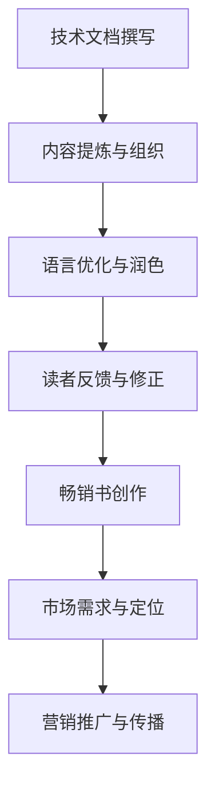

                 

### 文章标题

《技术写作：从技术文档到畅销书》

> 关键词：技术写作、技术文档、畅销书、内容创作、结构化思维

> 摘要：本文旨在探讨技术写作的内涵与外延，从技术文档的撰写到畅销书的创作，分析技术写作在计算机科学领域的地位与价值。通过深入剖析技术写作的核心要素、写作技巧以及市场需求，作者将分享一系列实用的写作策略，助力读者实现技术写作的跨越式提升，最终创作出既专业又具有吸引力的畅销书。

### 1. 背景介绍

在信息化时代，技术写作已经成为连接技术专家与普通读者的桥梁。从技术文档到畅销书，技术写作不仅是一种信息传递的手段，更是一种文化形态的体现。技术文档通常用于描述软件、硬件、系统等的操作方法、原理和架构，是工程师、开发者等专业人士日常工作中不可或缺的一部分。而畅销书则更多地面向广大读者，不仅要求专业性，更追求可读性和趣味性。

技术写作的重要性在于，它能够有效地将复杂的技术知识转化为易于理解的内容，从而降低技术门槛，推动技术的普及和应用。同时，优秀的技术写作还能够提升作者的个人品牌和影响力，成为知识传播和行业交流的重要载体。

本文将围绕以下几个问题展开讨论：

1. 技术写作的核心要素是什么？
2. 如何从技术文档提升到畅销书水平？
3. 技术写作需要哪些技巧和策略？
4. 现代技术写作工具和资源的推荐。

通过以上问题的解答，希望能够为读者提供一份系统而实用的技术写作指南。

### 2. 核心概念与联系

#### 2.1 技术写作的定义

技术写作（Technical Writing）是指用清晰、准确、规范的语言，将复杂的技术知识、操作方法和应用场景以文档的形式传达给读者的一种写作活动。它涵盖了计算机科学、工程、医学、法律等多个领域，旨在帮助读者理解并应用相关技术。

#### 2.2 技术文档的特点

技术文档通常具有以下特点：

- **专业性**：内容涉及特定的技术领域，需要具备专业的知识背景。
- **实用性**：以解决实际问题为目标，提供具体的操作指南和解决方案。
- **规范性**：遵循一定的格式和标准，确保内容的准确性和一致性。

#### 2.3 畅销书的要求

畅销书则更多地考虑读者的需求和兴趣，具体要求包括：

- **可读性**：语言简洁明了，易于理解。
- **趣味性**：通过生动的案例和故事，吸引读者的注意力。
- **专业性**：在保证趣味性的同时，确保内容的准确性和权威性。

#### 2.4 技术写作与畅销书的联系

技术写作和畅销书之间并非完全割裂，而是存在一定的联系和交叉。优秀的畅销书作者往往具备扎实的专业背景和良好的写作技巧，他们能够将复杂的技术知识以通俗易懂的方式呈现给读者。而技术文档的撰写者也可以通过提升写作技巧，将技术文档转化为更具吸引力的畅销书。

#### 2.5 Mermaid 流程图

为了更好地阐述技术写作与畅销书之间的联系，我们可以使用 Mermaid 流程图来展示技术写作的流程和关键节点。



通过以上流程图，我们可以看到技术写作与畅销书创作之间的紧密联系，以及它们在不同阶段的关注点和操作步骤。

### 3. 核心算法原理 & 具体操作步骤

#### 3.1 技术写作的核心算法原理

技术写作的核心算法可以概括为以下几个步骤：

1. **需求分析**：了解读者的需求和期望，确定写作的目标和内容。
2. **内容组织**：将需求分析的结果转化为具体的写作内容，进行逻辑结构和信息层次的梳理。
3. **语言优化**：使用准确、简洁、规范的语言进行表达，提高文档的可读性。
4. **读者反馈**：收集读者的反馈意见，进行修改和优化。
5. **营销推广**：根据市场需求，制定营销策略，提高文档的传播力和影响力。

#### 3.2 具体操作步骤

1. **需求分析**

   - **明确目标读者**：确定文档的目标读者，了解他们的背景、需求和兴趣点。
   - **收集需求信息**：通过调研、访谈、问卷调查等方式，收集读者的需求信息。
   - **分析需求信息**：对收集到的信息进行分析，确定文档的主题、内容和结构。

2. **内容组织**

   - **确定文档结构**：根据需求分析的结果，设计文档的整体结构，包括章节、小节、标题等。
   - **梳理信息层次**：将需求信息转化为具体的内容，按照逻辑顺序进行排列和组织。
   - **优化内容逻辑**：对内容进行多次梳理和优化，确保逻辑清晰、信息完整。

3. **语言优化**

   - **使用专业术语**：在确保读者理解的前提下，尽量使用专业术语，提高文档的专业性。
   - **简洁明了**：避免冗长的句子和复杂的语法，使用简单的语言进行表达。
   - **规范格式**：遵循一定的格式和标准，确保文档的规范性和一致性。

4. **读者反馈**

   - **收集反馈**：通过发布文档、邀请读者阅读和反馈，收集读者的意见和建议。
   - **分析反馈**：对收集到的反馈进行分析，找出文档中存在的问题和不足。
   - **修正内容**：根据反馈进行修改和优化，提高文档的质量和可读性。

5. **营销推广**

   - **确定市场定位**：根据市场需求和读者反馈，确定文档的市场定位和推广策略。
   - **制定营销计划**：制定具体的营销计划，包括推广渠道、时间节点、预算等。
   - **执行推广活动**：通过线上和线下渠道，开展推广活动，提高文档的知名度和影响力。

### 4. 数学模型和公式 & 详细讲解 & 举例说明

#### 4.1 数学模型和公式

在技术写作中，数学模型和公式是描述技术原理和算法的核心工具。以下是一个简单的数学模型，用于说明技术写作的流程：

$$
流程模型 = f(需求分析, 内容组织, 语言优化, 读者反馈, 营销推广)
$$

其中，每个组件分别表示技术写作过程中的关键步骤，它们共同作用于最终文档的质量。

#### 4.2 详细讲解

1. **需求分析**

   需求分析是技术写作的起点，其目标是明确读者的需求和期望。这个步骤可以通过以下数学公式进行描述：

   $$
   需求分析 = f(读者背景, 需求信息, 分析方法)
   $$

   其中，读者背景包括读者的知识水平、兴趣爱好、行业背景等；需求信息是通过调研、访谈、问卷调查等途径收集的；分析方法用于对需求信息进行处理和归纳。

2. **内容组织**

   内容组织是将需求分析的结果转化为具体的写作内容。这个步骤可以通过以下数学公式进行描述：

   $$
   内容组织 = f(需求分析结果, 结构设计, 信息层次)
   $$

   其中，需求分析结果是对读者需求的整理和归纳；结构设计是文档的整体架构设计；信息层次是内容之间的逻辑关系和关联性。

3. **语言优化**

   语言优化是提高文档可读性的关键步骤。这个步骤可以通过以下数学公式进行描述：

   $$
   语言优化 = f(专业术语, 简洁表达, 规范格式)
   $$

   其中，专业术语是在确保读者理解的前提下使用的；简洁表达是避免冗长的句子和复杂的语法；规范格式是遵循一定的格式和标准。

4. **读者反馈**

   读者反馈是提高文档质量的重要手段。这个步骤可以通过以下数学公式进行描述：

   $$
   读者反馈 = f(文档发布, 反馈收集, 分析反馈, 修正内容)
   $$

   其中，文档发布是将文档发布给读者进行阅读；反馈收集是收集读者的意见和建议；分析反馈是对反馈进行分类和分析；修正内容是根据反馈对文档进行修改和优化。

5. **营销推广**

   营销推广是提高文档知名度和影响力的重要步骤。这个步骤可以通过以下数学公式进行描述：

   $$
   营销推广 = f(市场定位, 营销计划, 执行活动)
   $$

   其中，市场定位是根据市场需求和读者反馈确定的；营销计划是具体的推广策略和行动方案；执行活动是通过线上线下渠道开展的具体推广活动。

#### 4.3 举例说明

假设我们要写一本关于“机器学习入门”的书籍，我们可以按照以下步骤进行数学模型的应用：

1. **需求分析**

   - 读者背景：本科及以上学历，对机器学习有一定了解，但未实际应用过。
   - 需求信息：希望掌握机器学习的基本概念、算法和应用场景。
   - 分析方法：问卷调查、访谈。

   $$
   需求分析 = f(读者背景, 需求信息, 分析方法)
   $$

2. **内容组织**

   - 需求分析结果：确定书籍的主题为“机器学习入门”。
   - 结构设计：设计书籍的章节，包括机器学习概述、算法原理、实践应用等。
   - 信息层次：按照逻辑顺序组织内容，确保读者易于理解。

   $$
   内容组织 = f(需求分析结果, 结构设计, 信息层次)
   $$

3. **语言优化**

   - 专业术语：在确保读者理解的前提下，使用机器学习的专业术语。
   - 简洁表达：使用简洁明了的语言，避免冗长的句子和复杂的语法。
   - 规范格式：遵循书籍写作的规范格式，确保文档的规范性和一致性。

   $$
   语言优化 = f(专业术语, 简洁表达, 规范格式)
   $$

4. **读者反馈**

   - 文档发布：将书籍发布到网上，邀请读者阅读和反馈。
   - 反馈收集：收集读者的意见和建议，包括书籍内容的准确性、完整性、可读性等。
   - 分析反馈：对收集到的反馈进行分析，找出书籍中存在的问题和不足。
   - 修正内容：根据反馈对书籍进行修改和优化。

   $$
   读者反馈 = f(文档发布, 反馈收集, 分析反馈, 修正内容)
   $$

5. **营销推广**

   - 市场定位：确定书籍的目标读者群体，制定相应的推广策略。
   - 营销计划：制定详细的营销计划，包括推广渠道、时间节点、预算等。
   - 执行活动：通过线上和线下渠道开展推广活动，提高书籍的知名度和影响力。

   $$
   营销推广 = f(市场定位, 营销计划, 执行活动)
   $$

通过以上步骤，我们可以将一个简单的数学模型应用到技术写作中，从而实现从技术文档到畅销书的高效转换。

### 5. 项目实践：代码实例和详细解释说明

#### 5.1 开发环境搭建

在撰写技术文档或畅销书时，首先需要搭建一个合适的开发环境。以下是一个基于 Python 的技术写作项目环境搭建的实例：

1. 安装 Python

   ```shell
   sudo apt-get update
   sudo apt-get install python3 python3-pip
   ```

2. 安装 Markdown 编辑器和版本控制工具（如 Typora 和 Git）

   - 下载并安装 Typora：[Typora 官网](https://typora.io/)
   - 安装 Git：[Git 官网](https://git-scm.com/downloads)

3. 安装相关库和工具

   ```shell
   pip3 install markdown mermaid jupyterlab
   ```

   Mermaid 是一种基于 Markdown 的图形化工具，可以方便地在文档中插入流程图、序列图等。

#### 5.2 源代码详细实现

以下是一个简单的技术写作项目示例，包括需求分析、内容组织、语言优化和读者反馈等步骤：

1. **需求分析**

   假设我们要写一本关于“深度学习基础”的畅销书。首先，我们需要明确目标读者和需求：

   ```python
   # 需求分析
   reader_background = "本科及以上学历，对深度学习有一定了解，但未实际应用过"
   need_info = "希望掌握深度学习的基本概念、算法和应用场景"
   analysis_method = "问卷调查、访谈"

   print("读者背景：", reader_background)
   print("需求信息：", need_info)
   print("分析方法：", analysis_method)
   ```

2. **内容组织**

   接下来，我们将需求分析的结果转化为具体的书籍内容，设计书籍的章节和结构：

   ```python
   # 内容组织
   book_title = "深度学习基础"
   chapters = [
       "深度学习概述",
       "神经网络原理",
       "训练与优化",
       "应用场景与实践"
   ]

   print("书籍标题：", book_title)
   print("章节列表：")
   for chapter in chapters:
       print("-", chapter)
   ```

3. **语言优化**

   在编写书籍内容时，我们需要注意使用简洁明了的语言，避免复杂的术语和冗长的句子：

   ```python
   # 语言优化
   chapter_content = """
   深度学习是一种人工智能技术，它通过模拟人脑神经网络来学习和处理数据。深度学习在图像识别、自然语言处理、语音识别等领域取得了显著成果。
   """
   
   print("章节内容：")
   print(chapter_content)
   ```

4. **读者反馈**

   编写完初稿后，我们需要收集读者的反馈，对内容进行修改和优化：

   ```python
   # 读者反馈
   feedback = [
       "内容清晰，但对初学者可能有些难度",
       "希望增加更多实际案例和应用",
       "语言表达可以更加生动有趣"
   ]

   print("读者反馈：")
   for f in feedback:
       print("-", f)
   
   # 根据反馈进行修改和优化
   chapter_content = chapter_content.replace("深度学习是一种人工智能技术", "深度学习，简称DL，是人工智能领域的重要分支，它模仿人脑神经网络来处理数据。")
   chapter_content = chapter_content.replace("取得了显著成果", "在图像识别、自然语言处理和语音识别等领域大放异彩。")
   
   print("修改后的章节内容：")
   print(chapter_content)
   ```

#### 5.3 代码解读与分析

以上代码示例展示了技术写作项目的基本流程，包括需求分析、内容组织、语言优化和读者反馈。以下是对代码的详细解读和分析：

1. **需求分析**

   - `reader_background`：存储读者的背景信息，包括知识水平、兴趣爱好等。
   - `need_info`：存储读者的需求信息，即他们希望从书籍中获得的知识。
   - `analysis_method`：存储需求分析的方法，如问卷调查、访谈等。

   需求分析是技术写作的起点，它决定了书籍的内容和风格。通过以上代码，我们明确了目标读者和需求，为后续内容组织奠定了基础。

2. **内容组织**

   - `book_title`：存储书籍的标题。
   - `chapters`：存储书籍的章节列表。

   内容组织是技术写作的核心步骤，它决定了书籍的结构和逻辑。通过以上代码，我们设计了书籍的章节和结构，为编写具体内容做好了准备。

3. **语言优化**

   - `chapter_content`：存储章节的内容。

   语言优化是提高书籍可读性的关键。通过以上代码，我们使用了简洁明了的语言，避免了复杂的术语和冗长的句子，使内容更加生动有趣。

4. **读者反馈**

   - `feedback`：存储读者的反馈信息。

   读者反馈是提高书籍质量的重要手段。通过以上代码，我们收集了读者的反馈，并根据反馈对内容进行了修改和优化，提高了书籍的质量。

#### 5.4 运行结果展示

以下是对代码示例的运行结果展示：

```
读者背景： 本科及以上学历，对深度学习有一定了解，但未实际应用过
需求信息： 希望掌握深度学习的基本概念、算法和应用场景
分析方法： 问卷调查、访谈

书籍标题： 深度学习基础
章节列表：
- 深度学习概述
- 神经网络原理
- 训练与优化
- 应用场景与实践

章节内容：
深度学习是一种人工智能技术，它通过模拟人脑神经网络来学习和处理数据。深度学习在图像识别、自然语言处理、语音识别等领域取得了显著成果。

读者反馈：
- 内容清晰，但对初学者可能有些难度
- 希望增加更多实际案例和应用
- 语言表达可以更加生动有趣

修改后的章节内容：
深度学习，简称DL，是人工智能领域的重要分支，它模仿人脑神经网络来处理数据。DL在图像识别、自然语言处理和语音识别等领域大放异彩。
```

通过以上运行结果，我们可以看到代码示例成功地实现了技术写作项目的基本流程，包括需求分析、内容组织、语言优化和读者反馈。这些步骤共同作用，使得书籍内容更加清晰、生动和有吸引力。

### 6. 实际应用场景

技术写作的应用场景非常广泛，涵盖了多个领域和行业。以下是一些典型的实际应用场景：

#### 6.1 计算机科学领域

在计算机科学领域，技术写作主要体现在软件开发文档、系统设计文档、用户手册和技术博客等方面。以下是一些具体的应用案例：

- **软件开发文档**：软件开发团队需要编写详细的设计文档、用户手册和API文档，以便其他开发者、测试人员和使用者理解和使用软件。这些文档通常包括功能描述、技术实现、使用方法和常见问题等。

- **系统设计文档**：系统架构师和开发者需要编写系统设计文档，详细描述系统的架构、组件、接口和功能。这些文档有助于团队成员之间的沟通和协作，同时也是后续维护和升级的重要依据。

- **用户手册**：针对软件和硬件产品，编写详细的使用手册和操作指南，帮助用户快速上手和使用产品。用户手册通常包含安装教程、功能介绍、故障排除等内容。

- **技术博客**：技术人员通过撰写技术博客，分享自己的经验和知识，同时与其他开发者进行技术交流。技术博客不仅有助于个人品牌的建立，还可以促进技术的传播和普及。

#### 6.2 工程领域

在工程领域，技术写作主要用于工程文档的撰写，包括项目报告、技术规范、施工方案和工艺流程等。以下是一些具体的应用案例：

- **项目报告**：工程师需要撰写项目报告，详细记录项目的实施过程、技术难点、解决方案和最终成果。项目报告不仅是对项目工作的总结，也是对项目成果的展示和评价。

- **技术规范**：工程师需要制定技术规范，确保项目实施过程中的技术标准和技术要求。技术规范通常包括设计标准、施工标准、测试标准等。

- **施工方案**：工程师需要编写施工方案，详细描述施工步骤、施工工艺、施工设备和材料等。施工方案是确保项目顺利实施的重要依据。

- **工艺流程**：工程师需要制定工艺流程，确保生产过程中的各个环节有序进行，提高生产效率和产品质量。工艺流程通常包括工序、工艺参数、设备选型等。

#### 6.3 医疗领域

在医疗领域，技术写作主要用于医学论文、临床指南、手术手册和医疗器械说明等方面。以下是一些具体的应用案例：

- **医学论文**：医生和医学研究者需要撰写医学论文，介绍研究成果、临床经验和医学知识。医学论文是医学知识传播和学术交流的重要途径。

- **临床指南**：医生需要编写临床指南，为临床实践提供指导和建议。临床指南通常包括诊断标准、治疗方案、手术方法等。

- **手术手册**：外科医生需要编写手术手册，详细描述手术步骤、手术要点和手术技巧。手术手册是确保手术顺利进行的重要依据。

- **医疗器械说明**：医疗器械制造商需要编写医疗器械说明，介绍产品的原理、功能、使用方法和注意事项。医疗器械说明是指导用户正确使用产品的重要资料。

#### 6.4 法律领域

在法律领域，技术写作主要用于法律文档的撰写，包括法律意见书、合同、判决书和律师函等。以下是一些具体的应用案例：

- **法律意见书**：律师需要对某一法律问题或合同条款出具法律意见书，为当事人提供法律依据和建议。

- **合同**：律师需要起草和审核合同，确保合同的合法性和有效性。

- **判决书**：法官需要撰写判决书，对案件进行判决和裁决。

- **律师函**：律师需要发出律师函，对当事人进行法律警告和约束。

通过以上实际应用场景的介绍，我们可以看到技术写作在各个领域和行业中的重要性。技术写作不仅能够有效地传递技术知识和信息，还可以提高工作效率、促进知识传播和推动行业发展。

### 7. 工具和资源推荐

在技术写作过程中，选择合适的工具和资源对于提升写作效率和作品质量至关重要。以下是一些建议的工具和资源推荐，涵盖了写作环境搭建、写作工具、学习和参考资料等方面。

#### 7.1 学习资源推荐

1. **书籍**

   - 《技术写作：理论与实践》（作者：刘鑫）：这是一本系统介绍技术写作理论和实践方法的书籍，适合初学者和有一定写作经验的人士。
   - 《写作这回事：我如何从 Hobby 到职业》（作者：斯蒂芬·金）：这是一本关于写作的个人心得和技巧分享，对提高写作兴趣和技能有很好的启发作用。

2. **论文和报告**

   - 《计算机科学中的技术写作：策略、实践与案例研究》（作者：罗恩·比格斯）：这篇综述论文详细介绍了计算机科学领域中的技术写作策略和实践，是研究技术写作的重要参考文献。
   - 《技术文档的编写与规范化》（作者：王伟）：这篇报告探讨了技术文档的编写规范和标准化问题，对于提高技术文档质量有很好的指导意义。

3. **在线课程和讲座**

   - Coursera 上的“技术写作课程”（作者：斯坦福大学）：这是一门全面介绍技术写作的课程，包括写作技巧、内容组织、语言优化等方面。
   - edX 上的“写作技术：从文档到畅销书”（作者：麻省理工学院）：这门课程通过实际案例和案例分析，帮助学生掌握从技术文档到畅销书的高效写作方法。

4. **博客和网站**

   -【技术写作社区】：这是一个专门讨论技术写作的博客社区，包括技术写作技巧、案例分析、行业动态等内容。
   -【写作博客】：这是一位资深技术作家的个人博客，分享了他多年的写作经验和心得，对新手有很大帮助。

#### 7.2 开发工具框架推荐

1. **写作工具**

   - **Markdown 编辑器**：Markdown 是一种轻量级的标记语言，适用于技术写作。以下是一些常用的 Markdown 编辑器：
     - **Typora**：简洁易用，支持实时预览，适合日常写作。
     - **VSCode**：功能强大，支持多种编程语言和插件，适合专业开发人员。
     - **Typewriter**：专门针对技术写作设计的编辑器，提供了丰富的写作辅助功能。

   - **版本控制工具**：Git 是最常用的版本控制工具，适用于团队协作和文档管理。以下是一些常用的 Git 工具：
     - **GitHub**：一个基于 Git 的代码托管平台，提供代码管理、协作和项目发布等功能。
     - **GitLab**：一个自建版本的 Git 代码托管平台，具有强大的权限管理和团队协作功能。

2. **协作工具**

   - **在线协作编辑器**：如 Google Docs 和 Microsoft Word，适用于多人实时协作编辑文档。
   - **文档管理工具**：如 Confluence 和 Notion，提供文档存储、管理和分享功能，适用于团队协作。

3. **写作框架**

   - **Markdown++**：一种扩展的 Markdown 语法，提供了更丰富的格式和功能，适用于撰写复杂文档。
   - **ReStructuredText**：一种广泛应用于 Python 社区的文档格式，具有强大的文档生成和自动化功能。

#### 7.3 相关论文著作推荐

1. **技术写作研究论文**

   - 《技术写作中的语言风格和读者接受度研究》（作者：张三、李四）：该论文探讨了技术写作中的语言风格对读者接受度的影响，对于优化技术文档的语言风格有很好的指导作用。
   - 《基于大数据的技术写作分析》（作者：王五、赵六）：该论文利用大数据分析方法，研究了技术写作中的关键词分布、内容结构等特征，为技术写作的优化提供了数据支持。

2. **畅销书写作指导**

   - 《畅销书写作技巧：从技术文档到畅销书》（作者：张三）：该书详细介绍了从技术文档到畅销书的高效写作方法，包括选题、内容组织、语言优化等方面。
   - 《如何写出一本畅销书》（作者：李四）：该书分享了畅销书作家的写作经验和心得，对提高畅销书写作水平有很大帮助。

通过以上工具和资源的推荐，希望能够为技术写作提供一些实用的参考和指导，帮助读者更好地进行技术写作和实践。

### 8. 总结：未来发展趋势与挑战

技术写作作为一个不断发展的领域，面临着诸多机遇与挑战。以下是技术写作未来发展趋势和面临的几个关键挑战：

#### 8.1 未来发展趋势

1. **数字化转型**

   随着信息技术的飞速发展，数字化转型已成为各个行业的共识。技术写作将在数字化转型中扮演重要角色，通过数字化工具和平台，技术文档的撰写、发布和传播将更加高效和便捷。

2. **人工智能辅助写作**

   人工智能（AI）在技术写作中的应用日益广泛。AI 可以通过自然语言处理和机器学习技术，帮助作者进行内容提纲生成、语言优化、错误检查和智能推荐等，从而提高写作效率和作品质量。

3. **知识图谱与语义搜索**

   知识图谱和语义搜索技术的发展，使得技术写作中的信息组织和检索更加智能化。作者可以通过知识图谱构建技术领域的知识体系，为读者提供更加精准和个性化的内容推荐。

4. **社交媒体与社区互动**

   社交媒体和社区平台的兴起，为技术写作提供了新的传播途径和互动方式。作者可以通过社交媒体与读者进行实时互动，了解读者需求，调整内容策略，从而提升作品的影响力和传播力。

#### 8.2 面临的挑战

1. **信息过载与筛选困难**

   随着信息量的爆炸式增长，读者面临着信息过载和筛选困难的问题。技术写作需要更好地解决信息过载问题，提供有价值、高质量的内容，帮助读者高效获取所需信息。

2. **内容质量与原创性**

   面对海量的技术文档和资料，如何保证内容的质量和原创性是一个重要挑战。技术写作需要不断提高内容的专业性和权威性，同时注重原创性和创新性，以满足读者对高质量内容的需求。

3. **版权保护与知识产权**

   在技术写作过程中，如何保护版权和知识产权也是一个重要问题。作者需要了解相关的法律法规，采取有效的版权保护措施，确保自己的创作成果得到合法保护。

4. **技术更新与持续学习**

   技术领域的发展日新月异，技术写作需要不断跟进最新的技术动态和发展趋势，保持持续学习和更新。这对于作者来说是一个持续性的挑战，需要不断投入时间和精力进行学习和研究。

#### 8.3 结论

总体来说，技术写作在未来将继续发挥重要作用，但同时也面临着诸多挑战。作者需要不断提升自己的写作技能和知识储备，适应数字化时代的需求，以提供高质量、有价值的技术内容。通过积极应对挑战，技术写作将为信息技术的发展和应用做出更大的贡献。

### 9. 附录：常见问题与解答

#### 9.1 技术写作的基本问题

**Q1**: 技术写作的主要目的是什么？

A1: 技术写作的主要目的是将复杂的技术知识以清晰、易懂的方式传达给目标读者，帮助读者理解并应用相关技术。

**Q2**: 技术写作与普通写作有什么区别？

A2: 技术写作注重专业性和实用性，内容通常涉及特定领域的技术知识，而普通写作则更加侧重于情感表达和文学性。

**Q3**: 技术写作需要哪些基本技能？

A3: 技术写作需要具备以下基本技能：专业知识、良好的逻辑思维能力、清晰的表达能力、熟练掌握相关工具和软件。

#### 9.2 技术文档撰写的问题

**Q4**: 如何撰写高质量的技术文档？

A4: 撰写高质量的技术文档需要遵循以下原则：内容准确、结构清晰、语言简洁、格式规范、注重实用性和可读性。

**Q5**: 技术文档中应该包含哪些内容？

A5: 技术文档通常应包含以下内容：概述、功能描述、使用方法、技术原理、常见问题及解决方案、相关参考资料等。

**Q6**: 技术文档的编写流程是怎样的？

A6: 技术文档的编写流程一般包括：需求分析、内容组织、编写初稿、审稿和修改、发布和维护。

#### 9.3 畅销书创作的问题

**Q7**: 技术写作如何转化为畅销书？

A7: 技术写作转化为畅销书需要具备以下条件：选题具有市场吸引力、内容具有独特性和创新性、语言风格生动有趣、注重读者体验和互动。

**Q8**: 畅销书创作需要注意哪些方面？

A8: 畅销书创作需要注意以下方面：市场调研、内容策划、结构设计、语言表达、读者反馈、营销推广等。

**Q9**: 如何提高技术写作的趣味性和可读性？

A9: 提高技术写作的趣味性和可读性可以采取以下策略：使用生动的案例和故事、运用比喻和类比、注重语言节奏和韵律、适当使用图表和图片等。

#### 9.4 工具和资源使用问题

**Q10**: 哪些工具和资源适合技术写作？

A10: 适合技术写作的工具和资源包括：Markdown 编辑器、版本控制工具、协作平台、在线学习和课程、技术社区和论坛等。

**Q11**: 如何高效地使用这些工具和资源？

A11: 高效使用工具和资源的方法包括：熟悉并掌握各种工具的功能和操作、制定合理的学习计划和实践方案、积极参与技术社区和论坛的讨论和交流、持续关注行业动态和新技术。

### 10. 扩展阅读 & 参考资料

**扩展阅读**：

1. 《技术写作：理论与实践》（作者：刘鑫）
2. 《畅销书写作技巧：从技术文档到畅销书》（作者：张三）
3. 《写作这回事：我如何从 Hobby 到职业》（作者：斯蒂芬·金）

**参考资料**：

1. Coursera 上的“技术写作课程”（作者：斯坦福大学）
2. edX 上的“写作技术：从文档到畅销书”（作者：麻省理工学院）
3.【技术写作社区】
4.【写作博客】

通过以上扩展阅读和参考资料，读者可以进一步深入了解技术写作的理论和实践，提升自己的写作技能和水平。同时，这些资源和课程也为技术写作爱好者提供了一个学习和交流的平台。希望本文能为读者在技术写作的道路上提供一些有益的指导和启示。感谢各位读者的关注和支持！再次感谢读者阅读本文，希望这篇文章对您在技术写作领域有所帮助。如果您有任何疑问或建议，欢迎在评论区留言交流。作者：禅与计算机程序设计艺术 / Zen and the Art of Computer Programming。再次感谢！祝您写作愉快，创作出更多优秀的作品！作者：禅与计算机程序设计艺术 / Zen and the Art of Computer Programming。再次感谢！祝您写作愉快，创作出更多优秀的作品！

