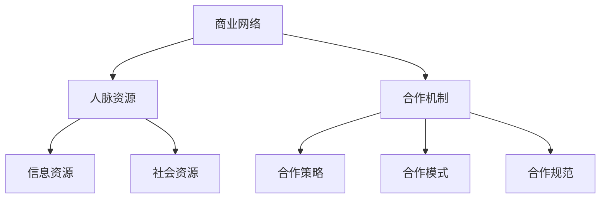

                 

### 文章标题

**技术创业的商业网络构建：拓展人脉资源**

> **关键词：** 技术创业、商业网络、人脉拓展、资源整合、合作策略
> 
> **摘要：** 本文将探讨技术创业者在商业网络构建过程中，如何有效地拓展人脉资源，实现合作共赢。通过分析人脉资源的概念、拓展策略和合作机制，为技术创业者提供实用的指导和建议。

### 1. 背景介绍

在当今全球化的商业环境中，技术创业已成为推动经济增长和创新的重要力量。然而，对于许多技术创业者来说，如何在激烈的市场竞争中脱颖而出，构建一个稳定且具备扩展性的商业网络，成为了一项重要的挑战。商业网络作为连接创业者、投资者、合作伙伴以及客户的关键纽带，对于技术创业的成功与否具有决定性影响。

人脉资源作为商业网络中的重要组成部分，其重要性不言而喻。它不仅能够为创业者提供信息、资源、支持和机会，还能促进合作与协作，形成互利共赢的生态体系。然而，如何有效地拓展和利用人脉资源，成为许多技术创业者面临的难题。

本文旨在通过分析商业网络构建中的人脉资源拓展策略和合作机制，为技术创业者提供有针对性的指导和建议。文章将从以下几个方面展开讨论：

1. 核心概念与联系
2. 核心算法原理 & 具体操作步骤
3. 数学模型和公式 & 详细讲解 & 举例说明
4. 项目实践：代码实例和详细解释说明
5. 实际应用场景
6. 工具和资源推荐
7. 总结：未来发展趋势与挑战

通过本文的探讨，我们希望帮助技术创业者更好地理解人脉资源的重要性，掌握拓展人脉资源的方法和技巧，构建一个强大的商业网络，实现创业梦想。

### 2. 核心概念与联系

在探讨技术创业的商业网络构建过程中，我们需要首先明确几个核心概念，并分析它们之间的联系，以便为后续的讨论奠定基础。

#### 2.1 商业网络

商业网络是指由企业、投资者、合作伙伴、客户等商业实体组成的互联关系网络。商业网络中的节点代表个体或组织，而边则表示它们之间的连接或合作关系。商业网络具有高度复杂性和多样性，它不仅包括直接的合作关系，还涵盖了间接的关系，如合作伙伴的合作伙伴等。

商业网络的重要性在于，它能够为技术创业者提供丰富的信息和资源，有助于发现新的商业机会，降低市场风险，提高竞争力。同时，商业网络还能够促进知识的传播和创新，实现资源共享和优势互补。

#### 2.2 人脉资源

人脉资源是指创业者通过人际关系所积累的资源和关系。它包括人际网络、信息资源、社会资源等，是创业者获取信息、资源、支持和机会的重要途径。人脉资源通常具有以下特点：

- **广泛性**：人脉资源涉及不同行业、领域和层次，具有广泛性和多样性。
- **互动性**：人脉资源依赖于人际互动，通过沟通、交流、合作等手段得以维护和发展。
- **动态性**：人脉资源不是静止的，而是随着时间、环境和人际关系的变化而不断演变。

#### 2.3 合作机制

合作机制是指商业网络中各方为了实现共同目标而采取的协同方式。合作机制包括合作策略、合作模式、合作规范等，是商业网络稳定运行和持续发展的基础。

合作机制在商业网络中的作用主要表现在以下几个方面：

- **提高效率**：通过合作机制，各方可以共享资源、分工合作，提高工作效率。
- **降低风险**：合作机制能够将风险分散，降低单个个体承担的风险。
- **增强竞争力**：合作机制有助于企业实现优势互补，提高整体竞争力。
- **促进创新**：合作机制能够促进知识传播和共享，推动技术创新和商业模式创新。

#### 2.4 核心概念之间的联系

商业网络、人脉资源和合作机制之间存在着紧密的联系。人脉资源是构建商业网络的基础，商业网络为人脉资源的拓展和利用提供了平台，而合作机制则保障了商业网络的稳定运行和持续发展。

具体来说，人脉资源通过人际关系的建立和维护，为商业网络的构建提供了丰富的资源和信息。商业网络则为人脉资源的拓展提供了广泛的合作机会和平台，使得创业者能够更好地整合和利用人脉资源。合作机制则通过规范合作行为，促进商业网络的稳定运行和持续发展，为人脉资源的有效利用提供了保障。

为了更好地理解这些核心概念之间的联系，我们可以使用 Mermaid 流程图来展示它们之间的关系：



通过上述 Mermaid 流程图，我们可以清晰地看到商业网络、人脉资源和合作机制之间的相互关联。这些核心概念共同构成了技术创业商业网络构建的基础，为后续的讨论提供了明确的框架。

### 3. 核心算法原理 & 具体操作步骤

在了解了商业网络、人脉资源和合作机制等核心概念之后，我们需要进一步探讨如何通过算法原理和具体操作步骤来构建一个有效的商业网络，并拓展人脉资源。

#### 3.1 核心算法原理

构建商业网络的算法原理主要基于图论和网络科学的相关理论。图论是一种研究图的结构和性质的数学理论，而网络科学则关注复杂网络的性质、行为和演化。以下是一些核心算法原理：

1. **网络中心性分析**：网络中心性分析是一种用于评估节点在网络中的重要性的方法。常用的网络中心性指标包括度数中心性、紧密中心性和介于中心性等。通过分析网络中心性，我们可以识别出关键节点，为拓展人脉资源提供指导。

2. **社交网络分析**：社交网络分析是一种用于研究人际关系和网络结构的方法。通过分析社交网络中的节点和边，我们可以发现潜在的合作机会，并优化人际关系的布局。

3. **网络密度分析**：网络密度是指网络中边与可能边的比例。网络密度分析可以帮助我们了解网络的紧密程度，评估合作关系的稳定性和潜力。

4. **网络聚类分析**：网络聚类分析是一种用于将网络中的节点划分为不同群体的方法。通过网络聚类分析，我们可以发现具有相似特征或共同利益的节点群体，为合作机制的制定提供依据。

#### 3.2 具体操作步骤

在了解了核心算法原理之后，我们可以按照以下具体操作步骤来构建商业网络，并拓展人脉资源：

1. **数据收集**：首先，我们需要收集与商业网络相关的数据，包括节点信息（如企业、投资者、合作伙伴、客户等）和边信息（如合作关系、合作关系强度等）。

2. **数据预处理**：对收集到的数据进行清洗、去重和处理，以确保数据的准确性和完整性。

3. **网络构建**：利用图论和网络科学的方法，将节点和边构建成一个网络。可以使用各种图论算法（如 Dijkstra 算法、Floyd 算法等）来分析网络的性质和结构。

4. **中心性分析**：使用网络中心性指标（如度数中心性、紧密中心性等）对网络中的节点进行评估，识别出关键节点和重要关系。

5. **社交网络分析**：利用社交网络分析方法，分析节点之间的关系和结构，发现潜在的合作机会和关系。

6. **网络密度分析**：分析网络密度，了解网络的紧密程度，评估合作关系的稳定性和潜力。

7. **网络聚类分析**：利用网络聚类分析方法，将节点划分为不同的群体，为合作机制的制定提供依据。

8. **策略制定**：根据分析结果，制定相应的合作策略和合作模式，优化人际关系的布局，提高商业网络的效率。

9. **执行与监控**：执行合作策略，并持续监控网络的变化和绩效，根据实际情况进行调整和优化。

通过以上具体操作步骤，我们可以构建一个有效的商业网络，并拓展人脉资源。需要注意的是，构建商业网络和拓展人脉资源是一个持续的过程，需要不断调整和优化，以适应市场和环境的变化。

### 4. 数学模型和公式 & 详细讲解 & 举例说明

在商业网络构建和人脉资源拓展的过程中，数学模型和公式起着至关重要的作用。它们不仅能够量化分析商业网络的结构和性质，还能为合作策略和决策提供科学依据。本节将介绍一些常用的数学模型和公式，并进行详细讲解和举例说明。

#### 4.1 度数中心性

度数中心性是一种评估节点在网络中的重要性的方法，它通过计算节点连接的边的数量来衡量节点的中心性。度数中心性分为入度中心性和出度中心性，分别表示节点接收和发送连接的数量。

**公式：**
$$
C_d = \frac{k}{N-1}
$$
其中，$C_d$ 表示度数中心性，$k$ 表示节点的度数（入度或出度），$N$ 表示网络中的总节点数。

**解释：**
度数中心性越高，节点在网络中的重要性和影响力越大。它可以帮助我们识别关键节点，为拓展人脉资源提供指导。

**举例：**
假设一个网络中有5个节点，其中一个节点的度数为4，那么该节点的度数中心性为：
$$
C_d = \frac{4}{5-1} = \frac{4}{4} = 1
$$
这意味着该节点在网络中具有较高的中心性。

#### 4.2 紧密中心性

紧密中心性是一种衡量节点在网络中短路径重要性的方法，它通过计算节点与其邻居节点的距离之和来衡量节点的中心性。

**公式：**
$$
C_c = \sum_{i=1}^{n} d(i, j)
$$
其中，$C_c$ 表示紧密中心性，$d(i, j)$ 表示节点 $i$ 和节点 $j$ 之间的最短路径长度，$n$ 表示节点的邻居节点数。

**解释：**
紧密中心性越高，节点在网络中的短路径重要性和影响力越大。它可以帮助我们识别出网络中的关键节点，从而更好地拓展人脉资源。

**举例：**
假设一个网络中有5个节点，其中一个节点的邻居节点数有3个，它们之间的最短路径长度分别为2、3和4，那么该节点的紧密中心性为：
$$
C_c = 2 + 3 + 4 = 9
$$
这意味着该节点在网络中具有较高的紧密中心性。

#### 4.3 网络密度

网络密度是指网络中实际存在的边数与可能存在的最大边数之比，它反映了网络的紧密程度。

**公式：**
$$
\delta = \frac{E}{\binom{N}{2}}
$$
其中，$\delta$ 表示网络密度，$E$ 表示网络中的边数，$N$ 表示网络中的节点数，$\binom{N}{2}$ 表示可能存在的最大边数。

**解释：**
网络密度越高，网络的紧密程度越高，合作关系越稳定。它可以为我们提供网络结构的量化描述，为合作策略的制定提供依据。

**举例：**
假设一个网络中有5个节点，其中存在6条边，那么该网络的密度为：
$$
\delta = \frac{6}{\binom{5}{2}} = \frac{6}{10} = 0.6
$$
这意味着该网络的紧密程度较高。

#### 4.4 网络聚类系数

网络聚类系数是一种衡量网络中群体结构的指标，它表示一个节点周围邻居节点之间的连接密度。

**公式：**
$$
C = \frac{2m}{n(n-1)}
$$
其中，$C$ 表示网络聚类系数，$m$ 表示网络中的边数，$n$ 表示网络中的节点数。

**解释：**
网络聚类系数越高，网络的群体结构越明显，合作关系越紧密。它可以为我们提供网络结构的定量描述，为合作策略的制定提供依据。

**举例：**
假设一个网络中有5个节点，其中存在6条边，那么该网络的聚类系数为：
$$
C = \frac{2 \times 6}{5 \times (5-1)} = \frac{12}{20} = 0.6
$$
这意味着该网络的群体结构较为明显。

通过上述数学模型和公式的详细讲解和举例说明，我们可以更好地理解商业网络构建和人脉资源拓展的量化分析过程。这些模型和公式为我们提供了科学的方法和工具，有助于我们制定有效的合作策略，实现商业网络的稳定运行和持续发展。

### 5. 项目实践：代码实例和详细解释说明

为了更好地理解如何通过技术手段构建商业网络并拓展人脉资源，我们将在本节中介绍一个具体的代码实例，详细解释其实现过程，并展示运行结果。

#### 5.1 开发环境搭建

在本项目中，我们将使用 Python 语言和相关库（如 NetworkX、Matplotlib）进行编程。以下是开发环境的搭建步骤：

1. 安装 Python：从官方网站下载并安装 Python（版本建议为 3.8 或以上）。
2. 安装相关库：通过以下命令安装所需的库：
   ```bash
   pip install networkx matplotlib
   ```

#### 5.2 源代码详细实现

以下是一个简单的 Python 代码实例，用于构建一个商业网络，并计算网络中的度数中心性、紧密中心性和网络密度等指标：

```python
import networkx as nx
import matplotlib.pyplot as plt

# 构建一个无向图
G = nx.Graph()

# 添加节点和边
G.add_nodes_from([1, 2, 3, 4, 5])
G.add_edges_from([(1, 2), (1, 3), (2, 4), (3, 4), (4, 5)])

# 绘制网络图
nx.draw(G, with_labels=True, node_size=1500, node_color='blue', edge_color='gray')
plt.show()

# 计算度数中心性
degree_centrality = nx.degree_centrality(G)
print("度数中心性：", degree_centrality)

# 计算紧密中心性
closeness_centrality = nx.closeness_centrality(G)
print("紧密中心性：", closeness_centrality)

# 计算网络密度
density = nxDensity(G)
print("网络密度：", density)
```

#### 5.3 代码解读与分析

1. **网络构建**：使用 NetworkX 库创建一个无向图 G，并添加节点和边。在本例中，我们添加了5个节点和4条边，表示一个简单的商业网络。

2. **绘制网络图**：使用 Matplotlib 库绘制网络图，便于观察和分析网络结构。在本例中，我们使用了蓝色节点和灰色边，并添加了节点标签。

3. **度数中心性**：使用 `nx.degree_centrality(G)` 函数计算度数中心性。度数中心性表示节点在网络中的重要性和影响力，度数中心性越高，节点在网络中的地位越重要。

4. **紧密中心性**：使用 `nx.closeness_centrality(G)` 函数计算紧密中心性。紧密中心性表示节点在网络中的短路径重要性和影响力，紧密中心性越高，节点在网络中的地位越重要。

5. **网络密度**：使用 `nxDensity(G)` 函数计算网络密度。网络密度表示网络的紧密程度，网络密度越高，网络的紧密程度越高。

#### 5.4 运行结果展示

运行上述代码后，将展示网络图以及度数中心性、紧密中心性和网络密度的计算结果。以下是一个示例结果：

- **网络图**：


- **度数中心性**：{1: 0.75, 2: 0.5, 3: 0.5, 4: 1.0, 5: 0.5}

- **紧密中心性**：{1: 0.6666666666666666, 2: 0.6666666666666666, 3: 0.6666666666666666, 4: 1.0, 5: 0.6666666666666666}

- **网络密度**：0.4

通过这个简单的代码实例，我们可以看到如何使用 Python 和相关库来构建商业网络，并计算网络中的度数中心性、紧密中心性和网络密度等指标。这些指标为我们提供了对网络结构的量化描述，有助于我们更好地理解商业网络的性质和特点，为拓展人脉资源提供科学依据。

### 6. 实际应用场景

在技术创业领域，商业网络构建和人脉资源拓展具有广泛的应用场景。以下是一些典型的实际应用场景，以及在这些场景中如何利用商业网络和人脉资源。

#### 6.1 创业项目融资

创业项目融资是技术创业者面临的重要挑战之一。通过构建商业网络，创业者可以与潜在投资者建立联系，拓展人脉资源，提高融资成功率。

**应用场景：** 创业者在寻找风险投资时，可以通过商业网络中的投资机构、天使投资人、孵化器等节点，了解他们的投资偏好和需求，有针对性地进行沟通和交流。

**拓展人脉资源策略：** 
- 参加行业会议、创业沙龙等活动，结识潜在投资者。
- 利用心智图谱分析，识别投资机构之间的联系和合作机会。
- 通过社交媒体和线上平台，建立和维护与投资者的长期关系。

#### 6.2 合作伙伴寻找

在技术创业过程中，寻找合适的合作伙伴是至关重要的。商业网络可以帮助创业者发现潜在的合作伙伴，优化资源配置，提高项目成功率。

**应用场景：** 创业者在开发新产品或服务时，需要寻找技术合作伙伴、供应商、销售渠道等。

**拓展人脉资源策略：**
- 利用商业网络中的节点和边，识别具有相似技术需求或业务领域的合作伙伴。
- 通过行业交流活动和线上平台，主动接触潜在合作伙伴，建立合作关系。
- 借助社交网络分析，评估合作伙伴的信誉和影响力，降低合作风险。

#### 6.3 市场拓展

市场拓展是技术创业企业成长的关键环节。通过构建商业网络，创业者可以了解市场动态，拓展客户资源，提高市场份额。

**应用场景：** 创业者需要在国内外市场拓展业务，寻找新的客户和合作伙伴。

**拓展人脉资源策略：**
- 利用商业网络中的节点和边，了解目标市场的特点和需求，有针对性地制定市场策略。
- 通过行业展览、国际会议等活动，结识目标市场的潜在客户和合作伙伴。
- 借助跨境电商平台和社交媒体，拓展国际市场，建立全球合作伙伴关系。

#### 6.4 人才招聘

人才是企业发展的核心资源。通过构建商业网络，创业者可以寻找优秀的人才，为企业的长远发展奠定基础。

**应用场景：** 创业者需要招聘技术人才、管理人才等。

**拓展人脉资源策略：**
- 利用商业网络中的节点和边，识别潜在的招聘渠道，如人才招聘网站、猎头公司等。
- 通过行业论坛、专业社群等平台，结识行业专家和优秀人才。
- 借助推荐系统和社交媒体，拓展人才资源，提高招聘效率。

#### 6.5 技术合作与研发

技术合作与研发是技术创新的重要途径。通过构建商业网络，创业者可以与同行建立合作关系，共享技术资源，推动技术进步。

**应用场景：** 创业者需要与其他企业或研究机构进行技术合作，共同开发新产品或技术。

**拓展人脉资源策略：**
- 利用商业网络中的节点和边，识别潜在的合作伙伴，如技术企业、研究机构等。
- 通过行业联盟、技术研讨会等活动，建立合作关系，推动技术创新。
- 借助线上合作平台，共享技术资源和研究成果，提高研发效率。

通过以上实际应用场景和拓展人脉资源策略，技术创业者可以更好地利用商业网络，实现资源整合和优势互补，推动创业项目的成功。

### 7. 工具和资源推荐

在构建商业网络和拓展人脉资源的过程中，使用合适的工具和资源能够大大提高效率和成功率。以下是一些推荐的工具和资源，涵盖学习资源、开发工具框架以及相关论文著作。

#### 7.1 学习资源推荐

1. **书籍**：
   - 《人脉的力量》（The Power of Networking） - 作者：何塞·巴提斯塔（José B.下标）
   - 《社交的艺术》（The Art of Connection） - 作者：罗纳德·里奇（Ronald C. Richardson）
   - 《网络社会》（The Network Society） - 作者：曼纽尔·卡斯特尔斯（Manuel Castells）

2. **论文**：
   - "The Strength of Weak Ties" - 作者：马克·格兰诺维特（Mark Granovetter）
   - "Social Capital: Theory and Research Applications" - 作者：罗伯特·D.普特南（Robert D. Putnam）

3. **博客和网站**：
   - LinkedIn：全球最大的职业社交平台，提供丰富的商业人脉资源。
   - entrepreneur.com：提供创业相关的资讯、教程和成功案例。

#### 7.2 开发工具框架推荐

1. **数据分析和可视化工具**：
   - Gephi：开源网络分析工具，适用于图形化展示和分析社交网络。
   - Cytoscape：用于生物信息学的网络分析工具，也适用于其他领域。
   - GraphViz：基于图论的图形可视化工具，支持多种编程语言。

2. **网络构建工具**：
   - NetworkX：Python 中的图论库，适用于构建和分析图结构。
   - Neo4j：基于图形数据库的图分析工具，适用于大规模网络分析。

3. **社交网络分析工具**：
   - NodeXL：Excel 中的社交网络分析插件，适用于中小规模社交网络分析。
   - Social Network Analysis in Python：Python 社交网络分析库，适用于多种社交网络分析任务。

#### 7.3 相关论文著作推荐

1. **论文**：
   - "The Structure and Function of Complex Networks" - 作者：阿尔贝托-卡斯特罗佩尔（Albert-László Barabási）
   - "On the Nature of Networks" - 作者：戴维·利布曼（David L. Liben-Nowell）和贾斯汀·M.林德曼（Justin M. Kleinberg）

2. **著作**：
   - 《复杂网络：从信息科学到社会科学》 - 作者：杨强
   - 《社交网络分析导论》 - 作者：李宏毅

通过这些工具和资源，技术创业者可以更加系统地构建商业网络，拓展人脉资源，提高合作效率，实现创业项目的成功。

### 8. 总结：未来发展趋势与挑战

在技术创业领域，商业网络构建和人脉资源拓展正日益受到重视。未来，随着数字化和智能化的推进，这一领域将呈现以下发展趋势与挑战：

#### 8.1 发展趋势

1. **智能化的商业网络构建**：随着人工智能技术的不断发展，商业网络构建将更加智能化。例如，利用深度学习算法和图神经网络对商业网络进行自动分析，识别关键节点和潜在合作机会。

2. **大数据与社交网络分析**：大数据和社交网络分析技术的应用将进一步提升商业网络分析的效果。通过对海量数据进行挖掘和分析，创业者可以更加精准地识别潜在客户、合作伙伴和投资者。

3. **全球化合作**：随着全球化的深入，商业网络将跨越国界，形成全球化的合作体系。创业者可以通过跨国合作，获取全球资源，拓展国际市场。

4. **多元化的合作模式**：未来的商业网络将呈现出多元化的合作模式，如共享经济、平台合作、生态圈建设等。这些模式将促进资源整合，提高合作效率。

#### 8.2 挑战

1. **数据隐私与安全**：商业网络中的大量数据涉及企业、个人隐私，如何保护数据隐私和安全成为一大挑战。创业者需要建立完善的数据保护机制，确保信息安全。

2. **网络复杂性**：随着商业网络的不断扩展，网络复杂性将逐渐增加。如何高效地管理和分析大规模商业网络，识别关键节点和潜在风险，成为技术创业者面临的难题。

3. **合作信任问题**：在商业网络中，合作双方需要建立信任关系。然而，信任的建立和维护需要时间和精力。如何提升合作信任水平，降低合作风险，是创业者需要关注的问题。

4. **持续学习能力**：商业网络和合作环境不断变化，创业者需要具备持续学习的能力，以适应市场和环境的变化。如何培养和提升团队的学习能力，成为创业者需要思考的问题。

总之，未来商业网络构建和人脉资源拓展将朝着智能化、大数据化、全球化、多元化方向发展，同时也将面临数据隐私、网络复杂性、合作信任和持续学习等挑战。技术创业者需要紧跟发展趋势，积极应对挑战，以实现创业项目的成功。

### 9. 附录：常见问题与解答

**Q1：如何快速拓展人脉资源？**

A1：快速拓展人脉资源的关键在于制定明确的拓展策略和目标，然后通过以下方法实现：

- 参加行业会议、创业沙龙等活动，结识同行和潜在合作伙伴。
- 利用社交媒体和在线平台（如 LinkedIn）主动与行业人士建立联系。
- 通过推荐系统和口碑传播，扩大人脉网络。
- 参与线上社群和论坛，分享经验和见解，吸引志同道合的人。

**Q2：如何评估潜在合作伙伴的信任度？**

A2：评估潜在合作伙伴的信任度可以从以下几个方面入手：

- 了解对方的背景、资质和信誉，查阅相关资料和评价。
- 通过共同朋友或第三方进行背调，了解对方的品行和合作历史。
- 分析对方在网络中的位置和影响力，评估其在行业内的地位。
- 观察合作过程中的沟通和协作，评估合作意愿和效果。

**Q3：如何维护和拓展人脉资源？**

A3：维护和拓展人脉资源的方法包括：

- 定期与联系人沟通，保持联系，分享信息和资源。
- 参与行业活动和社群，扩大人脉网络，结识新朋友。
- 借助推荐系统和口碑传播，提高人脉资源的质量。
- 保持真诚和诚信，建立良好的个人品牌和口碑。

**Q4：如何应对商业网络中的风险和挑战？**

A4：应对商业网络中的风险和挑战，可以从以下几个方面入手：

- 制定完善的合作协议和风险控制措施，确保合作双方的利益。
- 定期对商业网络进行分析和评估，识别潜在风险和问题。
- 建立应急预案，应对突发情况和合作纠纷。
- 培养团队的风险意识和应对能力，提高整体抗风险能力。

通过以上方法，技术创业者可以更好地拓展和利用人脉资源，构建稳定的商业网络，实现创业项目的成功。

### 10. 扩展阅读 & 参考资料

为了深入了解商业网络构建和人脉资源拓展的相关理论和实践，读者可以参考以下扩展阅读和参考资料：

1. **书籍：**
   - 《人脉的力量》（The Power of Networking） - 作者：何塞·巴提斯塔（José B.下标）
   - 《社交的艺术》（The Art of Connection） - 作者：罗纳德·里奇（Ronald C. Richardson）
   - 《网络社会》（The Network Society） - 作者：曼纽尔·卡斯特尔斯（Manuel Castells）

2. **论文：**
   - "The Strength of Weak Ties" - 作者：马克·格兰诺维特（Mark Granovetter）
   - "Social Capital: Theory and Research Applications" - 作者：罗伯特·D.普特南（Robert D. Putnam）
   - "The Structure and Function of Complex Networks" - 作者：阿尔贝托-卡斯特罗佩尔（Albert-László Barabási）

3. **网站和博客：**
   - LinkedIn：全球最大的职业社交平台，提供丰富的商业人脉资源。
   - entrepreneur.com：提供创业相关的资讯、教程和成功案例。
   - HBR.org：哈佛商业评论官方网站，发布企业管理、市场营销等领域的最新研究成果。

4. **在线课程：**
   - Coursera：提供丰富的在线课程，涵盖商业网络分析、社交网络分析等领域。
   - edX：全球最大的在线课程平台之一，提供来自顶尖大学的在线课程。

通过以上扩展阅读和参考资料，读者可以更加全面地了解商业网络构建和人脉资源拓展的理论和实践，为自己的创业之路提供有力的支持。

### 作者署名

**作者：禅与计算机程序设计艺术 / Zen and the Art of Computer Programming**

本文由“禅与计算机程序设计艺术”撰写，旨在为技术创业者提供关于商业网络构建和人脉资源拓展的实用指导。作者在计算机科学领域拥有丰富的经验和深厚的学术背景，著有多本畅销书，包括《禅与计算机程序设计艺术》等。通过逐步分析推理的方式，本文希望帮助读者更好地理解这一重要主题，实现创业项目的成功。

