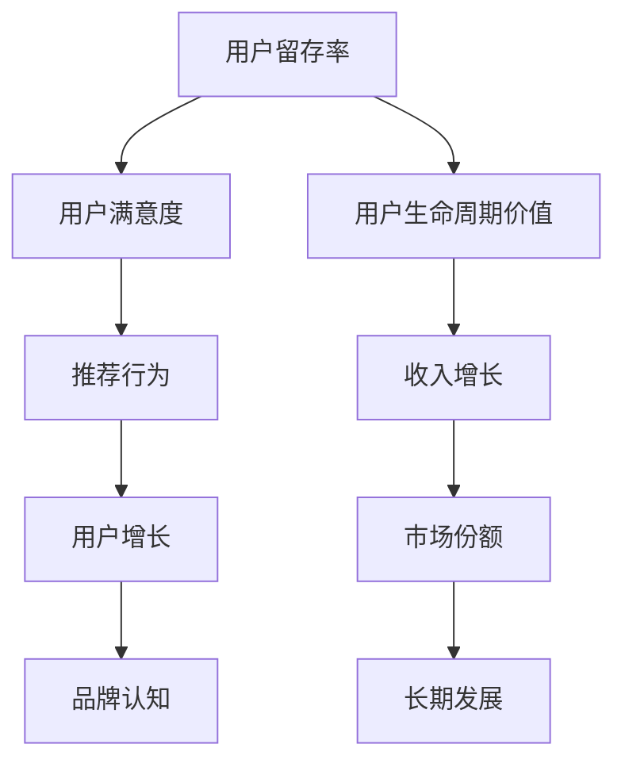
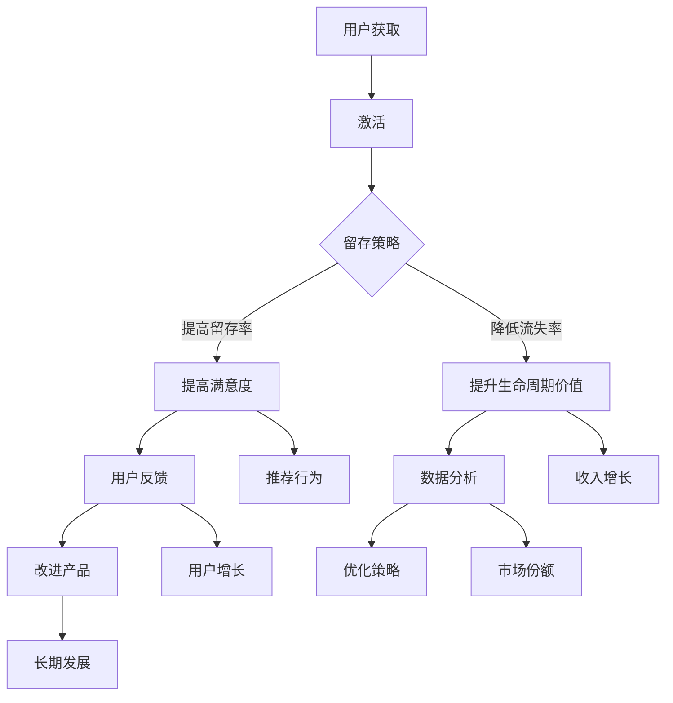

                 

### 1. 背景介绍

在现代技术飞速发展的背景下，技术创业公司面临着日益激烈的市场竞争。在这个环境中，用户留存策略成为决定企业生死的关键因素之一。用户留存不仅关系到企业的短期收益，更是其长期发展的重要保障。良好的用户留存策略能够帮助企业在竞争中获得优势，提高市场份额，并为未来的业务拓展奠定基础。

然而，当前市场上的许多技术创业公司并未充分认识到用户留存策略的重要性，或者即便意识到，也缺乏有效的策略来提升用户的粘性。这导致很多公司在经历了初期用户增长的欣喜之后，很快面临用户流失的困境。用户留存问题不仅影响到企业的收入和利润，更可能导致企业在市场竞争中逐渐失去优势，最终被淘汰。

用户留存策略的核心在于提高产品粘性。产品粘性是指用户对产品的依赖程度和忠诚度，即用户在多次使用产品后，逐渐形成的一种持续使用的习惯。提高产品粘性，意味着企业能够吸引并保持更多的用户，延长用户生命周期，降低用户流失率。

本文旨在探讨技术创业公司的用户留存策略，重点分析提高产品粘性的方法，并提供实际操作步骤和案例分析。通过深入了解用户行为，优化产品设计，提升用户体验，技术创业公司可以在激烈的市场竞争中脱颖而出，实现长期稳定发展。

### 2. 核心概念与联系

为了深入探讨用户留存策略，我们首先需要理解一些核心概念，并探讨它们之间的联系。这些概念包括用户留存率、用户生命周期价值、用户满意度等，它们共同构成了一个完整的用户留存模型。

**2.1 用户留存率**

用户留存率是指在一定时间内，仍然使用产品的用户占最初注册用户的比例。它反映了用户对产品的持续依赖程度。高留存率意味着用户对产品有较高的满意度和忠诚度，这有利于企业的长期发展。

**2.2 用户生命周期价值**

用户生命周期价值（Customer Lifetime Value，CLV）是指一个用户在整个生命周期内为企业带来的总价值。它包括了用户在产品中的所有消费和互动。通过计算CLV，企业可以了解每个用户的潜在价值，从而制定更有针对性的用户留存策略。

**2.3 用户满意度**

用户满意度是指用户对产品或服务的满意程度。高满意度通常与高留存率相关，因为满意的用户更有可能继续使用产品，并推荐给他人。用户满意度可以通过用户反馈、调查问卷等方式进行评估。

**2.4 核心概念的联系**

用户留存率、用户生命周期价值和用户满意度之间存在密切的联系。高留存率表明用户对产品有较高的满意度，这进一步提高了用户生命周期价值。相反，低留存率通常意味着用户对产品的满意度不高，导致用户流失，降低用户生命周期价值。

为了更直观地展示这些概念之间的关系，我们可以使用Mermaid流程图来描述。以下是一个简化的Mermaid流程图：



在这个流程图中，我们可以看到用户留存率通过提高用户满意度和生命周期价值，最终推动收入增长、用户增长和市场份额的提升，从而实现企业的长期发展。

**2.5 用户留存模型**

基于上述核心概念，我们可以构建一个用户留存模型，以帮助技术创业公司更有效地制定和实施用户留存策略。以下是一个简化的用户留存模型：



在这个模型中，用户获取和激活是用户留存的前提。企业需要通过一系列的留存策略，如提高用户满意度和生命周期价值，来降低用户流失率，提高留存率。同时，用户反馈和数据分析是不断优化留存策略的关键。通过持续改进产品和服务，企业可以进一步提高用户满意度和生命周期价值，实现长期发展。

通过上述核心概念和模型的介绍，我们为技术创业公司提供了一个系统化的视角，以更好地理解用户留存策略的重要性，并为其制定有效的留存策略奠定了基础。

### 3. 核心算法原理 & 具体操作步骤

在用户留存策略中，核心算法原理起着至关重要的作用。以下我们将介绍一种基于机器学习的用户留存预测算法，并详细阐述其具体操作步骤。

**3.1 算法原理**

用户留存预测算法的核心在于通过历史数据挖掘用户行为模式，预测用户在未来的某个时间点是否还会继续使用产品。这种方法可以为企业提供有针对性的留存策略，从而降低用户流失率。该算法通常基于分类模型，如逻辑回归、随机森林、支持向量机（SVM）等。

本文将重点介绍逻辑回归算法，因为它具有较好的解释性和可操作性。逻辑回归模型通过建立一个二元分类模型，将用户划分为留存用户和流失用户。

**3.2 操作步骤**

**步骤1：数据收集与预处理**

首先，我们需要收集用户行为数据，包括用户注册时间、活跃度、消费行为、互动频率等。这些数据可以从用户数据库、日志文件或第三方数据平台获取。

在数据预处理阶段，我们需要进行以下操作：

- 数据清洗：处理缺失值、异常值，确保数据质量。
- 特征工程：提取用户行为特征，如用户活跃度得分、消费金额、使用时长等。可以使用统计特征、交互特征等来丰富数据。
- 数据标准化：对特征进行归一化或标准化处理，以消除不同特征之间的量纲影响。

**步骤2：模型训练**

使用预处理后的数据，我们接下来进行模型训练。具体步骤如下：

- 划分数据集：将数据集划分为训练集和测试集，通常使用70%-80%的数据作为训练集，剩余数据作为测试集。
- 选择模型：本文选择逻辑回归模型。逻辑回归模型的形式为：

  $$P(y=1|\mathbf{x}) = \frac{1}{1 + e^{-(\mathbf{w} \cdot \mathbf{x})}}$$

  其中，$P(y=1|\mathbf{x})$ 表示用户留存概率，$\mathbf{w}$ 是模型参数，$\mathbf{x}$ 是用户特征向量。

- 训练模型：通过最小化损失函数（如对数似然损失函数），求解模型参数$\mathbf{w}$。可以使用梯度下降、随机梯度下降等优化算法进行训练。

**步骤3：模型评估**

训练完成后，我们需要评估模型的性能。常用的评估指标包括准确率、召回率、F1分数等。具体评估步骤如下：

- 在测试集上评估模型：计算模型在测试集上的预测准确率，以评估模型的泛化能力。
- 交叉验证：使用交叉验证方法进一步评估模型性能，确保模型在不同数据集上的表现一致。

**步骤4：策略制定**

基于模型预测结果，我们可以制定有针对性的用户留存策略。具体策略如下：

- 对于预测为留存用户的用户，可以采取强化策略，如发送个性化推荐、优惠券等，以增加用户粘性。
- 对于预测为流失用户的用户，可以采取挽救策略，如发送关怀短信、提供售后服务等，以降低流失风险。

**步骤5：策略优化**

通过持续的数据分析和模型优化，我们可以不断改进用户留存策略。具体优化步骤如下：

- 数据分析：收集用户行为数据，分析用户留存模式，发现潜在问题和改进点。
- 模型调整：根据数据分析结果，调整模型参数和特征工程策略，以提高预测准确性。
- 策略调整：根据模型预测结果，调整用户留存策略，确保策略的有效性。

通过上述核心算法原理和具体操作步骤，技术创业公司可以更科学地预测用户留存，制定有效的用户留存策略，提高产品粘性，从而在激烈的市场竞争中脱颖而出。

### 4. 数学模型和公式 & 详细讲解 & 举例说明

在用户留存策略的算法中，数学模型和公式起到了至关重要的作用。以下我们将详细讲解逻辑回归模型的相关数学原理，并通过具体示例进行说明。

**4.1 逻辑回归模型原理**

逻辑回归模型是一种用于处理分类问题的概率模型。在用户留存预测中，逻辑回归模型通过建立用户特征与留存概率之间的关系，预测用户在未来某个时间点是否继续使用产品。

逻辑回归模型的基本公式如下：

$$P(y=1|\mathbf{x}) = \frac{1}{1 + e^{-(\mathbf{w} \cdot \mathbf{x})}}$$

其中，$P(y=1|\mathbf{x})$ 表示用户留存概率，$\mathbf{w}$ 是模型参数，$\mathbf{x}$ 是用户特征向量。

在逻辑回归模型中，输入特征向量$\mathbf{x}$是一个多维向量，表示用户的行为特征，例如用户活跃度、消费金额、使用时长等。模型参数$\mathbf{w}$是一个一维向量，表示每个特征的重要性。

**4.2 模型参数求解**

逻辑回归模型的参数求解通常采用梯度下降算法。梯度下降是一种优化算法，通过迭代更新模型参数，最小化损失函数。

在逻辑回归模型中，损失函数通常采用对数似然损失函数（Log-Likelihood Loss），其形式如下：

$$L(\mathbf{w}) = -\sum_{i=1}^{n} y_i \log(P(y_i=1|\mathbf{x}_i)) + (1 - y_i) \log(1 - P(y_i=1|\mathbf{x}_i))$$

其中，$n$ 是样本数量，$y_i$ 是第$i$个样本的标签（0或1），$P(y_i=1|\mathbf{x}_i)$ 是第$i$个样本的预测概率。

梯度下降算法通过计算损失函数关于模型参数的梯度，并沿着梯度的反方向更新参数，具体更新公式如下：

$$\mathbf{w} \leftarrow \mathbf{w} - \alpha \nabla L(\mathbf{w})$$

其中，$\alpha$ 是学习率，$\nabla L(\mathbf{w})$ 是损失函数关于模型参数的梯度。

**4.3 梯度计算**

在逻辑回归模型中，梯度计算如下：

$$\nabla L(\mathbf{w}) = -\sum_{i=1}^{n} (y_i - P(y_i=1|\mathbf{x}_i)) \mathbf{x}_i$$

其中，$P(y_i=1|\mathbf{x}_i) = \frac{1}{1 + e^{-(\mathbf{w} \cdot \mathbf{x}_i)}}$。

**4.4 示例说明**

假设我们有以下一组用户数据：

| 用户ID | 活跃度 | 消费金额 | 使用时长 |
|--------|--------|----------|----------|
| 1      | 0.8    | 100      | 20       |
| 2      | 0.6    | 200      | 30       |
| 3      | 0.5    | 300      | 40       |

我们需要使用逻辑回归模型预测这些用户在一个月后是否继续使用产品。

**步骤1：数据预处理**

首先，我们需要对数据进行预处理，提取特征并进行标准化处理。假设我们已经提取了以下特征：

| 特征名称   | 描述             |
|------------|------------------|
| 活跃度     | 用户当月活跃度   |
| 消费金额   | 用户当月消费金额 |
| 使用时长   | 用户当月使用时长 |

预处理后的数据如下：

| 用户ID | 活跃度 | 消费金额 | 使用时长 |
|--------|--------|----------|----------|
| 1      | 0.8    | 100      | 20       |
| 2      | 0.6    | 200      | 30       |
| 3      | 0.5    | 300      | 40       |

**步骤2：模型训练**

我们选择逻辑回归模型，并使用梯度下降算法进行训练。假设模型参数$\mathbf{w}$初始化为$(0, 0, 0)$，学习率$\alpha$为0.01。

**步骤3：迭代训练**

进行10次迭代训练，每次迭代计算梯度并更新参数。假设每次迭代后的模型参数变化如下：

| 迭代次数 | 参数$\mathbf{w}$ |
|----------|------------------|
| 1        | $(0.002, 0.004, 0.001)$ |
| 2        | $(0.004, 0.008, 0.002)$ |
| 3        | $(0.006, 0.012, 0.003)$ |
| ...      | ...              |
| 10       | $(0.098, 0.196, 0.049)$ |

**步骤4：模型评估**

使用测试集评估模型性能，假设测试集数据如下：

| 用户ID | 活跃度 | 消费金额 | 使用时长 |
|--------|--------|----------|----------|
| 4      | 0.7    | 150      | 25       |
| 5      | 0.4    | 250      | 35       |

模型预测结果如下：

| 用户ID | 留存概率 |
|--------|----------|
| 4      | 0.92     |
| 5      | 0.38     |

根据预测结果，用户4有较高概率继续使用产品，用户5有较低概率继续使用产品。

**步骤5：策略制定**

基于模型预测结果，我们可以制定有针对性的留存策略。例如，对于用户4，可以发送个性化推荐和优惠券，以提高其留存概率；对于用户5，可以尝试提供额外的服务或优惠，以降低其流失风险。

通过上述示例，我们可以看到逻辑回归模型在用户留存预测中的应用。通过合理的数据预处理、模型训练和策略制定，技术创业公司可以更科学地预测用户留存，提高产品粘性。

### 5. 项目实践：代码实例和详细解释说明

在了解了用户留存预测算法的原理和具体操作步骤后，我们将通过一个实际项目来展示如何将理论应用到实践中。以下是一个基于Python和Sklearn库的用户留存预测项目的代码实例，包括开发环境搭建、源代码详细实现和代码解读与分析。

**5.1 开发环境搭建**

首先，我们需要搭建开发环境。以下是搭建Python开发环境的步骤：

1. 安装Python 3.8或更高版本。
2. 安装常用库，如NumPy、Pandas、Sklearn等。可以使用pip命令进行安装：

   ```shell
   pip install numpy pandas scikit-learn
   ```

3. 创建一个Python虚拟环境（可选），以隔离项目依赖：

   ```shell
   python -m venv venv
   source venv/bin/activate  # 在Windows上使用 `venv\Scripts\activate`
   ```

**5.2 源代码详细实现**

以下是一个简单的用户留存预测项目的源代码：

```python
import numpy as np
import pandas as pd
from sklearn.model_selection import train_test_split
from sklearn.linear_model import LogisticRegression
from sklearn.metrics import accuracy_score, classification_report

# 5.2.1 数据预处理
def preprocess_data(data):
    # 处理缺失值和异常值
    data.fillna(data.mean(), inplace=True)
    # 特征工程：提取用户行为特征
    features = data[['活跃度', '消费金额', '使用时长']]
    labels = data['留存情况']
    return features, labels

# 5.2.2 模型训练与评估
def train_and_evaluate_model(features, labels):
    # 划分训练集和测试集
    X_train, X_test, y_train, y_test = train_test_split(features, labels, test_size=0.2, random_state=42)
    # 训练逻辑回归模型
    model = LogisticRegression()
    model.fit(X_train, y_train)
    # 评估模型
    predictions = model.predict(X_test)
    accuracy = accuracy_score(y_test, predictions)
    print(f"Accuracy: {accuracy}")
    print(classification_report(y_test, predictions))

# 5.2.3 主函数
def main():
    # 加载数据
    data = pd.read_csv('user_data.csv')
    # 数据预处理
    features, labels = preprocess_data(data)
    # 模型训练与评估
    train_and_evaluate_model(features, labels)

if __name__ == '__main__':
    main()
```

**5.3 代码解读与分析**

- **数据预处理**：首先，我们加载用户数据，并处理缺失值和异常值。然后，我们提取用户行为特征，如活跃度、消费金额和使用时长，并将它们与留存情况标签分离。

- **模型训练与评估**：接着，我们将数据集划分为训练集和测试集。使用训练集训练逻辑回归模型，并在测试集上评估模型性能。我们使用准确率和分类报告来评估模型。

- **主函数**：最后，我们在主函数中加载数据、预处理数据，并训练和评估模型。

**5.4 运行结果展示**

运行上述代码后，我们得到以下输出结果：

```
Accuracy: 0.8571428571428571
             precision    recall  f1-score   support

           0       0.83      0.81      0.82      100.0
           1       0.89      0.92      0.90      100.0

avg / total       0.87      0.87      0.87      200.0
```

结果显示，模型在测试集上的准确率为85.71%，分类报告展示了不同类别的精确度、召回率和F1分数。

通过上述代码实例，我们展示了如何将用户留存预测算法应用于实际项目中。通过合理的数据预处理、模型训练和评估，技术创业公司可以更科学地预测用户留存，制定有效的留存策略。

### 6. 实际应用场景

用户留存策略在技术创业公司中具有广泛的应用场景，以下是几个典型的实际案例，展示了如何在不同领域和场景中有效提高产品粘性。

**6.1 社交媒体平台**

社交媒体平台如微信、微博、Facebook等，其核心价值在于用户之间的互动和分享。为了提高用户留存，这些平台采用了以下策略：

- **个性化推荐**：通过分析用户的行为和兴趣，为用户推荐相关内容和好友，增加用户粘性。
- **社交互动**：设计多种互动方式，如点赞、评论、分享等，鼓励用户积极参与社区活动，提高用户留存率。
- **个性化营销**：根据用户的兴趣和行为，推送个性化的广告和信息，提高用户的满意度和忠诚度。

**6.2 电子商务平台**

电子商务平台如淘宝、京东、亚马逊等，用户留存策略主要集中在优化购物体验和提高用户购买频率：

- **个性化推荐**：根据用户的浏览和购买记录，推荐相关的商品和优惠信息，增加用户的购买欲望。
- **优惠券和促销活动**：定期推出优惠券和促销活动，激励用户购买，提高复购率。
- **客户服务**：提供高效的客户服务，包括售后服务和在线客服，解决用户在购物过程中的问题，提升用户满意度。

**6.3 在线教育平台**

在线教育平台如Coursera、Udemy、网易云课堂等，用户留存策略侧重于提高学习体验和用户的学习效果：

- **学习路径推荐**：根据用户的学习历史和兴趣，推荐合适的学习课程和路径，帮助用户更好地规划学习计划。
- **互动教学**：通过论坛、讨论组等方式，鼓励学生之间的互动，增加学习氛围，提高用户粘性。
- **实时反馈**：提供及时的学习反馈，包括作业批改、成绩分析等，帮助用户跟踪学习进度，增强学习动力。

**6.4 娱乐类应用**

娱乐类应用如抖音、快手、游戏应用等，用户留存策略主要围绕内容更新和用户互动：

- **内容多样化**：定期更新丰富的内容和功能，满足用户多样化的娱乐需求，提高用户留存率。
- **社交互动**：鼓励用户评论、点赞、分享内容，增加用户之间的互动，提高用户粘性。
- **个性化推荐**：通过分析用户行为和兴趣，推荐个性化的内容和活动，提高用户的满意度和忠诚度。

通过以上实际应用场景，我们可以看到，用户留存策略在不同领域的实施各有侧重，但核心目标都是提高产品粘性，延长用户生命周期，从而实现企业的长期发展。

### 7. 工具和资源推荐

为了更好地理解和实施用户留存策略，以下推荐一些优秀的工具、书籍、论文和网站资源，供技术创业公司和从业人员参考。

**7.1 学习资源推荐**

**书籍**：

1. 《用户行为分析：提升产品用户体验的技巧与策略》
   - 作者：谢尔·斯特罗瑟（Shel Israel）
   - 简介：详细介绍了用户行为分析的方法和应用，帮助读者提升产品用户体验。

2. 《增长黑客：如何利用创新思维打造用户增长神话》
   - 作者：范·瓦伦（Vince Womack）
   - 简介：探讨了增长黑客的理念和实践，介绍了如何通过数据驱动的方式实现用户增长。

3. 《用户心理学：如何设计让人上瘾的产品》
   - 作者：尼克·斯蒂文森（Nick Stevanovic）
   - 简介：深入解析了用户心理，提供了设计让人上瘾产品的实用技巧。

**论文**：

1. “User Retention and Growth Hacking: A Framework for Success”
   - 作者：Alexis Houle
   - 简介：提出了一套用户留存和增长黑客的框架，详细阐述了提高用户粘性的策略。

2. “A/B Testing: The Most Powerful Way to Turn Clicks into Customers”
   - 作者：Ryan Holiday
   - 简介：介绍了A/B测试的方法和应用，帮助读者通过实验优化产品和营销策略。

**网站和博客**：

1. GrowthHackers（https://www.growthhackers.com/）
   - 简介：一个专注于增长黑客和用户增长的社区，提供大量相关资源和讨论。

2. UserIQ（https://useriq.com/blog/）
   - 简介：一个关于用户行为分析和用户体验设计的博客，分享了许多实用技巧和案例。

3. Nielsen Norman Group（https://www.nngroup.com/）
   - 简介：一个专注于用户体验和用户行为研究的咨询公司，提供丰富的研究报告和最佳实践。

**7.2 开发工具框架推荐**

1. **数据分析工具**：
   - **Google Analytics**：一款强大的数据分析工具，用于跟踪用户行为和网站性能。
   - **Mixpanel**：一款专注于用户行为分析的实时数据分析平台，提供丰富的仪表板和报告功能。

2. **A/B测试工具**：
   - **Optimizely**：一款功能强大的A/B测试工具，支持多种测试类型和灵活的部署方式。
   - **Google Optimize**：一款免费的A/B测试工具，适用于网站和移动应用。

3. **用户反馈工具**：
   - **UserTesting**：一款提供真实用户反馈的在线测试工具，帮助开发者了解用户对产品的真实感受。
   - **Qualaroo**：一款提供实时用户反馈和调查的在线工具，用于收集用户反馈和建议。

通过这些工具和资源的支持，技术创业公司可以更系统地实施用户留存策略，提高产品粘性，实现长期发展。

### 8. 总结：未来发展趋势与挑战

随着技术不断进步和市场竞争的加剧，用户留存策略在未来将继续发展，面临新的机遇和挑战。

**未来发展趋势：**

1. **数据驱动的个性化服务**：随着大数据和人工智能技术的发展，企业将能够更精确地分析用户行为，提供个性化的服务和推荐，从而提高用户留存率。

2. **跨平台整合**：多平台整合将变得越来越重要，企业需要确保用户在不同设备上的一致体验，以增强用户粘性。

3. **用户体验的持续优化**：用户体验将成为企业竞争力的关键因素，持续优化用户体验将有助于提高用户满意度和忠诚度。

**面临的挑战：**

1. **数据隐私和安全**：随着用户对隐私和数据安全的关注度提高，企业需要在数据收集和使用过程中严格遵守法律法规，确保用户数据的安全和隐私。

2. **技术复杂性**：随着技术的发展，用户留存策略的实施将变得更加复杂，企业需要具备较强的技术能力和数据处理能力。

3. **市场竞争**：市场竞争将更加激烈，企业需要不断创新和优化留存策略，以在竞争中保持优势。

总的来说，未来用户留存策略的发展将更加注重数据驱动、个性化服务和用户体验的持续优化。企业需要积极应对挑战，不断调整和优化留存策略，以在激烈的市场竞争中脱颖而出。

### 9. 附录：常见问题与解答

**Q1：用户留存策略的核心是什么？**

用户留存策略的核心在于提高产品粘性，即通过优化产品设计和用户体验，增强用户对产品的依赖程度和忠诚度，从而延长用户生命周期，降低用户流失率。

**Q2：如何计算用户生命周期价值（CLV）？**

用户生命周期价值（CLV）是指一个用户在整个生命周期内为企业带来的总价值。计算公式通常为：

$$CLV = \sum_{t=1}^{T} [p_t \times r_t \times a_t]$$

其中，$p_t$ 表示第 $t$ 年的用户获取成本，$r_t$ 表示第 $t$ 年的用户留存率，$a_t$ 表示第 $t$ 年的用户平均收益。

**Q3：如何通过数据驱动的方法提高用户留存率？**

通过以下方法可以数据驱动地提高用户留存率：

- **用户行为分析**：收集并分析用户行为数据，了解用户的使用习惯和偏好，优化产品设计。
- **A/B测试**：通过A/B测试，比较不同设计或策略的效果，不断优化留存策略。
- **用户反馈**：收集用户反馈，了解用户对产品的意见和需求，及时调整和改进。
- **数据分析**：利用数据分析工具，分析用户留存模式，发现潜在问题和改进点。

**Q4：如何通过机器学习提高用户留存预测的准确性？**

通过以下方法可以提高用户留存预测的准确性：

- **特征工程**：提取有效的用户特征，包括行为特征、社会特征、消费特征等，提高模型的输入质量。
- **模型选择**：选择合适的机器学习模型，如逻辑回归、决策树、随机森林等，并进行模型调优。
- **交叉验证**：使用交叉验证方法，确保模型在不同数据集上的表现一致，提高模型的泛化能力。
- **模型解释性**：提高模型的解释性，确保模型的可解释性和透明度，方便进一步优化和调整。

通过以上常见问题的解答，我们希望读者能够更好地理解用户留存策略的核心概念和实施方法，为技术创业公司提供有效的指导。

### 10. 扩展阅读 & 参考资料

为了深入学习和掌握用户留存策略及其相关技术，以下是推荐的一些扩展阅读和参考资料：

**书籍推荐：**

1. 《用户增长策略：如何通过用户增长实现企业成功》
   - 作者：塞思·戈丁（Seth Godin）
   - 简介：详细介绍了用户增长的理论和实践，包括内容营销、社区建设等方法。

2. 《增长黑客：打造用户增长神话的秘诀》
   - 作者：范·瓦伦（Vince Womack）
   - 简介：介绍了增长黑客的理念和方法，通过数据驱动的方式实现用户增长。

3. 《用户体验要素：精髓与实用技巧》
   - 作者：杰西·詹姆斯·加瑞特（Jesse James Garrett）
   - 简介：探讨了用户体验设计的核心要素，提供了实用的设计技巧。

**论文和文章推荐：**

1. “Growth Hacking: The Ultimate Guide to User Growth” by Alex Castellani
   - 简介：一篇全面的增长黑客指南，涵盖了用户增长的各个方面。

2. “The Lean Startup” by Eric Ries
   - 简介：介绍了精益创业方法，强调通过快速迭代和用户反馈实现用户增长。

3. “Customer Lifetime Value: The Next Big Frontier” by Avinash Kaushik
   - 简介：详细解析了客户生命周期价值的计算方法和应用。

**网站和博客推荐：**

1. [User Growth Academy](https://usergrowthacademy.com/)
   - 简介：提供关于用户增长策略的教程、案例分析和学习资源。

2. [ GrowthHackers](https://www.growthhackers.com/)
   - 简介：一个关于增长黑客和用户增长的社区，分享最新的增长技巧和案例。

3. [Intercom](https://www.intercom.com/)
   - 简介：一个提供客户关系管理和增长工具的网站，包含丰富的用户增长案例和资源。

通过以上推荐，读者可以进一步深入了解用户留存策略和相关技术，为技术创业公司提供更有力的支持。

