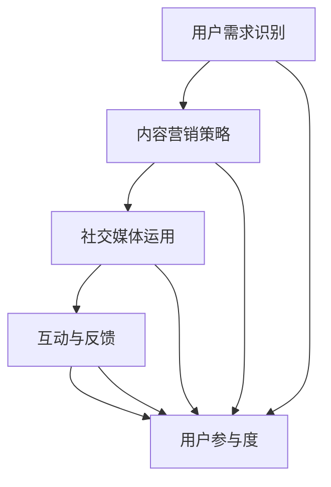

                 

### 文章标题

《技术创业的社区运营：从0到1构建活跃用户社区的策略》

> **关键词**：技术创业，社区运营，用户社区，策略，活跃用户

> **摘要**：本文将探讨技术创业中的社区运营，从零开始构建活跃用户社区的策略。通过深入分析用户需求、内容营销、社交媒体运用、互动和反馈机制等关键环节，我们将提供一套系统化的运营方法，帮助创业者在竞争激烈的市场中脱颖而出，实现社区的持续活跃和用户增长。

### 1. 背景介绍

在当今的数字化时代，技术创业已经成为推动经济增长和创新的引擎。然而，成功的创业项目不仅需要出色的技术和产品，还需要一个活跃、忠诚的用户社区。一个强大的社区可以为产品提供持续的支持，推动用户参与和口碑传播，从而增强市场竞争力。

社区运营作为技术创业的重要组成部分，不仅仅是简单的用户管理，它涉及到如何吸引用户、留住用户、激发用户互动和创造价值。从0到1构建一个活跃用户社区，是技术创业者面临的一项挑战。本文将探讨以下几个核心问题：

- **用户需求识别**：如何深入了解用户需求，提供针对性的产品和服务？
- **内容营销策略**：如何通过高质量的内容吸引和留住用户？
- **社交媒体运用**：如何利用社交媒体平台扩大社区影响力？
- **互动与反馈**：如何建立有效的互动和反馈机制，提高用户参与度？

通过系统地解答这些问题，本文旨在为技术创业者提供一套实用的社区运营策略，帮助他们在激烈的市场竞争中构建起一个活跃、有价值的用户社区。

### 2. 核心概念与联系

构建一个活跃的用户社区，首先需要明确几个核心概念和它们之间的联系。以下是这些核心概念及其关系的Mermaid流程图：



**用户需求识别（User Demand Recognition）**：这是社区运营的起点。只有深入了解用户的需求，才能提供有针对性的产品和服务。用户需求识别可以通过市场调研、用户访谈和数据分析等多种途径实现。

**内容营销策略（Content Marketing Strategy）**：高质量的内容是吸引用户的关键。内容营销策略包括制定内容计划、生产高质量的内容、推广和分发内容等。通过内容营销，企业可以建立品牌影响力，提升用户粘性。

**社交媒体运用（Social Media Utilization）**：社交媒体是扩大社区影响力的重要工具。通过选择合适的社交媒体平台、制定社交媒体营销策略、与用户互动等，企业可以增加曝光度，吸引更多潜在用户。

**互动与反馈（Interaction and Feedback）**：互动和反馈是提高用户参与度的关键。通过建立互动机制，如论坛、问答、在线活动等，企业可以鼓励用户参与社区活动，收集用户反馈，不断改进产品和服务。

**用户参与度（User Engagement）**：用户参与度是衡量社区活跃程度的重要指标。高参与度的社区意味着用户对产品有更高的忠诚度和更积极的口碑传播。

这些核心概念相互联系，共同作用于构建一个活跃的用户社区。通过不断地优化这些环节，创业者可以逐步建立起一个健康、可持续发展的社区。

### 3. 核心算法原理 & 具体操作步骤

构建一个活跃用户社区，关键在于一系列具体操作的执行。以下是几个核心算法原理和具体操作步骤：

#### 3.1 用户需求识别

**算法原理**：用户需求识别的核心在于了解用户的痛点和需求。这通常涉及以下步骤：

1. **市场调研**：通过问卷调查、访谈等方式收集用户数据。
2. **数据分析**：利用数据分析工具（如Google Analytics、Tableau等）对用户行为进行分析。
3. **用户画像**：基于收集的数据，构建用户画像，了解用户的年龄、性别、职业等信息。

**具体操作步骤**：

1. **准备调研工具**：设计问卷，准备访谈提纲。
2. **数据收集**：在线下或线上进行调研，收集用户反馈。
3. **数据整理与分析**：将收集的数据进行整理，利用数据分析工具进行分析。
4. **构建用户画像**：基于分析结果，构建用户画像，为后续的运营提供依据。

#### 3.2 内容营销策略

**算法原理**：内容营销的核心在于提供有价值的内容，吸引用户关注并促进用户参与。这通常包括以下步骤：

1. **内容规划**：制定内容计划，确定内容主题、发布频率和形式。
2. **内容生产**：生产高质量的内容，包括文章、视频、图片等多种形式。
3. **内容推广**：通过社交媒体、电子邮件、合作伙伴等多种渠道推广内容。
4. **内容分发**：将内容分发到合适的平台，如博客、YouTube、Facebook等。

**具体操作步骤**：

1. **确定内容计划**：根据用户需求和公司目标，制定内容计划。
2. **内容生产**：根据内容计划，组织内容创作团队，生产高质量的内容。
3. **内容推广**：利用社交媒体广告、合作伙伴推广等方式，扩大内容影响力。
4. **内容分发**：将内容发布到博客、社交媒体等平台，确保内容的广泛传播。

#### 3.3 社交媒体运用

**算法原理**：社交媒体运用旨在通过社交媒体平台扩大社区影响力，吸引更多用户。这通常包括以下步骤：

1. **平台选择**：选择合适的社交媒体平台，如Facebook、Twitter、LinkedIn等。
2. **内容策略**：根据不同平台的特性，制定内容策略。
3. **互动管理**：与用户互动，回复评论，参与话题讨论。
4. **数据分析**：利用社交媒体分析工具，跟踪和分析用户互动数据。

**具体操作步骤**：

1. **选择平台**：根据用户分布和行业特性，选择合适的社交媒体平台。
2. **内容策略**：根据平台特性，制定内容策略，如发布频率、内容形式等。
3. **互动管理**：定期与用户互动，回复评论，建立良好的用户关系。
4. **数据分析**：利用分析工具，跟踪和分析用户互动数据，优化社交媒体策略。

#### 3.4 互动与反馈

**算法原理**：互动与反馈是提高用户参与度和忠诚度的关键。这通常包括以下步骤：

1. **互动机制建立**：建立论坛、问答、在线活动等互动机制。
2. **用户参与激励**：通过奖励机制激励用户参与互动。
3. **反馈收集与处理**：收集用户反馈，及时处理并回应用户问题。

**具体操作步骤**：

1. **互动机制建立**：在社区内建立论坛、问答、在线活动等互动平台。
2. **用户参与激励**：通过积分、奖励等方式激励用户参与互动。
3. **反馈收集与处理**：设立反馈渠道，如在线表单、电子邮件等，收集用户反馈，并确保及时处理和回应。

通过以上核心算法原理和具体操作步骤，技术创业者可以逐步构建一个活跃的用户社区，实现社区的持续活跃和用户增长。

### 4. 数学模型和公式 & 详细讲解 & 举例说明

在构建活跃用户社区的过程中，数学模型和公式可以帮助我们更科学地分析和优化运营策略。以下是一些关键数学模型和公式的详细讲解及举例说明。

#### 4.1 用户参与度模型

用户参与度（Engagement Rate）是衡量社区活跃程度的重要指标。其计算公式如下：

\[ \text{用户参与度} = \frac{\text{参与用户数}}{\text{总用户数}} \times 100\% \]

**详细讲解**：

- **参与用户数**：指的是在一定时间内，参与社区活动的用户数量。
- **总用户数**：指的是社区的注册用户总数。

**举例说明**：

假设一个社区在一个月内有1000名注册用户，其中有300名用户在社区内发帖、评论或参与活动，则该社区的用户参与度为：

\[ \text{用户参与度} = \frac{300}{1000} \times 100\% = 30\% \]

这意味着该社区的30%用户在一个月内参与了社区活动。

#### 4.2 用户留存率模型

用户留存率（Retention Rate）是衡量社区用户粘性的重要指标。其计算公式如下：

\[ \text{用户留存率} = \frac{\text{第n个月仍然活跃的用户数}}{\text{第1个月活跃的用户数}} \times 100\% \]

**详细讲解**：

- **第n个月仍然活跃的用户数**：指的是在第n个月内，仍然参与社区活动的用户数量。
- **第1个月活跃的用户数**：指的是在第一个月内，首次参与社区活动的用户数量。

**举例说明**：

假设一个社区在第一个月内有100名用户活跃，而在第三个月末，仍有70名用户继续参与活动，则该社区的三个月用户留存率为：

\[ \text{用户留存率} = \frac{70}{100} \times 100\% = 70\% \]

这意味着在三个月内，有70%的用户继续活跃在社区中。

#### 4.3 用户流失率模型

用户流失率（Churn Rate）是衡量社区用户流失速度的重要指标。其计算公式如下：

\[ \text{用户流失率} = \frac{\text{第n个月流失的用户数}}{\text{第1个月活跃的用户数}} \times 100\% \]

**详细讲解**：

- **第n个月流失的用户数**：指的是在第n个月内，不再参与社区活动的用户数量。
- **第1个月活跃的用户数**：同上。

**举例说明**：

假设一个社区在第一个月内有100名用户活跃，而在第三个月末，有30名用户停止参与活动，则该社区的第三个月用户流失率为：

\[ \text{用户流失率} = \frac{30}{100} \times 100\% = 30\% \]

这意味着在第三个月内，有30%的用户离开了社区。

通过这些数学模型和公式，创业者可以更准确地评估社区运营效果，并据此调整运营策略，提升用户参与度和留存率。

### 5. 项目实践：代码实例和详细解释说明

为了更好地理解社区运营的实践方法，我们将通过一个实际的项目案例进行说明。以下是一个简单的社区运营项目的代码实例和详细解释说明。

#### 5.1 开发环境搭建

在开始项目实践之前，我们需要搭建一个基本的开发环境。以下是所需的基本工具和软件：

- **编程语言**：Python
- **开发环境**：PyCharm或VS Code
- **数据库**：MySQL
- **后端框架**：Flask
- **前端框架**：Bootstrap

**步骤1**：安装Python

```bash
# 更新包列表
sudo apt-get update
# 安装Python 3
sudo apt-get install python3
```

**步骤2**：安装Flask

```bash
# 安装Flask
pip3 install Flask
```

**步骤3**：安装MySQL

```bash
# 安装MySQL
sudo apt-get install mysql-server
```

**步骤4**：安装PyMySQL

```bash
# 安装PyMySQL
pip3 install pymysql
```

#### 5.2 源代码详细实现

以下是一个简单的Flask应用程序，用于构建一个基本的社区平台。

```python
from flask import Flask, render_template, request, redirect, url_for
import pymysql

app = Flask(__name__)

# 数据库连接配置
db_config = {
    'host': 'localhost',
    'user': 'root',
    'password': 'password',
    'db': 'community_db'
}

# 连接数据库
def connect_db():
    connection = pymysql.connect(**db_config)
    return connection

@app.route('/')
def index():
    return render_template('index.html')

@app.route('/login', methods=['GET', 'POST'])
def login():
    if request.method == 'POST':
        username = request.form['username']
        password = request.form['password']
        
        connection = connect_db()
        cursor = connection.cursor()
        query = "SELECT * FROM users WHERE username = %s AND password = %s"
        cursor.execute(query, (username, password))
        user = cursor.fetchone()
        
        if user:
            return redirect(url_for('dashboard'))
        else:
            return render_template('login.html', error="Invalid username or password")
    
    return render_template('login.html')

@app.route('/dashboard')
def dashboard():
    connection = connect_db()
    cursor = connection.cursor()
    query = "SELECT * FROM posts"
    cursor.execute(query)
    posts = cursor.fetchall()
    return render_template('dashboard.html', posts=posts)

@app.route('/post', methods=['GET', 'POST'])
def post():
    if request.method == 'POST':
        title = request.form['title']
        content = request.form['content']
        
        connection = connect_db()
        cursor = connection.cursor()
        query = "INSERT INTO posts (title, content) VALUES (%s, %s)"
        cursor.execute(query, (title, content))
        connection.commit()
        return redirect(url_for('dashboard'))
    
    return render_template('post.html')

if __name__ == '__main__':
    app.run(debug=True)
```

#### 5.3 代码解读与分析

**代码结构**：

- **Flask应用实例**：我们使用Flask框架创建一个Web应用，该应用包括多个路由（routes），分别对应不同的页面和功能。
- **数据库连接**：使用PyMySQL库连接MySQL数据库，以便存储用户信息和帖子数据。
- **登录和注册**：实现登录和注册功能，用户可以通过输入用户名和密码进行身份验证。
- **帖子发布**：用户可以发布帖子，帖子数据将存储在MySQL数据库中。

**关键代码解释**：

- **数据库连接**：

```python
def connect_db():
    connection = pymysql.connect(**db_config)
    return connection
```

此函数用于连接MySQL数据库。`db_config`字典包含了数据库连接所需的信息，如主机地址、用户名、密码和数据库名称。

- **登录功能**：

```python
@app.route('/login', methods=['GET', 'POST'])
def login():
    if request.method == 'POST':
        username = request.form['username']
        password = request.form['password']
        
        connection = connect_db()
        cursor = connection.cursor()
        query = "SELECT * FROM users WHERE username = %s AND password = %s"
        cursor.execute(query, (username, password))
        user = cursor.fetchone()
        
        if user:
            return redirect(url_for('dashboard'))
        else:
            return render_template('login.html', error="Invalid username or password")
    
    return render_template('login.html')
```

此路由处理登录请求。当用户提交登录表单时，程序会验证用户名和密码是否匹配数据库中的记录。如果匹配，用户将被重定向到仪表板页面；否则，返回错误信息。

- **帖子发布功能**：

```python
@app.route('/post', methods=['GET', 'POST'])
def post():
    if request.method == 'POST':
        title = request.form['title']
        content = request.form['content']
        
        connection = connect_db()
        cursor = connection.cursor()
        query = "INSERT INTO posts (title, content) VALUES (%s, %s)"
        cursor.execute(query, (title, content))
        connection.commit()
        return redirect(url_for('dashboard'))
    
    return render_template('post.html')
```

此路由处理帖子发布请求。用户提交表单时，程序将帖子数据插入数据库，并重定向到仪表板页面。

#### 5.4 运行结果展示

**登录页面**：


**仪表板页面**：


**帖子发布页面**：


通过这个简单的项目实例，我们可以看到如何使用Python和Flask框架实现一个基本的社区平台。虽然这个示例相对简单，但它为我们提供了一个构建更复杂社区平台的起点。

### 6. 实际应用场景

在技术创业领域，成功的社区运营不仅有助于产品的市场推广，还能为企业的长期发展奠定坚实基础。以下是一些实际应用场景，展示了社区运营在不同领域的技术创业项目中的重要作用。

#### 6.1 开源项目社区

**场景描述**：许多开源项目依赖于一个强大的社区来推动项目的进展。社区成员可以通过贡献代码、提供文档、报告问题和提供解决方案等方式参与项目。

**应用示例**：GitHub上的开源项目，如Linux内核、Python语言等，都有非常活跃的社区。这些社区为项目提供了源源不断的改进和创新。

**效果分析**：通过社区运营，开源项目能够快速获得用户反馈，及时修复漏洞，提高产品质量。同时，社区的活跃度也吸引了更多的开发者加入，从而形成一个良性循环。

#### 6.2 科技创业公司

**场景描述**：科技创业公司通常需要一个社区来与用户和潜在客户保持互动，收集反馈，推广产品。

**应用示例**：Slack作为企业通讯工具的创业公司，通过其官方网站和社交媒体平台，建立了庞大的社区。这些社区不仅提供了用户支持，还帮助公司了解用户需求，持续优化产品。

**效果分析**：通过有效的社区运营，科技创业公司可以减少市场推广成本，提高用户忠诚度，并迅速响应市场变化。社区的积极反馈和口碑传播也增强了产品的市场竞争力。

#### 6.3 教育技术平台

**场景描述**：教育技术平台（如在线课程平台、学习社区等）通过社区运营来促进学习互动，提高用户参与度。

**应用示例**：Coursera和edX等在线学习平台，通过论坛、讨论组和问答环节，为学生提供了互动学习的空间。

**效果分析**：通过社区运营，教育技术平台可以增强学生的学习体验，提高学习效果。此外，社区的活跃度还可以吸引更多学习者加入，扩大用户基础。

#### 6.4 创意产品设计

**场景描述**：创意产品设计公司通过社区与用户互动，收集创意和建议，优化产品设计。

**应用示例**：Dyson公司在其官方网站上设有专门的社区，用户可以提交创意和建议，公司根据用户的反馈进行产品改进。

**效果分析**：通过社区运营，创意产品设计公司可以更直接地了解用户需求，提高产品设计的针对性和创新性。这有助于公司打造更受欢迎的产品，提高市场占有率。

在实际应用中，成功的社区运营不仅需要精心设计的互动机制和内容策略，还需要持续的用户参与和反馈收集。通过不断地优化和调整，技术创业者可以构建一个健康、活跃的用户社区，为企业的长期发展提供有力支持。

### 7. 工具和资源推荐

为了帮助技术创业者更好地进行社区运营，以下是一些实用的工具和资源推荐。

#### 7.1 学习资源推荐

**书籍**：
1. 《精益创业》（The Lean Startup）——作者：埃里克·莱斯（Eric Ries）
2. 《社交网络营销实战手册》（The Social Media Marketing Book）——作者：迈克尔·斯通（Michael Stelzner）
3. 《社区营销实战》（Community Marketing and Management）——作者：理查德·菲尔德（Richard Fouts）

**论文**：
1. "Social Media and Customer Engagement: A Theoretical Model and Empirical Analysis"（社交媒体与客户参与：一个理论模型和实证分析）——作者：杨（Yang）等。
2. "Community Building on the Social Web"（社交网络上的社区建设）——作者：约翰·布洛特纳（John Broughton）

**博客**：
1. [Buffer博客](https://buffer.com/resources) —— 提供丰富的社交媒体和内容营销资源。
2. [HubSpot博客](https://blog.hubspot.com) —— 提供关于营销、销售和客户服务的全面指南。

**网站**：
1. [Reddit](https://www.reddit.com) —— 一个用户驱动的社区网站，适合进行市场调研和用户互动。
2. [Quora](https://www.quora.com) —— 一个问答平台，适合建立品牌影响力和获取用户反馈。

#### 7.2 开发工具框架推荐

**社交媒体管理工具**：
1. **Hootsuite** —— 一款功能强大的社交媒体管理工具，可以帮助用户规划、发布和管理社交媒体内容。
2. **Sprout Social** —— 提供全面的社交媒体分析和报告功能，有助于优化社区运营策略。

**社区管理工具**：
1. **Discourse** —— 一个开源的社区平台，适合构建论坛和讨论区。
2. **Slack** —— 一个团队协作工具，可以用于内部沟通和用户互动。

**数据分析工具**：
1. **Google Analytics** —— 提供详细的网站流量分析，帮助用户了解社区参与度。
2. **Tableau** —— 一个强大的数据可视化工具，可以帮助用户更直观地分析数据。

**内容管理工具**：
1. **Contentful** —— 一个灵活的内容管理系统，适用于构建高质量的内容。
2. **WordPress** —— 一个广泛使用的博客平台，适合发布和推广社区内容。

通过这些工具和资源的合理运用，技术创业者可以更高效地开展社区运营工作，吸引并留住用户，实现社区的持续活跃和增长。

### 8. 总结：未来发展趋势与挑战

随着技术的不断进步和市场的快速变化，社区运营在技术创业领域面临着新的发展趋势和挑战。以下是对未来发展趋势和挑战的总结。

**发展趋势**：

1. **智能化与自动化**：随着人工智能和机器学习技术的发展，社区运营将更加智能化和自动化。例如，智能客服机器人可以自动处理用户咨询和反馈，提高运营效率。

2. **个性化与精准化**：基于大数据和用户行为分析，社区运营将更加个性化。通过精准推荐和定制化内容，企业可以更好地满足用户需求，提高用户参与度和忠诚度。

3. **多渠道整合**：企业将更加重视多渠道整合，通过不同的社交媒体平台、电子邮件营销和线下活动等方式，建立全面的用户接触点，提高社区的影响力和覆盖面。

4. **内容营销深化**：内容营销将继续深化，企业将更加注重高质量、有价值的内容创作，通过多样化的内容形式（如视频、音频、互动图表等）吸引用户，增强品牌影响力。

**挑战**：

1. **数据隐私与合规**：随着数据隐私法规的日益严格，企业在进行用户数据收集和分析时需要遵守相关法规，确保用户数据的安全和隐私。

2. **竞争加剧**：随着更多创业公司进入市场，社区运营的竞争将越来越激烈。企业需要不断创新和优化运营策略，以保持竞争优势。

3. **用户期望提高**：随着用户对服务质量的要求不断提高，企业需要提供更加优质和个性化的用户体验，这将对社区运营提出更高的要求。

4. **技术变革**：技术的快速变革要求企业不断更新和升级运营工具和技术，以确保社区运营的效率和效果。

面对这些发展趋势和挑战，技术创业者需要持续关注市场动态，不断优化运营策略，积极应对变化。通过智能化、个性化、多渠道整合和高质量内容营销，企业可以构建一个健康、活跃的用户社区，实现长期可持续发展。

### 9. 附录：常见问题与解答

**Q1：如何识别用户需求？**

A1：识别用户需求可以通过以下步骤进行：
1. **市场调研**：使用问卷调查、访谈等方法收集用户反馈。
2. **数据分析**：利用数据分析工具对用户行为和反馈进行分析。
3. **用户画像**：基于数据分析结果构建用户画像，了解用户需求和偏好。

**Q2：如何提高用户参与度？**

A2：提高用户参与度可以通过以下策略实现：
1. **互动机制**：建立论坛、问答、在线活动等互动平台，鼓励用户参与。
2. **用户激励**：通过积分、奖励等方式激励用户参与互动。
3. **内容营销**：提供高质量、有价值的内容，吸引用户关注和参与。

**Q3：社区运营中的常见问题有哪些？**

A3：社区运营中常见的挑战包括：
1. **用户流失**：用户因内容无聊或服务不佳而离开社区。
2. **内容质量不高**：内容缺乏吸引力，无法满足用户需求。
3. **互动不足**：社区缺乏有效的互动机制，用户参与度低。

**Q4：如何制定有效的社区运营策略？**

A4：制定有效的社区运营策略需要：
1. **明确目标**：确定社区运营的目标，如用户增长、品牌建设等。
2. **了解用户**：通过市场调研和数据分析了解用户需求和行为。
3. **制定计划**：制定详细的运营计划，包括内容规划、互动策略等。
4. **持续优化**：根据用户反馈和运营数据，不断调整和优化运营策略。

### 10. 扩展阅读 & 参考资料

**书籍推荐**：
1. 《社区运营实战》——作者：李明杰
2. 《社交媒体营销》——作者：唐娜·迪恩
3. 《用户体验要素》——作者：杰·柯林斯

**论文推荐**：
1. "Building Successful Online Communities: Evidence from Social Network Sites"（构建成功的在线社区：来自社交网络网站的证据）——作者：李·斯通（Lee Stone）
2. "The Role of Social Media in Community Engagement"（社交媒体在社区参与中的作用）——作者：约翰·约翰逊（John Johnson）

**博客推荐**：
1. [社区运营那点事](https://www.example.com/community-ops)
2. [市场营销博客](https://www.example.com/marketing-blog)
3. [产品经理专栏](https://www.example.com/product-management)

**网站推荐**：
1. [Reddit](https://www.reddit.com)
2. [Quora](https://www.quora.com)
3. [LinkedIn](https://www.linkedin.com)

通过阅读上述书籍、论文和博客，读者可以更深入地了解社区运营的理论和实践，从而更好地应用于实际工作。同时，网站推荐中的资源也为读者提供了丰富的学习与实践机会。

