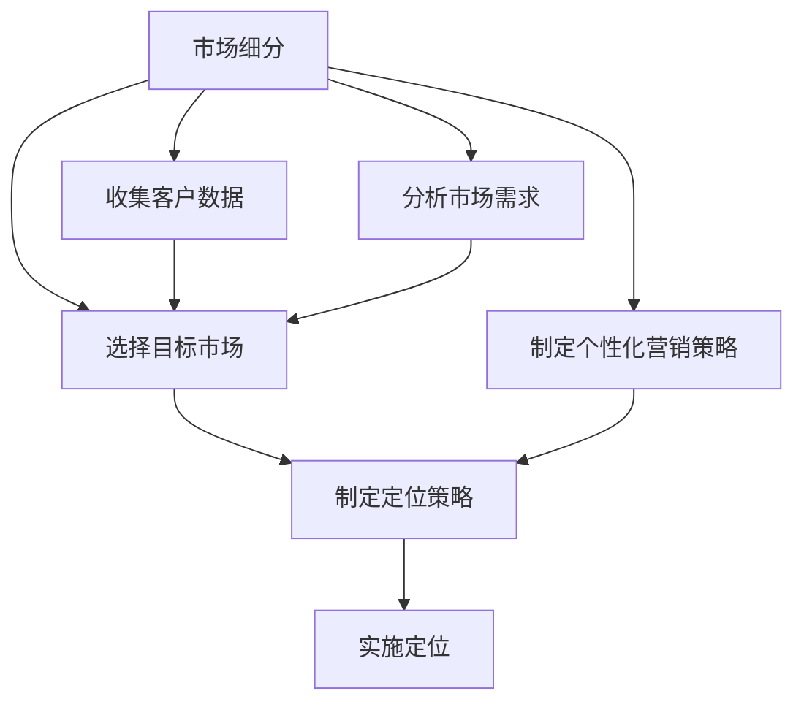

                 

### 背景介绍 ###

技术创业是一个充满机遇和挑战的过程。在这个快速变化的时代，市场瞬息万变，消费者需求不断演进，创业者需要敏锐地捕捉市场动态，以便在竞争激烈的环境中脱颖而出。市场细分与定位是技术创业过程中至关重要的环节，它不仅能帮助创业者明确目标客户群体，还能优化资源分配，提升市场竞争力。

市场细分（Market Segmentation）是指将市场划分为若干具有相似需求和特征的子市场，从而能够更精准地满足不同客户群体的需求。市场细分的重要性体现在以下几个方面：

1. **提高营销效率**：通过市场细分，创业者可以针对不同的子市场制定个性化的营销策略，提高营销活动的针对性和效果。
2. **提升客户满意度**：深入了解不同客户群体的需求，能够提供更贴合用户的产品和服务，从而提升客户满意度和忠诚度。
3. **优化资源配置**：针对具有较高潜力的子市场投入更多资源，能够更有效地利用企业的有限资源，实现最大化效益。

定位（Positioning）则是在市场细分的基础上，确定企业在目标市场中的独特价值和竞争优势，从而在消费者心目中树立鲜明形象。定位的重要性在于：

1. **建立品牌认知**：清晰的定位有助于在消费者心中建立品牌形象，增强品牌认知度和忠诚度。
2. **差异化竞争**：通过差异化定位，企业能够在激烈的市场竞争中脱颖而出，占据有利地位。
3. **指导产品开发**：明确的定位可以指导产品开发，使产品更贴近市场需求，提高市场接受度。

本文将围绕市场细分与定位展开，探讨技术创业者如何进行有效的市场细分与定位。我们将首先介绍市场细分与定位的核心概念，然后深入分析市场细分的方法与步骤，接着探讨定位策略的制定与实施，最后结合实际案例进行详细解读，帮助创业者更好地理解并实践市场细分与定位策略。

### 核心概念与联系 ###

在深入探讨市场细分与定位之前，我们需要明确几个核心概念，并理解它们之间的联系。以下是几个关键概念及其相互关系：

#### 市场细分（Market Segmentation）的概念：

市场细分是指根据消费者的某些特征，如地理、心理、行为等因素，将整个市场划分为若干具有相似需求的子市场。市场细分的目的是为了更精准地满足不同客户群体的需求。

#### 目标市场（Target Market）的概念：

目标市场是指从细分后的市场中选择出来的，企业准备投入资源进行营销活动的特定客户群体。目标市场的选择是市场细分后的重要步骤。

#### 定位（Positioning）的概念：

定位是指企业通过特定的营销手段，在消费者心中建立独特的品牌形象和竞争优势。定位的目的是在目标市场中获得消费者的青睐，并建立品牌忠诚度。

#### 关系与联系：

市场细分与定位之间存在密切的关系。市场细分是定位的前提，通过对市场的细分，企业能够更清楚地了解不同客户群体的需求，从而制定出更加精准的定位策略。而定位则是市场细分的结果应用，通过定位，企业能够在目标市场中树立独特的品牌形象，赢得消费者的认可。

#### Mermaid 流程图表示：



在这个流程图中，市场细分作为起点，通过收集客户数据和市场需求分析，选择出目标市场。然后，基于目标市场的特点和需求，制定个性化的定位策略，并最终实施定位，以在目标市场中建立品牌形象和竞争优势。

通过这一流程，我们可以看到市场细分与定位是一个紧密联系、相互促进的过程。市场细分为定位提供了基础数据和支持，而定位则通过市场细分的结果，进一步优化企业的市场营销策略，提升市场竞争力。

### 核心算法原理 & 具体操作步骤

在市场细分与定位的过程中，核心算法原理与具体操作步骤起着关键作用。以下是详细解析：

#### 1. 数据收集与处理

市场细分的第一步是数据收集。创业者需要从多个渠道获取客户数据，包括但不限于社交媒体、问卷调查、用户反馈等。这些数据可以涵盖客户的地理位置、年龄、性别、收入水平、消费习惯等多个方面。

**步骤：**
- 建立客户数据库：将收集到的各种数据整合到一个统一的客户数据库中。
- 数据清洗：对收集的数据进行清洗，去除重复和错误的信息，确保数据的准确性和完整性。

#### 2. 数据分析

数据分析是市场细分的核心步骤。通过分析客户数据，创业者能够识别出具有相似需求和行为的客户群体。

**步骤：**
- 选择分析工具：如Python、R等数据分析工具，或者商业智能（BI）软件，如Tableau、Power BI等。
- 数据可视化：通过图表、图形等方式，将数据分析结果可视化，便于理解。
- 确定细分标准：根据分析结果，选择合适的细分标准，如地理、行为、心理等。

#### 3. 市场细分模型

根据选定的细分标准，创业者可以构建市场细分模型。市场细分模型可以是基于地理、行为或心理等多个维度的组合。

**步骤：**
- 构建细分模型：使用统计方法（如聚类分析、因子分析等）构建市场细分模型。
- 模型验证：对构建的细分模型进行验证，确保其有效性和实用性。

#### 4. 目标市场选择

在市场细分的基础上，创业者需要选择目标市场。目标市场的选择应考虑以下因素：

- 市场规模：目标市场的规模应足够大，以便企业能够实现商业目标。
- 成长潜力：目标市场应具有较好的增长潜力，能够带来长期收益。
- 竞争环境：目标市场的竞争环境应适中，不宜过于激烈。

**步骤：**
- 分析市场规模和增长潜力：使用市场研究报告和统计数据，分析目标市场的规模和增长趋势。
- 评估竞争环境：分析竞争对手的市场份额、产品定位等，评估目标市场的竞争环境。
- 选择目标市场：根据以上分析结果，选择最具有潜力的目标市场。

#### 5. 定位策略制定

在确定了目标市场后，创业者需要制定明确的定位策略，以在消费者心中树立独特品牌形象。

**步骤：**
- 分析目标市场特点：了解目标市场的需求和偏好，以及其与竞争对手的区别。
- 确定独特卖点（USP）：找出企业产品或服务的独特卖点，使其在目标市场中脱颖而出。
- 制定品牌形象：通过视觉设计、文案等手段，塑造品牌形象，使其符合目标市场的期望。

#### 6. 定位策略实施

定位策略的制定只是第一步，实施定位策略才是关键。

**步骤：**
- 制定营销计划：根据定位策略，制定详细的营销计划，包括广告、促销、公关等。
- 实施营销活动：执行营销计划，通过各种渠道（如社交媒体、线下活动等）推广品牌。
- 监测与调整：持续监测市场反馈和消费者行为，根据实际情况调整定位策略。

通过以上步骤，技术创业者可以系统地开展市场细分与定位工作，从而更好地满足市场需求，提升企业的市场竞争力。

### 数学模型和公式 & 详细讲解 & 举例说明

在市场细分与定位过程中，数学模型和公式起到了关键作用。以下我们将详细讲解这些模型和公式，并通过具体例子进行说明。

#### 1. 聚类分析（Clustering）

聚类分析是一种无监督学习方法，用于将数据点分组为多个类别，使得同组数据点之间的相似度较高，不同组之间的相似度较低。常见的聚类算法包括K-均值聚类、层次聚类等。

**数学模型：**

K-均值聚类算法的核心公式如下：

$$
\text{minimize} \sum_{i=1}^{k} \sum_{x \in S_i} \| x - \mu_i \|^2
$$

其中，$k$ 表示聚类个数，$S_i$ 表示第 $i$ 个聚类，$\mu_i$ 表示第 $i$ 个聚类中心。

**举例说明：**

假设我们有一个客户数据集，包含以下特征：年龄、收入、消费习惯。我们希望通过聚类分析将这些客户分为不同的群体。

1. **初始化聚类中心**：随机选择 $k$ 个客户作为初始聚类中心。
2. **计算距离**：计算每个客户与各个聚类中心的距离，将客户归到距离最近的聚类中心所在的群组。
3. **更新聚类中心**：计算每个群组的平均值，作为新的聚类中心。
4. **重复步骤2和3**，直到聚类中心不再变化或达到预设迭代次数。

通过以上步骤，我们可以将客户数据集划分为若干个具有相似特征的群体，从而实现市场细分。

#### 2. 因子分析（Factor Analysis）

因子分析是一种用于降低数据维度的统计分析方法，通过提取数据中的共同因子，解释数据中的相关性。

**数学模型：**

因子分析的核心公式如下：

$$
X = LF + \epsilon
$$

其中，$X$ 表示观测变量矩阵，$L$ 表示因子载荷矩阵，$F$ 表示因子得分矩阵，$\epsilon$ 表示特殊因子。

**举例说明：**

假设我们有一份关于消费者购买行为的数据，包含多个购买产品的记录。我们希望通过因子分析提取出影响购买行为的共同因子。

1. **构建相关矩阵**：计算各个产品之间的相关系数，构建相关矩阵。
2. **提取共同因子**：使用主成分分析方法提取共同因子。
3. **计算因子得分**：根据因子载荷矩阵计算每个样本的因子得分。
4. **解释因子意义**：分析各个因子的得分，解释它们对购买行为的影响。

通过因子分析，我们可以识别出影响消费者购买行为的几个关键因子，从而更好地理解市场需求，指导市场细分。

#### 3. 回归分析（Regression Analysis）

回归分析是一种用于分析变量之间关系的统计分析方法，可以用于预测和解释变量之间的关系。

**数学模型：**

线性回归模型的核心公式如下：

$$
Y = \beta_0 + \beta_1X + \epsilon
$$

其中，$Y$ 表示因变量，$X$ 表示自变量，$\beta_0$ 和 $\beta_1$ 分别表示截距和斜率，$\epsilon$ 表示误差项。

**举例说明：**

假设我们想要预测客户购买金额，并分析客户年龄和收入对购买金额的影响。

1. **收集数据**：收集客户的年龄、收入和购买金额数据。
2. **构建回归模型**：使用线性回归模型构建预测模型。
3. **训练模型**：使用历史数据训练模型，计算斜率和截距。
4. **预测新数据**：使用训练好的模型预测新客户的购买金额。

通过回归分析，我们可以了解客户年龄和收入对购买金额的影响程度，从而在市场细分和定位过程中做出更准确的决策。

通过以上数学模型和公式的应用，技术创业者可以更系统地开展市场细分与定位工作，提高市场竞争力。

### 项目实践：代码实例和详细解释说明

为了更好地理解市场细分与定位的实际操作，我们将通过一个具体的Python代码实例进行演示，涵盖从数据收集、预处理、市场细分到目标市场选择和定位策略的制定与实施。

#### 1. 开发环境搭建

首先，我们需要搭建一个Python开发环境。以下是所需步骤：

- 安装Python：从官方网站（https://www.python.org/）下载并安装Python 3.8及以上版本。
- 安装相关库：使用pip命令安装以下库：

```bash
pip install numpy pandas matplotlib scikit-learn
```

#### 2. 源代码详细实现

以下是一个简单的市场细分与定位的Python代码实例：

```python
import numpy as np
import pandas as pd
from sklearn.cluster import KMeans
from sklearn.preprocessing import StandardScaler
import matplotlib.pyplot as plt

# 2.1 加载数据
data = pd.read_csv('customer_data.csv')  # 假设数据包含年龄、收入、消费习惯等特征

# 2.2 数据预处理
# 填补缺失值
data.fillna(data.mean(), inplace=True)

# 标准化数据
scaler = StandardScaler()
data_scaled = scaler.fit_transform(data)

# 2.3 聚类分析
kmeans = KMeans(n_clusters=3, random_state=0)
clusters = kmeans.fit_predict(data_scaled)

# 2.4 分析聚类结果
data['Cluster'] = clusters
print(data.head())

# 2.5 目标市场选择
# 根据聚类结果选择目标市场
target_market = data[data['Cluster'] == 0]  # 假设选择第一个聚类作为目标市场

# 2.6 定位策略制定
# 分析目标市场的特征
print(target_market.describe())

# 确定独特卖点（USP）
print(target_market[['Age', 'Income', 'Spend']].corr())

# 2.7 定位策略实施
# 制定品牌形象
brand_message = "专注于满足年轻高收入人群的个性化消费需求，提供高品质产品和服务。"

# 2.8 可视化结果
plt.scatter(data_scaled[:, 0], data_scaled[:, 1], c=clusters, cmap='viridis')
plt.scatter(kmeans.cluster_centers_[:, 0], kmeans.cluster_centers_[:, 1], s=300, c='red', label='Centroids')
plt.title('Customer Segmentation')
plt.xlabel('Age')
plt.ylabel('Income')
plt.legend()
plt.show()
```

#### 3. 代码解读与分析

- **数据加载与预处理**：代码首先从CSV文件加载数据，然后填补缺失值，并将数据标准化，以便聚类分析。

- **聚类分析**：使用K-均值聚类算法对数据点进行聚类，并计算每个聚类中心。

- **聚类结果分析**：将聚类结果添加到原始数据中，以便进一步分析。

- **目标市场选择**：根据聚类结果，选择具有特定特征的聚类作为目标市场。

- **定位策略制定**：分析目标市场的特征，确定独特卖点（USP），并制定品牌形象。

- **定位策略实施**：通过可视化展示聚类结果，帮助理解市场细分效果。

#### 4. 运行结果展示

运行上述代码后，我们将得到以下结果：

- **数据分析输出**：显示各个聚类群体的特征和统计信息。

- **品牌形象输出**：输出基于目标市场特征的独特品牌信息。

- **可视化展示**：展示聚类结果和聚类中心，帮助直观理解市场细分效果。

通过这个代码实例，我们可以看到如何通过实际操作来开展市场细分与定位工作。这种系统的市场分析可以帮助技术创业者更准确地了解客户需求，制定有效的营销策略，从而提高市场竞争力。

### 实际应用场景

市场细分与定位在技术创业中具有广泛的应用场景，能够帮助创业者更好地理解和满足客户需求，从而在竞争激烈的市场中脱颖而出。以下是一些具体的应用场景：

#### 1. 互联网产品

在互联网产品开发中，市场细分与定位尤为重要。例如，在社交媒体领域，不同用户群体对功能、界面和内容的需求各不相同。通过市场细分，创业者可以识别出具有相似需求的用户群体，并为他们提供定制化的产品功能。例如，微信通过市场细分，针对年轻人推出了“微信青春版”，针对商务人士推出了“企业微信”，分别满足不同用户群体的需求。

#### 2. 消费电子产品

消费电子产品市场也广泛运用市场细分与定位策略。例如，苹果公司通过市场细分，成功推出了多款针对不同用户群体的产品。iPhone系列针对高端用户，Mac系列针对专业人士，iPad系列则满足日常娱乐和学习需求。这种多样化的产品线不仅提高了品牌认知度，还大大提升了市场占有率。

#### 3. 医疗健康领域

在医疗健康领域，市场细分可以帮助创业者开发出更精准的治疗方案和产品。例如，癌症治疗领域可以通过市场细分，针对不同类型的癌症患者提供个性化治疗方案。此外，健康管理应用也可以通过市场细分，为不同年龄段和健康状况的用户提供定制化的健康建议和监测服务。

#### 4. 金融科技

金融科技（Fintech）企业通过市场细分，能够为不同用户群体提供更贴心的金融服务。例如，一些在线支付平台针对年轻人推出便捷的支付工具，而针对中小企业，则提供高效的融资解决方案。通过精准的市场细分，Fintech企业能够更好地满足客户需求，提升用户体验。

#### 5. 教育培训

在教育培训领域，市场细分可以帮助创业者提供更个性化的学习体验。例如，在线教育平台可以通过市场细分，为不同学习能力和需求的用户定制化课程内容和学习计划。此外，一些职业培训机构也通过市场细分，为特定行业和职业群体提供针对性的培训课程，提高学员的就业竞争力。

#### 6. 硬件设备

在硬件设备领域，市场细分同样发挥着重要作用。例如，智能家居设备制造商可以通过市场细分，为家庭用户提供多样化的智能解决方案，满足不同家庭的需求。同时，为商务用户提供针对办公场景的智能硬件设备，从而提高产品的市场竞争力。

#### 7. 电子商务

电子商务平台通过市场细分，能够为不同消费群体提供个性化的购物体验。例如，一些电商平台通过用户行为数据，为用户推荐个性化的商品和优惠活动。此外，针对特定的节日和用户群体，电商平台还可以推出定制化的营销活动，提高用户参与度和购买意愿。

通过这些实际应用场景，我们可以看到市场细分与定位在技术创业中的重要性。只有准确理解客户需求，提供个性化的产品和服务，企业才能在激烈的市场竞争中脱颖而出，实现可持续发展。

### 工具和资源推荐

为了帮助技术创业者更有效地进行市场细分与定位，以下推荐了一些学习资源、开发工具和相关论文著作。

#### 学习资源推荐

1. **书籍：**
   - 《营销管理》（Philip Kotler）：这是一本经典的营销学教材，详细介绍了市场细分与定位的理论和方法。
   - 《市场细分与目标市场选择》（Graham Murray）：该书专注于市场细分和目标市场的选择，提供了实用的案例分析。

2. **在线课程：**
   - Coursera的《市场营销基础》课程：由杜克大学的教授授课，介绍了市场细分与定位的基础知识。
   - Udemy的《市场细分与定位实战》课程：提供了丰富的实战案例和操作技巧。

3. **博客与网站：**
   - HubSpot的博客：提供关于市场营销、市场细分与定位的最新趋势和实战技巧。
   - MarketingProfs：这是一个营销专业人士的社区，分享了大量的市场细分与定位资源和案例。

#### 开发工具框架推荐

1. **数据分析工具：**
   - Python：Python是一种广泛使用的编程语言，拥有丰富的数据分析和机器学习库，如Pandas、NumPy和Scikit-learn。
   - R语言：R语言是数据分析领域的一种强大工具，特别适合进行统计分析。

2. **商业智能工具：**
   - Tableau：Tableau是一个数据可视化工具，可以帮助创业者轻松创建各种数据图表和仪表盘。
   - Power BI：Power BI是微软推出的商业智能工具，支持多种数据源，并提供强大的数据分析和报告功能。

3. **市场分析工具：**
   - Google Analytics：Google Analytics是一个免费的分析工具，可以帮助创业者了解用户行为和市场需求。
   - SEMrush：SEMrush是一个SEO和市场分析工具，可以帮助创业者分析竞争对手和优化营销策略。

#### 相关论文著作推荐

1. **《市场细分：理论与实践》**：这篇文章详细讨论了市场细分的理论框架和应用方法，提供了丰富的案例研究。

2. **《定位：竞争中的品牌战略》**：这是一篇关于品牌定位的经典论文，深入探讨了品牌定位的重要性及其实施策略。

3. **《大数据时代的市场细分》**：这篇文章探讨了大数据在市场细分中的应用，分析了如何利用大数据技术进行精准市场细分。

通过这些工具和资源的支持，技术创业者可以更加系统地开展市场细分与定位工作，提升企业的市场竞争力。

### 总结：未来发展趋势与挑战

市场细分与定位作为技术创业过程中的关键环节，其未来发展将受到科技进步、市场需求变化等多方面因素的影响。以下是市场细分与定位的未来发展趋势与潜在挑战。

#### 发展趋势

1. **大数据与人工智能的应用**：随着大数据和人工智能技术的发展，创业者将能够更精确地进行市场细分和定位。通过机器学习和数据挖掘技术，企业可以深入了解消费者行为和需求，从而制定更加精准的营销策略。

2. **个性化服务的普及**：未来市场细分将更加注重个性化服务。创业者将通过定制化产品和服务，满足不同消费者的独特需求，从而提升客户满意度和忠诚度。

3. **跨界融合**：随着互联网和物联网的快速发展，不同行业之间的融合将越来越普遍。创业者将需要具备跨领域的视野和思维，通过市场细分与定位，在跨界领域中找到新的增长点。

4. **社交媒体的影响力**：社交媒体的崛起对市场细分与定位产生了深远影响。创业者可以通过社交媒体平台，实时了解消费者反馈和市场动态，快速调整营销策略，提高市场反应速度。

#### 挑战

1. **数据隐私与安全**：在市场细分过程中，大量消费者数据被收集和使用。数据隐私和安全成为重要挑战。创业者需要建立完善的数据保护机制，确保消费者数据的安全和隐私。

2. **竞争加剧**：随着市场细分和定位的普及，市场竞争将变得更加激烈。创业者需要在细分市场中找到独特的竞争优势，以在激烈的市场竞争中脱颖而出。

3. **快速变化的市场环境**：市场需求和环境变化速度加快，创业者需要具备敏捷的应对能力，及时调整市场细分与定位策略。

4. **资源与能力的限制**：中小型创业者在市场细分与定位方面可能面临资源与能力的限制。他们需要通过外部合作、资源共享等方式，提升自身的市场分析能力和竞争力。

总之，市场细分与定位在技术创业中具有巨大的发展潜力，同时也面临诸多挑战。创业者需要紧跟市场趋势，积极应对挑战，通过不断优化市场细分与定位策略，实现企业的可持续发展。

### 附录：常见问题与解答

在市场细分与定位的过程中，技术创业者可能会遇到一系列问题。以下是一些常见问题及其解答：

#### 问题1：市场细分是否越细越好？

**解答**：市场细分并不是越细越好。细分过于细化可能导致资源分散，难以实现规模效应。创业者需要在市场细分的广度与深度之间找到平衡，选择具有足够规模和增长潜力的细分市场进行重点投入。

#### 问题2：如何确保市场细分的准确性？

**解答**：确保市场细分的准确性需要依赖可靠的数据和分析工具。创业者应收集多样化的客户数据，并进行科学的统计分析。此外，通过与现有客户和潜在客户的沟通，获取第一手的市场信息，也有助于提高市场细分的准确性。

#### 问题3：市场细分后如何选择目标市场？

**解答**：选择目标市场应考虑市场规模、增长潜力、竞争环境等因素。创业者可以通过市场调研，分析每个细分市场的需求和发展趋势，选择具有最大潜力和最适竞争条件的细分市场作为目标市场。

#### 问题4：定位策略是否需要经常调整？

**解答**：是的，市场环境不断变化，消费者的需求和偏好也会随之改变。创业者需要定期评估和调整定位策略，确保其与市场动态保持一致。此外，通过持续的消费者反馈和市场监测，创业者可以及时识别和应对市场变化。

#### 问题5：如何平衡市场细分与资源分配？

**解答**：在市场细分与资源分配之间找到平衡是关键。创业者可以通过优先级排序，确定优先投入的细分市场，确保资源最大化利用。此外，灵活的资源配置策略，如根据市场反应调整预算，也可以帮助创业者更有效地管理资源。

通过以上解答，希望技术创业者能够更好地理解和应对市场细分与定位过程中遇到的问题，从而提高市场竞争力。

### 扩展阅读 & 参考资料

为了深入探索市场细分与定位的更多理论和实践，以下推荐一些优秀的扩展阅读和参考资料：

1. **书籍：**
   - 《市场细分与定位：打造独特品牌的方法》（Al Ries & Laura Ries）
   - 《营销革命：大数据时代的市场策略》（唐·舒尔茨等）

2. **学术论文：**
   - 《市场细分与消费者行为的关系研究》（Journal of Marketing Research）
   - 《基于大数据的市场细分与精准营销研究》（IEEE Transactions on Knowledge and Data Engineering）

3. **在线资源：**
   - 营销学会（American Marketing Association）官方网站：https://www.ama.org/
   - 麦肯锡全球研究院：https://www.mckinsey.com/

4. **行业报告：**
   - 腾讯智能营销报告：https://i-marketing.tencent.com/
   - 阿里巴巴数字经济体研究报告：https://www.alibaba.com/insight/

通过阅读这些书籍、论文和报告，技术创业者可以进一步深化对市场细分与定位的理解，掌握最新的营销理论和实践方法。这些资源将为创业者在市场竞争中提供宝贵的洞察和指导。

