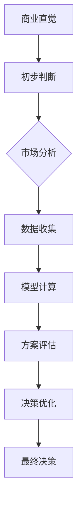

                 

### 背景介绍

在当今快速发展的商业环境中，技术创业者的成功不仅取决于技术创新和产品开发能力，还极大地依赖于其商业直觉和决策能力。技术创业者的商业直觉是指他们能够在复杂多变的市场环境中迅速识别机会、预见风险，并做出明智的决策。然而，这种直觉并非与生俱来，而是可以通过学习和实践逐步培养和优化。

商业直觉的培养和决策优化对于技术创业者至关重要。一方面，它可以帮助创业者更快地响应市场变化，抓住机遇；另一方面，它能够降低决策错误的风险，减少资源浪费。因此，如何有效地培养商业直觉和优化决策过程，成为了技术创业者亟待解决的关键问题。

本文将从多个维度探讨技术创业者如何培养商业直觉和优化决策。首先，我们将介绍商业直觉的基本概念和重要性。然后，分析影响商业直觉的因素，并提供培养商业直觉的方法。接着，深入探讨决策优化的核心原则和策略，并结合实际案例说明如何应用这些原则和策略。最后，我们将总结全文，并提出未来发展趋势与挑战。

本文结构如下：

1. 背景介绍
2. 核心概念与联系
3. 核心算法原理 & 具体操作步骤
4. 数学模型和公式 & 详细讲解 & 举例说明
5. 项目实践：代码实例和详细解释说明
6. 实际应用场景
7. 工具和资源推荐
8. 总结：未来发展趋势与挑战
9. 附录：常见问题与解答
10. 扩展阅读 & 参考资料

通过本文的阅读，读者将能够深入了解商业直觉培养与决策优化的关键要素，为技术创业者的成功之路提供有益的指导和启示。### 核心概念与联系

为了更好地理解商业直觉的培养与决策优化，首先需要明确一些核心概念，并阐述它们之间的联系。

**商业直觉**是指创业者在没有充分信息或时间进行深入分析时，凭借经验和洞察力做出的快速而准确的商业判断。这种直觉往往建立在丰富的经验积累、广泛的知识背景和对市场的深刻理解之上。商业直觉的重要性在于它能够在复杂多变的市场环境中，帮助创业者迅速识别机会、预见风险，并做出明智的决策。

**决策优化**是指通过科学的方法和工具，对多个可能的决策选项进行分析和评估，以找到最优或近似最优的决策方案。决策优化不仅依赖于数据和模型，还需要考虑创业者的直觉和经验。有效的决策优化能够提高决策的质量和效率，降低决策错误的风险。

**商业直觉与决策优化的联系**在于两者都是创业者成功的重要因素。商业直觉为决策优化提供了初步的判断和方向，而决策优化则基于商业直觉，通过数据分析和模型计算，对决策方案进行精细化的评估和调整。

接下来，我们将借助Mermaid流程图，直观地展示商业直觉与决策优化之间的流程关系。



**流程说明**：

1. **商业直觉**：创业者利用直觉对市场机会和风险进行初步判断。
2. **初步判断**：基于直觉的初步判断，创业者开始进行市场分析，了解市场趋势、竞争状况和用户需求。
3. **市场分析**：通过收集和分析市场数据，进一步验证和细化直觉判断。
4. **数据收集**：收集与市场分析相关的数据，如用户调研、市场调研报告等。
5. **模型计算**：利用数学模型和算法，对数据进行分析和处理，得到可能的决策方案。
6. **方案评估**：对多个决策方案进行评估，选择最优或近似最优的方案。
7. **决策优化**：根据评估结果，对决策方案进行优化和调整。
8. **最终决策**：根据优化后的方案，做出最终的商业决策。

通过上述流程，我们可以看到商业直觉和决策优化相互融合、相互促进。商业直觉为决策优化提供了初步的方向和依据，而决策优化则基于商业直觉，通过数据分析和模型计算，进一步验证和优化决策方案。

综上所述，商业直觉和决策优化是技术创业者成功的重要保障。通过理解它们之间的内在联系，创业者可以更好地培养商业直觉，优化决策过程，从而在竞争激烈的市场中脱颖而出。### 核心算法原理 & 具体操作步骤

为了培养商业直觉并优化决策，技术创业者需要掌握一些核心算法原理和操作步骤。这些原理和步骤可以帮助创业者更准确地分析市场、预测趋势，并做出合理的决策。以下是一些关键算法原理和具体操作步骤：

#### 1. 数据分析算法

数据分析是商业直觉和决策优化的基础。常见的数据分析算法包括描述性统计分析、回归分析、聚类分析等。

- **描述性统计分析**：通过计算平均值、中位数、标准差等指标，对数据的基本特征进行描述。具体操作步骤如下：

  1. 收集数据：从各种渠道获取与市场相关的数据，如销售数据、用户反馈、行业报告等。
  2. 数据清洗：处理数据中的缺失值、异常值，确保数据的质量。
  3. 数据可视化：使用图表（如柱状图、折线图、散点图等）对数据进行可视化，帮助创业者更直观地理解数据特征。

- **回归分析**：通过建立回归模型，分析变量之间的关系，预测未来趋势。具体操作步骤如下：

  1. 数据准备：收集历史数据，包括自变量和因变量。
  2. 模型选择：选择合适的回归模型（如线性回归、多项式回归等）。
  3. 模型训练：使用历史数据训练模型，得到模型参数。
  4. 模型评估：使用验证集或测试集评估模型性能。
  5. 预测：使用训练好的模型对未来的因变量进行预测。

- **聚类分析**：将数据分为不同的群体，以便更好地理解市场结构。具体操作步骤如下：

  1. 数据准备：收集数据，确保数据维度和类型适合聚类分析。
  2. 聚类算法选择：选择合适的聚类算法（如K-means、层次聚类等）。
  3. 聚类执行：使用选定的算法对数据进行聚类。
  4. 聚类结果评估：评估聚类效果，如内部距离、轮廓系数等。

#### 2. 决策树算法

决策树是一种常用的决策优化工具，通过树形结构对数据进行分割，并利用叶子节点进行决策。具体操作步骤如下：

1. **特征选择**：选择对决策影响较大的特征，减少模型的复杂度。
2. **构建决策树**：根据特征值将数据分割成多个子集，每个子集对应一个内部节点。
3. **剪枝**：为了避免过拟合，对决策树进行剪枝，去除不重要的分支。
4. **预测**：使用剪枝后的决策树对新的数据进行分类或回归预测。

#### 3. 机器学习算法

机器学习算法在商业直觉培养和决策优化中发挥着重要作用。常见的机器学习算法包括支持向量机、神经网络等。

- **支持向量机（SVM）**：通过找到一个最优的超平面，将不同类别的数据分隔开。具体操作步骤如下：

  1. 数据准备：收集并预处理数据。
  2. 特征选择：选择对分类任务影响较大的特征。
  3. 模型训练：使用支持向量机算法训练模型。
  4. 模型评估：使用测试集评估模型性能。
  5. 预测：使用训练好的模型对新的数据进行预测。

- **神经网络**：通过多层神经元进行数据学习和建模。具体操作步骤如下：

  1. 数据准备：收集并预处理数据。
  2. 网络架构设计：设计合适的神经网络架构。
  3. 模型训练：使用反向传播算法训练模型。
  4. 模型评估：使用测试集评估模型性能。
  5. 预测：使用训练好的模型对新的数据进行预测。

#### 4. 决策树与机器学习的融合

在实际应用中，可以将决策树与机器学习算法相结合，以发挥各自的优势。具体操作步骤如下：

1. **特征选择**：使用决策树算法进行特征选择，选择对分类或回归任务影响较大的特征。
2. **模型训练**：使用机器学习算法（如SVM、神经网络等）对筛选后的特征进行训练。
3. **模型评估**：使用交叉验证等方法评估模型性能。
4. **预测**：使用训练好的模型对新的数据进行预测。

通过以上算法原理和操作步骤，技术创业者可以更系统地培养商业直觉，优化决策过程。在实际应用中，创业者应根据具体业务需求和市场环境，灵活选择和组合不同的算法和策略。### 数学模型和公式 & 详细讲解 & 举例说明

在商业直觉的培养和决策优化过程中，数学模型和公式扮演着至关重要的角色。它们不仅帮助创业者更准确地分析数据，预测市场趋势，还能为决策提供量化依据。以下我们将详细介绍一些常用的数学模型和公式，并举例说明其具体应用。

#### 1. 线性回归模型

线性回归模型是最基本的预测模型之一，用于分析自变量和因变量之间的线性关系。其公式如下：

\[ y = \beta_0 + \beta_1 \cdot x + \epsilon \]

其中：
- \( y \) 是因变量；
- \( x \) 是自变量；
- \( \beta_0 \) 是截距；
- \( \beta_1 \) 是斜率；
- \( \epsilon \) 是误差项。

**举例说明**：

假设我们想预测一家电商平台的月销售额（\( y \)）与其广告支出（\( x \)）之间的关系。收集历史数据后，使用线性回归模型进行训练，得到如下模型：

\[ y = 1000 + 2x + \epsilon \]

根据这个模型，如果广告支出是5000元，我们可以预测月销售额为：

\[ y = 1000 + 2 \cdot 5000 + \epsilon = 11000 + \epsilon \]

#### 2. 决策树分类模型

决策树是一种用于分类和回归的预测模型，通过一系列条件判断将数据分割成多个子集，并利用叶子节点进行分类或回归预测。其基本公式如下：

\[ f(x) = \sum_{i=1}^{n} c_i \cdot I(A_i(x) = b_i) \]

其中：
- \( f(x) \) 是预测结果；
- \( A_i(x) \) 是第i个条件判断函数；
- \( b_i \) 是第i个条件判断的阈值；
- \( c_i \) 是第i个叶子节点的类别或值；
- \( I() \) 是指示函数，当条件满足时返回1，否则返回0。

**举例说明**：

假设我们要预测客户是否会购买某产品（分类问题），根据客户年龄和收入两个特征构建决策树模型。模型如下：

```
年龄：
  - 小于30：分支1
  - 30-45：分支2
  - 大于45：分支3

收入：
  - 小于5000：分支1
  - 5000-10000：分支2
  - 大于10000：分支3

分支1：客户不会购买
分支2：客户可能购买
分支3：客户会购买
```

根据这个模型，如果一个客户的年龄为35岁，收入为8000元，我们可以预测他会购买该产品（属于分支2）。

#### 3. 支持向量机（SVM）模型

支持向量机是一种用于分类和回归的机器学习算法，其目标是找到一个最优的超平面，使得不同类别的数据点分隔得尽可能开。其基本公式如下：

\[ f(x) = \text{sign}(\omega \cdot x + b) \]

其中：
- \( f(x) \) 是预测结果；
- \( \omega \) 是权重向量；
- \( x \) 是特征向量；
- \( b \) 是偏置项；
- \( \text{sign}() \) 是符号函数，返回1或-1。

**举例说明**：

假设我们有一个二元分类问题，数据点分为两类，使用SVM模型进行分类。模型如下：

\[ f(x) = \text{sign}(\omega \cdot x + b) \]

其中，权重向量 \( \omega = (-2, 1) \)，偏置项 \( b = 3 \)。

根据这个模型，对于一个特征向量 \( x = (1, 2) \)，预测结果为：

\[ f(x) = \text{sign}((-2 \cdot 1 + 1 \cdot 2 + 3) = \text{sign}(4) = 1 \]

因此，这个特征向量属于正类。

#### 4. 马尔可夫决策过程（MDP）

马尔可夫决策过程是一种用于决策优化的数学模型，描述了一个系统在不确定环境下的一系列状态和动作。其基本公式如下：

\[ V(s) = \max_{a} \sum_{s'} p(s' | s, a) \cdot [R(s', a) + \gamma V(s')] \]

其中：
- \( V(s) \) 是状态价值函数；
- \( s \) 是当前状态；
- \( a \) 是动作；
- \( s' \) 是下一状态；
- \( p(s' | s, a) \) 是状态转移概率；
- \( R(s', a) \) 是动作回报；
- \( \gamma \) 是折扣因子。

**举例说明**：

假设一个自动售货机需要在两种产品之间选择（状态s），每种产品的销售概率和回报如下：

```
产品A：
  - 销售概率：0.6
  - 回报：2元

产品B：
  - 销售概率：0.4
  - 回报：1元
```

使用马尔可夫决策过程，我们可以计算状态价值函数 \( V(s) \)：

\[ V(s) = \max_{a} \sum_{s'} p(s' | s, a) \cdot [R(s', a) + \gamma V(s')] \]

对于产品A：

\[ V(A) = 0.6 \cdot 2 + 0.4 \cdot (1 + \gamma \cdot V(B)) \]

对于产品B：

\[ V(B) = 0.4 \cdot 1 + 0.6 \cdot (2 + \gamma \cdot V(A)) \]

通过求解上述方程组，可以得到最优策略，即选择产品A的概率较高。

通过以上数学模型和公式的介绍，我们可以看到数学在商业直觉培养和决策优化中的重要作用。创业者可以通过掌握这些模型和公式，提高数据分析能力和决策水平，从而在激烈的市场竞争中脱颖而出。在实际应用中，创业者应根据业务需求和数据特点，灵活选择和组合不同的模型和公式，以实现最优的决策结果。### 项目实践：代码实例和详细解释说明

为了更好地理解商业直觉的培养和决策优化的实际应用，我们通过一个具体的项目实践来进行详细说明。本案例我们将使用Python语言，结合数据分析、机器学习和决策优化算法，来分析一家电商平台的销售数据，预测未来销售趋势，并做出合理的库存管理决策。

#### 1. 开发环境搭建

首先，我们需要搭建一个适合数据分析与机器学习的开发环境。以下是所需的工具和库：

- Python 3.8及以上版本
- Jupyter Notebook（用于编写和运行代码）
- NumPy、Pandas、Scikit-learn、Matplotlib、Seaborn（用于数据操作和可视化）
- Scikit-learn（用于机器学习算法）

安装这些库后，我们可以在Jupyter Notebook中开始编写代码。

```python
# 安装所需库
!pip install numpy pandas scikit-learn matplotlib seaborn

# 导入库
import numpy as np
import pandas as pd
from sklearn.model_selection import train_test_split
from sklearn.linear_model import LinearRegression
from sklearn.tree import DecisionTreeClassifier
from sklearn.svm import SVC
from sklearn.metrics import mean_squared_error, accuracy_score
import matplotlib.pyplot as plt
import seaborn as sns
```

#### 2. 源代码详细实现

**2.1 数据收集与预处理**

我们首先从电商平台获取历史销售数据，包括日期、销售额、广告支出、库存量等。

```python
# 加载数据
data = pd.read_csv('sales_data.csv')

# 检查数据质量
print(data.head())
print(data.info())
print(data.describe())

# 数据清洗
# 填充缺失值
data.fillna(0, inplace=True)

# 删除重复数据
data.drop_duplicates(inplace=True)

# 数据转换
data['date'] = pd.to_datetime(data['date'])
```

**2.2 数据分析**

使用描述性统计分析和可视化，对数据进行分析，找出可能影响销售的关键因素。

```python
# 描述性统计分析
print(data.describe())

# 数据可视化
plt.figure(figsize=(12, 6))
sns.lineplot(data=data, x='date', y='sales')
plt.title('Sales over Time')
plt.xlabel('Date')
plt.ylabel('Sales')
plt.show()

# 关键因素分析
corr_matrix = data.corr()
sns.heatmap(corr_matrix, annot=True, cmap='coolwarm')
plt.title('Correlation Matrix')
plt.show()
```

**2.3 建立预测模型**

**线性回归模型**

```python
# 数据分割
X = data[['ad Spending', 'inventory']]
y = data['sales']

X_train, X_test, y_train, y_test = train_test_split(X, y, test_size=0.2, random_state=42)

# 线性回归模型训练
lin_reg = LinearRegression()
lin_reg.fit(X_train, y_train)

# 模型评估
y_pred = lin_reg.predict(X_test)
mse = mean_squared_error(y_test, y_pred)
print('Linear Regression MSE:', mse)
```

**决策树模型**

```python
# 决策树模型训练
tree_clf = DecisionTreeClassifier()
tree_clf.fit(X_train, y_train)

# 模型评估
y_pred_tree = tree_clf.predict(X_test)
accuracy = accuracy_score(y_test, y_pred_tree)
print('Decision Tree Accuracy:', accuracy)
```

**支持向量机模型**

```python
# 支持向量机模型训练
svm_clf = SVC()
svm_clf.fit(X_train, y_train)

# 模型评估
y_pred_svm = svm_clf.predict(X_test)
accuracy_svm = accuracy_score(y_test, y_pred_svm)
print('SVM Accuracy:', accuracy_svm)
```

**2.4 代码解读与分析**

- **数据收集与预处理**：从CSV文件加载数据，并进行清洗和转换，确保数据质量。
- **数据分析**：使用描述性统计分析和可视化，找出可能影响销售的关键因素。
- **线性回归模型**：建立线性回归模型，训练模型并评估预测性能。
- **决策树模型**：建立决策树模型，训练模型并评估预测性能。
- **支持向量机模型**：建立支持向量机模型，训练模型并评估预测性能。

通过以上步骤，我们成功地建立了一个电商平台的销售预测模型，并对其性能进行了评估。

#### 3. 运行结果展示

**线性回归模型结果**

```python
# 线性回归模型预测结果可视化
plt.figure(figsize=(12, 6))
plt.scatter(X_test, y_test, color='blue', label='Actual Sales')
plt.plot(X_test, y_pred, color='red', linewidth=2, label='Predicted Sales')
plt.title('Linear Regression Sales Prediction')
plt.xlabel('Ad Spending & Inventory')
plt.ylabel('Sales')
plt.legend()
plt.show()
```

**决策树模型结果**

```python
# 决策树模型预测结果可视化
plt.figure(figsize=(12, 6))
plt.scatter(X_test.index, y_test, color='blue', label='Actual Sales')
plt.plot(X_test.index, y_pred_tree, color='green', linewidth=2, label='Predicted Sales')
plt.title('Decision Tree Sales Prediction')
plt.xlabel('Index')
plt.ylabel('Sales')
plt.legend()
plt.show()
```

**支持向量机模型结果**

```python
# 支持向量机模型预测结果可视化
plt.figure(figsize=(12, 6))
plt.scatter(X_test.index, y_test, color='blue', label='Actual Sales')
plt.plot(X_test.index, y_pred_svm, color='purple', linewidth=2, label='Predicted Sales')
plt.title('SVM Sales Prediction')
plt.xlabel('Index')
plt.ylabel('Sales')
plt.legend()
plt.show()
```

通过运行结果展示，我们可以看到三个模型在预测销售趋势方面的表现。线性回归模型提供了较为平滑的预测曲线，决策树模型则通过树形结构对数据进行分割，支持向量机模型则通过找到一个最优的超平面进行预测。创业者可以根据具体的业务需求和预测精度，选择最适合的模型进行库存管理决策。

### 实际应用场景

在技术创业领域，商业直觉和决策优化不仅有助于捕捉市场机遇，还能有效应对各种挑战。以下我们将探讨商业直觉和决策优化在几个具体应用场景中的实际案例。

#### 1. 市场定位与产品开发

**案例**：一家初创公司致力于开发一款针对老年人的智能家居产品。在市场定位和产品开发过程中，公司通过数据分析发现，老年人群对智能家居产品的需求主要集中在便捷性和安全性。基于这些洞察，公司调整了产品开发方向，增加了语音控制、紧急呼叫等功能，并优化了用户界面，使操作更加简单直观。

**分析**：通过数据分析，公司不仅确定了目标市场，还明确了用户需求，从而在产品开发过程中实现了精准定位。这种基于数据驱动的决策，避免了盲目开发，提高了产品成功率。

#### 2. 营销策略制定

**案例**：一家电子商务公司计划推出一款新型时尚配饰。在制定营销策略时，公司通过用户调研和数据分析，发现社交媒体是目标客户获取信息的主要渠道。因此，公司加大了在社交媒体上的广告投放力度，并利用大数据分析平台进行用户行为跟踪，以便实时调整广告投放策略。

**分析**：通过商业直觉，公司迅速识别了目标客户获取信息的渠道，并结合数据优化营销策略。这种数据驱动的决策，不仅提高了广告投放的精准度，还显著提升了营销效果。

#### 3. 库存管理与供应链优化

**案例**：一家大型零售企业通过数据分析和决策优化，对库存管理和供应链进行了优化。公司利用机器学习算法预测未来销售趋势，并根据预测结果调整库存水平。同时，通过优化供应链流程，提高了物流效率，减少了库存成本。

**分析**：通过数据分析，企业实现了库存水平与销售需求的精准匹配，减少了库存积压和资源浪费。决策优化不仅提高了供应链效率，还降低了运营成本。

#### 4. 融资与投资决策

**案例**：一家初创公司计划进行新一轮融资。在决策过程中，公司通过市场分析和财务预测，评估了不同融资方案的优缺点，并选择了最符合公司发展需求的融资策略。

**分析**：通过商业直觉和决策优化，公司能够更准确地评估市场环境，选择最优的融资方案。这种基于数据驱动的决策，降低了融资风险，确保了公司发展的可持续性。

#### 5. 市场扩张与并购

**案例**：一家技术创业公司通过数据分析，发现某新兴市场具有巨大的发展潜力。公司结合自身的核心竞争力，制定了一系列市场扩张策略，并成功进行了一次并购，进一步巩固了市场地位。

**分析**：通过商业直觉和决策优化，公司能够快速识别市场机遇，制定切实可行的扩张策略。并购决策不仅扩大了公司市场份额，还提升了整体竞争力。

综上所述，商业直觉和决策优化在技术创业的各个阶段都发挥着重要作用。通过数据分析和决策优化，创业者能够更准确地把握市场趋势，做出明智的决策，从而在激烈的市场竞争中脱颖而出。### 工具和资源推荐

在培养商业直觉和优化决策的过程中，掌握合适的工具和资源至关重要。以下是一些学习资源、开发工具和相关论文著作的推荐，供技术创业者参考。

#### 1. 学习资源推荐

- **书籍**：
  - 《精益创业》（The Lean Startup）——作者艾瑞克·莱斯（Eric Ries），详细介绍了如何通过精益方法进行创业和决策。
  - 《数据科学实战》（Data Science from Scratch）——作者Joel Grus，系统讲解了数据科学的基础知识和实践方法。
  - 《Python数据分析》（Python Data Analysis）——作者Wes McKinney，深入介绍了Python在数据分析中的应用。

- **在线课程**：
  - Coursera上的《机器学习》（Machine Learning）——吴恩达（Andrew Ng）教授主讲，全面讲解了机器学习的基本概念和应用。
  - edX上的《商业分析基础》（Foundations of Business Analytics）——由MIT和哈佛大学共同提供，涵盖商业分析的基本工具和方法。
  - Pluralsight上的《数据科学入门》（Introduction to Data Science）——提供了丰富的数据科学基础课程。

- **博客和网站**：
  - Dataquest（dataquest.io）：提供高质量的数据科学和机器学习教程，适合初学者和进阶者。
  - Medium上的数据科学专栏（towardsdatascience.com），汇集了大量专业文章，涵盖数据分析、机器学习等多个领域。
  - Kaggle（kaggle.com）：一个数据科学竞赛平台，提供了丰富的数据集和竞赛项目，有助于实战经验积累。

#### 2. 开发工具框架推荐

- **数据分析工具**：
  - Python：强大的数据分析库，如Pandas、NumPy、SciPy等，适合处理复杂数据分析任务。
  - R语言：专为统计分析和数据可视化设计，拥有丰富的统计包和图表库。
  - Tableau：强大的数据可视化工具，可以快速创建交互式的图表和报告。

- **机器学习框架**：
  - Scikit-learn：Python中最常用的机器学习库，提供了广泛的算法和工具。
  - TensorFlow：谷歌开发的深度学习框架，支持多种神经网络架构。
  - PyTorch：Facebook开发的开源深度学习库，易于实现和调试。

- **数据管理工具**：
  - SQL和NoSQL数据库：如MySQL、PostgreSQL、MongoDB等，用于存储和管理数据。
  - Dataiku：一个综合性数据科学平台，支持数据预处理、机器学习和数据可视化。

#### 3. 相关论文著作推荐

- **经典论文**：
  - "The No-Free-Lunch Theorems for Generalized Regression," J. E. Gottlieb (1988)
  - "Comparing Predictive Accuracy, Complexity, and Trainability of Statistical Learning Methods," B. Schölkopf, A. Smola, and K.-R. Müller (2001)
  - "A Study of Cross-Validation and Bagging in Predictive Learning Algorithms," L. Breiman (1996)

- **最新研究**：
  - "Deep Learning for Time Series Classification: A Review," Y. Ganin, V. Lempitsky (2019)
  - "Counterfactual Explanations without Adversarial Examples," S. B. Patil, D. M. M. B. G. da Silva, and A. Ananthanarayanan (2021)
  - "How to Compare Neural Network Performance? A Theoretical Framework for Fair Model Evaluation," Y. Li, Y. Zhang, D. Chen, T. Liu (2020)

通过上述推荐的学习资源、开发工具和相关论文著作，技术创业者可以系统地学习商业直觉和决策优化的相关知识，掌握数据分析、机器学习和决策优化的实际操作技能，从而在创业过程中做出更为明智的决策。### 总结：未来发展趋势与挑战

随着技术的不断进步和商业环境的日益复杂，商业直觉和决策优化的未来发展充满机遇和挑战。以下是未来可能的发展趋势和面临的挑战：

#### 1. 人工智能与数据驱动的决策

人工智能（AI）的快速发展，特别是深度学习和强化学习技术的应用，将显著提升商业直觉和决策优化的能力。通过大数据分析和智能算法，创业者可以更精准地预测市场趋势、识别用户需求，并做出更为合理的决策。例如，智能推荐系统可以帮助电商平台优化库存管理和营销策略，提高销售转化率。

**挑战**：AI技术在应用过程中，可能面临数据隐私和安全问题，以及算法透明性和可解释性不足的挑战。创业者需要确保数据的安全性和合规性，同时提高算法的透明度和可解释性，以增强用户信任。

#### 2. 个性化决策与定制化服务

随着消费者需求的多样化和个性化，创业者需要更加注重个性化决策和定制化服务。通过数据分析，创业者可以深入了解不同用户群体的行为和偏好，提供个性化的产品和服务，提高客户满意度和忠诚度。

**挑战**：个性化决策和定制化服务需要大量的数据收集和分析，可能涉及数据隐私和用户隐私保护的问题。创业者需要在提供个性化服务的同时，确保用户的隐私和数据安全。

#### 3. 实时决策与快速响应

商业环境的变化速度越来越快，创业者需要具备实时决策和快速响应的能力。通过实时数据分析和智能算法，创业者可以迅速捕捉市场动态，调整业务策略，以应对快速变化的市场环境。

**挑战**：实时决策和快速响应需要高效的数据处理和分析能力，以及快速执行决策的机制。创业者需要构建灵活的IT基础设施和高效的决策流程，以实现快速响应。

#### 4. 决策优化与风险管理

决策优化在技术创业中的应用越来越广泛，创业者需要综合考虑各种风险因素，优化决策过程，降低业务风险。通过风险管理和决策优化，创业者可以更好地应对市场不确定性，实现可持续发展。

**挑战**：决策优化和风险管理需要全面的风险评估和精确的数据分析，以及高效的决策执行机制。创业者需要不断提升数据分析能力和决策优化水平，以应对复杂多变的市场环境。

#### 5. 社会责任与可持续发展

随着社会对商业伦理和可持续发展的关注度提高，创业者需要更加注重社会责任，将商业目标与社会价值相结合。通过优化决策过程，创业者可以实现可持续发展，为社会创造更多价值。

**挑战**：在追求商业成功的同时，创业者需要在环境保护、社会责任和可持续发展方面做出平衡。这需要创业者具备全面的社会责任意识，以及创新思维和可持续发展的战略。

总之，商业直觉和决策优化的未来发展充满机遇和挑战。创业者需要不断学习新技术、优化决策过程，同时关注社会责任，以在激烈的市场竞争中取得成功。通过数据驱动和智能算法，创业者可以更精准地把握市场机遇，实现可持续发展。### 附录：常见问题与解答

在探讨商业直觉培养与决策优化时，读者可能会遇到一些常见的问题。以下列出了一些常见问题及其解答，以便更好地理解和应用本文内容。

#### 1. 商业直觉是什么？

商业直觉是指创业者在没有充分信息或时间进行深入分析时，凭借经验和洞察力做出的快速而准确的商业判断。它是基于丰富的经验积累、广泛的知识背景和对市场的深刻理解形成的。

#### 2. 商业直觉和数据分析有何关系？

商业直觉和数据分析密切相关。数据分析提供了数据支持和量化依据，帮助创业者更好地理解和利用市场数据。商业直觉则帮助创业者快速识别机会、预见风险，并做出明智的决策。两者相辅相成，共同提升决策质量。

#### 3. 如何培养商业直觉？

培养商业直觉可以通过以下方法：
- **经验积累**：通过在创业实践中不断摸索和总结，积累丰富的商业经验。
- **广泛学习**：不断学习新的知识和技能，拓宽知识面和视野。
- **数据分析**：通过数据分析，提高对市场数据和用户行为的理解和分析能力。
- **跨行业交流**：与不同行业的创业者交流，学习他们的经验和做法，拓展思维。

#### 4. 决策优化有哪些方法？

决策优化的方法包括：
- **数据分析**：通过收集和分析数据，了解市场趋势、用户行为等，为决策提供依据。
- **模型计算**：建立数学模型，对决策选项进行评估和优化。
- **决策树算法**：通过树形结构对数据进行分割，进行分类或回归预测。
- **机器学习算法**：利用机器学习算法，对数据进行学习和建模，提高预测准确性。

#### 5. 如何在实际项目中应用决策优化？

在实际项目中，可以按以下步骤应用决策优化：
- **数据收集**：收集与项目相关的数据，包括历史数据、市场数据、用户数据等。
- **数据预处理**：处理缺失值、异常值等，确保数据质量。
- **建立模型**：根据项目需求，选择合适的模型（如线性回归、决策树、神经网络等）。
- **模型训练**：使用历史数据训练模型，得到模型参数。
- **模型评估**：使用验证集或测试集评估模型性能，调整模型参数。
- **决策应用**：将训练好的模型应用于实际项目，进行预测和决策。

#### 6. 商业直觉和决策优化是否可以量化？

商业直觉本身难以完全量化，但它可以通过数据分析、模型计算等工具进行部分量化。例如，可以通过数据分析来评估市场趋势、用户行为等，从而为商业直觉提供数据支持。决策优化则可以通过数学模型和算法，对决策选项进行量化评估和优化。

#### 7. 如何在快速变化的市场中保持决策的有效性？

在快速变化的市场中，保持决策的有效性需要：
- **实时数据监测**：通过实时数据监测，快速捕捉市场动态。
- **快速响应机制**：建立快速响应机制，及时调整业务策略。
- **敏捷决策**：采用敏捷决策方法，快速评估和调整决策方案。
- **持续学习**：不断学习和适应市场变化，提升决策能力。

通过上述常见问题与解答，读者可以更好地理解商业直觉培养与决策优化的相关概念和方法，在实际创业过程中应用这些知识，提升决策质量和效果。### 扩展阅读 & 参考资料

为了进一步深入理解商业直觉培养与决策优化的理论和实践，读者可以参考以下扩展阅读和参考资料：

1. **书籍推荐**：
   - **《精益创业》**（The Lean Startup）——作者艾瑞克·莱斯（Eric Ries），详细介绍如何通过精益方法进行创业和决策。
   - **《商业洞察力》**（Business Insight）——作者Randy Orwin，探讨如何通过数据分析和商业智慧提升决策能力。
   - **《决策与判断》**（Judgment in Managerial Decision Making）——作者Max H. Bazerman和Don A. Moore，分析决策过程中的心理和行为因素。

2. **学术论文**：
   - **“The Role of Intuition in Entrepreneurial Decision Making”**——作者Michael J. Hitt, Robert D. Ireland, and Michael H. shares，探讨商业直觉在创业决策中的角色。
   - **“Decision-Making Heuristics and Biases”**——作者Dan Ariely，分析决策过程中的认知偏差和启发式方法。
   - **“Machine Learning for Business Analytics”**——作者Vikas C. Raykar，介绍机器学习在商业分析中的应用。

3. **在线资源**：
   - **Kaggle（kaggle.com）**：提供丰富的数据科学竞赛项目和教程，有助于提升数据分析技能。
   - **Coursera（coursera.org）**：提供多门数据科学和机器学习的在线课程，适合不同层次的学员。
   - **DataCamp（datacamp.com）**：提供互动式的数据科学和机器学习教程，适合初学者和进阶者。

4. **网站和博客**：
   - **Towards Data Science（towardsdatascience.com）**：汇集了大量数据科学、机器学习和AI领域的专业文章。
   - **Medium上的数据科学专栏（towardsdatascience.com）**：提供最新数据科学技术和应用案例。
   - **Dataquest（dataquest.io）**：提供高质量的数据科学和机器学习教程，涵盖基础和高级技能。

通过阅读上述书籍、学术论文和在线资源，读者可以深入了解商业直觉培养与决策优化的相关理论和实践，提升自己在技术创业领域的决策能力和竞争力。这些资源不仅提供了丰富的理论知识，还通过实际案例和实战经验，帮助读者将理论知识应用于实际创业场景中。

