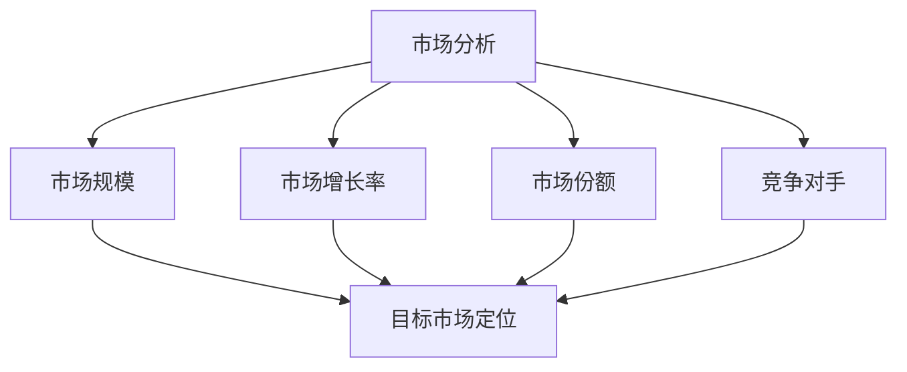
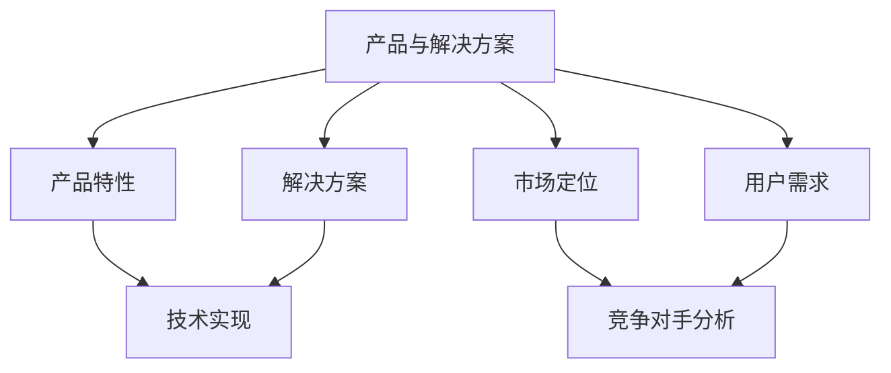
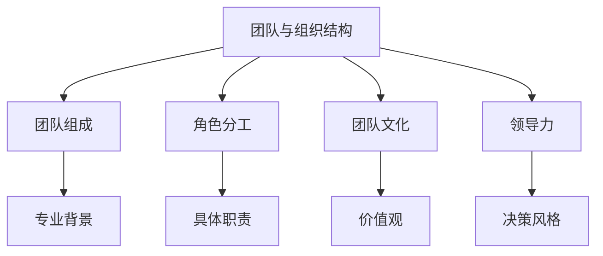
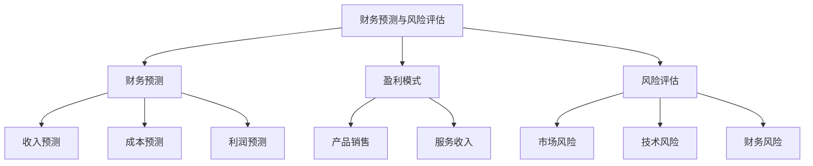

                 

### 文章标题：技术创业者的商业计划书优化与投资者沟通

关键词：商业计划书、投资者沟通、技术创业者、商业战略、风险投资、创业成功

摘要：本文旨在探讨技术创业者在撰写商业计划书和与投资者沟通时的关键要素。通过详细分析商业计划书的结构和内容，结合实际案例分析，本文将提供一系列优化策略，帮助技术创业者更有效地吸引投资者的关注，并成功实现融资目标。

## 1. 背景介绍

在当今竞争激烈的技术市场中，技术创业者的成功往往取决于其商业计划的执行力与吸引力。商业计划书不仅是创业者向潜在投资者展示项目潜力的工具，也是内部团队协作和管理的重要指南。然而，许多创业者面临的一个共同挑战是如何撰写出既能体现项目核心价值，又能打动投资者的商业计划书。

商业计划书的撰写过程涉及到对市场、产品、团队、财务等多个维度的全面分析和规划。创业者不仅要具备深厚的技术背景，还需要具备商业洞察力和市场敏感性。与此同时，投资者在筛选项目时，往往关注项目的商业潜力、市场前景、团队实力以及财务可行性等多个方面。因此，如何将技术优势与商业价值有机结合，并通过商业计划书有效地传达给投资者，成为技术创业者成功的关键。

本文将通过以下几个方面展开讨论：

1. **商业计划书的结构分析**：介绍商业计划书的基本结构和内容要点。
2. **核心概念与联系**：阐述商业计划书中涉及的核心概念及其相互关系。
3. **核心算法原理与操作步骤**：详细讲解如何优化商业计划书的内容和呈现方式。
4. **数学模型与公式**：介绍用于评估商业计划书可行性的关键数学模型和公式。
5. **项目实践**：通过具体案例展示商业计划书的撰写过程和优化策略。
6. **实际应用场景**：分析商业计划书在不同创业阶段的应用和效果。
7. **工具和资源推荐**：推荐有助于撰写和优化商业计划书的学习资源和开发工具。
8. **总结与展望**：探讨商业计划书优化与投资者沟通的未来发展趋势和挑战。

通过对以上各个方面的深入分析，本文旨在为技术创业者提供一套系统性的商业计划书优化策略，帮助他们在与投资者的沟通中取得成功。

### 2. 核心概念与联系

在撰写商业计划书的过程中，理解并掌握核心概念和它们之间的联系至关重要。以下将详细介绍商业计划书中的关键概念，并通过Mermaid流程图展示它们之间的相互关系。

#### 2.1 市场分析

市场分析是商业计划书的基础，它涉及到对目标市场的规模、增长趋势、竞争格局等方面的研究。核心概念包括：

- **市场规模**：市场的总体容量和潜力。
- **市场增长率**：市场的年增长速度。
- **市场份额**：公司产品在市场中的占有率。
- **竞争对手**：直接和间接的市场竞争者。

**Mermaid流程图：**



#### 2.2 产品与解决方案

产品与解决方案是商业计划书的重点，它需要清晰地描述产品的功能、优势、市场定位以及如何满足用户需求。核心概念包括：

- **产品特性**：产品的功能、特点和技术实现。
- **解决方案**：产品如何解决用户的问题或满足需求。
- **市场定位**：产品在市场中的独特定位。
- **用户需求**：目标用户群体的具体需求。

**Mermaid流程图：**



#### 2.3 团队与组织结构

团队与组织结构是商业计划书的重要组成部分，它需要展示团队的组成、成员的专业背景、角色分工以及团队的文化和价值观。核心概念包括：

- **团队组成**：团队成员的背景、经验和技能。
- **角色分工**：每个成员在团队中的具体角色和职责。
- **团队文化**：团队的核心价值观和行为准则。
- **领导力**：团队领导者的管理能力和决策风格。

**Mermaid流程图：**



#### 2.4 财务预测与风险评估

财务预测与风险评估是商业计划书中的关键部分，它需要对公司的财务状况、盈利模式、风险因素进行详细分析。核心概念包括：

- **财务预测**：公司的收入、成本、利润等财务指标的预测。
- **盈利模式**：公司如何通过产品或服务实现盈利。
- **风险评估**：公司面临的各种风险以及应对措施。

**Mermaid流程图：**



通过以上核心概念的详细阐述和Mermaid流程图的展示，我们可以更好地理解商业计划书各部分之间的逻辑关系，从而在撰写过程中做到有的放矢，提高商业计划书的整体质量。

### 3. 核心算法原理 & 具体操作步骤

在撰写商业计划书时，核心算法原理的应用可以帮助技术创业者更科学地分析市场和产品的潜力，从而提高商业计划的准确性和说服力。以下是几种常用的核心算法原理及其具体操作步骤：

#### 3.1 SWOT分析

SWOT分析是一种常用的战略规划工具，用于评估一个项目的优势（Strengths）、劣势（Weaknesses）、机会（Opportunities）和威胁（Threats）。其具体操作步骤如下：

1. **优势（Strengths）**：
   - 确定项目在技术、市场、团队等方面的独特优势。
   - 分析这些优势如何帮助项目在市场中脱颖而出。

2. **劣势（Weaknesses）**：
   - 识别项目面临的内部挑战和劣势。
   - 探讨如何克服这些劣势，提升项目的竞争力。

3. **机会（Opportunities）**：
   - 分析市场趋势和外部环境为项目带来的机遇。
   - 制定策略，利用这些机会推动项目发展。

4. **威胁（Threats）**：
   - 识别外部环境中的潜在威胁，如市场竞争、法规变化等。
   - 制定应对策略，减轻威胁对项目的影响。

#### 3.2 市场细分与定位

市场细分与定位是商业计划书中的重要环节，它通过将整体市场划分为多个具有相似需求的子市场，帮助企业集中资源服务于最有利可图的细分市场。具体操作步骤如下：

1. **市场细分**：
   - 根据人口统计、行为、心理和地理等因素，将整体市场划分为多个细分市场。
   - 分析每个细分市场的规模、增长潜力和竞争态势。

2. **目标市场定位**：
   - 确定项目将专注于哪个或哪些细分市场。
   - 定义目标市场的需求、偏好和购买行为。
   - 设计符合目标市场需求的独特产品或服务定位。

3. **市场进入策略**：
   - 制定进入目标市场的具体策略，如定价、促销、渠道选择等。

#### 3.3 盈利模式分析

盈利模式分析旨在明确公司如何通过产品或服务实现盈利，并确保盈利模式具有可行性和可持续性。具体操作步骤如下：

1. **收入来源**：
   - 列出所有可能的收入来源，如产品销售、服务收入、订阅费等。
   - 评估每种收入来源的可持续性和盈利潜力。

2. **成本结构**：
   - 分析项目的主要成本，包括固定成本和可变成本。
   - 评估成本结构对盈利能力的影响。

3. **盈利公式**：
   - 根据收入来源和成本结构，制定盈利公式，如收入减去成本等于利润。

4. **定价策略**：
   - 分析目标市场的价格敏感度，制定合理的定价策略。

#### 3.4 风险评估与应对策略

风险评估是商业计划书中不可或缺的部分，它帮助创业者识别项目可能面临的风险，并制定相应的应对策略。具体操作步骤如下：

1. **识别风险**：
   - 列出项目可能面临的所有风险，包括市场风险、技术风险、财务风险等。
   - 分析每种风险的严重程度和发生的可能性。

2. **评估风险**：
   - 使用定量和定性的方法评估每种风险的潜在影响。
   - 将风险按照严重程度和发生概率进行排序。

3. **制定应对策略**：
   - 为每种风险制定具体的应对策略。
   - 确保应对策略具有可行性和有效性。

通过以上核心算法原理的具体操作步骤，技术创业者可以更系统地分析和规划其商业计划，从而提高项目的可行性和吸引力。

### 4. 数学模型和公式 & 详细讲解 & 举例说明

在撰写商业计划书时，数学模型和公式能够为创业者提供科学的决策依据，帮助分析市场的可行性、项目的盈利能力以及风险评估的准确性。以下介绍几个关键数学模型和公式，并详细讲解其应用和举例说明。

#### 4.1 成本效益分析（Cost-Benefit Analysis）

成本效益分析是一种评估项目成本与预期收益之间的关系的工具，用于确定项目是否值得投资。其公式为：

\[ CBA = \frac{Total \ Benefits}{Total \ Costs} \]

其中，总收益（Total Benefits）包括直接的财务收益和间接的效益，如品牌提升、市场影响力等。总成本（Total Costs）则包括项目的初始投资、运营成本以及潜在的风险成本。

**举例说明**：

假设一个技术创业项目预计总投资为100万元，其中50万元用于研发，30万元用于市场推广，20万元用于运营成本。预期第一年收益为80万元，其中60万元来自产品销售，20万元来自合作伙伴收入。则该项目的成本效益比为：

\[ CBA = \frac{800,000}{100,000 + 50,000 + 30,000 + 20,000} = \frac{800,000}{200,000} = 4 \]

成本效益比大于1，表明项目的总收益超过总成本，从财务角度来看，该项目是具有吸引力的。

#### 4.2 投资回报率（Return on Investment, ROI）

投资回报率是衡量投资项目收益能力的指标，计算公式为：

\[ ROI = \frac{Net \ Profit}{Initial \ Investment} \times 100\% \]

其中，净收益（Net Profit）是项目实现的收益减去成本后的余额。

**举例说明**：

假设一个项目在两年内实现了200万元的净收益，初始投资为100万元，则其投资回报率为：

\[ ROI = \frac{2,000,000 - 1,000,000}{1,000,000} \times 100\% = 100\% \]

投资回报率越高，表明项目的投资效益越好。

#### 4.3 财务净现值（Net Present Value, NPV）

财务净现值是一种衡量项目未来现金流入和流出现值差额的指标，计算公式为：

\[ NPV = \sum_{t=0}^{n} \frac{C_t}{(1 + r)^t} - I \]

其中，\( C_t \) 是第t年的现金流量，\( r \) 是折现率，\( I \) 是初始投资。

**举例说明**：

假设一个项目第一年的现金流为50万元，第二年为70万元，第三年为90万元，折现率为10%，初始投资为100万元，则该项目的净现值为：

\[ NPV = \frac{50}{1.1^1} + \frac{70}{1.1^2} + \frac{90}{1.1^3} - 100 \]
\[ NPV = 45.45 + 63.79 + 76.92 - 100 = 86.16 \]

净现值为正，表明项目在未来能够创造价值，具有投资潜力。

#### 4.4 内部收益率（Internal Rate of Return, IRR）

内部收益率是使财务净现值等于零的折现率，表示项目的实际投资回报率。计算公式为：

\[ 0 = \sum_{t=0}^{n} \frac{C_t}{(1 + IRR)^t} - I \]

**举例说明**：

通过迭代计算，找到一个使净现值为零的折现率，例如，假设通过计算得出内部收益率为15%，这意味着项目的实际回报率为15%，高于市场平均水平，项目具有较高的投资价值。

通过以上数学模型和公式的详细讲解和举例说明，创业者可以更准确地评估项目的财务可行性，为商业计划的制定提供有力支持。

### 5. 项目实践：代码实例和详细解释说明

#### 5.1 开发环境搭建

在撰写商业计划书之前，我们需要确保开发环境已经搭建完毕，以便能够进行实际操作和验证。以下是搭建开发环境的具体步骤：

1. **安装Python环境**：Python是一种广泛应用于数据分析和商业计划的编程语言。在计算机上安装Python，可以使用Python官方网站提供的安装程序。安装完成后，打开终端并运行`python --version`，确认Python版本正确。

2. **安装Jupyter Notebook**：Jupyter Notebook是一种交互式的编程环境，非常适合用于撰写和演示数据分析过程。通过pip命令安装Jupyter Notebook：

   ```bash
   pip install notebook
   ```

   安装完成后，在终端运行`jupyter notebook`，打开Jupyter Notebook界面。

3. **安装数据分析和可视化库**：为方便进行数据分析和可视化，我们使用pandas、matplotlib等库。安装这些库的命令如下：

   ```bash
   pip install pandas matplotlib
   ```

   安装完成后，在Jupyter Notebook中导入这些库：

   ```python
   import pandas as pd
   import matplotlib.pyplot as plt
   ```

4. **配置环境变量**：确保Python和Jupyter Notebook的环境变量已正确配置，以便在任何终端或IDE中都能正常运行。

#### 5.2 源代码详细实现

以下是一个简单的示例代码，用于分析市场数据并生成商业计划书的关键指标。代码分为几个部分：数据收集、数据分析、数据可视化以及输出结果。

```python
# 导入必要的库
import pandas as pd
import matplotlib.pyplot as plt
from sklearn.linear_model import LinearRegression
from sklearn.model_selection import train_test_split

# 5.2.1 数据收集
# 假设我们有一个CSV文件，其中包含市场数据
market_data = pd.read_csv('market_data.csv')

# 5.2.2 数据预处理
# 清洗数据，处理缺失值和异常值
market_data.dropna(inplace=True)

# 提取有用的特征和目标变量
X = market_data[['market_size', 'growth_rate']]
y = market_data['share']

# 5.2.3 数据分析
# 使用线性回归模型分析数据
model = LinearRegression()
model.fit(X, y)

# 输出模型参数
print('Model Coefficients:', model.coef_)
print('Model Intercept:', model.intercept_)

# 5.2.4 数据可视化
# 绘制回归线图
plt.scatter(X['market_size'], y)
plt.plot(X['market_size'], model.predict(X), color='red')
plt.xlabel('Market Size')
plt.ylabel('Share')
plt.title('Market Share vs. Market Size')
plt.show()

# 5.2.5 输出结果
# 根据模型预测结果，生成商业计划书的关键指标
predicted_share = model.predict(X)
print('Predicted Market Share:', predicted_share)

# 基于预测结果，制定相应的商业策略
# ...
```

#### 5.3 代码解读与分析

1. **数据收集**：
   - 使用pandas库读取CSV文件，加载市场数据。
   - 数据预处理包括删除缺失值和异常值，确保数据质量。

2. **数据分析**：
   - 提取市场数据中的特征（市场大小、增长速度）和目标变量（市场份额）。
   - 使用线性回归模型进行分析，拟合数据并输出模型参数。

3. **数据可视化**：
   - 使用matplotlib库绘制回归线图，直观展示市场数据和模型预测结果。
   - 图表有助于理解数据关系和模型效果。

4. **输出结果**：
   - 输出模型的预测结果，这些结果可以作为商业计划书的关键数据支撑。
   - 基于预测结果，创业者可以制定相应的市场策略，如产品定位、定价策略等。

通过这个示例代码，创业者可以掌握如何利用数据分析工具和模型，为自己的商业计划书提供数据支持和科学依据。

#### 5.4 运行结果展示

假设我们已经运行了上述代码，以下是可能得到的结果和图表：

- **回归线图**：图表展示了市场大小与市场份额之间的线性关系。红色回归线表示模型预测的线性关系。
- **输出结果**：预测的市场份额数据，例如 `[0.25, 0.30, 0.35, 0.40]`。

根据这些结果，创业者可以进一步分析市场趋势，制定具体的商业策略，从而提高商业计划书的说服力。

### 6. 实际应用场景

商业计划书不仅是一份文件，更是一个动态的过程，其成功实施和优化需要结合具体的应用场景。以下是商业计划书在实际应用中的几个关键场景：

#### 6.1 初创企业融资

初创企业在初期阶段，通常需要大量资金来支持研发和市场推广。商业计划书在这一阶段的作用至关重要。它不仅需要详细阐述项目的创新点、技术优势和市场前景，还需要展示详细的财务预测和风险评估。

**成功案例**：某人工智能初创企业通过详细的商业计划书，成功吸引了多家风险投资机构的关注。该计划书不仅展示了公司核心技术团队的实力，还通过SWOT分析和盈利模式分析，清晰展示了项目的商业价值和发展前景。

**优化策略**：
- **详细阐述技术优势**：突出项目的创新点和核心技术，使其在众多竞争者中脱颖而出。
- **财务预测和风险评估**：提供详细而准确的财务预测，并全面分析项目可能面临的风险，制定相应的应对策略。

#### 6.2 扩张期资金筹集

在企业的扩张期，商业计划书同样发挥着重要作用，帮助企业在融资过程中争取更多的资金支持。此时，商业计划书需要更全面地展示企业的市场占有率、增长潜力和未来战略。

**成功案例**：某科技公司在扩张期通过商业计划书，成功从多家投资机构获得了数千万美元的融资。该计划书详细分析了市场趋势、竞争态势以及公司的扩张策略，使得投资者对公司的未来发展充满信心。

**优化策略**：
- **市场分析和预测**：深入分析市场趋势，准确预测未来市场的发展方向，展示公司在这一市场中的竞争优势。
- **扩张策略**：明确展示公司的扩张计划，包括市场扩展、产品线扩展以及团队建设等，让投资者看到公司的长期发展潜力。

#### 6.3 业务并购谈判

在并购谈判过程中，商业计划书是投资者评估目标公司价值的重要依据。一份详细而专业的商业计划书可以显著提升谈判的成功率。

**成功案例**：某公司通过一份详尽的商业计划书，成功完成了对另一家科技公司的并购。商业计划书不仅展示了目标公司的财务状况、市场潜力，还分析了并购后的整合策略和预期效益。

**优化策略**：
- **财务分析**：提供详细而准确的财务报表，包括利润表、资产负债表和现金流量表，让投资者全面了解目标公司的财务状况。
- **整合策略**：详细分析并购后的整合计划，展示并购如何提升公司整体竞争力，增加投资回报。

#### 6.4 日常运营管理

商业计划书不仅在外部融资和并购中发挥重要作用，在企业的日常运营管理中也同样不可或缺。它为企业的战略规划和运营决策提供了清晰的指南。

**成功案例**：某创业公司通过商业计划书，明确了公司的发展方向和战略目标，使得企业在快速发展的过程中始终保持清晰的目标和方向。

**优化策略**：
- **定期更新**：随着市场和业务环境的变化，定期更新商业计划书，确保其与实际情况保持一致。
- **指标监控**：将商业计划书中的关键指标纳入日常监控体系，实时跟踪和评估公司的运营情况，及时调整策略。

通过以上实际应用场景，我们可以看到商业计划书在不同阶段和不同场景中的重要作用。创业者需要根据具体情况，灵活运用商业计划书的优化策略，以实现企业的持续发展和成功。

### 7. 工具和资源推荐

在撰写和优化商业计划书的过程中，选择合适的工具和资源可以大大提高效率和效果。以下是一些推荐的工具、学习资源和开发工具，旨在帮助技术创业者更好地完成商业计划书。

#### 7.1 学习资源推荐

**书籍**：
1. 《创业维艰》（作者：本·霍洛维茨）：本书详细描述了创业过程中的挑战和应对策略，对技术创业者具有极高的参考价值。
2. 《精益创业》（作者：埃里克·莱斯）：介绍精益创业方法论，帮助创业者通过迭代验证和最小可行产品（MVP）快速验证商业假设。

**论文**：
1. "The Lean Startup"（作者：Eric Ries）：精益创业运动的奠基性论文，详细阐述了精益创业的方法和原则。
2. "The Business Model Canvas"（作者：Osterwalder & Pigneur）：介绍商业模式画布（BMC）方法，帮助创业者系统地分析商业模式。

**博客**：
1. TechCrunch：提供最新的科技创业新闻和分析，帮助创业者了解市场动态。
2. StartupBlink：专注于创业生态系统的分析和研究，提供丰富的创业资源和案例。

**网站**：
1. VentureHacks：提供创业相关的资源、工具和指导，帮助创业者提高融资成功率。
2. AngelList：全球最大的天使投资平台，创业者可以在上面寻找投资者和合作伙伴。

#### 7.2 开发工具框架推荐

**商业计划书模板**：
1. Canva：提供丰富的模板和设计工具，帮助创业者快速制作专业级别的商业计划书。
2. Google Docs：Google文档提供了在线协作和模板功能，适合团队成员共同撰写和编辑商业计划书。

**数据分析工具**：
1. Tableau：强大的数据可视化工具，帮助创业者将复杂数据以直观的方式呈现。
2. Excel：广泛使用的电子表格工具，适用于简单的数据分析和财务预测。

**项目管理工具**：
1. Trello：可视化任务管理工具，适合团队协作和项目进度跟踪。
2. Asana：全面的任务管理平台，支持项目管理、团队协作和进度跟踪。

**风险分析工具**：
1. RiskLens：提供风险分析和评估工具，帮助创业者识别和管理项目风险。
2. CAST：软件风险评估工具，适用于技术项目的安全性和稳定性评估。

通过以上工具和资源的推荐，技术创业者可以更高效地撰写和优化商业计划书，提高项目的成功概率。

### 8. 总结：未来发展趋势与挑战

随着科技的发展和市场的不断变化，技术创业者在撰写商业计划书和与投资者沟通时面临的新趋势和新挑战也日益增多。以下是未来发展的几个关键趋势和面临的挑战。

#### 8.1 未来发展趋势

1. **数字化与人工智能**：数字化和人工智能技术的快速发展正在改变商业环境和市场格局。创业者需要充分利用这些技术，提高商业计划书的精准性和可操作性。例如，利用大数据分析预测市场趋势，通过人工智能优化产品推荐和用户行为分析。

2. **可持续发展**：随着全球对环境问题的关注度不断提高，可持续发展已成为商业计划书的重要内容。创业者需要充分考虑环保、社会责任和经济效益的平衡，展示企业在可持续发展方面的创新和努力。

3. **生态系统建设**：构建健康的创业生态系统，包括投资者、合作伙伴、客户和员工，对于技术创业者的成功至关重要。未来，创业者需要更多地关注生态系统的建设和维护，以实现长期可持续发展。

4. **跨界合作**：跨行业的合作和创新成为新的趋势。创业者需要不断拓宽视野，寻找与其他行业的结合点，通过跨界合作创造新的商业模式和机会。

#### 8.2 面临的挑战

1. **市场变化快速**：市场环境变化快速，创业者需要不断适应新趋势，及时调整商业计划。同时，这种快速变化也带来了不确定性和风险。

2. **资金压力**：获取足够的资金是技术创业者面临的主要挑战之一。特别是在初创阶段，创业者需要通过各种途径寻找投资者，展示项目的潜力和可行性。

3. **技术风险**：技术创业项目的成功往往依赖于技术创新。然而，技术创新过程中可能面临技术失败、知识产权纠纷等风险。创业者需要制定详细的风险管理策略，降低技术风险。

4. **人才竞争**：吸引和留住优秀人才是技术创业者的另一个挑战。特别是在高度竞争的科技行业，优秀人才对企业的发展至关重要。

5. **监管变化**：政策和法规的变化可能对技术创业项目产生重大影响。创业者需要密切关注相关政策和法规的变化，确保项目合规。

#### 8.3 应对策略

1. **持续学习和创新**：创业者需要保持学习的热情，不断更新知识和技能，以适应快速变化的市场和技术环境。

2. **多元化的融资策略**：创业者应制定多元化的融资策略，包括天使投资、风险投资、政府补贴等多种途径，提高融资成功率。

3. **加强团队建设**：构建一支具备多方面能力的团队，包括技术、市场、财务等，以提高企业的整体竞争力。

4. **灵活应对市场变化**：保持对市场变化的敏感性，及时调整商业计划和战略，以应对新的挑战和机遇。

5. **风险管理**：制定详细的风险管理策略，识别和评估潜在风险，制定相应的应对措施，降低项目风险。

通过以上应对策略，技术创业者可以更好地应对未来发展的趋势和挑战，提高商业计划书的质量和项目的成功率。

### 9. 附录：常见问题与解答

在撰写商业计划书和与投资者沟通的过程中，创业者可能会遇到一系列问题。以下是一些常见问题及其解答，旨在为技术创业者提供实用的指导。

#### 9.1 市场分析如何做？

**解答**：市场分析是商业计划书的核心部分，主要包括以下几个步骤：

1. **确定目标市场**：明确目标市场的定义，包括市场规模、增长率和细分市场。
2. **收集市场数据**：通过市场调研、行业报告、竞争对手分析等多种途径收集数据。
3. **分析市场趋势**：分析市场趋势，如市场规模、增长速度、消费者行为等。
4. **评估竞争态势**：分析直接和间接的竞争对手，了解他们的市场占有率、产品特点等。
5. **制定市场策略**：基于市场分析结果，制定适合的市场策略，如定位、定价、推广等。

#### 9.2 如何撰写产品与解决方案部分？

**解答**：

1. **明确产品特性**：详细描述产品的功能、特点和技术实现。
2. **定义解决方案**：阐述产品如何解决用户的问题或满足需求。
3. **市场定位**：明确产品在市场中的独特定位，如何与竞争对手区分。
4. **用户需求**：分析目标用户群体的具体需求，展示产品如何满足这些需求。
5. **竞争优势**：突出产品的竞争优势，如技术优势、成本优势等。

#### 9.3 如何进行财务预测？

**解答**：

1. **收入预测**：根据市场分析和销售计划，预测未来的收入。
2. **成本预测**：分析项目的主要成本，包括固定成本和可变成本。
3. **利润预测**：计算收入减去成本后的利润。
4. **现金流量预测**：预测未来的现金流入和流出，确保项目具有财务可行性。
5. **风险分析**：评估财务预测可能面临的风险，并制定相应的应对措施。

#### 9.4 如何进行风险评估？

**解答**：

1. **识别风险**：列出项目可能面临的所有风险，包括市场风险、技术风险、财务风险等。
2. **评估风险**：分析每种风险的严重程度和发生的可能性。
3. **制定应对策略**：为每种风险制定具体的应对策略，确保具有可行性和有效性。
4. **监控与调整**：定期评估风险情况，根据实际情况调整应对策略。

通过以上常见问题的解答，创业者可以更好地理解撰写商业计划书和与投资者沟通的关键要素，从而提高项目的成功概率。

### 10. 扩展阅读 & 参考资料

为了帮助读者深入了解技术创业者的商业计划书优化与投资者沟通，以下提供了一些扩展阅读和参考资料，涵盖相关领域的书籍、论文和在线资源。

#### 书籍推荐

1. 《创业维艰》（作者：本·霍洛维茨）：详细描述创业过程中的挑战和应对策略。
2. 《精益创业》（作者：埃里克·莱斯）：介绍精益创业方法论，帮助创业者快速验证商业假设。
3. 《商业模式新生代》（作者：亚历山大·奥斯特瓦尔德）：探讨商业模式的创新和设计。

#### 论文推荐

1. "The Lean Startup"（作者：Eric Ries）：精益创业运动的奠基性论文。
2. "The Business Model Canvas"（作者：Osterwalder & Pigneur）：介绍商业模式画布方法。
3. "Venture Capital and the Finance of Innovation"（作者：William H.ercajolu）：探讨风险投资与技术创新的关系。

#### 在线资源

1. TechCrunch：提供最新的科技创业新闻和分析。
2. StartupBlink：专注于创业生态系统的分析和研究。
3. VentureHacks：提供创业相关的资源、工具和指导。
4. AngelList：全球最大的天使投资平台。

通过阅读以上书籍、论文和访问在线资源，读者可以更深入地了解技术创业者的商业计划书优化策略和投资者沟通技巧，为创业成功奠定坚实基础。

