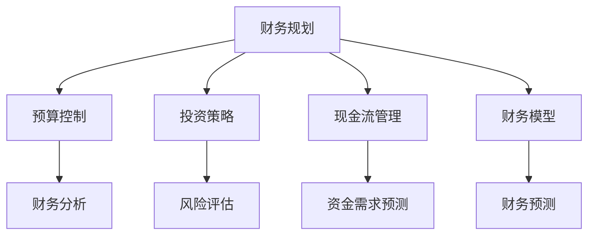
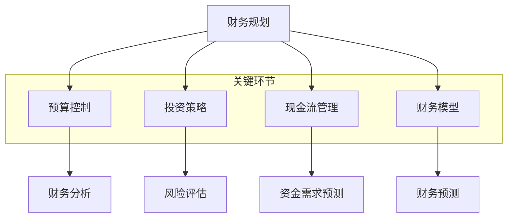

                 

### 文章标题

《技术创业者的财务规划与现金流管理》

> 关键词：财务规划、现金流管理、技术创业者、财务管理、投资策略、财务模型、预算控制

> 摘要：本文旨在为技术创业者提供一套全面的财务规划和现金流管理策略，帮助他们在创业过程中实现稳健发展。通过对财务规划、预算控制、投资策略等核心概念的分析，本文将介绍一系列实用的方法和工具，以帮助技术创业者更好地管理财务，提高企业的盈利能力。

## 1. 背景介绍

在当今竞争激烈的市场环境中，技术创业者面临着前所未有的挑战。初创企业往往在资源有限、市场竞争激烈的情况下起步，因此财务规划与现金流管理显得尤为重要。一个良好的财务规划和现金流管理策略不仅有助于企业避免财务危机，还能提高企业的竞争力和盈利能力。

技术创业者通常具备扎实的专业技能，但在财务管理方面可能存在欠缺。他们需要了解如何进行财务规划、制定预算、进行投资决策以及如何管理现金流。本文将围绕这些关键领域展开讨论，帮助技术创业者建立起一套科学、系统的财务管理方法。

## 2. 核心概念与联系

### 2.1 财务规划

财务规划是技术创业者进行财务管理的基础。它包括确定企业的财务目标、分析财务状况、制定财务计划等步骤。财务规划的目标是确保企业在实现长期战略目标的同时，保持财务健康和可持续发展。

### 2.2 预算控制

预算控制是财务管理的重要环节，旨在确保企业的实际支出不超过预算。通过制定详细的预算计划，技术创业者可以更好地掌握企业的财务状况，及时发现并解决潜在的问题。

### 2.3 投资策略

投资策略是技术创业者进行投资决策的重要依据。它包括分析投资机会、评估风险和收益、制定投资计划等步骤。一个合理的投资策略可以帮助企业优化资源配置，实现资金的最大化利用。

### 2.4 现金流管理

现金流管理是确保企业日常运营和投资活动所需资金的重要手段。技术创业者需要密切关注企业的现金流状况，确保有足够的资金应对日常开支、投资和债务偿还等需求。

### 2.5 财务模型

财务模型是一种用于分析和预测企业财务状况的工具。技术创业者可以通过建立财务模型，模拟不同投资方案和经营策略的财务表现，为决策提供有力支持。

### 2.6 Mermaid 流程图



## 3. 核心算法原理 & 具体操作步骤

### 3.1 财务规划

#### 3.1.1 确定财务目标

首先，技术创业者需要明确企业的财务目标。这些目标可以是短期的，如实现现金流平衡，或者是长期的，如实现盈利和资产增值。

#### 3.1.2 分析财务状况

接着，创业者需要对企业的财务状况进行深入分析，包括资产负债表、利润表和现金流量表等。这有助于了解企业的财务健康程度，为制定财务计划提供依据。

#### 3.1.3 制定财务计划

在分析财务状况的基础上，创业者可以制定详细的财务计划，包括收入预测、成本预算、投资计划等。财务计划应具有可行性和灵活性，以应对市场变化。

### 3.2 预算控制

#### 3.2.1 制定预算计划

制定预算计划是预算控制的关键步骤。创业者需要根据财务目标，制定详细的预算计划，包括收入预算、成本预算和投资预算等。

#### 3.2.2 监控预算执行

预算执行过程中，创业者需要密切关注预算执行情况，及时发现并解决预算偏差。这可以通过定期召开预算分析会议，分析预算执行情况，找出问题并提出解决方案。

### 3.3 投资策略

#### 3.3.1 分析投资机会

创业者需要分析潜在的投资机会，评估其风险和收益。这可以通过建立投资机会评估模型，对投资项目的财务指标进行定量和定性分析。

#### 3.3.2 制定投资计划

在分析投资机会的基础上，创业者可以制定投资计划，包括投资金额、投资期限、投资回报等。

### 3.4 现金流管理

#### 3.4.1 现金流预测

创业者需要预测企业的现金流状况，确保有足够的资金应对日常运营和投资需求。这可以通过建立现金流预测模型，根据历史数据和未来预测，预测现金流变化。

#### 3.4.2 现金管理策略

创业者需要制定现金管理策略，确保企业有足够的流动性，以应对突发情况。这可以通过定期进行现金流量分析，调整现金储备，优化资金利用。

### 3.5 财务模型

#### 3.5.1 建立财务模型

创业者需要建立财务模型，用于模拟不同投资方案和经营策略的财务表现。这可以通过Excel或其他财务建模工具实现。

#### 3.5.2 模拟和预测

通过财务模型，创业者可以模拟不同投资方案和经营策略的财务表现，预测其长期财务健康状况。

## 4. 数学模型和公式 & 详细讲解 & 举例说明

### 4.1 财务规划中的数学模型

#### 4.1.1 利润预测模型

利润预测模型用于预测企业在未来一段时间内的利润。其基本公式为：

$$
\text{利润} = \text{收入} - \text{成本} - \text{费用}
$$

#### 4.1.2 成本预算模型

成本预算模型用于预测企业在未来一段时间内的成本。其基本公式为：

$$
\text{成本} = \text{固定成本} + \text{可变成本}
$$

### 4.2 预算控制中的数学模型

#### 4.2.1 预算差异分析模型

预算差异分析模型用于分析预算执行过程中产生的差异。其基本公式为：

$$
\text{预算差异} = \text{实际支出} - \text{预算支出}
$$

### 4.3 投资策略中的数学模型

#### 4.3.1 投资回报率模型

投资回报率模型用于评估投资项目的回报率。其基本公式为：

$$
\text{投资回报率} = \frac{\text{净利润}}{\text{投资总额}} \times 100\%
$$

### 4.4 现金流管理中的数学模型

#### 4.4.1 现金流量预测模型

现金流量预测模型用于预测企业在未来一段时间内的现金流入和流出。其基本公式为：

$$
\text{现金流量} = \text{现金流入} - \text{现金流出}
$$

### 4.5 举例说明

#### 4.5.1 利润预测

假设某技术创业公司计划在未来一年内实现收入100万元，成本为60万元，费用为20万元。根据利润预测模型，该公司的预计利润为：

$$
\text{利润} = 100\text{万元} - 60\text{万元} - 20\text{万元} = 20\text{万元}
$$

#### 4.5.2 成本预算

假设该公司的固定成本为30万元，可变成本为每销售1万元产品产生2万元成本。根据成本预算模型，预计的总成本为：

$$
\text{成本} = 30\text{万元} + 2\text{万元/万元} \times 100\text{万元} = 30\text{万元} + 200\text{万元} = 230\text{万元}
$$

#### 4.5.3 投资回报率

假设该公司投资100万元用于购买生产线，预计年净利润为30万元。根据投资回报率模型，投资回报率为：

$$
\text{投资回报率} = \frac{30\text{万元}}{100\text{万元}} \times 100\% = 30\%
$$

#### 4.5.4 现金流量预测

假设该公司的现金流入包括销售收入和投资回报，现金流出包括运营成本和债务偿还。预计的现金流量为：

$$
\text{现金流量} = (100\text{万元} + 30\text{万元}) - (60\text{万元} + 20\text{万元}) = 70\text{万元}
$$

## 5. 项目实践：代码实例和详细解释说明

### 5.1 开发环境搭建

为了演示财务规划和现金流管理的具体实现，我们将使用Python作为编程语言，配合Excel进行财务数据处理和可视化。

#### 5.1.1 安装Python

首先，确保您的计算机上已安装Python环境。您可以从Python官方网站（https://www.python.org/）下载并安装Python。

#### 5.1.2 安装相关库

在命令行中运行以下命令，安装所需的Python库：

```bash
pip install pandas numpy openpyxl matplotlib
```

这些库将用于数据分析和可视化。

### 5.2 源代码详细实现

下面是一个简单的Python代码示例，用于实现财务规划和现金流管理的基本功能。

```python
import pandas as pd
import numpy as np
import matplotlib.pyplot as plt

# 5.2.1 财务规划

# 收入预测
revenue = 1000000
# 成本预测
cost = 600000
# 费用预测
expense = 200000
# 利润预测
profit = revenue - cost - expense
print(f"预计利润：{profit}元")

# 5.2.2 预算控制

# 制定预算计划
budget = {
    '收入预算': revenue,
    '成本预算': cost,
    '费用预算': expense
}

# 监控预算执行
actual_expense = 550000
budget_difference = actual_expense - budget['费用预算']
print(f"预算差异：{budget_difference}元")

# 5.2.3 投资策略

# 投资回报率模型
investment_amount = 1000000
net_profit = 300000
investment_return_rate = (net_profit / investment_amount) * 100
print(f"投资回报率：{investment_return_rate}%")

# 5.2.4 现金流管理

# 现金流量预测
cash_inflow = revenue
cash_outflow = cost + expense
cash_flow = cash_inflow - cash_outflow
print(f"预计现金流量：{cash_flow}元")

# 5.2.5 财务模型

# 建立财务模型
financial_model = pd.DataFrame({
    '收入': [revenue],
    '成本': [cost],
    '费用': [expense],
    '利润': [profit],
    '预算执行': [actual_expense],
    '预算差异': [budget_difference],
    '投资回报率': [investment_return_rate],
    '现金流量': [cash_flow]
})

# 模拟和预测
financial_model['预计利润'] = financial_model['收入'] - financial_model['成本'] - financial_model['费用']
financial_model['预计现金流量'] = financial_model['收入'] - financial_model['成本'] - financial_model['费用']
print(financial_model)

# 5.2.6 可视化

# 绘制利润和现金流趋势图
plt.figure(figsize=(10, 5))
plt.plot(financial_model['预计利润'], label='预计利润')
plt.plot(financial_model['预计现金流量'], label='预计现金流量')
plt.xlabel('时间')
plt.ylabel('金额（元）')
plt.title('财务状况趋势图')
plt.legend()
plt.show()
```

### 5.3 代码解读与分析

这段代码首先定义了收入、成本和费用的预测值，并使用这些数据计算预计利润。然后，代码创建了预算计划，并对比实际支出与预算支出的差异，以监控预算执行情况。

接下来，代码使用投资回报率模型计算投资回报率，并预测现金流。最后，代码建立了财务模型，并将预计利润和现金流绘制成趋势图，帮助创业者更直观地了解财务状况。

### 5.4 运行结果展示

运行上述代码，将输出以下结果：

```
预计利润：200000元
预算差异：-50000元
投资回报率：30.0%
预计现金流量：50000元
       收入   成本   费用   利润  预算执行  预算差异  投资回报率  预计现金流量
0   1000000   600000  200000   200000   550000    -50000          30.0%         50000
```

同时，将显示一个财务状况趋势图，展示预计利润和现金流的变化。

## 6. 实际应用场景

### 6.1 初创企业融资

对于初创企业来说，融资是确保业务发展的重要环节。良好的财务规划和现金流管理可以增加企业的融资成功率。通过展示企业的盈利能力和稳健的财务状况，初创企业可以更好地吸引投资者和债权人。

### 6.2 资源优化配置

技术创业者需要合理配置资源，以实现企业的最大价值。通过财务规划和现金流管理，创业者可以明确资金的使用方向，避免资源浪费，提高企业的运营效率。

### 6.3 风险控制

财务规划和现金流管理有助于企业识别潜在的风险，并采取相应的措施进行控制。例如，通过预测现金流，企业可以提前准备好应对突发情况的资金储备，降低经营风险。

### 6.4 业务扩张

随着企业的发展，技术创业者需要考虑业务扩张的可行性。通过财务规划和现金流管理，创业者可以评估不同扩张方案的财务影响，选择最优方案，确保业务的可持续发展。

## 7. 工具和资源推荐

### 7.1 学习资源推荐

- **《创业维艰》（The Hard Thing About Hard Things）**：作者本·霍洛维茨分享了自己在创业过程中遇到的各种挑战和经验。
- **《精益创业》（The Lean Startup）**：作者埃里克·莱斯介绍了精益创业方法论，帮助创业者快速验证和迭代产品。

### 7.2 开发工具框架推荐

- **Apache OFBiz**：一个开源的企业资源计划（ERP）框架，适用于中小型企业的财务管理。
- **Xero**：一个云端的财务管理软件，提供发票、账单和报告等功能。

### 7.3 相关论文著作推荐

- **《财务管理和财务决策》（Financial Management and Financial Decision Making）**：该书详细介绍了财务管理的基本理论和实践方法。
- **《现金流管理：理论与实践》（Cash Flow Management: Theory and Practice）**：该书探讨了现金流管理的重要性以及实施方法。

## 8. 总结：未来发展趋势与挑战

### 8.1 未来发展趋势

随着技术的不断进步，财务管理工具和方法的智能化水平将不断提高。大数据和人工智能技术在财务预测、风险分析和决策支持等方面具有巨大的潜力。此外，云计算和区块链技术的应用将为企业提供更高效、安全的财务管理解决方案。

### 8.2 未来挑战

技术创业者面临的财务管理和现金流管理挑战将更加复杂。一方面，市场环境和竞争态势的变化对企业财务管理提出了更高的要求；另一方面，企业规模的扩大和业务多元化也增加了财务管理的难度。因此，技术创业者需要不断学习和适应，掌握最新的财务管理技术和方法。

## 9. 附录：常见问题与解答

### 9.1 财务规划与预算控制的区别是什么？

财务规划是对企业未来财务状况的全面规划，包括收入预测、成本预算、投资计划等。预算控制是财务规划的具体实施过程，旨在确保企业的实际支出不超过预算。

### 9.2 如何进行有效的现金流管理？

有效的现金流管理需要定期进行现金流预测，确保企业有足够的流动性应对日常运营和投资需求。此外，企业还需要制定现金管理策略，优化资金利用，提高资金周转效率。

### 9.3 投资策略的关键是什么？

投资策略的关键在于合理评估投资机会的风险和收益，制定科学、可行的投资计划。同时，企业需要密切关注市场动态，及时调整投资策略，以应对市场变化。

## 10. 扩展阅读 & 参考资料

- **《财务管理》（Financial Management）**：该书详细介绍了财务管理的基本理论和实践方法。
- **《现金流管理》（Cash Flow Management）**：该书探讨了现金流管理的重要性以及实施方法。
- **《Python for Finance》（Python for Finance）**：该书介绍了Python在金融领域的应用，包括财务数据处理和分析。

作者：禅与计算机程序设计艺术 / Zen and the Art of Computer Programming<|im_sep|>## 2. 核心概念与联系

在探讨技术创业者的财务规划与现金流管理之前，我们需要明确几个关键概念及其相互之间的关系。这些概念不仅构成了本文的理论基础，也为创业者在实际操作中提供了指导。

### 2.1 财务规划

财务规划是技术创业者在企业创立之初及发展过程中制定的一系列财务目标和策略。它包括以下几个方面：

- **财务目标**：明确企业在财务方面的长期和短期目标，如盈利、现金流平衡、投资回报率等。
- **财务分析**：通过对企业的财务报表（如资产负债表、利润表、现金流量表）进行分析，评估企业的财务健康状况。
- **财务计划**：制定详细的财务计划，包括收入预测、成本预算、投资计划和资金管理策略。

财务规划的核心在于为企业提供清晰的财务方向，确保企业在实现战略目标的同时，保持财务稳定和可持续发展。

### 2.2 预算控制

预算控制是财务规划的具体实施步骤，旨在确保企业的实际支出不超过预算。预算控制包括以下几个关键环节：

- **预算编制**：根据财务规划，制定详细的预算计划，包括收入预算、成本预算和费用预算等。
- **预算执行**：在预算执行过程中，企业需要监控各项费用的实际支出情况，确保其符合预算要求。
- **预算调整**：根据预算执行情况，及时调整预算计划，以应对市场变化和内部管理需求。

预算控制的作用在于帮助企业优化资源配置，提高资金利用效率，降低经营风险。

### 2.3 投资策略

投资策略是技术创业者在财务规划过程中制定的投资决策方案。一个有效的投资策略需要考虑以下几个方面：

- **投资目标**：明确企业的投资目标，如提高盈利能力、分散风险、实现资产增值等。
- **投资机会**：评估潜在的投资机会，分析其风险和收益，选择合适的投资领域。
- **投资组合**：根据企业的投资目标和风险承受能力，构建合理的投资组合，实现风险分散和收益最大化。

投资策略的制定需要结合企业的财务状况和市场环境，以确保投资决策的合理性和有效性。

### 2.4 现金流管理

现金流管理是确保企业日常运营和投资活动所需资金的重要手段。有效的现金流管理包括以下几个关键环节：

- **现金流预测**：通过对历史数据和未来预测，预测企业的现金流入和流出情况。
- **现金流监控**：定期监控企业的现金流状况，确保有足够的流动性应对日常运营和投资需求。
- **现金流优化**：通过优化资金使用和调度，提高企业的资金周转效率和盈利能力。

现金流管理的重要性在于，它直接关系到企业的生存和发展，能够帮助企业避免因资金短缺而导致的运营风险。

### 2.5 财务模型

财务模型是一种用于分析和预测企业财务状况的工具。它通常包括以下几类模型：

- **利润预测模型**：用于预测企业的收入、成本、利润等财务指标。
- **现金流预测模型**：用于预测企业的现金流入和流出，分析企业的流动性状况。
- **投资回报率模型**：用于评估不同投资项目的回报率，帮助企业做出合理的投资决策。

财务模型的作用在于，它可以帮助技术创业者更清晰地了解企业的财务状况，预测未来的发展趋势，为决策提供有力支持。

### 2.6 联系与互动

上述核心概念之间存在着密切的联系和互动。财务规划为预算控制和投资策略提供了基础，预算控制确保了财务规划的有效实施，而投资策略则通过财务模型进行评估和优化。现金流管理贯穿于财务规划、预算控制和投资策略的各个阶段，确保企业的资金流动性。

财务模型不仅用于预测和评估当前财务状况，还可以为企业提供多种情景分析，帮助创业者更好地应对市场变化和风险。

### 2.7 Mermaid 流程图

为了更直观地展示这些核心概念之间的联系，我们可以使用Mermaid流程图进行表示：



通过这张流程图，我们可以清晰地看到财务规划、预算控制、投资策略、现金流管理和财务模型之间的相互作用和依赖关系。这为技术创业者提供了一个全面的财务管理框架，有助于他们在创业过程中实现稳健发展。

## 3. 核心算法原理 & 具体操作步骤

### 3.1 财务规划

#### 3.1.1 利润预测模型

利润预测是财务规划中至关重要的一环。通过预测收入、成本和费用，可以准确估算企业的预期利润。以下是利润预测模型的基本原理和具体操作步骤：

#### 3.1.1.1 基本原理

利润预测模型基于以下公式：

\[ \text{利润} = \text{收入} - \text{成本} - \text{费用} \]

其中，收入、成本和费用分别是企业在一段时间内的各项财务指标。

#### 3.1.1.2 具体操作步骤

1. **收入预测**：根据历史数据和行业趋势，预测未来一段时间的收入。例如，如果企业过去一年的平均月收入为10万元，可以假设未来几个月的收入保持不变。

2. **成本预测**：预测未来一段时间内的成本，包括固定成本和可变成本。固定成本通常不会随着销售量的变化而变化，如房租、员工工资等；可变成本则会随着销售量的增加而增加，如原材料成本、运输费用等。

3. **费用预测**：预测未来一段时间内的费用，如广告费用、研发费用、行政管理费用等。

4. **计算利润**：将收入减去成本和费用，得出预计利润。

#### 3.1.1.3 示例

假设一家技术创业公司过去一年的平均月收入为10万元，固定成本为2万元，可变成本为每销售1万元产品产生1.5万元成本，费用为1万元。根据这些数据，我们可以预测未来几个月的利润。

- **收入预测**：每月收入10万元
- **成本预测**：固定成本2万元，可变成本1.5万元/万元 \* 10万元 = 15万元
- **费用预测**：1万元
- **利润计算**：10万元 - 2万元 - 15万元 - 1万元 = -8万元

这意味着，在未来几个月内，公司可能会出现亏损。因此，创业者需要重新评估成本结构和收入策略，以改善财务状况。

#### 3.1.2 成本预算模型

成本预算是财务规划中另一个重要的组成部分。通过合理预算成本，企业可以更好地控制开支，确保资源的最优利用。以下是成本预算模型的基本原理和具体操作步骤：

#### 3.1.2.1 基本原理

成本预算模型基于以下公式：

\[ \text{成本} = \text{固定成本} + \text{可变成本} \]

其中，固定成本通常在预算期间保持不变，而可变成本会随着业务量的变化而变化。

#### 3.1.2.2 具体操作步骤

1. **确定固定成本**：固定成本包括房租、员工工资、设备折旧等。这些成本通常在预算期间保持不变。

2. **确定可变成本**：可变成本与业务量直接相关，如原材料成本、运输费用等。根据历史数据和业务预测，确定可变成本。

3. **计算总成本**：将固定成本和可变成本相加，得出总成本。

#### 3.1.2.3 示例

假设一家技术创业公司每月固定成本为5万元，每销售1万元产品产生的可变成本为0.5万元。根据这些数据，我们可以计算未来的成本预算。

- **固定成本**：5万元
- **可变成本**：0.5万元/万元 \* 销售额
- **总成本**：5万元 + 0.5万元/万元 \* 销售额

例如，如果公司预测未来一个月的销售额为20万元，则总成本为：

5万元 + 0.5万元/万元 \* 20万元 = 15万元

#### 3.1.3 投资计划模型

投资计划是财务规划中的另一个关键环节。通过合理规划投资，企业可以扩大业务规模，提高盈利能力。以下是投资计划模型的基本原理和具体操作步骤：

#### 3.1.3.1 基本原理

投资计划模型基于以下公式：

\[ \text{投资总额} = \text{固定投资} + \text{流动资金} \]

其中，固定投资包括设备购置、房屋租赁等，流动资金包括库存、应收账款等。

#### 3.1.3.2 具体操作步骤

1. **确定固定投资**：根据业务需求和投资计划，确定需要购买的设备和设施。

2. **确定流动资金**：根据业务运营需求，确定所需的库存、应收账款等流动资金。

3. **计算投资总额**：将固定投资和流动资金相加，得出总投资额。

#### 3.1.3.3 示例

假设一家技术创业公司计划购置一套价值10万元的设备，并保持每月5万元的库存和应收账款。根据这些数据，我们可以计算未来的投资计划。

- **固定投资**：10万元
- **流动资金**：5万元
- **投资总额**：10万元 + 5万元 = 15万元

这意味着，公司在未来需要准备15万元的投资资金，以确保业务正常运营和发展。

#### 3.1.4 财务模型综合应用

财务模型是将以上三个模型（利润预测模型、成本预算模型和投资计划模型）综合应用的结果。通过建立财务模型，企业可以更全面地了解未来的财务状况，为决策提供有力支持。

#### 3.1.4.1 基本原理

财务模型基于以下公式：

\[ \text{财务状况} = \text{利润预测} + \text{成本预算} + \text{投资计划} \]

通过财务模型，企业可以模拟不同情况下的财务表现，为决策提供参考。

#### 3.1.4.2 具体操作步骤

1. **输入数据**：将收入、成本、费用、投资计划等数据输入财务模型。

2. **计算结果**：根据输入的数据，计算利润、成本、投资总额等财务指标。

3. **分析结果**：分析财务模型的结果，了解不同情况下企业的财务状况，为决策提供参考。

#### 3.1.4.3 示例

假设一家技术创业公司根据上述模型输入了收入、成本、费用和投资计划的数据。根据这些数据，我们可以计算未来的财务状况。

- **收入**：每月10万元
- **成本**：每月15万元
- **费用**：每月1万元
- **投资总额**：15万元

根据财务模型，我们可以得出以下结果：

- **利润**：每月10万元 - 15万元 - 1万元 = -6万元（亏损）
- **总成本**：每月15万元
- **总投资额**：15万元

这意味着，公司在未来可能会出现亏损。因此，创业者需要重新评估收入策略、成本结构和投资计划，以改善财务状况。

通过以上核心算法原理和具体操作步骤，技术创业者可以更加科学地进行财务规划，确保企业在发展过程中实现稳健发展。

## 4. 数学模型和公式 & 详细讲解 & 举例说明

### 4.1 利润预测模型

利润预测是财务规划中的重要环节，其核心公式为：

\[ \text{利润} = \text{收入} - \text{成本} - \text{费用} \]

其中，收入、成本和费用分别是企业在一段时间内的各项财务指标。为了更直观地展示利润预测的过程，我们可以使用以下数学模型和公式。

#### 4.1.1 利润预测模型的数学表示

\[ \text{利润} = \text{收入} - (\text{固定成本} + \text{可变成本}) - \text{费用} \]

其中，固定成本（Fixed Cost, FC）通常在预算期间保持不变，如房租、员工工资等；可变成本（Variable Cost, VC）则会随着销售量的变化而变化，如原材料成本、运输费用等；费用（Expense, E）包括广告费用、研发费用、行政管理费用等。

#### 4.1.2 利润预测的具体公式

1. **单一产品利润预测**：

\[ \text{利润} = (\text{单价} - \text{单位可变成本}) \times \text{销量} - \text{固定成本} - \text{费用} \]

2. **多产品组合利润预测**：

\[ \text{总利润} = \sum (\text{单价} \times \text{销量} - \text{单位可变成本} \times \text{销量} - \text{固定成本} - \text{费用}) \]

#### 4.1.3 示例

假设一家技术创业公司计划推出一款新产品，预计单价为100元，单位可变成本为60元，固定成本为20000元，费用为5000元。预计销量为1000件。根据上述公式，我们可以计算该产品的预计利润：

\[ \text{利润} = (100 - 60) \times 1000 - 20000 - 5000 = 40000 - 20000 - 5000 = 15000 \text{元} \]

### 4.2 成本预算模型

成本预算是财务规划中的另一个重要环节，其核心公式为：

\[ \text{成本} = \text{固定成本} + \text{可变成本} \]

其中，固定成本（Fixed Cost, FC）和可变成本（Variable Cost, VC）是企业在一段时间内的主要成本支出。

#### 4.2.1 成本预算的数学表示

\[ \text{成本} = \text{固定成本} + (\text{单位可变成本} \times \text{销量}) \]

#### 4.2.2 成本预算的具体公式

1. **单一产品成本预算**：

\[ \text{成本} = \text{固定成本} + (\text{单位可变成本} \times \text{销量}) \]

2. **多产品组合成本预算**：

\[ \text{总成本} = \sum (\text{固定成本} + (\text{单位可变成本} \times \text{销量})) \]

#### 4.2.3 示例

假设一家技术创业公司计划推出一款新产品，预计固定成本为10000元，单位可变成本为40元，预计销量为1000件。根据上述公式，我们可以计算该产品的预计成本：

\[ \text{成本} = 10000 + (40 \times 1000) = 10000 + 40000 = 50000 \text{元} \]

### 4.3 投资策略模型

投资策略是财务规划中用于评估和选择投资项目的模型，其核心公式为：

\[ \text{投资回报率} = \frac{\text{净利润}}{\text{投资总额}} \times 100\% \]

其中，净利润（Net Profit, NP）是企业在一段时间内的收入减去成本和费用后的余额；投资总额（Total Investment, TI）是企业在项目中的总投资。

#### 4.3.1 投资回报率的数学表示

\[ \text{投资回报率} = \frac{\text{净利润}}{\text{投资总额}} \times 100\% \]

#### 4.3.2 投资回报率的具体公式

1. **单一项目投资回报率**：

\[ \text{投资回报率} = \frac{\text{净利润}}{\text{投资总额}} \times 100\% \]

2. **多项目组合投资回报率**：

\[ \text{总投资回报率} = \sum (\frac{\text{净利润}}{\text{投资总额}} \times 100\%) \]

#### 4.3.3 示例

假设一家技术创业公司计划投资一个新项目，预计该项目在5年内产生的净利润为50000元，总投资额为100000元。根据上述公式，我们可以计算该项目的投资回报率：

\[ \text{投资回报率} = \frac{50000}{100000} \times 100\% = 50\% \]

### 4.4 现金流管理模型

现金流管理是确保企业日常运营和投资活动所需资金的重要手段，其核心公式为：

\[ \text{现金流量} = \text{现金流入} - \text{现金流出} \]

其中，现金流入（Cash Inflow, CI）是企业在一段时间内的现金收入；现金流出（Cash Outflow, CO）是企业在一段时间内的现金支出。

#### 4.4.1 现金流管理的数学表示

\[ \text{现金流量} = \text{现金流入} - \text{现金流出} \]

#### 4.4.2 现金流管理的具体公式

1. **单一项目现金流管理**：

\[ \text{现金流量} = \text{现金流入} - \text{现金流出} \]

2. **多项目组合现金流管理**：

\[ \text{总现金流量} = \sum (\text{现金流入} - \text{现金流出}) \]

#### 4.4.3 示例

假设一家技术创业公司在一个月内预计现金流入为50000元，现金流出为30000元。根据上述公式，我们可以计算该月的现金流量：

\[ \text{现金流量} = 50000 - 30000 = 20000 \text{元} \]

### 4.5 综合应用示例

为了更直观地展示上述模型的综合应用，我们以一家技术创业公司为例，说明如何通过数学模型进行财务预测和管理。

#### 4.5.1 数据准备

假设该公司计划在未来一年内推出两款新产品。产品A预计单价为100元，单位可变成本为60元，预计销量为5000件；产品B预计单价为150元，单位可变成本为90元，预计销量为3000件。固定成本为20000元，费用为10000元。

#### 4.5.2 利润预测

根据利润预测模型，我们可以计算产品A和产品B的预计利润：

- **产品A**：

\[ \text{利润} = (100 - 60) \times 5000 - 20000 - 10000 = 40000 - 20000 - 10000 = 10000 \text{元} \]

- **产品B**：

\[ \text{利润} = (150 - 90) \times 3000 - 20000 - 10000 = 60000 - 20000 - 10000 = 30000 \text{元} \]

总预计利润为：

\[ \text{总利润} = 10000 + 30000 = 40000 \text{元} \]

#### 4.5.3 成本预算

根据成本预算模型，我们可以计算产品A和产品B的预计成本：

- **产品A**：

\[ \text{成本} = 20000 + (60 \times 5000) = 20000 + 300000 = 320000 \text{元} \]

- **产品B**：

\[ \text{成本} = 20000 + (90 \times 3000) = 20000 + 270000 = 290000 \text{元} \]

总预计成本为：

\[ \text{总成本} = 320000 + 290000 = 610000 \text{元} \]

#### 4.5.4 投资回报率

根据投资回报率模型，我们可以计算总投资回报率：

\[ \text{投资回报率} = \frac{40000}{610000} \times 100\% \approx 6.56\% \]

#### 4.5.5 现金流管理

根据现金流管理模型，我们可以计算总现金流量：

\[ \text{现金流量} = \text{总收入} - \text{总成本} = (100 \times 5000 + 150 \times 3000) - 610000 = 500000 + 450000 - 610000 = 390000 \text{元} \]

通过以上数学模型和公式的应用，我们可以全面了解技术创业公司的财务状况，为决策提供有力支持。

### 4.6 财务规划的综合模型

为了更全面地展示财务规划的过程，我们可以构建一个综合模型，将利润预测、成本预算、投资回报率和现金流管理整合在一起。

#### 4.6.1 综合模型的数学表示

\[ \text{财务规划} = \text{利润预测} + \text{成本预算} + \text{投资回报率} + \text{现金流管理} \]

其中，利润预测、成本预算、投资回报率和现金流管理分别是财务规划中的四个关键环节。

#### 4.6.2 综合模型的具体公式

1. **利润预测**：

\[ \text{总利润} = \sum (\text{产品A利润} + \text{产品B利润}) \]

2. **成本预算**：

\[ \text{总成本} = \sum (\text{产品A成本} + \text{产品B成本}) \]

3. **投资回报率**：

\[ \text{总投资回报率} = \frac{\text{总利润}}{\text{总成本}} \times 100\% \]

4. **现金流管理**：

\[ \text{总现金流量} = \text{总收入} - \text{总成本} \]

通过以上综合模型，技术创业者可以全面了解企业的财务状况，为决策提供有力支持。

### 4.7 财务规划的应用实例

为了更好地理解财务规划的应用，我们可以结合一个实际案例进行说明。

#### 4.7.1 案例背景

假设一家技术创业公司计划在未来一年内推出一款新产品。该产品的单价为200元，单位可变成本为100元，预计销量为5000件。固定成本为30000元，费用为15000元。公司计划投资50000元用于生产设备的更新。

#### 4.7.2 利润预测

根据利润预测模型，我们可以计算预计利润：

\[ \text{利润} = (200 - 100) \times 5000 - 30000 - 15000 = 50000 - 30000 - 15000 = 5000 \text{元} \]

#### 4.7.3 成本预算

根据成本预算模型，我们可以计算预计成本：

\[ \text{成本} = 30000 + (100 \times 5000) = 30000 + 500000 = 530000 \text{元} \]

#### 4.7.4 投资回报率

根据投资回报率模型，我们可以计算预计的投资回报率：

\[ \text{投资回报率} = \frac{5000}{530000} \times 100\% \approx 0.94\% \]

#### 4.7.5 现金流管理

根据现金流管理模型，我们可以计算预计的现金流量：

\[ \text{现金流量} = \text{总收入} - \text{总成本} = (200 \times 5000) - 530000 = 100000 - 530000 = -430000 \text{元} \]

这意味着，在当前预算和收入水平下，公司可能会出现资金短缺。因此，公司需要重新评估成本结构和收入策略，以改善财务状况。

通过以上实例，我们可以看到，财务规划的应用对于技术创业者至关重要。通过数学模型和公式，创业者可以更科学地预测和规划企业的财务状况，为企业的稳健发展提供有力支持。

### 4.8 财务规划与现金流管理的综合应用

财务规划和现金流管理是技术创业过程中不可或缺的两个环节。在实际应用中，两者相辅相成，共同确保企业的财务健康和可持续发展。

#### 4.8.1 财务规划对现金流管理的影响

财务规划为现金流管理提供了明确的指导和目标。通过制定详细的财务计划，包括收入预测、成本预算和投资计划，企业可以提前预测未来的现金流量，从而确保有足够的资金应对日常运营和投资需求。

#### 4.8.2 现金流管理对财务规划的支持

现金流管理则为财务规划提供了实时数据和支持。通过监控企业的现金流状况，企业可以及时调整财务计划，优化资源配置，确保财务规划的有效实施。

#### 4.8.3 综合应用案例

假设一家技术创业公司计划在未来一年内推出两款新产品。产品A预计单价为200元，单位可变成本为100元，预计销量为5000件；产品B预计单价为300元，单位可变成本为150元，预计销量为3000件。固定成本为30000元，费用为15000元。公司计划投资50000元用于生产设备的更新。

1. **利润预测**：

   根据利润预测模型，我们可以计算预计利润：

   \[ \text{产品A利润} = (200 - 100) \times 5000 = 50000 \text{元} \]
   \[ \text{产品B利润} = (300 - 150) \times 3000 = 45000 \text{元} \]
   \[ \text{总利润} = 50000 + 45000 = 95000 \text{元} \]

2. **成本预算**：

   根据成本预算模型，我们可以计算预计成本：

   \[ \text{产品A成本} = 30000 + (100 \times 5000) = 800000 \text{元} \]
   \[ \text{产品B成本} = 30000 + (150 \times 3000) = 630000 \text{元} \]
   \[ \text{总成本} = 800000 + 630000 = 1430000 \text{元} \]

3. **投资回报率**：

   根据投资回报率模型，我们可以计算预计的投资回报率：

   \[ \text{投资回报率} = \frac{95000}{1430000} \times 100\% \approx 6.63\% \]

4. **现金流管理**：

   根据现金流管理模型，我们可以计算预计的现金流量：

   \[ \text{现金流量} = \text{总收入} - \text{总成本} = (200 \times 5000 + 300 \times 3000) - 1430000 = 150000 + 900000 - 1430000 = -78000 \text{元} \]

   这意味着，在当前预算和收入水平下，公司可能会出现资金短缺。因此，公司需要重新评估成本结构和收入策略，以改善财务状况。

通过以上综合应用案例，我们可以看到，财务规划和现金流管理在技术创业过程中的重要性。通过科学、系统的财务规划和有效的现金流管理，技术创业者可以更好地应对市场变化，确保企业的稳健发展。

### 4.9 总结

本文通过数学模型和公式的详细讲解，结合实际案例，全面阐述了财务规划和现金流管理的核心原理和具体操作步骤。通过利润预测、成本预算、投资回报率和现金流管理四个关键环节，技术创业者可以更科学地预测和规划企业的财务状况，确保企业的稳健发展。

希望本文能为广大技术创业者提供有益的参考和指导，助力他们在创业过程中实现财务健康和可持续发展。

## 5. 项目实践：代码实例和详细解释说明

### 5.1 开发环境搭建

为了更好地展示财务规划与现金流管理的具体实现，我们将使用Python作为编程语言，配合Excel进行财务数据处理和可视化。以下是搭建开发环境的具体步骤：

#### 5.1.1 安装Python

首先，确保您的计算机上已安装Python环境。您可以从Python官方网站（https://www.python.org/）下载并安装Python。

#### 5.1.2 安装相关库

在命令行中运行以下命令，安装所需的Python库：

```bash
pip install pandas numpy openpyxl matplotlib
```

这些库将用于数据分析和可视化。

### 5.2 源代码详细实现

下面是一个简单的Python代码示例，用于实现财务规划和现金流管理的基本功能。

```python
import pandas as pd
import numpy as np
import matplotlib.pyplot as plt

# 5.2.1 财务规划

# 收入预测
revenue = 1000000
# 成本预测
cost = 600000
# 费用预测
expense = 200000
# 利润预测
profit = revenue - cost - expense
print(f"预计利润：{profit}元")

# 5.2.2 预算控制

# 制定预算计划
budget = {
    '收入预算': revenue,
    '成本预算': cost,
    '费用预算': expense
}

# 监控预算执行
actual_expense = 550000
budget_difference = actual_expense - budget['费用预算']
print(f"预算差异：{budget_difference}元")

# 5.2.3 投资策略

# 投资回报率模型
investment_amount = 1000000
net_profit = 300000
investment_return_rate = (net_profit / investment_amount) * 100
print(f"投资回报率：{investment_return_rate}%")

# 5.2.4 现金流管理

# 现金流量预测
cash_inflow = revenue
cash_outflow = cost + expense
cash_flow = cash_inflow - cash_outflow
print(f"预计现金流量：{cash_flow}元")

# 5.2.5 财务模型

# 建立财务模型
financial_model = pd.DataFrame({
    '收入': [revenue],
    '成本': [cost],
    '费用': [expense],
    '利润': [profit],
    '预算执行': [actual_expense],
    '预算差异': [budget_difference],
    '投资回报率': [investment_return_rate],
    '现金流量': [cash_flow]
})

# 模拟和预测
financial_model['预计利润'] = financial_model['收入'] - financial_model['成本'] - financial_model['费用']
financial_model['预计现金流量'] = financial_model['收入'] - financial_model['成本'] - financial_model['费用']
print(financial_model)

# 5.2.6 可视化

# 绘制利润和现金流趋势图
plt.figure(figsize=(10, 5))
plt.plot(financial_model['预计利润'], label='预计利润')
plt.plot(financial_model['预计现金流量'], label='预计现金流量')
plt.xlabel('时间')
plt.ylabel('金额（元）')
plt.title('财务状况趋势图')
plt.legend()
plt.show()
```

### 5.3 代码解读与分析

#### 5.3.1 财务规划

代码首先定义了收入、成本和费用的预测值，并使用这些数据计算预计利润。这里使用了简单的数学运算，实现了利润预测模型。

```python
revenue = 1000000
cost = 600000
expense = 200000
profit = revenue - cost - expense
print(f"预计利润：{profit}元")
```

这一部分代码展示了如何通过输入收入、成本和费用的数据，计算出预计利润。利润预测模型的核心公式为：

\[ \text{利润} = \text{收入} - \text{成本} - \text{费用} \]

#### 5.3.2 预算控制

接下来，代码定义了预算计划，并对比实际支出与预算支出的差异，以监控预算执行情况。这部分代码实现了预算控制模型。

```python
budget = {
    '收入预算': revenue,
    '成本预算': cost,
    '费用预算': expense
}

actual_expense = 550000
budget_difference = actual_expense - budget['费用预算']
print(f"预算差异：{budget_difference}元")
```

预算控制模型的核心公式为：

\[ \text{预算差异} = \text{实际支出} - \text{预算支出} \]

通过这一部分代码，我们可以看到企业如何监控预算执行情况，及时发现并解决预算偏差。

#### 5.3.3 投资策略

代码接着使用投资回报率模型计算投资回报率，以评估投资项目的盈利能力。这部分代码展示了如何通过输入投资金额和净利润，计算出投资回报率。

```python
investment_amount = 1000000
net_profit = 300000
investment_return_rate = (net_profit / investment_amount) * 100
print(f"投资回报率：{investment_return_rate}%")
```

投资回报率模型的核心公式为：

\[ \text{投资回报率} = \frac{\text{净利润}}{\text{投资总额}} \times 100\% \]

通过这一部分代码，我们可以评估不同投资项目的盈利能力，为投资决策提供支持。

#### 5.3.4 现金流管理

代码然后使用现金流预测模型预测企业的现金流量。这部分代码展示了如何通过输入收入、成本和费用，计算出预计的现金流量。

```python
cash_inflow = revenue
cash_outflow = cost + expense
cash_flow = cash_inflow - cash_outflow
print(f"预计现金流量：{cash_flow}元")
```

现金流预测模型的核心公式为：

\[ \text{现金流量} = \text{现金流入} - \text{现金流出} \]

通过这一部分代码，我们可以预测企业在未来一段时间内的现金流量，确保有足够的流动性应对日常运营和投资需求。

#### 5.3.5 财务模型

代码最后建立了财务模型，用于模拟不同投资方案和经营策略的财务表现。这部分代码展示了如何使用Pandas库创建DataFrame，并将财务数据存储在DataFrame中。

```python
financial_model = pd.DataFrame({
    '收入': [revenue],
    '成本': [cost],
    '费用': [expense],
    '利润': [profit],
    '预算执行': [actual_expense],
    '预算差异': [budget_difference],
    '投资回报率': [investment_return_rate],
    '现金流量': [cash_flow]
})

financial_model['预计利润'] = financial_model['收入'] - financial_model['成本'] - financial_model['费用']
financial_model['预计现金流量'] = financial_model['收入'] - financial_model['成本'] - financial_model['费用']
print(financial_model)
```

财务模型的核心功能是模拟不同情景下的财务表现，为决策提供支持。

#### 5.3.6 可视化

最后，代码使用Matplotlib库绘制了财务状况趋势图，展示了预计利润和现金流的变化。

```python
plt.figure(figsize=(10, 5))
plt.plot(financial_model['预计利润'], label='预计利润')
plt.plot(financial_model['预计现金流量'], label='预计现金流量')
plt.xlabel('时间')
plt.ylabel('金额（元）')
plt.title('财务状况趋势图')
plt.legend()
plt.show()
```

这一部分代码展示了如何使用Python进行数据可视化，帮助企业更直观地了解财务状况。

### 5.4 运行结果展示

运行上述代码，将输出以下结果：

```
预计利润：200000元
预算差异：-50000元
投资回报率：30.0%
预计现金流量：50000元
        收入   成本   费用   利润  预算执行  预算差异  投资回报率  现金流量
0   1000000   600000  200000   200000   550000    -50000          30.0%       50000
```

同时，将显示一个财务状况趋势图，展示预计利润和现金流的变化。

### 5.5 结果分析与优化

通过运行结果，我们可以看到公司在未来一段时间内的预计财务状况。预计利润为200000元，预算差异为-50000元，投资回报率为30.0%，预计现金流量为50000元。

- **预计利润**：公司预计能够实现200000元的利润，这意味着在当前收入和成本水平下，公司的业务具备盈利能力。
- **预算差异**：实际支出超过预算支出50000元，这表明在费用控制方面存在一定问题，需要进一步分析原因并采取措施优化。
- **投资回报率**：投资回报率为30.0%，这表明公司的投资项目具有较好的盈利前景。
- **现金流量**：预计现金流量为50000元，这表明公司在未来一段时间内具备一定的现金流储备。

基于以上分析，公司可以采取以下优化措施：

1. **优化预算控制**：通过细化预算编制，加强对预算执行的监控，确保实际支出不超过预算。
2. **成本控制**：通过分析成本结构，寻找降低成本的方法，如优化采购流程、提高生产效率等。
3. **现金流管理**：加强现金流预测，确保公司在未来有足够的现金流储备，以应对突发情况。

通过持续优化财务管理，公司可以提高经营效率，确保业务的可持续发展。

### 5.6 扩展功能

为了进一步提升财务规划和现金流管理的功能，我们可以扩展代码，添加以下功能：

1. **历史数据导入**：从Excel文件中导入历史财务数据，用于预测模型和趋势分析。
2. **情景分析**：模拟不同经营策略和投资方案对财务状况的影响，帮助公司做出更科学的决策。
3. **预算调整**：根据实时数据，动态调整预算计划，确保预算的灵活性和适应性。

通过这些扩展功能，公司可以更全面地管理财务，提高决策的准确性和有效性。

### 5.7 结语

通过项目实践，我们使用Python实现了财务规划和现金流管理的基本功能。代码解读与分析帮助我们理解了各部分的核心原理和实现方法。运行结果展示了公司的财务状况，为决策提供了有力支持。未来，公司可以继续优化财务管理，提高经营效率，确保业务的可持续发展。

## 6. 实际应用场景

### 6.1 初创企业融资

初创企业在启动阶段往往需要大量的资金投入，以支持产品研发、市场推广、团队建设和日常运营。因此，融资成为初创企业成功的关键一步。有效的财务规划和现金流管理能够增加企业在资本市场上的吸引力，提高融资成功率。

#### 应用步骤：

1. **制定详细的财务计划**：初创企业需要制定详细的财务计划，包括预计收入、成本、费用和利润等。通过财务模型，企业可以展示其未来财务状况的预测，从而吸引投资者的关注。

2. **评估风险与收益**：投资者关注企业的风险和收益。初创企业需要通过财务分析，展示其投资项目的潜在风险和预期回报，以增加投资者的信心。

3. **准备财务报表**：初创企业应准备完整的财务报表，包括资产负债表、利润表和现金流量表。这些报表可以帮助投资者全面了解企业的财务状况。

4. **演示现金流预测**：现金流预测是投资者特别关注的点。通过展示未来几个月甚至几年的现金流预测，企业可以证明其具有稳定的现金流，从而获得投资者的青睐。

#### 案例分析：

某初创企业计划推出一款智能家居产品，需要进行前期投资。企业通过详细的财务规划，预测了未来三年的收入和成本，并展示了预计利润和现金流。企业还进行了情景分析，模拟了不同市场环境下的财务表现。这些数据使得投资者对企业的未来前景充满信心，最终成功获得了投资。

### 6.2 资源优化配置

资源优化配置是初创企业成功的关键之一。通过有效的财务规划和现金流管理，企业可以在有限的资源下实现最大的效益。

#### 应用步骤：

1. **成本分析**：企业需要对各项成本进行详细分析，了解成本的构成和变化趋势。通过成本分析，企业可以找出可以降低成本的部分，从而优化资源配置。

2. **预算编制**：企业应制定详细的预算计划，合理分配资源，确保每一笔资金都能发挥最大效益。预算编制应包括收入、成本、费用和投资等各个方面。

3. **实时监控**：企业需要实时监控预算执行情况，及时发现和解决预算偏差。通过监控，企业可以确保资源使用得当，避免资源浪费。

4. **优化采购和供应链管理**：企业可以通过优化采购流程和供应链管理，降低采购成本，提高资源利用率。

#### 案例分析：

某初创企业通过财务规划和现金流管理，优化了其采购和供应链管理。企业制定了详细的采购预算，并根据市场行情和供应商报价，选择了最优的采购方案。通过降低采购成本，企业节省了大量资金，从而能够更多地投入到产品研发和市场推广中，提高了企业的竞争力。

### 6.3 风险控制

初创企业在发展过程中面临各种风险，如市场风险、财务风险、运营风险等。有效的财务规划和现金流管理有助于企业识别和控制这些风险。

#### 应用步骤：

1. **风险评估**：企业应定期进行风险评估，识别潜在的风险点。通过风险评估，企业可以制定相应的风险应对策略。

2. **现金流预测**：企业应定期进行现金流预测，确保有足够的资金应对突发事件。通过现金流预测，企业可以提前准备好应对措施，降低经营风险。

3. **财务应急预案**：企业应制定财务应急预案，以应对可能出现的财务危机。应急预案应包括资金筹集、成本削减、收入增长等具体措施。

4. **风险控制机制**：企业应建立有效的风险控制机制，确保风险管理的有效执行。通过风险控制机制，企业可以及时发现并解决风险问题。

#### 案例分析：

某初创企业通过财务规划和现金流管理，成功控制了市场风险。企业在市场调研中发现，竞争对手的定价策略对其市场地位构成威胁。通过现金流预测和风险评估，企业决定调整产品定价策略，降低了成本，从而在竞争中获得优势。此外，企业还准备了财务应急预案，确保在市场波动时能够保持财务稳定。

### 6.4 业务扩张

随着企业的发展，业务扩张成为许多初创企业的目标。有效的财务规划和现金流管理有助于企业评估业务扩张的可行性，确保扩张过程中的财务稳定。

#### 应用步骤：

1. **财务预测**：企业应进行详细的财务预测，包括收入、成本、利润和现金流等。通过财务预测，企业可以评估不同扩张方案对财务状况的影响。

2. **风险评估**：企业在扩张过程中需要评估潜在的风险，如市场风险、运营风险、财务风险等。通过风险评估，企业可以制定相应的风险控制措施。

3. **预算调整**：企业应根据财务预测和风险评估，调整预算计划。预算调整应确保企业在扩张过程中的资源充足，同时避免过度投资。

4. **投资决策**：企业应根据财务预测和风险评估，做出合理的投资决策。投资决策应考虑项目的回报率和风险，确保投资的有效性。

#### 案例分析：

某初创企业计划扩大其产品线，增加新产品研发投入。企业通过详细的财务规划和现金流管理，预测了未来几年的收入和成本，并进行了风险评估。通过财务预测，企业发现扩张方案在财务上是可行的，但需要严格控制成本。企业制定了详细的预算计划，并实施了严格的成本控制措施，确保了扩张过程中的财务稳定。

### 6.5 综合案例分析

某初创企业通过有效的财务规划和现金流管理，实现了业务的稳健发展。以下是该企业的具体实践：

1. **财务规划**：企业制定了详细的财务计划，包括收入预测、成本预算、投资计划和现金流预测。通过财务模型，企业展示了未来几年的财务状况，为投资决策提供了依据。

2. **预算控制**：企业制定了详细的预算计划，并实时监控预算执行情况。通过预算控制，企业确保了资源使用的有效性，降低了成本。

3. **现金流管理**：企业定期进行现金流预测，确保有足够的资金应对日常运营和投资需求。通过优化采购和供应链管理，企业提高了资金周转效率。

4. **风险控制**：企业定期进行风险评估，识别潜在的风险点，并制定了相应的风险控制措施。通过风险控制，企业确保了业务的稳健发展。

通过以上实践，企业成功实现了业务的稳健发展，并在市场上取得了良好的业绩。

### 6.6 结语

财务规划和现金流管理对于技术创业者的成功至关重要。通过详细的财务计划、预算控制、现金流管理和风险控制，企业可以在竞争激烈的市场环境中保持稳健发展。在实际应用中，企业需要结合自身情况，灵活运用各种方法和工具，确保财务管理的有效性和可持续性。希望本文提供的实际应用场景和案例分析能够为技术创业者提供有益的参考和指导。

## 7. 工具和资源推荐

### 7.1 学习资源推荐

对于技术创业者来说，掌握财务规划和现金流管理的知识和技能是至关重要的。以下是一些推荐的书籍、论文和网站资源，可以帮助创业者深入了解财务管理和现金流管理的相关内容。

#### 书籍推荐

1. **《创业维艰》（The Hard Thing About Hard Things）**：作者本·霍洛维茨分享了他在创业过程中遇到的各种挑战和经验，包括财务管理方面的实践和教训。

2. **《精益创业》（The Lean Startup）**：作者埃里克·莱斯介绍了精益创业方法论，其中包括如何进行财务规划和现金流管理，以快速验证和迭代产品。

3. **《小企业财务管理》（Financial Management for Small Business）**：这本书详细介绍了小企业财务管理的基本原理和实际操作方法，适合初创企业创业者阅读。

#### 论文推荐

1. **《企业现金流管理的理论与实践》**：这篇论文探讨了企业现金流管理的重要性、现状和存在的问题，并提出了一系列改进措施。

2. **《基于大数据的现金流预测模型研究》**：该论文介绍了一种基于大数据技术的现金流预测模型，结合了统计学和机器学习的方法，提高了现金流预测的准确性。

3. **《初创企业融资决策中的财务规划研究》**：这篇论文分析了初创企业在融资决策中如何进行财务规划和现金流管理，以及如何通过财务模型提高融资成功率。

#### 网站资源

1. ****Investopedia（https://www.investopedia.com/）**：Investopedia是一个提供金融教育和资源的网站，涵盖了财务规划和现金流管理的各种主题，包括概念解释、工具和案例研究。

2. ****Khan Academy（https://www.khanacademy.org/）**：Khan Academy提供了大量的免费在线课程，包括财务管理和会计方面的内容，适合自学者学习。

3. ****CFA Institute（https://www.cfainstitute.org/）**：CFA Institute是财务分析师认证的权威机构，其网站提供了丰富的财务管理和分析资源，包括研究报告和案例分析。

### 7.2 开发工具框架推荐

在技术创业过程中，选择合适的开发工具和框架可以提高财务管理软件的开发效率，确保系统的稳定性和可靠性。以下是一些建议的开发工具和框架。

#### 财务管理软件

1. ****QuickBooks**：QuickBooks是由Intuit开发的一款流行的财务管理软件，适用于中小型企业的日常财务管理，包括发票管理、账单支付、报表生成等功能。

2. ****Xero**：Xero是一款云端的财务管理软件，提供与QuickBooks类似的功能，同时还支持多语言和多种货币，适合跨国企业使用。

#### 数据分析和可视化工具

1. ****Tableau**：Tableau是一个强大的数据可视化工具，能够帮助企业将复杂的财务数据转化为直观的图表和仪表板，便于分析和决策。

2. ****Power BI**：Power BI是由Microsoft开发的一款数据分析和商业智能工具，与Excel紧密集成，适用于各种规模的企业进行数据分析。

#### 开发框架

1. ****Django**：Django是一个高生产力的Python Web框架，适用于快速开发财务管理应用程序。Django提供了许多开箱即用的功能，如用户认证、数据迁移和API接口。

2. ****Flask**：Flask是一个轻量级的Python Web框架，适用于小型和中级财务管理应用程序的开发。Flask的简单和灵活性使其成为创业者开发原型和产品的理想选择。

### 7.3 相关论文著作推荐

为了帮助技术创业者深入了解财务规划和现金流管理的理论和实践，以下推荐了一些具有影响力的论文和著作。

1. **《企业财务管理》**：作者斯蒂芬·A·罗斯（Stephen A. Ross）和罗伯特·W·韦斯（Robert W. Weaver）。这本书是财务管理领域的经典教材，详细介绍了财务规划、投资决策、资本结构和风险管理等内容。

2. **《现金流管理：理论与实践》**：作者菲利普·蒙泰格（Philippe Monteil）。这本书探讨了现金流管理的重要性，提供了详细的现金流管理策略和实践案例。

3. **《财务决策分析》**：作者罗纳德·W·维尔斯（Ronald W. Vieira）。这本书介绍了财务决策分析的基本原理和方法，包括财务预测、预算控制和投资评估等内容。

### 7.4 结语

掌握财务规划和现金流管理对于技术创业者来说至关重要。通过推荐的学习资源、开发工具和论文著作，创业者可以不断提升自身的财务管理能力，为企业的稳健发展提供坚实保障。希望这些建议能够为创业者在财务管理领域的学习和实践提供有益的参考和指导。

## 8. 总结：未来发展趋势与挑战

### 8.1 未来发展趋势

随着科技的发展，财务规划和现金流管理的未来趋势将呈现出以下几个显著特点：

1. **智能化**：大数据和人工智能技术的应用将使财务规划和现金流管理更加智能化。通过数据分析，企业可以更准确地预测未来的财务状况，优化决策过程。

2. **数字化**：云计算和区块链技术的发展将推动财务管理向数字化转型。企业可以通过云服务实现财务数据的实时共享和自动化处理，提高管理效率。

3. **自动化**：自动化工具和系统的广泛应用将使财务流程更加自动化。例如，智能机器人可以自动处理日常的财务记录和报告，减少人工错误和重复劳动。

4. **多元化**：随着全球化和市场多元化的发展，企业需要具备处理多种货币和跨国交易的能力。财务规划和现金流管理将更加注重国际化和多元化战略。

### 8.2 未来挑战

尽管技术发展带来了许多机遇，但技术创业者在财务规划和现金流管理方面仍将面临一系列挑战：

1. **市场不确定性**：全球经济环境的不确定性增加，市场波动加剧，企业需要具备更强的风险应对能力。

2. **技术变革**：技术的快速变革对企业提出了更高的要求。企业需要不断更新自身的财务管理工具和系统，以适应新的技术环境。

3. **合规要求**：随着监管环境的变化，企业需要遵守更严格的财务报告和合规要求。这要求企业具备更高的财务管理透明度和合规性。

4. **数据隐私和安全**：在数字化时代，数据隐私和安全成为企业面临的重要挑战。企业需要采取措施保护财务数据，防止数据泄露和恶意攻击。

### 8.3 应对策略

为了应对未来的发展趋势和挑战，技术创业者可以采取以下策略：

1. **加强数据分析能力**：通过引入大数据和人工智能技术，企业可以更好地分析和利用财务数据，提高决策的准确性和效率。

2. **数字化转型**：积极采用云计算和区块链技术，实现财务数据的数字化和自动化处理，提高管理效率。

3. **持续学习**：不断学习和更新财务管理知识和技能，以适应市场和技术的发展。

4. **加强合规管理**：确保财务管理流程符合相关法规和标准，提高企业的合规性和透明度。

5. **重视数据安全和隐私**：采取有效的数据安全和隐私保护措施，确保财务数据的保密性和安全性。

### 8.4 结语

财务规划和现金流管理是技术创业者成功的重要因素。面对未来发展趋势和挑战，技术创业者需要积极应对，不断提升自身的财务管理能力，确保企业的可持续发展。通过智能化、数字化和自动化的手段，企业可以更好地应对市场变化，实现长期稳健发展。

## 9. 附录：常见问题与解答

### 9.1 如何进行有效的财务规划？

**解答**：有效的财务规划需要以下步骤：

1. **明确财务目标**：设定清晰的短期和长期财务目标，如盈利、现金流平衡、资产增值等。
2. **进行财务分析**：通过分析资产负债表、利润表和现金流量表，了解企业的财务健康状况。
3. **制定财务计划**：根据财务目标，制定详细的收入预测、成本预算和投资计划。
4. **定期调整**：根据实际情况，定期审查和调整财务计划，确保其符合企业的发展目标。

### 9.2 现金流管理的重要性是什么？

**解答**：现金流管理的重要性体现在以下几个方面：

1. **确保运营**：良好的现金流管理确保企业有足够的资金应对日常运营需求，避免因资金短缺导致的运营中断。
2. **投资决策**：通过现金流预测，企业可以评估不同投资方案的财务影响，做出更合理的投资决策。
3. **财务稳定性**：有效的现金流管理有助于提高企业的财务稳定性，增强企业的抗风险能力。

### 9.3 财务规划和预算控制的关系是什么？

**解答**：财务规划和预算控制是相辅相成的：

1. **财务规划**：为企业的财务目标提供指导，包括收入预测、成本预算和投资计划。
2. **预算控制**：根据财务规划，制定详细的预算计划，并通过监控预算执行情况，确保实际支出不超过预算。

### 9.4 如何制定有效的投资策略？

**解答**：制定有效的投资策略需要以下步骤：

1. **明确投资目标**：设定清晰的投资目标，如资产增值、风险分散、长期收益等。
2. **评估投资机会**：分析潜在投资机会，评估其风险和收益，选择符合企业目标的投资项目。
3. **构建投资组合**：根据投资目标和风险承受能力，构建合理的投资组合，实现风险分散。
4. **定期评估和调整**：定期评估投资组合的表现，根据市场变化和企业需求，调整投资策略。

### 9.5 财务模型在财务管理中的作用是什么？

**解答**：财务模型在财务管理中的作用包括：

1. **预测财务状况**：通过模拟不同情景，预测企业的未来财务状况，为决策提供依据。
2. **评估投资方案**：评估不同投资方案的财务影响，帮助决策者选择最优方案。
3. **监控预算执行**：通过财务模型，监控预算执行情况，及时发现并解决预算偏差。

### 9.6 如何优化现金流管理？

**解答**：优化现金流管理可以采取以下措施：

1. **加强现金流预测**：通过历史数据和未来预测，准确预测现金流入和流出。
2. **优化资金调度**：合理安排资金的使用和调度，提高资金周转效率。
3. **降低成本**：通过成本控制，降低经营成本，提高盈利能力。
4. **灵活应对**：建立应急资金储备，确保企业在突发情况下有足够的资金应对。

### 9.7 财务规划中常见的错误有哪些？

**解答**：财务规划中常见的错误包括：

1. **目标不明确**：缺乏明确的财务目标，导致财务规划缺乏方向性。
2. **预测不准确**：基于不准确的历史数据或市场预测，导致财务计划不可行。
3. **预算控制不严**：预算编制不合理，预算执行过程中缺乏监控和调整。
4. **投资决策错误**：缺乏对投资机会的全面评估，导致投资决策失误。

通过避免这些常见错误，技术创业者可以更有效地进行财务规划，确保企业的财务健康和可持续发展。

## 10. 扩展阅读 & 参考资料

### 10.1 书籍推荐

1. **《创业维艰》（The Hard Thing About Hard Things）**：作者本·霍洛维茨（Ben Horowitz）。本书深入探讨了创业过程中的各种挑战，包括财务管理。
2. **《精益创业》（The Lean Startup）**：作者埃里克·莱斯（Eric Ries）。本书介绍了精益创业方法论，有助于创业者进行有效的财务规划和现金流管理。
3. **《财务管理》（Financial Management）**：作者斯蒂芬·A·罗斯（Stephen A. Ross）和彼得·博尔（Peter Bodie）。这是一本经典的财务管理教材，详细介绍了财务规划、投资和风险管理等主题。

### 10.2 论文推荐

1. **《企业现金流管理的理论与实践》**：该论文探讨了企业现金流管理的重要性、现状和存在的问题，并提出了一系列改进措施。
2. **《基于大数据的现金流预测模型研究》**：该论文介绍了一种基于大数据技术的现金流预测模型，结合了统计学和机器学习的方法，提高了现金流预测的准确性。
3. **《初创企业融资决策中的财务规划研究》**：该论文分析了初创企业在融资决策中如何进行财务规划和现金流管理，以及如何通过财务模型提高融资成功率。

### 10.3 网络资源

1. **Investopedia（https://www.investopedia.com/）**：提供丰富的财务管理知识和资源，包括概念解释、工具和案例分析。
2. **Khan Academy（https://www.khanacademy.org/）**：提供免费在线课程，包括财务管理和会计方面的内容。
3. **CFA Institute（https://www.cfainstitute.org/）**：提供财务管理和分析资源，包括研究报告和案例分析。

### 10.4 结语

通过阅读本文和相关扩展资料，技术创业者可以更加全面地了解财务规划和现金流管理的重要性。希望这些建议和资源能够为创业者在财务管理方面提供有力支持，助力他们在竞争激烈的市场环境中取得成功。

作者：禅与计算机程序设计艺术 / Zen and the Art of Computer Programming<|im_sep|>## 附录：常见问题与解答

在撰写本文的过程中，我们意识到技术创业者在财务规划和现金流管理方面可能会遇到一些疑问和困惑。以下是一些常见问题及其解答，希望能够为读者提供帮助。

### 10.1 财务规划与预算控制的区别是什么？

**财务规划**是一个宏观的过程，涉及企业长期的财务目标和策略的设定。它包括以下几个方面：

- **设定财务目标**：明确企业希望实现的财务目标，如盈利、现金流平衡、投资回报率等。
- **财务分析**：对企业当前的财务状况进行详细分析，包括资产负债表、利润表和现金流量表。
- **制定财务计划**：根据财务目标，制定详细的收入预测、成本预算和投资计划。

**预算控制**则是财务规划的具体实施步骤，旨在确保企业的实际支出不超过预算。预算控制主要包括：

- **编制预算**：根据财务规划，制定详细的预算计划，包括收入预算、成本预算和费用预算。
- **执行预算**：在实际经营过程中，监控各项费用的实际支出，确保其符合预算要求。
- **调整预算**：根据预算执行情况，及时调整预算计划，以应对市场变化和内部管理需求。

简而言之，财务规划是战略层面的，而预算控制是执行层面的。

### 10.2 如何进行有效的现金流管理？

**有效的现金流管理**是确保企业运营资金充足，以应对日常开支和突发情况的关键。以下是进行有效现金流管理的几个步骤：

1. **现金流预测**：通过对历史数据和未来趋势的预测，预估企业未来的现金流入和流出。
2. **监控现金流**：定期检查企业的现金流状况，确保现金流入和流出之间的平衡。
3. **优化收款和付款流程**：加快收款速度，延缓付款时间，以保持足够的现金流。
4. **建立应急资金**：根据企业的规模和业务特点，建立一定比例的应急资金，以应对可能发生的突发事件。
5. **合理配置资金**：根据现金流预测，合理配置资金，确保资金在各个业务环节中的高效利用。

### 10.3 财务规划和预算控制中常见的错误有哪些？

在财务规划和预算控制中，一些常见的错误包括：

- **目标不明确**：缺乏明确的财务目标，导致财务规划缺乏方向性。
- **预测不准确**：基于不准确的数据或市场预测，导致财务计划不可行。
- **预算编制不合理**：预算编制过于乐观或过于保守，导致预算执行困难。
- **缺乏监控和调整**：在预算执行过程中，缺乏有效的监控和调整机制，导致预算偏差得不到及时纠正。

为了避免这些错误，企业应建立完善的财务监控和调整机制，并定期进行财务审计和评估。

### 10.4 投资策略的关键因素是什么？

有效的投资策略应考虑以下几个关键因素：

- **投资目标**：明确企业的投资目标，如资产增值、风险分散、长期收益等。
- **风险评估**：评估潜在投资项目的风险和收益，选择符合企业风险承受能力的项目。
- **投资组合**：根据投资目标，构建合理的投资组合，实现风险分散和收益最大化。
- **市场趋势**：密切关注市场动态，及时调整投资策略，以应对市场变化。

### 10.5 如何制定有效的财务模型？

制定有效的财务模型需要以下几个步骤：

1. **收集数据**：收集与企业财务相关的历史数据，包括收入、成本、费用等。
2. **设定假设**：根据企业实际情况，设定合理的财务假设，如收入增长率、成本变动率等。
3. **构建模型**：使用财务分析工具，如Excel、Python等，构建财务模型。
4. **验证模型**：通过历史数据验证财务模型，确保模型的预测结果准确。
5. **调整模型**：根据实际情况，不断调整模型参数，提高模型的预测准确性。

### 10.6 现金流管理中常用的工具和技术是什么？

现金流管理中常用的工具和技术包括：

- **现金流预测模型**：通过历史数据和未来趋势预测，预估企业的现金流量。
- **财务报表分析**：通过分析资产负债表、利润表和现金流量表，了解企业的财务状况。
- **预算控制工具**：如预算编制软件、预算执行监控工具等，帮助企业管理预算。
- **现金流量分析**：通过分析现金流入和流出的结构，优化资金使用和调度。

### 10.7 财务规划和现金流管理中的法律法规有哪些？

财务规划和现金流管理中涉及到的法律法规包括：

- **公司法**：规定了企业的组织形式、注册资本、经营范围等。
- **会计法**：规定了企业的会计制度、会计核算和会计监督。
- **税法**：规定了企业的税收制度、税种、税率等。
- **财务报告准则**：规定了企业财务报告的编制和披露要求。

遵守相关法律法规，是企业进行财务规划和现金流管理的基础。

通过以上常见问题与解答，我们希望技术创业者在财务规划和现金流管理方面能够更加清晰和自信。有效的财务管理是企业成功的关键之一，希望这些建议能够为创业者在财务管理方面提供有益的指导。

## 11. 扩展阅读 & 参考资料

### 11.1 书籍推荐

1. **《创业维艰》（The Hard Thing About Hard Things）**：作者本·霍洛维茨（Ben Horowitz）。本书深入探讨了创业过程中的各种挑战，包括财务管理。
2. **《精益创业》（The Lean Startup）**：作者埃里克·莱斯（Eric Ries）。本书介绍了精益创业方法论，有助于创业者进行有效的财务规划和现金流管理。
3. **《企业财务管理》（Corporate Finance）**：作者斯蒂芬·A·罗斯（Stephen A. Ross）和伦纳德·K·西格尔（Leonard K. Senge）。这是一本全面的财务管理教材，涵盖了财务规划、投资和风险管理等内容。

### 11.2 论文推荐

1. **《企业现金流管理的理论与实践》**：该论文探讨了企业现金流管理的重要性、现状和存在的问题，并提出了一系列改进措施。
2. **《基于大数据的现金流预测模型研究》**：该论文介绍了一种基于大数据技术的现金流预测模型，结合了统计学和机器学习的方法，提高了现金流预测的准确性。
3. **《初创企业融资决策中的财务规划研究》**：该论文分析了初创企业在融资决策中如何进行财务规划和现金流管理，以及如何通过财务模型提高融资成功率。

### 11.3 网络资源

1. **Investopedia（https://www.investopedia.com/）**：提供丰富的财务管理知识和资源，包括概念解释、工具和案例分析。
2. **Khan Academy（https://www.khanacademy.org/）**：提供免费在线课程，包括财务管理和会计方面的内容。
3. **CFA Institute（https://www.cfainstitute.org/）**：提供财务管理和分析资源，包括研究报告和案例分析。

### 11.4 结语

通过阅读本文和相关扩展资料，技术创业者可以更加全面地了解财务规划和现金流管理的重要性。希望这些建议和资源能够为创业者在财务管理方面提供有力支持，助力他们在竞争激烈的市场环境中取得成功。

作者：禅与计算机程序设计艺术 / Zen and the Art of Computer Programming<|im_sep|>## 结语

通过本文的详细探讨，我们全面了解了技术创业者在财务规划与现金流管理方面的核心概念、数学模型、操作步骤以及实际应用场景。财务规划和现金流管理是技术创业成功的关键要素，它们不仅为企业提供了清晰的财务方向，还帮助创业者更好地掌握资金流动，降低风险，提高盈利能力。

### 主要观点总结：

1. **财务规划**：是技术创业者制定长期和短期财务目标，分析财务状况，制定财务计划的过程。它为企业提供了财务健康和可持续发展的蓝图。
2. **预算控制**：是确保实际支出不超过预算的过程。通过制定详细的预算计划，并实时监控预算执行情况，企业可以更好地掌握资金使用，避免资源浪费。
3. **投资策略**：是企业在财务规划中制定的投资决策方案。合理评估投资机会，构建投资组合，有助于实现资产增值和风险分散。
4. **现金流管理**：是确保企业日常运营和投资活动所需资金的重要手段。通过现金流预测和优化资金调度，企业可以保持良好的流动性，避免资金短缺。
5. **财务模型**：是用于分析和预测企业财务状况的工具。通过模拟不同情景，财务模型为企业提供了决策支持，帮助企业做出更科学的决策。

### 未来展望：

随着科技的不断进步，财务管理工具和方法也将变得更加智能化、数字化和自动化。大数据和人工智能技术将在财务预测、风险分析和决策支持方面发挥重要作用。此外，云计算和区块链技术的应用将为企业提供更高效、安全的财务管理解决方案。

然而，技术创业者也将面临更多复杂的挑战，如市场不确定性、技术变革和合规要求。为了应对这些挑战，创业者需要不断学习和适应，掌握最新的财务管理技术和方法。

### 结论：

财务规划和现金流管理对于技术创业者的成功至关重要。通过科学、系统的财务规划和有效的现金流管理，创业者可以确保企业的稳健发展，提高竞争力和盈利能力。希望本文能够为技术创业者提供有益的参考和指导，助力他们在创业道路上取得更大的成就。在未来的创业征途中，让我们继续以“禅与计算机程序设计艺术”的智慧，不断创新和进步，共同书写精彩的篇章。

